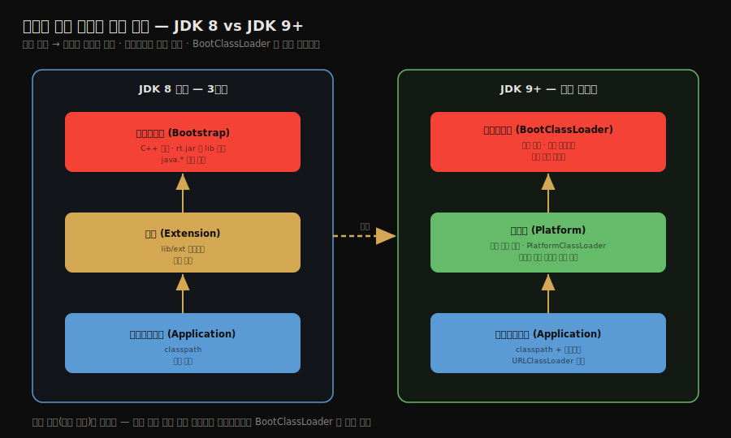

# 자바 모듈 시스템과 클래스 로더 변화
---
> §7.5~§7.6을 한 줄로 압축하면 — **JDK 9의 모듈 시스템(JPMS)은 캡슐화와 의존성을 모듈 단위로 명시하게 했고, 그 여파로 확장 클래스 로더가 플랫폼 클래스 로더로 교체되었습니다.** 핵심은 두 가지입니다. 모듈이 `requires`·`exports`로 *무엇을 쓰고 무엇을 공개할지*를 선언한다는 것과, 부모 위임의 *방향*은 그대로지만 *누가 어떤 클래스를 책임지는가*가 재편되었다는 것입니다.

이 글을 읽고 나면 모듈 선언의 다섯 키워드(`requires`·`exports`·`opens`·`uses`·`provides`)가 각각 무엇을 하는지 말하고, JDK 9에서 확장 로더가 플랫폼 로더로 바뀐 이유를 설명하며, 모듈화가 부모 위임 모델을 어떻게 건드렸는지 그림 없이 짚을 수 있습니다.


## 진입 — 왜 모듈 시스템이 필요했는가

> 클래스패스 시대에는 `public`이면 어디서든 접근 가능했습니다. 모듈 시스템은 이 *경계 없는 공개*를 막아, 패키지 단위로 무엇을 공개할지 선언하게 했습니다.

[부모 위임 모델](./02-04.클래스%20로더와%20부모%20위임%20모델.md)까지가 JDK 8 시대의 클래스 로딩이었습니다. 그 시대의 약점은 *캡슐화의 한계*였습니다. `public` 클래스는 클래스패스에 있기만 하면 누구나 접근할 수 있었고, 내부 구현용 클래스도 막을 방법이 없었습니다. JAR 지옥(같은 라이브러리의 다른 버전이 충돌)도 흔했습니다. JDK 9의 모듈 시스템(Project Jigsaw, JPMS)은 이 문제를 *모듈*이라는 새 경계로 풀었습니다.


## 1. 모듈 선언 — 다섯 키워드

> 모듈은 `module-info.java`에서 자신이 *무엇을 쓰고*(`requires`) *무엇을 공개할지*(`exports`)를 선언합니다. 선언하지 않은 패키지는 같은 모듈 안에 갇힙니다.

모듈은 패키지의 묶음이며, `module-info.java`에 의존성과 공개 범위를 명시합니다. 책 §7.5가 정리하는 다섯 키워드는 다음과 같습니다.

1. `requires`는 이 모듈이 *의존하는* 다른 모듈을 선언합니다. 선언한 모듈만 사용할 수 있습니다.
2. `exports`는 이 모듈이 *공개하는* 패키지를 선언합니다. 공개하지 않은 패키지의 `public` 클래스는 모듈 밖에서 접근 불가입니다. 이것이 모듈의 강한 캡슐화입니다.
3. `opens`는 *리플렉션 접근*을 허용하는 패키지를 선언합니다. `exports`가 컴파일·런타임 일반 접근이라면, `opens`는 프레임워크(Spring·Hibernate 등)가 리플렉션으로 내부에 닿게 열어 줍니다.
4. `uses`는 이 모듈이 *소비하는* 서비스 인터페이스를 선언합니다. SPI의 소비자 쪽입니다.
5. `provides`는 이 모듈이 *제공하는* 서비스 구현을 선언합니다(`provides X with Y`). SPI의 공급자 쪽입니다.

```java
// module-info.java 예시
module com.example.app {
    requires java.sql;                 // java.sql 모듈에 의존
    exports com.example.app.api;       // api 패키지만 외부 공개
    opens com.example.app.entity;      // entity 는 리플렉션용으로만 개방
    uses com.example.app.spi.Plugin;   // Plugin 서비스를 소비
    provides com.example.app.spi.Plugin
        with com.example.app.impl.DefaultPlugin;  // 구현 제공
}
```

`uses`·`provides`는 [앞 글에서 본 SPI](./02-04.클래스%20로더와%20부모%20위임%20모델.md)를 모듈 시스템이 정식으로 흡수한 형태입니다. 클래스패스 시대의 `META-INF/services` 파일 방식을 모듈 선언으로 끌어올린 셈입니다.


## 2. 모듈화 후 클래스 로더의 변화

> 모듈 시스템 도입으로 확장 클래스 로더가 플랫폼 클래스 로더로 교체되고, 부트스트랩의 역할이 축소되었습니다. 위임 방향은 그대로입니다.

모듈 시스템은 클래스 로더 계층에도 변화를 가져왔습니다. 3계층 구조 자체와 위임 방향(요청은 위로)은 유지되었지만, *누가 어떤 클래스를 책임지는가*가 재편되었습니다.



JDK 8과 JDK 9 이후의 차이는 세 가지입니다.

1. 확장 클래스 로더(Extension Class Loader)가 *플랫폼 클래스 로더(Platform Class Loader)*로 대체되었습니다. `lib/ext` 디렉터리 메커니즘이 사라지고, 그 자리를 모듈 기반 플랫폼 로더가 차지했습니다.
2. 부트스트랩 클래스 로더가 로딩하던 클래스 일부가 플랫폼·애플리케이션 로더로 옮겨갔습니다. 부트스트랩이 책임지는 범위가 핵심 모듈로 좁아졌습니다.
3. 부트스트랩 클래스 로더가 *자바로 구현된* `BootClassLoader` 형태로 바뀌었습니다. 이전에는 C++ 코드라 자바에서 `null`로만 보였는데, 모듈화 후에는 내부적으로 자바 클래스가 그 역할을 맡습니다.

또 하나의 변화는 애플리케이션 클래스 로더가 더 이상 `URLClassLoader`가 아니라는 점입니다. 이전 코드 중 애플리케이션 로더를 `URLClassLoader`로 캐스팅하던 부분은 JDK 9 이후 깨집니다. 모듈 경로를 함께 다루는 새 구현으로 바뀌었기 때문입니다.

세 로더는 여전히 부모 위임으로 협력합니다. 바뀐 것은 *위임의 방향이나 원리*가 아니라, *각 로더가 책임지는 클래스의 경계*와 *부트스트랩의 구현 언어*입니다.


## 3. 마치며 — 클래스 로딩이 떠받치는 것

> 클래스 로딩 메커니즘은 자바의 동적 확장성·격리·핫 디플로이를 떠받치는 토대이며, 모듈 시스템은 그 위에 강한 캡슐화를 더했습니다.

7장 전체를 한 흐름으로 묶으면, 클래스 로딩은 *바이트를 런타임에 읽어 검증하고 연결하고 초기화하는 과정*이며, 그 유연함이 자바 생태계의 동적 기능 대부분을 떠받칩니다. 클래스 로더의 부모 위임은 핵심 클래스의 유일성을 지키고, 사용자 정의 로더는 격리·핫 디플로이를 가능하게 합니다. JDK 9의 모듈 시스템은 여기에 *경계 있는 캡슐화*를 더해, 클래스패스 시대의 약한 접근 제어를 모듈 단위 선언으로 끌어올렸습니다.

모듈 시스템의 더 깊은 설계와 마이그레이션은 [모놀리식에서 모듈러로](../ch16_jpe-modular/01-01.모놀리식에서%20모듈러로%20—%20JPMS와%20모듈%20시스템.md)에서 이어집니다.


## 4. 면접 대비 요약

> 핵심은 "모듈 5키워드", "확장→플랫폼 로더 교체", "위임 방향은 불변, 책임 경계만 재편"입니다.

### 한 줄 정의

자바 모듈 시스템(JPMS)이란 패키지를 모듈로 묶어 `requires`·`exports`로 의존성과 공개 범위를 명시하게 한 강한 캡슐화 메커니즘이며, 그 도입으로 확장 클래스 로더가 플랫폼 클래스 로더로 교체되었습니다.

### 핵심 포인트 3가지

1. 모듈은 `requires`(의존)·`exports`(공개)·`opens`(리플렉션 개방)·`uses`/`provides`(서비스 소비·제공) 다섯 키워드로 경계를 선언합니다.
2. JDK 9에서 확장 클래스 로더가 플랫폼 클래스 로더로 대체되고, 부트스트랩이 자바 구현(`BootClassLoader`)으로 바뀌었습니다.
3. 부모 위임의 방향과 원리는 그대로이고, 바뀐 것은 각 로더의 책임 경계와 애플리케이션 로더가 더 이상 `URLClassLoader`가 아니라는 점입니다.

### 면접에서 받을 만한 질문

1. `exports`와 `opens`의 차이는 무엇입니까?
2. JDK 9에서 확장 클래스 로더가 플랫폼 클래스 로더로 바뀐 배경은 무엇입니까?
3. 모듈화가 부모 위임 모델 자체를 바꾸었습니까?

> 세 질문에 *먼저 자답한 뒤* 아래 §정답으로 내려갑니다.


## 정답 (자답 후 펼치기)

> 위 §면접에서 받을 만한 질문의 3개에 *먼저 자답한 뒤* 아래를 읽으세요.

### 정답 1 — exports vs opens

`exports`는 컴파일·런타임의 *일반 접근*을 위해 패키지를 공개합니다. 공개된 패키지의 `public` 멤버를 다른 모듈이 직접 호출할 수 있습니다. `opens`는 *리플렉션 접근*만 허용합니다. Spring·Hibernate 같은 프레임워크가 리플렉션으로 내부 필드·메서드에 닿아야 할 때, 일반 접근은 막되 리플렉션만 열어 주는 선택지입니다.

### 정답 2 — 확장 로더가 플랫폼 로더로 바뀐 배경

모듈 시스템 도입으로 `lib/ext` 확장 디렉터리 메커니즘이 사라졌기 때문입니다. 확장 라이브러리를 임의로 끼워 넣던 방식이 모듈의 강한 캡슐화와 맞지 않아 제거되었고, 그 자리를 모듈 기반의 플랫폼 클래스 로더가 대신하게 되었습니다. 동시에 부트스트랩이 책임지던 클래스 일부도 플랫폼·애플리케이션 로더로 재배치되었습니다.

### 정답 3 — 모듈화와 부모 위임

부모 위임 모델의 *방향과 원리는 바뀌지 않았습니다*. 요청이 위로 위임되고 부모가 못 찾을 때 자식이 로딩하는 흐름은 그대로입니다. 바뀐 것은 각 로더가 책임지는 클래스의 경계(확장→플랫폼 교체, 부트스트랩 범위 축소)와 부트스트랩의 구현 언어(C++ → 자바 `BootClassLoader`)입니다.


## 핵심 개념 체크리스트

- [ ] 모듈 선언 다섯 키워드(`requires`·`exports`·`opens`·`uses`·`provides`)를 말할 수 있는가?
- [ ] `exports`와 `opens`의 차이를 설명할 수 있는가?
- [ ] 확장 로더가 플랫폼 로더로 바뀐 이유를 아는가?
- [ ] 모듈화 후 부트스트랩 로더가 어떻게 바뀌었는지 설명할 수 있는가?
- [ ] 부모 위임의 *방향*은 그대로이고 *책임 경계*만 재편되었음을 아는가?


## 관련 문서

> 이 글로 7장 클래스 로딩 메커니즘이 마무리됩니다. 클래스 로더의 원리는 앞 글이, 모듈 시스템의 깊은 설계는 16장이 받습니다.

- [02-04. 클래스 로더와 부모 위임 모델](./02-04.클래스%20로더와%20부모%20위임%20모델.md) § "부모 위임 모델 깨뜨리기" — 모듈이 정식 흡수한 SPI
- [모놀리식에서 모듈러로 — JPMS와 모듈 시스템](../ch16_jpe-modular/01-01.모놀리식에서%20모듈러로%20—%20JPMS와%20모듈%20시스템.md) — 모듈 시스템의 설계와 마이그레이션 심화
- [02-01. 클래스 로딩 시점과 생명주기](./02-01.클래스%20로딩%20시점과%20생명주기.md) — 7장 전체 생명주기의 출발점
