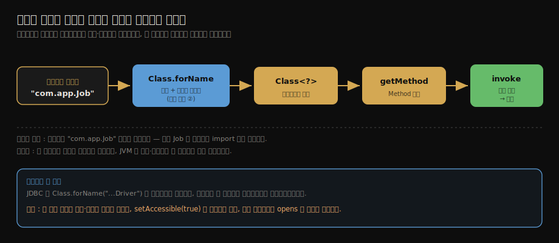

# 리플렉션과 동적 클래스 처리
---
> 리플렉션을 한 줄로 압축하면 — **컴파일 타임에 타입을 모르는 코드도, 클래스명 문자열 하나로 클래스를 로딩·초기화하고 그 메서드·필드에 런타임에 접근하게 해 주는 java.lang.reflect API** 입니다.
>
> 핵심 질문은 "코드에 타입을 적지 않고 어떻게 그 타입의 메서드를 부르는가"이며, 답은 클래스 로딩과 맞물립니다. `Class.forName` 이 클래스를 로딩하고, 그렇게 얻은 `Class` 객체에서 `Method`·`Field` 를 꺼내 호출합니다.

이 글을 읽고 나면 `Class.forName` → `getMethod` → `invoke` 흐름으로 동적 호출을 설명하고, `getMethod` 와 `getDeclaredMethod` 의 차이를 말하며, 리플렉션이 성능·캡슐화·모듈 시스템에서 치르는 대가를 근거와 함께 설명할 수 있습니다.


## 진입 — 컴파일 타임에 모르는 타입을 어떻게 부르는가

> 보통의 메서드 호출은 컴파일러가 타입을 알아야 합니다. 리플렉션은 그 전제를 깹니다 — 타입을 문자열로 미루고, 실행 중에 결정합니다.

`new Job().run()` 이라고 쓰려면 컴파일 시점에 `Job` 타입이 코드에 있어야 합니다. `javac` 가 `Job` 의 `run` 메서드가 존재하는지 검사하고, 바이트코드에 `invokevirtual Job.run` 을 박습니다. 타입이 코드에 박혀 있어야 부를 수 있는 구조입니다.

그런데 어떤 코드는 무슨 타입을 다룰지 컴파일 때 모릅니다. 플러그인 시스템은 설정 파일에 적힌 클래스명을 읽어 그 클래스를 띄우고, 프레임워크는 사용자가 만들 빈(bean)의 타입을 미리 알 수 없습니다. JDBC 는 어떤 드라이버가 깔릴지 컴파일 시점에 모릅니다.

리플렉션은 이 간극을 메웁니다. **타입을 코드에 적는 대신 `"com.app.Job"` 같은 문자열로 미루고, 실행 중에 그 문자열로 클래스를 찾아 메서드를 호출합니다.** 이게 가능한 이유는 [클래스 로딩이 런타임에 일어나기](./02-01.클래스%20로딩%20시점과%20생명주기.md) 때문입니다 — 컴파일 때 굳지 않으니, 실행 중에 새 클래스를 들여올 여지가 있습니다.




## 1. Class 객체에서 멤버를 꺼내기

> 리플렉션의 출발점은 `Class` 객체입니다. 거기서 `Method`·`Field`·`Constructor` 를 꺼냅니다.

모든 리플렉션은 `Class` 객체에서 시작합니다. `Class` 객체는 로딩된 클래스 하나의 메타데이터를 담은 핸들이고, 그 클래스가 가진 멤버를 조회하는 메서드를 제공합니다.

```java
Class<?> clazz = job.getClass();          // 인스턴스에서
Method run = clazz.getMethod("run");      // public 메서드 (상속 포함)
Field name = clazz.getDeclaredField("name"); // 이 클래스가 선언한 필드
Constructor<?> ctor = clazz.getConstructor(); // public 생성자
```

여기서 `getMethod` 와 `getDeclaredMethod` 의 차이가 헷갈리는 지점입니다. 둘은 *조회 범위*가 다릅니다.

- `getMethod(name)` 는 **public 멤버만** 보되, 부모에서 상속한 것까지 포함합니다. 외부에서 부를 수 있는 메서드를 찾는 쓰임입니다.
- `getDeclaredMethod(name)` 는 **이 클래스가 직접 선언한** 멤버를 접근 제어자와 무관하게 모두 봅니다. private 메서드도 잡히지만 상속한 것은 빠집니다.

이름이 비슷해 자주 뒤집어 쓰는데, "declared = 선언한 것 전부(접근 제어 무시), 비-declared = public + 상속분"으로 기억하면 갈리지 않습니다.


## 2. 동적 호출 — invoke 와 Field.get/set

> 멤버를 꺼냈으면 `invoke`·`get`·`set` 으로 실제 객체를 조작합니다. 첫 인자는 *대상 인스턴스* 입니다.

`Method` 객체는 "어떤 메서드인지"를 가리킬 뿐, 그 자체로는 아무 일도 하지 않습니다. 실제 호출은 `invoke` 가 합니다. 첫 인자로 *어느 인스턴스에서 부를지* 를 넘기고, 나머지가 메서드 인자입니다.

```java
Object result = run.invoke(job);              // job.run()
Object sum = add.invoke(calc, 1, 2);          // calc.add(1, 2)

name.set(job, "batch");                        // job.name = "batch"
Object v = name.get(job);                      // job.name 읽기

Object fresh = ctor.newInstance();             // new Job()
```

`static` 메서드라면 인스턴스가 필요 없으니 `invoke(null, ...)` 로 넘깁니다. 반환값은 항상 `Object` 라서, 호출하는 쪽이 캐스팅해 받습니다. 컴파일러가 타입을 모르니 당연한 귀결입니다 — 동적 호출의 대가로 정적 타입 검사를 포기한 셈입니다.

이 패턴이 프레임워크의 뼈대입니다. 스프링이 빈을 만들 때 `newInstance` 로 인스턴스를 찍고, 세터를 `invoke` 로 불러 의존성을 주입하는 일이 전부 여기서 일어납니다.


## 3. 클래스 로딩과 리플렉션의 결합

> 인스턴스조차 없을 때는 `Class.forName` 으로 클래스를 *로딩부터* 시작합니다. 이게 리플렉션과 클래스 로딩이 만나는 지점입니다.

앞 절은 `job.getClass()` 처럼 이미 인스턴스가 있는 경우였습니다. 그런데 인스턴스도, 타입도 코드에 없고 클래스명 문자열만 있다면 어떻게 시작할까요. `Class.forName(name)` 이 그 입구입니다.

```java
Class<?> clazz = Class.forName("com.app.Job"); // 로딩 + 초기화
Object job = clazz.getConstructor().newInstance();
clazz.getMethod("run").invoke(job);
```

`Class.forName` 은 단순 조회가 아닙니다. 그 클래스가 아직 로딩되지 않았다면 **로딩하고, 나아가 초기화까지 트리거**합니다. [클래스 로딩 시점](./02-01.클래스%20로딩%20시점과%20생명주기.md)에서 본 6가지 능동 참조 중 ② 리플렉션 호출이 바로 이 경우입니다 — `forName` 한 줄이 `<clinit>()` 을 돌립니다.

이 흐름의 대표 사례가 옛 JDBC 코드의 `Class.forName("com.mysql.cj.jdbc.Driver")` 입니다. 드라이버 클래스를 로딩하면 그 `static` 블록이 `DriverManager` 에 자신을 등록하는데, 등록을 일으키려고 일부러 클래스를 로딩하는 패턴이었습니다. 더 깊은 이야기 — 드라이버를 *누구의* 클래스 로더가 찾느냐는 [부모 위임 모델](./02-04.클래스%20로더와%20부모%20위임%20모델.md)의 SPI·TCCL 절과 이어집니다.


## 4. 리플렉션의 대가

> 강력한 만큼 비쌉니다. 성능·캡슐화·모듈 캡슐화 세 곳에서 비용을 치릅니다.

리플렉션은 공짜가 아닙니다. 편의의 대가로 세 가지를 내줍니다.

첫째는 **성능**입니다. 일반 호출은 바이트코드 `invokevirtual` 한 번이면 끝나지만 리플렉션은 매번 메서드를 이름으로 탐색하고 접근 권한을 확인합니다. JIT 컴파일러가 인라이닝하기도 어렵습니다. 한두 번이면 무시할 수 있어도 뜨거운 경로에서 반복되면 차이가 드러납니다.

둘째는 **캡슐화 위반**입니다. `setAccessible(true)` 를 부르면 private 멤버에도 접근할 수 있습니다. 테스트나 프레임워크에선 요긴하지만 클래스가 숨긴 내부를 외부가 마음대로 건드린다는 뜻이라, 캡슐화의 약속을 깨뜨립니다.

셋째는 **모듈 시스템과의 충돌**입니다. [자바 모듈 시스템](./02-05.자바%20모듈%20시스템과%20클래스%20로더%20변화.md)은 강한 캡슐화를 강제해서, 모듈이 `opens` 로 열어 주지 않은 패키지는 리플렉션으로도 뚫을 수 없습니다. JDK 9 이후 리플렉션에 의존하는 라이브러리들이 `InaccessibleObjectException` 을 만난 배경이 이것입니다. `opens`(런타임 리플렉션 허용)와 `exports`(컴파일 타임 접근 허용)가 갈리는 이유이기도 합니다.


## 5. 면접 대비 요약

> 핵심은 "`Class.forName`→`getMethod`→`invoke` 흐름"과 "리플렉션이 초기화를 트리거한다는 것", 그리고 "치르는 대가 세 가지"입니다.

### 한 줄 정의

리플렉션이란 컴파일 타임에 타입을 모르는 코드가 클래스명 문자열로 클래스를 로딩·초기화하고, 그 `Class` 객체에서 메서드·필드를 런타임에 조회·호출하게 해 주는 `java.lang.reflect` 기능을 말합니다.

### 핵심 포인트 3가지

1. 출발점은 `Class` 객체이고, 인스턴스가 없으면 `Class.forName` 이 로딩부터 시작합니다. `forName` 은 능동 참조 ②라서 초기화까지 트리거합니다.
2. `getMethod` 는 public + 상속분을, `getDeclaredMethod` 는 이 클래스가 선언한 것 전부(접근 제어 무시)를 봅니다. 호출은 `Method.invoke(인스턴스, 인자…)` 입니다.
3. 대가는 셋입니다. 성능(매 호출 탐색·권한 확인), 캡슐화 위반(`setAccessible`), 모듈 시스템에서 `opens` 필요입니다.

### 면접에서 받을 만한 질문

1. `Class.forName("X")` 는 클래스 초기화를 일으킵니까? 일으킨다면 어느 능동 참조에 해당합니까?
2. `getMethod` 와 `getDeclaredMethod` 는 무엇이 다릅니까?
3. JDK 9 이후 리플렉션이 막히는 경우가 생긴 이유와 `opens` 의 역할은 무엇입니까?

> 세 질문에 *먼저 스스로 답해 본 뒤* 아래 §정답으로 내려갑니다. 자답 없이 읽으면 학습 효과가 줄어듭니다.


## 정답 (자답 후 펼치기)

> 위 §면접에서 받을 만한 질문의 3개에 *먼저 자답한 뒤* 아래를 읽으세요.

### 정답 1 — forName 과 초기화

`Class.forName("X")` 는 기본형이 `X` 를 로딩하고 *초기화까지* 수행합니다. 클래스 로딩 6가지 능동 참조 중 ② 리플렉션 호출에 해당해, `forName` 한 줄이 `X` 의 `<clinit>()` 을 돌립니다. 초기화를 피하려면 `Class.forName("X", false, loader)` 처럼 초기화 플래그를 `false` 로 넘기면 됩니다 — 로딩은 하되 초기화는 미룹니다.

### 정답 2 — getMethod vs getDeclaredMethod

`getMethod` 는 **public 멤버만** 보되 부모에서 상속한 것까지 포함합니다. `getDeclaredMethod` 는 **이 클래스가 직접 선언한** 멤버를 접근 제어자와 무관하게(private 포함) 보지만 상속분은 제외합니다. "declared = 선언한 것 전부, 비-declared = public + 상속"으로 갈립니다.

### 정답 3 — 모듈 시스템과 opens

JDK 9 모듈 시스템이 강한 캡슐화를 강제하면서, 모듈이 `opens` 로 명시적으로 열지 않은 패키지는 리플렉션 접근이 막혀 `InaccessibleObjectException` 이 납니다. `exports` 가 컴파일 타임 접근(타입을 코드에서 참조)을 허용한다면, `opens` 는 런타임 리플렉션 접근(`setAccessible` 포함)을 허용합니다. 둘은 여는 대상이 다릅니다.


## 핵심 개념 체크리스트

- [ ] `Class.forName` → `getMethod` → `invoke` 동적 호출 흐름을 코드로 쓸 수 있는가?
- [ ] `Class.forName` 이 초기화를 트리거하며 능동 참조 ②에 해당함을 아는가?
- [ ] `getMethod` 와 `getDeclaredMethod` 의 조회 범위 차이를 설명할 수 있는가?
- [ ] `Method.invoke` 의 첫 인자가 대상 인스턴스(static 이면 null)임을 아는가?
- [ ] 리플렉션의 대가 셋(성능·캡슐화·`opens`)을 근거와 함께 말할 수 있는가?


## 관련 문서

> 리플렉션은 클래스 로딩 위에 서는 기능이라, 로딩의 *시점*·*주체*·*캡슐화* 세 편과 직접 이어집니다.

- [02-01. 클래스 로딩 시점과 생명주기](./02-01.클래스%20로딩%20시점과%20생명주기.md) § "6가지 능동 참조" — `Class.forName` 이 초기화를 트리거하는 ②번 경로
- [02-04. 클래스 로더와 부모 위임 모델](./02-04.클래스%20로더와%20부모%20위임%20모델.md) § "SPI와 스레드 컨텍스트 클래스 로더" — JDBC 드라이버 로딩이 위임을 거스르는 사례
- [02-05. 자바 모듈 시스템과 클래스 로더 변화](./02-05.자바%20모듈%20시스템과%20클래스%20로더%20변화.md) § "강한 캡슐화" — `opens` 가 리플렉션을 열어 주는 키워드
