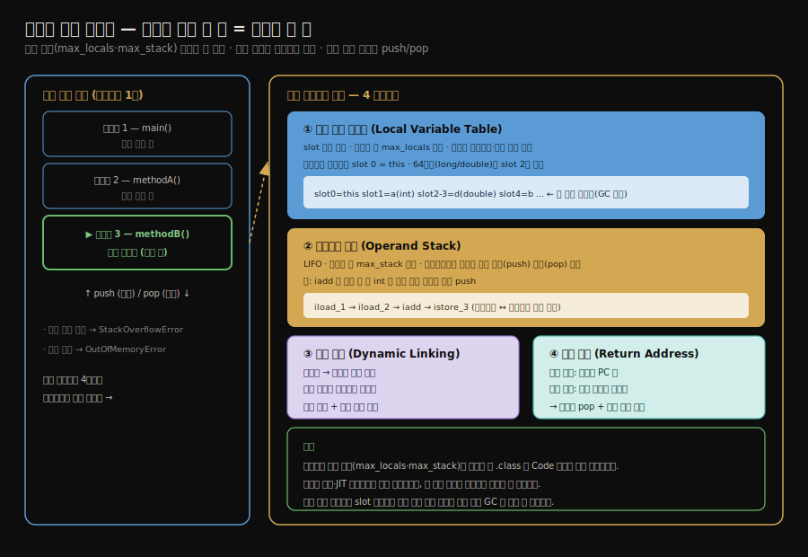

# 런타임 스택 프레임 구조
---
> §8.1~§8.2를 한 줄로 압축하면 — **메서드 호출 한 번은 스택 프레임 하나에 대응하며, 프레임은 지역 변수 테이블·피연산자 스택·동적 링크·반환 주소로 구성되고 그 크기는 컴파일 시점에 확정됩니다.** 핵심은 "프레임 크기가 런타임 데이터가 아니라 컴파일 결과로 정해진다"는 것과, "지역 변수 테이블의 slot 재사용이 GC를 늦출 수 있다"는 함정입니다.

이 글을 읽고 나면 스택 프레임의 네 구성요소를 말하고, 지역 변수 테이블의 slot이 어떻게 재사용되며 왜 그것이 GC에 영향을 주는지 설명하며, 피연산자 스택이 바이트코드 계산에서 어떤 역할을 하는지 그림 없이 짚을 수 있습니다.


## 진입 — 실행 엔진은 무엇을 실행하는가

> 클래스 로딩이 *바이트를 메모리에 올리는* 일이었다면, 실행 엔진은 *그 바이트코드를 실제로 돌리는* 일입니다. 그 무대가 스택 프레임입니다.

[7장의 클래스 로딩](./02-01.클래스%20로딩%20시점과%20생명주기.md)이 `.class`를 메모리에 적재하고 초기화하는 과정이었다면, 8장은 *적재된 바이트코드를 실행하는 엔진*을 다룹니다. 물리 머신의 실행 엔진은 CPU 하드웨어 위에 직접 구현되지만, 가상 머신의 실행 엔진은 소프트웨어로 구현되어 하드웨어에 얽매이지 않는 명령어 집합과 실행 모델을 자유롭게 정의할 수 있습니다.

그 실행의 기본 단위가 *스택 프레임(stack frame)*입니다. 메서드가 호출될 때마다 프레임 하나가 만들어져 가상 머신 스택에 쌓이고, 메서드가 끝나면 프레임이 사라집니다.


## 1. 스택 프레임의 전체 구조

> 메서드 호출 한 번이 스택 프레임 한 칸이며, 프레임은 지역 변수 테이블·피연산자 스택·동적 링크·반환 주소로 구성됩니다. 실행 중인 메서드의 프레임만 활성(현재 프레임)입니다.

스택 프레임은 메서드의 실행과 데이터를 담는 자료구조이며, 가상 머신 스택의 요소입니다. 메서드가 호출되는 순간부터 끝날 때까지, 프레임 하나가 가상 머신 스택에 *밀려 들어가고(push)* 다시 *빠져나오는(pop)* 과정에 대응합니다.



여기서 중요한 성질은 프레임 크기가 *컴파일 시점에 확정*된다는 점입니다. 지역 변수 테이블의 크기(`max_locals`)와 피연산자 스택의 깊이(`max_stack`)가 [클래스 파일](../ch06_class-file/01-01.클래스%20파일%20구조.md)의 Code 속성에 박혀 있어, 런타임 데이터나 가상 머신 구현과 무관하게 미리 정해집니다. 덕분에 메서드 하나가 스택에서 얼마를 쓸지 컴파일 시점에 계산할 수 있습니다.

한 스레드의 가상 머신 스택에는 여러 프레임이 쌓이지만, 실행 엔진이 다루는 것은 *맨 위의 프레임 하나*뿐입니다. 이를 *현재 프레임(current frame)*이라 하고, 그 프레임이 가리키는 메서드를 *현재 메서드*라 합니다.


## 2. 지역 변수 테이블 — slot과 재사용

> 지역 변수 테이블은 메서드 파라미터와 지역 변수를 담는 slot 단위 배열입니다. 핵심은 slot이 재사용된다는 점과, 그 재사용이 GC를 늦출 수 있다는 함정입니다.

지역 변수 테이블(local variable table)은 메서드의 파라미터와 메서드 안에서 선언한 지역 변수를 담는 저장 공간입니다. 단위는 *slot(변수 슬롯)*이며, `boolean`·`byte`·`char`·`short`·`int`·`float`·`reference`·`returnAddress`처럼 32비트 이하 자료형은 slot 한 칸을, `long`·`double` 같은 64비트 자료형은 *연속된 slot 두 칸*을 차지합니다.

인스턴스 메서드(비static 메서드)에서는 slot 0번이 항상 `this`를 가리킵니다. 그래서 인스턴스 메서드 안에서 별도 선언 없이 `this`에 접근할 수 있습니다.

### slot 재사용과 GC 영향

지역 변수 테이블의 slot은 *재사용*됩니다. 어떤 지역 변수의 유효 범위(scope)가 끝나면, 그 자리를 이후에 선언된 다른 변수가 물려받습니다. 이 재사용이 메모리를 아끼지만, 한 가지 함정을 만듭니다.

```java
public static void main(String[] args) {
    {
        byte[] placeholder = new byte[64 * 1024 * 1024];   // 64MB 점유
    }
    // placeholder 의 scope 는 끝났지만 slot 은 아직 그 참조를 들고 있음
    System.gc();   // 이 시점에 placeholder 가 회수될까?
}
```

이 코드에서 `System.gc()`를 호출해도 `placeholder`의 64MB는 회수되지 않습니다. 블록을 벗어나 `placeholder`의 scope는 끝났지만, 그 slot이 *아직 재사용되지 않아* 객체 참조를 그대로 들고 있기 때문입니다. GC는 그 slot에서 객체로 이어지는 참조 사슬이 살아 있다고 보고 회수하지 않습니다.

```java
public static void main(String[] args) {
    {
        byte[] placeholder = new byte[64 * 1024 * 1024];
    }
    int a = 0;        // 새 변수 a 가 placeholder 의 slot 을 재사용
    System.gc();      // 이제 placeholder 의 참조가 끊겨 회수됨
}
```

`int a = 0`을 추가해 그 slot을 *다른 변수가 덮어쓰게* 하면, 비로소 `placeholder`로의 참조가 끊겨 GC가 64MB를 회수합니다. 실무에서 큰 객체를 다 쓴 뒤 명시적으로 `null`을 대입하라는 조언이 여기서 나옵니다. 다만 이는 slot 재사용이 일어나지 않는 특수한 상황의 이야기이고, 적절히 변수가 덮이는 일반 코드에서는 신경 쓸 필요가 없습니다.


## 3. 피연산자 스택 — 계산의 작업대

> 피연산자 스택은 바이트코드가 값을 밀고 당기며 계산하는 LIFO 작업대입니다. 지역 변수 테이블과 값을 주고받으며 메서드의 모든 연산이 여기서 일어납니다.

피연산자 스택(operand stack)은 바이트코드 명령어가 데이터를 *밀어 넣고 꺼내며* 계산하는 후입선출(LIFO) 구조입니다. 깊이의 최댓값(`max_stack`) 역시 컴파일 시점에 확정됩니다.

자바 바이트코드는 *스택 기반*이라, 모든 연산이 피연산자 스택을 거칩니다. 예를 들어 두 정수를 더하는 과정은 다음과 같습니다.

```
iload_1    // 지역변수 slot1 의 int 를 피연산자 스택에 push
iload_2    // 지역변수 slot2 의 int 를 push
iadd       // 스택 위 두 int 를 pop 해서 더하고 결과를 push
istore_3   // 결과를 pop 해서 지역변수 slot3 에 저장
```

지역 변수 테이블과 피연산자 스택 사이를 값이 왕복합니다. 변수에서 스택으로 올리고(`iload`), 계산하고(`iadd`), 다시 변수로 내립니다(`istore`). 이 스택 기반 모델이 레지스터 기반과 어떻게 다른지는 [스택 기반 해석 엔진 글](./03-05.스택%20기반%20해석%20실행%20엔진.md)에서 자세히 봅니다.


## 4. 동적 링크와 반환 주소

> 동적 링크는 프레임을 런타임 상수 풀의 메서드 참조에 연결하고, 반환 주소는 메서드가 끝난 뒤 호출 지점으로 돌아갈 자리를 담습니다.

### 동적 링크

각 스택 프레임은 *런타임 상수 풀*에서 그 프레임이 속한 메서드로의 참조를 가집니다. 이 참조를 *동적 링크(dynamic linking)*라 합니다. 바이트코드의 메서드 호출 명령은 상수 풀의 심볼 참조를 대상으로 삼는데, 이 심볼 참조의 일부는 클래스 로딩의 해석 단계에 직접 참조로 바뀌고(정적 해석), 일부는 실행 중에 비로소 바뀝니다(동적 해석). 동적 링크가 이 두 방식을 모두 지원합니다. 이것이 [다음 글의 메서드 디스패치](./03-02.메서드%20호출%20—%20해석과%20정적·동적%20디스패치.md)와 직결됩니다.

### 반환 주소

메서드가 끝나는 방법은 두 가지입니다. 정상적으로 반환 명령(`return` 계열)을 만나거나, 처리되지 못한 예외로 끝나는 경우입니다. 어느 쪽이든 메서드가 끝나면 *호출자에게 돌아가야* 합니다. 반환 주소(return address)는 이때 돌아갈 위치, 즉 호출자의 PC 값을 담습니다. 메서드가 끝나면 현재 프레임이 pop되고, 반환 주소를 따라 호출 지점으로 실행이 복귀합니다.


## 5. 면접 대비 요약

> 핵심은 "프레임 4요소", "프레임 크기는 컴파일 때 확정", "slot 재사용이 GC를 늦춘다"입니다.

### 한 줄 정의

스택 프레임이란 메서드 호출 하나에 대응하는 메모리 단위로, 지역 변수 테이블·피연산자 스택·동적 링크·반환 주소를 담아 가상 머신 스택에 쌓이는 자료구조를 말합니다.

### 핵심 포인트 3가지

1. 메서드 호출 한 번이 스택 프레임 한 칸이며, 프레임 크기(`max_locals`·`max_stack`)는 컴파일 시점에 Code 속성으로 확정됩니다.
2. 지역 변수 테이블은 slot 단위이고 64비트 자료형은 slot 두 칸을 쓰며, slot 0은 인스턴스 메서드에서 `this`입니다.
3. slot 재사용이 안 일어나면 끝난 객체 참조가 살아남아 GC가 늦춰지므로, 큰 객체는 명시적 `null` 대입이 도움이 될 수 있습니다.

### 면접에서 받을 만한 질문

1. 스택 프레임의 크기는 언제 결정됩니까?
2. 지역 변수 테이블의 slot 재사용이 GC에 어떤 영향을 줍니까?
3. 피연산자 스택과 지역 변수 테이블은 어떻게 협력합니까?

> 세 질문에 *먼저 자답한 뒤* 아래 §정답으로 내려갑니다.


## 정답 (자답 후 펼치기)

> 위 §면접에서 받을 만한 질문의 3개에 *먼저 자답한 뒤* 아래를 읽으세요.

### 정답 1 — 프레임 크기 결정 시점

*컴파일 시점*입니다. 지역 변수 테이블 크기 `max_locals`와 피연산자 스택 깊이 `max_stack`이 `.class` 파일의 Code 속성에 박혀 있어, 런타임 데이터나 가상 머신 구현과 무관하게 메서드를 컴파일할 때 확정됩니다. 그래서 메서드가 스택에서 쓸 메모리를 정적으로 계산할 수 있습니다.

### 정답 2 — slot 재사용과 GC

지역 변수의 scope가 끝나도 그 slot이 *다른 변수에 의해 재사용되기 전까지는* 객체 참조를 그대로 들고 있습니다. GC는 그 slot에서 이어지는 참조 사슬이 살아 있다고 보아 객체를 회수하지 않습니다. 그래서 큰 객체를 다 쓴 뒤 slot이 덮이지 않는 코드에서는 명시적 `null` 대입이 회수를 앞당길 수 있습니다.

### 정답 3 — 피연산자 스택과 지역 변수 테이블의 협력

자바 바이트코드는 스택 기반이라, 지역 변수의 값을 피연산자 스택으로 올려(`iload`) 계산한 뒤(`iadd`) 다시 지역 변수로 내립니다(`istore`). 변수는 *저장소*, 피연산자 스택은 *계산 작업대* 역할이라, 둘 사이를 값이 왕복하며 메서드의 모든 연산이 이루어집니다.


## 핵심 개념 체크리스트

- [ ] 스택 프레임의 네 구성요소를 말할 수 있는가?
- [ ] 프레임 크기가 컴파일 시점에 확정되는 이유를 설명할 수 있는가?
- [ ] slot의 의미와 64비트 자료형의 slot 점유를 아는가?
- [ ] slot 재사용이 GC를 늦추는 메커니즘을 예제로 설명할 수 있는가?
- [ ] 피연산자 스택이 스택 기반 연산에서 하는 역할을 아는가?


## 관련 문서

> 이 글은 실행의 *무대*인 프레임을 다뤘고, 다음 글은 그 위에서 *메서드를 어떻게 골라 호출하는가*로 넘어갑니다.

- [03-02. 메서드 호출 — 해석과 정적·동적 디스패치](./03-02.메서드%20호출%20—%20해석과%20정적·동적%20디스패치.md) — 동적 링크가 메서드를 고르는 방식
- [03-05. 스택 기반 해석 실행 엔진](./03-05.스택%20기반%20해석%20실행%20엔진.md) — 피연산자 스택이 실제 바이트코드를 실행하는 모습
- [클래스 파일 구조](../ch06_class-file/01-01.클래스%20파일%20구조.md) § "속성 테이블" — 프레임 크기가 박히는 Code 속성
