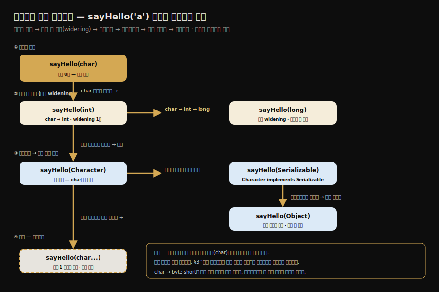
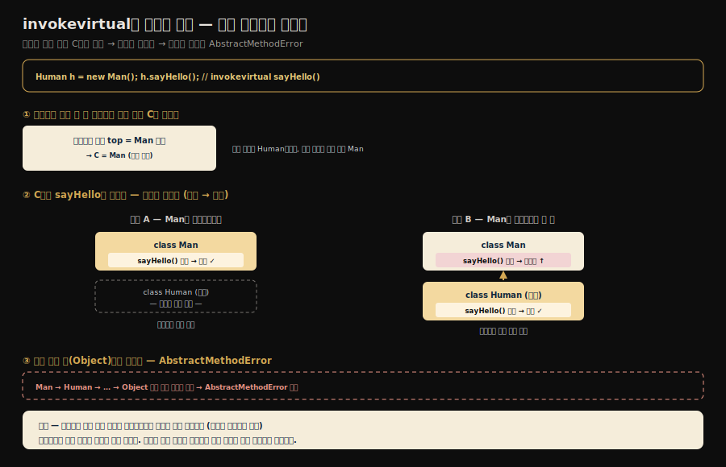
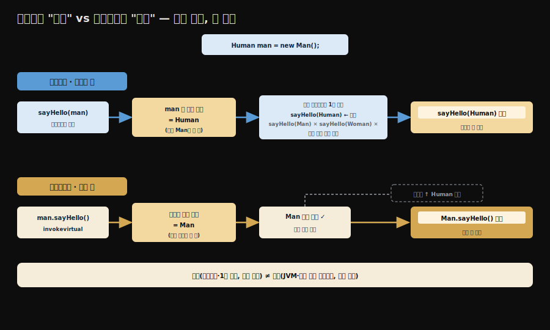
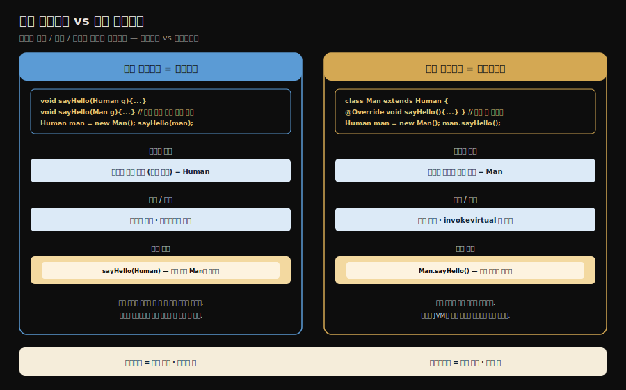
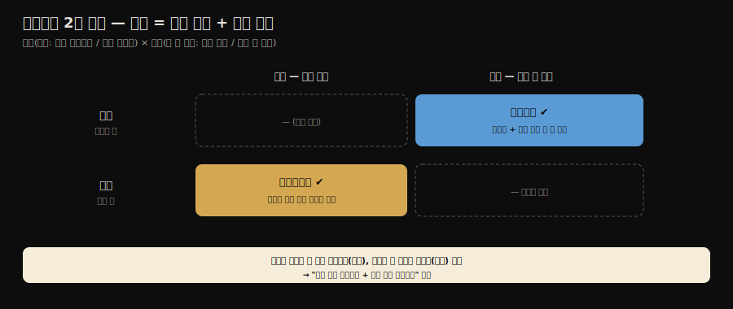
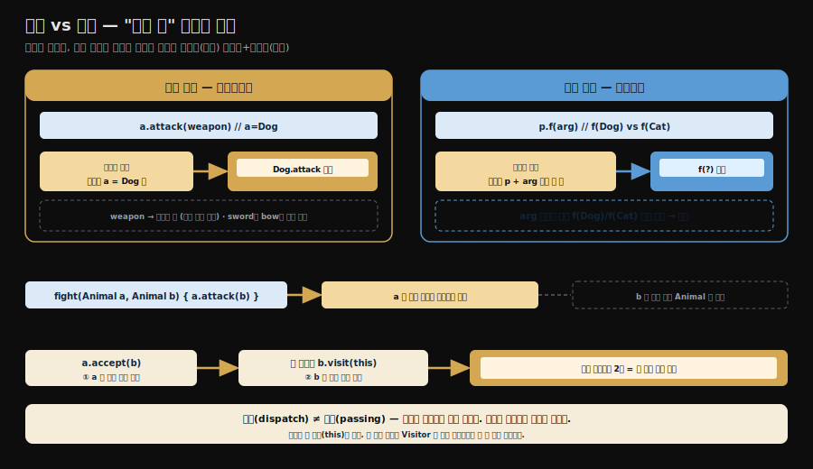
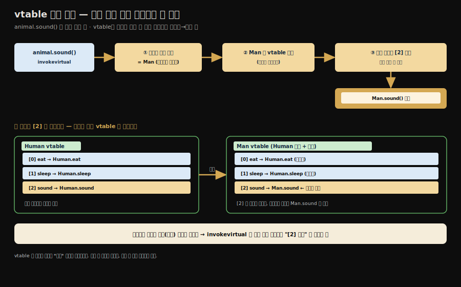
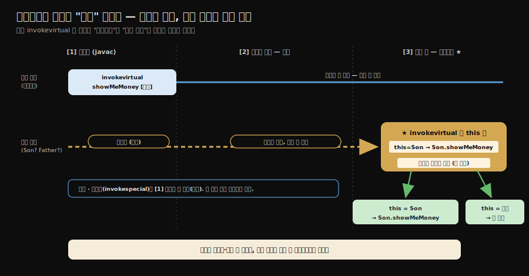

# 메서드 호출 — 디스패치 완전 정복
---
> §8.3.1~§8.3.2를 한 줄로 압축하면 — **메서드 호출은 호출 대상이 실행 중에 갈라지지 않아 일찍 확정되는 해석과, 실행 중 수신자를 보고 고르는 디스패치로 나뉘며, 디스패치는 다시 정적/동적(언제 고르나)과 단일/다중(몇 개를 보고 고르나) 두 축으로 갈립니다.**
>
> 핵심은 "오버로딩은 *정적 타입*으로 컴파일 때, 오버라이딩은 *실제 타입*으로 실행 중에 결정된다"는 한 문장이며, 이것이 자바 다형성의 뿌리입니다. 자바는 두 축을 곱해 **정적 다중 + 동적 단일 디스패치 언어**로 분류되고, 동적 호출은 클래스마다 둔 *가상 메서드 테이블(vtable)*이 가속합니다.

이 글을 읽고 나면 5종 메서드 호출 바이트코드를 구분하고, 오버로딩과 오버라이딩이 각각 어느 타입을 기준으로 호출 버전을 고르는지 예제로 설명하며, `invokevirtual`의 수신자 탐색과 vtable 가속을 그림 없이 짚고, 자바가 왜 "정적 다중 + 동적 단일"인지와 필드가 오버라이딩되지 않는 이유까지 한 흐름으로 말할 수 있습니다.


## 진입 — 호출 대상은 언제 정해지는가

> 메서드를 호출하는 코드는 "어느 메서드를 부를지"를 컴파일 때 못 박을 수도, 실행 중에 골라야 할 수도 있습니다. 이 둘의 갈림이 자바 다형성의 핵심입니다.

[앞 글](./03-01.런타임%20스택%20프레임%20구조.md)에서 본 동적 링크는 프레임을 런타임 상수 풀의 메서드 참조에 연결했습니다. 그런데 그 참조가 가리키는 *실제 메서드 버전*은 언제 정해질까요?

`static` 메서드처럼 호출 대상이 실행 중에 바뀌지 않는 것은 일찍 확정할 수 있지만, 오버라이딩된 메서드는 실행 중 객체의 실제 타입을 봐야 정해집니다. 메서드 호출은 이 두 갈래로 나뉩니다.

> 여기서 "일찍 확정한다"를 한 단어로 뭉뚱그리지 않고 세 층으로 나눠 봅니다. 
>
> - **컴파일러(`javac`)는 상수 풀에 *심볼 참조*(어떤 이름·디스크립터의 메서드인가)만 남깁니다.** 그 심볼 참조를 *직접 참조*로 바꾸는 일은 JVM 링킹의 **resolution** 단계가 하고, 오버라이딩된 *실제 구현*을 고르는 일은 **런타임 디스패치**가 합니다. 
> - 비가상 메서드는 두 번째 층(resolution)에서 끝나 세 번째 층이 필요 없을 뿐, "컴파일 때 직접 참조까지 확정된다"는 말은 정확하지 않습니다.


## 1. 해석 — 컴파일 때 버전이 정해지는 호출

> 해석은 컴파일러가 상수 풀에 박아둔 심볼 참조를, JVM이 링킹의 resolution 단계에서 직접 참조로 바꾸는 과정입니다. `invokestatic`·`invokespecial`처럼 가상 디스패치로 갈라지지 않는 호출이 대상입니다.

**해석(resolution)은 컴파일러가 상수 풀에 남긴 심볼 참조를, JVM이 *링킹의 resolution 단계에서* 직접 참조로 바꾸는 과정입니다.** 단, 이것이 가능하려면 그 메서드가 *실행 중 수신자의 실제 타입에 따라 다른 구현으로 갈라지지 않아야* 합니다. 

해석 이후 호출 대상이 하나로 고정되는 메서드를 *비가상 메서드(non-virtual method)*라 부르며, 다음이 해당합니다.

1. `static` 메서드 — 클래스에 묶여 있어 인스턴스와 무관합니다.
2. `private` 메서드 — 외부에서 접근 불가라 오버라이딩될 수 없습니다.
3. 인스턴스 생성자 — 특정 클래스의 것으로 고정됩니다.
4. `super`로 호출하는 부모 메서드 — 대상 부모가 명시됩니다.
5. `final` 메서드 — *오버라이딩으로 다른 구현에 도달할 수 없어* 비가상으로 취급됩니다. 
   - 단 일반 인스턴스 메서드 형태라면 바이트코드는 여전히 `invokevirtual`일 수 있습니다
   - final`은 "호출 명령이 비가상"이라기보다 "실제 타입이 무엇이든 같은 구현에 닿는" 메서드라고 이해해야 언어 의미와 바이트코드가 분리됩니다.

이들을 호출하는 바이트코드는 `invokestatic`(static 메서드)과 `invokespecial`(생성자·private·super)입니다. 이 두 명령으로 호출되는 메서드는 모두 수신자의 실제 타입과 무관하게 *대상이 하나로* 정해지므로, 컴파일러가 심볼 참조만 박아두면 클래스 로딩의 해석 단계에서 직접 참조로 바뀝니다.

자바의 메서드 호출 바이트코드는 모두 다섯 종류입니다. 해석으로 풀리는 둘(`invokestatic`·`invokespecial`), 수신자의 실제 타입에 따라 실행 중 동적 디스패치하는 둘(`invokevirtual`·`invokeinterface`), 그리고 별도 축인 `invokedynamic`으로 나뉩니다. `invokedynamic`은 수신자 타입 기반 디스패치가 아니라, 호출 지점의 링크를 부트스트랩 메서드와 `CallSite`가 정하는 명령이라 앞의 둘과 메커니즘이 다릅니다.

| 바이트코드 | 호출 대상 | 대상 확정 시점 |
|-----------|----------|--------------|
| `invokestatic` | static 메서드 | 컴파일 때 (해석) |
| `invokespecial` | 생성자·private·super 호출 | 컴파일 때 (해석) |
| `invokevirtual` | 일반 인스턴스 메서드 (오버라이딩 대상) | 실행 중 (동적 디스패치) |
| `invokeinterface` | 인터페이스 메서드 | 실행 중 (동적 디스패치) |
| `invokedynamic` | 런타임에 호출 지점을 결정 (람다·동적 언어) | 실행 중 (부트스트랩 메서드 + `CallSite`로 링크) |

차이의 본질은 *호출 대상을 정하는 규칙을 누가 쥐느냐*입니다. `invokevirtual`·`invokeinterface`는 결정 규칙(수신자의 실제 타입을 따라간다)이 **JVM에 고정**돼 있어, 자바든 코틀린이든 같은 규칙으로 풀립니다. 반면 `invokedynamic`은 그 결정 로직을 **언어(컴파일러)가 부트스트랩 메서드로 짜 넣고**, JVM은 첫 호출 때 그 부트스트랩 메서드를 한 번 불러 결과를 `CallSite`에 묶을 뿐입니다. 자바 람다는 `LambdaMetafactory`를, JRuby 같은 동적 언어는 각자의 부트스트랩 메서드를 제공합니다. 그래서 `invokedynamic`은 *언어가 JVM에 호출 의미를 주입하는 통로*이며, JVM이 동적 타입 언어를 1급으로 지원하려고 들인 명령입니다.

> `invokedynamic`은 호출 대상을 언어가 심은 부트스트랩 메서드가 실행 중에 정하는 가장 유연한 명령으로, [03-03. 동적 타입 언어 지원과 invokedynamic](./03-03.동적%20타입%20언어%20지원과%20invokedynamic.md)에서 다룹니다. 이 글은 앞의 넷을 다룹니다.


## 2. 디스패치

> **디스패치는 한마디로 말하면 "어떤 메서드를 실제로 실행할지 결정하는 과정**"입니다. 이 결정을 컴파일/실행 시점에 하느냐, 결정 기준이 단일/다중인지에 따라 나뉩니다.
>
> - 디스패치 과정은 자바 가상 머신에서 '오버로딩'과 '오버라이딩'이 구현되는 방식처럼 다형성이라는 특성의 가장 기본에 해당하는 내용입니다.

```java
// 메서드 호출
animal.sound();

// JVM 입장에서는 아래를 고민
Dog.sound()를 호출할까?
Cat.sound()를 호출할까?
Animal.sound()를 호출할까?
```


## 3. 정적 디스패치 — 오버로딩

> **정적 디스패치는 인자의 *정적 타입(선언 타입)*만 보고 컴파일 때 호출 버전을 고릅니다**. 메서드 오버로딩이 이 방식입니다.

디스패치(dispatch)는 같은 이름의 메서드 여러 버전 중 하나를 고르는 일입니다. 그중 *정적 디스패치(static dispatch)*는 컴파일 시점에 인자의 정적 타입을 기준으로 버전을 고르며, 메서드 오버로딩이 이 방식으로 동작합니다.

```java
public class StaticDispatch {
    static abstract class Human {}
    static class Man extends Human {}
    static class Woman extends Human {}

    public void sayHello(Human guy) { System.out.println("hello, guy!"); }
    public void sayHello(Man guy)   { System.out.println("hello, gentleman!"); }
    public void sayHello(Woman guy) { System.out.println("hello, lady!"); }

    public static void main(String[] args) {
        // 정적 타입은 Human, 실제 타입은 각각 Man·Woman
        Human man = new Man();
        Human woman = new Woman();
        StaticDispatch sr = new StaticDispatch();
      
        sr.sayHello(man);     // 무엇이 호출될까?
        sr.sayHello(woman);
    }
}
```

- 출력은 둘 다 `hello, guy!`입니다. `man`과 `woman`의 *정적 타입*이 모두 `Human`이기 때문입니다. 변수의 정적 타입은 컴파일 시점에 알 수 있고 변하지 않습니다. 
- 컴파일러는 오버로딩된 세 버전 중 인자의 *정적 타입*에 맞는 `sayHello(Human)`을 고릅니다. 실제 타입이 `Man`·`Woman`이라는 사실은 정적 디스패치에서 무시됩니다.

여기서 핵심은 *정적 타입은 컴파일 시점에 알 수 있고, 실제 타입은 실행 중에 정해진다*는 구분입니다. 오버로딩은 전자만 봅니다.

### 3-1. 오버로딩 해소 우선순위 — 더 "적합한" 버전 고르기

> 위 예제는 후보가 *하나뿐*이라 단순했습니다. 그런데 인자 하나가 여러 버전에 *동시에* 들어맞을 수 있다면, 컴파일러는 어느 것을 더 적합하다고 볼까요. 이 순서가 정적 디스패치의 진짜 규칙입니다.

`sayHello(Human)` 하나만 적용 가능했던 앞 예제와 달리, 실무에서는 한 인자가 여러 오버로딩 버전에 걸칩니다. 이럴 때 컴파일러는 *"가장 덜 변환해도 되는"* 버전을 고릅니다. 같은 이름의 메서드를 자료형만 바꿔 잔뜩 늘어놓고, 인자 하나를 던져 *어느 것이 선택되는지* 를 보면 그 우선순위가 드러납니다.

```java
import java.io.Serializable;

public class Overload {
    public static void sayHello(Object arg)       { System.out.println("Hello Object"); }
    public static void sayHello(int arg)          { System.out.println("Hello int"); }
    public static void sayHello(long arg)         { System.out.println("Hello long"); }
    public static void sayHello(Character arg)    { System.out.println("Hello Character"); }
    public static void sayHello(char arg)         { System.out.println("Hello char"); }
    public static void sayHello(char... arg)      { System.out.println("Hello char ..."); }
    public static void sayHello(Serializable arg) { System.out.println("Hello Serializable"); }

    public static void main(String[] args) {
        sayHello('a');   // 리터럴 'a' 의 정적 타입은 char
    }
}
```

리터럴 `'a'`의 정적 타입은 `char`입니다. 위에서 버전을 *하나씩 주석 처리해 지워가며* 다시 실행하면, 컴파일러가 후보를 어떤 순서로 양보하는지 한 단계씩 보입니다.

| 단계 | 남은 후보 중 선택 | 왜 그 버전인가 |
|------|------------------|----------------|
| 1 | `Hello char` | 인자 타입과 *정확히 일치* — 변환이 전혀 없으니 가장 적합 |
| 2 | `Hello int` | `char`를 안전하게 넓힐 수 있는 첫 타입. *자동 형 변환(widening)* 1회 |
| 3 | `Hello long` | `char → int → long`으로 *연쇄 widening*. 멀수록 덜 적합 |
| 4 | `Hello Character` | 더 넓힐 정수형이 없자 *오토박싱* — `char`를 래퍼 `Character`로 |
| 5 | `Hello Serializable` | 박싱 후, 래퍼가 *구현한 인터페이스*. `Character implements Serializable` |
| 6 | `Hello Object` | 인터페이스도 없으면 *상위 클래스*. 모든 타입의 조상이라 가장 덜 적합 |
| 7 | `Hello char ...` | 마지막은 *가변인자(varargs)*. 우선순위가 가장 낮아 다른 후보가 모두 사라져야 선택 |

이 순서를 한 문장으로 묶으면 **정확히 일치 → 자동 형 변환(widening) → 오토박싱 → 인터페이스 → 상위 클래스 → 가변인자**입니다. "변환을 적게 할수록 적합하다"는 한 원리가 일곱 단계를 관통합니다.



몇 가지 *왜*를 더 짚습니다.

- **widening은 `char → int → long → float → double` 한 방향으로만** 일어납니다. 정밀도 손실이 없는 안전한 방향이라 컴파일러가 자동으로 허용합니다. 반대로 `char → byte`·`char → short`는 값이 잘릴 수 있어 *후보에 끼지도 못합니다*. 그래서 `byte`·`short` 버전을 추가해도 `'a'`는 그쪽으로 가지 않습니다.
- **오토박싱은 widening *보다 늦습니다*.** 원시 타입끼리의 넓히기를 다 시도한 뒤에야 박싱을 검토합니다. 그래서 `int`·`long` 버전이 살아 있는 한 `Character` 버전은 선택되지 않습니다.
- **박싱 후엔 그 래퍼의 *상속 계층*을 따라 올라갑니다.** `Character`는 `Serializable`과 `Comparable<Character>`를 구현하고 `Object`를 상속하므로, 인터페이스 버전이 상위 클래스(`Object`) 버전보다 먼저 선택됩니다. 단, 인터페이스 버전을 둘 이상(`Serializable`·`Comparable`) 두면 *둘 다 똑같이 적합*해 컴파일러가 하나를 못 고르고 모호성 오류를 냅니다 — 우선순위가 끝까지 일렬은 아니라는 신호입니다.
- **가변인자가 가장 낮은 이유**는, `sayHello(char... arg)`가 `sayHello('a')`를 *길이 1짜리 배열*로 감싸는 추가 작업을 요구하기 때문입니다. 다른 후보가 한 톨도 없을 때의 *최후 수단*입니다.

이 우선순위는 *컴파일 시점에* 전부 결정됩니다. 실제 객체를 보지 않고 인자의 *정적 타입* `char`만으로 끝까지 후보를 좁히므로, §3의 "정적 디스패치는 정적 타입만 본다"는 원리가 일곱 단계 우선순위로 구체화된 셈입니다.


## 4. 동적 디스패치 — 오버라이딩

> 동적 디스패치는 실행 중 수신자 객체의 *실제 타입*으로 호출 버전을 고릅니다. 메서드 오버라이딩이 이 방식이며 `invokevirtual`이 수행합니다.

*동적 디스패치(dynamic dispatch)*는 실행 시점에 수신자 객체의 실제 타입을 기준으로 버전을 고릅니다. 메서드 오버라이딩이 이 방식이며, 바이트코드 `invokevirtual`이 처리합니다.

```java
public class DynamicDispatch {
    static abstract class Human {
        protected abstract void sayHello();
    }
  
    static class Man extends Human {
        @Override
        protected void sayHello() { System.out.println("man say hello"); }
    }
  
    static class Woman extends Human {
        @Override
        protected void sayHello() { System.out.println("woman say hello"); }
    }

    public static void main(String[] args) {
        // 정적 타입은 Human, 실제 타입은 Man → Woman 순으로 바뀜
        Human man = new Man();
        Human woman = new Woman();
        man.sayHello();      // man say hello
        woman.sayHello();    // woman say hello
      
        man = new Woman();   // 같은 변수에 실제 타입만 교체
        man.sayHello();      // woman say hello
    }
}
```

- 출력은 `man say hello`, `woman say hello`, `woman say hello`입니다. 정적 타입이 모두 `Human`인데도 결과가 갈리는 이유는, `invokevirtual`이 *수신자의 실제 타입*을 보고 메서드를 고르기 때문입니다. 
- 같은 `man` 변수라도 실제 타입을 `Woman`으로 바꾸면 호출 결과가 달라집니다.

### invokevirtual의 4단계 수신자 탐색

엄밀히 말하면 `invokevirtual`에는 두 층이 있습니다. 

- 상수 풀의 메서드 심볼 참조를 *해석(resolution)*해 resolved method를 얻는다.
- 실행 시점 수신자 객체의 실제 클래스에서 시작해 resolved method와 맞는 실제 구현을 *선택(selection)*합니다. 

우리가 보통 "동적 디스패치"라 부르는 것은 두 번째 선택 층이며, 아래 4단계 탐색이 바로 그 선택입니다.

`invokevirtual`은 다음 순서로 실행할 메서드를 찾습니다.

1. 피연산자 스택 맨 위의 수신자 객체에서 *실제 타입* C를 얻습니다.
2. C에 상수 풀의 메서드 시그니처와 일치하는 메서드가 있고 접근 권한이 맞으면, 그 메서드의 직접 참조를 반환합니다.
3. 없으면 C의 부모 클래스로 올라가며 같은 탐색을 반복합니다.
4. 선택된 메서드가 abstract이거나 적절한 구현을 찾지 못하면 `AbstractMethodError`를 던집니다. 이것은 *선택* 단계의 실패이고, 심볼 참조 자체를 풀지 못하는 문제는 그 앞 *해석* 단계의 오류라 결이 다릅니다.

이 탐색이 *실행 시점*에 일어나므로, 컴파일러는 어느 메서드가 불릴지 미리 알 수 없습니다. 이것이 자바 다형성(런타임 polymorphism)의 구현 토대입니다.

탐색을 자식 클래스에서 시작하는 것이 핵심입니다. 

- `Human h = new Man()`에서 `Man`이 `sayHello()`를 오버라이딩했다면, 자식 `Man`부터 찾으니 오버라이딩한 버전이 먼저 발견되어 호출됩니다. 
- 만약 부모 `Human`부터 찾았다면 오버라이딩한 버전은 영영 안 불릴 것입니다. 반대로 `Man`이 오버라이딩하지 않았다면 부모 `Human`으로 올라가 상속받은 버전을 찾습니다. *자식 → 부모* 방향이 오버라이딩 우선 호출을 보장하는 셈입니다.



여기서 한 가지 혼동을 짚고 갑니다. "`invokevirtual`은 자식부터 부모로 탐색한다"고 했는데, 그렇다면 §2의 오버로딩에서 `sayHello(man)`이 *부모 타입* `sayHello(Human)`으로 불린 것과 모순처럼 보입니다. 자식부터 찾는다면서 왜 부모 버전이 불릴까요.

답은 둘이 *아예 다른 메커니즘*이라는 데 있습니다. 자식 → 부모 탐색은 **오버라이딩(동적 디스패치)에만** 있습니다. 오버로딩(정적 디스패치)은 *탐색 자체를 하지 않습니다*. 

컴파일러가 인자의 선언 타입(`Human`)만 보고 여러 시그니처 중 `sayHello(Human)`을 즉시 골라 박을 뿐입니다. 그러니 "오버로딩에서 부모 버전이 불린다"는 표현부터가 오해입니다. 부모를 *탐색해서* 고른 게 아니라, 인자의 *선언 타입이* `Human`이라 그 시그니처를 골랐을 따름입니다.

- 고르는 *대상*도 다릅니다. 오버로딩은 `sayHello(Human)`·`sayHello(Man)`·`sayHello(Woman)` 중 **어느 시그니처**를 쓸지 고르고(인자 기준), 오버라이딩은 `Man.sayHello()`·`Human.sayHello()` 중 **어느 클래스의 구현**을 부를지 고릅니다(수신자 기준).
- 그래서 자식 → 부모 탐색은 오버라이딩에서 수신자의 실제 타입을 출발점으로 메서드를 찾을 때만 일어납니다.


## 5. 오버로딩 vs 오버라이딩

> **그렇다면 둘은 *왜* 이렇게 갈릴까요. 근본 원인은 단 하나, "시그니처가 같으냐 다르냐"입니다.** 

오버로딩의 세 `sayHello`는 파라미터 타입이 달라 *시그니처가 서로 다른* 별개의 메서드입니다. 시그니처가 다르니 인자의 *선언 타입*만으로 어느 것인지 구별할 수 있고, 선언 타입은 소스에 적혀 있어 컴파일러가 압니다

- 그래서 *컴파일 때* 정해집니다(정적). 반면 오버라이딩의 세 `sayHello`는 이름도 파라미터도 같아 *시그니처가 완전히 동일한* 메서드의 클래스별 구현입니다. 
- 시그니처가 같으니 파라미터로는 절대 구별할 수 없고, 유일한 단서는 "이 객체가 *실제로* 무엇이냐"뿐인데 그것은 런타임에야 정해집니다 — 그래서 *실행 때* 정해집니다(동적).

한 문장으로: **시그니처가 다르면 타입 매칭으로 컴파일 때 끝나고(탐색 불필요), 시그니처가 같으면 구별이 안 되어 실제 객체를 실행 중에 봐야 합니다(자식→부모 탐색).**

- 그래서 "오버로딩도 실제 객체에 따라 달라지지 않나?"는 오해입니다. `Human man = new Man()`에서 `man = new Woman()`으로 실제 객체를 바꿔도 오버로딩 결과는 안 바뀝니다. 시그니처 구별에 실제 타입이 *필요 없기* 때문입니다. 실제 객체를 따라가는 것은 오버라이딩뿐입니다.



정적 디스패치와 동적 디스패치를 한눈에 대조하면 다음과 같습니다. 같은 `Human man = new Man()`을 두고, 오버로딩은 *정적 타입 `Human`*을 보고 컴파일러가 버전을 고르고, 오버라이딩은 *실제 타입 `Man`*을 보고 `invokevirtual`이 실행 중에 고릅니다.




## 6. 실무 — 오버로딩 디스패치가 부르는 함정과 회피

> 오버로딩이 정적 디스패치라는 사실은 실무에서 `process(Event)` 같은 핸들러를 의도와 다르게 부릅니다. 다형 위임·타입별 Handler·sealed+switch로 피합니다.

스프링 같은 프레임워크 위에서 이벤트를 타입별로 처리하려고 오버로드를 늘어놓다 보면, ***오버로딩=정적 디스패치***가 조용한 버그를 부릅니다. 다음은 핸들러를 타입별 오버로드로 둔 흔한 모양입니다.

```java
class Dispatcher {
    void handle(Event event) {
        process(event);   // event 의 선언 타입은 Event
    }
    void process(UserCreatedEvent event)  { System.out.println("사용자 생성 처리"); }
    void process(OrderCreatedEvent event) { System.out.println("주문 생성 처리"); }
    void process(Event event)             { System.out.println("기본 처리"); }
}
```

```java
Event event = new UserCreatedEvent();
new Dispatcher().handle(event);   // 기대 "사용자 생성 처리" → 실제 "기본 처리"
```

- `event`의 실제 타입이 `UserCreatedEvent`인데도 `기본 처리`가 불립니다. `handle` 안의 `process(event)`에서 컴파일러가 보는 것은 인자의 *선언 타입* `Event` 하나뿐이라, 컴파일 때 `process(Event)`로 시그니처를 박아버리기 때문입니다. 
- `process(UserCreatedEvent)` 오버로드는 영영 호출되지 않습니다.

이 함정을 피하는 길은 *선택 기준을 실제 타입으로* 옮기는 것이며, 실무에서는 세 가지를 주로 씁니다.

1. **이벤트 객체에 행위를 위임** — 각 이벤트가 `process()`를 오버라이딩하면 동적 디스패치라 실제 타입 버전이 불립니다. 처리 로직이 이벤트마다 자족적일 때 가장 단순합니다.
2. **타입별 Handler 맵 라우팅** — `Map<Class<? extends Event>, EventHandler<?>>`에 타입을 키로 핸들러를 등록해 `event.getClass()`로 찾습니다. 핸들러를 이벤트 밖에 두고 싶을 때 쓰며, 스프링에서 빈 주입과 함께 흔히 보입니다. 단 `event.getClass()` 정확 매칭은 *런타임 클래스*에는 강하지만 *상위 타입·인터페이스 핸들러*까지 찾지는 못합니다. 그런 요구가 있으면 `isAssignableFrom` 기반 탐색, 우선순위 규칙, 스프링의 이벤트 리스너 해석 규칙 같은 별도 정책이 필요합니다.
3. **sealed interface + switch 패턴 매칭** — `sealed interface Event permits ...`로 하위 타입을 닫고 `switch (event) { case UserCreatedEvent u -> ... }`로 분기합니다. switch 패턴 매칭이 정식화된 Java 21+에서 컴파일러가 누락 케이스를 잡아주므로, 타입이 고정된 폐쇄 집합일 때 가장 안전합니다(`sealed` 자체는 Java 17 정식, switch 패턴 매칭은 17~20 preview를 거쳐 21에서 정식).

```java
// 1) 이벤트 객체에 위임 — 오버라이딩(동적)이라 정상 작동
interface Event { void process(); }
class UserCreatedEvent implements Event {
    // process 가 오버라이딩이라 invokevirtual 이 실제 타입을 따라감 → 분기가 컴파일 타입에 안 묶임
    @Override public void process() { System.out.println("사용자 생성 처리"); }
}

Event event = new UserCreatedEvent();
event.process();   // 선언 타입이 Event 여도 실제 타입 UserCreatedEvent 의 것 → "사용자 생성 처리"
```

```java
// 2) 타입별 Handler 맵 라우팅 — 선택 기준을 event.getClass() 라는 런타임 값으로 옮김
interface EventHandler<E extends Event> { void handle(E event); }

Map<Class<? extends Event>, EventHandler<? extends Event>> handlers = Map.of(
        UserCreatedEvent.class,  (EventHandler<UserCreatedEvent>)  e -> System.out.println("사용자 생성 처리")
        , OrderCreatedEvent.class, (EventHandler<OrderCreatedEvent>) e -> System.out.println("주문 생성 처리")
);

void dispatch(Event event) {
    // 오버로딩이 아니라 getClass() 로 찾으므로 선언 타입 Event 에 안 묶임
    // 단 정확 매칭이라 부모 타입·인터페이스로 등록된 핸들러는 못 찾음 (위 한계 주의)
    EventHandler handler = handlers.get(event.getClass());
    if (handler != null) handler.handle(event);
}
```

```java
// 3) sealed interface + switch 패턴 매칭 — 폐쇄 집합이라 컴파일러가 누락 케이스를 잡아줌
sealed interface Event permits UserCreatedEvent, OrderCreatedEvent {}
record UserCreatedEvent()  implements Event {}
record OrderCreatedEvent() implements Event {}

String describe(Event event) {
    // switch 가 실제 타입으로 분기 → 오버로딩 함정 없음
    // permits 에 없는 타입을 추가하면 이 switch 가 컴파일 에러로 누락을 강제 고지함
    return switch (event) {
        case UserCreatedEvent  u -> "사용자 생성 처리";
        case OrderCreatedEvent o -> "주문 생성 처리";
    };  // default 없이도 망라적(exhaustive) — sealed 라서 가능
}
```

> 두 객체의 *실제 타입 조합*으로 분기해야 한다면 한 번의 디스패치로는 부족합니다. 그때 쓰는 **Visitor(이중 디스패치)**는 단일/다중 디스패치를 정리한 뒤 [§9](#9-visitor-패턴--단일-디스패치를-두-번-겹쳐-다중-흉내)에서 코드로 다룹니다.


## 7. 실습 — javap로 바이트코드에서 디스패치 확인하기

지금까지 "오버로딩은 컴파일 때 정적 타입으로, 오버라이딩은 실행 중 실제 타입으로"를 글로 설명했습니다. `javap -c`로 바이트코드를 직접 까보면 이 둘이 어떻게 다르게 박히는지 눈으로 확인할 수 있습니다.

**① 정적 디스패치 — 시그니처가 컴파일 때 박힙니다.** `StaticDispatch.java`(오버로딩 3버전)를 컴파일한 뒤 `javap -c`로 `main`을 보면 호출 시그니처가 정적 타입으로 고정돼 있습니다.

```
26: invokevirtual #34   // Method sayHello:(LStaticDispatch$Human;)V
31: invokevirtual #34   // Method sayHello:(LStaticDispatch$Human;)V
```

`man`·`woman`의 실제 타입은 `Man`·`Woman`인데도 두 호출 모두 시그니처가 `(...Human;)V`입니다. 컴파일러가 *정적 타입*을 보고 `sayHello(Human)`을 골라 박았다는 증거입니다. 그래서 실행 출력도 둘 다 `hello, guy!`입니다.

**② 동적 디스패치 — 같은 바이트코드인데 실행이 갈립니다.** `DynamicDispatch.java`(오버라이딩)의 `main`을 보면 세 호출이 모두 똑같습니다.

```
17: invokevirtual #13   // Method DynamicDispatch$Human.sayHello:()V
21: invokevirtual #13   // Method DynamicDispatch$Human.sayHello:()V
33: invokevirtual #13   // Method DynamicDispatch$Human.sayHello:()V
```

세 줄 모두 같은 상수 `#13`(`Human.sayHello`)을 가리키는데, 실행 결과는 `man say hello` / `woman say hello` / `woman say hello`로 갈립니다. 컴파일러는 `Human.sayHello`만 적어두고, 실제 어느 구현을 부를지는 JVM이 실행 중에 수신자의 실제 타입을 보고 정하기 때문입니다. 같은 `man` 변수라도 `new Woman()`으로 실제 타입을 바꾸면 결과가 따라 바뀝니다.

**③ 실무 함정도 같은 원리입니다.** `EventDispatch.java`의 `Dispatcher.handle`을 `javap -c`로 보면 `process(event)`가 선언 타입으로 박힙니다.

```
2: invokevirtual #7   // Method process:(LEventDispatch$Event;)V
```

`event`의 실제 타입이 `UserCreatedEvent`여도 시그니처는 `(...Event;)V`로 고정됩니다. 그래서 `process(UserCreatedEvent)`가 아니라 `process(Event)`(출력 `기본 처리`)가 불립니다 — §6의 함정이 바이트코드로 그대로 드러나는 셈입니다.

> 소스와 실행 기록은 `~/jvm-practice/ch08-execution-engine/method-dispatch/`(`StaticDispatch.java`·`DynamicDispatch.java`·`EventDispatch.java`·`METHOD_DISPATCH.md`·`MULTIPLE_DISPATCH.md`)에 있습니다. JDK는 Temurin 21로 확인했습니다.


## 8. 단일 디스패치와 다중 디스패치

> 단일 디스패치는 하나의 정보로, 다중 디스패치는 둘 이상의 정보로 메서드를 고릅니다. 자바는 정적일 때 다중, 동적일 때 단일입니다.

앞에서 디스패치를 정적(컴파일 때)과 동적(실행 중)으로 나눴습니다. 여기에 또 하나의 축이 있습니다. 호출 대상을 고를 때 *몇 개의 정보(타입)를 기준으로 삼는가*입니다. 하나만 보면 단일 디스패치, 둘 이상을 보면 다중 디스패치입니다.



종수(宗數)에 따른 분류는 이렇습니다.

1. *단일 디스패치(single dispatch)*는 *하나의 정보*만으로 호출 대상을 고릅니다.
2. *다중 디스패치(multiple dispatch)*는 *둘 이상의 정보*를 함께 보고 고릅니다.

자바의 정적 디스패치(오버로딩)를 보면, 컴파일러는 *수신자의 정적 타입*으로 후보 메서드 집합을 정하고 *여러 인자의 정적 타입*을 함께 보고 그중 적용 가능한 오버로드를 고릅니다. 한 가지가 아니라 여럿을 보므로 *다중 디스패치*입니다.

반면 자바의 동적 디스패치(오버라이딩)는 실행 시점에 *수신자 객체의 실제 타입 하나*만 보고 메서드를 고릅니다. 인자의 실제 타입은 고려하지 않습니다. 하나만 보므로 *단일 디스패치*입니다.

결론적으로 **자바는 정적 다중 디스패치 + 동적 단일 디스패치 언어**입니다. 이 한 문장이 §8.3.2가 디스패치를 두 축으로 정리한 결론입니다.

> 다른 자료에서는 "자바는 single dispatch 언어"라고 배울 수도 있습니다. 두 표현은 충돌하지 않습니다. 거기서 말하는 single dispatch는 *런타임 동적 디스패치가 수신자 하나에만* 걸린다는 뜻이고, 위의 "정적 다중"은 *컴파일 때 오버로드를 고를 때 여러 정적 타입을 본다*는 뜻이라, 서로 다른 축을 가리킵니다.

### 8-1. "인자를 안 본다"의 정확한 뜻과 단일 디스패치의 한계

> 동적 디스패치가 "수신자 하나만 본다"는 말은 *인자를 전달은 하되 선택 기준으로는 안 쓴다*는 뜻입니다. 그 한계 때문에 두 타입 조합 분기는 Visitor 패턴으로 우회합니다.

여기서 흔히 헷갈립니다. "동적 디스패치는 수신자 타입 하나만 본다"는데, 그럼 인자가 있는 메서드는 어떻게 되는 걸까요. 핵심은 *인자를 전달은 하지만, 어느 구현을 고를지의 기준으로는 쓰지 않는다*는 점입니다. 선택(dispatch)과 전달(passing)은 다른 일입니다.

```java
Animal a = new Dog();
a.attack(weapon);   // weapon 은 인자로 넘어가지만…
```

- 확인: `Dog`이 `attack`을 오버라이딩했다면, JVM이 "`Dog.attack`이냐 `Animal.attack`이냐"를 *고를 때* 보는 것은 *수신자 `a`의 실제 타입(`Dog`) 하나*뿐입니다. 
- `weapon`이 `Sword`든 `Bow`든 *어느 구현을 고를지에는 영향을 주지 않습니다*. 그래서 단일 디스패치입니다. `weapon`은 고른 메서드에 그냥 넘겨질 뿐, 선택 기준이 아닙니다.
- 대조: 오버로딩은 다릅니다. `f(Dog)`·`f(Cat)` 중 하나를 *고르려면* 인자 타입을 *봐야만* 합니다. 그래서 수신자 + 인자 둘 다 보는 다중 디스패치입니다.

이 성질을 한 번 더 밀면, 메서드 인자가 여럿이어도 *동적으로 풀리는 것은 수신자(첫 번째, `this`) 하나*뿐이고 *나머지 인자는 정적 타입으로 컴파일 때 고정*됩니다.

```java
void fight(Animal a, Animal b) {
    a.attack(b);   // a 의 실제 타입만 동적으로 풀림. b 는 정적 타입 Animal 로만 다뤄짐
}
```

- 이 한계 때문에 "두 객체의 *실제 타입 조합*으로 분기"하려면 한 번의 디스패치로 안 됩니다. 그래서 **Visitor 패턴(이중 디스패치, double dispatch)**으로 우회합니다 — 자세한 코드는 [§9](#9-visitor-패턴--단일-디스패치를-두-번-겹쳐-다중-흉내)에서 다룹니다.




## 9. Visitor 패턴 — 단일 디스패치를 두 번 겹쳐 다중 흉내

> 두 타입 조합 분기를 한 번의 디스패치로 못 하므로, instanceof 분기의 한계를 보고 `attackedBy(this)` 이중 디스패치로 우회합니다.

§8-1에서 본 한계 — "두 객체의 실제 타입 조합으로 분기하려면 한 번의 디스패치로 안 된다" — 를 실제 코드로 풀어봅니다. 게임에서 공격자(Character)와 대상(Monster)의 조합마다 다르게 처리하고 싶다고 합시다.

가장 먼저 떠오르는 길은 `instanceof` 분기입니다.

```java
void attack(Character character, Monster monster) {
    if (character instanceof Warrior && monster instanceof Dragon) {
        System.out.println("전사가 드래곤을 공격");
    } else if (character instanceof Warrior && monster instanceof Slime) {
        System.out.println("전사가 슬라임을 공격");
    } else if (character instanceof Mage && monster instanceof Dragon) {
        System.out.println("마법사가 드래곤을 공격");
    } else if (character instanceof Mage && monster instanceof Slime) {
        System.out.println("마법사가 슬라임을 공격");
    } else {
        System.out.println("기본 공격");
    }
}
```

- 이해는 쉽지만 타입 조합이 늘면 빠르게 무너집니다. 캐릭터 5종 × 몬스터 10종이면 분기가 50개로 불어, 한 곳이라도 빠뜨리면 조용히 `기본 공격`으로 샙니다.

여기서 오버로드로 한 방에 잡으려는 시도도 *정적 디스패치라 실패*합니다. 다음 `Battle.attack` 오버로드 5버전을 보면 함정이 드러납니다.

```java
class Battle {
    void attack(Warrior warrior, Slime slime)   { System.out.println("전사가 슬라임을 공격"); }
    void attack(Warrior warrior, Dragon dragon) { System.out.println("전사가 드래곤을 공격"); }
    void attack(Mage mage, Slime slime)         { System.out.println("마법사가 슬라임을 공격"); }
    void attack(Mage mage, Dragon dragon)       { System.out.println("마법사가 드래곤을 공격"); }
    void attack(Character character, Monster monster) { System.out.println("기본 공격"); }
}
```

```java
Character c = new Warrior();
Monster m = new Dragon();
new Battle().attack(c, m);   // 기대 "전사가 드래곤을 공격" → 실제 "기본 공격"
```

- 선언 타입이 `Character`·`Monster`라, 컴파일러는 둘 다 보는 다중 디스패치를 *컴파일 때* 끝내고 `attack(Character, Monster)`로 박습니다. 실제 타입 조합(`Warrior`·`Dragon`)은 무시됩니다.

정답은 단일 디스패치(동적)를 *두 번 겹치는* 것입니다. 대상 쪽은 공격자 타입별 메서드를 오버라이딩하고, 공격자 쪽은 대상에게 자신을 넘겨 다시 디스패치하게 합니다.

```java
abstract class Monster {
    abstract void attackedBy(Warrior warrior);
    abstract void attackedBy(Mage mage);
}
class Dragon extends Monster {
    @Override void attackedBy(Warrior warrior) { System.out.println("전사가 드래곤을 공격"); }
    @Override void attackedBy(Mage mage)       { System.out.println("마법사가 드래곤을 공격"); }
}

abstract class Character {
    abstract void attack(Monster monster);
}
class Warrior extends Character {
    @Override void attack(Monster monster) { monster.attackedBy(this); }
}
```

```java
Character character = new Warrior();
Monster monster = new Dragon();
character.attack(monster);   // 전사가 드래곤을 공격
```

흐름을 두 단계로 나누면 이렇습니다.

1. **1차 디스패치** — `character.attack(monster)`에서 수신자 `character`의 실제 타입을 동적으로 풀어 `Warrior.attack`이 불립니다. 여기서 공격자가 `Warrior`로 확정됩니다.
2. **2차 디스패치** — 그 안의 `monster.attackedBy(this)`에서 수신자 `monster`의 실제 타입을 동적으로 풀어 `Dragon.attackedBy(Warrior)`가 불립니다. 이때 `this`의 정적 타입은 이미 `Warrior`라, 대상이 `Dragon`으로 확정됩니다.

두 번의 단일 디스패치를 겹쳐 *두 객체의 실제 타입 조합*을 잡은 것이 **이중 디스패치(double dispatch)**이고, 이를 구조로 일반화한 것이 Visitor 패턴입니다. 자바가 동적 다중 디스패치를 직접 지원하지 않기에 나온 우회법입니다.

> 소스와 실행 기록은 `~/jvm-practice/ch08-execution-engine/method-dispatch/`(`MultipleDispatch.java`·`MULTIPLE_DISPATCH.md`)에 있습니다. `Battle.attack` 오버로드는 `기본 공격`, `attackedBy` 이중 디스패치는 `전사가 드래곤을 공격`이 나오는 것을 Temurin 21로 확인했습니다.


## 10. 디스패치 4분면 — 정적/동적 × 단일/다중 한눈에

> 두 축은 *서로 다른 질문*입니다. 정적/동적은 *언제* 결정하느냐, 단일/다중은 *런타임 기준을 몇 개* 보느냐입니다. 두 질문을 곱하면 네 칸이 나오고, 자바는 그중 정적 다중과 동적 단일 두 칸만 채워 씁니다.

### 10-1. 두 축은 다른 질문이다

먼저 두 축이 같은 질문이 아니라는 점부터 못 박습니다. 섞어 보면 4분면이 영영 헷갈립니다.

1. *정적/동적*은 **결정 시점**을 묻습니다 — 호출 대상을 컴파일러가 미리 고르는가(정적), 실행 중 실제 객체 타입을 보고 고르는가(동적).
2. *단일/다중*은 **결정 기준의 개수**를 묻습니다 — 메서드를 고를 때 타입 기준을 수신자 하나만 보는가(단일), 수신자와 인자 등 여럿을 함께 보는가(다중).

여기서 *수신자(receiver)*는 점 앞의 객체입니다. `animal.sound()`에서는 `animal`이, `battle.attack(character, monster)`에서는 `battle`이 수신자입니다. 단일/다중은 "이 수신자 하나만 보느냐, 인자까지 보느냐"의 구분입니다.

### 10-2. 네 칸 비교표

두 축을 곱한 네 칸을 결정 시점·런타임 기준·대표 예로 나란히 비교하면 다음과 같습니다.

| 구분 | 결정 시점 | 보는 기준 | 자바 대표 예 |
|------|----------|----------|-------------|
| 정적 단일 | 컴파일 때 | 런타임 기준 없음 (선언 타입, 후보 1개) | `static`·`private`·`final` 메서드 직접 호출 |
| 정적 다중 | 컴파일 때 | 런타임 기준 없음 (여러 파라미터의 *선언 타입*) | **오버로딩** |
| 동적 단일 | 실행 중 | 수신자의 *실제 타입* 1개 | **오버라이딩** |
| 동적 다중 | 실행 중 | 수신자 + 인자의 *실제 타입* 여럿 | **자바 미지원** (Visitor로 흉내) |

네 칸을 읽는 법은 다음과 같습니다.

1. **정적 단일** — `static`·`private`·`final`은 오버라이딩 대상이 아니라 런타임 다형성이 끼어들지 않습니다. 다형성보다 *직접 호출*에 가깝고, 컴파일 때 대상이 사실상 고정됩니다(§1 해석).
2. **정적 다중 = 오버로딩** — 컴파일러가 수신자와 *여러 인자의 선언 타입*을 보고 컴파일 때 시그니처를 박습니다. 인자를 여럿 보니 "다중"이지만, 모두 선언 타입이라 실제 타입은 안 봅니다(§3·§5).
3. **동적 단일 = 오버라이딩** — `invokevirtual`이 실행 중 *수신자의 실제 타입 하나*만 보고 구현을 고릅니다. 인자의 실제 타입은 선택 기준이 아닙니다(§4·§8-1).
4. **동적 다중 = 자바엔 없음** — 두 객체의 실제 타입 조합으로 한 번에 분기하는 칸은 자바가 제공하지 않습니다. 단일 디스패치를 두 번 겹치는 Visitor로 흉내 냅니다(§9).

### 10-3. 네 칸을 코드로

각 칸이 코드에서 어떻게 갈리는지 최소 예제로 봅니다.

**정적 단일** — `static` 메서드는 컴파일 때 대상이 고정됩니다.

```java
class Util { static void log(String msg) { System.out.println(msg); } }
Util.log("hello");   // 컴파일 때 Util.log(String) 으로 고정
```

**정적 다중** — 오버로딩은 여러 인자의 *선언 타입*으로 고르되, 실제 타입은 무시합니다.

```java
class Printer {
    void print(String v, Integer c) { System.out.println("String, Integer"); }
    void print(Object v, Number c)  { System.out.println("Object, Number"); }
}
Object v = "hello";
Number c = 1;
new Printer().print(v, c);   // 실제는 String·Integer지만 선언 타입 Object·Number → "Object, Number"
```

**동적 단일** — 오버라이딩은 수신자의 실제 타입을 봅니다.

```java
Animal animal = new Dog();
animal.sound();   // 수신자 animal 의 실제 타입 Dog → "멍멍"
```

**동적 다중** — 자바라면 인자 실제 타입까지 보고 싶지만, 그 칸은 비어 있습니다(§10-4).

### 10-4. 동적 다중 디스패치가 자바에 없다는 것

> 자바는 수신자 하나에만 동적 디스패치를 겁니다. 인자의 실제 타입까지 보고 오버로드를 다시 고르는 일은 *일어나지 않습니다*.

이상적인 동적 다중 디스패치 언어라면 두 객체의 실제 타입 조합으로 메서드를 고를 것입니다. 자바에서 그게 안 된다는 사실을 코드로 확인합니다.

```java
// 동일 메서드에 대해 다른 매개변수
class Battle {
    void attack(Character character, Monster monster) { System.out.println("Character, Monster"); }
    void attack(Warrior warrior, Dragon dragon)       { System.out.println("Warrior, Dragon"); }
}

Character character = new Warrior();
Monster monster = new Dragon();

// 정적 디스패치 진행
new Battle().attack(character, monster);   // 기대 "Warrior, Dragon" → 실제 "Character, Monster"
```

- `character`·`monster`의 실제 타입이 `Warrior`·`Dragon`인데도 `Character, Monster`가 불립니다. 오버로드 선택은 *컴파일 때* 끝나고, 그때 컴파일러가 보는 것은 인자의 선언 타입 `Character`·`Monster`뿐이라 `attack(Character, Monster)`로 박히기 때문입니다. 
- 런타임에 인자가 무엇이 됐든 이 선택은 바뀌지 않습니다 — 자바가 동적 다중 디스패치를 *제공하지 않는다*는 말의 정확한 뜻입니다. 그래서 두 타입 조합이 필요하면 §9의 Visitor 이중 디스패치로 우회합니다.

### 10-5. 가장 중요한 예제 — 오버로딩과 오버라이딩이 한 호출에 섞일 때

> 한 호출에서 오버로딩(정적, 1단계)이 시그니처를 고르고, 오버라이딩(동적, 2단계)이 구현을 고릅니다. 둘이 섞이면 결과가 직관과 어긋납니다.

다음은 디스패치의 절반을 한 번에 잡는 예제입니다.

```java
class ParentService {
    void handle(Animal animal) { System.out.println("Parent.handle(Animal)"); }
    void handle(Dog dog)       { System.out.println("Parent.handle(Dog)"); }
}
class ChildService extends ParentService {
    @Override void handle(Animal animal) { System.out.println("Child.handle(Animal)"); }
    @Override void handle(Dog dog)       { System.out.println("Child.handle(Dog)"); }
}

ParentService service = new ChildService();
Animal animal = new Dog();
service.handle(animal);   // 결과는?
```

결과는 `Child.handle(Animal)`입니다. `Child.handle(Dog)`가 아닙니다. 한 호출이 두 단계로 풀리기 때문입니다.

1. **1단계 — 오버로딩(정적 다중)** — 컴파일러가 `service`·`animal`의 *선언 타입* `ParentService`·`Animal`을 보고, 후보 중 `handle(Animal)` 시그니처를 컴파일 때 박습니다. `animal`의 선언 타입이 `Animal`이라 `handle(Dog)`는 이미 탈락합니다.
2. **2단계 — 오버라이딩(동적 단일)** — 박힌 시그니처 `handle(Animal)`의 구현을, 실행 중 수신자 `service`의 *실제 타입* `ChildService`로 고릅니다. 그래서 `ChildService.handle(Animal)`이 실행됩니다.

흐름을 한 줄로 잇습니다.

```
service.handle(animal)
   → 컴파일 때: handle(Animal) 시그니처 선택 (인자 선언 타입 Animal)
   → 실행 중:  수신자 실제 타입 ChildService 확인
   → ChildService.handle(Animal) 실행
```

그래서 **"파라미터는 정적으로 고르고, 수신자는 동적으로 고른다"**가 자바 디스패치의 한 문장 요약입니다. `method(argument)` 한 줄에서 자바는 컴파일 때 시그니처를 고르고(정적 다중, 오버로딩), 실행 중 구현을 고릅니다(동적 단일, 오버라이딩). 이 구조를 모르면 `Event`·`Command`·`Handler`·`Strategy`·`Visitor` 설계에서 조용히 다른 메서드가 불립니다 — 그 실무 함정의 구체적인 모습과 회피책은 [§6](#6-실무--오버로딩-디스패치가-부르는-함정과-회피)에서 다뤘습니다.


## 11. 가상 메서드 테이블(vtable) — 동적 호출의 가속

> 동적 디스패치를 매번 수신자 타입부터 부모로 탐색하면 느립니다. 가상 머신은 클래스마다 vtable을 두어 *고정 인덱스*로 메서드를 한 번에 찾습니다.

[앞의 invokevirtual 4단계 탐색](#invokevirtual의-4단계-수신자-탐색)은 수신자의 실제 타입부터 부모로 거슬러 올라가며 메서드를 찾습니다. 이 탐색을 *호출할 때마다* 반복하면 성능이 떨어집니다. 그래서 가상 머신은 *가상 메서드 테이블(virtual method table, vtable)*을 메서드 영역에 두어 이를 가속합니다.

여기서 한 가지를 못 박으려면 *JVMS*가 무엇인지부터 짚어야 합니다. JVMS(Java Virtual Machine Specification)는 "JVM이라면 반드시 이렇게 동작해야 한다"를 정의한 Oracle의 공식 명세입니다. 이 글이 근거로 삼는 §5.4.3.3(메서드 해석)·§6.5(invokevirtual)도 거기서 나옵니다. 명세의 성격이 핵심인데, JVMS는 *무엇(what)*을 규정하고 *어떻게(how)*는 구현에 맡깁니다 — "수신자가 `Man`이면 `Man.sayHello`가 선택되어야 한다"는 *결과*는 못 박지만, 그 선택을 어떤 자료구조로 빠르게 하는지는 정하지 않습니다.

그래서 vtable은 JVMS가 "이렇게 배열을 두라"고 강제하는 규칙이 아니라, HotSpot을 비롯한 JVM 구현들이 그 선택을 빠르게 만들려고 쓰는 대표적인 구현 전략입니다. 스펙은 *어느 메서드가 선택되어야 하는지*를 정의하고, vtable은 그 선택을 빠르게 수행하기 위한 구현상의 표입니다 — 스펙은 법이고 vtable은 그 법을 빠르게 집행하는 행정 시스템인 셈입니다. 이 비유는 "선택 결과는 같고 속도만 다르다"는 데까지 유효하고, 어떤 VM이 vtable 대신 인라인 캐시 같은 다른 가속을 써도 *스펙 위반이 아니라는* 점은 비유로 드러나지 않습니다 — 선택 결과만 같으면 수단은 자유이기 때문입니다.

vtable은 클래스마다 하나씩 있으며, 그 클래스가 가진 *모든 가상 메서드의 실제 진입점*을 인덱스 배열로 담습니다. 동작 규칙은 다음과 같습니다.

1. 자식 클래스가 부모의 메서드를 *오버라이드하지 않았으면*, 자식 vtable의 그 자리는 부모 구현을 그대로 가리킵니다.
2. 자식이 *오버라이드했으면*, 그 자리만 자식의 구현으로 바뀝니다.
3. 같은 메서드는 부모·자식 vtable에서 *같은 인덱스*를 가집니다.

같은 메서드가 어느 클래스에서든 같은 인덱스를 갖는다는 점이 핵심입니다. 덕분에 `invokevirtual sayHello`는 매번 탐색하지 않고, *수신자의 vtable에서 고정된 인덱스로 한 번에 점프*합니다. 

- 수신자가 `Man`이면 `Man` vtable의 그 인덱스가 `Man.sayHello`를, `Human`이면 `Human.sayHello`를 가리키므로, 한 번의 인덱싱으로 올바른 메서드에 닿습니다.
- vtable은 클래스 로딩의 연결 단계에 초기화됩니다 — 호출 후 캐시가 아니라 *로딩 때 미리 만들어둔 표*라는 점이 핵심입니다.



### 11-1. vtable 트레이드오프

vtable이 공짜는 아닙니다. 트레이드오프로 보면, *비용*은 두 가지입니다. 

1. 첫째 메모리 — 클래스마다 vtable 배열을 메서드 영역에 둬야 하므로, 클래스 수와 메서드 수에 비례하는 공간을 씁니다. 
2. 둘째 시간 — 클래스 로딩의 연결 단계에 부모 vtable을 복제하고 오버라이드한 자리를 채워 vtable을 *구성*하는 작업이 듭니다. 그 대신 *이득*은 매 호출 속도입니다. 자식→부모 탐색을 매번 반복하지 않고 고정 인덱스로 한 번에 점프합니다.

이 교환이 남는 장사인 이유는 *횟수의 비대칭* 때문입니다. 

- vtable 구성은 클래스당 *한 번*(로딩 때)이고 메모리도 클래스당 *하나*지만, 메서드 호출은 프로그램이 도는 동안 *수없이* 일어납니다. 
- 한 번 드는 비용으로 무수한 호출을 빠르게 만드는 셈이라, 메모리·구성 시간을 내주고 호출 속도를 사는 거래가 이득입니다.


## 12. 필드는 오버라이딩되지 않는다

> 메서드는 동적 디스패치로 실제 타입을 따르지만, 필드는 *정적 타입*으로 접근됩니다. 같은 이름의 필드는 오버라이딩이 아니라 가려짐(hiding)입니다.

동적 디스패치는 *메서드*에만 적용됩니다. 필드는 다릅니다. 부모와 자식에 같은 이름의 필드가 있으면, 접근하는 변수의 *정적 타입*에 따라 어느 필드가 보일지 정해집니다. 이를 오버라이딩이 아니라 *가려짐(field hiding)*이라 부릅니다.

```java
public class FieldHasNoPolymorphic {
    static class Father {
        public int money = 1;
        public Father() {
            money = 2;
            showMeMoney();   // 생성자에서 오버라이드된 메서드 호출
        }
        public void showMeMoney() { System.out.println("I am Father, I have $" + money); }
    }
  
    static class Son extends Father {
        public int money = 3;
        public Son() {
            money = 4;
            showMeMoney();
        }
        @Override
        public void showMeMoney() { System.out.println("I am Son, I have $" + money); }
    }
  
    public static void main(String[] args) {
        Father guy = new Son();
        System.out.println("This guy has $" + guy.money);   // 어느 money?
    }
}
```

출력은 다음과 같습니다.

```
I am Son, I have $0
I am Son, I have $4
This guy has $2
```

두 가지를 짚어야 합니다. 

1. 첫째, 메서드 `showMeMoney()`는 *동적 디스패치*라, `Father` 생성자에서 호출해도 실제 타입 `Son`의 버전이 실행됩니다. 그래서 `I am Son`이 두 번 찍힙니다. 첫 호출 시점에는 `Son`의 `money`가 아직 초기화 전이라 `0`이 보입니다.
2. 둘째, 마지막 줄 `guy.money`는 *필드*라 정적 타입 `Father`를 따릅니다. `guy`의 정적 타입이 `Father`이므로 `Father.money`인 `2`가 보입니다. 같은 객체인데 변수의 정적 타입에 따라 다른 필드가 보이는 것이 필드 가려짐입니다. 메서드는 실제 타입을, 필드는 정적 타입을 따른다는 비대칭을 기억해야 합니다.


## 13. 실습 — javap로 필드/메서드 비대칭 확인하기

위 예제를 `javac`로 컴파일해 직접 돌려보면 세 줄이 왜 그렇게 나오는지가 손에 잡힙니다. 특히 `javap -c`로 까보면 메서드와 필드가 바이트코드에서 다르게 박힌다는 사실이 드러납니다.

**메서드는 `invokevirtual`(동적)입니다.** `Father` 생성자가 호출한 `showMeMoney()`도 실제 타입 `Son`의 버전이 실행되어, 출력은 `I am Father`가 아니라 `I am Son`이 나옵니다. 첫 줄이 `$0`인 까닭은 *생성자 순서* 때문입니다. 객체 생성은 부모 생성자가 먼저 도는데, 그 시점에는 `Son`의 `money`가 아직 초기화 전(JVM이 채운 기본값 `0`)이라, 동적으로 불린 `Son.showMeMoney()`가 `0`을 읽습니다. 이것이 "생성자에서 오버라이드 가능한 메서드를 호출하지 말라"는 조언의 근거입니다.

**필드는 `getfield`로 *선언 타입*이 박힙니다.** `guy.money`의 바이트코드는 `getfield ...$Father.money:I`로, `guy`의 선언 타입 `Father`가 컴파일 때 고정됩니다. 그래서 실제 객체가 `Son`이어도 `Father.money`인 `2`가 보입니다.

```
showMeMoney() 호출  →  invokevirtual   (실제 타입 Son 따라감 — 동적)
guy.money 접근       →  getfield Father.money:I   (선언 타입 Father 로 박힘 — 정적)
```

여기서 한 가지 더 짚을 혼동이 있습니다. `Father` 생성자 안의 `showMeMoney()`가 `Son` 버전으로 불린다면, 그 "`Son`의 것"이라는 결정은 *언제* 내려질까요. 컴파일 때일까요, 클래스 로딩의 *해석* 단계일까요. 답은 둘 다 아니고 *실행 중 디스패치*입니다.

시간 순서로 나누면 분명합니다. **컴파일(`javac`)**은 `invokevirtual showMeMoney`라는 시그니처(심볼 참조)까지만 박습니다.

- 어느 구현인지는 미정입니다. **클래스 로딩의 해석** 단계는 그 심볼을 "부를 수 있는 메서드"로 연결할 뿐, `Son`으로 못 박지 않습니다. 
- **어느 구현(`Son`이냐 `Father`냐)인지는 실행 순간** `invokevirtual`이 `this`의 실제 타입을 보고 비로소 정합니다.

- *왜* 실행까지 미루느냐면, `invokevirtual`은 *매 호출마다* `this`의 실제 타입을 보기 때문입니다. 로딩 때 `Son`으로 못 박아 버리면 같은 코드를 다른 객체(`Woman` 등)에 못 써, 다형성이 깨집니다.
- 대조로, *생성자 호출 자체*(`Son()`·`super()`)는 `invokespecial`이라 *컴파일 때* 어느 생성자인지 고정됩니다(정적). 다만 그 생성자 *안에서 부른* 일반 메서드(`showMeMoney()`)는 위처럼 동적입니다. 한 번의 객체 생성에 *정적 호출(생성자)*과 *동적 호출(내부 메서드)*이 공존하는 셈입니다.



> 이 "해석(로딩 단계)과 디스패치(실행 단계)는 다르다"는 구분의 뿌리는 [02-01. 클래스 로딩 시점과 생명주기](./02-01.클래스%20로딩%20시점과%20생명주기.md) § "진입"의 컴파일 vs 클래스 로딩 구분에 있습니다.

> 소스와 실행 기록은 `~/jvm-practice/ch08-execution-engine/method-dispatch/`(`FieldHasNoPolymorphic.java`·`FIELD_VS_METHOD.md`)에 있습니다. JDK는 Temurin 21로 확인했습니다.


## 14. 면접 대비 요약

> 핵심은 "오버로딩=정적 다중=컴파일 때", "오버라이딩=동적 단일=실행 중", "invokevirtual의 4단계 탐색을 vtable이 고정 인덱스로 가속", "필드는 오버라이딩이 아니라 가려짐"입니다.

### 한 줄 정의

정적 디스패치는 인자의 정적 타입으로 컴파일 때 버전을 고르는 오버로딩, 동적 디스패치는 수신자의 실제 타입으로 실행 중에 버전을 고르는 오버라이딩을 말합니다. 자바는 두 축을 곱해 정적 다중 + 동적 단일 디스패치 언어이며, 가상 메서드 테이블이 동적 호출을 고정 인덱스로 가속합니다.

### 핵심 포인트 5가지

1. 해석은 변하지 않는 메서드(static·private·생성자·super·final)를 컴파일 때 확정하며 `invokestatic`·`invokespecial`이 처리합니다.
2. 정적 디스패치(오버로딩)는 수신자와 인자의 *정적 타입*을 보고 컴파일 시점에 버전을 고르는 다중 디스패치입니다.
3. 동적 디스패치(오버라이딩)는 수신자의 *실제 타입* 하나를 `invokevirtual`의 4단계 탐색으로 실행 중에 고르는 단일 디스패치입니다.
4. vtable은 같은 메서드를 부모·자식에서 같은 인덱스로 두어, `invokevirtual`이 탐색 없이 고정 인덱스로 점프하게 합니다.
5. 메서드는 실제 타입을 따라 오버라이딩되지만, 필드는 정적 타입을 따르는 가려짐이라 다형성이 적용되지 않습니다.

### 면접에서 받을 만한 질문

1. 오버로딩과 오버라이딩은 각각 어느 타입을 기준으로 메서드를 고릅니까?
2. `invokevirtual`이 실행할 메서드를 찾는 과정과, 그것을 vtable이 어떻게 가속하는지 설명해 보세요.
3. 자바가 "정적 다중 + 동적 단일 디스패치 언어"라는 말의 의미는 무엇입니까?
4. 자바가 다중 디스패치를 직접 지원하지 않는데, 두 객체의 실제 타입 조합으로 분기하려면 어떻게 합니까?
5. 부모 생성자에서 오버라이드된 메서드를 호출하면 어느 버전이 실행됩니까?

> 다섯 질문에 *먼저 자답한 뒤* 아래 §정답으로 내려갑니다.


## 15. 정답 (자답 후 펼치기)

> 위 §면접에서 받을 만한 질문의 5개에 *먼저 자답한 뒤* 아래를 읽으세요.

### 정답 1 — 오버로딩 vs 오버라이딩 기준

오버로딩은 인자의 *정적 타입(선언 타입)*을 기준으로 컴파일 시점에 버전을 고릅니다. 오버라이딩은 수신자 객체의 *실제 타입*을 기준으로 실행 시점에 버전을 고릅니다. `Human man = new Man()`에서 오버로딩은 `Human` 버전을, 오버라이딩은 `Man` 버전을 선택합니다.

### 정답 2 — invokevirtual의 탐색과 vtable 가속

수신자 객체의 *실제 타입* C를 얻은 뒤, C에 일치하는 메서드가 있으면 그것을, 없으면 부모 클래스로 올라가며 탐색합니다. 끝까지 못 찾으면 `AbstractMethodError`를 던집니다. 이 탐색을 매번 반복하지 않도록 vtable이 같은 메서드를 부모·자식에서 *같은 인덱스*에 두어, `invokevirtual`이 수신자의 vtable에서 고정 인덱스로 한 번에 점프하게 합니다.

### 정답 3 — 정적 다중 + 동적 단일

정적 디스패치(오버로딩)는 컴파일러가 *수신자 타입과 인자 타입 둘 다*를 보고 버전을 고르므로 다중 디스패치입니다. 동적 디스패치(오버라이딩)는 실행 중 *수신자의 실제 타입 하나*만 보고 고르므로 단일 디스패치입니다. 그래서 자바는 정적 다중 + 동적 단일 디스패치 언어로 분류됩니다.

### 정답 4 — 다중 디스패치 흉내(이중 디스패치)

자바는 동적 다중 디스패치를 지원하지 않으므로, 단일 디스패치를 두 번 겹칩니다. `character.attack(monster)`로 수신자 `character`의 실제 타입을 한 번 풀고(1차), 그 안의 `monster.attackedBy(this)`로 수신자 `monster`의 실제 타입을 또 한 번 풉니다(2차). 두 실제 타입 조합을 잡는 이 기법이 이중 디스패치이고, 구조로 일반화한 것이 Visitor 패턴입니다.

### 정답 5 — 부모 생성자의 오버라이드 메서드 호출

*실제 타입의 버전*이 실행됩니다. 메서드는 동적 디스패치라, `Father` 생성자에서 `showMeMoney()`를 호출해도 객체의 실제 타입이 `Son`이면 `Son.showMeMoney()`가 실행됩니다. 다만 그 시점에는 `Son`의 필드가 아직 초기화 전이라, 자식 필드 값이 기본값(`0`)으로 보일 수 있습니다.


## 16. 핵심 개념 체크리스트

- [ ] 5종 메서드 호출 바이트코드를 구분할 수 있는가?
- [ ] 비가상 메서드 다섯 종류를 말할 수 있는가?
- [ ] 정적 타입과 실제 타입의 차이를 예제로 설명할 수 있는가?
- [ ] 오버로딩이 정적 타입을 보는 이유를 아는가?
- [ ] `invokevirtual`의 4단계 수신자 탐색을 설명할 수 있는가?
- [ ] 오버로딩이 실무 이벤트 핸들러에서 일으키는 함정을 설명할 수 있는가?
- [ ] 단일 디스패치와 다중 디스패치를 구분할 수 있는가?
- [ ] 자바가 "정적 다중 + 동적 단일"인 이유를 4분면으로 설명할 수 있는가?
- [ ] 이중 디스패치(Visitor)로 다중 디스패치를 흉내 내는 원리를 설명할 수 있는가?
- [ ] vtable이 같은 메서드를 같은 인덱스에 두는 이유와 언제 초기화되는지(연결 단계) 아는가?
- [ ] 필드 가려짐과 메서드 오버라이딩의 비대칭을 예제로 설명할 수 있는가?


## 관련 문서

> 이 글은 메서드 호출의 해석·디스패치 전체(정적/동적 · 단일/다중 · vtable · 필드 가려짐)를 한 흐름으로 다뤘습니다. 다음 글은 그 정적 디스패치의 한계를 넘어선 *동적 타입 언어 지원*과 다섯 번째 호출 명령으로 넘어갑니다.

- [03-03. 동적 타입 언어 지원과 invokedynamic](./03-03.동적%20타입%20언어%20지원과%20invokedynamic.md) — 정적 디스패치를 우회하는 다섯 번째 호출 명령
- [03-01. 런타임 스택 프레임 구조](./03-01.런타임%20스택%20프레임%20구조.md) § "동적 링크와 반환 주소" — 디스패치가 일어나는 무대와 호출 대상을 잇는 동적 링크
