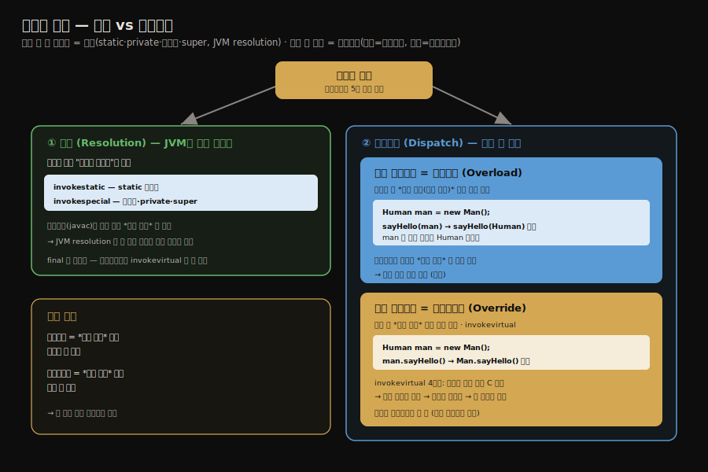

# 메서드 호출 — 해석과 정적·동적 디스패치
---
> §8.3.1~§8.3.2를 한 줄로 압축하면 — **메서드 호출은 호출 대상을 컴파일 때 확정하는 해석과, 실행 중에 고르는 디스패치로 나뉘며, 디스패치는 다시 정적 디스패치(오버로딩)와 동적 디스패치(오버라이딩)로 갈립니다.** 핵심은 "오버로딩은 *정적 타입*으로 컴파일 때, 오버라이딩은 *실제 타입*으로 실행 중에 결정된다"는 한 문장이며, 이것이 자바 다형성의 뿌리입니다.

이 글을 읽고 나면 5종 메서드 호출 바이트코드를 구분하고, 오버로딩과 오버라이딩이 각각 어느 타입을 기준으로 호출 버전을 고르는지 예제로 설명하며, `invokevirtual`의 수신자 탐색 과정을 그림 없이 짚을 수 있습니다.


## 진입 — 호출 대상은 언제 정해지는가

> 메서드를 호출하는 코드는 "어느 메서드를 부를지"를 컴파일 때 못 박을 수도, 실행 중에 골라야 할 수도 있습니다. 이 둘의 갈림이 자바 다형성의 핵심입니다.

[앞 글](./03-01.런타임%20스택%20프레임%20구조.md)에서 본 동적 링크는 프레임을 런타임 상수 풀의 메서드 참조에 연결했습니다. 그런데 그 참조가 가리키는 *실제 메서드 버전*은 언제 정해질까요. `static` 메서드처럼 변하지 않는 것은 컴파일 때 못 박을 수 있지만, 오버라이딩된 메서드는 실행 중 객체의 실제 타입을 봐야 정해집니다. 메서드 호출은 이 두 갈래로 나뉩니다.




## 1. 해석 — 컴파일 때 버전이 정해지는 호출

> 해석은 호출 대상이 *변하지 않는* 메서드를 컴파일 시점에 직접 참조로 확정합니다. static·private·생성자·super 호출이 대상입니다.

해석(resolution)은 상수 풀의 심볼 참조를 *컴파일 시점에* 직접 참조로 바꾸는 호출입니다. 단, 이것이 가능하려면 그 메서드가 *실행 중에 바뀌지 않아야* 합니다. 컴파일 시점에 버전이 하나로 확정되는 메서드를 *비가상 메서드(non-virtual method)*라 부르며, 다음이 해당합니다.

1. `static` 메서드 — 클래스에 묶여 있어 인스턴스와 무관합니다.
2. `private` 메서드 — 외부에서 접근 불가라 오버라이딩될 수 없습니다.
3. 인스턴스 생성자 — 특정 클래스의 것으로 고정됩니다.
4. `super`로 호출하는 부모 메서드 — 대상 부모가 명시됩니다.
5. `final` 메서드 — `invokevirtual`로 호출되지만 오버라이딩 불가라 비가상으로 취급됩니다.

이들을 호출하는 바이트코드는 `invokestatic`(static 메서드)과 `invokespecial`(생성자·private·super)입니다. 이 두 명령으로 호출되는 메서드는 모두 컴파일 시점에 *버전이 하나로* 확정되므로, 클래스 로딩의 해석 단계에 직접 참조로 바뀝니다.


## 2. 정적 디스패치 — 오버로딩

> 정적 디스패치는 인자의 *정적 타입(선언 타입)*만 보고 컴파일 때 호출 버전을 고릅니다. 메서드 오버로딩이 이 방식입니다.

디스패치(dispatch)는 같은 이름의 메서드 여러 버전 중 하나를 고르는 일입니다. 그중 *정적 디스패치(static dispatch)*는 컴파일 시점에 인자의 정적 타입을 기준으로 버전을 고르며, 메서드 오버로딩이 이 방식으로 동작합니다.

```java
public class StaticDispatch {
    static abstract class Human {}
    static class Man extends Human {}
    static class Woman extends Human {}

    public void sayHello(Human guy) { System.out.println("hello, guy!"); }
    public void sayHello(Man guy)   { System.out.println("hello, gentleman!"); }
    public void sayHello(Woman guy) { System.out.println("hello, lady!"); }

    public static void main(String[] args) {
        // 정적 타입은 Human, 실제 타입은 각각 Man·Woman
        Human man = new Man();
        Human woman = new Woman();
        StaticDispatch sr = new StaticDispatch();
        sr.sayHello(man);     // 무엇이 호출될까?
        sr.sayHello(woman);
    }
}
```

출력은 둘 다 `hello, guy!`입니다. `man`과 `woman`의 *정적 타입*이 모두 `Human`이기 때문입니다. 변수의 정적 타입은 컴파일 시점에 알 수 있고 변하지 않습니다. 컴파일러는 오버로딩된 세 버전 중 인자의 *정적 타입*에 맞는 `sayHello(Human)`을 고릅니다. 실제 타입이 `Man`·`Woman`이라는 사실은 정적 디스패치에서 무시됩니다.

여기서 핵심은 *정적 타입은 컴파일 시점에 알 수 있고, 실제 타입은 실행 중에 정해진다*는 구분입니다. 오버로딩은 전자만 봅니다.


## 3. 동적 디스패치 — 오버라이딩

> 동적 디스패치는 실행 중 수신자 객체의 *실제 타입*으로 호출 버전을 고릅니다. 메서드 오버라이딩이 이 방식이며 `invokevirtual`이 수행합니다.

*동적 디스패치(dynamic dispatch)*는 실행 시점에 수신자 객체의 실제 타입을 기준으로 버전을 고릅니다. 메서드 오버라이딩이 이 방식이며, 바이트코드 `invokevirtual`이 처리합니다.

```java
public class DynamicDispatch {
    static abstract class Human {
        protected abstract void sayHello();
    }
    static class Man extends Human {
        @Override
        protected void sayHello() { System.out.println("man say hello"); }
    }
    static class Woman extends Human {
        @Override
        protected void sayHello() { System.out.println("woman say hello"); }
    }

    public static void main(String[] args) {
        // 정적 타입은 Human, 실제 타입은 Man → Woman 순으로 바뀜
        Human man = new Man();
        Human woman = new Woman();
        man.sayHello();      // man say hello
        woman.sayHello();    // woman say hello
        man = new Woman();   // 같은 변수에 실제 타입만 교체
        man.sayHello();      // woman say hello
    }
}
```

출력은 `man say hello`, `woman say hello`, `woman say hello`입니다. 정적 타입이 모두 `Human`인데도 결과가 갈리는 이유는, `invokevirtual`이 *수신자의 실제 타입*을 보고 메서드를 고르기 때문입니다. 같은 `man` 변수라도 실제 타입을 `Woman`으로 바꾸면 호출 결과가 달라집니다.

### invokevirtual의 4단계 수신자 탐색

`invokevirtual`은 다음 순서로 실행할 메서드를 찾습니다.

1. 피연산자 스택 맨 위의 수신자 객체에서 *실제 타입* C를 얻습니다.
2. C에 상수 풀의 메서드 시그니처와 일치하는 메서드가 있고 접근 권한이 맞으면, 그 메서드의 직접 참조를 반환합니다.
3. 없으면 C의 부모 클래스로 올라가며 같은 탐색을 반복합니다.
4. 끝까지 못 찾으면 `AbstractMethodError`를 던집니다.

이 탐색이 *실행 시점*에 일어나므로, 컴파일러는 어느 메서드가 불릴지 미리 알 수 없습니다. 이것이 자바 다형성(런타임 polymorphism)의 구현 토대입니다.


## 4. 면접 대비 요약

> 핵심은 "오버로딩=정적 타입=컴파일 때", "오버라이딩=실제 타입=실행 중", "invokevirtual의 4단계 탐색"입니다.

### 한 줄 정의

정적 디스패치는 인자의 정적 타입으로 컴파일 때 버전을 고르는 오버로딩, 동적 디스패치는 수신자의 실제 타입으로 실행 중에 버전을 고르는 오버라이딩을 말합니다.

### 핵심 포인트 3가지

1. 해석은 변하지 않는 메서드(static·private·생성자·super·final)를 컴파일 때 확정하며 `invokestatic`·`invokespecial`이 처리합니다.
2. 정적 디스패치(오버로딩)는 인자의 *정적 타입*만 보고 컴파일 시점에 버전을 고릅니다.
3. 동적 디스패치(오버라이딩)는 수신자의 *실제 타입*을 `invokevirtual`의 4단계 탐색으로 실행 중에 고릅니다.

### 면접에서 받을 만한 질문

1. 오버로딩과 오버라이딩은 각각 어느 타입을 기준으로 메서드를 고릅니까?
2. `invokestatic`·`invokespecial`로 호출되는 메서드의 공통점은 무엇입니까?
3. `invokevirtual`이 실행할 메서드를 찾는 과정을 설명해 보세요.

> 세 질문에 *먼저 자답한 뒤* 아래 §정답으로 내려갑니다.


## 정답 (자답 후 펼치기)

> 위 §면접에서 받을 만한 질문의 3개에 *먼저 자답한 뒤* 아래를 읽으세요.

### 정답 1 — 오버로딩 vs 오버라이딩 기준

오버로딩은 인자의 *정적 타입(선언 타입)*을 기준으로 컴파일 시점에 버전을 고릅니다. 오버라이딩은 수신자 객체의 *실제 타입*을 기준으로 실행 시점에 버전을 고릅니다. `Human man = new Man()`에서 오버로딩은 `Human` 버전을, 오버라이딩은 `Man` 버전을 선택합니다.

### 정답 2 — invokestatic·invokespecial 메서드의 공통점

모두 *비가상 메서드*로, 컴파일 시점에 호출 버전이 하나로 확정됩니다. static 메서드·private 메서드·생성자·super 호출은 실행 중에 다른 버전으로 바뀔 수 없으므로, 상수 풀 심볼 참조가 클래스 로딩의 해석 단계에 직접 참조로 확정됩니다.

### 정답 3 — invokevirtual의 탐색 과정

수신자 객체의 *실제 타입* C를 얻은 뒤, C에 일치하는 메서드가 있으면 그것을, 없으면 부모 클래스로 올라가며 탐색합니다. 끝까지 못 찾으면 `AbstractMethodError`를 던집니다. 이 탐색이 실행 시점에 일어나기 때문에 같은 변수라도 실제 타입에 따라 다른 메서드가 호출됩니다.


## 핵심 개념 체크리스트

- [ ] 5종 메서드 호출 바이트코드를 구분할 수 있는가?
- [ ] 비가상 메서드 다섯 종류를 말할 수 있는가?
- [ ] 정적 타입과 실제 타입의 차이를 예제로 설명할 수 있는가?
- [ ] 오버로딩이 정적 타입을 보는 이유를 아는가?
- [ ] `invokevirtual`의 4단계 수신자 탐색을 설명할 수 있는가?


## 관련 문서

> 이 글은 단일 메서드 선택을 다뤘고, 다음 글은 *인자가 여럿일 때의 다중 디스패치*와 그 구현인 가상 메서드 테이블로 들어갑니다.

- [03-03. 다중 디스패치와 가상 메서드 테이블](./03-03.다중%20디스패치와%20가상%20메서드%20테이블.md) — 단일/다중 디스패치 분류와 vtable 구현
- [03-04. 동적 타입 언어 지원과 invokedynamic](./03-04.동적%20타입%20언어%20지원과%20invokedynamic.md) — 다섯 번째 호출 명령의 등장 배경
- [03-01. 런타임 스택 프레임 구조](./03-01.런타임%20스택%20프레임%20구조.md) § "동적 링크와 반환 주소" — 호출 대상을 잇는 동적 링크
