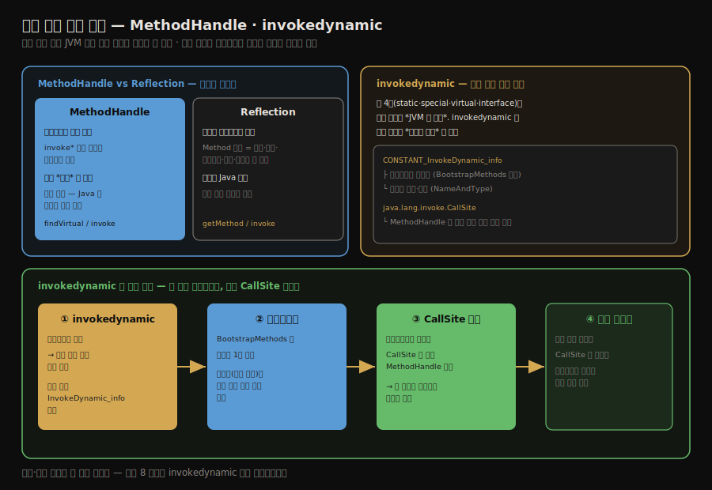
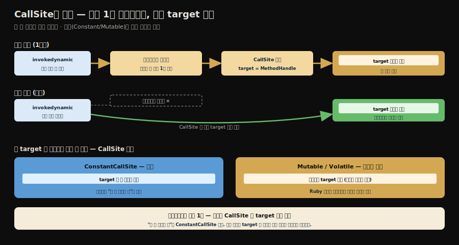

# 동적 타입 언어 지원과 invokedynamic
---
> §8.4를 한 줄로 압축하면 — **자바는 정적 타입 언어라 JVM 위에 동적 언어를 올리려면 새 호출 메커니즘이 필요했고, 그 답이 `MethodHandle`과 다섯 번째 호출 명령 `invokedynamic`입니다.** 
>
> 핵심은 "`MethodHandle`은 바이트코드 수준에서 호출 동작만 모사한다(리플렉션은 메서드 메타데이터 전체를 다룬다)"는 대비와, "`invokedynamic`은 호출 대상 결정을 컴파일러가 아니라 *사용자 코드*에 넘긴다"는 발상입니다.

이 글을 읽고 나면 `MethodHandle`과 리플렉션의 차이를 말하고, `invokedynamic`이 왜 추가됐으며 부트스트랩 메서드와 `CallSite`를 통해 어떻게 호출 대상을 정하는지 그림 없이 짚을 수 있습니다.


## 진입 — 정적 타입 언어의 한계

> 자바는 컴파일 시점에 타입을 확정하는 정적 타입 언어입니다. JVM 위에 Groovy·Ruby 같은 동적 언어를 올리려면, 컴파일 때 호출 대상을 못 박지 않는 *유연한 호출*이 필요했습니다.

[앞 글까지](./03-02.메서드%20호출%20—%20디스패치%20완전%20정복.md)의 네 호출 명령(`invokestatic`·`invokespecial`·`invokevirtual`·`invokeinterface`)은 공통적으로 *부를 메서드의 시그니처(심볼 참조)가 컴파일 시점에 박혀* 있습니다. 

- 여기서 주의할 것은, `invokevirtual`·`invokeinterface`는 *실제 구현(대상)*은 실행 중에 수신자 타입을 보고 정한다는 점입니다(동적 디스패치). 즉 컴파일 때 고정되는 것은 *대상*이 아니라 *시그니처*입니다.
- `invokestatic`·`invokespecial`만이 대상까지 컴파일 때 확정됩니다. 그래도 네 명령 모두 "어떤 이름·타입의 메서드를 부른다"는 *시그니처는 컴파일러가 안다*는 공통점을 가집니다. 

그런데 동적 타입 언어는 변수의 타입을 *실행 중에* 결정합니다. 

- 같은 변수가 어느 순간엔 문자열, 다음 순간엔 정수일 수 있습니다. 이런 언어를 JVM 위에 올리려면, 컴파일러가 호출 대상을 못 박지 않고 *실행 중에 결정*하는 길이 필요했습니다. 
- JDK 7이 그 답으로 `java.lang.invoke` 패키지와 `invokedynamic`을 도입했습니다.




## 1. MethodHandle — 호출 동작을 담은 핸들

> `MethodHandle`은 바이트코드 호출 명령을 흉내 내는 핸들입니다. 리플렉션이 메서드의 *메타데이터 전체*를 다루는 것과 달리, 호출 *동작*만 가볍게 담습니다.

`MethodHandle`은 메서드를 가리키는 *핸들*로, `invoke*` 바이트코드 명령을 코드 수준에서 흉내 냅니다. 리플렉션의 `Method`와 비슷해 보이지만 결이 다릅니다.

```java
import static java.lang.invoke.MethodHandles.lookup;
import java.lang.invoke.MethodHandle;
import java.lang.invoke.MethodType;

public class MethodHandleTest {
    static class ClassA {
        public void println(String s) { System.out.println(s); }
    }

    public static void main(String[] args) throws Throwable {
        Object obj = System.currentTimeMillis() % 2 == 0 ? System.out : new ClassA();
      
        // obj 의 실제 타입과 무관하게 println(String) 핸들을 얻어 호출
        getPrintlnMH(obj).invokeExact("icyfenix");
    }

    private static MethodHandle getPrintlnMH(Object receiver) throws Throwable {
        // (String)void 시그니처 — 반환 void, 인자 String
        MethodType mt = MethodType.methodType(void.class, String.class);
      
        // 수신자의 실제 타입에서 println 가상 메서드 핸들을 찾고, 수신자를 바인딩
        return lookup().findVirtual(receiver.getClass(), "println", mt)
                       .bindTo(receiver);
    }
}
```

`obj`가 `System.out`이든 `ClassA`든, `findVirtual`로 얻은 핸들이 수신자의 실제 타입에 맞는 `println`을 호출합니다. 예제의 `bindTo(receiver)`는 핸들의 *첫 인자(수신자)를 미리 묶어*, 이후엔 인자 하나가 줄어든 핸들(여기선 문자열만 받는 `println`)을 돌려줍니다 — 완전히 새 호출을 만드는 게 아니라 *기존 핸들을 변형*하는 것입니다. 핵심 대비는 다음입니다.

1. 리플렉션의 `Method`는 메서드의 *메타데이터 전체*(이름·반환 타입·파라미터·예외·수식어)를 담는 무거운 객체입니다. *자바 언어 수준*의 메서드 표현입니다.
2. `MethodHandle`은 메서드의 *호출 동작*만 담는 가벼운 핸들입니다. *바이트코드 수준*의 메서드 호출 모사라, 자바가 아닌 언어도 사용할 수 있습니다.

`MethodHandle`이 *언어 무관*이라는 점이 동적 언어 지원의 토대입니다. 리플렉션은 자바 전용이지만, `MethodHandle`은 JVM 위의 어떤 언어든 쓸 수 있습니다.

예제의 `invokeExact`도 짚고 갑니다. `MethodHandle` 호출에는 `invokeExact`와 `invoke`가 있습니다. 

- `invokeExact`는 핸들의 타입과 호출부의 타입이 *정확히 일치*해야 하고, `invoke`는 가능한 범위에서 타입 변환(`asType`)을 적용해 호출합니다. 
- 학습 단계에서는 `invokeExact`가 "이 핸들의 시그니처가 정확히 무엇인가"를 드러내 좋고, 실제 동적 언어 런타임은 `asType`·`guardWithTest`·`filterArguments` 같은 조합 API와 함께 씁니다. 

그래서 `MethodHandle`은 "빠른 리플렉션"이라기보다 *타입이 붙은 호출 조합 도구*에 가깝습니다. (앞서 본 `invokedynamic`이 target을 부를 때도 *마치 `invokeExact`처럼* 호출하도록 JVM 명세가 규정합니다.)

`MethodHandle`을 "조합 도구"라 부르는 까닭은, 핸들을 *변형하고 엮어* 새 핸들을 만드는 API가 갖춰져 있어서입니다. 동적 언어 런타임은 이것들을 조립해 자기 호출 규칙을 구현합니다.

- `asType`은 핸들의 시그니처를 다른 타입으로 맞춥니다. 예를 들어 `int`를 받는 핸들을 `Integer`를 받는 핸들로 바꿔, 호출부 타입에 끼워 맞춥니다(앞의 `invoke`가 내부에서 쓰는 것이 이것입니다).
- `bindTo`는 위에서 본 대로 첫 인자를 미리 묶어 인자 수를 줄입니다.
- `filterArguments`는 인자가 본 메서드로 들어가기 전에 *다른 핸들로 전처리*하게 끼웁니다. 인자에 변환을 한 겹 씌우는 셈입니다.
- `guardWithTest`는 *조건 핸들*의 참·거짓에 따라 두 핸들 중 하나로 갈라 호출합니다. 동적 언어가 "수신자 타입이 그대로면 캐시된 대상, 바뀌었으면 다시 찾기" 같은 인라인 캐시를 구현할 때 이 분기를 씁니다.

이렇게 핸들을 변형·결합할 수 있다는 점이, 단순히 메서드를 *조사*하는 리플렉션과 갈리는 지점입니다. 동적 언어 구현자는 `invokedynamic` 호출 지점의 `CallSite` target을 이런 조합으로 만들어, 자기 언어의 디스패치를 표현합니다.


## 2. invokedynamic — 호출 대상을 사용자 코드가 정한다

> `invokedynamic`은 다섯 번째 호출 명령으로, 호출 대상 결정을 JVM이 아니라 *사용자(언어 구현)의 부트스트랩 메서드*에 위임합니다. 그 결과가 `CallSite`에 담겨 실제 메서드를 호출합니다.

`invokedynamic`은 다섯 번째 메서드 호출 바이트코드입니다. 앞의 네 명령과 결정적으로 다른 점은, ***호출 대상을 누가 정하는가***입니다. 앞 네 개는 JVM이 타입 규칙으로 대상을 정하지만, `invokedynamic`은 그 결정을 *사용자 코드*에 넘깁니다.

동작은 다음 순서입니다.

1. `invokedynamic` 명령이 실행되면, 처음에는 호출 대상이 아직 정해지지 않은 상태입니다. 
   - 이 명령은 상수 풀의 `CONSTANT_InvokeDynamic_info`를 참조합니다. 이 구조 자체에는 `bootstrap_method_attr_index`와 `name_and_type_index` 두 필드가 들어 있습니다. 
   - 전자는 `BootstrapMethods` 속성의 항목(부트스트랩 메서드)을 가리키고, 후자는 동적 호출 이름과 메서드 디스크립터를 가리킵니다. 즉 호출 지점은 "어떤 이름·타입으로 부를 것인가"와 "그 호출을 누가 링크할 것인가"를 상수 풀을 통해 표현합니다.
2. 그 호출 지점에서 *부트스트랩 메서드(bootstrap method)*가 한 번 호출됩니다. 이 메서드는 `BootstrapMethods` 속성에 등록되어 있으며, *언어 구현자가 작성한* 호출 대상 결정 로직입니다.
3. 부트스트랩 메서드는 `java.lang.invoke.CallSite` 객체를 반환합니다. 이 `CallSite`가 실제 호출할 메서드의 `MethodHandle`(target)을 담고 있어, 그 핸들이 가리키는 메서드가 호출됩니다.
4. 같은 `invokedynamic` 호출 지점은 최초 링크 이후 부트스트랩 메서드를 다시 호출하지 않고, 그 `CallSite`의 *현재 target* `MethodHandle`로 위임합니다.

여기서 `CallSite`가 *항상 고정*이라고 오해하기 쉽습니다. `CallSite`에는 세 종류가 있습니다. 

- `ConstantCallSite`는 target이 한 번 정해지면 불변이고, `MutableCallSite`·`VolatileCallSite`는 런타임에 target을 교체해 *재링크*할 수 있습니다(단 새 target의 메서드 타입은 기존과 같아야 합니다). 
- 그래서 `invokedynamic`의 진짜 강점은 "한 번 정하면 끝"이 아니라, *호출 지점 자체를 객체(`CallSite`)로 만들어 그 target을 언어 런타임이 관리*할 수 있다는 데 있습니다. 
- 또한 `invokedynamic`은 명령 하나하나, 즉 소스 코드상의 *각 호출 지점마다* 고유한 링크 상태를 가집니다 — 같은 부트스트랩 메서드를 공유해도 호출 지점마다 다른 `CallSite`로 연결될 수 있습니다.



이 구조 덕분에 동적 언어 구현자는 "이 호출 지점에서 무엇을 부를지"를 *런타임에 자기 로직으로* 결정할 수 있습니다. 자바 8의 람다 표현식도 내부적으로 `invokedynamic`으로 컴파일됩니다.

- 그 부트스트랩 메서드가 `java.lang.invoke.LambdaMetafactory.metafactory`입니다. 컴파일러는 람다 본문을 별도 메서드로 만들고 `invokedynamic` 호출 지점에 `LambdaMetafactory`를 연결하며, 런타임에 이 부트스트랩 메서드가 함수형 인터페이스 구현 객체를 만들어 줍니다. 
- 그래서 "람다는 익명 클래스인가?"의 정확한 답은 — *소스에선 함수형 인터페이스 구현처럼 보이지만, 바이트코드 수준에선 익명 클래스 생성이 아니라 `invokedynamic` + `LambdaMetafactory` 기반*입니다.

### 더 들어가기 — 람다 vs 익명 클래스, 무엇이 다른가

면접에서 "람다와 익명 클래스의 차이"를 자주 묻습니다. 셋으로 나눠 보면 명확합니다.

**① 클래스 파일이 생기느냐.** 익명 클래스는 컴파일 시점에 *별도 `.class` 파일*이 생깁니다(`Outer$1.class`). 

- JVM 명세도 "local class 또는 anonymous class만 `EnclosingMethod` 속성을 가진다"고 규정해, 익명 클래스가 독립된 클래스로 컴파일됨을 뒷받침합니다.
-  반면 람다는 컴파일 때 별도 클래스 파일을 만들지 않고, 본문만 `private` 메서드(`lambda$...`)로 빼둔 뒤 `invokedynamic` 호출 지점을 남깁니다. 
- 실제 구현 클래스는 *런타임에 `LambdaMetafactory`가 생성*합니다. 람다를 수백 개 쓰는 코드에서 익명 클래스 방식이라면 그만큼 `.class` 파일과 클래스 로딩이 늘지만, 람다는 그 부담을 런타임 생성으로 미룹니다.

**② `this`의 의미가 다릅니다.** 익명 클래스 안의 `this`는 *익명 클래스 자신*을 가리킵니다. 

- 람다 안의 `this`는 *람다를 둘러싼 바깥 클래스*를 가리킵니다. JLS는 람다 본문에서 `this`·`super`와 이름 해석이 "둘러싼 컨텍스트와 동일하게(transparency of this)" 동작한다고 규정합니다. 
- 그래서 람다 안에서 `this.someField`는 바깥 인스턴스의 필드이고, 익명 클래스에서 같은 코드는 익명 클래스 인스턴스를 가리켜 의미가 갈립니다.

```java
class Outer {
    Runnable anon = new Runnable() {
        public void run() { System.out.println(this); }  // this = 익명 Runnable 인스턴스
    };
    Runnable lam = () -> System.out.println(this);        // this = Outer 인스턴스
}
```

**③ 변수 캡처는 둘 다 effectively final만.** 이 점은 같습니다. 람다도 익명 클래스도 *effectively final*(사실상 변경되지 않는) 지역 변수만 캡처할 수 있습니다. 캡처한 값은 복사되어 들어가므로, 캡처 후 원본을 바꾸면 컴파일 에러입니다. 이건 람다 고유 규칙이 아니라 *둘 다 따르는* 제약입니다.

> 정리하면 — *클래스 파일 생성(익명: 컴파일 때 / 람다: 런타임)*과 *`this` 의미(익명: 자신 / 람다: 바깥)*가 본질 차이이고, *캡처 규칙(effectively final)*은 공통입니다. "람다는 가벼운 익명 클래스"라는 비유가 ①(클래스 파일) 때문에 부분적으로 맞지만, ②(`this`) 때문에 *문법 설탕이 아니라 의미가 다른 별개 기능*입니다.

### invokevirtual의 동적 디스패치와 invokedynamic은 무엇이 다른가

이름만 보면 `invokevirtual`도 동적이고 `invokedynamic`도 동적이라 헷갈립니다. 하지만 두 "동적"은 층위가 다릅니다.

`invokevirtual`의 동적 디스패치는 *이미 컴파일 시점에 정해진 메서드 시그니처 안에서* 일어납니다. 

- 예를 들어 `Animal.sound:()V`라는 호출은 컴파일 때 시그니처가 정해져 있고, 실행 중에는 수신자의 실제 타입이 `Dog`냐 `Cat`이냐에 따라 `Dog.sound`냐 `Cat.sound`냐만 고릅니다. 
- 자바의 상속·오버라이딩 규칙 *안에서* 동적인 것입니다.

반면 `invokedynamic`은 *호출 지점의 링크 과정 자체*를 부트스트랩 메서드에 위임합니다. 

- 그 호출이 무엇을 의미하는지 — 어떤 `MethodHandle`을 연결할지, 어떤 `CallSite`를 만들지, target을 고정할지 바꿀 수 있게 둘지 — 를 *언어 런타임이 직접 설계*합니다.

한 문장으로: `invokevirtual`은 "정해진 시그니처 안에서 구현체를 *늦게* 고르는 호출"이고, `invokedynamic`은 "호출 지점이 무엇을 의미하는지를 *링크 시점에 사용자 코드가 정하는* 호출"입니다.

- 앞 글의 결론(파라미터는 정적, 수신자는 동적)이 자바 *내부* 규칙 안의 동적이라면, `invokedynamic`은 자바 규칙 *바깥*까지 여는 동적 링크입니다.


## 3. 메서드 해석 호출 규칙 — super 호출의 함정

> `MethodHandle`로 `super` 메서드를 호출할 때는 일반 가상 디스패치와 다른 규칙이 적용됩니다. 잘못 쓰면 의도한 부모 메서드 대신 자식 메서드가 불립니다.

`MethodHandle`은 호출 명령을 모사하므로, 어느 호출 명령을 흉내 내느냐에 따라 디스패치 규칙이 달라집니다. 특히 `super` 호출(부모 메서드 직접 호출)을 다룰 때 주의해야 합니다.

```java
import static java.lang.invoke.MethodHandles.lookup;
import java.lang.invoke.MethodHandle;
import java.lang.invoke.MethodType;

class GrandFatherTest {
    class GrandFather {
        void thinking() { System.out.println("i am grandfather"); }
    }
    class Father extends GrandFather {
        void thinking() { System.out.println("i am father"); }
    }
    class Son extends Father {
        void thinking() {
            // MethodHandle 로 GrandFather.thinking 을 직접 호출하려는 시도
            MethodType mt = MethodType.methodType(void.class);
            MethodHandle mh = lookup().findSpecial(GrandFather.class, "thinking", mt,
                                                   getClass());
            try {
                mh.invoke(this);
            } catch (Throwable e) { }
        }
    }
}
```

- 여기서 `findSpecial`은 `invokespecial` 계열의 호출 의미를 모사하는 *early-bound 핸들*을 만듭니다. 그래서 가상 디스패치를 피하고 `GrandFather.thinking()`이 의도대로 불립니다. 
- 다만 "지정한 클래스의 메서드를 *무조건* 직접 호출한다"고 단정하면 위험합니다. 실제 호출 가능 여부와 해석은 `Lookup`의 권한, `specialCaller`(마지막 인자로 넘긴 호출자 클래스), 상속 관계, JVM의 `invokespecial` 해석 규칙을 함께 따릅니다. 이 예제는 "가상 디스패치를 피하고 *특수 호출 의미*를 만든다"는 용도로 이해하는 편이 안전합니다.
- 만약 `findVirtual`을 썼다면 가상 디스패치가 일어나 자식 `Son`의 버전이 불렸을 것입니다. 정리하면 *`findVirtual`은 가상 디스패치(실제 타입), `findSpecial`은 특수 호출 의미(early-bound)*이며, `MethodHandle`로 `super` 의미를 구현하려면 `findSpecial`을 써야 합니다.


## 4. 실습 — 람다는 invokedynamic으로 컴파일된다

지금까지의 설명을 직접 확인해 봅니다. 람다 한 줄이 정말 익명 클래스 생성이 아니라 `invokedynamic` 호출 지점으로 컴파일되는지, `javac`와 `javap`로 바이트코드를 들여다봅니다.

```java
public class LambdaTest {
    public static void main(String[] args) {
        Runnable r = () -> System.out.println("hello");   // ← 이 줄이 invokedynamic으로 컴파일됨
        r.run();
    }
}
```

```bash
javac LambdaTest.java
java LambdaTest          # → hello
javap -c -v LambdaTest   # 바이트코드 + 상수풀 + BootstrapMethods
```

### 확인한 세 가지 증거

먼저 `main`의 바이트코드입니다. 람다를 만드는 자리에 `invokedynamic` 한 줄이 박혀 있습니다.

```
 0: invokedynamic #7,  0   // InvokeDynamic #0:run:()Ljava/lang/Runnable;
 5: astore_1
 6: aload_1
 7: invokeinterface #11,  1   // InterfaceMethod java/lang/Runnable.run:()V
```

람다 `() -> ...`가 익명 클래스 `new`가 아니라 *호출 지점 하나*(`invokedynamic`)로 컴파일됐습니다. 이 호출이 반환하는 타입은 `()Ljava/lang/Runnable;` — 인자 없이 `Runnable` 한 개를 만들어 돌려줍니다. 끝의 `, 0`은 `invokedynamic` 특유의 빈 피연산자 자리로, 다른 `invoke` 명령과 달리 대상 메서드를 바이트코드에 직접 적지 않는다는 표시입니다. 만들어진 `Runnable`을 `r`에 담고(`astore_1`), 그 위에서 `invokeinterface`로 `run()`을 호출합니다 — `run()` 호출 자체는 여전히 컴파일 때 시그니처가 고정된 정적 타입 호출입니다.

다음은 파일 끝의 `BootstrapMethods` 속성입니다. 이 `invokedynamic` 지점을 무엇으로 연결할지 정하는 부트스트랩 메서드가 보입니다.

```
BootstrapMethods:
  0: #43 REF_invokeStatic java/lang/invoke/LambdaMetafactory.metafactory:(...)CallSite
    Method arguments:
      #39 ()V
      #40 REF_invokeStatic LambdaTest.lambda$main$0:()V
      #39 ()V
```

부트스트랩 메서드는 `LambdaMetafactory.metafactory`입니다. 첫 호출 때 이 메서드가 한 번 돌아 `CallSite`를 만들고, 이후 호출은 그 결과에 직접 바인딩됩니다(§2의 CallSite 생명주기 그대로). 인자 세 개는 각각 함수형 인터페이스 메서드 시그니처(`()V`), 실제 람다 본문 핸들(`lambda$main$0`), 구현 시그니처(`()V`)입니다.

마지막으로 람다 본문이 어디로 갔는지입니다. 상수풀에 합성 메서드가 하나 생겨 있습니다.

```
#35 = Utf8               lambda$main$0
#40 = MethodHandle       6:#41   // REF_invokeStatic LambdaTest.lambda$main$0:()V
```

`System.out.println("hello")`라는 람다 본문이 `lambda$main$0`이라는 `private static` 합성 메서드로 빠졌습니다. 부트스트랩이 만드는 `CallSite`는 이 메서드를 가리키는 핸들을 품습니다.

### invokedynamic을 쓴다고 자바가 동적 타입이 되는 것은 아니다

여기서 챕터 제목("동적 타입 언어 지원")이 주는 오해를 짚어야 합니다. 람다가 `invokedynamic`으로 컴파일된다고 해서, 자바가 JRuby나 Groovy처럼 *타입을 런타임에 바꾸는* 동적 타입 언어가 되는 것은 아닙니다. 둘은 같은 명령을 쓰지만 부트스트랩 메서드 안에 넣는 로직이 다릅니다.

자바 람다의 부트스트랩(`LambdaMetafactory`)이 만드는 `CallSite`는 `ConstantCallSite`라, 첫 호출에 한 번 묶이면 다시 바뀌지 않습니다. 위 출력에서 보듯 시그니처가 `()V → Runnable`로 *고정*돼 있고, `r`의 타입도 컴파일 때 `Runnable`로 정해져 `invokeinterface Runnable.run:()V`로 박힙니다. 반면 동적 언어 구현자는 *같은* `invokedynamic`을 쓰되 부트스트랩 안에 "런타임 타입을 보고 메서드를 찾는" 로직을 직접 넣어, 호출할 때마다 대상이 갈리는 진짜 동적 디스패치를 만듭니다.

정리하면 `invokedynamic`은 "호출 연결 규칙을 JVM이 아니라 사용자 코드가 정한다"는 *틀*일 뿐이고, 그 틀에 무엇을 채우느냐가 갈림길입니다. 자바는 "고정 시그니처 람다 팩토리"를, 동적 언어는 "런타임 타입 디스패처"를 채웁니다. 자바 람다는 동적 타입을 얻으려고가 아니라, 익명 클래스를 컴파일 때마다 `.class` 파일로 찍지 않고 런타임에 한 번 만들어 재사용하려고 이 틀을 빌려 쓴 것입니다.

### 확장 — 람다 밖의 invokedynamic (챕터 범위 밖, 참고)

`invokedynamic`은 람다 외에도 두 곳에서 더 만납니다. 둘 다 이 챕터 범위 밖이지만, 위 구분("호출 메서드를 런타임에 바꾸느냐")을 적용해 보면 성격이 분명해집니다.

- **문자열 결합**: JDK 9부터 `+` 연산의 문자열 결합도 `invokedynamic`으로 컴파일되고, 부트스트랩 메서드는 `java.lang.invoke.StringConcatFactory`입니다. 람다와 마찬가지로 결합 형태가 컴파일 때 정해져 호출 메서드가 런타임에 바뀌지 않습니다.
- **GraalVM Native Image**: Native Image는 폐쇄형 세계 가정 때문에 `invokedynamic` 일반을 지원하지 않지만, `javac`가 생성하는 람다·문자열 결합용 `invokedynamic`은 *호출 메서드를 런타임에 바꾸지 않으므로* 지원합니다. 즉 제약을 받는 것은 부트스트랩 안에서 대상을 런타임에 갈아 끼우는 *진짜 동적* 용법이지, 자바 람다가 아닙니다.

두 사실 모두 같은 결론을 가리킵니다. `invokedynamic`을 쓴다는 것과 "호출 대상이 런타임에 바뀐다"는 것은 별개이며, 자바가 `javac`로 만드는 `invokedynamic`은 모두 고정된 대상을 늦게 *연결*만 할 뿐입니다.


## 5. 면접 대비 요약

> 핵심은 "MethodHandle=바이트코드 수준 호출 모사(리플렉션=메타데이터)", "invokedynamic=대상 결정을 사용자 코드에", "람다도 invokedynamic"입니다.

### 한 줄 정의

`invokedynamic`은 호출 대상 결정을 JVM이 아니라 부트스트랩 메서드(사용자 코드)에 위임하는 다섯 번째 호출 명령이며, `MethodHandle`은 그 호출 대상을 담는 바이트코드 수준의 메서드 핸들을 말합니다.

### 핵심 포인트 3가지

1. `MethodHandle`은 호출 *동작*만 담는 가벼운 바이트코드 수준 핸들로, 메서드 메타데이터 전체를 담는 리플렉션과 달리 언어에 무관합니다.
2. `invokedynamic`은 부트스트랩 메서드를 통해 `CallSite`를 만들어, 호출 대상 결정을 사용자(언어 구현)에게 넘깁니다.
3. 자바 8의 람다 표현식도 `invokedynamic`으로 컴파일되며, `CallSite`는 한 번 만들어진 뒤 캐시됩니다.

### 면접에서 받을 만한 질문

1. `MethodHandle`과 리플렉션의 차이는 무엇입니까?
2. `invokedynamic`이 앞의 네 호출 명령과 다른 점은 무엇입니까?
3. 부트스트랩 메서드와 `CallSite`는 각각 어떤 역할을 합니까?

> 세 질문에 *먼저 자답한 뒤* 아래 §정답으로 내려갑니다.


## 정답 (자답 후 펼치기)

> 위 §면접에서 받을 만한 질문의 3개에 *먼저 자답한 뒤* 아래를 읽으세요.

### 정답 1 — MethodHandle vs 리플렉션

리플렉션의 `Method`는 메서드의 메타데이터 전체(이름·반환·파라미터·예외·수식어)를 담는 무거운 *자바 언어 수준* 객체입니다. `MethodHandle`은 호출 *동작*만 담는 가벼운 *바이트코드 수준* 핸들로, `invoke*` 명령을 모사합니다. 리플렉션은 자바 전용이지만 `MethodHandle`은 JVM 위의 어떤 언어든 쓸 수 있어, 동적 언어 지원의 토대가 됩니다.

### 정답 2 — invokedynamic의 차이

앞의 네 명령은 호출 대상을 *JVM이 타입 규칙으로* 정하지만, `invokedynamic`은 그 결정을 *사용자 코드(부트스트랩 메서드)*에 넘깁니다. 덕분에 동적 언어 구현자가 "이 호출 지점에서 무엇을 부를지"를 런타임에 자기 로직으로 정할 수 있습니다.

### 정답 3 — 부트스트랩 메서드와 CallSite

부트스트랩 메서드는 `invokedynamic` 호출 지점에서 *한 번* 호출되어 호출 대상을 결정하는, 언어 구현자가 작성한 로직입니다. 그 결과로 `CallSite` 객체를 반환하며, `CallSite`는 실제 호출할 메서드의 `MethodHandle`을 담습니다. 한 번 만들어진 `CallSite`는 캐시되어 이후 호출에 재사용됩니다.


## 핵심 개념 체크리스트

- [ ] `MethodHandle`과 리플렉션의 차이를 말할 수 있는가?
- [ ] `MethodHandle`이 언어 무관인 이유를 아는가?
- [ ] `invokedynamic`이 호출 대상 결정을 누구에게 넘기는지 아는가?
- [ ] 부트스트랩 메서드 → `CallSite` → `MethodHandle` 흐름을 설명할 수 있는가?
- [ ] `findSpecial`과 `findVirtual`이 super 호출에서 어떻게 다른지 아는가?


## 관련 문서

> 이 글로 메서드 호출의 다섯 명령이 모두 정리됐습니다. 다음 글은 이 호출들이 실제로 도는 *스택 기반 해석 실행 엔진*으로 넘어갑니다.

- [03-04. 스택 기반 해석 실행 엔진](./03-04.스택%20기반%20해석%20실행%20엔진.md) — 이 호출 명령들이 실행되는 인터프리터 구조
- [03-02. 메서드 호출 — 디스패치 완전 정복](./03-02.메서드%20호출%20—%20디스패치%20완전%20정복.md) — 앞 네 호출 명령의 동작과, invokedynamic이 우회하는 정적·다중 디스패치
