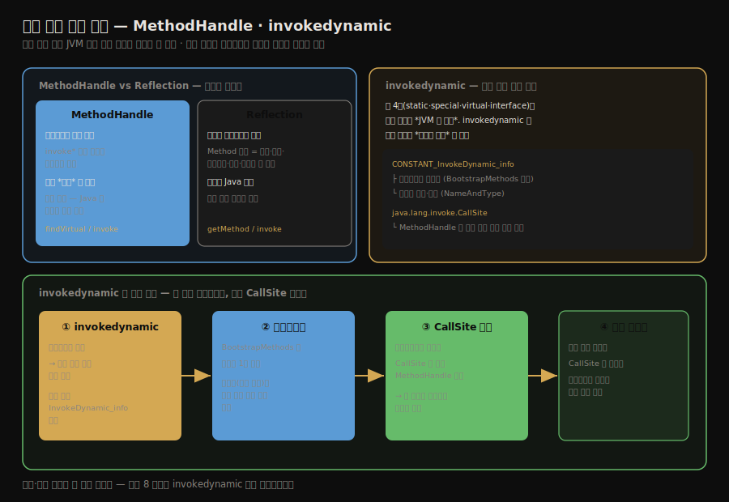

# 동적 타입 언어 지원과 invokedynamic
---
> §8.4를 한 줄로 압축하면 — **자바는 정적 타입 언어라 JVM 위에 동적 언어를 올리려면 새 호출 메커니즘이 필요했고, 그 답이 `MethodHandle`과 다섯 번째 호출 명령 `invokedynamic`입니다.** 핵심은 "`MethodHandle`은 바이트코드 수준에서 호출 동작만 모사한다(리플렉션은 메서드 메타데이터 전체를 다룬다)"는 대비와, "`invokedynamic`은 호출 대상 결정을 컴파일러가 아니라 *사용자 코드*에 넘긴다"는 발상입니다.

이 글을 읽고 나면 `MethodHandle`과 리플렉션의 차이를 말하고, `invokedynamic`이 왜 추가됐으며 부트스트랩 메서드와 `CallSite`를 통해 어떻게 호출 대상을 정하는지 그림 없이 짚을 수 있습니다.


## 진입 — 정적 타입 언어의 한계

> 자바는 컴파일 시점에 타입을 확정하는 정적 타입 언어입니다. JVM 위에 Groovy·Ruby 같은 동적 언어를 올리려면, 컴파일 때 호출 대상을 못 박지 않는 *유연한 호출*이 필요했습니다.

[앞 글까지](./03-03.다중%20디스패치와%20가상%20메서드%20테이블.md)의 네 호출 명령(`invokestatic`·`invokespecial`·`invokevirtual`·`invokeinterface`)은 모두 호출 대상이 *컴파일 시점에 타입으로 묶여* 있습니다. 그런데 동적 타입 언어는 변수의 타입을 *실행 중에* 결정합니다. 같은 변수가 어느 순간엔 문자열, 다음 순간엔 정수일 수 있습니다. 이런 언어를 JVM 위에 올리려면, 컴파일러가 호출 대상을 못 박지 않고 *실행 중에 결정*하는 길이 필요했습니다. JDK 7이 그 답으로 `java.lang.invoke` 패키지와 `invokedynamic`을 도입했습니다.




## 1. MethodHandle — 호출 동작을 담은 핸들

> `MethodHandle`은 바이트코드 호출 명령을 흉내 내는 핸들입니다. 리플렉션이 메서드의 *메타데이터 전체*를 다루는 것과 달리, 호출 *동작*만 가볍게 담습니다.

`MethodHandle`은 메서드를 가리키는 *핸들*로, `invoke*` 바이트코드 명령을 코드 수준에서 흉내 냅니다. 리플렉션의 `Method`와 비슷해 보이지만 결이 다릅니다.

```java
import static java.lang.invoke.MethodHandles.lookup;
import java.lang.invoke.MethodHandle;
import java.lang.invoke.MethodType;

public class MethodHandleTest {
    static class ClassA {
        public void println(String s) { System.out.println(s); }
    }

    public static void main(String[] args) throws Throwable {
        Object obj = System.currentTimeMillis() % 2 == 0 ? System.out : new ClassA();
        // obj 의 실제 타입과 무관하게 println(String) 핸들을 얻어 호출
        getPrintlnMH(obj).invokeExact("icyfenix");
    }

    private static MethodHandle getPrintlnMH(Object receiver) throws Throwable {
        // (String)void 시그니처 — 반환 void, 인자 String
        MethodType mt = MethodType.methodType(void.class, String.class);
        // 수신자의 실제 타입에서 println 가상 메서드 핸들을 찾고, 수신자를 바인딩
        return lookup().findVirtual(receiver.getClass(), "println", mt)
                       .bindTo(receiver);
    }
}
```

`obj`가 `System.out`이든 `ClassA`든, `findVirtual`로 얻은 핸들이 수신자의 실제 타입에 맞는 `println`을 호출합니다. 핵심 대비는 다음입니다.

1. 리플렉션의 `Method`는 메서드의 *메타데이터 전체*(이름·반환 타입·파라미터·예외·수식어)를 담는 무거운 객체입니다. *자바 언어 수준*의 메서드 표현입니다.
2. `MethodHandle`은 메서드의 *호출 동작*만 담는 가벼운 핸들입니다. *바이트코드 수준*의 메서드 호출 모사라, 자바가 아닌 언어도 사용할 수 있습니다.

`MethodHandle`이 *언어 무관*이라는 점이 동적 언어 지원의 토대입니다. 리플렉션은 자바 전용이지만, `MethodHandle`은 JVM 위의 어떤 언어든 쓸 수 있습니다.


## 2. invokedynamic — 호출 대상을 사용자 코드가 정한다

> `invokedynamic`은 다섯 번째 호출 명령으로, 호출 대상 결정을 JVM이 아니라 *사용자(언어 구현)의 부트스트랩 메서드*에 위임합니다. 그 결과가 `CallSite`에 담겨 실제 메서드를 호출합니다.

`invokedynamic`은 다섯 번째 메서드 호출 바이트코드입니다. 앞의 네 명령과 결정적으로 다른 점은, *호출 대상을 누가 정하는가*입니다. 앞 네 개는 JVM이 타입 규칙으로 대상을 정하지만, `invokedynamic`은 그 결정을 *사용자 코드*에 넘깁니다.

동작은 다음 순서입니다.

1. `invokedynamic` 명령이 실행되면, 처음에는 호출 대상이 아직 정해지지 않은 상태입니다. 이 명령은 상수 풀의 `CONSTANT_InvokeDynamic_info`를 참조하는데, 여기에는 *부트스트랩 메서드*와 메서드 이름·타입(`NameAndType`)이 담겨 있습니다.
2. 그 호출 지점에서 *부트스트랩 메서드(bootstrap method)*가 한 번 호출됩니다. 이 메서드는 `BootstrapMethods` 속성에 등록되어 있으며, *언어 구현자가 작성한* 호출 대상 결정 로직입니다.
3. 부트스트랩 메서드는 `java.lang.invoke.CallSite` 객체를 반환합니다. 이 `CallSite`가 실제 호출할 메서드의 `MethodHandle`을 담고 있어, 그 핸들이 가리키는 메서드가 호출됩니다.
4. 같은 호출 지점은 한 번 만들어진 `CallSite`가 캐시되어, 이후에는 부트스트랩 메서드를 다시 실행하지 않고 바로 호출합니다.

이 구조 덕분에 동적 언어 구현자는 "이 호출 지점에서 무엇을 부를지"를 *런타임에 자기 로직으로* 결정할 수 있습니다. 자바 8의 람다 표현식도 내부적으로 `invokedynamic`으로 컴파일됩니다 — 람다를 호출하는 코드가 어떤 함수형 인터페이스 구현을 부를지 부트스트랩 메서드가 런타임에 만들어 줍니다.


## 3. 메서드 해석 호출 규칙 — super 호출의 함정

> `MethodHandle`로 `super` 메서드를 호출할 때는 일반 가상 디스패치와 다른 규칙이 적용됩니다. 잘못 쓰면 의도한 부모 메서드 대신 자식 메서드가 불립니다.

`MethodHandle`은 호출 명령을 모사하므로, 어느 호출 명령을 흉내 내느냐에 따라 디스패치 규칙이 달라집니다. 특히 `super` 호출(부모 메서드 직접 호출)을 다룰 때 주의해야 합니다.

```java
import static java.lang.invoke.MethodHandles.lookup;
import java.lang.invoke.MethodHandle;
import java.lang.invoke.MethodType;

class GrandFatherTest {
    class GrandFather {
        void thinking() { System.out.println("i am grandfather"); }
    }
    class Father extends GrandFather {
        void thinking() { System.out.println("i am father"); }
    }
    class Son extends Father {
        void thinking() {
            // MethodHandle 로 GrandFather.thinking 을 직접 호출하려는 시도
            MethodType mt = MethodType.methodType(void.class);
            MethodHandle mh = lookup().findSpecial(GrandFather.class, "thinking", mt,
                                                   getClass());
            try {
                mh.invoke(this);
            } catch (Throwable e) { }
        }
    }
}
```

여기서 `findSpecial`은 `invokespecial`을 모사하므로, *컴파일 시점에 지정한 부모 클래스*의 메서드를 직접 호출합니다. 그래서 `GrandFather.thinking()`이 의도대로 불립니다. 만약 `findVirtual`을 썼다면 가상 디스패치가 일어나 자식 `Son`의 버전이 불렸을 것입니다. `MethodHandle`로 `super` 의미를 구현하려면 `findSpecial`을 정확히 써야 하는 이유입니다.


## 4. 면접 대비 요약

> 핵심은 "MethodHandle=바이트코드 수준 호출 모사(리플렉션=메타데이터)", "invokedynamic=대상 결정을 사용자 코드에", "람다도 invokedynamic"입니다.

### 한 줄 정의

`invokedynamic`은 호출 대상 결정을 JVM이 아니라 부트스트랩 메서드(사용자 코드)에 위임하는 다섯 번째 호출 명령이며, `MethodHandle`은 그 호출 대상을 담는 바이트코드 수준의 메서드 핸들을 말합니다.

### 핵심 포인트 3가지

1. `MethodHandle`은 호출 *동작*만 담는 가벼운 바이트코드 수준 핸들로, 메서드 메타데이터 전체를 담는 리플렉션과 달리 언어에 무관합니다.
2. `invokedynamic`은 부트스트랩 메서드를 통해 `CallSite`를 만들어, 호출 대상 결정을 사용자(언어 구현)에게 넘깁니다.
3. 자바 8의 람다 표현식도 `invokedynamic`으로 컴파일되며, `CallSite`는 한 번 만들어진 뒤 캐시됩니다.

### 면접에서 받을 만한 질문

1. `MethodHandle`과 리플렉션의 차이는 무엇입니까?
2. `invokedynamic`이 앞의 네 호출 명령과 다른 점은 무엇입니까?
3. 부트스트랩 메서드와 `CallSite`는 각각 어떤 역할을 합니까?

> 세 질문에 *먼저 자답한 뒤* 아래 §정답으로 내려갑니다.


## 정답 (자답 후 펼치기)

> 위 §면접에서 받을 만한 질문의 3개에 *먼저 자답한 뒤* 아래를 읽으세요.

### 정답 1 — MethodHandle vs 리플렉션

리플렉션의 `Method`는 메서드의 메타데이터 전체(이름·반환·파라미터·예외·수식어)를 담는 무거운 *자바 언어 수준* 객체입니다. `MethodHandle`은 호출 *동작*만 담는 가벼운 *바이트코드 수준* 핸들로, `invoke*` 명령을 모사합니다. 리플렉션은 자바 전용이지만 `MethodHandle`은 JVM 위의 어떤 언어든 쓸 수 있어, 동적 언어 지원의 토대가 됩니다.

### 정답 2 — invokedynamic의 차이

앞의 네 명령은 호출 대상을 *JVM이 타입 규칙으로* 정하지만, `invokedynamic`은 그 결정을 *사용자 코드(부트스트랩 메서드)*에 넘깁니다. 덕분에 동적 언어 구현자가 "이 호출 지점에서 무엇을 부를지"를 런타임에 자기 로직으로 정할 수 있습니다.

### 정답 3 — 부트스트랩 메서드와 CallSite

부트스트랩 메서드는 `invokedynamic` 호출 지점에서 *한 번* 호출되어 호출 대상을 결정하는, 언어 구현자가 작성한 로직입니다. 그 결과로 `CallSite` 객체를 반환하며, `CallSite`는 실제 호출할 메서드의 `MethodHandle`을 담습니다. 한 번 만들어진 `CallSite`는 캐시되어 이후 호출에 재사용됩니다.


## 핵심 개념 체크리스트

- [ ] `MethodHandle`과 리플렉션의 차이를 말할 수 있는가?
- [ ] `MethodHandle`이 언어 무관인 이유를 아는가?
- [ ] `invokedynamic`이 호출 대상 결정을 누구에게 넘기는지 아는가?
- [ ] 부트스트랩 메서드 → `CallSite` → `MethodHandle` 흐름을 설명할 수 있는가?
- [ ] `findSpecial`과 `findVirtual`이 super 호출에서 어떻게 다른지 아는가?


## 관련 문서

> 이 글로 메서드 호출의 다섯 명령이 모두 정리됐습니다. 다음 글은 이 호출들이 실제로 도는 *스택 기반 해석 실행 엔진*으로 넘어갑니다.

- [03-05. 스택 기반 해석 실행 엔진](./03-05.스택%20기반%20해석%20실행%20엔진.md) — 이 호출 명령들이 실행되는 인터프리터 구조
- [03-03. 다중 디스패치와 가상 메서드 테이블](./03-03.다중%20디스패치와%20가상%20메서드%20테이블.md) — invokedynamic이 우회하는 정적 디스패치
- [03-02. 메서드 호출 — 해석과 정적·동적 디스패치](./03-02.메서드%20호출%20—%20해석과%20정적·동적%20디스패치.md) — 앞 네 호출 명령의 동작
