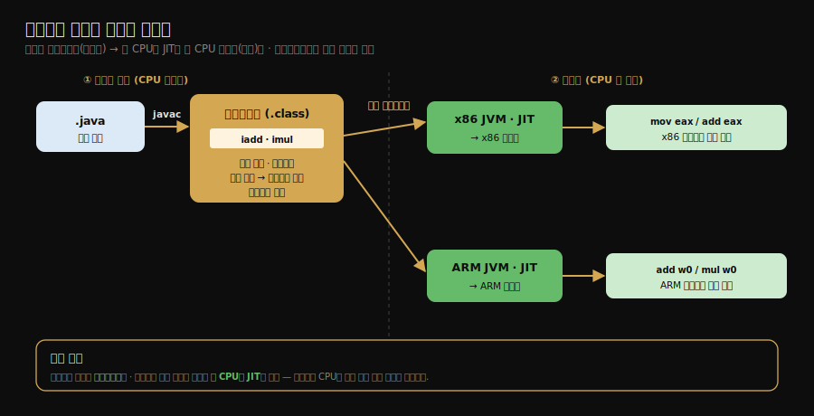
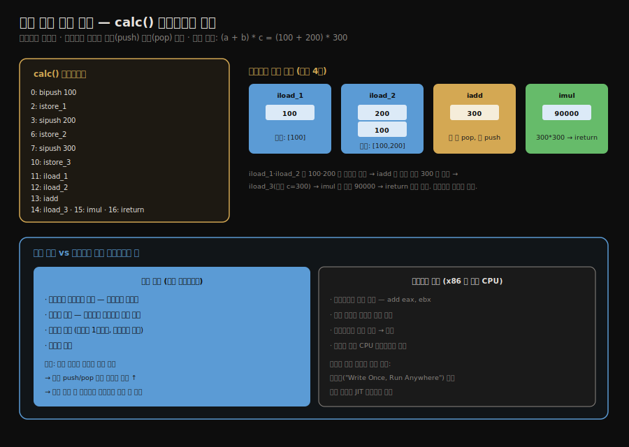

# 스택 기반 해석 실행 엔진
---
> §8.5~§8.6을 한 줄로 압축하면 — **자바 바이트코드는 레지스터를 지정하지 않고 피연산자 스택을 밀고 당겨 계산하는 *스택 기반 인스트럭션 셋*이며, 이식성을 얻는 대신 명령어 수가 많아질 수 있습니다.** 
>
> 핵심은 "스택 기반은 하드웨어 레지스터 수에 무관해 이식성이 높지만, 같은 계산에 명령어가 더 많이 든다"는 트레이드오프이며, `calc()` 한 줄을 바이트코드로 추적하면 그 구조가 한눈에 보입니다.

이 글을 읽고 나면 스택 기반 인스트럭션 셋과 레지스터 기반의 차이를 말하고, 간단한 산술 메서드의 바이트코드가 피연산자 스택을 어떻게 밀고 당기는지 추적하며, 자바가 이식성을 위해 어떤 트레이드오프를 택했는지 그림 없이 짚을 수 있습니다.


## 진입 — 인터프리터는 어떻게 실행하는가

> 자바 가상 머신의 실행 엔진은 바이트코드를 *해석*하거나 *컴파일*해 실행합니다. 이 글은 그중 해석 실행, 즉 인터프리터가 바이트코드를 한 줄씩 도는 방식을 다룹니다.

[앞 글들](./03-03.동적%20타입%20언어%20지원과%20invokedynamic.md)이 *어떤 메서드를 부를지* 정하는 디스패치였다면, 이 글은 *그 바이트코드가 실제로 어떻게 도는가*입니다. 자바의 실행 엔진은 바이트코드를 해석 실행(인터프리터)하거나, 자주 도는 코드를 기계어로 컴파일(JIT)해 실행합니다. 여기서는 해석 실행의 토대인 *스택 기반 모델*을 봅니다.


## 1. 해석 실행과 컴파일 실행

> **자바 컴파일은 소스를 *바이트코드***까지만 만들고, 그 바이트코드를 **런타임에 인터프리터가 해석하거나 JIT가 기계어로 컴파일**합니다.

전통적인 컴파일 언어는 소스를 곧장 기계어로 번역합니다. 자바는 *반만* 컴파일합니다. 

- `javac`가 소스를 바이트코드(`.class`)까지 만들고, 그 바이트코드를 실행하는 일은 런타임의 가상 머신이 맡습니다. 가상 머신은 바이트코드를 두 방식으로 실행합니다.

1. **해석 실행은 인터프리터가 바이트코드를 *한 명령씩 읽어 즉시 실행***합니다. 시작이 빠르지만 반복 실행이 느립니다.
2. **컴파일 실행은 JIT 컴파일러가 자주 도는 바이트코드를 *기계어로 번역해 캐시***합니다. 번역 비용이 들지만 반복 실행이 빠릅니다.

대부분의 상용 가상 머신은 둘을 함께 씁니다. 이 *혼합 실행(mixed mode)*은 처음엔 해석 실행으로 빠르게 시작하고, 호출·반복 횟수를 세어 뜨거워진(hot) 코드만 JIT로 컴파일하는 방식입니다. HotSpot은 여기에 *계층형 컴파일(tiered compilation)*을 더해, 빠르지만 단순한 *C1*으로 먼저 컴파일했다가 더 뜨거운 코드는 느리지만 공격적으로 최적화하는 *C2*로 다시 컴파일합니다. 시작 속도와 장기 성능을 동시에 잡으려는 설계입니다.

- 실행 방식은 옵션으로 강제할 수 있습니다. `-Xint`는 해석 실행만(디버깅·관찰용), `-Xcomp`는 시작부터 전부 컴파일, `-XX:CompileThreshold`는 컴파일로 넘어가는 호출 횟수 임계값을 조정합니다.
- 다만 *이 글의 주제는 해석 실행의 기반인 스택 기반 모델*입니다. JIT·계층형 컴파일·C1/C2·핫스폿 탐지의 깊은 내용은 별도 정본이 다루므로, 여기서는 "해석의 반복 비용을 JIT가 메운다"는 연결만 잡고 넘어갑니다(§관련 문서).

그렇다면 "처음부터 전부 JIT로 컴파일하면 더 빠르지 않은가"라는 의문이 자연스럽습니다(실제 `-Xcomp` 옵션이 그것입니다). 

그러나 거의 쓰이지 않습니다. JIT는 *공짜로 빠른 것*이 아니라 *번역 비용을 내고 사는 속도*이기 때문입니다. 

- 프로그램 코드의 큰 부분은 한 번만 실행되거나(초기화·설정 로딩) 몇 번만 도는데, 이런 코드를 컴파일하면 *번역에 든 시간이 번역으로 아낀 시간보다 큽니다*. 
- 게다가 모든 메서드를 시작 시점에 공격적으로 컴파일하면 시작이 크게 느려지고, JIT가 의존하는 *런타임 프로파일*(어느 분기가 자주 타는지, 어떤 타입이 들어오는지)도 아직 없어 최적화 품질까지 떨어집니다. 

그래서 HotSpot은 "전부 컴파일"이 아니라 *뜨거운 정도에 따라 투자를 차등*합니다 — 처음엔 인터프리터로 프로파일을 모으고, 좀 뜨거워지면 C1으로 가볍게, 아주 뜨거워지면 C2로 공격적으로 컴파일합니다. 핵심은 *번역 비용이 회수될 코드(hot)에만 선택적으로* JIT를 적용하는 것이 최적이라는 점입니다.

### C1이 데이터를 모으고, C2가 그 데이터에 베팅한다

C1과 C2를 "가벼운 컴파일러"와 "무거운 컴파일러"로만 보면 절반만 이해한 것입니다. 둘의 진짜 분업은 *누가 데이터를 모으고 누가 그 데이터로 도박을 하는가*에 있습니다.

- **C1은 본 작업과 계측(instrumentation)을 겸합니다.** C1이 바이트코드를 기계어로 번역할 때, 순수 연산 기계어만 만드는 게 아니라 그 사이사이에 *카운터를 증가시키는 추가 기계어*를 끼워 넣습니다. 그래서 C1으로 도는 동안 "이 분기는 true를 몇 번 탔나", "이 가상 호출에 실제로 어떤 타입이 들어왔나", "이 메서드가 몇 번 호출됐나" 같은 *런타임 프로파일*이 쌓입니다. 이 계측 자체가 약간의 오버헤드라 C1 코드는 C2 코드보다 느립니다 — 하지만 "조금 느리게 돌며 데이터를 모아 두면 나중에 C2가 훨씬 빠른 코드를 만든다"는 의도된 거래입니다.

| 계측 종류 | 무엇을 기록하나 | C2가 이걸로 하는 최적화 |
|----------|----------------|----------------------|
| 분기 카운터 | `if`의 true/false 각각 몇 번 탔나 | 자주 안 타는 분기를 뒤로 빼거나 제거 |
| 호출 카운터 | 이 메서드가 몇 번 호출됐나 | 컴파일 임계값 판단 |
| 타입 프로파일 | 가상 호출에 실제로 어떤 타입이 들어왔나 | "거의 항상 한 타입"이면 인라이닝 |
| 분기 도달 | 이 경로가 한 번이라도 실행됐나 | 안 밟힌 경로는 deopt 트랩으로 |

- **C2는 그 프로파일에 *베팅*합니다.** 예를 들어 `animal.sound()`라는 가상 호출에서 C1 계측이 "1만 번 중 9,998번이 `Dog`였다"를 기록하면, C2는 *"거의 항상 Dog니까 `Dog.sound()`를 인라이닝(호출 자체를 없애고 본문을 펼침)하자. 만에 하나 Dog가 아니면 그때만 되돌리자"*고 결정합니다. 이 인라이닝은 *프로파일 없이는 불가능한 최적화*입니다 — 컴파일 시점엔 "9,998번이 Dog"라는 사실을 알 수 없으니까요. AOT나 `-Xcomp`가 이런 최적화에 약한 이유가 바로 이것입니다.

- **베팅이 빗나가면 *디옵티마이제이션(deoptimization)*으로 되돌립니다.** C2가 "항상 Dog"라 가정하고 인라이닝했는데 런타임에 `Cat`이 들어오면, 그 가정이 깨집니다. 이때 JVM은 C2가 만든 기계어를 버리고 *안전하게 인터프리터로 되돌아가* 그 호출을 처리합니다. "최적화대로 안 돌 수 있으니 폐기하고 인터프리터로 빠질 길을 항상 열어 둔다" — 이 안전장치가 있어 C2는 과감히 베팅할 수 있습니다.

흐름으로 묶으면 `인터프리터(프로파일 수집) → C1(빠른 코드 + 계측) → C2(프로파일 기반 공격적 최적화) → (가정 깨지면) deopt로 인터프리터 복귀`입니다.

그리고 이 컴파일 작업은 *애플리케이션 스레드를 멈추지 않습니다*. 컴파일 요청을 큐에 넣고 *백그라운드 스레드*가 번역하는 동안, 애플리케이션은 기존 코드(인터프리터나 C1 버전)로 계속 돌다가 컴파일이 끝난 시점부터 새 코드로 갈아탑니다. C1을 다리로 끼우는 이유가 여기서도 보입니다 — C2 컴파일을 기다리는 공백을, 먼저 완성된 C1 코드가 메웁니다. 컴파일 한 건에 드는 시간은 대략 *C1이 수십 마이크로초~1ms 미만*, *C2는 그 10~100배인 수~수십 ms*(큰 메서드는 100ms+)이고, 애플리케이션 전체가 "충분히 빨라지는" 워밍업은 메서드 수천 개가 단계적으로 컴파일되며 누적되어 보통 *수 초~수십 초*입니다. 서버 앱이 "켜고 한참 지나야 제 속도가 난다"는 게 이 워밍업이고, 이 비용을 없애려는 시도가 AOT/Native Image입니다(대신 프로파일 기반 최적화를 일부 포기).

> 여기까지는 *해석 실행과 JIT의 경계*를 이해하는 데 필요한 만큼만 짚었습니다. C1/C2의 5단계 레벨, 계층형 컴파일 임계값, deopt의 내부 메커니즘 같은 깊은 내용은 별도 정본이 다룹니다 → [JIT 컴파일러 — 인터프리터와 계층형 컴파일](../ch04_compilation-optimization/02-01.JIT%20컴파일러%20%E2%80%94%20인터프리터와%20계층형%20컴파일.md).


## 2. 스택 기반 vs 레지스터 기반 인스트럭션 셋

> 자바 바이트코드는 레지스터를 지정하지 않고 피연산자 스택으로 계산하는 스택 기반입니다. 물리 CPU의 레지스터 기반과 달리, 이식성을 위해 속도를 일부 양보했습니다.

명령어 집합(instruction set)을 설계하는 두 방식이 있습니다.

1. ***스택 기반(stack-based)***은 피연산자를 *피연산자 스택*에 두고 계산합니다. 명령어가 레지스터를 지정하지 않습니다. 자바 바이트코드가 이 방식입니다.
2. ***레지스터 기반(register-based)***은 명령어가 *레지스터를 직접 지정*합니다. `add eax, ebx`처럼 어느 레지스터를 쓸지 명시합니다. x86 같은 물리 CPU가 이 방식입니다.

자바가 스택 기반을 택한 이유는 *이식성*입니다. 스택 기반 명령어는 하드웨어 레지스터의 개수·종류에 의존하지 않으므로, 어떤 CPU 위에서든 같은 바이트코드가 돕니다. 이것이 "Write Once, Run Anywhere"의 한 축입니다. 또 옵코드가 1바이트로 조밀하고 구현이 단순합니다.

대가는 *속도*입니다. 같은 계산을 하는 데 스택 기반은 명령어가 더 많이 듭니다. `100 + 200`을 두 방식으로 나란히 두면 차이가 한눈에 보입니다.

```asm
; 레지스터 기반 (x86 어셈블리)
mov eax, 100      ; eax = 100
add eax, 200      ; eax = eax + 200   → 2 명령으로 끝
```

```
// 스택 기반 (자바 바이트코드)
bipush 100        // 스택에 100 push
istore_1          // pop 해서 지역변수 slot1 에 저장
bipush 200        // 스택에 200 push
iload_1           // slot1(100) 을 다시 push → 스택: [200, 100]
iadd              // 두 값 pop, 합 push    → 스택: [300]
```

- 레지스터 기반이 레지스터를 직접 지정해 `mov`·`add` 두 명령으로 끝내는 일을, 스택 기반은 값을 스택에 올리고(`push`·`load`) 더하고(`iadd`) 내리는 여러 명령으로 풀어 씁니다. 
- 스택 push·pop이 잦아 메모리 접근이 늘어, 해석 실행 시 레지스터 기반보다 느릴 수 있습니다. 자바는 이 손실을 JIT 컴파일로 메웁니다 — 뜨거운 코드를 *레지스터 기반인 네이티브 기계어*로 바꿔, 물리 CPU의 레지스터를 직접 쓰게 만듭니다.

두 설계를 여섯 축으로 대조하면 트레이드오프가 분명해집니다.

| 항목 | 스택 기반 (자바 바이트코드) | 레지스터 기반 (x86 등) |
|------|------------------------|----------------------|
| 이식성 | 높음 — 레지스터에 의존 안 함 | 낮음 — 하드웨어에 종속 |
| 명령어 수 | 많음 (push·pop이 잦음) | 적음 |
| 인터프리터 구현 | 단순 (스택 포인터만 관리) | 복잡 (레지스터 할당 필요) |
| 해석 실행 속도 | 느린 편 | 빠름 |
| JIT 컴파일 후 성능 | 좋음 (레지스터 기반으로 변환) | 좋음 |
| 설계 목적 | 플랫폼 독립성 | 최고 성능 |

- 핵심은 *스택 기반이 이식성을, 레지스터 기반이 해석 속도를* 가져간다는 점입니다. 자바는 이식성을 택한 뒤 속도 손실을 JIT로 보완해, 시작 속도와 장기 성능을 모두 잡습니다.

여기서 "이식성과 속도는 맞바꾸는 것"이라는 트레이드오프가, 자바에서는 *모순이 아니라 단계 분리로 양립*한다는 점을 짚어야 합니다. 자바는 둘을 한 표현에 욱여넣지 않고, *컴파일 시점*과 *런타임*으로 책임을 나눕니다.

- `javac`가 만드는 **바이트코드**는 스택 기반이라 레지스터 번호를 적지 않습니다. 그래서 *플랫폼 비종속*입니다 — 배포하는 `.class`/`.jar`은 하나뿐이고, 어떤 CPU 위에서든 같은 바이트코드가 돕니다.
- 그 바이트코드를 실행할 때 각 플랫폼의 **JIT**가 *그 CPU의 기계어*(레지스터 기반)로 번역합니다. x86 위에서는 x86 JVM이 x86 레지스터를 쓰는 기계어로, 애플 실리콘(ARM) 위에서는 ARM JVM이 ARM 기계어로 컴파일합니다.

즉 *플랫폼 비종속의 책임은 바이트코드가, 플랫폼별 최적 성능의 책임은 각 JIT가* 집니다. 개발자는 CPU를 신경 쓰지 않고 하나의 바이트코드를 배포하고, 각 CPU의 최고 성능은 그 CPU의 JIT가 뽑아 줍니다. 스택 기반(이식성) → JIT(CPU별 성능)라는 *2단계*가, 한 설계 안에서 두 목표를 모두 달성하게 하는 구조입니다.




## 3. 실전 — calc() 바이트코드 추적

> 간단한 산술 메서드 `(a + b) * c`의 바이트코드를 한 줄씩 따라가면, 모든 계산이 피연산자 스택을 밀고 당기며 이루어지는 모습이 한눈에 보입니다.



책 §8.5.3의 예제 메서드를 그대로 봅니다.

```java
public int calc() {
    int a = 100;
    int b = 200;
    int c = 300;
    return (a + b) * c;   // (100 + 200) * 300 = 90000
}
```

이 메서드를 `javap -c`로 떠내면 바이트코드는 다음과 같습니다.

```
0:  bipush 100      // 100 을 피연산자 스택에 push
2:  istore_1        // pop 해서 지역변수 slot1(a) 에 저장
3:  sipush 200      // 200 을 push
6:  istore_2        // pop 해서 slot2(b) 에 저장
7:  sipush 300      // 300 을 push
10: istore_3        // pop 해서 slot3(c) 에 저장

11: iload_1         // a(100) 를 스택에 push       → 스택: [100]
12: iload_2         // b(200) 를 push               → 스택: [100, 200]
13: iadd            // 두 값 pop, 합(300) push       → 스택: [300]
14: iload_3         // c(300) 를 push                → 스택: [300, 300]
15: imul            // 두 값 pop, 곱(90000) push     → 스택: [90000]
16: ireturn         // 스택 top(90000) 을 반환
```

**추적 분석:**

- `bipush`·`sipush`는 상수를 피연산자 스택에 올리고, `istore_N`은 그것을 지역 변수로 내립니다. 변수 초기화가 이 왕복으로 이루어집니다.
- 핵심은 11~15번입니다. `iload_1`·`iload_2`로 `a`·`b`를 스택에 쌓으면 스택은 `[100, 200]`이 됩니다. `iadd`가 두 값을 pop해 더한 `300`을 다시 push하므로 스택은 `[300]`이 됩니다.
- `iload_3`로 `c`(300)를 올려 `[300, 300]`, `imul`이 둘을 곱해 `[90000]`. `ireturn`이 그 값을 반환합니다.
- 어느 명령에도 *레지스터 번호가 없습니다*. 모든 계산이 피연산자 스택의 top 근처에서 일어납니다. 이것이 스택 기반의 실행 모습입니다.

`(100 + 200) * 300 = 90000`이라는 한 줄 계산이, 스택을 밀고 당기는 여러 바이트코드로 풀립니다. 명령어 수가 많아 보이지만, 그 대가로 이 바이트코드는 어떤 하드웨어 위에서든 동일하게 돕니다.


## 4. 실습 — istore 왕복은 덧셈 비용이 아니다

§3의 `calc()` 추적을 직접 `javap`로 떠 확인하면서, 한 가지 흔한 오해를 같이 풀 수 있습니다. "스택 기반은 명령어가 많다"고 할 때, 그 *많음*이 어디서 오는지입니다.

```bash
javac Calc.java
javap -c Calc
```

`calc()`의 바이트코드는 §3과 같습니다. 여기에 `addTwo(int a, int b) { return a + b; }`를 나란히 떠 보면 대조가 드러납니다.

```
calc() 의 a+b 부분             addTwo(int,int)
 0: bipush 100 / 2: istore_1    0: iload_1
 3: sipush 200 / 6: istore_2    1: iload_2
11: iload_1 / 12: iload_2       2: iadd
13: iadd                        3: ireturn
```

같은 `a + b`인데 `addTwo`에는 `istore`가 없습니다. 인자로 받은 값은 *이미 지역 변수 slot에 들어와 있어서*, `iload` 둘로 곧장 스택에 올려 `iadd`하면 끝입니다. 반면 `calc()`는 `a`·`b`를 *상수에서 만들어 변수에 넣는* 초기화가 있어, 그 단계에서 `bipush/sipush(push) → istore(pop)` 왕복이 붙습니다.

즉 `calc()`에서 명령어가 많아 보이는 까닭의 상당 부분은 *덧셈이 아니라 변수 초기화* 때문입니다. `iadd` 자체는 어느 쪽이든 "스택의 두 값을 pop해 합을 push"하는 한 명령이고, 그 앞에 `iload`가 둘 선행해야 한다는 구조도 같습니다. 스택 기반의 *명령어 수 증가*를 이야기할 때, 초기화 왕복과 연산 자체를 나눠 보는 눈이 필요합니다.

그리고 세 메서드 어디에도 레지스터 번호가 없습니다. x86이라면 `mov eax,100 / add eax,200`처럼 레지스터를 지정해 두 명령으로 끝낼 일을, 스택 기반은 `iload/iload/iadd`로 풉니다 — 명령어는 더 들지만, 그 대가로 레지스터 수가 다른 어떤 CPU에서도 같은 바이트코드가 돕니다.

> **혼동 주의 — `istore`/`iload`는 JMM의 "작업 메모리"가 아닙니다.** `istore`가 "값을 어딘가에 저장"하고 `iload`가 "값을 어딘가에서 적재"한다고 하면, *메인 메모리 ↔ 스레드 작업 메모리*를 오가는 JMM(Java Memory Model)의 가시성 이야기와 헷갈리기 쉽습니다. 둘은 *층위가 다릅니다*. `istore`/`iload`는 **한 스택 프레임 안에서 피연산자 스택 ↔ 지역 변수 슬롯** 사이의 값 이동일 뿐이고, 이건 한 스레드 내부의 실행 메커니즘입니다. 반면 JMM의 작업 메모리/메인 메모리는 *여러 스레드 사이에서 한 변수의 변경이 언제 보이는가*라는 가시성 모델로, `volatile`·`synchronized`가 다루는 영역입니다. "값을 옮긴다"는 표현이 같아도 — 하나는 *프레임 내부 데이터 흐름*, 다른 하나는 *스레드 간 가시성* — 섞으면 안 됩니다.


## 5. 면접 대비 요약

> 핵심은 "자바 바이트코드=스택 기반=레지스터 미지정", "이식성↔속도 트레이드오프", "JIT로 속도 손실 보완"입니다.

### 한 줄 정의

스택 기반 해석 실행 엔진이란, 레지스터를 지정하지 않고 피연산자 스택을 밀고 당겨 계산하는 인스트럭션 셋을 인터프리터가 한 명령씩 해석해 실행하는 구조를 말합니다.

### 핵심 포인트 3가지

1. 자바 바이트코드는 스택 기반이라 레지스터를 지정하지 않고 피연산자 스택으로 계산하며, 하드웨어에 무관한 이식성을 얻습니다.
2. 대가로 같은 계산에 명령어 수가 많아 push·pop이 잦고, 해석 실행 시 레지스터 기반보다 느릴 수 있습니다.
3. 가상 머신은 해석 실행으로 빠르게 시작하고 뜨거운 코드를 JIT로 컴파일해, 이식성과 속도를 함께 얻습니다.

### 면접에서 받을 만한 질문

1. 자바가 레지스터 기반이 아니라 스택 기반 인스트럭션 셋을 택한 이유는 무엇입니까?
2. 스택 기반의 단점과 그 보완책은 무엇입니까?
3. `(a + b) * c` 계산이 피연산자 스택에서 어떻게 처리되는지 설명해 보세요.

> 세 질문에 *먼저 자답한 뒤* 아래 §정답으로 내려갑니다.


## 정답 (자답 후 펼치기)

> 위 §면접에서 받을 만한 질문의 3개에 *먼저 자답한 뒤* 아래를 읽으세요.

### 정답 1 — 스택 기반을 택한 이유

*이식성*입니다. 스택 기반 명령어는 하드웨어 레지스터의 개수·종류에 의존하지 않으므로, 어떤 CPU 위에서든 같은 바이트코드가 동일하게 돕니다. "Write Once, Run Anywhere"를 떠받치는 선택입니다. 옵코드가 1바이트로 조밀하고 구현이 단순한 것도 장점입니다.

### 정답 2 — 단점과 보완책

단점은 *속도*입니다. 같은 계산에 명령어 수가 많아 스택 push·pop이 잦고 메모리 접근이 늘어, 해석 실행 시 레지스터 기반보다 느릴 수 있습니다. 보완책은 *JIT 컴파일*입니다. 자주 도는 뜨거운 코드를 기계어로 번역해 캐시하므로, 반복 실행의 속도 손실을 메웁니다.

### 정답 3 — (a + b) * c의 스택 처리

`iload`로 `a`(100)와 `b`(200)를 피연산자 스택에 차례로 올려 `[100, 200]`을 만들고, `iadd`가 둘을 pop해 합 `300`을 push합니다. 이어 `iload`로 `c`(300)를 올려 `[300, 300]`, `imul`이 둘을 곱해 `90000`을 남기고, `ireturn`이 그 값을 반환합니다. 레지스터 지정 없이 모든 계산이 스택 top 근처에서 일어납니다.


## 핵심 개념 체크리스트

- [ ] 해석 실행과 컴파일 실행의 차이를 말할 수 있는가?
- [ ] 스택 기반과 레지스터 기반 인스트럭션 셋을 구분할 수 있는가?
- [ ] 자바가 스택 기반을 택한 이유(이식성)를 설명할 수 있는가?
- [ ] 스택 기반의 속도 단점과 JIT 보완을 아는가?
- [ ] 간단한 산술식의 바이트코드 실행을 스택 변화로 추적할 수 있는가?


## 관련 문서

> 이 글로 8장 바이트코드 실행 엔진이 마무리됩니다. 실행의 무대인 프레임, 실행 대상인 바이트코드 명령어가 앞뒤를 받칩니다.

- [03-01. 런타임 스택 프레임 구조](./03-01.런타임%20스택%20프레임%20구조.md) § "피연산자 스택" — 이 글의 계산이 일어나는 자리
- [03-03. 동적 타입 언어 지원과 invokedynamic](./03-03.동적%20타입%20언어%20지원과%20invokedynamic.md) — 이 엔진이 실행하는 다섯 번째 호출 명령
- [바이트코드 명령어](./01-02.바이트코드%20명령어.md) — `iload`·`iadd` 등 옵코드의 자료형 규칙
- [JIT 컴파일러 — 인터프리터와 계층형 컴파일](../ch04_compilation-optimization/02-01.JIT%20컴파일러%20%E2%80%94%20인터프리터와%20계층형%20컴파일.md) — §1에서 짚은 C1/C2·계층형 컴파일의 정본
- [컴파일 대상과 핫스폿 탐지](../ch04_compilation-optimization/02-02.컴파일%20대상과%20핫스폿%20탐지.md) — 어떤 코드를 "뜨겁다" 판정해 JIT로 넘기는지
