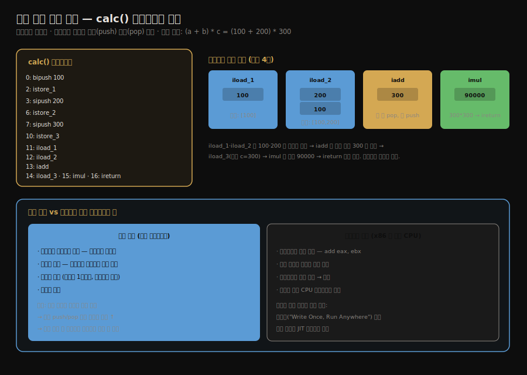

# 스택 기반 해석 실행 엔진
---
> §8.5~§8.6을 한 줄로 압축하면 — **자바 바이트코드는 레지스터를 지정하지 않고 피연산자 스택을 밀고 당겨 계산하는 *스택 기반 인스트럭션 셋*이며, 이식성을 얻는 대신 명령어 수가 많아질 수 있습니다.** 핵심은 "스택 기반은 하드웨어 레지스터 수에 무관해 이식성이 높지만, 같은 계산에 명령어가 더 많이 든다"는 트레이드오프이며, `calc()` 한 줄을 바이트코드로 추적하면 그 구조가 한눈에 보입니다.

이 글을 읽고 나면 스택 기반 인스트럭션 셋과 레지스터 기반의 차이를 말하고, 간단한 산술 메서드의 바이트코드가 피연산자 스택을 어떻게 밀고 당기는지 추적하며, 자바가 이식성을 위해 어떤 트레이드오프를 택했는지 그림 없이 짚을 수 있습니다.


## 진입 — 인터프리터는 어떻게 실행하는가

> 자바 가상 머신의 실행 엔진은 바이트코드를 *해석*하거나 *컴파일*해 실행합니다. 이 글은 그중 해석 실행, 즉 인터프리터가 바이트코드를 한 줄씩 도는 방식을 다룹니다.

[앞 글들](./03-04.동적%20타입%20언어%20지원과%20invokedynamic.md)이 *어떤 메서드를 부를지* 정하는 디스패치였다면, 이 글은 *그 바이트코드가 실제로 어떻게 도는가*입니다. 자바의 실행 엔진은 바이트코드를 해석 실행(인터프리터)하거나, 자주 도는 코드를 기계어로 컴파일(JIT)해 실행합니다. 여기서는 해석 실행의 토대인 *스택 기반 모델*을 봅니다.


## 1. 해석 실행과 컴파일 실행

> 자바 컴파일은 소스를 *바이트코드*까지만 만들고, 그 바이트코드를 런타임에 인터프리터가 해석하거나 JIT가 기계어로 컴파일합니다.

전통적인 컴파일 언어는 소스를 곧장 기계어로 번역합니다. 자바는 *반만* 컴파일합니다. `javac`가 소스를 바이트코드(`.class`)까지 만들고, 그 바이트코드를 실행하는 일은 런타임의 가상 머신이 맡습니다. 가상 머신은 바이트코드를 두 방식으로 실행합니다.

1. 해석 실행은 인터프리터가 바이트코드를 *한 명령씩 읽어 즉시 실행*합니다. 시작이 빠르지만 반복 실행이 느립니다.
2. 컴파일 실행은 JIT 컴파일러가 자주 도는 바이트코드를 *기계어로 번역해 캐시*합니다. 번역 비용이 들지만 반복 실행이 빠릅니다.

대부분의 상용 가상 머신은 둘을 함께 씁니다. 처음엔 해석 실행으로 빠르게 시작하고, 뜨거워진(hot) 코드만 JIT로 컴파일합니다. 이 글의 스택 기반 모델은 *해석 실행*의 기반 구조입니다.


## 2. 스택 기반 vs 레지스터 기반 인스트럭션 셋

> 자바 바이트코드는 레지스터를 지정하지 않고 피연산자 스택으로 계산하는 스택 기반입니다. 물리 CPU의 레지스터 기반과 달리, 이식성을 위해 속도를 일부 양보했습니다.

명령어 집합(instruction set)을 설계하는 두 방식이 있습니다.

1. *스택 기반(stack-based)*은 피연산자를 *피연산자 스택*에 두고 계산합니다. 명령어가 레지스터를 지정하지 않습니다. 자바 바이트코드가 이 방식입니다.
2. *레지스터 기반(register-based)*은 명령어가 *레지스터를 직접 지정*합니다. `add eax, ebx`처럼 어느 레지스터를 쓸지 명시합니다. x86 같은 물리 CPU가 이 방식입니다.

자바가 스택 기반을 택한 이유는 *이식성*입니다. 스택 기반 명령어는 하드웨어 레지스터의 개수·종류에 의존하지 않으므로, 어떤 CPU 위에서든 같은 바이트코드가 돕니다. 이것이 "Write Once, Run Anywhere"의 한 축입니다. 또 옵코드가 1바이트로 조밀하고 구현이 단순합니다.

대가는 *속도*입니다. 같은 계산을 하는 데 스택 기반은 명령어가 더 많이 듭니다. 레지스터 기반이 `add eax, ebx` 한 줄로 끝낼 일을, 스택 기반은 두 값을 스택에 올리고(`iload` 두 번) 더하고(`iadd`) 결과를 내리는(`istore`) 여러 명령으로 처리합니다. 스택 push·pop이 잦아 메모리 접근이 늘어, 해석 실행 시 레지스터 기반보다 느릴 수 있습니다. 자바는 이 손실을 JIT 컴파일로 메웁니다.


## 3. 실전 — calc() 바이트코드 추적

> 간단한 산술 메서드 `(a + b) * c`의 바이트코드를 한 줄씩 따라가면, 모든 계산이 피연산자 스택을 밀고 당기며 이루어지는 모습이 한눈에 보입니다.



책 §8.5.3의 예제 메서드를 그대로 봅니다.

```java
public int calc() {
    int a = 100;
    int b = 200;
    int c = 300;
    return (a + b) * c;   // (100 + 200) * 300 = 90000
}
```

이 메서드를 `javap -c`로 떠내면 바이트코드는 다음과 같습니다.

```
0:  bipush 100      // 100 을 피연산자 스택에 push
2:  istore_1        // pop 해서 지역변수 slot1(a) 에 저장
3:  sipush 200      // 200 을 push
6:  istore_2        // pop 해서 slot2(b) 에 저장
7:  sipush 300      // 300 을 push
10: istore_3        // pop 해서 slot3(c) 에 저장
11: iload_1         // a(100) 를 스택에 push       → 스택: [100]
12: iload_2         // b(200) 를 push               → 스택: [100, 200]
13: iadd            // 두 값 pop, 합(300) push       → 스택: [300]
14: iload_3         // c(300) 를 push                → 스택: [300, 300]
15: imul            // 두 값 pop, 곱(90000) push     → 스택: [90000]
16: ireturn         // 스택 top(90000) 을 반환
```

**추적 분석:**

- `bipush`·`sipush`는 상수를 피연산자 스택에 올리고, `istore_N`은 그것을 지역 변수로 내립니다. 변수 초기화가 이 왕복으로 이루어집니다.
- 핵심은 11~15번입니다. `iload_1`·`iload_2`로 `a`·`b`를 스택에 쌓으면 스택은 `[100, 200]`이 됩니다. `iadd`가 두 값을 pop해 더한 `300`을 다시 push하므로 스택은 `[300]`이 됩니다.
- `iload_3`로 `c`(300)를 올려 `[300, 300]`, `imul`이 둘을 곱해 `[90000]`. `ireturn`이 그 값을 반환합니다.
- 어느 명령에도 *레지스터 번호가 없습니다*. 모든 계산이 피연산자 스택의 top 근처에서 일어납니다. 이것이 스택 기반의 실행 모습입니다.

`(100 + 200) * 300 = 90000`이라는 한 줄 계산이, 스택을 밀고 당기는 여러 바이트코드로 풀립니다. 명령어 수가 많아 보이지만, 그 대가로 이 바이트코드는 어떤 하드웨어 위에서든 동일하게 돕니다.


## 4. 면접 대비 요약

> 핵심은 "자바 바이트코드=스택 기반=레지스터 미지정", "이식성↔속도 트레이드오프", "JIT로 속도 손실 보완"입니다.

### 한 줄 정의

스택 기반 해석 실행 엔진이란, 레지스터를 지정하지 않고 피연산자 스택을 밀고 당겨 계산하는 인스트럭션 셋을 인터프리터가 한 명령씩 해석해 실행하는 구조를 말합니다.

### 핵심 포인트 3가지

1. 자바 바이트코드는 스택 기반이라 레지스터를 지정하지 않고 피연산자 스택으로 계산하며, 하드웨어에 무관한 이식성을 얻습니다.
2. 대가로 같은 계산에 명령어 수가 많아 push·pop이 잦고, 해석 실행 시 레지스터 기반보다 느릴 수 있습니다.
3. 가상 머신은 해석 실행으로 빠르게 시작하고 뜨거운 코드를 JIT로 컴파일해, 이식성과 속도를 함께 얻습니다.

### 면접에서 받을 만한 질문

1. 자바가 레지스터 기반이 아니라 스택 기반 인스트럭션 셋을 택한 이유는 무엇입니까?
2. 스택 기반의 단점과 그 보완책은 무엇입니까?
3. `(a + b) * c` 계산이 피연산자 스택에서 어떻게 처리되는지 설명해 보세요.

> 세 질문에 *먼저 자답한 뒤* 아래 §정답으로 내려갑니다.


## 정답 (자답 후 펼치기)

> 위 §면접에서 받을 만한 질문의 3개에 *먼저 자답한 뒤* 아래를 읽으세요.

### 정답 1 — 스택 기반을 택한 이유

*이식성*입니다. 스택 기반 명령어는 하드웨어 레지스터의 개수·종류에 의존하지 않으므로, 어떤 CPU 위에서든 같은 바이트코드가 동일하게 돕니다. "Write Once, Run Anywhere"를 떠받치는 선택입니다. 옵코드가 1바이트로 조밀하고 구현이 단순한 것도 장점입니다.

### 정답 2 — 단점과 보완책

단점은 *속도*입니다. 같은 계산에 명령어 수가 많아 스택 push·pop이 잦고 메모리 접근이 늘어, 해석 실행 시 레지스터 기반보다 느릴 수 있습니다. 보완책은 *JIT 컴파일*입니다. 자주 도는 뜨거운 코드를 기계어로 번역해 캐시하므로, 반복 실행의 속도 손실을 메웁니다.

### 정답 3 — (a + b) * c의 스택 처리

`iload`로 `a`(100)와 `b`(200)를 피연산자 스택에 차례로 올려 `[100, 200]`을 만들고, `iadd`가 둘을 pop해 합 `300`을 push합니다. 이어 `iload`로 `c`(300)를 올려 `[300, 300]`, `imul`이 둘을 곱해 `90000`을 남기고, `ireturn`이 그 값을 반환합니다. 레지스터 지정 없이 모든 계산이 스택 top 근처에서 일어납니다.


## 핵심 개념 체크리스트

- [ ] 해석 실행과 컴파일 실행의 차이를 말할 수 있는가?
- [ ] 스택 기반과 레지스터 기반 인스트럭션 셋을 구분할 수 있는가?
- [ ] 자바가 스택 기반을 택한 이유(이식성)를 설명할 수 있는가?
- [ ] 스택 기반의 속도 단점과 JIT 보완을 아는가?
- [ ] 간단한 산술식의 바이트코드 실행을 스택 변화로 추적할 수 있는가?


## 관련 문서

> 이 글로 8장 바이트코드 실행 엔진이 마무리됩니다. 실행의 무대인 프레임, 실행 대상인 바이트코드 명령어가 앞뒤를 받칩니다.

- [03-01. 런타임 스택 프레임 구조](./03-01.런타임%20스택%20프레임%20구조.md) § "피연산자 스택" — 이 글의 계산이 일어나는 자리
- [03-04. 동적 타입 언어 지원과 invokedynamic](./03-04.동적%20타입%20언어%20지원과%20invokedynamic.md) — 이 엔진이 실행하는 다섯 번째 호출 명령
- [바이트코드 명령어](../ch06_class-file/01-02.바이트코드%20명령어.md) — `iload`·`iadd` 등 옵코드의 자료형 규칙
