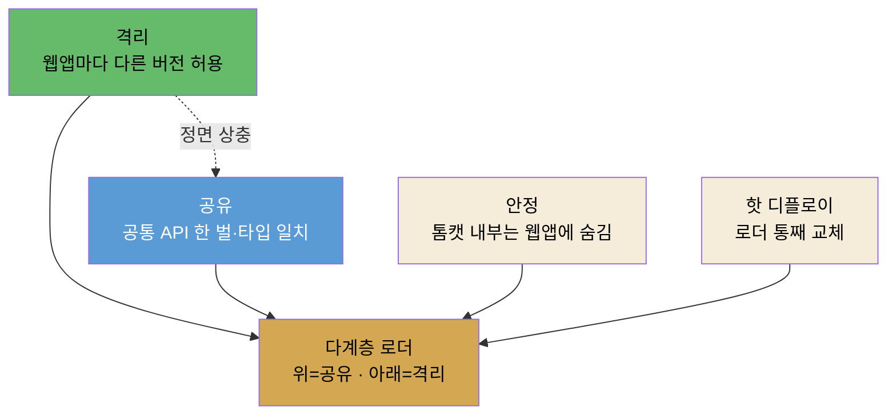
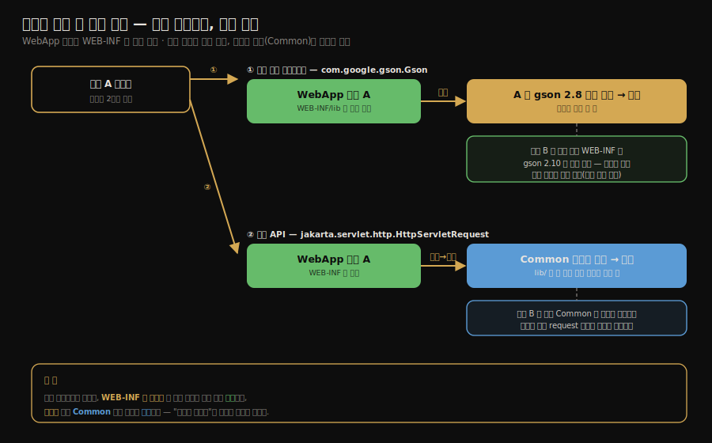

# 톰캣의 클래스 로더 아키텍처
---
> §9.1~§9.2.1을 한 줄로 압축하면 — **톰캣은 한 JVM에서 여러 웹 애플리케이션을 돌리므로, 공통 라이브러리는 위 계층에서 공유하고 웹앱끼리는 WebApp 로더로 격리하는 다계층 클래스 로더 구조를 씁니다.**
>
> 핵심은 "공유할 것은 위에, 격리할 것은 아래에"라는 설계 원리와, "같은 클래스도 웹앱마다 다른 로더가 로딩해 서로 다른 타입이 된다"는 격리 메커니즘입니다. 다만 Tomcat 10.1 기준 기본 구조는 `Bootstrap -> System -> Common -> WebApp`입니다.

이 글을 읽고 나면 톰캣이 왜 단일 부모 위임만으로 부족했는지 설명합니다. Common·Server(Catalina)·Shared·WebApp 로더의 역할을 구분합니다. Spring Boot embedded Tomcat과의 차이는 필요한 만큼만 비교합니다. 실행 JAR 구조는 [04-05](./04-05.Spring%20Boot%20실행%20JAR와%20클래스%20로딩.md)로 넘깁니다.

처음 읽는다면 네 질문만 붙잡으면 됩니다.

1. 왜 한 JVM에서 여러 웹앱을 돌리면 충돌이 생깁니까?
2. 톰캣은 어떤 클래스를 위에서 공유하고 어떤 클래스를 웹앱별로 분리합니까?
3. 같은 이름의 클래스가 왜 서로 다른 타입이 될 수 있습니까?
4. Spring Boot embedded Tomcat은 왜 외부 Tomcat 배포와 다르게 봐야 합니까?


## 1. 진입 — 왜 사례 연구인가

> 7·8장이 *클래스 로딩과 실행의 원리*였다면, 9장은 그 원리가 *실제 제품에서 어떻게 응용되는가*입니다. 톰캣은 부모 위임 모델을 격리 도구로 쓴 대표 사례입니다.

[7장의 부모 위임 모델](./02-04.클래스%20로더와%20부모%20위임%20모델.md)은 핵심 클래스의 유일성을 지키는 장치였습니다. 그런데 웹 컨테이너는 그 기본 모델만으로는 부족합니다. 한 톰캣 위에 여러 웹앱이 도는데, 각 웹앱이 같은 라이브러리의 *다른 버전*을 쓰거나 같은 이름의 클래스를 가질 수 있기 때문입니다. 톰캣은 이 요구를 다계층 클래스 로더로 풉니다. 이 글은 그 구조가 *왜 그렇게 생겼는가*를 봅니다.

> **먼저 — "웹앱(web application)"이 뭔가.** Spring Boot만 써 봤다면 이 단어가 낯설 수 있습니다. 두 배포 모델을 나란히 두면 분명해집니다.
>
> - **외부 Tomcat 모델(이 글의 무대):** 서버에 Tomcat을 *미리 설치*해 두고, 개발자는 앱을 `*.war` 파일로 빌드해 그 Tomcat의 `webapps/` 폴더에 *던져 넣습니다*. Tomcat이 그 `.war`를 풀어 하나의 "웹 애플리케이션"으로 올립니다. **한 Tomcat(한 JVM) 위에 `shop.war`·`pay.war`·`blog.war`를 동시에** 올릴 수 있고, 이 각각이 *웹앱 하나*입니다. 그래서 *한 JVM 안에 여러 앱이 공존*하고, 격리가 절실합니다 — `shop`이 `gson 2.8`, `pay`가 `gson 2.10`을 쓰는데 Tomcat이 `Gson`을 한 번만 로딩하면 한쪽이 깨지니까요.
> - **Spring Boot 모델(실무에서 쓰는 방식):** Tomcat이 앱 *안에* 라이브러리(`tomcat-embed-core`)로 들어와 있습니다(embedded Tomcat). `java -jar app.jar`를 하면 *앱이 자기 안의 Tomcat을 켭니다*. Tomcat이 앱을 올리는 게 아니라 **앱이 Tomcat을 품고 시작**하는, 책임이 정반대인 구조입니다. 게다가 *한 JVM = 보통 한 Boot 앱*이라, "여러 웹앱 격리" 문제 자체가 거의 생기지 않습니다.
>
> 즉 이 글의 복잡한 다계층 로더 구조는 **"한 Tomcat에 여러 `.war`"** 라는 외부 배포 모델을 위한 것입니다. Spring Boot가 이 격리 구조가 거의 필요 없는 이유 — *실행 주체가 반대(앱이 Tomcat을 품음) + 한 JVM 한 앱* — 는 [§5 Spring Boot embedded Tomcat과의 경계](#5-spring-boot-embedded-tomcat과의-경계)에서 다시 짚습니다.


## 2. 웹 컨테이너가 풀어야 할 네 가지 요구

> 한 JVM에서 여러 웹앱을 돌리려면 격리·공유·안정·핫 디플로이라는 상충하는 요구를 동시에 만족해야 합니다. 단일 부모 위임으로는 풀리지 않습니다.

톰캣 같은 웹 컨테이너는 한 JVM 위에서 여러 웹앱을 동시에 돌립니다. 그래서 단일 애플리케이션을 가정한 표준 클래스 로딩만으로는 풀리지 않는 네 가지 요구가 생깁니다. 각각이 *왜* 생기고 안 지키면 무슨 일이 나는지 봅니다.

**① 웹앱 간 격리.** 

- 한 톰캣에 쇼핑몰 웹앱과 결제 웹앱이 함께 떠 있다고 합시다. 쇼핑몰은 `gson 2.8`, 결제는 `gson 2.10`을 쓸 수 있습니다. 표준 로딩처럼 `com.google.gson.Gson`을 *한 번만* 로딩하면, 두 웹앱이 같은 버전을 강제로 공유하게 되어 한쪽이 깨집니다. 
- 그래서 같은 이름의 클래스라도 *웹앱마다 따로* 로딩해, 서로의 버전이 간섭하지 않게 해야 합니다.

**② 웹앱 간 공유.** 

- 반대 방향의 요구입니다. 모든 웹앱이 쓰는 `servlet-api` 같은 공통 클래스까지 웹앱마다 따로 로딩하면, 같은 클래스가 메모리에 수십 벌 올라가 낭비됩니다. 게다가 톰캣이 웹앱에 넘겨주는 `HttpServletRequest` 같은 타입은 *톰캣과 웹앱이 같은 클래스*여야 주고받을 수 있습니다.
- 웹앱마다 다른 `HttpServletRequest`를 로딩하면 톰캣이 만든 객체를 웹앱이 받지 못합니다. 그래서 공통 API는 *한 번만 로딩해 공유*해야 합니다.

**③ 안정성(톰캣 자신의 보호).** 

- 웹앱은 신뢰할 수 없는 코드일 수 있습니다. 웹앱이 톰캣 내부 클래스(Catalina 구현)를 보거나 덮어쓸 수 있으면, 한 웹앱의 버그나 악성 코드가 톰캣 전체를 흔듭니다. 그래서 톰캣 자신만 쓰는 클래스는 웹앱에 *아예 보이지 않는* 계층에 둬, 웹앱이 건드리지 못하게 막아야 합니다.

**④ 핫 디플로이.** 

- 운영 중 웹앱이나 JSP를 고칠 때마다 톰캣 전체를 재시작하면 그 위의 다른 웹앱까지 함께 멈춥니다. 그래서 *해당 웹앱(또는 JSP)만* 재시작 없이 교체할 수 있어야 합니다. 클래스는 한 번 로딩되면 개별 교체가 어렵습니다. *로더를 통째로 버리고 새로 만들면* 그 로더가 들고 있던 클래스가 한꺼번에 갈립니다.
- 톰캣은 이 "로더 단위 교체"로 핫 디플로이를 구현합니다. 웹앱 reload/redeploy에서는 WebApp 로더를 새로 만듭니다. JSP 변경 반영에서는 Jasper가 JSP를 서블릿 클래스로 다시 컴파일해 반영합니다(§3에서 자세히 봅니다). 둘 다 *기존 클래스를 직접 바꾸는 것*이 아니라 *새 로더나 새 컴파일 결과로 교체하는 것*에 가깝습니다.

이 네 요구 중 **격리(①)와 공유(②)가 정면으로 상충**합니다. 격리하려면 웹앱마다 로더를 따로 둬 분리해야 합니다. 공유하려면 한 로더가 다 같이 써야 합니다.

- 한 클래스를 동시에 분리하고 통합할 수는 없습니다. "모두 격리"는 공유를 깨고(공통 클래스 중복·타입 불일치) "모두 공유"는 격리를 깹니다(버전 충돌). 단일 부모 위임 하나로는 이 균형점을 잡을 수 없습니다. 톰캣은 *여러 층의 로더*로 "공유할 것은 위, 격리할 것은 아래"를 나눕니다.

네 요구 중 격리와 공유가 서로 반대 방향으로 당기고, 안정과 핫 디플로이가 거기에 얹히는 모습을 그림으로 보면 다음과 같습니다.



격리와 공유는 점선으로 이은 *정면 상충*입니다. 톰캣은 둘 중 하나를 버리는 대신, 공유 요구는 위 계층(Common)으로, 격리 요구는 아래 계층(WebApp)으로 내려 *층을 나눠* 동시에 만족시킵니다. 안정과 핫 디플로이도 같은 다계층 구조 위에서 풀립니다.


## 3. 톰캣의 다계층 로더 구조

> Tomcat 10.1의 기본 구조는 부트스트랩·시스템·Common·WebApp 로더입니다. Server(Catalina)와 Shared 로더는 `catalina.properties`로 켜는 고급 구조이므로, "항상 존재하는 네 로더"로 외우면 실제 운영 설정을 잘못 읽게 됩니다.

톰캣은 JVM 기본 로더(부트스트랩·시스템) 아래에 자체 로더 계층을 둡니다. Tomcat 10.1 공식 문서의 기본 계층은 다음처럼 단순합니다.

```text
Bootstrap
    |
  System
    |
  Common
  /    \
WebApp WebApp ...
```

책에서 설명하는 Server(Catalina)·Shared 로더까지 포함한 구조는 고급 구성입니다. `conf/catalina.properties`의 `server.loader`나 `shared.loader`에 값을 주면 Common 아래에 Server와 Shared가 갈라집니다. WebApp 로더들은 Shared 아래에 놓입니다.


맨 위 두 로더는 톰캣이 만든 게 아니라 JVM이 항상 두는 로더입니다. **Bootstrap 로더**는 `java.lang.Object` 같은 JRE 핵심 클래스를, **System(애플리케이션) 로더**는 `-classpath`/`CLASSPATH`로 지정한 클래스를 로딩합니다. 톰캣의 Common·WebApp 로더는 이 둘 *아래에* 자기 계층을 얹은 것입니다. 두 기본 로더의 자세한 역할은 [02-04 §2 "3계층 클래스 로더와 부모 위임"](./02-04.클래스%20로더와%20부모%20위임%20모델.md)이 정본입니다.

각 로더의 역할은 다음과 같습니다.

| 로더 | 보이는 대상 | 주로 읽는 위치 | 기억할 점 |
|------|-------------|----------------|-----------|
| Common | 톰캣 내부와 모든 웹앱 | `common.loader`가 가리키는 `$CATALINA_BASE/lib`, `$CATALINA_HOME/lib` | 공통 API와 톰캣 구성요소가 놓이는 계층입니다. 애플리케이션 클래스는 보통 여기에 두지 않습니다. |
| Server(Catalina) | 톰캣 내부 | `server.loader` 설정값 | 웹앱에는 보이지 않는 톰캣 전용 계층입니다. Tomcat 10.1에서는 기본 비활성입니다. |
| Shared | 모든 웹앱 | `shared.loader` 설정값 | 웹앱끼리 공유하지만 톰캣 내부는 직접 보지 않는 계층입니다. Tomcat 10.1에서는 기본 비활성입니다. |
| WebApp | 해당 웹앱 하나 | `WEB-INF/classes`, `WEB-INF/lib/*.jar` | 웹앱마다 하나씩 생기고 다른 웹앱에는 보이지 않습니다. |

### WEB-INF

여기서 자주 나오는 `WEB-INF`가 무엇인지 먼저 짚습니다. 

- `WEB-INF`는 자바 웹앱(WAR)의 *표준 디렉터리*로, 한 웹앱을 압축한 `appA.war`를 풀면 그 안에 있습니다. 

두 가지가 핵심입니다. 

1. 첫째, `WEB-INF`는 브라우저가 URL로 *직접 접근할 수 없는* 보호 영역이라(서블릿 스펙이 막습니다), 클래스·설정 같은 내부 자원을 여기 둡니다. 
2. 둘째, 그 안의 `WEB-INF/classes`(이 웹앱의 `.class`)와 `WEB-INF/lib`(이 웹앱의 `*.jar`)가 바로 *그 웹앱의 WebApp 로더가 읽는 곳*입니다. 그래서 "WebApp 로더가 WEB-INF를 먼저 뒤진다"는 말은 *그 웹앱 전용 클래스·라이브러리 폴더를 먼저 본다*는 뜻입니다.

각 로더가 어느 디렉터리를 읽는지 폴더 구조로 보면, "공유는 위 디렉터리·격리는 웹앱별 디렉터리"라는 배치가 한눈에 들어옵니다.

```
$CATALINA_HOME/
├── lib/                         ← Common 로더 (톰캣 + 모든 웹앱 공유)
│   └── (servlet-api.jar, 공통 JAR …)
├── bin/                         ← 부트스트랩용 (bootstrap.jar 등)
└── webapps/
    ├── appA/                    ← WebApp 로더 A (이 웹앱 전용 · 격리)
    │   └── WEB-INF/
    │       ├── classes/         ← appA 의 .class  (먼저 뒤지는 곳)
    │       └── lib/             ← appA 의 *.jar   (먼저 뒤지는 곳)
    └── appB/                    ← WebApp 로더 B (별도 로더 · A 와 격리)
        └── WEB-INF/
            ├── classes/         ← appB 의 .class
            └── lib/             ← appB 의 *.jar   (A 와 다른 버전 가능)

# (선택) Shared 로더 — shared.loader 로 지정한 디렉터리 (모든 웹앱 공유, 톰캣은 안 봄)
# Tomcat 10.1 기본 비활성
```

- `lib/`는 부모(Common) 계층이라 appA·appB가 *함께* 봅니다 — 공유.
- 각 `webapps/<app>/WEB-INF/`는 그 웹앱의 WebApp 로더만 읽습니다 — 격리. 그래서 appA·appB가 `WEB-INF/lib`에 *같은 라이브러리의 다른 버전*을 둬도 충돌하지 않습니다.

- 설계 원리는 한 문장입니다. *공유할 것은 위 계층(Common·Shared)에, 격리할 것은 아래 계층(WebApp)에* 둡니다. 위 계층은 부모라 여러 자식이 같은 클래스를 봅니다. WebApp 로더는 웹앱마다 분리되어 같은 이름의 클래스도 따로 로딩합니다.

### 클래스 요청 한 개를 따라가 보기

이 배치가 실제 로딩에서 어떻게 갈리는지, 웹앱 A의 코드가 클래스 두 개를 요청하는 상황으로 따라가 보겠습니다. 핵심은 *같은 요청 메커니즘*이 클래스를 *어디서 찾느냐*에 따라 격리와 공유로 나뉜다는 점입니다.

1. **웹앱 전용 라이브러리 — `com.google.gson.Gson`**: WebApp 로더 A는 자기 `WEB-INF/lib`를 먼저 뒤집니다. 거기에 `gson 2.8`이 있으니 부모로 위임하지 않고 *직접* 로딩합니다. 같은 시각 웹앱 B는 자기 `WEB-INF/lib`의 `gson 2.10`을 따로 로딩하므로, 이름은 같아도 로더가 달라 서로 다른 타입이 되어 버전이 충돌하지 않습니다 — 격리입니다.
2. **공통 API — `jakarta.servlet.http.HttpServletRequest`**: WebApp 로더 A의 `WEB-INF`에는 이 클래스가 없습니다. 그래서 부모인 Common 로더로 위임되고, Common이 `lib/`의 한 벌을 로딩해 모든 웹앱이 *같은 타입*을 받습니다. 덕분에 톰캣이 만든 request 객체를 웹앱이 그대로 받아 쓸 수 있습니다 — 공유입니다.



- 클래스패스의 정확한 정의, 컴파일·런타임 목록의 차이, 로더별 탐색 루트, 외부 컨테이너가 제공하는 API의 의존성 범위는 [패키지·JAR·클래스패스](../../06_Build/01-01.패키지·JAR·클래스패스.md)로 옮겼습니다. 여기서는 그 정본을 전제로 Common 로더는 공유 루트를, 각 WebApp 로더는 격리된 루트를 가진다는 구조에 집중합니다.

JSP는 한 단계 더 나아갑니다. JSP는 Jasper가 서블릿 클래스로 변환해 로딩합니다. JSP 파일이 바뀌면 기존 JSP 로더를 버리고 새 로더로 다시 읽는 방식으로 변경을 반영합니다. 일반 웹앱 클래스 변경은 보통 컨텍스트 reload나 redeploy 문제입니다. JSP 재컴파일은 Jasper가 관리하는 별도 흐름이라는 점을 구분해야 합니다.

JSP 한 장이 바뀌었을 때의 흐름만 따로 떼면 다음과 같습니다.


여기서도 *기존 클래스를 직접 고치는* 게 아니라 *새로 컴파일한 결과를 새 로더로 갈아 끼우는* 것입니다. 웹앱 reload가 WebApp 로더를 통째로 교체하는 것과 같은 발상이며, 단지 단위가 JSP 한 장으로 좁아진 형태입니다.


## 4. 격리의 핵심 — 로더가 다르면 타입이 다르다

> 웹앱 격리는 새 메커니즘이 아니라 "클래스 동일성 = 이름 + 로더" 성질을 그대로 활용한 것입니다. 웹앱마다 로더가 다르니 같은 클래스도 다른 타입이 됩니다.

웹앱 A와 B가 같은 `Foo.class`를 써도 충돌하지 않는 이유는, [7장에서 본 "클래스 동일성 = 클래스 이름 + 로더"](./02-04.클래스%20로더와%20부모%20위임%20모델.md) 성질 때문입니다. A의 `Foo`는 WebApp 로더 A가, B의 `Foo`는 WebApp 로더 B가 로딩하므로, JVM에게는 *이름은 같지만 서로 다른 클래스*입니다.

이 덕분에 두 웹앱이 같은 라이브러리의 다른 버전을 써도 서로 간섭하지 않습니다. 톰캣은 격리를 위한 새 장치를 만든 게 아니라, *클래스 로더의 기본 성질을 응용*했을 뿐입니다.

한 가지 더 짚을 점은, WebApp 로더가 *부모 위임을 일부 깬다*는 것입니다. 

- 표준 부모 위임은 부모에게 먼저 위임합니다. WebApp 로더는 웹앱의 독립성을 위해 기본적으로 자기 `WEB-INF/classes`와 `WEB-INF/lib/*.jar`를 먼저 뒤집니다. 
- 그래서 웹앱 안의 라이브러리 버전이 Common 계층의 같은 이름 클래스보다 우선될 수 있습니다.

다만 예외가 있습니다. JRE 기본 클래스는 웹앱이 덮어쓸 수 없고 Tomcat이 구현하는 Jakarta EE API(Servlet, JSP, EL, WebSocket 등)는 먼저 부모 쪽으로 위임됩니다.

- `<Loader delegate="true"/>`를 설정하면 WebApp 로더도 부모 우선 위임 순서를 따르므로 "Tomcat WebApp 로더는 항상 자식 우선"이라고 외우면 안 됩니다.


운영에서 이 원리는 `ClassCastException`으로 자주 드러납니다. 예를 들어 같은 `com.example.UserDto`가 Common에도 있고 WebApp에도 있으면, 이름이 같아도 로더가 달라 JVM은 두 타입을 다르게 봅니다. 

- 로그에 `com.example.UserDto cannot be cast to com.example.UserDto`처럼 이상한 메시지가 보인다면, 클래스 이름보다 먼저 "누가 로딩했는가"를 확인해야 합니다.

운영에서 더 자주 마주치는 클래스 로더 오류를 한 표로 모으면 다음과 같습니다. 이름은 비슷해 보여도 원인이 다릅니다.

| 오류 | 보통 의미 | 클래스 로더 관점 |
|------|-----------|------------------|
| `ClassNotFoundException` | 명시적으로 로딩하려는 클래스를 못 찾음 | `Class.forName`·리플렉션·SPI 조회 경로의 클래스패스에 클래스가 없음 |
| `NoClassDefFoundError` | 컴파일 때는 있었는데 런타임에 없음 | 배포 산출물의 `WEB-INF/lib` 또는 `BOOT-INF/lib`에서 JAR 누락 가능 |
| `ClassCastException: A cannot be cast to A` | 이름은 같은데 타입이 다름 | 같은 FQCN을 서로 다른 로더가 각자 정의함 |
| `NoSuchMethodError` | 메서드가 있다고 컴파일했는데 런타임 클래스에는 없음 | 같은 라이브러리의 다른 버전이 먼저 클래스패스에 잡힘 |
| `LinkageError` | 클래스 연결 단계 충돌 | 중복 클래스·버전 불일치·로더 충돌 |

오류 메시지로 *어느 단계에서* 실패했는지 가리는 방법은 [패키지·JAR·클래스패스 §8](../../06_Build/01-01.패키지·JAR·클래스패스.md)이 정본입니다. 그중 버전 충돌로 인한 `NoSuchMethodError`를 직접 재현해 보는 실습은 [04-01b. 클래스패스 격리와 버전 충돌 §6](./04-01b.톰캣%20클래스%20로더%20실습%20%E2%80%94%20클래스패스%20격리와%20버전%20충돌.md)에 있습니다 — "클래스는 분명히 있는데 그 메서드만 없다"면 *의도와 다른 버전의 JAR*에서 로딩됐을 가능성을 먼저 의심합니다.

### 핫 디플로이의 그림자 — ClassLoader Leak

§2의 ④에서 톰캣은 reload/redeploy 시 기존 WebApp 로더를 버리고 새 로더를 만든다고 했습니다. 버려진 로더는 더 이상 참조되지 않으면 GC 대상이 되지만, *누군가 그 옛 로더를 계속 붙잡고 있으면* 회수되지 않습니다. 이것이 ClassLoader Leak입니다. 종료되지 않은 스레드, `ThreadLocal`에 남은 웹앱 인스턴스, 정리되지 않은 JDBC Driver·Timer·Executor, 웹앱 ClassLoader를 가리키는 static 필드가 흔한 원인입니다.

여기서 *왜 로더 하나가 못 풀리는 게 그렇게 큰 문제인가*를 짚어야 합니다. 핵심은 [02-04에서 본 성질](./02-04.클래스%20로더와%20부모%20위임%20모델.md) — **클래스는 자신을 로딩한 로더에 묶여 있다**는 것입니다. 그래서 로더 하나가 살아 있으면 *그 로더가 정의한 수백~수천 개 클래스의 메타데이터(Metaspace)도 통째로 회수되지 못합니다*. 정상적인 redeploy라면 옛 WebApp 로더가 GC되면서 그 로더가 들고 있던 클래스 메타데이터가 함께 Metaspace에서 해제됩니다. 그런데 옛 로더가 *단 하나의 참조*라도 GC Root에 붙잡혀 있으면 그 사슬 전체가 남습니다.

```text
GC Root ──(스레드 / ThreadLocal / DriverManager / static)──> 옛 WebApp 로더 ──(정의함)──> 옛 클래스 수천 개
            ↑ 이 참조 하나만 살아 있어도                          ↑ 로더를 못 버리고            ↑ 이 메타데이터 전부가 Metaspace에 좀비로 남음
```

즉 *수명이 긴 무언가(시스템 레벨 스레드·레지스트리·static)가 수명이 짧아야 할 웹앱 로더를 참조*하는 게 leak의 공통 구조이고, 그 대가로 **로더 1개가 클래스 수천 개를 인질로 잡습니다**. redeploy를 반복할수록 〈옛 로더 + 그 클래스 세트〉가 한 벌씩 쌓여 Metaspace가 차오릅니다.

그래서 운영에서 중요한 질문은 "reload가 되는가"가 아니라 "reload 이후 *이전 ClassLoader가 해제되는가*"입니다. 옛 로더가 남으면 redeploy를 반복할수록 `Metaspace`(클래스 메타데이터 영역)가 차올라 결국 `OutOfMemoryError: Metaspace`로 드러납니다. 톰캣은 `JreMemoryLeakPreventionListener`·`ThreadLocalLeakPreventionListener`로 일부를 *완화*하지만, 근본 해법은 웹앱이 자기 자원을 정리하는 것입니다.

GC Root 사슬이 어떻게 옛 로더를 붙잡는지, leak/noleak를 실제로 대조해 `Metaspace`가 차오르는 것을 측정하는 실습은 [04-01d. ClassLoader Leak과 Metaspace OOM](./04-01d.톰캣%20클래스%20로더%20실습%20%E2%80%94%20ClassLoader%20Leak%EA%B3%BC%20Metaspace%20OOM.md)이 정본입니다.

### 내가 어떤 로더로 로딩됐는지 확인하기

지금까지의 이야기는 코드 몇 줄로 직접 눈으로 확인할 수 있습니다. 클래스 하나를 잡고 그 로더와 출처를 찍어 보면, "이름은 같은데 로더가 다르다"는 추상적인 문장이 구체적인 JAR 경로로 바뀝니다.

```java
Class<?> clazz = com.example.UserDto.class;

System.out.println(clazz.getName());                                  // 클래스 이름(FQCN)
System.out.println(clazz.getClassLoader());                           // 누가 로딩했나
System.out.println(Thread.currentThread().getContextClassLoader());   // 현재 TCCL
System.out.println(clazz.getProtectionDomain().getCodeSource());      // 어느 JAR/디렉터리에서 왔나
```

`getCodeSource()`가 가리키는 위치가 바로 *그 클래스가 잡힌 클래스패스의 실제 출처*입니다. 이 네 줄을 실제로 돌려 캐스팅 성공/실패가 로더 차이에서 갈리는 것을 눈으로 확인하는 실습은 [04-01a. 로더가 다르면 타입이 다르다 §3](./04-01a.톰캣%20클래스%20로더%20실습%20%E2%80%94%20로더가%20다르면%20타입이%20다르다.md)에 있습니다.

배포 산출물 안에 어떤 JAR가 들어갔는지는 빌드 결과를 직접 열어 확인합니다.

```bash
# WAR 내부의 WebApp 클래스패스 확인
jar tf app.war | grep 'WEB-INF/lib'

# 실행 중 어떤 클래스가 어디서 로딩되는지 로그로 추적 (Java 9+)
java -Xlog:class+load=info -jar app.jar
```

Spring Boot executable JAR 내부의 `BOOT-INF/lib` 확인은 [04-05 §2](./04-05.Spring%20Boot%20실행%20JAR와%20클래스%20로딩.md)에서 다룹니다. `-Xlog:class+load=info`는 각 클래스가 *어느 로더의 어느 출처*에서 로딩됐는지 실행 시점에 그대로 찍어 줍니다. 버전 충돌을 의심할 때 "이 클래스가 정말 내가 의도한 JAR에서 왔는가"를 확인하는 가장 빠른 방법입니다.


## 5. Spring Boot embedded Tomcat과의 경계

> Spring Boot embedded Tomcat도 내부적으로는 Tomcat입니다. 다만 외부 Tomcat처럼 컨테이너가 WAR를 올리는 구조가 아니라, Boot 애플리케이션이 Tomcat을 의존성으로 품고 시작합니다.

이 문서의 주제는 외부 Tomcat의 클래스 로더 아키텍처입니다. Spring Boot executable JAR는 별도 실행 모델입니다. 외부 Tomcat에서는 이미 떠 있는 컨테이너가 `WEB-INF/classes`와 `WEB-INF/lib`를 읽어 WebApp 로더를 만듭니다. Spring Boot executable JAR에서는 Boot Loader가 `BOOT-INF/classes`와 `BOOT-INF/lib`로 애플리케이션 클래스패스를 만든 뒤, 그 안의 `tomcat-embed-core`를 HTTP 서버로 실행합니다.

대응만 잡으면 충분합니다.

| 외부 Tomcat | Spring Boot executable JAR |
|-------------|----------------------------|
| `WEB-INF/classes` | `BOOT-INF/classes` |
| `WEB-INF/lib` | `BOOT-INF/lib` |
| Tomcat이 WAR를 배포 | Boot 앱이 Tomcat을 의존성으로 실행 |
| 웹앱별 WebApp 로더 격리 | 보통 한 Boot 앱의 애플리케이션 ClassLoader 중심 |

이 차이를 더 자세히 보려면 [04-05. Spring Boot 실행 JAR와 클래스 로딩](./04-05.Spring%20Boot%20실행%20JAR와%20클래스%20로딩.md)을 보면 됩니다. `JarLauncher`, `BOOT-INF`, `WEB-INF/lib-provided`, `AutoConfiguration.imports` 같은 Spring Boot 전용 내용은 그 문서의 책임입니다.


## 6. 역방향 조회 — TCCL이 필요한 이유

> 부모 위임만 보면 부모는 자식 클래스를 볼 수 없습니다. 그런데 JDBC 드라이버, JNDI, ServiceLoader 같은 SPI는 컨테이너 코드가 웹앱 쪽 구현체를 찾아야 하므로 Thread Context ClassLoader가 보조 통로로 등장합니다.

부모 위임 트리에는 한계가 있습니다. Common 로더에 있는 톰캣 내부 코드는 구조상 자식인 WebApp 로더의 클래스를 직접 볼 수 없습니다. 그런데 현실의 프레임워크는 부모 계층의 코드가 웹앱 안 구현체를 찾아야 하는 일이 많습니다.

### 왜 "인터페이스만"으로는 부족한가 — 구현체 *클래스 로딩*이 필요하다

이 한계가 왜 생기는지 JDBC로 정확히 짚어 봅니다. `DriverManager`는 `java.sql.Driver` *인터페이스*만 알면 컴파일됩니다. 인터페이스 타입으로 변수를 선언하고 메서드를 호출하는 코드는 다 작성할 수 있어요. 그래서 "인터페이스만 있으면 되는 것 아닌가?"라는 의문이 자연스럽습니다.

그러나 *인터페이스는 동작하지 않습니다*. 런타임에 `driver.connect(url)`을 실제로 호출하려면, 그 메서드 본문을 구현한 **실제 객체** — `new com.mysql.cj.jdbc.Driver()` — 가 있어야 합니다. 그리고 객체를 만들려면 먼저 그 *클래스를 로딩*해야 합니다. 여기서 가시성이 갈립니다.

| 단계 | 필요한 것 | 어디 있나 | 부모(부트스트랩/시스템)가 할 수 있나 |
|------|----------|----------|----------------------------------|
| 인터페이스 타입으로 코드 작성 | `java.sql.Driver` 인터페이스 | 부모 (JDK 표준) | ✅ 됨 |
| **구현체 클래스 로딩** | `com.mysql.cj.jdbc.Driver.class` | **자식 (`WEB-INF/lib`)** | ❌ **못 봄 → 여기서 막힘** |
| 구현체 인스턴스 생성·호출 | 위에서 로딩한 클래스로 `new` → `connect()` | (로딩 성공해야 가능) | (로딩이 막히니 불가) |

핵심은 *"인터페이스를 쓰는 것"과 "구현체를 만드는 것"은 다른 일*이라는 점입니다. 인터페이스 타입은 부모가 알지만, 그것을 *구현한 실제 클래스*는 자식에만 있고, 인터페이스만으로는 객체를 만들 수 없습니다. 객체가 없으면 `connect()`를 부를 수 없습니다. 그래서 *부모가 자식의 구현체 클래스를 로딩해야 하는* 상황이 생기는데, 부모 위임 트리는 위로만 묻는 구조라 자식을 못 봅니다 — 이것이 막히는 지점입니다.

> 비유하면 — 부모는 "운전할 줄 안다(인터페이스: 운전이 뭔지 안다)"이고, 자식은 "실제 자동차(구현체: 진짜 굴러가는 물건)"입니다. 운전법을 안다고 차 없이 갈 수는 없습니다. 차고(`WEB-INF/lib`)는 자식만 가지고 있으니, 부모에게 "차는 저 자식 차고에서 꺼내 쓰라"고 알려 줄 통로가 필요합니다.

이때 쓰는 우회 통로가 스레드 컨텍스트 클래스 로더(Thread Context ClassLoader, TCCL)입니다. 컨테이너는 요청 처리 스레드의 컨텍스트 로더를 해당 웹앱의 WebApp 로더로 맞춰 둡니다. SPI나 리플렉션 기반 라이브러리는 현재 스레드의 TCCL을 통해 구현체를 찾습니다. 부모 위임 모델이 "위로 묻는 규칙"이라면 TCCL은 "지금 이 요청의 애플리케이션 관점에서 찾아라"는 실행 문맥입니다.

여기서 한 가지 오해를 풀어 둡니다. **TCCL에는 "구현체"가 담겨 있지 않습니다. TCCL은 그저 *클래스 로더 하나*를 가리키는 포인터입니다.** `Thread.currentThread().setContextClassLoader(webAppLoader)`는 그 스레드에 "이 요청을 처리하는 동안 무언가 로딩할 일이 생기면 이 로더를 써라"는 *지시*를 꽂아 두는 것이지, 로더가 가져온 클래스·객체를 넣어 두는 게 아닙니다. 실제 흐름은 다음과 같습니다.

```text
1. 톰캣이 요청 처리 스레드를 꺼냄
2. 그 스레드의 TCCL을 해당 웹앱의 WebApp 로더로 세팅
   Thread.currentThread().setContextClassLoader(webAppLoader)
3. DriverManager(부모 코드)가 드라이버를 찾을 때:
   - 자기 로더(부트스트랩)로 찾으면 → 못 찾음 (구현체는 자식에 있으니까)
   - 대신 Thread.currentThread().getContextClassLoader() 를 꺼냄 →
     그게 webAppLoader → 그 로더로 com.mysql.cj.jdbc.Driver 를 로딩 ✅
```

즉 부모 코드가 *"내 로더 말고, 지금 이 스레드가 지정한 로더로 찾아라"* 하고 *로딩 작업 자체를 자식 로더에게 위탁*합니다. 구현체를 미리 담아 두는 게 아니라, 필요할 때 그 로더를 꺼내 로딩을 시키는 것입니다. 방향으로 보면 부모 위임은 *위로* 올라가고 TCCL은 부모 코드가 *아래(자식 로더)로 내려가* 찾게 해 주므로, 이 절의 제목이 "역방향 조회"입니다.

> 현대 JDBC 보충 — JDBC 4.0+의 자동 드라이버 발견(`Class.forName`을 손으로 쓰지 않아도 되는 것)도 바닥은 TCCL입니다. `DriverManager`가 `ServiceLoader.load(Driver.class)`로 드라이버를 찾는데, `ServiceLoader`가 내부적으로 TCCL을 써서 `META-INF/services/java.sql.Driver`에 등록된 구현체를 자식 로더에서 로딩합니다. "왜 드라이버를 명시 안 해도 되나?"의 답이 "ServiceLoader가 TCCL로 찾으니까"입니다.

"부모는 자식을 못 본다 → 자식 로더를 명시하면 본다 → TCCL이 통로가 된다"는 세 케이스를 `ServiceLoader`로 직접 재현해 보는 실습은 [04-01c. 부모 위임의 한계와 TCCL](./04-01c.톰캣%20클래스%20로더%20실습%20%E2%80%94%20부모%20위임의%20한계와%20TCCL.md)이 정본입니다.

면접에서는 TCCL까지 길게 말할 필요는 없습니다. 다만 "웹앱 격리는 WebApp 로더로 만들고 부모가 자식 구현체를 찾아야 하는 예외 상황은 TCCL로 푼다" 정도를 덧붙이면 부모 위임 모델의 한계를 이해하고 있다는 신호가 됩니다.


## 7. 면접 대비 요약

> 핵심은 "공유는 위 계층·격리는 아래 계층", "WebApp 로더가 웹앱마다 하나", "격리 = 로더가 다르면 타입이 다름"입니다. Spring Boot embedded Tomcat은 실행 주체가 다르므로, 외부 Tomcat의 WebApp 로더 구조와 그대로 같지 않다는 점만 함께 기억하면 됩니다.

### 한 줄 정의

톰캣의 클래스 로더 아키텍처란, 공통 라이브러리를 상위 공유 로더(Common, 필요하면 Shared)에 두고 웹앱별 클래스를 하위 WebApp 로더에 두어, 한 JVM에서 여러 웹앱을 격리와 공유를 동시에 만족시키며 돌리는 다계층 구조를 말합니다.

### 핵심 포인트 6가지

1. 격리와 공유라는 상충 요구를 풀기 위해, 공유할 것은 상위 계층(Common·Shared)에, 격리할 것은 하위 WebApp 로더에 둡니다.
2. WebApp 로더는 웹앱마다 하나씩 생깁니다. 격리를 위해 기본적으로 자기 `WEB-INF`를 먼저 뒤집니다. 단, JRE 기본 클래스와 Tomcat이 구현하는 Jakarta EE API는 부모 쪽으로 먼저 위임됩니다.
3. 같은 클래스도 웹앱마다 다른 WebApp 로더가 로딩해 서로 다른 타입이 되므로, "클래스 동일성 = 이름 + 로더" 성질이 격리의 토대입니다.
4. Tomcat 10.1의 기본 구조는 `Bootstrap -> System -> Common -> WebApp`입니다. Server(Catalina)·Shared 로더는 설정으로 추가하는 고급 구조입니다.
5. Spring Boot embedded Tomcat은 외부 Tomcat이 WAR를 올리는 구조가 아닙니다. Boot 앱이 Tomcat을 의존성으로 품고 올라갑니다.
6. reload/redeploy는 옛 WebApp 로더를 버리는 것이라, 그 로더를 붙잡는 스레드·`ThreadLocal`·드라이버가 남으면 ClassLoader Leak으로 `Metaspace`가 누적됩니다. "reload가 되는가"가 아니라 "옛 로더가 해제되는가"가 운영의 질문입니다.

### 면접에서 받을 만한 질문

1. 톰캣이 단일 부모 위임만으로는 부족한 이유는 무엇입니까?
2. WebApp 로더가 부모 위임을 일부 깨는 이유는 무엇입니까?
3. 두 웹앱이 같은 클래스를 써도 충돌하지 않는 원리는 무엇입니까?
4. Common 로더와 Shared 로더의 차이는 무엇입니까?
5. `com.example.User cannot be cast to com.example.User` 같은 오류가 날 수 있는 이유는 무엇입니까?
6. Spring Boot embedded Tomcat에서는 외부 Tomcat의 `WEB-INF/lib`와 무엇이 대응됩니까?
7. 웹앱을 redeploy했는데 `OutOfMemoryError: Metaspace`가 누적된다면 무엇을 의심해야 합니까?

> 일곱 질문에 *먼저 자답한 뒤* 아래 §정답으로 내려갑니다.


## 8. 정답 (자답 후 펼치기)

> 위 §면접에서 받을 만한 질문의 7개에 *먼저 자답한 뒤* 아래를 읽으세요.

### 정답 1 — 단일 부모 위임의 한계

단일 부모 위임은 핵심 클래스의 유일성을 지킵니다. 하지만 한 JVM에서 *여러 웹앱을 격리*하지는 못합니다. 웹앱끼리 같은 라이브러리의 다른 버전이나 같은 이름의 클래스를 쓸 수 있는데, 단일 위임 트리로는 이들을 분리할 수 없습니다. 그래서 톰캣은 다계층 로더로 공유와 격리를 동시에 잡습니다.

### 정답 2 — WebApp 로더가 위임을 깨는 이유

웹앱의 독립성을 위해서입니다. 표준 위임대로 부모를 먼저 뒤지면, 상위 계층에 같은 이름의 클래스가 있을 때 웹앱 자신의 버전을 못 쓰게 됩니다. 그래서 WebApp 로더는 기본적으로 자기 `WEB-INF/classes`와 `WEB-INF/lib`를 먼저 뒤지고 없을 때만 부모에게 위임합니다. 다만 JRE 기본 클래스와 Tomcat이 구현하는 Jakarta EE API는 여전히 부모에게 먼저 위임해 안전과 명세 호환성을 지킵니다.

### 정답 3 — 웹앱 격리의 원리

"클래스 동일성 = 클래스 이름 + 로더" 성질 때문입니다. 웹앱 A의 클래스는 WebApp 로더 A가, B의 클래스는 WebApp 로더 B가 로딩하므로, 같은 이름이라도 JVM에게는 서로 다른 클래스입니다. 그래서 두 웹앱이 같은 라이브러리의 다른 버전을 써도 간섭하지 않습니다.


### 정답 4 — Common과 Shared의 차이

Common 로더의 클래스는 톰캣 내부와 모든 웹앱에 보입니다. Tomcat 10.1 기본 설정에서는 `$CATALINA_BASE/lib`와 `$CATALINA_HOME/lib`의 톰캣 구성요소와 공통 API가 여기에 놓입니다.

Shared 로더는 모든 웹앱에는 보이지만 톰캣 내부 전용 코드에는 직접 보이지 않는 공유 계층입니다. 다만 Tomcat 10.1에서는 기본으로 켜져 있지 않으므로, `shared.loader`를 설정한 운영 환경에서만 실제 계층으로 등장합니다.

### 정답 5 — 같은 이름인데 캐스팅이 실패하는 이유

JVM은 클래스 이름만으로 타입을 판단하지 않습니다. 그 클래스를 정의한 로더까지 함께 봅니다. `com.example.User`를 Common 로더가 한 번, WebApp 로더가 한 번 로딩하면 이름은 같아도 서로 다른 타입입니다. 그래서 오류 메시지는 같은 클래스에서 같은 클래스로 캐스팅하는 것처럼 보여도 실제 원인은 로더가 다르다는 데 있습니다.

### 정답 6 — Spring Boot embedded Tomcat의 대응 구조

외부 Tomcat의 `WEB-INF/classes`는 Boot JAR의 `BOOT-INF/classes`에 가깝습니다. `WEB-INF/lib`는 `BOOT-INF/lib`에 가깝습니다. 다만 책임은 반대입니다. 외부 Tomcat은 이미 떠 있는 컨테이너가 WAR를 배포하고 WebApp 로더를 만듭니다. Spring Boot executable JAR는 Boot Loader가 애플리케이션 클래스패스를 만든 뒤 그 안의 `tomcat-embed-core`를 실행해 Tomcat을 띄웁니다.

### 정답 7 — redeploy 후 Metaspace 누적

ClassLoader Leak을 의심합니다. redeploy는 기존 WebApp 로더를 버리고 새 로더를 만드는데, 옛 로더를 누군가 계속 참조하면 GC되지 못합니다. 종료되지 않은 스레드, `ThreadLocal`에 남은 웹앱 인스턴스, 정리되지 않은 JDBC Driver·Timer·Executor, 웹앱 ClassLoader를 가리키는 static 필드가 흔한 원인입니다. 옛 로더가 들고 있던 클래스 메타데이터가 회수되지 않아 `Metaspace`가 차오릅니다. 톰캣의 `JreMemoryLeakPreventionListener`·`ThreadLocalLeakPreventionListener`는 이 문제를 완화합니다. 하지만 근본 해법은 웹앱이 자기 자원을 정리하는 것입니다.


## 9. 핵심 개념 체크리스트

> 톰캣 클래스 로더의 계층·위임·격리·누수 원리를 설명할 수 있는지 점검합니다.

- [ ] 웹 컨테이너의 네 가지 요구(격리·공유·안정·핫디플로이)를 말할 수 있는가?
- [ ] Tomcat 10.1 기본 구조와 Server(Catalina)·Shared가 추가된 고급 구조를 구분할 수 있는가?
- [ ] Common·Server(Catalina)·Shared·WebApp 로더의 역할을 구분할 수 있는가?
- [ ] "공유는 위 계층·격리는 아래 계층" 원리를 설명할 수 있는가?
- [ ] WebApp 로더가 부모 위임을 일부 깨는 방식과 그 예외(JRE 기본 클래스, Jakarta EE API, `delegate=true`)를 아는가?
- [ ] embedded Tomcat에서는 외부 Tomcat이 앱을 올리는 것이 아니라 Boot 앱이 Tomcat을 의존성으로 띄운다는 점을 구분할 수 있는가?
- [ ] 같은 이름의 클래스도 로더가 다르면 서로 다른 타입이 된다는 점을 `ClassCastException` 예시로 설명할 수 있는가?
- [ ] `ClassNotFoundException`·`NoClassDefFoundError`·`ClassCastException`·`NoSuchMethodError`의 차이를 클래스 로더 관점에서 구분할 수 있는가?
- [ ] redeploy 후 `OutOfMemoryError: Metaspace`가 ClassLoader Leak의 신호일 수 있음을 아는가? 옛 로더를 붙잡는 흔한 원인(스레드·`ThreadLocal`·드라이버·static)을 말할 수 있는가?
- [ ] JSP 변경 반영이 일반 웹앱 클래스 reload와 다른 흐름이라는 점을 구분할 수 있는가?
- [ ] TCCL이 부모 계층 코드에서 웹앱 구현체를 찾는 보조 통로라는 점을 말할 수 있는가?


## 10. 관련 문서

> 이 글은 톰캣 구조를 *개념*으로 봤습니다. 본문에서 압축한 격리·버전 충돌·TCCL·Leak은 아래 네 실습편이 코드로 직접 재현합니다. 그다음 부모 위임을 *뒤집은* OSGi로 넘어갑니다.

이 글의 개념을 코드로 확인하는 실습편입니다.

- [04-01a. 로더가 다르면 타입이 다르다](./04-01a.톰캣%20클래스%20로더%20실습%20%E2%80%94%20로더가%20다르면%20타입이%20다르다.md) — `ClassCastException`이 로더 차이에서 갈리는 것을 재현
- [04-01b. 클래스패스 격리와 버전 충돌](./04-01b.톰캣%20클래스%20로더%20실습%20%E2%80%94%20클래스패스%20격리와%20버전%20충돌.md) § "버전 충돌" — `NoSuchMethodError`를 두 버전으로 재현
- [04-01c. 부모 위임의 한계와 TCCL](./04-01c.톰캣%20클래스%20로더%20실습%20%E2%80%94%20부모%20위임의%20한계와%20TCCL.md) — `ServiceLoader`·TCCL 세 케이스 실측
- [04-01d. ClassLoader Leak과 Metaspace OOM](./04-01d.톰캣%20클래스%20로더%20실습%20%E2%80%94%20ClassLoader%20Leak%EA%B3%BC%20Metaspace%20OOM.md) — GC Root 사슬과 `Metaspace` 누적 측정

개념의 토대와 인접 주제입니다.

- [04-02. OSGi의 유연한 클래스 로더와 바이트코드 생성](./04-02.OSGi의%20유연한%20클래스%20로더와%20바이트코드%20생성.md) — 위임을 망(網)으로 바꾼 더 극단적 사례
- [02-04. 클래스 로더와 부모 위임 모델](./02-04.클래스%20로더와%20부모%20위임%20모델.md) § "클래스의 동일성" — 격리의 토대가 되는 성질
- [02-05. 자바 모듈 시스템과 클래스 로더 변화](./02-05.자바%20모듈%20시스템과%20클래스%20로더%20변화.md) — 모듈 시스템이 제공하는 또 다른 격리 방식
- [04-05. Spring Boot 실행 JAR와 클래스 로딩](./04-05.Spring%20Boot%20실행%20JAR와%20클래스%20로딩.md) — Boot Loader·`BOOT-INF`·embedded Tomcat 실행 JAR 구조
- [패키지·JAR·클래스패스](../../06_Build/01-01.패키지·JAR·클래스패스.md) — 클래스패스의 탐색 루트·시점·순서와 컨테이너 제공 의존성의 정본
- [웹 애플리케이션 빌드 — WAR와 실행 JAR](../../06_Build/01-02.웹%20애플리케이션%20빌드%20—%20WAR와%20실행%20JAR.md) — 빌드 도구가 `WEB-INF`·`BOOT-INF` 산출물을 어떻게 만드는지(빌드 관점)
