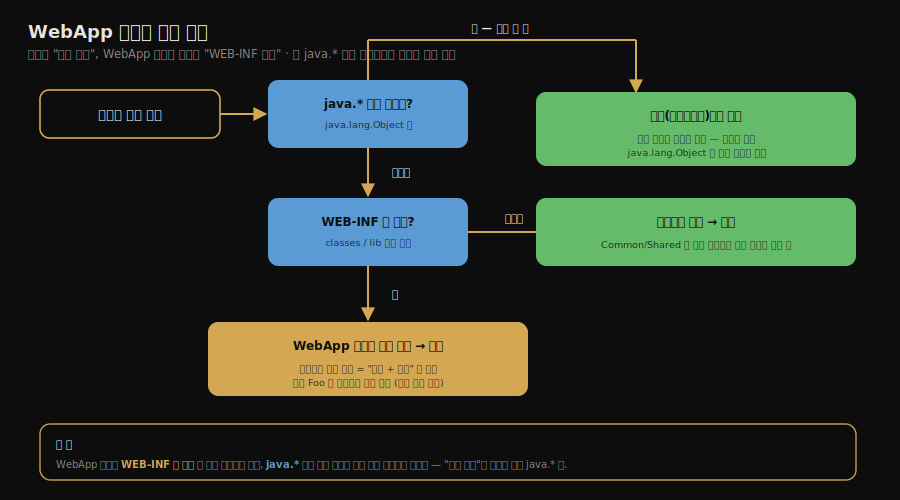

# 톰캣의 클래스 로더 아키텍처
---
> §9.1~§9.2.1을 한 줄로 압축하면 — **톰캣은 한 JVM에서 여러 웹 애플리케이션을 돌리므로, 공통 라이브러리는 위 계층에서 공유하고 웹앱끼리는 WebApp 로더로 격리하는 다계층 클래스 로더 구조를 씁니다.**
>
> 핵심은 "공유할 것은 위에, 격리할 것은 아래에"라는 설계 원리와, "같은 클래스도 웹앱마다 다른 로더가 로딩해 서로 다른 타입이 된다"는 격리 메커니즘입니다. 다만 Tomcat 10.1 기준 기본 구조는 `Bootstrap -> System -> Common -> WebApp`입니다. Server(Catalina)·Shared 로더는 설정으로 추가하는 고급 구조입니다.

이 글을 읽고 나면 톰캣이 왜 단일 부모 위임만으로 부족했는지 설명합니다. Common·Server(Catalina)·Shared·WebApp 로더의 역할을 구분합니다. 웹앱 격리가 "클래스 동일성 = 이름 + 로더" 성질을 어떻게 활용하는지도 그림 없이 짚을 수 있습니다.


## 1. 진입 — 왜 사례 연구인가

> 7·8장이 *클래스 로딩과 실행의 원리*였다면, 9장은 그 원리가 *실제 제품에서 어떻게 응용되는가*입니다. 톰캣은 부모 위임 모델을 격리 도구로 쓴 대표 사례입니다.

[7장의 부모 위임 모델](./02-04.클래스%20로더와%20부모%20위임%20모델.md)은 핵심 클래스의 유일성을 지키는 장치였습니다. 그런데 웹 컨테이너는 그 기본 모델만으로는 부족합니다. 한 톰캣 위에 여러 웹앱이 도는데, 각 웹앱이 같은 라이브러리의 *다른 버전*을 쓰거나 같은 이름의 클래스를 가질 수 있기 때문입니다. 톰캣은 이 요구를 다계층 클래스 로더로 풉니다. 이 글은 그 구조가 *왜 그렇게 생겼는가*를 봅니다.


## 2. 웹 컨테이너가 풀어야 할 네 가지 요구

> 한 JVM에서 여러 웹앱을 돌리려면 격리·공유·안정·핫 디플로이라는 상충하는 요구를 동시에 만족해야 합니다. 단일 부모 위임으로는 풀리지 않습니다.

톰캣 같은 웹 컨테이너는 한 JVM 위에서 여러 웹앱을 동시에 돌립니다. 그래서 단일 애플리케이션을 가정한 표준 클래스 로딩만으로는 풀리지 않는 네 가지 요구가 생깁니다. 각각이 *왜* 생기고 안 지키면 무슨 일이 나는지 봅니다.

**① 웹앱 간 격리.** 

- 한 톰캣에 쇼핑몰 웹앱과 결제 웹앱이 함께 떠 있다고 합시다. 쇼핑몰은 `gson 2.8`, 결제는 `gson 2.10`을 쓸 수 있습니다. 표준 로딩처럼 `com.google.gson.Gson`을 *한 번만* 로딩하면, 두 웹앱이 같은 버전을 강제로 공유하게 되어 한쪽이 깨집니다. 
- 그래서 같은 이름의 클래스라도 *웹앱마다 따로* 로딩해, 서로의 버전이 간섭하지 않게 해야 합니다.

**② 웹앱 간 공유.** 

- 반대 방향의 요구입니다. 모든 웹앱이 쓰는 `servlet-api` 같은 공통 클래스까지 웹앱마다 따로 로딩하면, 같은 클래스가 메모리에 수십 벌 올라가 낭비됩니다. 게다가 톰캣이 웹앱에 넘겨주는 `HttpServletRequest` 같은 타입은 *톰캣과 웹앱이 같은 클래스*여야 주고받을 수 있습니다
- 웹앱마다 다른 `HttpServletRequest`를 로딩하면 톰캣이 만든 객체를 웹앱이 받지 못합니다. 그래서 공통 API는 *한 번만 로딩해 공유*해야 합니다.

**③ 안정성(톰캣 자신의 보호).** 

- 웹앱은 신뢰할 수 없는 코드일 수 있습니다. 웹앱이 톰캣 내부 클래스(Catalina 구현)를 보거나 덮어쓸 수 있으면, 한 웹앱의 버그나 악성 코드가 톰캣 전체를 흔듭니다. 그래서 톰캣 자신만 쓰는 클래스는 웹앱에 *아예 보이지 않는* 계층에 둬, 웹앱이 건드리지 못하게 막아야 합니다.

**④ 핫 디플로이.** 

- 운영 중 웹앱이나 JSP를 고칠 때마다 톰캣 전체를 재시작하면 그 위의 다른 웹앱까지 함께 멈춥니다. 그래서 *해당 웹앱(또는 JSP)만* 재시작 없이 교체할 수 있어야 합니다. 클래스는 한 번 로딩되면 개별 교체가 어렵습니다. *로더를 통째로 버리고 새로 만들면* 그 로더가 들고 있던 클래스가 한꺼번에 갈립니다.
- 톰캣은 이 "로더 단위 교체"로 핫 디플로이를 구현합니다(§2의 JasperLoader).

이 네 요구 중 **격리(①)와 공유(②)가 정면으로 상충**합니다. 격리하려면 웹앱마다 로더를 따로 둬 분리해야 합니다. 공유하려면 한 로더가 다 같이 써야 합니다.

- 한 클래스를 동시에 분리하고 통합할 수는 없습니다. "모두 격리"는 공유를 깨고(공통 클래스 중복·타입 불일치) "모두 공유"는 격리를 깹니다(버전 충돌). 단일 부모 위임 하나로는 이 균형점을 잡을 수 없습니다. 톰캣은 *여러 층의 로더*로 "공유할 것은 위, 격리할 것은 아래"를 나눕니다.


## 3. 톰캣의 다계층 로더 구조

> Tomcat 10.1의 기본 구조는 부트스트랩·시스템·Common·WebApp 로더입니다. Server(Catalina)와 Shared 로더는 `catalina.properties`로 켜는 고급 구조이므로, "항상 존재하는 네 로더"로 외우면 실제 운영 설정을 잘못 읽게 됩니다.

톰캣은 JVM 기본 로더(부트스트랩·시스템) 아래에 자체 로더 계층을 둡니다. Tomcat 10.1 공식 문서의 기본 계층은 다음처럼 단순합니다.

```text
Bootstrap
    |
  System
    |
  Common
  /    \
WebApp WebApp ...
```

책에서 설명하는 Server(Catalina)·Shared 로더까지 포함한 구조는 고급 구성입니다. `conf/catalina.properties`의 `server.loader`나 `shared.loader`에 값을 주면 Common 아래에 Server와 Shared가 갈라집니다. WebApp 로더들은 Shared 아래에 놓입니다.


각 로더의 역할은 다음과 같습니다.

| 로더 | 보이는 대상 | 주로 읽는 위치 | 기억할 점 |
|------|-------------|----------------|-----------|
| Common | 톰캣 내부와 모든 웹앱 | `common.loader`가 가리키는 `$CATALINA_BASE/lib`, `$CATALINA_HOME/lib` | 공통 API와 톰캣 구성요소가 놓이는 계층입니다. 애플리케이션 클래스는 보통 여기에 두지 않습니다. |
| Server(Catalina) | 톰캣 내부 | `server.loader` 설정값 | 웹앱에는 보이지 않는 톰캣 전용 계층입니다. Tomcat 10.1에서는 기본 비활성입니다. |
| Shared | 모든 웹앱 | `shared.loader` 설정값 | 웹앱끼리 공유하지만 톰캣 내부는 직접 보지 않는 계층입니다. Tomcat 10.1에서는 기본 비활성입니다. |
| WebApp | 해당 웹앱 하나 | `WEB-INF/classes`, `WEB-INF/lib/*.jar` | 웹앱마다 하나씩 생기고 다른 웹앱에는 보이지 않습니다. |

### WEB-INF

여기서 자주 나오는 `WEB-INF`가 무엇인지 먼저 짚습니다. 

- `WEB-INF`는 자바 웹앱(WAR)의 *표준 디렉터리*로, 한 웹앱을 압축한 `appA.war`를 풀면 그 안에 있습니다. 

두 가지가 핵심입니다. 

1. 첫째, `WEB-INF`는 브라우저가 URL로 *직접 접근할 수 없는* 보호 영역이라(서블릿 스펙이 막습니다), 클래스·설정 같은 내부 자원을 여기 둡니다. 
2. 둘째, 그 안의 `WEB-INF/classes`(이 웹앱의 `.class`)와 `WEB-INF/lib`(이 웹앱의 `*.jar`)가 바로 *그 웹앱의 WebApp 로더가 읽는 곳*입니다. 그래서 "WebApp 로더가 WEB-INF를 먼저 뒤진다"는 말은 *그 웹앱 전용 클래스·라이브러리 폴더를 먼저 본다*는 뜻입니다.

각 로더가 어느 디렉터리를 읽는지 폴더 구조로 보면, "공유는 위 디렉터리·격리는 웹앱별 디렉터리"라는 배치가 한눈에 들어옵니다.

```
$CATALINA_HOME/
├── lib/                         ← Common 로더 (톰캣 + 모든 웹앱 공유)
│   └── (servlet-api.jar, 공통 JAR …)
├── bin/                         ← 부트스트랩용 (bootstrap.jar 등)
└── webapps/
    ├── appA/                    ← WebApp 로더 A (이 웹앱 전용 · 격리)
    │   └── WEB-INF/
    │       ├── classes/         ← appA 의 .class  (먼저 뒤지는 곳)
    │       └── lib/             ← appA 의 *.jar   (먼저 뒤지는 곳)
    └── appB/                    ← WebApp 로더 B (별도 로더 · A 와 격리)
        └── WEB-INF/
            ├── classes/         ← appB 의 .class
            └── lib/             ← appB 의 *.jar   (A 와 다른 버전 가능)

# (선택) Shared 로더 — shared.loader 로 지정한 디렉터리 (모든 웹앱 공유, 톰캣은 안 봄)
# Tomcat 10.1 기본 비활성
```

- `lib/`는 부모(Common) 계층이라 appA·appB가 *함께* 봅니다 — 공유.
- 각 `webapps/<app>/WEB-INF/`는 그 웹앱의 WebApp 로더만 읽습니다 — 격리. 그래서 appA·appB가 `WEB-INF/lib`에 *같은 라이브러리의 다른 버전*을 둬도 충돌하지 않습니다.

- 설계 원리는 한 문장입니다. *공유할 것은 위 계층(Common·Shared)에, 격리할 것은 아래 계층(WebApp)에* 둡니다. 위 계층은 부모라 여러 자식이 같은 클래스를 봅니다. WebApp 로더는 웹앱마다 분리되어 같은 이름의 클래스도 따로 로딩합니다.

JSP는 한 단계 더 나아갑니다. JSP는 Jasper가 서블릿 클래스로 변환해 로딩합니다. JSP 파일이 바뀌면 기존 JSP 로더를 버리고 새 로더로 다시 읽는 방식으로 변경을 반영합니다. 일반 웹앱 클래스 변경은 보통 컨텍스트 reload나 redeploy 문제입니다. JSP 재컴파일은 Jasper가 관리하는 별도 흐름이라는 점을 구분해야 합니다.


## 4. 격리의 핵심 — 로더가 다르면 타입이 다르다

> 웹앱 격리는 새 메커니즘이 아니라 "클래스 동일성 = 이름 + 로더" 성질을 그대로 활용한 것입니다. 웹앱마다 로더가 다르니 같은 클래스도 다른 타입이 됩니다.

웹앱 A와 B가 같은 `Foo.class`를 써도 충돌하지 않는 이유는, [7장에서 본 "클래스 동일성 = 클래스 이름 + 로더"](./02-04.클래스%20로더와%20부모%20위임%20모델.md) 성질 때문입니다. A의 `Foo`는 WebApp 로더 A가, B의 `Foo`는 WebApp 로더 B가 로딩하므로, JVM에게는 *이름은 같지만 서로 다른 클래스*입니다.

이 덕분에 두 웹앱이 같은 라이브러리의 다른 버전을 써도 서로 간섭하지 않습니다. 톰캣은 격리를 위한 새 장치를 만든 게 아니라, *클래스 로더의 기본 성질을 응용*했을 뿐입니다.

한 가지 더 짚을 점은, WebApp 로더가 *부모 위임을 일부 깬다*는 것입니다. 

- 표준 부모 위임은 부모에게 먼저 위임합니다. WebApp 로더는 웹앱의 독립성을 위해 기본적으로 자기 `WEB-INF/classes`와 `WEB-INF/lib/*.jar`를 먼저 뒤집니다. 
- 그래서 웹앱 안의 라이브러리 버전이 Common 계층의 같은 이름 클래스보다 우선될 수 있습니다.

다만 예외가 있습니다. JRE 기본 클래스는 웹앱이 덮어쓸 수 없고 Tomcat이 구현하는 Jakarta EE API(Servlet, JSP, EL, WebSocket 등)는 먼저 부모 쪽으로 위임됩니다.

- `<Loader delegate="true"/>`를 설정하면 WebApp 로더도 부모 우선 위임 순서를 따르므로 "Tomcat WebApp 로더는 항상 자식 우선"이라고 외우면 안 됩니다.



운영에서 이 원리는 `ClassCastException`으로 자주 드러납니다. 예를 들어 같은 `com.example.UserDto`가 Common에도 있고 WebApp에도 있으면, 이름이 같아도 로더가 달라 JVM은 두 타입을 다르게 봅니다. 

- 로그에 `com.example.UserDto cannot be cast to com.example.UserDto`처럼 이상한 메시지가 보인다면, 클래스 이름보다 먼저 "누가 로딩했는가"를 확인해야 합니다.


## 5. 역방향 조회 — TCCL이 필요한 이유

> 부모 위임만 보면 부모는 자식 클래스를 볼 수 없습니다. 그런데 JDBC 드라이버, JNDI, ServiceLoader 같은 SPI는 컨테이너 코드가 웹앱 쪽 구현체를 찾아야 하므로 Thread Context ClassLoader가 보조 통로로 등장합니다.

부모 위임 트리에는 한계가 있습니다. Common 로더에 있는 톰캣 내부 코드는 구조상 자식인 WebApp 로더의 클래스를 직접 볼 수 없습니다. 그런데 현실의 프레임워크는 부모 계층의 코드가 웹앱 안 구현체를 찾아야 하는 일이 많습니다.

이때 쓰는 우회 통로가 스레드 컨텍스트 클래스 로더(Thread Context ClassLoader, TCCL)입니다. 컨테이너는 요청 처리 스레드의 컨텍스트 로더를 해당 웹앱의 WebApp 로더로 맞춰 둡니다. SPI나 리플렉션 기반 라이브러리는 현재 스레드의 TCCL을 통해 구현체를 찾습니다. 부모 위임 모델이 "위로 묻는 규칙"이라면 TCCL은 "지금 이 요청의 애플리케이션 관점에서 찾아라"는 실행 문맥입니다.

면접에서는 TCCL까지 길게 말할 필요는 없습니다. 다만 "웹앱 격리는 WebApp 로더로 만들고 부모가 자식 구현체를 찾아야 하는 예외 상황은 TCCL로 푼다" 정도를 덧붙이면 부모 위임 모델의 한계를 이해하고 있다는 신호가 됩니다.


## 6. 면접 대비 요약

> 핵심은 "공유는 위 계층·격리는 아래 계층", "WebApp 로더가 웹앱마다 하나", "격리 = 로더가 다르면 타입이 다름"입니다. 여기에 Tomcat 10.1 기본 구조와 고급 구조의 차이를 같이 기억해야 합니다.

### 한 줄 정의

톰캣의 클래스 로더 아키텍처란, 공통 라이브러리를 상위 공유 로더(Common, 필요하면 Shared)에 두고 웹앱별 클래스를 하위 WebApp 로더에 두어, 한 JVM에서 여러 웹앱을 격리와 공유를 동시에 만족시키며 돌리는 다계층 구조를 말합니다.

### 핵심 포인트 4가지

1. 격리와 공유라는 상충 요구를 풀기 위해, 공유할 것은 상위 계층(Common·Shared)에, 격리할 것은 하위 WebApp 로더에 둡니다.
2. WebApp 로더는 웹앱마다 하나씩 생깁니다. 격리를 위해 기본적으로 자기 `WEB-INF`를 먼저 뒤집니다. 단, JRE 기본 클래스와 Tomcat이 구현하는 Jakarta EE API는 부모 쪽으로 먼저 위임됩니다.
3. 같은 클래스도 웹앱마다 다른 WebApp 로더가 로딩해 서로 다른 타입이 되므로, "클래스 동일성 = 이름 + 로더" 성질이 격리의 토대입니다.
4. Tomcat 10.1의 기본 구조는 `Bootstrap -> System -> Common -> WebApp`입니다. Server(Catalina)·Shared 로더는 설정으로 추가하는 고급 구조입니다.

### 면접에서 받을 만한 질문

1. 톰캣이 단일 부모 위임만으로는 부족한 이유는 무엇입니까?
2. WebApp 로더가 부모 위임을 일부 깨는 이유는 무엇입니까?
3. 두 웹앱이 같은 클래스를 써도 충돌하지 않는 원리는 무엇입니까?
4. Common 로더와 Shared 로더의 차이는 무엇입니까?
5. `com.example.User cannot be cast to com.example.User` 같은 오류가 날 수 있는 이유는 무엇입니까?

> 다섯 질문에 *먼저 자답한 뒤* 아래 §정답으로 내려갑니다.


## 7. 정답 (자답 후 펼치기)

> 위 §면접에서 받을 만한 질문의 5개에 *먼저 자답한 뒤* 아래를 읽으세요.

### 정답 1 — 단일 부모 위임의 한계

단일 부모 위임은 핵심 클래스의 유일성을 지킵니다. 하지만 한 JVM에서 *여러 웹앱을 격리*하지는 못합니다. 웹앱끼리 같은 라이브러리의 다른 버전이나 같은 이름의 클래스를 쓸 수 있는데, 단일 위임 트리로는 이들을 분리할 수 없습니다. 그래서 톰캣은 다계층 로더로 공유와 격리를 동시에 잡습니다.

### 정답 2 — WebApp 로더가 위임을 깨는 이유

웹앱의 독립성을 위해서입니다. 표준 위임대로 부모를 먼저 뒤지면, 상위 계층에 같은 이름의 클래스가 있을 때 웹앱 자신의 버전을 못 쓰게 됩니다. 그래서 WebApp 로더는 기본적으로 자기 `WEB-INF/classes`와 `WEB-INF/lib`를 먼저 뒤지고 없을 때만 부모에게 위임합니다. 다만 JRE 기본 클래스와 Tomcat이 구현하는 Jakarta EE API는 여전히 부모에게 먼저 위임해 안전과 명세 호환성을 지킵니다.

### 정답 3 — 웹앱 격리의 원리

"클래스 동일성 = 클래스 이름 + 로더" 성질 때문입니다. 웹앱 A의 클래스는 WebApp 로더 A가, B의 클래스는 WebApp 로더 B가 로딩하므로, 같은 이름이라도 JVM에게는 서로 다른 클래스입니다. 그래서 두 웹앱이 같은 라이브러리의 다른 버전을 써도 간섭하지 않습니다.


### 정답 4 — Common과 Shared의 차이

Common 로더의 클래스는 톰캣 내부와 모든 웹앱에 보입니다. Tomcat 10.1 기본 설정에서는 `$CATALINA_BASE/lib`와 `$CATALINA_HOME/lib`의 톰캣 구성요소와 공통 API가 여기에 놓입니다.

Shared 로더는 모든 웹앱에는 보이지만 톰캣 내부 전용 코드에는 직접 보이지 않는 공유 계층입니다. 다만 Tomcat 10.1에서는 기본으로 켜져 있지 않으므로, `shared.loader`를 설정한 운영 환경에서만 실제 계층으로 등장합니다.

### 정답 5 — 같은 이름인데 캐스팅이 실패하는 이유

JVM은 클래스 이름만으로 타입을 판단하지 않습니다. 그 클래스를 정의한 로더까지 함께 봅니다. `com.example.User`를 Common 로더가 한 번, WebApp 로더가 한 번 로딩하면 이름은 같아도 서로 다른 타입입니다. 그래서 오류 메시지는 같은 클래스에서 같은 클래스로 캐스팅하는 것처럼 보여도 실제 원인은 로더가 다르다는 데 있습니다.


## 8. 핵심 개념 체크리스트

- [ ] 웹 컨테이너의 네 가지 요구(격리·공유·안정·핫디플로이)를 말할 수 있는가?
- [ ] Tomcat 10.1 기본 구조와 Server(Catalina)·Shared가 추가된 고급 구조를 구분할 수 있는가?
- [ ] Common·Server(Catalina)·Shared·WebApp 로더의 역할을 구분할 수 있는가?
- [ ] "공유는 위 계층·격리는 아래 계층" 원리를 설명할 수 있는가?
- [ ] WebApp 로더가 부모 위임을 일부 깨는 방식과 그 예외(JRE 기본 클래스, Jakarta EE API, `delegate=true`)를 아는가?
- [ ] 같은 이름의 클래스도 로더가 다르면 서로 다른 타입이 된다는 점을 `ClassCastException` 예시로 설명할 수 있는가?
- [ ] JSP 변경 반영이 일반 웹앱 클래스 reload와 다른 흐름이라는 점을 구분할 수 있는가?
- [ ] TCCL이 부모 계층 코드에서 웹앱 구현체를 찾는 보조 통로라는 점을 말할 수 있는가?


## 9. 관련 문서

> 이 글은 부모 위임을 *응용*한 톰캣을 봤습니다. 다음 글은 부모 위임을 *뒤집은* OSGi와 바이트코드 생성 기술로 넘어갑니다.

- [04-02. OSGi의 유연한 클래스 로더와 바이트코드 생성](./04-02.OSGi의%20유연한%20클래스%20로더와%20바이트코드%20생성.md) — 위임을 망(網)으로 바꾼 더 극단적 사례
- [02-04. 클래스 로더와 부모 위임 모델](./02-04.클래스%20로더와%20부모%20위임%20모델.md) § "클래스의 동일성" — 격리의 토대가 되는 성질
- [02-05. 자바 모듈 시스템과 클래스 로더 변화](./02-05.자바%20모듈%20시스템과%20클래스%20로더%20변화.md) — 모듈 시스템이 제공하는 또 다른 격리 방식
