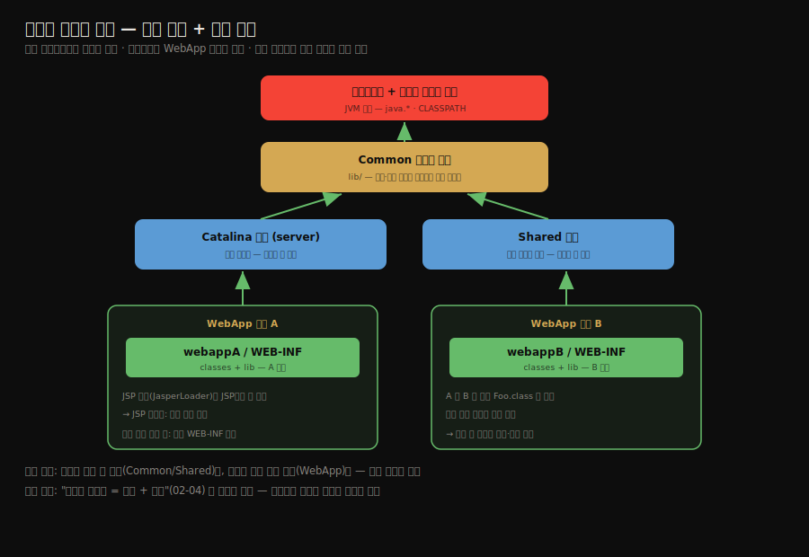

# 톰캣의 클래스 로더 아키텍처
---
> §9.1~§9.2.1을 한 줄로 압축하면 — **톰캣은 한 JVM에서 여러 웹 애플리케이션을 돌리므로, 공통 라이브러리는 위 계층에서 공유하고 웹앱끼리는 WebApp 로더로 격리하는 다계층 클래스 로더 구조를 씁니다.** 핵심은 "공유할 것은 위에, 격리할 것은 아래에"라는 설계 원리와, "같은 클래스도 웹앱마다 다른 로더가 로딩해 서로 다른 타입이 된다"는 격리 메커니즘입니다.

이 글을 읽고 나면 톰캣이 왜 단일 부모 위임만으로 부족했는지 설명하고, Common·Catalina·Shared·WebApp 네 로더의 역할을 말하며, 웹앱 격리가 "클래스 동일성 = 이름 + 로더" 성질을 어떻게 활용하는지 그림 없이 짚을 수 있습니다.

## 진입 — 왜 사례 연구인가

> 7·8장이 *클래스 로딩과 실행의 원리*였다면, 9장은 그 원리가 *실제 제품에서 어떻게 응용되는가*입니다. 톰캣은 부모 위임 모델을 격리 도구로 쓴 대표 사례입니다.

[7장의 부모 위임 모델](./02-04.클래스%20로더와%20부모%20위임%20모델.md)은 핵심 클래스의 유일성을 지키는 장치였습니다. 그런데 웹 컨테이너는 그 기본 모델만으로는 부족합니다. 한 톰캣 위에 여러 웹앱이 도는데, 각 웹앱이 같은 라이브러리의 *다른 버전*을 쓰거나 같은 이름의 클래스를 가질 수 있기 때문입니다. 톰캣은 이 요구를 다계층 클래스 로더로 풉니다. 이 글은 그 구조가 *왜 그렇게 생겼는가*를 봅니다.

## 1. 웹 컨테이너가 풀어야 할 네 가지 요구

> 한 JVM에서 여러 웹앱을 돌리려면 격리·공유·안정·핫 디플로이라는 상충하는 요구를 동시에 만족해야 합니다. 단일 부모 위임으로는 풀리지 않습니다.

톰캣 같은 웹 컨테이너는 다음 네 가지를 동시에 만족해야 합니다.

1. 웹앱 간 격리입니다. 같은 라이브러리의 다른 버전을 쓰는 두 웹앱이 서로 간섭하면 안 됩니다.
2. 웹앱 간 공유입니다. 모든 웹앱이 쓰는 공통 라이브러리를 중복 로딩하면 메모리가 낭비됩니다.
3. 안정성입니다. 톰캣 자신의 클래스를 웹앱이 건드리지 못하게 막아야 합니다.
4. 핫 디플로이입니다. 웹앱이나 JSP를 재시작 없이 교체할 수 있어야 합니다.

격리(1)와 공유(2)는 서로 상충합니다. 모두 격리하면 공유가 안 되고, 모두 공유하면 격리가 안 됩니다. 단일 부모 위임으로는 이 균형을 잡을 수 없어, 톰캣은 *여러 층의 로더*를 둡니다.

## 2. 톰캣의 다계층 로더 구조

> 부트스트랩·시스템·Common 로더 아래에 Catalina와 Shared 로더를 두고, 각 웹앱마다 WebApp 로더를 둡니다. 공유할 것은 위 계층에, 격리할 것은 아래 계층에 배치합니다.

톰캣은 JVM 기본 로더(부트스트랩·시스템) 아래에 자체 로더 계층을 둡니다.

각 로더의 역할은 다음과 같습니다.

1. Common 로더는 `lib/` 디렉터리를 로딩하며, *톰캣과 모든 웹앱이 함께 쓰는* 공통 클래스를 담습니다. 가장 위의 공유 계층입니다.
2. Catalina 로더(server 로더)는 *톰캣 자신만* 쓰는 클래스를 로딩합니다. 웹앱에는 보이지 않아, 웹앱이 톰캣 내부를 건드리지 못합니다(안정성).
3. Shared 로더는 *모든 웹앱이 공유하지만 톰캣은 안 보는* 클래스를 로딩합니다. 웹앱 공통 라이브러리 자리입니다.
4. WebApp 로더는 *각 웹앱마다 하나씩* 생기며, 그 웹앱의 `WEB-INF/classes`와 `WEB-INF/lib`를 로딩합니다. 웹앱 전용이라 다른 웹앱과 격리됩니다.

설계 원리는 한 문장입니다. *공유할 것은 위 계층(Common·Shared)에, 격리할 것은 아래 계층(WebApp)에* 둡니다. 위 계층은 부모라 모든 자식이 그 클래스를 공유하고, 아래 계층은 웹앱마다 분리되어 격리됩니다.

JSP는 한 단계 더 나아갑니다. JSP마다 별도의 JSP 로더(JasperLoader)가 생겨, JSP 파일이 바뀌면 그 로더를 *통째로 버리고 새로 만듭니다*. 클래스를 개별 교체할 수는 없지만, 로더 단위로 교체하면 핫스왑이 됩니다. 이것이 JSP를 수정하면 재시작 없이 반영되는 원리입니다.

## 3. 격리의 핵심 — 로더가 다르면 타입이 다르다

> 웹앱 격리는 새 메커니즘이 아니라 "클래스 동일성 = 이름 + 로더" 성질을 그대로 활용한 것입니다. 웹앱마다 로더가 다르니 같은 클래스도 다른 타입이 됩니다.

웹앱 A와 B가 같은 `Foo.class`를 써도 충돌하지 않는 이유는, [7장에서 본 "클래스 동일성 = 클래스 이름 + 로더"](./02-04.클래스%20로더와%20부모%20위임%20모델.md) 성질 때문입니다. A의 `Foo`는 WebApp 로더 A가, B의 `Foo`는 WebApp 로더 B가 로딩하므로, JVM에게는 *이름은 같지만 서로 다른 클래스*입니다.

이 덕분에 두 웹앱이 같은 라이브러리의 다른 버전을 써도 서로 간섭하지 않습니다. 톰캣은 격리를 위한 새 장치를 만든 게 아니라, *클래스 로더의 기본 성질을 응용*했을 뿐입니다.

한 가지 더 짚을 점은, WebApp 로더가 *부모 위임을 일부 깬다*는 것입니다. 표준 부모 위임은 부모에게 먼저 위임하지만, WebApp 로더는 웹앱의 독립성을 위해 *자기 `WEB-INF`를 먼저 뒤지고* 없을 때만 부모에게 위임합니다. 다만 `java.*` 같은 핵심 클래스는 여전히 부모(부트스트랩)에게 위임해 안전을 지킵니다. [OSGi](./04-02.OSGi의%20유연한%20클래스%20로더와%20바이트코드%20생성.md)는 이 "위임 깨기"를 훨씬 더 멀리 밀고 갑니다.

## 4. 면접 대비 요약

> 핵심은 "공유는 위 계층·격리는 아래 계층", "WebApp 로더가 웹앱마다 하나", "격리 = 로더가 다르면 타입이 다름"입니다.

### 한 줄 정의

톰캣의 클래스 로더 아키텍처란, 공통 라이브러리를 상위 공유 로더(Common·Shared)에 두고 웹앱별 클래스를 하위 WebApp 로더에 두어, 한 JVM에서 여러 웹앱을 격리와 공유를 동시에 만족시키며 돌리는 다계층 구조를 말합니다.

### 핵심 포인트 3가지

1. 격리와 공유라는 상충 요구를 풀기 위해, 공유할 것은 상위 계층(Common·Shared)에, 격리할 것은 하위 WebApp 로더에 둡니다.
2. WebApp 로더는 웹앱마다 하나씩 생기며, 격리를 위해 부모 위임을 일부 깨고 자기 `WEB-INF`를 먼저 뒤집니다.
3. 같은 클래스도 웹앱마다 다른 WebApp 로더가 로딩해 서로 다른 타입이 되므로, "클래스 동일성 = 이름 + 로더" 성질이 격리의 토대입니다.

### 면접에서 받을 만한 질문

1. 톰캣이 단일 부모 위임만으로는 부족한 이유는 무엇입니까?
2. WebApp 로더가 부모 위임을 일부 깨는 이유는 무엇입니까?
3. 두 웹앱이 같은 클래스를 써도 충돌하지 않는 원리는 무엇입니까?

> 세 질문에 *먼저 자답한 뒤* 아래 §정답으로 내려갑니다.

## 정답 (자답 후 펼치기)

> 위 §면접에서 받을 만한 질문의 3개에 *먼저 자답한 뒤* 아래를 읽으세요.

### 정답 1 — 단일 부모 위임의 한계

단일 부모 위임은 핵심 클래스의 유일성을 지키지만, 한 JVM에서 *여러 웹앱을 격리*하지는 못합니다. 웹앱끼리 같은 라이브러리의 다른 버전이나 같은 이름의 클래스를 쓸 수 있는데, 단일 위임 트리로는 이들을 분리할 수 없습니다. 그래서 톰캣은 다계층 로더로 공유와 격리를 동시에 잡습니다.

### 정답 2 — WebApp 로더가 위임을 깨는 이유

웹앱의 독립성을 위해서입니다. 표준 위임대로 부모를 먼저 뒤지면, 상위 계층에 같은 이름의 클래스가 있을 때 웹앱 자신의 버전을 못 쓰게 됩니다. 그래서 WebApp 로더는 자기 `WEB-INF`를 먼저 뒤지고 없을 때만 부모에게 위임합니다. 다만 `java.*` 같은 핵심 클래스는 여전히 부모에게 위임해 안전을 지킵니다.

### 정답 3 — 웹앱 격리의 원리

"클래스 동일성 = 클래스 이름 + 로더" 성질 때문입니다. 웹앱 A의 클래스는 WebApp 로더 A가, B의 클래스는 WebApp 로더 B가 로딩하므로, 같은 이름이라도 JVM에게는 서로 다른 클래스입니다. 그래서 두 웹앱이 같은 라이브러리의 다른 버전을 써도 간섭하지 않습니다.

## 핵심 개념 체크리스트

- [ ] 웹 컨테이너의 네 가지 요구(격리·공유·안정·핫디플로이)를 말할 수 있는가?
- [ ] Common·Catalina·Shared·WebApp 로더의 역할을 구분할 수 있는가?
- [ ] "공유는 위 계층·격리는 아래 계층" 원리를 설명할 수 있는가?
- [ ] WebApp 로더가 부모 위임을 일부 깨는 방식과 그 한계(java.* 제외)를 아는가?
- [ ] JSP 핫스왑이 로더 단위 교체로 이루어지는 것을 아는가?

## 관련 문서

> 이 글은 부모 위임을 *응용*한 톰캣을 봤고, 다음 글은 부모 위임을 *뒤집은* OSGi와 바이트코드 생성 기술로 넘어갑니다.

- [04-02. OSGi의 유연한 클래스 로더와 바이트코드 생성](./04-02.OSGi의%20유연한%20클래스%20로더와%20바이트코드%20생성.md) — 위임을 망(網)으로 바꾼 더 극단적 사례
- [02-04. 클래스 로더와 부모 위임 모델](./02-04.클래스%20로더와%20부모%20위임%20모델.md) § "클래스의 동일성" — 격리의 토대가 되는 성질
- [02-05. 자바 모듈 시스템과 클래스 로더 변화](./02-05.자바%20모듈%20시스템과%20클래스%20로더%20변화.md) — 모듈 시스템이 제공하는 또 다른 격리 방식
