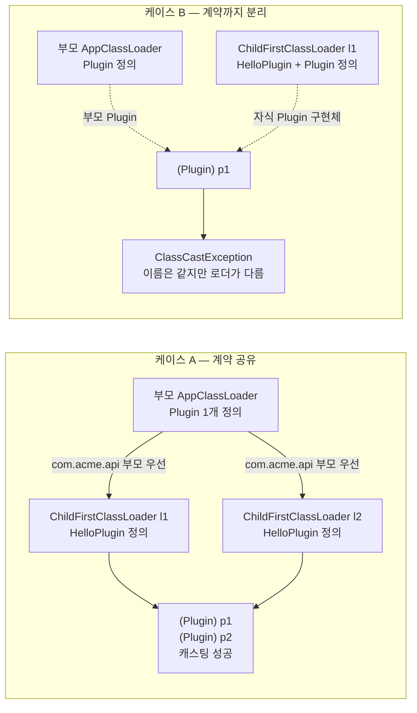

# 톰캣 클래스 로더 실습 — 로더가 다르면 타입이 다르다
---
> [04-01](./04-01.톰캣의%20클래스%20로더%20아키텍처.md) §4의 한 문장 **"클래스 동일성 = 이름 + 로더"** 를, 톰캣 없이 순수 Java `URLClassLoader` 로 직접 터뜨려 확인하는 실습입니다.
>
> 같은 `HelloPlugin` 을 두 로더로 로딩해, 계약(`Plugin`)을 *공유하면 캐스팅 성공*, *따로 로딩하면 `ClassCastException`* 임을 눈으로 봅니다.

읽고 나면 "로더가 다르면 같은 이름도 다른 타입"이 추상론이 아니라 코드로 만질 수 있는 사실임을 설명합니다. 그리고 그 사실이 톰캣이 servlet-api 를 공유 계층에 두는 이유와 어떻게 이어지는지 말합니다.


## 1. 먼저, 처음 보는 분을 위한 세 가지 단어

>  실습 코드를 읽기 전에 세 단어만 잡고 갑니다. 이 셋만 알면 나머지는 따라옵니다.

**클래스 로더(ClassLoader)**. 자바에서 `.class` 파일을 읽어 JVM 안의 "살아있는 클래스"로 만들어 주는 일꾼입니다. 

- 우리가 `new Foo()` 를 쓰기 전에, 누군가 `Foo.class` 바이트를 어디선가 찾아 메모리에 올려야 합니다. 그 "찾아서 올리는" 일을 하는 게 클래스 로더입니다. 
- 보통은 한 종류(앱 로더)가 다 처리합니다. 톰캣처럼 여러 앱을 한 JVM 에 올리는 경우엔 앱마다 로더를 따로 둡니다.

**클래스패스(classpath)**. 한 로더가 클래스를 찾을 때 *뒤지는 위치 목록* 입니다. "이 폴더와 저 JAR 안을 찾아봐"라는 주소록이라고 보면 됩니다. 로더마다 자기 클래스패스가 다를 수 있습니다.

**타입 동일성**. 여기가 이 글의 전부입니다. 우리는 보통 "이름이 같으면 같은 클래스"라고 생각합니다. JVM 은 다릅니다. 

- JVM 은 **이름이 같고 + 그 클래스를 정의한 로더까지 같아야** 같은 타입으로 봅니다. 이름이 똑같은 `com.acme.Foo` 라도 로더 A 가 정의한 것과 로더 B 가 정의한 것은 *서로 다른 타입* 입니다. 처음엔 낯설어도, 이 한 줄이 톰캣 웹앱 격리의 비밀입니다.

> 헷갈리기 쉬운 함정 하나를 미리 깔아 둡니다. **"타입을 가르는 건 클래스패스가 아니라 로더다."** 클래스패스가 달라서 타입이 갈리는 게 아니라, *어느 로더가 그 클래스를 정의했는지* 가 타입을 가릅니다. 이 차이는 §6 에서 코드로 다시 확인합니다.


## 2. 무엇을 증명하는가

04-01 §4 는 웹앱 격리의 토대를 한 문장으로 요약합니다 — JVM 은 클래스를 *이름만으로* 구분하지 않고 *그 클래스를 정의한 로더까지* 함께 봅니다. 이름이 같아도 정의한 로더가 다르면 다른 타입입니다.

이 실습은 그 문장을 두 케이스의 대조로 증명합니다.

| 케이스 | 계약(`Plugin` 인터페이스)을 누가 로딩 | 결과 |
|--------|--------------------------------------|------|
| A | 부모(앱 로더)가 한 벌만 — 공유 | 캐스팅 성공 |
| B | 자식 로더가 각자 따로 | `ClassCastException` |

같은 부품으로 *한 가지만* 바꿔 결과가 뒤집히는 것을 보는 게 핵심입니다. 무엇이 타입을 가르는지 분명해집니다.


## 3. 먼저 실행해 보기

> 실습은 설명을 다 읽은 뒤보다, 한 번 실패 로그를 먼저 보고 읽는 편이 잘 잡힙니다. Gradle 태스크가 별도 산출물 컴파일과 실행 옵션을 함께 처리합니다.

이 모듈은 `jvm-practice`(jvm-deep-dive) Gradle 프로젝트의 `:ch03-classloader` 모듈입니다. 실험마다 별도 산출물(같은 FQCN 두 버전, 앱 클래스패스 밖 구현체)을 분리 컴파일해야 해서, 클래스를 직접 Run 하지 않고 Gradle 태스크로 실행합니다.

```bash
cd ~/jvm-practice
./gradlew :ch03-classloader:exp1
```

성공하면 핵심 출력은 다음 흐름으로 나옵니다. 로더 식별자는 실행마다 달라질 수 있으므로 `@...` 값이 다르다고 틀린 것은 아닙니다.

```bash
# == 케이스 A: 공용 계약(Plugin)을 부모가 공유 ==
p1.getClass() == p2.getClass() ? false
Plugin 인터페이스 로더 = ...AppClassLoader
캐스팅 성공 → HelloPlugin.run()

# == 케이스 B: Plugin까지 자식이 따로 로딩 ==
부모 Plugin == 자식 Plugin ? false
예상된 ClassCastException
→ 이름은 com.acme.api.Plugin 으로 같지만 로더가 달라 다른 타입이다.
```

- IntelliJ 라면 Gradle 패널의 `ch03-classloader > Tasks > lab > exp1` 을 더블클릭합니다. 클래스의 `main` 을 직접 Run 하면 분리 컴파일 단계와 경로 주입(`-Dlab.out`)이 빠져 `ClassNotFoundException` 이 납니다.


## 4. 준비물 — 세 클래스와 한 로더

실습에 등장하는 것은 셋입니다. 핵심 배치는 **`Plugin` 과 `HelloPlugin` 을 서로 다른 디렉터리에 둔다**는 점입니다. 그래야 "계약은 공유하고 구현만 따로" 같은 조합을 만들 수 있습니다.

| 이름 | 위치(빌드 산출물) | 역할 |
|------|-------------------|------|
| `Plugin` (인터페이스) | `build/labout/app/` | 공유돼야 할 계약 — 톰캣의 servlet-api 자리 |
| `HelloPlugin` (구현) | `build/labout/plugin/` | 자식 로더가 로딩할 웹앱 코드 |
| `ChildFirstClassLoader` | 앱 클래스패스 | 톰캣 WebApp 로더 흉내(자식 우선) |

### 폴더 구조로 보기

말로 된 "위치"를 실험 1 에 필요한 최소 구조로 옮기면 이렇습니다. 핵심은 **소스가 두 갈래** 라는 점입니다.

```bash
ch03-classloader/
├── src/main/java/com/acme/          ←   # ① 평범한 소스 (앱 클래스패스에 올라감)
│   ├── api/Plugin.java              ·   공유 계약(인터페이스)
│   ├── lab/
│   │   ├── ChildFirstClassLoader.java  · 톰캣 WebApp 로더 흉내
│   │   ├── Exp1_TypeIdentity.java      · 실험 1 드라이버(main)
│   │   └── LabPaths.java               · 산출물 경로 해석 도우미
│
├── libsrc/                          ←  # ② 앱 클래스패스에 올리면 안 되는 소스
│   ├── plugin/com/acme/plugin/HelloPlugin.java   · 자식 로더가 따로 로딩할 구현
│
└── build/labout/                    ←  # ③ 빌드가 ②를 컴파일해 만드는 "별도 산출물"
    ├── app/com/acme/api/Plugin.class      · 자식이 직접 로딩할 인터페이스 사본
    └── plugin/com/acme/plugin/HelloPlugin.class · 자식이 로딩할 구현
```

- 왜 소스를 둘로 나눴을까요? 실험 1 은 `HelloPlugin` 을 *내가 만든 로더로 직접* 로딩해야 합니다. 그런데 만약 `HelloPlugin` 이 `src/main/java` 에 있으면, 빌드가 그걸 앱 클래스패스에 올려 버려 *앱 로더가 먼저* 로딩해 버립니다. 
- 그러면 "내 로더가 정의했다"를 보여줄 수 없습니다. 그래서 `HelloPlugin` 을 일부러 `libsrc/` 에 둬 앱 클래스패스 밖으로 뺐습니다. 빌드는 그 소스를 `build/labout/plugin/` 이라는 *별도 폴더* 로만 컴파일합니다. 실험은 그 폴더를 클래스패스로 주는 `URLClassLoader` 로 로딩합니다.

> 실제 모듈에는 `v1`·`v2`·`provider` 같은 다른 실험용 소스도 있습니다. 이 글에서는 `app/`(Plugin)·`plugin/`(HelloPlugin) 둘만 보면 됩니다.

### 토대가 되는 `URLClassLoader` 먼저 알기

`ChildFirstClassLoader` 는 `URLClassLoader` 를 *상속* 해서 만듭니다. 그래서 `URLClassLoader` 가 뭘 해주는지 알아야 우리 로더가 *무엇만* 바꿨는지 보입니다. 상속 계층은 이렇습니다.

```bash
ClassLoader # (추상 — "이름을 클래스로" 의 뼈대)
   ↑
SecureClassLoader
   ↑
URLClassLoader        ← # URL 목록(폴더·JAR)에서 .class 를 찾아 정의하는 능력
   ↑
ChildFirstClassLoader ← # 위임 "순서"만 비튼다 (우리가 만든 것)
```

`URLClassLoader` 는 이름 그대로 **URL 목록을 클래스패스로 받아, 거기서 `.class` 바이트를 찾아 클래스로 정의** 하는 로더입니다. 핵심 메서드 셋만 기억하면 됩니다.

| 메서드 | 제공처 | 하는 일 |
|--------|--------|---------|
| `loadClass(name)` | `ClassLoader` | **진입점.** "이름 주면 클래스 줘". 기본 구현은 부모 위임 |
| `findClass(name)` | `URLClassLoader` | 자기 URL 목록을 뒤져 바이트를 찾고 `defineClass` 호출 |
| `defineClass(...)` | `ClassLoader` | `byte[]` → 진짜 `Class` 로 **정의**(이 로더가 정의자가 됨) |

실습에서 만드는 로더 생성자는 세 값을 받습니다.

```java
new ChildFirstClassLoader(new URL[]{pluginJar}, app, "com.acme.api")
```

각 값은 서로 다른 역할을 합니다.

| 인자 | 실제 의미 | 로딩 때 쓰이는 순간 |
|------|-----------|---------------------|
| `new URL[]{pluginJar}` | 이 로더가 직접 뒤질 클래스패스 | `findClass(name)`가 `build/labout/plugin/` 아래에서 `.class`를 찾을 때 |
| `app` | 부모 로더 | 부모 우선 대상이거나 자기 URL에 없을 때 `super.loadClass(...)`로 위임할 때 |
| `"com.acme.api"` | 부모 우선으로 보낼 패키지 prefix | `isParentFirst(name)`에서 `Plugin`을 부모에게 맡길지 판단할 때 |

- 중요한 구분이 있습니다. 앞의 두 인자(`urls`, `parent`)는 `URLClassLoader` 자체가 원래 아는 값입니다. 
- `super(urls, parent)`를 호출하면 `URLClassLoader`는 "내가 직접 찾을 위치"와 "못 찾거나 위임할 부모"를 기억합니다. 
- 세 번째 인자(`parentFirstPrefixes`)는 표준 `URLClassLoader` 기능이 아니라, 우리가 만든 `ChildFirstClassLoader`가 위임 순서를 조절하려고 따로 저장한 규칙입니다.

여기서 중요한 점은 `URLClassLoader` 의 기본 `loadClass` 가 **부모 위임** 이라는 것입니다. 부모에게 먼저 묻습니다. 부모가 못 찾을 때만 자기 `findClass` 를 씁니다.

```bash
기본 loadClass (부모 우선):
  # ① findLoadedClass  — 이미 로딩했나
  # ② parent.loadClass — 없으면 부모에게 먼저  ← 부모 우선
  # ③ findClass        — 부모도 없으면 그제서야 자기 클래스패스
```

이 부모 우선 규칙이 `java.lang.String` 같은 핵심 클래스의 유일성을 지킵니다. 누가 만든 로더든 `String` 은 결국 부트스트랩 것 하나로 수렴하니까요.

### 우리 `ChildFirstClassLoader` 가 바꾼 것

`ChildFirstClassLoader` 는 04-01 §4 의 "WebApp 로더가 부모 위임을 일부 깬다"를 코드로 옮긴 것입니다. 위 ②와 ③의 **순서를 뒤집습니다**

자기 클래스패스를 먼저 뒤지고(`findClass`), 없을 때만 부모로 갑니다. 단 `java.*` 와 *생성자로 지정한 공유 패키지* 는 예외로 부모에 먼저 위임합니다. "전부 자식 우선"이 아니라 "원칙은 자식 우선, 핵심·공유 계약은 부모 우선"인 셈입니다.

전체 코드입니다. `URLClassLoader` 를 상속하고 `loadClass` 하나만 재정의하는, 짧은 클래스입니다(`import`·`toString` 등 자명한 부분은 생략).

```java
public class ChildFirstClassLoader extends URLClassLoader {

    // "이 패키지는 자식이 직접 로딩하지 말고 부모에 양보하라" 는 목록
    private final String[] parentFirstPrefixes;

    // 이 로더가 직접 볼 URL 목록, 부모 로더, 부모 우선 패키지 prefix
    public ChildFirstClassLoader(URL[] urls, ClassLoader parent, String... parentFirstPrefixes) {
        super(urls, parent);                       // URL 목록 = 이 로더의 클래스패스
        this.parentFirstPrefixes = parentFirstPrefixes;
    }

    @Override
    protected Class<?> loadClass(String name, boolean resolve) throws ClassNotFoundException {
        synchronized (getClassLoadingLock(name)) { // 이름별 락 (동시 로딩 충돌 방지)
            Class<?> c = findLoadedClass(name);            // 1) 이미 로딩했나
            if (c != null) return resolved(c, resolve);

            if (isParentFirst(name)) {                     // 2) java.* + 지정 공유 패키지 → 부모 먼저
                return resolved(super.loadClass(name, resolve), resolve);
            }
            try {
                return resolved(findClass(name), resolve); // 3) 그 외 → 자기 클래스패스 먼저 (child-first)
            } catch (ClassNotFoundException notHere) {
                return resolved(super.loadClass(name, resolve), resolve); // 4) 없으면 그때 부모
            }
        }
    }

    // 부모에 먼저 위임할 이름인가? java.* 계열 + 생성자로 받은 공유 prefix
    private boolean isParentFirst(String name) {
        if (name.startsWith("java.") || name.startsWith("javax.") || name.startsWith("jdk.")) {
            return true;
        }
        for (String prefix : parentFirstPrefixes) {
            if (name.startsWith(prefix)) return true;
        }
        return false;
    }

    // 이미 만들어진 Class 를 받아, resolve 플래그면 링크(resolveClass)까지 하고 반환.
    // 로딩을 하는 게 아니라 "마무리 후 반환" 하는 헬퍼다.
    private Class<?> resolved(Class<?> c, boolean resolve) {
        if (resolve) resolveClass(c);
        return c;
    }
}
```

`loadClass` 의 4단계를 그림으로 보면 "어디서 정의되느냐"가 한눈에 들어옵니다.

```text
loadClass("com.acme.plugin.HelloPlugin")
        │
        ├─ ① 이미 로딩? ──── 예 → 그대로 반환
        │                   아니오 ↓
        ├─ ② java.* 거나 공유 지정 패키지? ── 예 → 부모가 정의 (공유됨)
        │                   아니오 ↓
        └─ ③ 내 클래스패스에서 직접 정의 ←─ 여기! 내 로더가 정의자가 된다
                            없으면 ↓
              ④ 그제서야 부모에게
```

- 세 번째 생성자 인자 `parentFirstPrefixes` 가 **"이 패키지는 부모에 양보(공유)하라"** 는 손잡이입니다. 이 손잡이를 켜고 끄는 것이 케이스 A 와 B 의 유일한 차이입니다. 
- ② 에 걸리면 *부모가 정의* 해서 공유됩니다. ③ 으로 빠지면 *내 로더가 정의* 해서 갈라집니다. 같은 이름이라도 ②냐 ③이냐에 따라 타입이 달라지는 것입니다.


## 5. 케이스 A — 계약을 공유하면 캐스팅 성공

> 여기서는 구현 클래스 `HelloPlugin` 이 로더마다 갈라지는지 봅니다. 계약 타입 `Plugin` 은 부모 로더가 한 번만 정의합니다. 구현이 둘이어도 계약이 하나면 캐스팅은 성공합니다.

```java
ClassLoader app = Exp1_TypeIdentity.class.getClassLoader();   // 부모 = 공유 계층

ChildFirstClassLoader l1 = new ChildFirstClassLoader(new URL[]{pluginJar}, app, "com.acme.api");
ChildFirstClassLoader l2 = new ChildFirstClassLoader(new URL[]{pluginJar}, app, "com.acme.api");

Object p1 = l1.loadClass("com.acme.plugin.HelloPlugin").getDeclaredConstructor().newInstance();
Object p2 = l2.loadClass("com.acme.plugin.HelloPlugin").getDeclaredConstructor().newInstance();
```

- `l1` 과 `l2` 는 설정이 완전히 같습니다 — 클래스패스는 `HelloPlugin` 만 든 `plugin` 디렉터리, 셋째 인자는 `"com.acme.api"`. 일부러 똑같이 둬, *같은 두 로더인데도* 결과가 갈리는 것을 보입니다.

`HelloPlugin` 을 로딩하면 그 안에서 두 클래스가 서로 다른 길을 탑니다.

- `HelloPlugin` 은 `"com.acme.api"` 로 시작하지 않아 child-first 로 빠집니다. `l1`, `l2` 가 *각자* 정의해 둘로 갈라집니다.
- `Plugin`(HelloPlugin 이 구현)은 `"com.acme.api"` 에 걸려 부모에 위임됩니다. 한 개만 존재합니다.

실측 출력:

```text
p1.getClass() == p2.getClass() ? false          ← HelloPlugin 은 둘
Plugin 인터페이스 로더 = ...AppClassLoader (두 자식이 공유)   ← Plugin 은 하나
```

```java
Plugin asPlugin1 = (Plugin) p1;   // 성공
Plugin asPlugin2 = (Plugin) p2;   // 성공
```

- `p1`, `p2` 는 서로 다른 `HelloPlugin` 이지만 둘 다 *같은 한 개의* `Plugin` 을 구현하므로, 그 공통 타입으로는 모두 캐스팅됩니다. 
- 구현이 갈라져도 계약을 공유하면 주고받을 수 있다는 뜻입니다. 톰캣이 servlet-api 를 Common 계층에 두는 이유와 같습니다 — 컨테이너가 만든 `HttpServletRequest` 를 웹앱이 받는 것은 그 타입을 공유하기 때문입니다.


## 6. 케이스 B — 계약까지 따로 로딩하면 캐스팅 실패

> 여기서는 `Plugin` 사본을 자식 로더의 클래스패스에 넣습니다. 부모 우선 공유 규칙도 끕니다. 이름은 같은 `Plugin` 이지만 부모가 정의한 타입과 자식이 정의한 타입이 갈라집니다.

케이스 A 에서 딱 두 가지만 바꿉니다.

```java
ChildFirstClassLoader l1 =
        new ChildFirstClassLoader(new URL[]{pluginJar, apiJar}, app /* 셋째 인자 없음 */);
```

| | 케이스 A | 케이스 B |
|---|---------|---------|
| 클래스패스 | `{pluginJar}` | `{pluginJar, apiJar}` — `Plugin` 위치(`app`) 추가 |
| 셋째 인자 | `"com.acme.api"` | 없음(공유 안 함) |

이 둘이 합쳐지면 `Plugin` 이 child-first 로 빠질 조건이 됩니다. 자식 클래스패스에 `Plugin` 이 *있고*(apiJar), 부모에 양보하지도 *않으니*(공유 지정 없음) 자식이 직접 정의합니다.

```java
Class<?> childPlugin = l1.loadClass("com.acme.api.Plugin");
```

실측 출력:

```text
부모 Plugin == 자식 Plugin ? false      ← Plugin 이 두 개!
```

그 결과 캐스팅이 깨집니다.

```java
Object p1 = l1.loadClass("com.acme.plugin.HelloPlugin").getDeclaredConstructor().newInstance();
Plugin asParentPlugin = (Plugin) p1;   // ClassCastException
```

`p1`(= `l1` 이 만든 `HelloPlugin`)은 *`l1` 이 정의한* `Plugin` 을 구현하는데, `(Plugin)` 캐스팅은 *부모가 정의한* `Plugin` 을 가리킵니다. 이름은 같고 정의한 로더가 달라 실패합니다.

```text
...HelloPlugin cannot be cast to ...Plugin
(...HelloPlugin is in ... loader ChildFirstClassLoader @...;
 ...Plugin is in ... loader 'app')
```

괄호 안의 **"loader @... vs loader 'app'"** 가 결정적입니다. JVM 이 직접 "이름은 같지만 로더가 다르다"고 알려 줍니다. 04-01 §4 의 `cannot be cast` 미스터리가 이 한 줄로 풀립니다.


## 7. 케이스 A와 B의 차이

> 두 케이스의 차이는 `Plugin` 을 부모에 맡기느냐, 자식이 직접 정의하게 하느냐입니다. 이 한 차이가 캐스팅 성공과 실패를 가릅니다.



- 그림에서 봐야 할 지점은 `HelloPlugin` 이 아닙니다. `HelloPlugin` 은 케이스 A 에서도 이미 `l1`, `l2` 가 따로 정의합니다. 
- 진짜 차이는 `Plugin` 입니다. A 는 `Plugin` 을 부모가 한 번 정의하고 두 자식이 공유합니다. B 는 자식 로더가 `Plugin` 까지 직접 정의해 부모의 `Plugin` 과 다른 타입을 만듭니다.


## 8. 정리 — 타입을 가르는 것은 클래스패스가 아니라 로더

이 실습에서 자주 헷갈리는 지점을 짚습니다. 두 `Plugin` 이 갈라진 직접 원인은 *클래스패스가 달라서* 가 아니라 *정의한 로더가 달라서* 입니다. 클래스패스는 "어느 로더가 정의하게 되는가"를 정하는 수단입니다. 타입 동일성의 최종 판정자는 정의한 로더입니다.

근거는 케이스 A 자체입니다. `l1` 과 `l2` 는 클래스패스가 *완전히 같은데도* `HelloPlugin` 이 둘로 갈라졌습니다(`== false`). 클래스패스가 같아도 로더가 다르면 다른 타입이라는 뜻입니다. "클래스패스가 다르면 다른 클래스"가 규칙이라면 이 결과는 설명되지 않습니다.

| 질문 | 답 |
|------|-----|
| 타입을 가르는 판정 기준 | 정의한 로더(+ 이름) |
| 클래스패스의 역할 | 어느 로더가 정의할 수 있는지를 정하는 수단 |
| "클래스패스 다르면 다른 클래스"가 규칙? | 아니다 — 케이스 A 가 반례 |

- 실무로 옮기면 케이스 B는 *부모가 소유한 공유 계약을 자식도 따로 정의했을 때* 생기는 일반적인 타입 분리를 재현합니다. Tomcat의 Servlet·JSP·EL·WebSocket API는 부모 우선 예외라 웹앱 저장소에서 임의로 대체되지 않습니다. 외부 WAR에서 컨테이너 제공 API를 패키징하지 않는 규칙은 [패키지·JAR·클래스패스 §6](../../06_Build/01-01.패키지·JAR·클래스패스.md)에서 배포 형태별로 구분합니다.


## 9. 핵심 개념 체크리스트

- [ ] "클래스 동일성 = 이름 + 정의한 로더"를 케이스 A·B 로 설명할 수 있는가?
- [ ] 케이스 A 에서 `HelloPlugin` 은 둘인데 캐스팅이 성공하는 이유(계약 공유)를 말할 수 있는가?
- [ ] 케이스 B 에서 `Plugin` 이 둘로 갈라지는 조건(자식 클래스패스에 있음 + 공유 미지정)을 아는가?
- [ ] Mermaid 그림에서 A와 B의 차이가 `Plugin` 의 정의 로더라는 점을 짚을 수 있는가?
- [ ] 타입을 가르는 것이 클래스패스가 아니라 로더라는 점을, 같은 클래스패스인 `l1`/`l2` 가 다른 타입이 되는 사실로 설명할 수 있는가?
- [ ] 이 실습의 계약 타입 분리와 Tomcat의 Jakarta EE API 부모 우선 예외가 어떻게 다른지 말할 수 있는가?


## 10. 관련 문서

- [04-01. 톰캣의 클래스 로더 아키텍처](./04-01.톰캣의%20클래스%20로더%20아키텍처.md) § "격리의 핵심 — 로더가 다르면 타입이 다르다" — 이 실습이 증명하는 원문
- [02-04. 클래스 로더와 부모 위임 모델](./02-04.클래스%20로더와%20부모%20위임%20모델.md) § "클래스의 동일성" — 격리의 토대가 되는 성질
