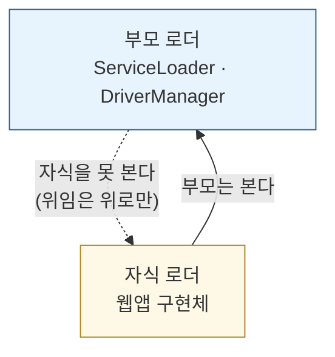
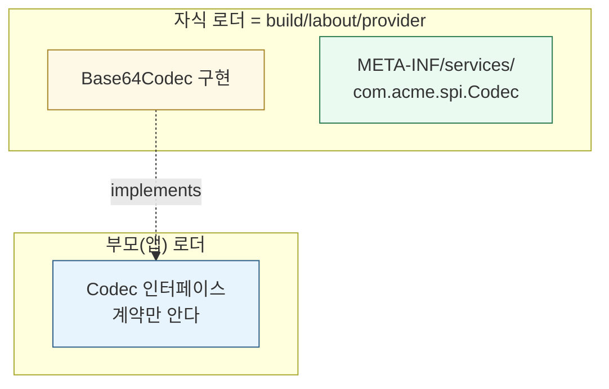
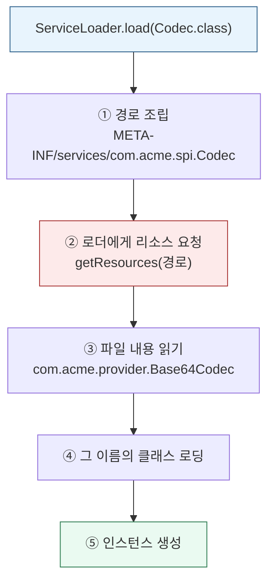
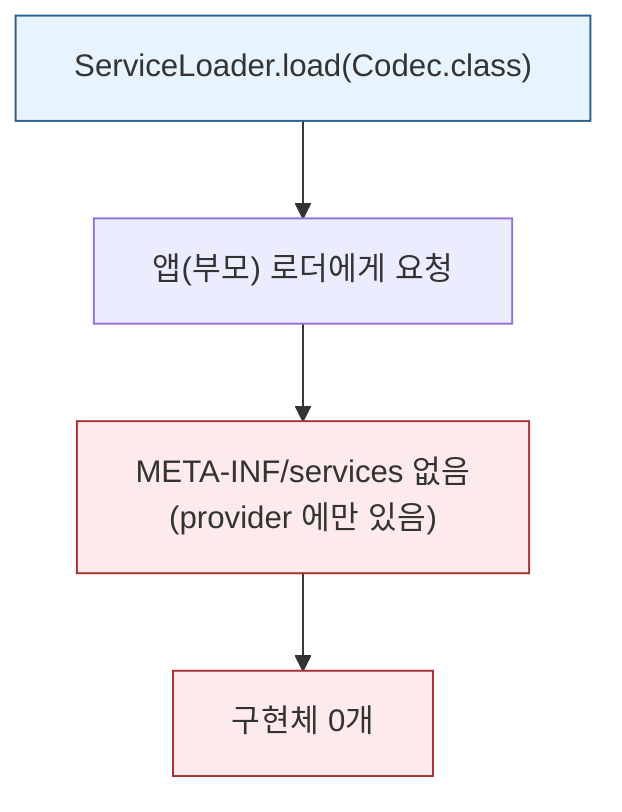
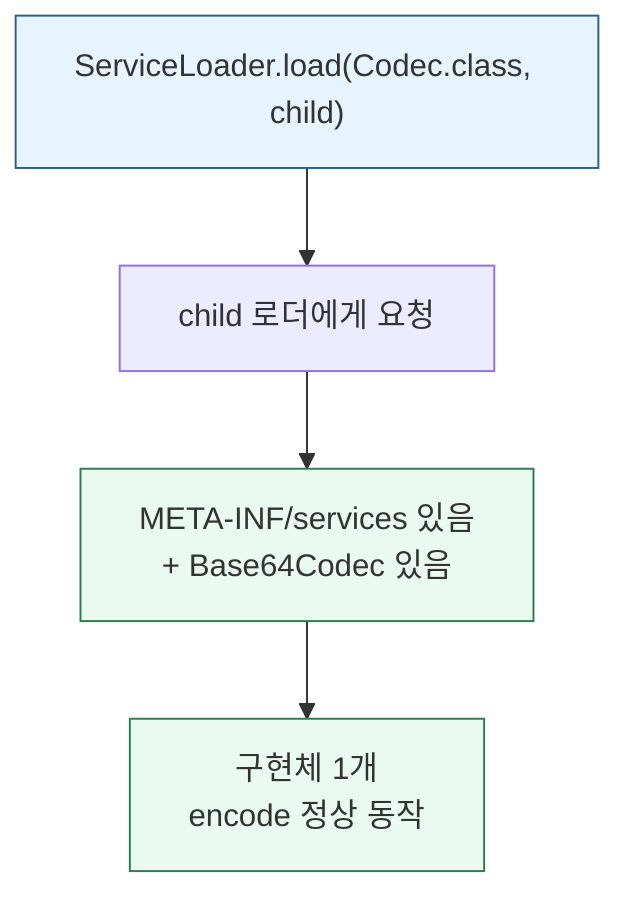
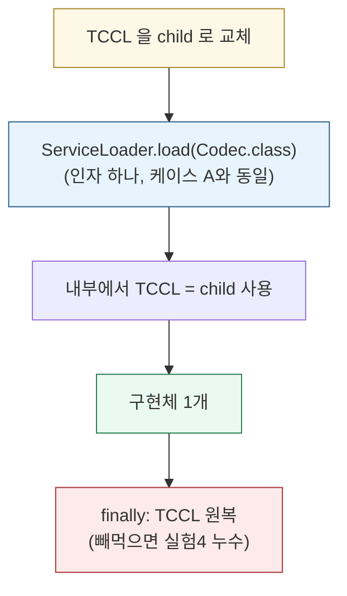
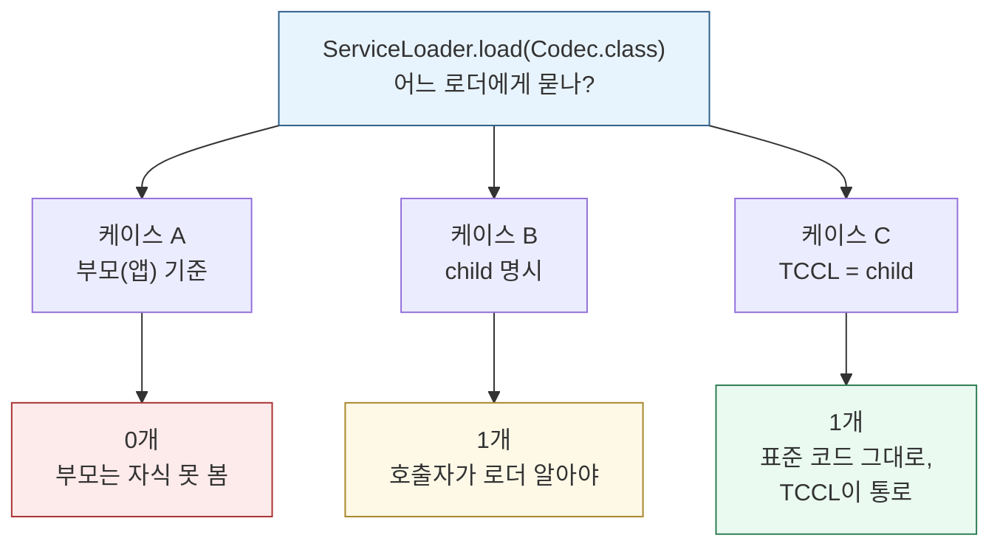

# 톰캣 클래스 로더 실습 — 부모 위임의 한계와 TCCL
---
> 04-01a·04-01b 는 *자식이 부모 것을 빌려 쓰는* 방향이었습니다. 이 실습은 **반대 방향** 을 다룹니다. 부모 계층의 코드(`ServiceLoader` 같은 SPI)가 *자식이 가진 구현체* 를 찾아야 하는 상황입니다. 부모는 구조상 자식을 못 보는데, 어떻게 찾을까요. 그 우회로가 **TCCL(Thread Context ClassLoader)** 입니다.

읽고 나면 부모 위임이 왜 한쪽 방향만 보는지, JDBC·SPI 가 컨테이너에서 동작하려면 왜 TCCL 이 필요한지 설명합니다. 04-01 §6 "역방향 조회"의 실증입니다.


## 1. 무엇을 증명하는가 — 위임의 반대 방향

> 부모 위임은 "자식이 부모에게 위로 묻는" 단방향입니다. 그래서 부모는 자식을 못 봅니다. 
>
> 그런데 현실에는 부모 계층 코드가 자식 구현을 찾아야 하는 경우가 많습니다. JDBC `DriverManager`(JDK=부모)가 웹앱 `WEB-INF/lib`(자식)의 드라이버를 찾는 상황이 대표적입니다.



이 실습은 그 막힌 방향을 세 케이스로 뚫어 봅니다. 같은 `ServiceLoader.load(Codec.class)` 가 *어느 로더 기준이냐* 에 따라 0개도, 1개도 됩니다.

| 케이스 | 어느 로더 기준 | 구현체 수 |
|--------|---------------|----------|
| A | 부모(앱) | 0개 |
| B | 자식 명시 | 1개 |
| C | TCCL = 자식 | 1개 |


## 2. 준비물 — 계약은 부모, 구현은 자식

SPI 의 전형적 구도를 만듭니다. **계약(인터페이스)은 부모가, 구현은 자식만** 갖습니다.

| 이름 | 위치 | 역할 |
|------|------|------|
| `Codec` (인터페이스) | 앱(부모) 로더 | SPI 계약 — JDBC `Driver` 자리 |
| `Base64Codec` (구현) | `build/labout/provider/` | 자식이 가진 구현체 — 웹앱 안 구현 자리 |
| `META-INF/services/com.acme.spi.Codec` | provider 안 | `ServiceLoader` 가 읽는 등록 파일 |



### 계약·구현·등록 파일의 실제 코드

먼저 계약(인터페이스)입니다. 부모(앱) 로더에 놓입니다.

```java
// src/main/java/com/acme/spi/Codec.java
package com.acme.spi;

// SPI 계약. JDBC 의 java.sql.Driver, 톰캣 Common 계층 API 와 같은 자리.
public interface Codec {
    String encode(String s);
}
```

다음은 구현체입니다. 자식 로더 쪽(`provider`)에 놓이고, 부모는 이 클래스를 모릅니다.

```java
// libsrc/provider/com/acme/provider/Base64Codec.java
package com.acme.provider;

import com.acme.spi.Codec;
import java.util.Base64;

public class Base64Codec implements Codec {
    @Override
    public String encode(String s) {
        return Base64.getEncoder().encodeToString(s.getBytes());
    }
}
```

마지막이 핵심입니다. `ServiceLoader` 가 읽는 **등록 파일** 입니다. 파일명이 *인터페이스의 FQCN*, 내용이 *구현체의 FQCN* 입니다.

```text
파일: libsrc/provider/META-INF/services/com.acme.spi.Codec
내용:
com.acme.provider.Base64Codec
```

> **이 등록 파일은 자동 생성되지 않습니다.** 컴파일러가 `implements Codec` 를 보고 알아서 만들어 주지 않습니다. 개발자가 직접 작성하거나(이 실습이 한 방식), `@AutoService` 같은 애너테이션 프로세서에게 *명시적으로 시켜야* 생깁니다. 이 파일이 비어 있거나 없으면 `ServiceLoader` 는 구현체가 클래스패스에 있어도 0개를 반환합니다. "이게 구현체다"라고 알려주는 유일한 통로이기 때문입니다. 톰캣·스프링부트도 같은 `META-INF` 메커니즘을 씁니다(slf4j 의 `META-INF/services/org.slf4j.spi.SLF4JServiceProvider`, 스프링부트의 `META-INF/spring/...AutoConfiguration.imports` 등).

### 셋업 — child 로더 구성

`child` 로더는 04-01a 에서 만든 `ChildFirstClassLoader`(톰캣 WebApp 로더를 흉내 낸 자식 우선 로더)를 그대로 씁니다.

```java
// Exp3_TcclSpi.java
URL providerJar = LabPaths.dir("provider");           // build/labout/provider
ClassLoader app = Exp3_TcclSpi.class.getClassLoader(); // 부모(앱) 로더

// 자식 로더: provider(구현체 + META-INF/services)를 클래스패스로,
// 계약 패키지 com.acme.spi 만 부모 우선으로 지정
ChildFirstClassLoader child =
        new ChildFirstClassLoader(new URL[]{providerJar}, app, "com.acme.spi");
```

`child` 만 `provider`(구현체 + 등록 파일)를 클래스패스로 갖습니다. 부모는 구현을 모릅니다. 그리고 셋째 인자 `"com.acme.spi"` 는 *계약 패키지만 부모 우선* 으로 지정합니다.

> `ChildFirstClassLoader` 의 전체 코드와 동작은 [04-01a §준비물](./04-01a.톰캣%20클래스%20로더%20실습%20—%20로더가%20다르면%20타입이%20다르다.md)에서 다룹니다. 요점만 옮기면, 자기 클래스패스를 먼저 뒤지되 `java.*` 와 *지정한 공유 패키지*(여기선 `com.acme.spi`)는 부모에 먼저 위임하는 로더입니다.

### 왜 계약만 부모 우선인가

`Base64Codec implements Codec` 입니다. 만약 `child` 가 `Codec` 인터페이스까지 자기가 따로 로딩하면, 부모의 `Codec` 과 자식의 `Codec` 이 *다른 타입* 이 됩니다(04-01a 케이스 B 의 `ClassCastException` 과 같은 함정). 그래서 계약은 한 벌로 공유해야 합니다. 구현체(`Base64Codec`)는 부모가 모르니 자식이 직접 로딩합니다.

| 클래스 | `child` 의 처리 | 이유 |
|--------|----------------|------|
| `Codec` (인터페이스) | 부모에 위임(parent-first) | 타입을 한 벌로 통일 |
| `Base64Codec` (구현) | 자식이 직접 로딩 | 부모가 모르는 구현 |


## 3. ServiceLoader 와 META-INF 는 무엇인가

> 세 케이스를 보기 전에 `ServiceLoader` 가 *어떻게* 도는지 짚어야 합니다. 여기에 흔한 오해가 하나 있습니다.

**`META-INF` 는 클래스 로더가 보는 폴더가 아닙니다.** 

- `META-INF` 는 JAR 표준이 정한 *메타데이터* 폴더이고, 클래스 로더는 이걸 특별 취급하지 않습니다. 
- `META-INF/services/<인터페이스명>` 파일을 읽는 주체는 클래스 로더가 아니라 **`ServiceLoader`** 입니다. 클래스 로더는 "이 리소스 줘", "이 클래스 로딩해 줘" 같은 *심부름* 만 합니다.

`ServiceLoader.load(Codec.class)` 의 동작을 풀면 이렇습니다.



- 여기서 ②가 결정적입니다. `ServiceLoader` 가 **어느 로더에게** `META-INF/services` 파일을 요청하느냐가 결과를 가릅니다. 
- 파일이 그 로더의 클래스패스에 없으면 ③부터 진행되지 않아 0개가 됩니다. 그래서 정확히 말하면 `ServiceLoader` 의 로직은 *"지정된 로더에게 `META-INF/services` 를 요청해 읽기"* 이고, **"무엇을 읽나"(파일)는 고정, "어느 로더에서 읽나"가 변수** 입니다. 
- 세 케이스는 바로 이 ②의 로더를 바꿔 가며 결과가 달라지는 것을 봅니다.

### 전체 코드 한눈에 보기

아래가 실험 3 의 전체입니다. 세 케이스가 한 `main` 안에 차례로 들어 있습니다. 다음 장부터 한 케이스씩 떼어 봅니다.

```java
// src/main/java/com/acme/lab/Exp3_TcclSpi.java
package com.acme.lab;

import com.acme.spi.Codec;
import java.net.URL;
import java.net.URLClassLoader;
import java.util.ServiceLoader;

public class Exp3_TcclSpi {

    public static void main(String[] args) throws Exception {
        URL providerJar = LabPaths.dir("provider");
        ClassLoader app = Exp3_TcclSpi.class.getClassLoader();

        ChildFirstClassLoader child =
                new ChildFirstClassLoader(new URL[]{providerJar}, app, "com.acme.spi");

        // 케이스 A — 부모(앱) 로더 기준
        int countA = 0;
        for (Codec c : ServiceLoader.load(Codec.class)) {
            countA++;
            System.out.println("  발견: " + c);
        }
        System.out.println("  구현체 수 = " + countA + "  (부모는 자식 구현을 못 본다)");

        // 케이스 B — 자식 로더를 명시
        int countB = 0;
        for (Codec c : ServiceLoader.load(Codec.class, child)) {
            countB++;
            System.out.println("  발견: " + c + " → " + c.encode("tomcat"));
        }
        System.out.println("  구현체 수 = " + countB);

        // 케이스 C — TCCL 을 자식으로 바꾼 뒤
        ClassLoader saved = Thread.currentThread().getContextClassLoader();
        try {
            Thread.currentThread().setContextClassLoader(child);
            int countC = 0;
            for (Codec c : ServiceLoader.load(Codec.class)) {   // 인자 하나(케이스 A와 동일)
                countC++;
                System.out.println("  발견: " + c + " → " + c.encode("tomcat"));
            }
            System.out.println("  구현체 수 = " + countC + "  (TCCL 이 통로가 됐다)");
        } finally {
            Thread.currentThread().setContextClassLoader(saved); // 반드시 원복(실험 4 의 누수 원인)
        }
    }
}
```


## 4. 케이스 A — 부모는 자식 구현을 못 본다 (0개)

```java
// 인자 하나 → 현재 스레드의 TCCL(여기선 앱 로더) 기준
for (Codec c : ServiceLoader.load(Codec.class)) {
    countA++;
}
// 출력: 구현체 수 = 0  (부모는 자식 구현을 못 본다)
```



- 인자 하나짜리 `load(Codec.class)` 는 현재 스레드의 TCCL 을 쓰는데, 이 시점 TCCL 은 앱(부모) 로더입니다. 
- 등록 파일과 구현체는 `child` 의 클래스패스에만 있으니, 부모에게 물어보면 못 찾습니다. 이것이 **부모 위임의 한계** 입니다. 
- 부모 계층 코드(`ServiceLoader` 는 JDK=부모가 로딩)가 자식 구현을 구조적으로 못 봅니다. 여기서 멈추면 SPI 는 컨테이너에서 동작할 수 없습니다.


## 5. 케이스 B — 자식 로더를 명시하면 보인다 (1개)

```java
// 둘째 인자로 child 를 명시 → child 기준으로 탐색
for (Codec c : ServiceLoader.load(Codec.class, child)) {
    countB++;
    // c.encode("tomcat") → dG9tY2F0
}
// 출력: 구현체 수 = 1
```



케이스 A 와 딱 한 곳이 다릅니다. 둘째 인자로 `child` 를 넘겨, ServiceLoader 가 `child` 에게 물어보게 했습니다. `child` 의 클래스패스엔 등록 파일도 구현체도 있으니 1개를 찾습니다. 등록 파일도 구현체도 그대로인데 *물어보는 상대* 만 바꿔 0개가 1개가 됐습니다.

- 다만 케이스 B 에는 한계가 있습니다. 호출하는 쪽이 `child` 가 누군지 *알아야* 합니다. 실제 프레임워크(`DriverManager` 등)는 자기를 쓰는 웹앱의 로더가 누군지 모릅니다. 
- JDK 코드가 "이 웹앱의 로더"를 알 길이 없습니다. 그래서 더 일반적인 우회로가 필요합니다.


## 6. 케이스 C — TCCL 이 통로가 된다 (1개)

```java
ClassLoader saved = Thread.currentThread().getContextClassLoader();   // 백업
try {
    Thread.currentThread().setContextClassLoader(child);              // TCCL 을 child 로
    for (Codec c : ServiceLoader.load(Codec.class)) {                 // 인자 하나! (케이스 A와 동일)
        countC++;
    }
} finally {
    Thread.currentThread().setContextClassLoader(saved);              // 반드시 원복
}
// 출력: 구현체 수 = 1  (TCCL 이 통로가 됐다)
```



**TCCL(Thread Context ClassLoader)** 은 스레드마다 하나씩 달고 다니는 "기준 로더"입니다. 부모 위임 트리와 *별개로*, "지금 이 작업은 이 로더 관점에서 처리해라"를 지정하는 옆문입니다. 인자 하나짜리 `load(Codec.class)` 는 내부적으로 이 TCCL 을 씁니다.

- 케이스 C 는 TCCL 을 `child` 로 바꿔놓고 **케이스 A 와 글자 하나 안 다른 호출** 을 합니다. 그런데 0개가 아니라 1개가 나옵니다. TCCL 만 바꿨을 뿐입니다.

C 의 강점은 **`load(Codec.class)` 를 쓰는 코드(JDK·라이브러리)가 `child` 를 몰라도 된다** 는 것입니다. 

- 컨테이너가 미리 TCCL 을 깔아두면, 그 위에서 도는 표준 SPI 코드가 알아서 올바른 로더를 씁니다. 이것이 톰캣이 하는 일입니다.
- 요청 처리 스레드의 TCCL 을 그 웹앱의 WebApp 로더로 맞춰둡니다. 그러면 그 스레드에서 도는 JDBC·JNDI·`ServiceLoader` 가 전부 그 웹앱 구현을 찾습니다.

### finally 의 복선

TCCL 을 바꿨으면 `finally` 에서 반드시 원복합니다. 스레드는 풀에서 재사용되는데, TCCL 을 `child` 로 둔 채 반납하면 다음 작업이 엉뚱한 로더를 씁니다. 그리고 이 원복을 빼먹으면 그게 **실험 4 의 ClassLoader Leak 원인** 이 됩니다(스레드가 옛 로더를 계속 붙잡음). 다음 실습의 복선입니다.


## 7. 정리 — 세 케이스 한눈에



| 케이스 | 어떻게 | 결과 | 교훈 |
|--------|--------|------|------|
| A | 부모 기준 `load()` | 0개 | 부모는 자식 구현 못 봄 (위임의 한계) |
| B | 로더 명시 `load(.., child)` | 1개 | 명시하면 되지만 호출자가 로더를 알아야 |
| C | TCCL=child 후 `load()` | 1개 | 표준 코드 그대로, TCCL 이 통로 |

핵심은 부모 위임이 "위로 묻는" 단방향이라 부모가 자식 구현을 못 본다는 점, 그리고 TCCL 이 그 한계를 뚫는 옆문이라는 점입니다. 톰캣이 요청 스레드 TCCL 을 WebApp 로더로 맞춰 SPI 가 웹앱 구현을 찾게 합니다. 04-01 §6 "역방향 조회 — TCCL 이 필요한 이유"의 실증입니다.


## 8. 직접 돌려보기

`jvm-practice`(jvm-deep-dive) Gradle 프로젝트의 `:ch03-classloader` 모듈입니다.

```bash
cd ~/jvm-practice
./gradlew :ch03-classloader:exp3
```

IntelliJ 라면 Gradle 패널의 `ch03-classloader > Tasks > lab > exp3` 을 더블클릭합니다. 폴더 구조와 빌드 설정은 [04-01a §폴더 구조](./04-01a.톰캣%20클래스%20로더%20실습%20—%20로더가%20다르면%20타입이%20다르다.md)·[06_Build 07-01](../../06_Build/07-01.소스셋과%20커스텀%20태스크%20—%20표준%20밖%20소스%20다루기.md)을 참고합니다.


## 9. 핵심 개념 체크리스트

- [ ] 부모 위임이 단방향이라 부모가 자식 구현을 못 본다는 점을 설명할 수 있는가?
- [ ] 셋업에서 계약(`Codec`)은 부모 우선, 구현(`Base64Codec`)은 자식 로딩으로 나눈 이유(타입 통일)를 아는가?
- [ ] `META-INF` 가 클래스 로더의 폴더가 아니라 `ServiceLoader` 가 읽는 메타데이터 폴더임을 설명할 수 있는가?
- [ ] `ServiceLoader` 의 결과를 가르는 것이 "어느 로더에게 `META-INF/services` 를 묻느냐"임을 아는가?
- [ ] 케이스 A·B·C 가 같은 `load` 호출인데 결과가 0/1/1 로 갈리는 이유를 각각 말할 수 있는가?
- [ ] TCCL 이 부모 위임과 별개의 "기준 로더"이고, 톰캣이 이를 WebApp 로더로 맞춘다는 점을 설명할 수 있는가?
- [ ] TCCL 원복을 빼먹으면 왜 ClassLoader Leak 으로 이어지는지 아는가?


## 10. 관련 문서

- [04-01b. 톰캣 클래스 로더 실습 — 클래스패스 격리와 버전 충돌](./04-01b.톰캣%20클래스%20로더%20실습%20—%20클래스패스%20격리와%20버전%20충돌.md) — 같은 실습의 2편
- [04-01. 톰캣의 클래스 로더 아키텍처](./04-01.톰캣의%20클래스%20로더%20아키텍처.md) § "역방향 조회 — TCCL이 필요한 이유" — 이 실습이 증명하는 원문
- [04-01a. 톰캣 클래스 로더 실습 — 로더가 다르면 타입이 다르다](./04-01a.톰캣%20클래스%20로더%20실습%20—%20로더가%20다르면%20타입이%20다르다.md) — 계약 공유의 원리(케이스 A)
