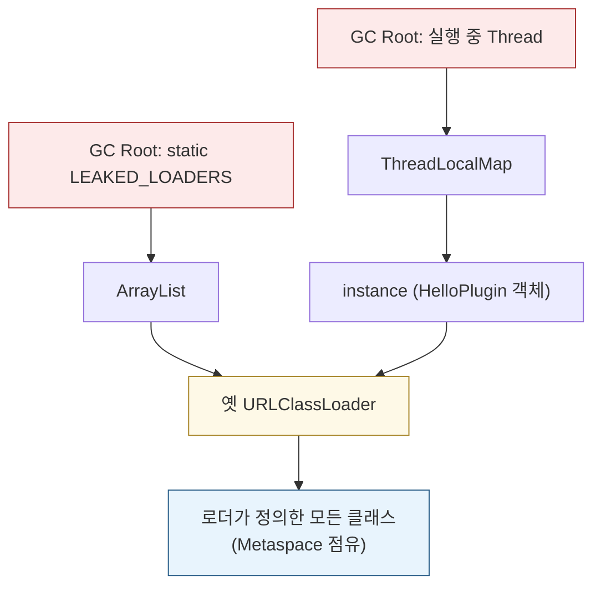
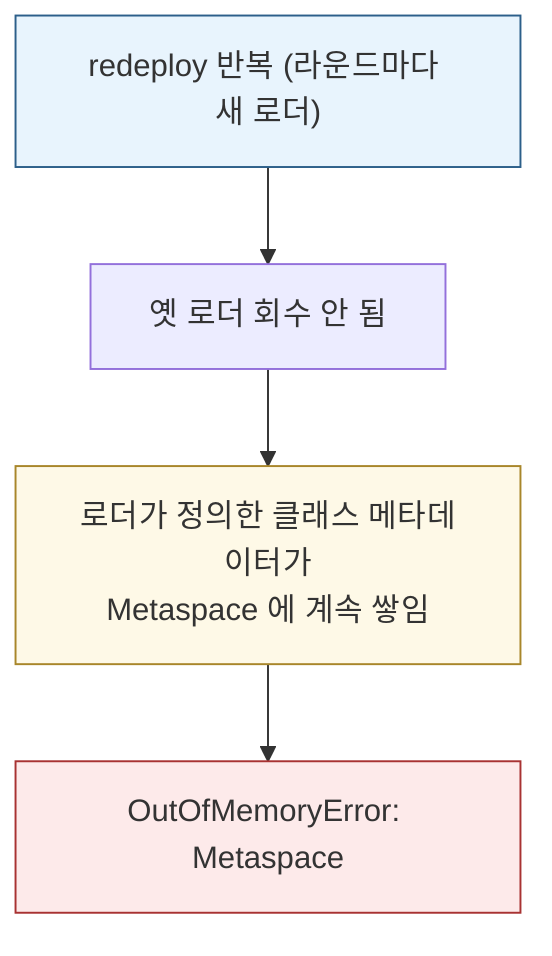
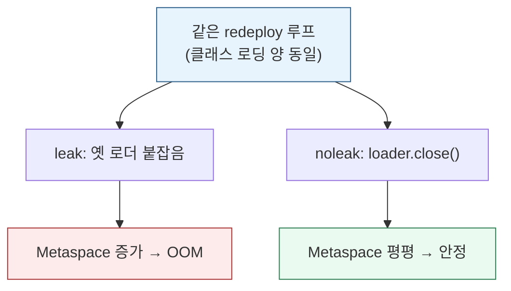

# 톰캣 클래스 로더 실습 — ClassLoader Leak과 Metaspace OOM
---
> 실험 1~3 이 "클래스를 어떻게 찾고 격리하나"였다면, 이 마지막 실습은 **운영 관점** 입니다. 
>
> 톰캣이 웹앱을 redeploy 할 때 옛 WebApp 로더를 버리는데, 누군가 그 로더를 계속 붙잡으면 회수되지 않아 `OutOfMemoryError: Metaspace` 로 터집니다. 같은 양의 클래스 로딩인데 *옛 로더를 놓아주느냐* 하나로 OOM 과 안정이 갈리는 것을 눈으로 봅니다.

읽고 나면 "reload 가 되는가" 가 아니라 "옛 ClassLoader 가 해제되는가" 가 운영의 질문인 이유를 설명합니다. 04-01 §4 "핫 디플로이의 그림자 — ClassLoader Leak"의 실증입니다.


## 1. 무엇을 증명하는가

톰캣은 웹앱을 reload 하면 옛 WebApp 로더를 버리고 새 로더를 만듭니다. 옛 로더가 GC 되면 그 로더가 정의한 클래스 메타데이터도 회수됩니다. 그런데 누군가 옛 로더를 계속 참조하면 회수되지 못하고, redeploy 를 반복할수록 메모리가 쌓여 터집니다. 이것이 ClassLoader Leak 입니다.

이 실습은 redeploy 를 흉내 낸 루프를 두 모드로 돌려 대조합니다.

| 모드 | 옛 로더를 | Metaspace | 결과 |
|------|-----------|-----------|------|
| leak | static·ThreadLocal 로 붙잡음 | 계속 증가 | `OutOfMemoryError: Metaspace` |
| noleak | `close()` 로 놓아줌 | 평평 | 안정 |

핵심은 *둘의 클래스 로딩 양이 같다* 는 점입니다. 차이는 옛 로더를 붙잡느냐 뿐인데 결과가 정반대입니다.


## 2. 전체 코드

이 문서만 봐도 따라올 수 있게 전체를 싣습니다. redeploy 한 번이 루프 한 라운드입니다.

```java
// src/main/java/com/acme/lab/Exp4_ClassLoaderLeak.java
package com.acme.lab;

import java.net.URL;
import java.net.URLClassLoader;
import java.util.ArrayList;
import java.util.List;

public class Exp4_ClassLoaderLeak {

    // 누수 원인 ① — static 컬렉션이 로더를 영구 참조
    static final List<ClassLoader> LEAKED_LOADERS = new ArrayList<>();

    // 누수 원인 ② — ThreadLocal 에 로더가 만든 인스턴스가 남음
    static final ThreadLocal<Object> LEAKY_TL = new ThreadLocal<>();

    public static void main(String[] args) throws Exception {
        boolean leak = args.length > 0 && args[0].equalsIgnoreCase("leak");

        URL pluginJar = LabPaths.dir("plugin");
        URL apiJar    = LabPaths.dir("app");
        ClassLoader app = Exp4_ClassLoaderLeak.class.getClassLoader();

        for (int i = 1; i <= 100_000; i++) {
            // 매 라운드 = 한 번의 redeploy: 새 로더 + 새 클래스 정의
            URLClassLoader loader = new URLClassLoader(new URL[]{pluginJar, apiJar}, app);
            Class<?> plugin = loader.loadClass("com.acme.plugin.HelloPlugin");
            Object instance = plugin.getDeclaredConstructor().newInstance();

            if (leak) {
                LEAKED_LOADERS.add(loader);   // 옛 로더를 놓아주지 않음 → GC 못 함
                LEAKY_TL.set(instance);       // ThreadLocal 도 인스턴스(→로더)를 붙잡음
            } else {
                loader.close();               // 참조를 끊음 → loader/instance 모두 GC 대상
                instance = null;
            }

            if (i % 200 == 0) {
                System.out.printf("round %5d | leaked loaders=%6d | Metaspace≈%4d MB%n",
                        i, leak ? LEAKED_LOADERS.size() : 0, metaspaceUsedMB());
            }
        }
    }

    // Metaspace 사용량(MB) 근사 — java.lang.management 로 조회
    static long metaspaceUsedMB() {
        for (java.lang.management.MemoryPoolMXBean pool :
                java.lang.management.ManagementFactory.getMemoryPoolMXBeans()) {
            if (pool.getName().contains("Metaspace")) {
                return pool.getUsage().getUsed() / (1024 * 1024);
            }
        }
        return -1;
    }
}
```

> `HelloPlugin` 은 04-01a 에서 쓴 그 구현체입니다. `build/labout/plugin` 에 따로 컴파일돼 있고, 매 라운드 새 `URLClassLoader` 가 이걸 *자기 손으로* 다시 정의합니다. 그래서 라운드마다 새 클래스 메타데이터가 생깁니다.


## 3. 왜 옛 로더가 안 죽나 — GC Root 사슬

JVM 의 GC 는 단순한 규칙을 씁니다. **GC Root 에서 참조 사슬을 따라 닿을 수 있으면 살려두고, 닿을 수 없으면 회수** 합니다. 옛 로더가 회수되려면 어떤 GC Root 에서도 닿지 않아야 합니다. 그런데 `leak` 모드의 두 참조가 GC Root 에 직접 매달립니다.



**누수 ① static 필드.** `static` 필드는 그 자체가 GC Root 입니다. 클래스가 로딩돼 있는 한 죽지 않습니다. `LEAKED_LOADERS` 리스트가 옛 로더들을 담으니, Root 에서 닿아 회수되지 않습니다.

**누수 ② ThreadLocal.** ThreadLocal 은 값을 *스레드 객체 안* 에 저장하고, 실행 중인 스레드도 GC Root 입니다. 여기가 미묘합니다. `LEAKY_TL` 에 담은 것은 `HelloPlugin` *인스턴스* 인데, 모든 객체는 `getClass().getClassLoader()` 로 자기를 정의한 로더를 가리킵니다. 그래서 인스턴스 하나만 남아도 `인스턴스 → 클래스 → 로더` 사슬로 옛 로더가 살아남습니다. 04-01c §6 에서 TCCL 원복을 빼먹으면 누수가 된다고 한 복선이 정확히 이 패턴입니다.

핵심은 **참조 하나가 로더 전체를 살린다** 는 점입니다. 인스턴스 한 개를 안 놓아주면, 그 인스턴스가 속한 로더가 정의한 *모든* 클래스가 줄줄이 회수되지 못합니다. 작은 실수가 큰 누수가 되는 이유입니다.


## 4. 어디에 쌓여 터지나 — Metaspace

옛 로더가 붙잡는 것은 **클래스 메타데이터** 입니다. 클래스 정보(메서드·필드·바이트코드)는 힙이 아니라 **Metaspace** 라는 별도 영역에 저장됩니다. 그래서 ClassLoader Leak 은 힙 OOM 이 아니라 *Metaspace OOM* 으로 드러납니다. 힙은 멀쩡한데 Metaspace 만 차오르는 것이 특징적 신호입니다.



실습은 이걸 빨리 재현하려고 Metaspace 를 작게 제한합니다(`-XX:MaxMetaspaceSize=32m`). 그리고 `MemoryPoolMXBean` 으로 Metaspace 사용량을 라운드마다 찍어, 누수가 쌓이는 것을 숫자로 봅니다.


## 5. 실측 — leak vs noleak 대조

`leak` 모드는 Metaspace 가 계속 오르다 터집니다.

```text
round  3200 | leaked loaders=  3200 | Metaspace≈  14 MB
round  3600 | leaked loaders=  3600 | Metaspace≈  15 MB
round  3800 | leaked loaders=  3800 | Metaspace≈  15 MB
Exception in thread "main" java.lang.OutOfMemoryError: Metaspace
```

`noleak` 모드는 12,000 라운드를 넘겨도 평평합니다.

```text
round  4000 | leaked loaders=     0 | Metaspace≈  14 MB
round  8000 | leaked loaders=     0 | Metaspace≈  15 MB
round 12000 | leaked loaders=     0 | Metaspace≈  13 MB   (안정, OOM 없음)
```



대조가 증명하는 것은 명확합니다. 두 모드의 클래스 로딩 양은 똑같습니다. 차이는 옛 로더를 놓아주느냐 뿐입니다. `noleak` 은 `loader.close()` 로 참조를 끊으니 GC 가 회수해 Metaspace 가 안정됩니다. 그래서 운영의 질문은 이렇게 바뀝니다.

> **"reload 가 되는가" 가 아니라 "옛 ClassLoader 가 해제되는가" 다.**

`leak` 모드도 reload(새 로더 생성)는 *성공* 합니다. 그런데 옛 로더가 안 죽어 터집니다. "redeploy 가 됐다" 와 "메모리가 회수됐다" 는 별개입니다.


## 6. 실무에서 — 누수 원인과 톰캣의 방어

실습의 두 원인(static·ThreadLocal)은 실무 ClassLoader Leak 의 단골입니다. 04-01 §4 가 정리한 대표 원인은 다음과 같습니다.

- 웹앱이 띄운 스레드가 종료되지 않고 살아남음
- `ThreadLocal` 에 웹앱 클래스 인스턴스가 남아 회수되지 않음
- JDBC Driver·Timer·Executor·Scheduler 가 정리되지 않음
- static 필드가 웹앱 클래스나 그 ClassLoader 를 간접 참조함

톰캣은 이를 완화하는 리스너를 기본 제공합니다. `JreMemoryLeakPreventionListener` 는 JRE 코드가 컨텍스트 클래스 로더로 싱글턴을 로딩해 생기는 누수를 막고, `ThreadLocalLeakPreventionListener` 는 Context 가 멈출 때 Executor 풀의 스레드를 갱신해 `ThreadLocal` 누수를 줄입니다. 다만 이는 *완화* 일 뿐, 웹앱 코드가 스레드·`ThreadLocal`·드라이버를 스스로 정리하는 것이 근본 해법입니다.


## 7. 직접 돌려보기

`jvm-practice`(jvm-deep-dive) Gradle 프로젝트의 `:ch03-classloader` 모듈입니다.

```bash
cd ~/jvm-practice
./gradlew :ch03-classloader:exp4Leak     # OOM 재현 (OOM 나도 BUILD SUCCESS)
./gradlew :ch03-classloader:exp4NoLeak   # 안정 대조
```

`exp4Leak` 은 `OutOfMemoryError: Metaspace` 로 끝나는 것이 기대 결과라, 빌드가 실패로 보이지 않게 처리돼 있습니다. 폴더 구조·빌드 설정은 [04-01a §폴더 구조](./04-01a.톰캣%20클래스%20로더%20실습%20—%20로더가%20다르면%20타입이%20다르다.md)·[06_Build 07-01](../../06_Build/07-01.소스셋과%20커스텀%20태스크%20—%20표준%20밖%20소스%20다루기.md)을 참고합니다.


## 8. 핵심 개념 체크리스트

- [ ] redeploy 가 옛 WebApp 로더를 버리고 새 로더를 만드는 동작임을 설명할 수 있는가?
- [ ] GC Root(static 필드·실행 중 스레드)에서 닿는 객체는 회수되지 않는다는 규칙을 아는가?
- [ ] ThreadLocal 의 인스턴스 하나가 `인스턴스 → 클래스 → 로더` 사슬로 로더 전체를 살리는 것을 설명할 수 있는가?
- [ ] ClassLoader Leak 이 힙이 아니라 Metaspace 에 쌓여 `OutOfMemoryError: Metaspace` 로 드러나는 이유를 아는가?
- [ ] leak·noleak 의 클래스 로딩 양이 같은데 결과가 갈리는 이유(옛 로더 해제 여부)를 말할 수 있는가?
- [ ] "reload 가 되는가" 가 아니라 "옛 로더가 해제되는가" 가 운영의 질문인 이유를 설명할 수 있는가?
- [ ] 04-01c 의 TCCL 원복 누락이 이 누수와 어떻게 이어지는지 아는가?


## 9. 관련 문서

- [04-01c. 톰캣 클래스 로더 실습 — 부모 위임의 한계와 TCCL](./04-01c.톰캣%20클래스%20로더%20실습%20—%20부모%20위임의%20한계와%20TCCL.md) — 같은 실습의 3편, TCCL 원복 복선
- [04-01. 톰캣의 클래스 로더 아키텍처](./04-01.톰캣의%20클래스%20로더%20아키텍처.md) § "핫 디플로이의 그림자 — ClassLoader Leak" — 이 실습이 증명하는 원문
- [04-01a. 톰캣 클래스 로더 실습 — 로더가 다르면 타입이 다르다](./04-01a.톰캣%20클래스%20로더%20실습%20—%20로더가%20다르면%20타입이%20다르다.md) — 같은 실습의 1편, 폴더 구조
