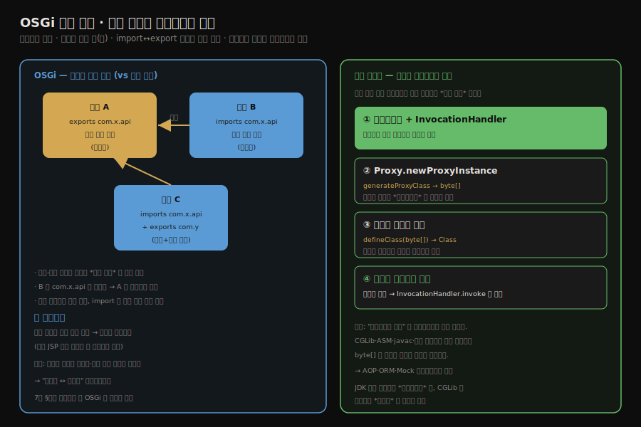
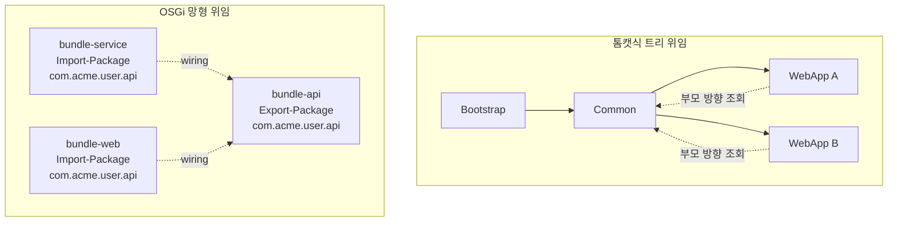
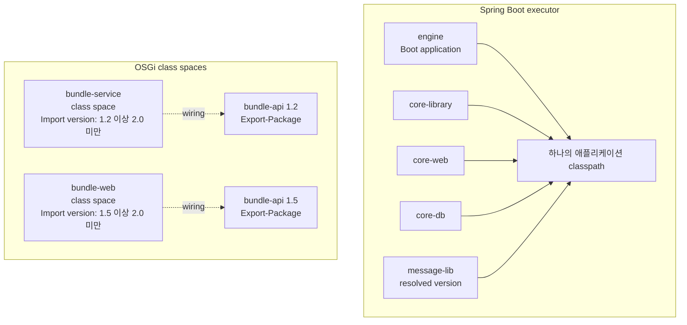
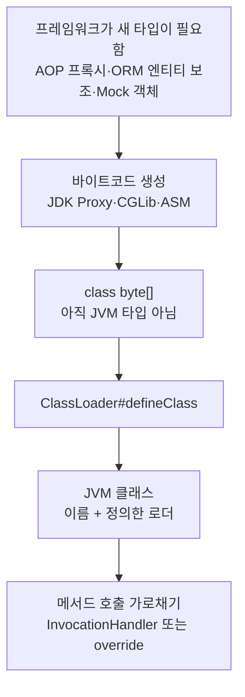

# OSGi의 유연한 클래스 로더와 바이트코드 생성
---
> §9.2.2~§9.2.3을 한 줄로 압축하면 — **OSGi는 번들마다 자기 클래스 로더를 두고 트리가 아닌 *망(網)* 구조로 위임해 무중단 핫 디플로이를 얻습니다. 동적 프록시는 런타임에 클래스 *바이트코드를 생성*해 클래스 로더로 적재합니다.**
>
> 핵심은 "OSGi의 위임은 부모-자식이 아니라 resolve 때 계산된 wiring을 따른다"는 발상과, "바이트코드 생성은 컴파일러만의 일이 아니라 런타임 기술"이라는 점입니다. OSGi는 패키지 단위로 공개·수입을 정합니다. 동적 프록시는 인터페이스 목록과 클래스 로더를 입력으로 새 프록시 클래스를 정의합니다.

이 글을 읽고 나면 OSGi의 망형 위임이 톰캣의 트리형과 어떻게 다른지 설명합니다. 동적 프록시가 런타임에 바이트코드를 만들어 적재하는 흐름을 말합니다. 그것이 AOP·ORM 프레임워크의 토대가 되는 이유도 그림 없이 짚을 수 있습니다.


## 1. 진입 — 위임을 더 멀리 밀면

> [앞 글의 톰캣](./04-01.톰캣의%20클래스%20로더%20아키텍처.md)이 부모 위임을 *응용*했다면, OSGi는 위임 구조 자체를 *뒤집습니다*. 트리가 아니라 의존 관계를 따르는 망으로 바꿉니다.

톰캣은 부모 위임의 큰 틀을 유지하며 WebApp 로더에서 일부만 깼습니다. OSGi는 더 나아갑니다. [7장에서 위임 깨기의 사례로 잠깐 본 OSGi](./02-04.클래스%20로더와%20부모%20위임%20모델.md)를 이 글에서 자세히 봅니다. 함께 보는 동적 프록시는 *클래스 로더의 또 다른 응용*입니다. 런타임에 클래스를 만들어 적재하는 기술입니다.




## 2. OSGi(Open Service Gateway Initiative)의 망형 클래스 로더

> OSGi는 번들마다 자기 로더를 둡니다. **부모-자식 트리가 아니라 *import↔export 의존*을 따라 위임합니다.** 번들 단위 핫 디플로이가 가능하지만 위임이 복잡해집니다.

**OSGi(Open Service Gateway Initiative)는 자바 모듈화 기술의 하나로, 애플리케이션을 *번들(bundle)* 단위로 나눕니다.**

- 번들은 OSGi에서 배포·업데이트·실행의 기본 단위인 JAR입니다. 각 번들은 resolve 이후 자기 클래스 로더를 가집니다. 여기까지는 톰캣과 비슷하지만 *위임 구조*가 결정적으로 다릅니다.

톰캣은 부모-자식 *트리*로 위임이 위로 흐릅니다. **OSGi는 트리가 아니라 *평등한 망(網)*입니다.** 위임이 부모-자식 관계가 아니라 *번들 간 의존 관계*를 따릅니다.

아래 그림은 트리형 위임과 OSGi 망형 위임의 차이를 한 번에 보여줍니다. 톰캣 쪽은 WebApp 로더가 위쪽 부모 계층으로 묻지만, OSGi 쪽은 번들 B의 import가 resolve 결과에 따라 번들 A의 export에 직접 이어집니다.



1. 번들은 자신이 공개할 패키지를 `Export-Package`로 선언합니다. 필요한 패키지는 `Import-Package`로 선언합니다.
2. 프레임워크는 resolve 단계에서 import와 export를 연결해 wiring을 만듭니다. 이 wiring이 "이 패키지는 어느 번들의 로더에게 물어볼지"를 정합니다.
3. 번들 B가 어떤 클래스를 찾는데 그 패키지가 번들 A의 export에 연결되어 있다면, B의 로더는 *A의 로더에게* 위임합니다. 부모라서가 아니라 *wiring으로 연결됐기 때문에* 위임합니다.
4. 자기 번들 안의 private 클래스는 자기 로더가 처리합니다. `java.*` 패키지는 부모 로더로 위임됩니다.

설정 파일로 보면 OSGi의 핵심은 JAR manifest에 들어가는 export/import 선언입니다. `bundle-api`는 API 패키지를 공개하고, `bundle-service`는 그 패키지를 버전 범위와 함께 수입합니다.

```text
# bundle-api/META-INF/MANIFEST.MF
Bundle-SymbolicName: bundle-api
Bundle-Version: 1.2.0
Export-Package: com.acme.user.api;version="1.2.0"

# bundle-service/META-INF/MANIFEST.MF
Bundle-SymbolicName: bundle-service
Import-Package: com.acme.user.api;version="[1.2,2)"
```

Gradle 프로젝트에서는 manifest를 손으로 쓰기보다 bnd 계열 플러그인으로 생성하는 경우가 많습니다. 아래처럼 `Export-Package`와 `Import-Package`를 빌드 설정에 적으면, 결과 JAR의 manifest에 OSGi 메타데이터가 들어갑니다.

```gradle
plugins {
    id 'biz.aQute.bnd.builder' version '7.0.0'
}

jar {
    bundle {
        bnd(
            'Bundle-SymbolicName': 'bundle-service',
            'Import-Package': 'com.acme.user.api;version="[1.2,2)",*'
        )
    }
}
```

- 이 망형 구조 덕분에 *번들 단위로 로더를 통째 교체*하면 JVM 전체 재시작 없이 업데이트할 수 있습니다. 톰캣의 JSP 로더 교체를 더 일반화한 형태입니다. 실행 중인 시스템에서 한 모듈만 새 버전으로 갈아끼우기 쉬워집니다.
- 다만 OSGi의 update는 "새 JAR을 넣으면 모두 즉시 새 클래스를 본다"는 뜻이 아닙니다. 기존 wiring을 쓰는 번들이 남아 있으면 old revision의 capability가 refresh 전까지 유지될 수 있습니다. 
- 의존 번들을 다시 resolve하고 refresh해야 새 wiring이 적용됩니다. Spring Boot식으로 비유하면, 새 라이브러리 JAR을 받아 놓은 것과 현재 실행 중인 JVM의 classpath가 바뀐 것은 다른 일입니다.

대가는 *복잡도*입니다. 위임이 트리가 아니라 망이라 두 번들이 서로를 기다리는 데드락이나 버전 충돌을 디버깅하기 어렵습니다. 같은 패키지를 여러 버전으로 export할 수 있으므로, "클래스를 못 찾는다"보다 "어느 exporter에 wired 됐는가"가 더 중요한 질문이 됩니다.


## 3. OSGi를 읽는 핵심 단어

> OSGi 문서를 읽을 때는 bundle, package, wiring, class space를 먼저 잡아야 합니다. "번들끼리 import/export한다"보다 "패키지 단위 wiring이 번들의 세계관을 만든다"가 더 정확한 문장입니다.

OSGi에서 공유 단위는 보통 클래스 하나가 아니라 패키지입니다. 번들은 manifest에 `Export-Package`와 `Import-Package`를 적습니다. 프레임워크는 버전 범위와 제약을 맞춰 import를 export에 연결합니다. 이 연결 결과가 wiring입니다.

한 번들이 볼 수 있는 클래스 집합을 class space라고 부릅니다.

- class space는 자기 `Bundle-ClassPath`, import로 연결된 exporter, `java.*` 부모 위임, 동적 import 같은 규칙이 합쳐진 결과입니다.
- 그래서 OSGi 장애를 볼 때는 "classpath에 JAR이 있나?"보다 "이 번들의 class space에 해당 패키지가 들어왔나?"를 먼저 봐야 합니다.

Spring Boot 멀티모듈 프로젝트인 executor와 비교하면 차이가 선명합니다. executor는 `settings.gradle`에서 `engine`, `core-library`, `core-web`, `core-db`를 서브프로젝트로 묶고, `engine/build.gradle`에서 `message-lib`, `core-*`, Spring Boot starter들을 의존성으로 모읍니다. `engine`이 Boot 애플리케이션으로 뜨면 이 의존성들은 보통 하나의 애플리케이션 classpath 안에 합쳐집니다.

이 구조에서는 `engine`의 Jenkins 도메인 코드와 manifest 도메인 코드가 서로 다른 `message-lib` 버전을 보는 식의 구성이 자연스럽지 않습니다. Gradle dependency resolution이 한 버전을 고르고, 실행 중인 executor JVM은 그 결과로 만들어진 classpath를 함께 봅니다. 반대로 OSGi는 번들마다 `Import-Package`가 어느 `Export-Package`에 wired 됐는지에 따라 볼 수 있는 패키지 집합이 달라집니다. 그래서 OSGi의 class space는 "JVM 전체 classpath"가 아니라 "이 번들이 현재 wiring 결과로 볼 수 있는 세계"에 가깝습니다.

executor 비유를 그림으로 옮기면 다음과 같습니다. Spring Boot executor는 실행 시점에 `engine` 중심 classpath가 하나로 합쳐지는 쪽이고, OSGi는 번들별 class space가 wiring 결과로 따로 생기는 쪽입니다.



executor의 실제 설정은 OSGi manifest가 아니라 Gradle 의존성 선언입니다. `settings.gradle`은 서브프로젝트를 묶고, `engine/build.gradle`은 실행 앱 classpath에 들어갈 의존성을 한곳에 모읍니다.

```gradle
// settings.gradle
include('engine')
include('core-library')
include('core-web')
include('core-db')
```

```gradle
// engine/build.gradle
dependencies {
    implementation project(':core-library')
    implementation project(':core-web')
    implementation project(':core-db')
    implementation "org.okestro:message-lib:${messageLibVersion}"
}
```

Spring Boot에서도 OSGi처럼 "모듈별로 서로 다른 class space"를 만들 수 있느냐고 물으면, 기본 답은 *일반적인 Spring Boot 방식으로는 아니다*입니다. Boot fat jar는 애플리케이션을 하나의 실행 단위로 묶고, Gradle/Maven이 resolve한 의존성 집합을 한 classpath로 올립니다. 특정 도메인만 `message-lib 1.2`를 보고 다른 도메인만 `message-lib 1.5`를 보는 식의 package wiring은 Spring Boot의 기본 모델이 아닙니다.

가능하게 만들 수는 있지만, 그 순간 일반적인 Spring Boot 운영 모델을 벗어납니다. 예를 들어 OSGi 컨테이너를 별도로 도입하거나, 플러그인 시스템처럼 `URLClassLoader`를 직접 만들거나, 아예 프로세스를 나눠 서비스 경계를 분리해야 합니다. executor 같은 업무 서비스에서는 보통 이런 로더 분리보다 "버전을 하나로 resolve하고 앱을 재기동한다"는 단순한 운영 모델이 더 자연스럽습니다.

간단한 예시는 다음과 같습니다.

```text
bundle-api
  Export-Package: com.acme.user.api;version=1.2.0

bundle-service
  Import-Package: com.acme.user.api;version="[1.2,2)"
```

- `bundle-service`에서 `com.acme.user.api.UserService`를 로딩하면 자기 JAR만 뒤지는 것이 아닙니다.
- resolve 때 `bundle-api`의 export에 wired 됐다면, `bundle-service`의 로더는 해당 패키지를 `bundle-api`의 로더에게 위임합니다. 이 순간 두 번들은 부모-자식이 아니라 패키지 wiring으로 이어진 이웃입니다.

버전 범위도 이 wiring을 결정합니다. 예를 들어 `Import-Package: com.acme.user.api;version="[1.2,2)"`는 `1.2.0` 이상, `2.0.0` 미만을 뜻합니다. `1.2.0`이나 `1.9.5` export는 후보가 되지만 `2.0.0`은 범위 밖입니다. "가장 가까운 메이저 버전"을 감으로 고르는 것이 아니라, import에 적힌 범위와 exporter의 capability를 맞춰 resolve합니다.

update와 refresh도 executor 비유로 다시 볼 수 있습니다. executor에서 `message-lib` 새 버전을 Nexus에 올리거나 Gradle cache에 받아 두었다고 해서, 이미 떠 있는 `engine` 프로세스가 곧바로 새 클래스를 쓰지는 않습니다. 보통 프로세스를 다시 띄워 새 classpath로 시작해야 합니다. OSGi에서 update는 새 revision을 들여오는 쪽에 가깝고, refresh는 그 revision을 보도록 의존 번들의 wiring과 class space를 다시 계산하는 쪽에 가깝습니다.


## 4. 바이트코드 생성 기술

> 바이트코드를 만드는 일은 컴파일러만의 몫이 아닙니다. CGLib·ASM·동적 프록시가 *런타임에* `byte[]`를 만들어 클래스 로더로 적재합니다.

`javac`가 소스를 `.class`로 만드는 것은 익숙한 바이트코드 생성입니다. 그러나 바이트코드는 *실행 중에도* 만들 수 있습니다. CGLib·ASM·자바 동적 프록시가 모두 런타임에 클래스 바이트코드를 생성해 클래스 로더로 적재합니다. 이 기술이 Spring AOP·Hibernate·Mockito 같은 프레임워크의 토대입니다.

- 여기서 클래스 로더가 다시 등장합니다. JVM은 `byte[]`만 있다고 클래스로 인정하지 않습니다. 어떤 로더가 어떤 이름의 클래스로 정의했는지가 붙어야 타입이 됩니다. 그래서 런타임 바이트코드 생성 기술은 항상 "생성"과 "정의"가 한 쌍입니다.
- 프레임워크별로 방식은 다릅니다. JDK 동적 프록시는 인터페이스 목록을 받아 `Proxy`의 하위 클래스를 만듭니다. CGLib은 대상 클래스를 상속한 하위 클래스를 만들고 메서드 호출을 가로챕니다. ASM은 더 낮은 수준에서 바이트코드 명령어를 직접 조립하는 도구에 가깝습니다.

런타임 바이트코드 생성의 핵심은 **"클래스 파일을 만든다"에서 끝나지 않고, 그 바이트 배열을 특정 클래스 로더가 타입으로 정의한다는 점입니다."** 

아래 흐름에서 `byte[]`는 아직 데이터이고, `defineClass` 이후에야 JVM이 구분하는 클래스가 됩니다.




## 5. 동적 프록시 — 런타임에 클래스를 만든다

> 동적 프록시는 인터페이스 구현 클래스의 바이트코드를 *실행 중에 생성*해 적재합니다. 메서드 호출은 `InvocationHandler`로 가로채집니다.

자바 동적 프록시는 인터페이스의 구현 클래스를 소스 코드 없이 런타임에 만들어 냅니다. Oracle 문서 기준으로 프록시 클래스는 런타임에 지정한 인터페이스 목록을 구현합니다. 인터페이스 메서드 호출은 `InvocationHandler.invoke`로 dispatch됩니다. 책 §9.2.3의 예제를 봅니다.

```java
import java.lang.reflect.InvocationHandler;
import java.lang.reflect.Method;
import java.lang.reflect.Proxy;

public class DynamicProxyTest {
    interface IHello {
        void sayHello();
    }

    static class Hello implements IHello {
        @Override
        public void sayHello() { System.out.println("hello world"); }
    }

    static class DynamicProxy implements InvocationHandler {
        Object originalObj;   // 실제 작업을 수행할 원본 객체

        Object bind(Object originalObj) {
            this.originalObj = originalObj;

            // 원본의 인터페이스로 프록시 인스턴스를 런타임 생성
            return Proxy.newProxyInstance(
                    originalObj.getClass().getClassLoader(),
                    originalObj.getClass().getInterfaces(),
                    this);
        }

        @Override
        public Object invoke(Object proxy, Method method, Object[] args) throws Throwable {
            // 모든 메서드 호출이 이 invoke 로 가로채짐
            System.out.println("welcome");
            return method.invoke(originalObj, args);   // 원본에 위임
        }
    }

    public static void main(String[] args) {
        IHello hello = (IHello) new DynamicProxy().bind(new Hello());
        hello.sayHello();   // welcome → hello world
    }
}
```

- 출력은 `welcome`과 `hello world`입니다. `hello.sayHello()`를 호출하면, 동적으로 생성된 프록시 클래스가 그 호출을 가로채 `DynamicProxy.invoke()`로 넘깁니다. `invoke`는 `welcome`을 찍은 뒤 원본 `Hello.sayHello()`에 위임합니다.

핵심은 `Proxy.newProxyInstance`가 내부에서 프록시 클래스를 런타임에 만든다는 점입니다.

- 만들어진 클래스는 지정한 클래스 로더에 정의됩니다. 이미 같은 로더와 같은 인터페이스 순서로 프록시 클래스가 만들어져 있으면 기존 클래스를 재사용할 수 있습니다.
- **소스 코드에 없던 클래스가 실행 중에 타입으로 편입되는 셈입니다.**

클래스 로더 인자는 장식이 아닙니다. 프록시가 구현할 모든 인터페이스는 지정한 로더에서 이름으로 볼 수 있어야 합니다.

- OSGi 환경에서 프록시를 만들 때 이 조건을 잘못 맞추면, 같은 인터페이스 이름인데도 다른 로더의 타입이라 캐스팅이 실패할 수 있습니다.

JDK 동적 프록시는 *인터페이스*만 프록시할 수 있습니다. 이유는 새로 만드는 클래스가 "원본 클래스를 상속한 클래스"가 아니라 "지정한 인터페이스들을 구현한 클래스"이기 때문입니다. 위 예제에서 프록시는 `Hello`의 자식 클래스가 아니라 `IHello`를 구현하는 별도 클래스입니다. 그래서 변수 타입이 `IHello`일 때는 프록시를 끼울 수 있지만, 구체 클래스 `Hello` 자체를 대신해야 한다면 이 방식만으로는 부족합니다.

Spring AOP에서 인터페이스 기반 프록시와 클래스 기반 프록시를 나누는 이유도 같습니다. 서비스가 인터페이스 뒤에 서 있으면 JDK 동적 프록시가 인터페이스 구현체를 만들어 호출을 가로챌 수 있습니다. 인터페이스 없이 구체 클래스만 있다면 CGLib처럼 대상 클래스를 상속한 하위 클래스를 만들고 메서드를 override해서 가로채야 합니다.

다만 CGLib도 만능은 아닙니다. `final` 클래스나 `final` 메서드는 상속·오버라이드가 불가능하므로 가로채기 어렵습니다. 사용자가 "final은 상속이 안 되잖아"라고 기억했다면 핵심을 잡은 것입니다. 클래스 기반 프록시는 결국 상속과 override에 기대기 때문에, Java 언어가 막은 상속 지점에서는 프록시도 막힙니다.


## 6. 면접 대비 요약

> 핵심은 "OSGi=wiring 따라 위임하는 망형", "바이트코드는 런타임에도 생성", "동적 프록시=생성+정의+InvocationHandler"입니다.

### 한 줄 정의

OSGi는 번들마다 로더를 두고 resolve 때 계산된 import/export wiring을 따라 위임하는 망형 클래스 로더 구조입니다. 동적 프록시는 인터페이스 구현 클래스를 런타임에 생성해 지정한 클래스 로더에 정의하는 기술을 말합니다.

### 핵심 포인트 4가지

1. OSGi의 위임은 부모-자식 트리가 아니라 번들 간 package wiring을 따릅니다. 번들 단위 업데이트를 얻는 대신 위임이 복잡해집니다.
2. OSGi에서 update와 refresh는 다릅니다. 새 revision이 들어와도 기존 wiring은 refresh 전까지 유지될 수 있습니다.
3. 바이트코드 생성은 컴파일러만의 일이 아니라, CGLib·ASM·동적 프록시가 런타임에 클래스를 만들어 클래스 로더에 정의하는 기술입니다.
4. 동적 프록시는 프록시 클래스를 런타임에 생성하고 모든 메서드 호출을 `InvocationHandler.invoke`로 가로챕니다. JDK는 인터페이스만, CGLib은 상속 가능한 클래스도 프록시합니다.

### 면접에서 받을 만한 질문

1. OSGi의 위임 구조가 톰캣과 결정적으로 다른 점은 무엇입니까?
2. 동적 프록시는 클래스를 어떻게 만들어 냅니까?
3. JDK 동적 프록시와 CGLib의 차이는 무엇입니까?
4. OSGi에서 update만으로 새 클래스가 즉시 모든 번들에 보인다고 말하면 왜 위험합니까?
5. 동적 프록시에서 클래스 로더 인자를 잘못 고르면 어떤 문제가 생깁니까?

> 다섯 질문에 *먼저 자답한 뒤* 아래 §정답으로 내려갑니다.


## 7. 정답 (자답 후 펼치기)

> 위 §면접에서 받을 만한 질문의 5개에 *먼저 자답한 뒤* 아래를 읽으세요.

### 정답 1 — OSGi vs 톰캣 위임

톰캣은 부모-자식 *트리*로 위임이 위로 흐릅니다. OSGi는 *평등한 망*으로 위임이 package wiring을 따릅니다. 번들 B가 번들 A가 export한 패키지를 찾으면, 부모라서가 아니라 resolve 단계에서 연결됐기 때문에 A의 로더에게 위임합니다. 덕분에 번들 단위 업데이트가 가능합니다. 대신 위임이 복잡해 데드락·버전 충돌 디버깅이 어렵습니다.

### 정답 2 — 동적 프록시의 클래스 생성

`Proxy.newProxyInstance`가 내부에서 프록시 클래스를 *런타임에 생성*하고 지정한 클래스 로더에 정의합니다. 소스 코드에 없던 클래스가 실행 중에 만들어집니다. 그 프록시의 모든 인터페이스 메서드 호출은 `InvocationHandler.invoke`로 가로채져 원본에 위임됩니다. 같은 로더와 같은 인터페이스 순서 조합은 캐시되어 재사용될 수 있습니다.

### 정답 3 — JDK 동적 프록시 vs CGLib

JDK 동적 프록시는 *인터페이스*만 프록시할 수 있습니다. 인터페이스의 구현 클래스를 런타임에 생성하기 때문입니다. CGLib은 *상속*을 이용해 *클래스*도 프록시할 수 있습니다. 둘 다 런타임 바이트코드 생성 + 클래스 로더 정의라는 구조는 같습니다. 프록시 대상(인터페이스 vs 클래스)이 다릅니다. CGLib은 상속 기반이므로 `final` 클래스나 `final` 메서드에는 제약이 있습니다.

### 정답 4 — OSGi update와 refresh

OSGi에서 update는 번들의 새 revision을 들여오는 작업입니다. 하지만 기존 번들들이 이미 old revision에 wired 되어 있으면, 그 old wiring은 refresh 전까지 유지될 수 있습니다. 그래서 운영에서는 "업데이트했다"와 "의존 번들이 새 wiring으로 다시 resolve됐다"를 구분해야 합니다.

### 정답 5 — 동적 프록시와 클래스 로더 선택

JDK 동적 프록시의 클래스 로더는 생성될 프록시 클래스를 정의하는 로더입니다. 프록시가 구현할 인터페이스들은 그 로더에서 이름으로 보여야 합니다. OSGi나 웹 컨테이너처럼 로더가 여러 개인 환경에서 잘못된 로더를 넘기면 `ClassCastException`이나 `IllegalArgumentException`이 날 수 있습니다.


## 8. 핵심 개념 체크리스트

> 마지막 점검은 OSGi의 class space와 동적 프록시의 클래스 생성 방식을 자기 말로 설명할 수 있는지 확인하는 단계입니다.

- [ ] OSGi의 망형 위임이 트리형과 어떻게 다른지 설명할 수 있는가?
- [ ] OSGi의 위임이 resolve 때 계산된 package wiring을 따른다는 것을 아는가?
- [ ] update와 refresh의 차이를 설명할 수 있는가?
- [ ] classpath 사고방식과 OSGi class space 사고방식의 차이를 말할 수 있는가?
- [ ] 바이트코드 생성이 런타임 기술이기도 함을 아는가?
- [ ] 동적 프록시의 생성→적재→invoke 흐름을 설명할 수 있는가?
- [ ] JDK 동적 프록시와 CGLib의 프록시 대상 차이와 한계를 아는가?
- [ ] 프록시 생성 시 클래스 로더 선택이 타입 동일성에 영향을 준다는 점을 아는가?


## 9. 관련 문서

> 이 글로 사례 연구가 끝납니다. 다음 글부터는 이 기술들을 종합한 *실전 — 원격 실행 기능*을 직접 구현합니다.

- [04-03. 실전 — 원격 실행 기능 설계](./04-03.실전%20—%20원격%20실행%20기능%20설계.md) — 클래스 로더와 바이트코드 조작을 종합한 실습
- [04-01. 톰캣의 클래스 로더 아키텍처](./04-01.톰캣의%20클래스%20로더%20아키텍처.md) — 위임을 응용한 트리형 사례
- [02-04. 클래스 로더와 부모 위임 모델](./02-04.클래스%20로더와%20부모%20위임%20모델.md) § "부모 위임 모델 깨뜨리기" — OSGi가 위임을 깨는 맥락
