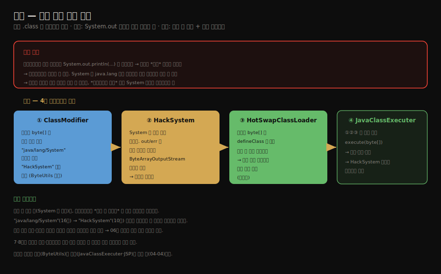
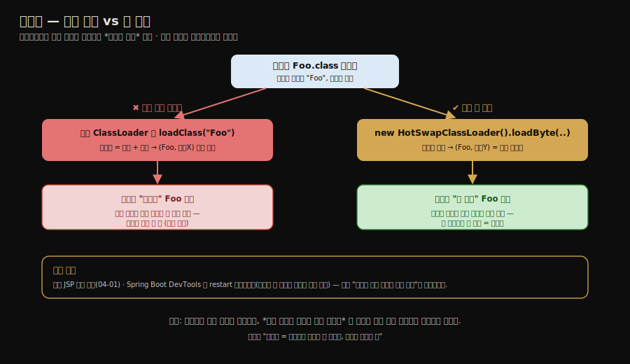
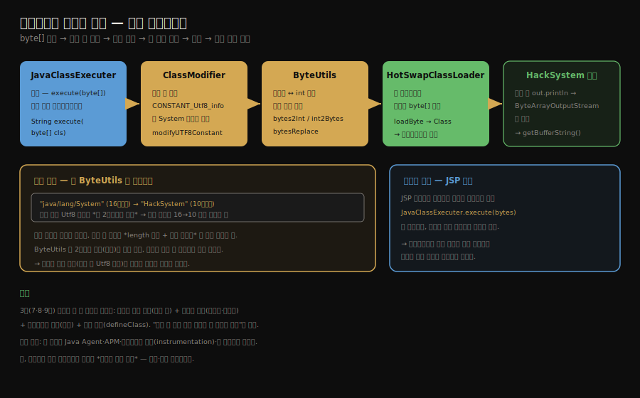

# 실전 — 원격 실행 기능 (설계부터 바이트코드 치환까지)
---
> §9.3~§9.4 전반을 한 줄로 압축하면 — **외부에서 받은 자바 클래스를 서버에서 실행하되, 그 클래스의 `System.out` 출력이 서버 콘솔로 새지 않고 호출자에게 돌아오게 하는 기능을 설계합니다.** 
>
> 핵심은 "바꿀 수 없는 것(`System`의 동작)을, 바이트코드의 *상수 풀 문자열 한 곳*을 갈아끼워 우회한다"는 발상이며, 이를 위해 `ClassModifier`·`HackSystem`·`HotSwapClassLoader`가 협력합니다.

이 글을 읽고 나면 원격 실행 기능이 풀어야 할 문제를 설명하고, `System` 참조를 `HackSystem`으로 바꾸는 상수 풀 치환의 아이디어를 말하며, `HotSwapClassLoader`가 왜 매번 새 로더를 쓰는지 그림 없이 짚을 수 있습니다.


## 진입 — 사례를 종합하는 실습

> [앞 글들](./04-02.OSGi의%20유연한%20클래스%20로더와%20바이트코드%20생성.md)의 클래스 로더·바이트코드 조작·동적 적재를 한 실습에 모읍니다. "외부 클래스를 받아 실행하고 결과를 돌려주기"가 그 무대입니다.

9.3 실전은 앞에서 배운 것을 종합합니다. 클래스 로더로 외부 바이트코드를 적재하고, 바이트코드를 조작하며, 동적으로 실행합니다. 목표는 *원격에서 보낸 자바 클래스를 서버가 실행하고 그 출력을 호출자에게 돌려주는* 기능입니다. 온라인 코드 실행기나 서버 측 스크립팅의 축소판입니다.




## 1. 목표와 풀어야 할 문제

> 외부 클래스를 실행하는 것까지는 클래스 로더로 됩니다. 문제는 그 클래스의 `System.out` 출력이 *서버* 콘솔로 새어 호출자에게 안 돌아간다는 점입니다.

목표는 단순합니다. 클라이언트가 컴파일한 `.class` 바이트를 서버에 보내면, 서버가 그것을 실행하고 *실행 결과(표준 출력)*를 클라이언트에게 돌려줍니다.

외부 클래스를 적재해 실행하는 것 자체는 클래스 로더로 됩니다. 진짜 문제는 *출력*입니다. 보내온 클래스가 `System.out.println(...)`을 호출하면, 그 출력은 *서버의* 표준 출력(콘솔)으로 나갑니다. 클라이언트는 결과를 받지 못합니다.

그렇다고 `System`을 바꿀 수도 없습니다. `System`은 `java.lang`의 핵심 클래스라, [부모 위임 모델](./04-01.톰캣의%20클래스%20로더%20아키텍처.md) 때문에 항상 부트스트랩 로더가 로딩합니다. 사용자 정의 로더로 다른 `System`을 끼워 넣을 수 없습니다. 

- 클래스 안의 `System.out` 호출 자체를 손대야 하는데, 소스는 없고 바이트만 있습니다. 그래서 *바이트코드 수준*에서 `System` 참조를 갈아끼우는 방법을 씁니다.


## 2. 아이디어 — 상수 풀의 System을 HackSystem으로

> 클래스 파일의 상수 풀에서 `"java/lang/System"` 문자열을 찾아 `"HackSystem"`으로 바꿉니다. `HackSystem`은 출력을 서버 콘솔이 아니라 버퍼로 보냅니다.

해결의 핵심은 [클래스 파일의 상수 풀](./01-01.클래스%20파일%20구조.md)에 있습니다. 바이트코드가 `System`을 참조할 때, 그 클래스 이름 `"java/lang/System"`은 상수 풀에 *문자열*로 들어 있습니다. 이 문자열 한 곳을 `"HackSystem"`으로 바꾸면, 적재된 클래스는 `System` 대신 `HackSystem`을 쓰게 됩니다.

두 가지를 분명히 해야 합니다. 첫째, 고치는 것은 *런타임에 메모리로 올라간 `Class` 객체*가 아니라 *아직 로딩되지 않은 `.class` 파일의 바이트* 그 자체입니다. 클래스가 일단 `defineClass`로 적재되고 나면 그 이름은 JVM 안에 굳어 바꿀 수 없으니, *로딩 직전*의 `byte[]`를 고쳐 치환된 상태로 적재해야 합니다. 둘째, 바이트코드 명령(`getstatic` 등)은 `"java/lang/System"`이라는 문자열을 *직접 들고 있지 않고*, 상수 풀의 *인덱스*를 가리킵니다. `System`을 여러 번 참조해도 그 인덱스가 모두 같은 상수 풀 항목 하나를 가리키므로, **그 항목의 문자열 한 곳만 바꾸면 클래스 안의 모든 `System` 참조가 한꺼번에 `HackSystem`으로 바뀝니다.** 이것이 "문자열 한 곳 치환"으로 충분한 이유입니다.

`HackSystem`은 `System`을 본뜬 대체 클래스입니다. 

- `out`·`err`을 서버 콘솔이 아니라 *`ByteArrayOutputStream` 버퍼*로 연결합니다. 
- 그러면 클래스가 `System.out.println`(실제로는 `HackSystem.out.println`)을 호출할 때 출력이 그 버퍼에 쌓이고, 실행이 끝난 뒤 버퍼의 내용을 호출자에게 돌려줄 수 있습니다.

설계에 동원되는 컴포넌트는 넷입니다.

1. `ClassModifier`는 클래스 `byte[]`의 상수 풀을 훑어 `"java/lang/System"`을 `"HackSystem"`으로 치환합니다.
2. `HackSystem`은 `System`을 대체하며, 출력을 버퍼로 모읍니다.
3. `HotSwapClassLoader`는 치환된 `byte[]`를 `defineClass`로 적재합니다.
4. `JavaClassExecuter`는 위 셋을 묶는 입구로, `execute(byte[])`로 치환·적재·실행을 수행하고 버퍼의 결과를 반환합니다.


## 3. HotSwapClassLoader — 매번 새 로더로 핫스왑

> 같은 이름의 클래스를 반복 실행하려면, 매번 새 로더 인스턴스로 적재해야 합니다. **같은 로더는 같은 이름 클래스를 한 번만 로딩하기 때문입니다.**

`HotSwapClassLoader`는 치환된 바이트를 적재하는 로더입니다. 핵심 설계는 `loadByte` 메서드를 열어 `defineClass`를 외부에서 호출할 수 있게 한 것입니다.

```java
public class HotSwapClassLoader extends ClassLoader {
    public HotSwapClassLoader() {
        super(HotSwapClassLoader.class.getClassLoader());
    }

    // protected 인 defineClass 를 외부에서 쓸 수 있게 노출
    public Class<?> loadByte(byte[] classByte) {
        return defineClass(null, classByte, 0, classByte.length);
    }
}
```

여기서 *왜 매번 새 로더 인스턴스를 만드는가*가 중요합니다. 

- [클래스 동일성 = 이름 + 로더](./04-01.톰캣의%20클래스%20로더%20아키텍처.md) 성질 때문에, *같은 로더*는 같은 이름의 클래스를 *한 번만* 로딩합니다. 
- 클라이언트가 같은 이름의 클래스를 수정해 다시 보내도, 같은 로더로는 이전에 캐시된 클래스가 그대로 쓰여 변경이 반영되지 않습니다.

그래서 실행 요청마다 *새 `HotSwapClassLoader` 인스턴스*를 만들어 적재합니다. 로더가 다르면 같은 이름이라도 다른 클래스가 되므로, 수정된 클래스가 매번 새로 실행됩니다. 이것이 핫스왑의 원리입니다 — [톰캣의 JSP 로더 교체](./04-01.톰캣의%20클래스%20로더%20아키텍처.md)와 같은 발상을 실습으로 옮긴 것입니다.



여기서 *헌 클래스는 어떻게 사라지는가*도 짚어 둘 만합니다. **JVM은 로딩된 클래스를 *개별적으로 언로드하지 못합니다*.** 

- 클래스는 그것을 정의한 로더와 운명을 함께 해, 그 로더가 더 이상 참조되지 않아 GC 대상이 될 때 비로소 함께 회수됩니다. 
- 그래서 새 로더로 갈아끼우고 옛 로더 인스턴스를 버리면, 옛 로더가 정의한 클래스도 unreachable이 되어 가비지 컬렉터가 처리합니다. 
- "클래스를 못 바꾼다"는 제약을 "로더를 통째로 버린다"로 우회하는 셈인데, 반복 핫스왑이 로더와 클래스를 계속 새로 만들어 메타스페이스 사용량을 늘리는 비용도 여기서 나옵니다.

이 설계가 동원하는 지식을 정리하면, [클래스 파일 구조](./01-01.클래스%20파일%20구조.md)의 상수 풀(치환 대상), 클래스 로더의 동일성 성질(핫스왑), `defineClass`(동적 적재)가 한 실습에 모두 모입니다. 이제 그 치환을 *바이트 단위로 어떻게 하는가*를 봅니다.


## 4. 상수 풀 Utf8 항목과 길이 보정

> 상수 풀의 Utf8 항목은 *앞 2바이트가 길이*입니다. 문자열을 16자에서 10자로 줄이면 그 길이 필드도 16→10으로 고치고, 줄어든 만큼 뒤 바이트를 당겨야 합니다.

막상 치환을 해 보면 *길이 차이*라는 함정이 있습니다. `"java/lang/System"`은 16바이트, `"HackSystem"`은 10바이트라, 단순히 문자열만 바꾸면 클래스 파일이 깨집니다.

`System`의 클래스 이름은 상수 풀에 `CONSTANT_Utf8_info` 항목으로 들어 있습니다. [클래스 파일 구조](./01-01.클래스%20파일%20구조.md)에서 본 이 항목의 포맷은 *앞 2바이트가 문자열 길이(`length`)*, 그 뒤가 실제 바이트입니다.

```
CONSTANT_Utf8_info {
    u1 tag;            // 1 (Utf8 태그)
    u2 length;         // 문자열 바이트 길이  ← 여기를 함께 고쳐야 함
    u1 bytes[length];  // 실제 UTF-8 바이트
}
```

- `"java/lang/System"`(16바이트)을 `"HackSystem"`(10바이트)으로 바꾸면, `length` 필드도 `16`에서 `10`으로 고쳐야 합니다. 
- 그리고 6바이트가 줄었으니, 그 항목 뒤의 모든 바이트를 *6바이트 앞으로 당겨* 붙여야 합니다. 단순 문자열 치환이 아니라 *길이 필드 + 실제 바이트 + 뒤따르는 데이터 이동*을 함께 처리해야 합니다.

이 바이트 조작을 `ByteUtils`가 맡습니다. 2바이트 정수(길이)를 읽고 쓰는 `bytes2Int`·`int2Bytes`, 그리고 바이트 배열의 일부를 다른 길이로 교체하는 `bytesReplace` 같은 도구를 제공합니다.

```java
public class ByteUtils {
    // 2바이트(또는 N바이트)를 정수로 — 상수 풀 length 필드 읽기
    public static int bytes2Int(byte[] b, int start, int len) {
        int sum = 0;
        for (int i = start; i < start + len; i++) {
            int n = b[i] & 0xff;          // 부호 확장 방지 — byte 는 부호 있음
            n <<= (--len) * 8;            // 상위 바이트일수록 더 왼쪽으로 시프트
            sum = n + sum;
        }
        return sum;
    }

    // 정수를 N바이트로 — 새 length 필드 쓰기
    public static byte[] int2Bytes(int value, int len) {
        byte[] b = new byte[len];
        for (int i = 0; i < len; i++) {
            // 하위 바이트부터 끝에서 채움
            b[len - 1 - i] = (byte) ((value >> (8 * i)) & 0xff);
        }
        return b;
    }
}
```

- `n & 0xff`로 부호 확장을 막는 것이 핵심입니다. 자바 `byte`는 부호가 있어, `0x80` 이상의 바이트를 `int`로 올리면 음수로 확장됩니다. `& 0xff`로 하위 8비트만 남겨 부호 없는 값으로 다룹니다.


## 5. JavaClassExecuter — 전체를 묶는 입구

> `JavaClassExecuter`가 치환·적재·실행을 한 메서드로 묶습니다. 외부 바이트를 받아 `HackSystem`으로 치환하고, 새 로더로 적재해 리플렉션으로 실행한 뒤 버퍼의 결과를 반환합니다.

`JavaClassExecuter`는 앞에서 만든 컴포넌트를 묶는 입구입니다.

```java
public class JavaClassExecuter {
    public static String execute(byte[] classByte) {
        // 1. HackSystem 버퍼 초기화
        HackSystem.clearBuffer();
      
        // 2. 상수 풀의 System 을 HackSystem 으로 치환
        ClassModifier cm = new ClassModifier(classByte);
        byte[] modiBytes = cm.modifyUTF8Constant("java/lang/System", "HackSystem");
      
        // 3. 새 HotSwapClassLoader 인스턴스로 적재 (핫스왑 — §3 참조)
        HotSwapClassLoader loader = new HotSwapClassLoader();
        Class<?> clazz = loader.loadByte(modiBytes);
      
        try {
            // 4. 리플렉션으로 main(String[]) 실행
            Method method = clazz.getMethod("main", new Class[]{String[].class});
            method.invoke(null, new String[]{null});
        } catch (Throwable e) {
            e.printStackTrace(HackSystem.out);   // 예외도 버퍼로
        }
        // 5. HackSystem 버퍼에 쌓인 출력을 문자열로 반환
        return HackSystem.getBufferString();
    }
}
```

흐름은 다섯 단계입니다. 실행 중 클래스가 호출하는 `System.out`은 치환 덕에 `HackSystem.out`이 되어 버퍼에 쌓이고, 그 내용이 호출자에게 돌아갑니다.

1. 버퍼를 비움
2. 상수 풀을 치환
3. 새 로더로 적재
4. 리플렉션으로 `main`을 실행
5. 버퍼의 결과를 반환합니다

마지막으로 JSP 페이지가 이 입구를 호출하면 웹에서 코드를 실행할 수 있습니다. 브라우저에서 클래스 바이트를 업로드하면 `JavaClassExecuter.execute(bytes)`가 실행해 결과 문자열을 화면에 출력합니다. 온라인 코드 실행기가 완성됩니다.




## 6. 종합 — 3부 전체가 이 실습에 모인다

> 이 한 실습에 클래스 파일 구조·클래스 로더·바이트코드 조작·동적 적재가 모두 동원됩니다. "바꿀 수 없는 것을 바이트 한 곳으로 우회한다"가 관통하는 발상입니다.

이 원격 실행 실습 하나에 7·8·9장이 모두 모입니다.

1. [클래스 파일 구조](./01-01.클래스%20파일%20구조.md)의 상수 풀 — 치환의 대상이자 길이 보정의 근거.
2. [클래스 로더](./04-01.톰캣의%20클래스%20로더%20아키텍처.md)의 동일성과 핫스왑 — 매번 새 로더로 반복 실행.
3. 바이트코드 조작 — `System`을 `HackSystem`으로 갈아끼우는 치환.
4. 동적 적재(`defineClass`) — 만든 바이트를 실행 가능한 클래스로.

관통하는 발상은 *"바꿀 수 없는 것을 바이트 한 곳으로 우회한다"*입니다. `System`의 동작은 못 바꾸지만, 클래스가 그것을 참조하는 *상수 풀 문자열*은 바꿀 수 있습니다.

실무로 이어 보면, 이 발상이 Java Agent·APM(Application Performance Monitoring)·바이트코드 계측(instrumentation)·핫 리로드의 토대입니다. 실행 중인 클래스의 바이트코드를 가로채 변형하는 기술이 모두 같은 뿌리에서 나옵니다. 다만 운영 환경에서 임의 바이트코드를 받아 실행하는 것은 *심각한 보안 위험*이므로, 이 실습은 학습·격리 환경에서만 다뤄야 합니다.

이 "로더를 갈아끼워 핫스왑"과 "바이트코드를 가로채 변형"을 실제 도구로 옮긴 것이 DCEVM·HotswapAgent·JRebel·Java Agent입니다. 다만 도구마다 *바꿀 수 있는 범위*에 한계가 있어, JVM 기본 HotSwap은 메서드 바디만, 그 위 도구들도 클래스 상속 구조 변경 같은 곳에서는 막힙니다. 도구별 원리와 한계는 [다음 글](./04-04.동적%20로딩과%20핫스왑%20도구.md)에서 따로 봅니다.


## 7. Spring 관점 — 이 기법은 Spring Boot 어디에 살아있나

> 순수 자바로 클래스 로더를 손으로 만드는 일은 실무에서 드뭅니다. 그러나 *이 글의 핵심 발상*은 Spring Boot 안에 그대로 살아 있습니다. 두 가지를 봅니다.

### DevTools의 자동 재시작 — "매번 새 로더" 핫스왑.

개발 중 코드를 고치면 앱 전체를 껐다 켜지 않고도 변경이 반영되는 그 기능입니다. Spring Boot 공식 문서에 따르면 DevTools는 *두 개의 클래스 로더*를 씁니다

- 바뀌지 않는 서드파티 클래스를 담는 *base 로더*와, 내가 개발 중인 클래스를 담는 *restart 로더*입니다. 
- 그리고 재시작 시 *restart 로더를 버리고 새로 만듭니다*. 이것이 §3에서 본 `HotSwapClassLoader`를 매번 새로 만드는 것과 *정확히 같은 발상*입니다 — "클래스 동일성 = 이름 + 로더"라, 로더를 새로 만들면 같은 이름의 클래스도 새 버전으로 다시 로딩됩니다. 
- 콜드 스타트보다 빠른 까닭은 변경 없는 의존성(base 로더)은 그대로 두고 *바뀐 부분(restart 로더)만* 갈아끼우기 때문입니다.

변하지 않는 의존성은 base 로더가 들고 있어 다시 로딩하지 않고, 자주 바뀌는 내 코드만 restart 로더에 둬 통째로 교체합니다. 04-01의 톰캣 구조에서 "공유는 위 계층, 격리·교체는 아래 계층"으로 나눈 것과 같은 분리입니다.

### Spring의 바이트코드 조작 — 상수 풀 치환의 친척.

§2에서 클래스 `byte[]`의 상수 풀을 고쳐 동작을 바꿨듯, Spring도 *런타임에 바이트코드를 생성·조작*해 기능을 끼워 넣습니다. 대표가 CGLIB 기반 프록시입니다. `@Transactional`이나 `@Cacheable`을 붙인 빈은, Spring이 그 클래스를 상속한 *프록시 클래스를 런타임에 생성*해 메서드 호출 앞뒤에 트랜잭션·캐시 로직을 끼웁니다. `@Configuration` 클래스도 CGLIB로 향상되어 `@Bean` 메서드가 싱글톤을 반환하도록 바뀝니다. 우리가 소스 없이 `byte[]`만으로 동작을 바꾼 것과 결이 같습니다 — *컴파일된 클래스에 손대 행동을 주입*하는 것입니다.

정리하면 이 글의 세 기법은 Spring에서 이렇게 나타납니다. 핫스왑(매번 새 로더)은 *DevTools 자동 재시작*으로, 바이트코드 조작(상수 풀 치환)은 *CGLIB 프록시·`@Configuration` 향상*으로 살아 있습니다. JVM의 클래스 로딩·바이트코드 원리를 알면, Spring이 알아서 해 주는 것처럼 보이던 일들이 사실 이 원리의 응용임이 드러납니다.


## 8. 면접 대비 요약

> 핵심은 "바꿀 수 없는 System을 상수 풀 치환으로 우회", "HackSystem이 출력을 버퍼로", "매번 새 로더로 핫스왑", "Utf8 길이 필드까지 보정"입니다.

### 한 줄 정의

원격 실행 기능이란 외부에서 받은 클래스 바이트코드의 상수 풀에서 `System` 참조를 `HackSystem`으로 치환해, 그 출력을 서버 콘솔이 아니라 버퍼로 가로채 호출자에게 돌려주는 실습을 말합니다.

### 핵심 포인트 3가지

1. `System`은 핵심 클래스라 부모 위임으로 바꿀 수 없으므로, 클래스의 상수 풀에서 `"java/lang/System"` 문자열을 `"HackSystem"`으로 치환합니다.
2. `HackSystem`은 출력을 서버 콘솔이 아니라 `ByteArrayOutputStream` 버퍼로 보내, 실행 결과를 가로채 호출자에게 돌려줍니다.
3. `HotSwapClassLoader`는 실행마다 새 인스턴스로 적재해, 같은 이름의 수정된 클래스를 반복 실행(핫스왑)할 수 있게 합니다.
4. 상수 풀 Utf8 항목은 앞 2바이트가 길이라, 문자열을 줄이면(16→10) 길이 필드도 고치고 뒤 바이트를 당겨야 합니다. `ByteUtils`가 `& 0xff`로 부호 확장을 막으며 이 보정을 처리합니다.
5. `JavaClassExecuter`가 버퍼 초기화·치환·새 로더 적재·리플렉션 실행·버퍼 반환을 한 메서드로 묶으며, 이 발상이 Java Agent·바이트코드 계측의 토대입니다.

### 면접에서 받을 만한 질문

1. 외부 클래스의 `System.out` 출력을 왜 그대로 둘 수 없습니까?
2. `System`을 사용자 정의 로더로 바꿀 수 없는 이유는 무엇입니까?
3. 같은 이름의 클래스를 반복 실행하려면 왜 매번 새 로더가 필요합니까?
4. 상수 풀 문자열을 줄일 때 왜 길이 필드를 함께 고쳐야 하며, `& 0xff`는 왜 필요합니까?
5. 이 바이트코드 조작 기술이 실무의 어디에 쓰입니까?

> 다섯 질문에 *먼저 자답한 뒤* 아래 §정답으로 내려갑니다.


## 정답 (자답 후 펼치기)

> 위 §면접에서 받을 만한 질문의 3개에 *먼저 자답한 뒤* 아래를 읽으세요.

### 정답 1 — System.out 출력의 문제

보내온 클래스가 `System.out.println`을 호출하면 출력이 *서버의* 표준 출력(콘솔)으로 나가기 때문입니다. 원격 실행의 목표는 결과를 *클라이언트에게* 돌려주는 것인데, 출력이 서버 콘솔로 새면 호출자는 결과를 받지 못합니다. 그래서 출력을 가로채 버퍼에 모아야 합니다.

### 정답 2 — System을 바꿀 수 없는 이유

`System`은 `java.lang`의 핵심 클래스라, 부모 위임 모델 때문에 항상 부트스트랩 로더가 로딩합니다. 사용자 정의 로더로 다른 `System`을 끼워 넣으려 해도 위임이 부트스트랩까지 올라가 원본 `System`이 로딩됩니다. 그래서 클래스를 바꾸는 대신, 클래스 *안의 참조 문자열*을 바이트코드 수준에서 갈아끼웁니다.

### 정답 3 — 매번 새 로더가 필요한 이유

같은 로더는 같은 이름의 클래스를 *한 번만* 로딩하기 때문입니다. "클래스 동일성 = 이름 + 로더" 성질상, 같은 로더로는 이전에 캐시된 클래스가 그대로 쓰여 수정이 반영되지 않습니다. 실행마다 새 `HotSwapClassLoader` 인스턴스를 쓰면 로더가 달라 같은 이름이라도 다른 클래스가 되므로, 수정된 클래스가 매번 새로 실행됩니다.

### 정답 4 — 길이 보정과 & 0xff

상수 풀의 `CONSTANT_Utf8_info`는 앞 2바이트가 문자열 길이(`length`)이고 그 뒤가 실제 바이트입니다. `"java/lang/System"`(16바이트)을 `"HackSystem"`(10바이트)으로 바꾸면 `length`도 16→10으로 고치고, 6바이트 줄어든 만큼 뒤 바이트를 앞으로 당겨야 합니다. 길이 필드를 안 고치면 JVM이 항목 경계를 잘못 읽어 클래스 파일이 깨집니다. `& 0xff`는 자바 `byte`가 부호 있어 `0x80` 이상이 `int`로 음수 확장되는 것을 막아, 길이 수치를 올바르게 계산하기 위함입니다.

### 정답 5 — 실무 활용처

Java Agent·APM·바이트코드 계측(instrumentation)·핫 리로드입니다. 실행 중인 클래스의 바이트코드를 가로채 변형하는 기술이 모두 이 발상에서 나옵니다. 다만 임의 바이트코드를 받아 실행하는 것은 심각한 보안 위험이라, 운영이 아닌 학습·격리 환경에서만 다뤄야 합니다.


## 핵심 개념 체크리스트

- [ ] 원격 실행 기능이 풀어야 할 핵심 문제(출력 가로채기)를 말할 수 있는가?
- [ ] `System`을 부모 위임 때문에 바꿀 수 없는 이유를 아는가?
- [ ] 상수 풀의 문자열을 치환해 우회하는 아이디어를 설명할 수 있는가?
- [ ] `HotSwapClassLoader`가 `defineClass`를 노출하는 이유를 아는가?
- [ ] 매번 새 로더 인스턴스로 핫스왑하는 원리를 아는가?
- [ ] Utf8 항목의 길이 필드 보정과 `& 0xff`가 왜 필요한지 아는가?
- [ ] `JavaClassExecuter`의 다섯 단계 흐름과 이 기술이 Java Agent의 토대임을 아는가?


## 관련 문서

> 이 글은 설계(상수 풀 치환 아이디어)부터 구현(바이트 조작·실행)까지 한 편에 모았습니다. 여기서 본 핫스왑·바이트코드 조작이 실무 도구로 어떻게 나타나는지는 다음 두 글이 이어받습니다.

- [04-04. 동적 로딩과 핫스왑 도구](./04-04.동적%20로딩과%20핫스왑%20도구.md) — DCEVM·HotswapAgent·JRebel·Java Agent의 원리와 한계
- [04-02. OSGi의 유연한 클래스 로더와 바이트코드 생성](./04-02.OSGi의%20유연한%20클래스%20로더와%20바이트코드%20생성.md) § "바이트코드 생성 기술" — 런타임 바이트 조작의 배경
- [클래스 파일 구조](./01-01.클래스%20파일%20구조.md) § "상수 풀" — 치환 대상이 되는 상수 풀 구조
