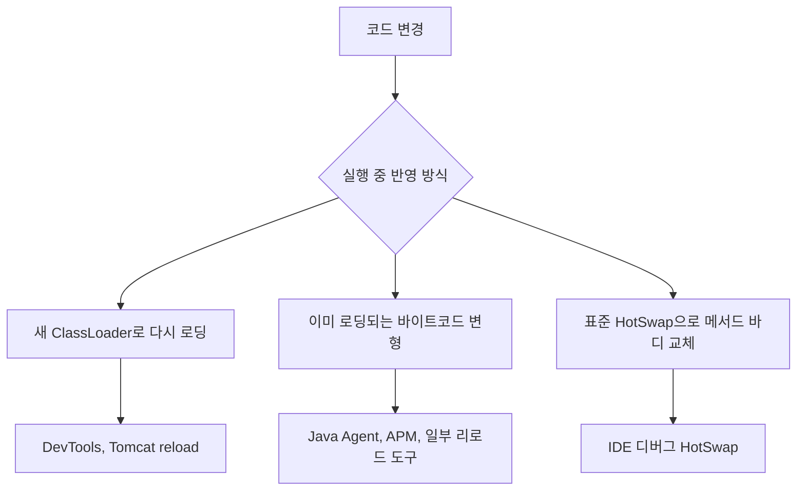
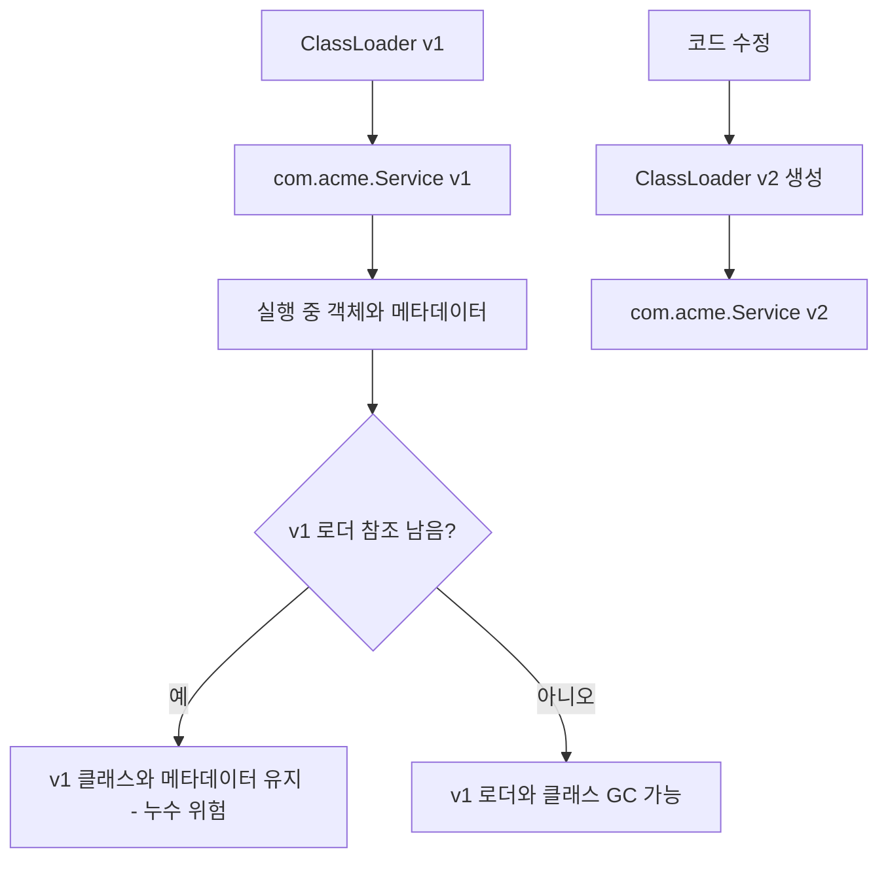
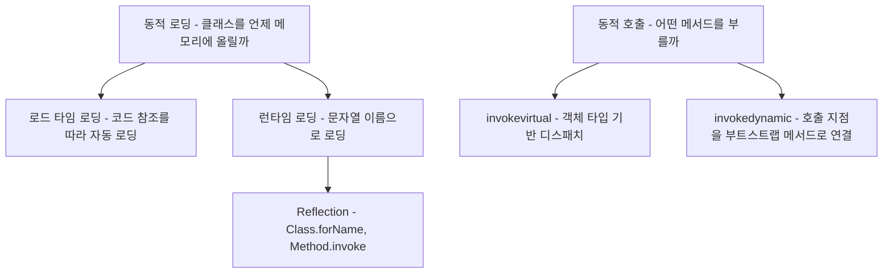
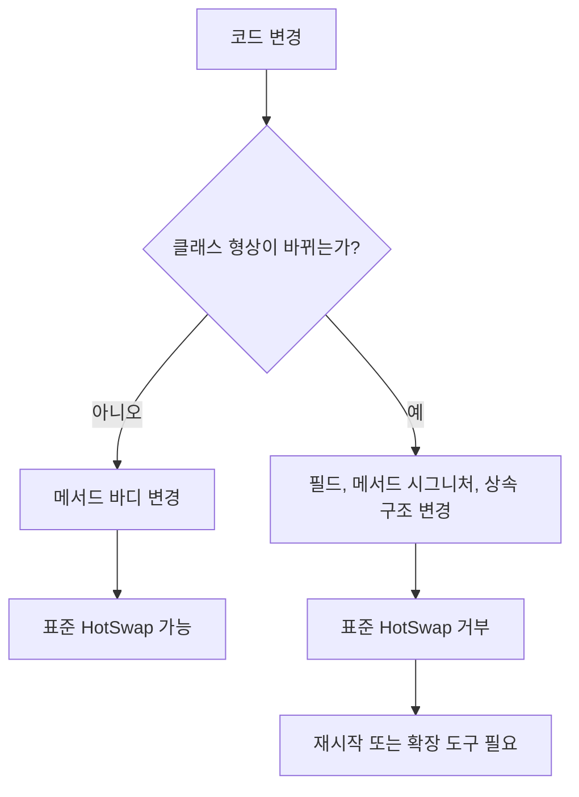
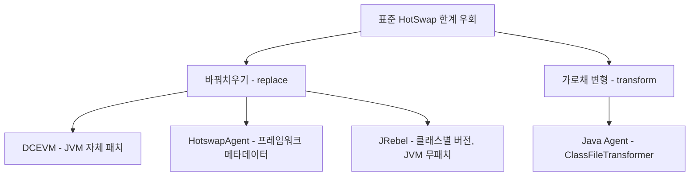
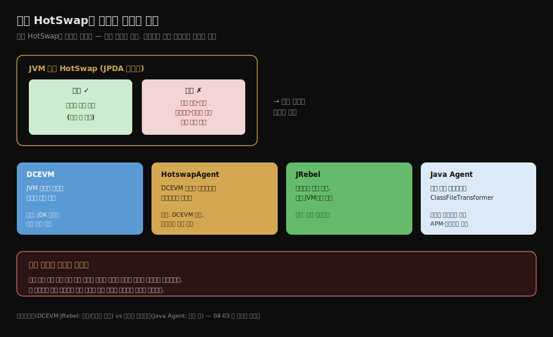
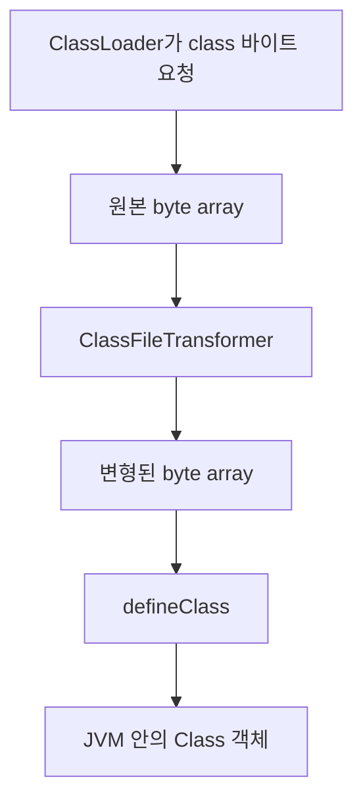
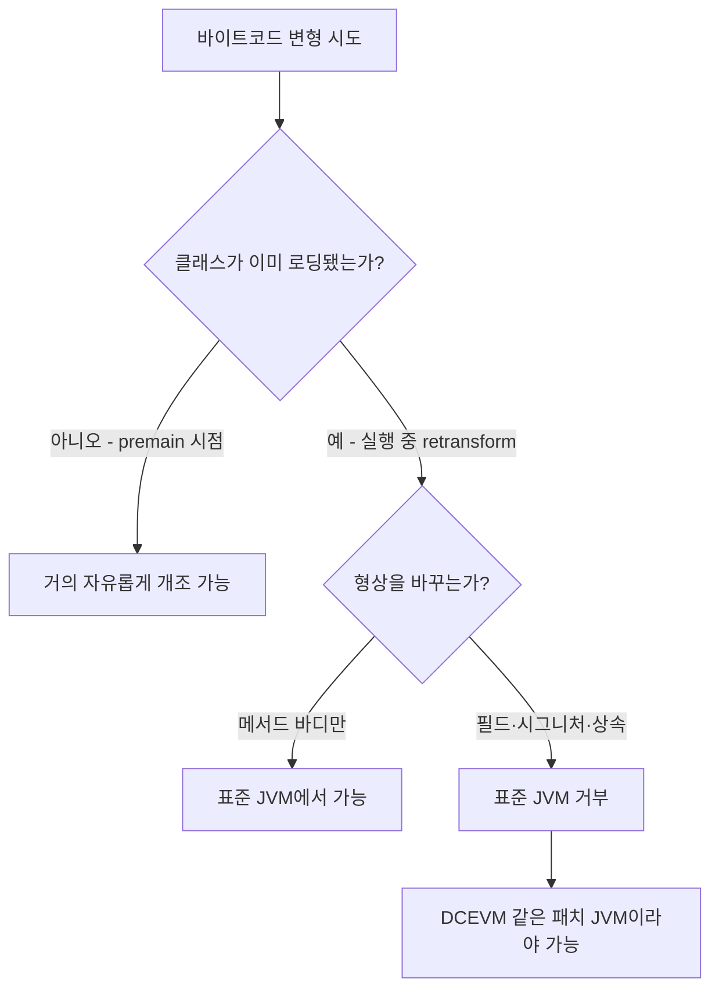
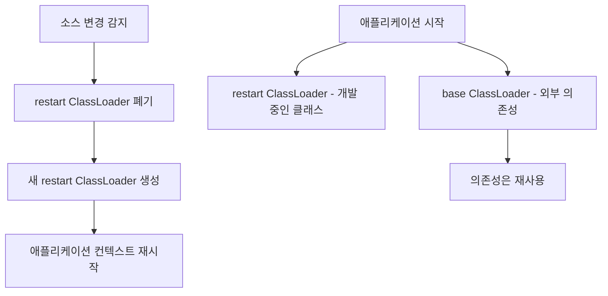

# 동적 로딩과 핫스왑 도구 — DCEVM·HotswapAgent·JRebel·Java Agent
---
> 이 글을 한 줄로 압축하면 — **실행 중인 클래스를 바꿔치우는 일은 "클래스를 직접 못 바꾸니 로더를 갈아끼우거나 로딩 단계에서 바이트코드를 가로채 변형한다"는 두 발상으로 귀결됩니다. DCEVM·HotswapAgent·JRebel·Java Agent는 그 발상을 도구로 옮긴 것입니다.**
>
> 핵심은 두 가지입니다. 
>
> 1. JVM 기본 HotSwap은 *메서드 바디만* 교체할 수 있다는 제약
> 2. 제약을 도구마다 다른 방식으로 우회하되 *클래스 상속 구조 변경 같은 곳에서는 여전히 막힌다*는 한계입니다.

이 글을 읽고 나면 동적 로딩이 리플렉션이나 `invokedynamic`만을 위한 개념이 아니라는 점을 구분합니다. 

표준 HotSwap이 무엇까지 바꿀 수 있고 무엇을 막는지 말하고 DCEVM·HotswapAgent·JRebel이 그 한계를 각각 어떻게 푸는지 설명하며 Java Agent가 부모 위임 문제를 로딩 단계 변형으로 우회하는 원리를 짚을 수 있습니다.

## 1. 진입 — 껐다 켜지 않고 바꾸기

> [앞 글의 원격 실행 실습](./04-03.실전%20—%20원격%20실행%20기능%20설계.md)은 "매번 새 로더로 핫스왑"과 "바이트코드 치환"을 손으로 구현했습니다. 그 발상을 실무 도구로 옮긴 것이 이 글의 주제입니다.

개발 중 코드를 한 줄 고치면 앱을 껐다 켜지 않고도 바뀐 동작이 반영되는 경험은 익숙합니다. 그 편의가 어떻게 가능한지는 결국 클래스 로딩 메커니즘으로 돌아옵니다. 실행 중인 JVM 안의 클래스를 어떻게 새 버전으로 바꿔치우느냐가 문제입니다. 답은 [04-03](./04-03.실전%20—%20원격%20실행%20기능%20설계.md)에서 본 두 발상에서 나옵니다.

1. 첫째는 ***로더를 갈아끼우는*** 길입니다. 클래스는 직접 못 바꿉니다. 하지만 [클래스 동일성이 이름 + 로더](./02-04.클래스%20로더와%20부모%20위임%20모델.md)이므로, 로더를 새로 만들면 같은 이름의 클래스가 새 버전으로 다시 로딩됩니다.
2. 둘째는 ***로딩 단계에서 바이트코드를 가로채 변형하는*** 길입니다. 04-03의 상수 풀 치환을 일반화한 것으로, Java Agent가 이 길을 표준화합니다. 이 글의 도구들은 두 길 중 하나 또는 둘을 함께 씁니다.

전체 흐름은 다음처럼 잡으면 됩니다.

이 그림에서 리플렉션은 주로 C 경로에서 이름으로 클래스를 찾는 API입니다. 

- `invokedynamic`은 호출 대상을 런타임에 연결하는 바이트코드 명령이라, 동적 로딩 자체와 목적이 다릅니다.
- 둘 다 런타임 결정을 다룹니다. 다만 동적 로딩은 *클래스를 메모리에 들이는 문제*이고 `invokedynamic`은 *이미 실행 중인 호출 지점을 어떤 메서드 핸들에 묶을지 정하는 문제*입니다.

## 2. 클래스는 개별 언로드되지 않는다 — 로더 단위 회수

> 실행 중인 클래스를 바꾸기 어려운 근본 이유는 *클래스를 개별적으로 언로드할 수 없기 때문*입니다. 클래스는 그것을 정의한 로더와 함께 회수됩니다.

[04-03 §3](./04-03.실전%20—%20원격%20실행%20기능%20설계.md)에서 본 성질을 다시 짚습니다. JVM은 한 번 로딩한 클래스를 *개별적으로 언로드하지 못합니다*. 클래스는 그것을 정의한 클래스 로더와 운명을 함께 해, 그 로더가 더 이상 참조되지 않아 가비지 컬렉션 대상이 될 때 비로소 함께 회수됩니다.

이 제약이 "매번 새 로더" 패턴을 강제합니다. 

- 같은 로더로는 같은 이름의 클래스를 한 번만 로딩합니다. 그래서 수정된 클래스를 반영하려면 옛 로더를 통째로 버리고 새 로더로 다시 로딩해야 합니다.
- 톰캣이 웹앱을 리로드할 때 `WebappClassLoader`를 새로 만듭니다. [04-03의 `HotSwapClassLoader`](./04-03.실전%20—%20원격%20실행%20기능%20설계.md)가 실행마다 새 인스턴스를 쓰는 것도 같은 이유입니다.

대가도 분명합니다. 로더와 클래스를 계속 새로 만들면 옛것이 GC될 때까지 메타스페이스 사용량이 늘어납니다. 옛 로더를 붙잡고 있는 참조가 남으면 회수되지 않아 *클래스 로더 누수*가 생깁니다. 리로드를 반복하는 개발 환경에서 메모리가 슬금슬금 차오르는 까닭이 여기 있습니다.

로더 단위 회수는 다음 흐름으로 보면 됩니다.

- 핫 리로드를 이해할 때 핵심 질문은 "새 클래스가 로딩됐는가"만이 아닙니다. "옛 로더가 정말 끊겼는가"까지 봐야 합니다. 이 질문이 빠지면 리로드는 성공한 것처럼 보여도 메타스페이스가 계속 늘 수 있습니다.

여기서 인과를 거꾸로 잡기 쉽습니다. *새 버전을 메모리에 들이는 일*과 *옛 버전을 회수하는 일*은 별개입니다. 새 로더를 만들어 같은 이름을 다시 로딩하면 새 버전은 옛 로더가 GC되기 전에도 곧바로 올라옵니다. 옛 로더가 GC되어야 하는 까닭은 "갈아끼우기"가 안 되기 때문이 아니라, 끊지 못한 옛 로더가 메타스페이스에 그대로 남아 위 그림의 누수 경로(H)로 빠지기 때문입니다. 즉 로딩은 즉시 되고, 회수만 옛 로더의 참조가 끊길 때까지 미뤄집니다.

## 3. 로딩이 시작되는 두 시점 — 로드 타임과 런타임

> 클래스 로딩은 *참조를 따라 자동으로*(로드 타임) 또는 *이름을 문자열로 받아*(런타임) 시작됩니다. **핫스왑 도구는 이 로딩 시점을 가로채거나 새 로더로 다시 트리거합니다.**

도구들이 무엇을 가로채는지 보려면 로딩이 *언제* 시작되는지부터 갈라야 합니다. [02-04](./02-04.클래스%20로더와%20부모%20위임%20모델.md)에서 본 구분을 가져오면 두 갈래입니다.

- ***로드 타임 동적 로딩*은 어떤 클래스가 참조하는 클래스를 따라 자동으로 로딩하는 경우입니다.** `Hello`를 로딩하면 그 안에서 쓰는 `Object`·`System`이 함께 로딩됩니다. 코드에 이름이 박혀 있어 의존이 컴파일 시점에 드러납니다.
- ***런타임 동적 로딩*은 실행 중에 이름을 문자열로 받아 로딩하는 경우입니다.** `Class.forName("...")`이 대표인데, 반환값은 인스턴스가 아니라 메타데이터를 담은 `Class` 객체이고 실제 객체는 `newInstance()`로 따로 만듭니다.

핫스왑은 이 두 시점 모두에 손댑니다. 로더를 갈아끼우는 길은 *런타임 로딩을 새 로더로 다시 트리거*해 새 버전을 들입니다. 바이트코드를 가로채는 길은 *로드 타임에 바이트가 메모리로 들어오는 순간*을 잡아 변형합니다. 다음 절들이 이 둘을 도구별로 풉니다.

세 개념의 위치를 나눠 보면 오해가 줄어듭니다.

- 리플렉션은 런타임 로딩과 자주 함께 쓰입니다. 예를 들어 설정 파일에 적힌 클래스 이름을 `Class.forName()`으로 로딩합니다. 그런 다음 생성자나 메서드를 리플렉션으로 호출할 수 있습니다. 
- 반면 `invokedynamic`은 클래스를 새로 찾는 API가 아니라 호출 지점(CallSite)을 런타임에 연결하는 명령입니다. 람다, 문자열 결합, 동적 언어 구현에서 쓰입니다. 클래스 로딩과 맞물릴 수는 있어도 같은 개념은 아닙니다.

## 4. 표준 HotSwap의 한계 — 메서드 바디만

> **JVM이 기본 제공하는 HotSwap(디버거의 코드 교체)은 *메서드 바디*만 바꿀 수 있습니다.** 필드 추가·메서드 시그니처 변경·상속 구조 변경은 막힙니다.

JVM은 디버깅을 위해 *표준 HotSwap*을 제공합니다. JPDA(Java Platform Debugger Architecture) 위에서 동작합니다. 디버거에 붙은 채로 메서드 안의 코드를 고치면 그 변경이 실행 중인 클래스에 반영됩니다. IDE에서 디버그 모드로 돌리다 메서드 본문을 수정하면 재시작 없이 적용되는 그 기능입니다.

문제는 바꿀 수 있는 범위가 좁다는 점입니다. 표준 HotSwap이 허용하는 것은 *메서드 바디 교체*까지입니다. 다음과 같은 변경은 막힙니다.

- **필드 추가·삭제** (객체 메모리 레이아웃이 바뀌므로)
- **메서드 시그니처 변경, 메서드 추가·삭제**
- **클래스의 상속 구조 변경** (`extends`·`implements` 대상 변경)

이 변경들은 이미 로딩된 클래스의 *형상*을 바꿔, 그 클래스로 만든 기존 객체나 다른 클래스의 참조와 어긋나게 만듭니다. JVM은 안전을 위해 형상이 바뀌는 교체를 거부하고 메서드 바디처럼 형상에 영향 없는 변경만 허용합니다. 그래서 필드 하나만 추가해도 IDE가 "핫스왑 실패, 재시작 필요"를 띄우는 것입니다.

허용 범위는 다음처럼 갈립니다.

- 여기서 형상은 "이 클래스의 객체가 어떤 필드를 갖는가", "어떤 메서드 표면을 노출하는가", "어떤 부모 타입으로 취급되는가"를 뜻합니다. 
- 메서드 안의 계산식만 바꾸면 기존 객체의 모양은 그대로입니다. 필드를 추가하면 이미 만들어진 객체의 메모리 배치가 달라져야 하므로 JVM이 막습니다.

## 5. 도구별 우회 — DCEVM·HotswapAgent·JRebel·Java Agent

> 표준 HotSwap의 좁은 범위를 도구마다 다르게 넓힙니다. JVM 자체를 패치하거나(DCEVM), 그 위에서 프레임워크를 리로드하거나(HotswapAgent), 클래스별 버전을 따로 관리하거나(JRebel), 로딩 단계에서 바이트코드를 변형합니다(Java Agent).

표준 HotSwap의 한계를 넘으려는 도구들은 접근이 다릅니다. 각각의 원리와 한계를 봅니다.

- *DCEVM(Dynamic Code Evolution VM)*은 HotSpot JVM 자체를 패치해 핫스왑 범위를 넓힙니다. 
  - 표준 HotSwap이 거부하던 필드 추가·메서드 추가까지 실행 중에 반영되게 만든 변형 JVM입니다. JVM 내부를 고치는 방식이라 강력합니다. 
  - 다만 특정 JDK 버전에 맞춘 패치라 JDK를 올릴 때마다 호환 빌드가 필요합니다.

- *HotswapAgent*는 DCEVM 위에서 프레임워크 수준 리로드를 더합니다. 
  - DCEVM이 클래스 자체를 바꿔도, Spring 빈 정의나 Hibernate 매핑처럼 *프레임워크가 클래스를 기반으로 만든 메타데이터*는 자동으로 갱신되지 않습니다. 
  - HotswapAgent는 플러그인으로 그 프레임워크 캐시를 다시 짓게 해, 클래스 변경이 빈·매핑까지 흘러가게 합니다.

- *JRebel*은 상용 도구로, 클래스마다 여러 버전을 관리하는 자체 메커니즘을 씁니다. 
  - 클래스 로더를 통째로 새로 만드는 대신 클래스 단위로 새 버전을 끼웁니다. 그래서 애플리케이션 상태를 잃지 않고 변경을 반영합니다. 
  - 표준 HotSwap·DCEVM과 달리 별도 JVM 패치 없이 일반 JVM에서 동작합니다. 주요 프레임워크 연동이 폭넓다는 것이 강점이며 라이선스 비용이 대가입니다.

- *Java Agent*는 앞 셋과 결이 다릅니다. 
  - 클래스가 *로딩되는 순간*에 끼어들어 바이트코드를 변형하는 표준 기능입니다. 
  - `premain`(JVM 시동 시점)이나 `agentmain`(실행 중 attach)으로 진입해, `java.lang.instrument`의 `ClassFileTransformer`로 모든 클래스의 `byte[]`를 정의 직전에 가로채 바꿉니다.

여기서 [02-04의 부모 위임 문제](./02-04.클래스%20로더와%20부모%20위임%20모델.md)를 우회하는 각도가 드러납니다. 어떤 로더가 어떤 클래스를 로딩하든 바이트가 클래스로 정의되기 *직전*을 잡으므로 위임 계층과 무관하게 변형이 적용됩니다. 04-03이 상수 풀을 손으로 치환한 것을 *로딩 파이프라인의 표준 훅*으로 끌어올린 셈입니다. APM·트레이싱·핫 리로드 도구가 모두 이 위에 섭니다.

핵심 항목을 한 표로 정리하면 다음과 같습니다.

| 도구 | 원리 | 한계 |
|------|------|------|
| 표준 HotSwap | JPDA 디버거가 메서드 바디 교체 | 메서드 바디만, 형상 변경 불가 |
| DCEVM | HotSpot JVM 패치로 핫스왑 범위 확장 | JDK 버전별 패치 빌드 필요, 상속 구조 변경 등은 여전히 제약 |
| HotswapAgent | DCEVM 위에서 프레임워크 메타데이터 리로드 | DCEVM 의존, 플러그인 있는 프레임워크만 |
| JRebel | 클래스별 버전 관리, 일반 JVM에서 동작 | 상용 라이선스 |
| Java Agent | 로딩 시 `ClassFileTransformer`로 바이트코드 변형 | 변형 로직을 직접 짜야 함, 디버깅 난도 |

표가 보여 주듯 *어느 도구도 만능은 아닙니다*. 클래스 상속 구조를 바꾸는 변경처럼 깊은 형상 변화는 대부분의 도구가 여전히 막거나 재시작을 요구합니다. 핫 리로드는 개발 생산성을 위한 것이지 운영 배포를 대체하는 기술이 아니라는 점을 도구의 한계가 말해 줍니다.

네 도구를 외우기보다 **두 부류로 가르는 축** 하나를 잡으면 구조가 단순해집니다. §1의 두 발상(로더 갈아끼우기·바이트코드 가로채기)이 그대로 이 축입니다. DCEVM·HotswapAgent·JRebel은 클래스나 JVM, 버전을 *갈아치우는* **바꿔치우기(replace)** 쪽이고, Java Agent만 로딩 직전 바이트를 *가로채 변형하는* **가로채 변형(transform)** 쪽입니다. 같은 replace 안에서도 건드리는 층위가 갈립니다. DCEVM은 JVM 자체를, HotswapAgent는 그 위 프레임워크 메타데이터를, JRebel은 JVM을 건드리지 않고 클래스별 버전을 다룹니다.

Java Agent가 끼어드는 위치는 별도로 보면 더 선명합니다.

부모 위임은 "어느 로더가 최종적으로 클래스를 찾는가"를 정합니다. Java Agent는 그다음 단계인 `defineClass` 직전의 바이트 배열을 변형합니다. 그래서 부모 로더가 찾은 클래스든 자식 로더가 찾은 클래스든, 변형 훅에 걸리면 같은 방식으로 바꿀 수 있습니다.

오해하기 쉬운 지점은 Java Agent가 위임의 결정을 *빼앗는다*고 보는 것입니다. 그렇지 않습니다. "누가 클래스를 찾는가"는 여전히 부모 위임이 정하고, Java Agent는 거기에 관여하지 않습니다. 다만 어느 로더가 찾아왔든 그 바이트는 결국 `defineClass` 직전이라는 **하나의 공통 통과 지점**을 반드시 지나갑니다. Java Agent는 그 길목에 서서, 출처와 무관하게 지나가는 바이트를 손볼 뿐입니다. 창고를 정하는 일(위임)과 출고 직전 검수대(변형 훅)가 다른 단계인 것과 같습니다 — 검수대는 물건이 어느 창고에서 왔는지 정하지 않지만, 모든 물건이 반드시 거치므로 전부 손댈 수 있습니다.

## 6. 실행 중 바이트코드를 100% 갈아치울 수 있는가

> `ClassFileTransformer`는 `byte[]`를 받아 `byte[]`를 돌려줍니다. 이론상 완전히 다른 바이트로 바꿀 수 있지만, *이미 살아 있는 객체*와의 정합성 때문에 두 개의 벽이 남습니다.

바이트코드를 가로채 변형할 수 있다면, 클래스를 *전혀 다른 것으로* 개조하는 일도 가능한지 궁금해집니다. Java Agent가 `byte[]`를 통째로 다루므로 기술적으로는 메서드 본문을 새로 쓰거나 진입·종료에 코드를 주입하는 일(APM이 응답 시간을 재는 방식)이 됩니다. 그러나 "어디까지 자유로운가"는 *언제* 변형하느냐로 갈립니다.

- 클래스가 *아직 로딩되기 전*(`premain` 시동 시점, 처음 `defineClass` 되기 전)이라면 거의 자유롭습니다. 그 클래스로 만든 객체가 아직 없으니 어긋날 대상도 없습니다.
- *이미 로딩되어 객체가 떠 있는* 클래스를 실행 중에 다시 정의(retransform)하면, §4의 형상 벽이 그대로 돌아옵니다. 메서드 바디는 바꿔도 필드 추가·시그니처 변경·상속 구조 변경은 표준 JVM이 거부합니다. 이미 힙에 뜬 객체의 메모리 레이아웃이 깨지기 때문입니다.

정리하면 "바이트는 뭐든 만들 수 있지만, 살아 있는 객체와의 정합성이 한계를 긋는다"가 핵심입니다.

바로 이 형상 벽을 넘으려고 JVM 자체를 패치한 것이 DCEVM입니다. 표준 JVM이 실행 중 형상 변경을 막는 것은 안전장치이고, DCEVM은 그 장치를 푼 변형 JVM입니다. §5의 도구 분류가 여기서 다시 맞물립니다 — "왜 DCEVM이 JVM을 건드려야만 했는가"의 답이 바로 이 형상 벽입니다.

## 7. Spring 관점 — DevTools와 리로드 도구

> Spring Boot 개발 환경의 빠른 재시작은 [04-03에서 본 DevTools의 두 로더](./04-03.실전%20—%20원격%20실행%20기능%20설계.md)가 맡습니다. 더 깊은 무재시작 리로드는 JRebel·HotswapAgent가 보완합니다.

Spring Boot 실무에서 이 글의 도구들은 개발 편의로 만납니다. 가장 가벼운 것은 Spring Boot DevTools입니다. [04-03 §7](./04-03.실전%20—%20원격%20실행%20기능%20설계.md)에서 본 대로 DevTools는 *base 로더*(바뀌지 않는 의존성)와 *restart 로더*(개발 중인 내 코드)를 나눠, 변경 시 restart 로더만 버리고 새로 만듭니다. 이것이 §1의 "매번 새 로더" 원리를 그대로 쓴 빠른 재시작입니다.

DevTools의 재시작도 결국 *재시작*이라 애플리케이션 상태를 잃습니다. 상태를 유지한 채 더 깊은 변경(필드 추가·새 빈 등록)까지 무재시작으로 반영하려면 JRebel이나 DCEVM + HotswapAgent를 씁니다. 이들은 클래스 변경을 Spring 빈 정의·Hibernate 매핑까지 흘려보내 컨텍스트를 다시 띄우지 않고 갱신합니다. 다만 깊은 구조 변경에는 여전히 한계가 있어, 큰 변경은 결국 재시작이 가장 확실합니다.

Spring Boot DevTools의 구조는 다음처럼 읽으면 됩니다.

이 방식은 빠르지만 무재시작 핫스왑은 아닙니다. 바뀌기 쉬운 내 코드만 따로 로더에 담아 갈아끼우므로 전체 JVM 재기동보다 빠른 것입니다. 그래서 세션 상태나 메모리 안 캐시는 재시작 과정에서 사라질 수 있습니다.

## 8. 면접 대비 요약

> 핵심은 "클래스는 로더 단위로만 회수", "표준 HotSwap은 메서드 바디만", "DCEVM·HotswapAgent·JRebel·Java Agent의 우회와 한계"입니다.

### 한 줄 정의

핫스왑이란 실행 중인 JVM의 클래스를 재시작 없이 새 버전으로 바꾸는 기술입니다. 클래스를 직접 못 바꾸므로 로더를 갈아끼우거나 로딩 단계에서 바이트코드를 변형하는 두 발상으로 구현됩니다.

### 핵심 포인트 5가지

1. 클래스는 개별 언로드되지 않고 *정의한 로더와 함께* GC됩니다. 그래서 변경 반영은 "옛 로더를 버리고 새 로더로 다시 로딩"으로 이뤄집니다. 반복 시 메타스페이스 누수 비용이 따릅니다.
2. JVM 기본 HotSwap은 *메서드 바디*만 교체할 수 있습니다. 필드 추가·시그니처 변경·상속 구조 변경 같은 형상 변화는 막힙니다.
3. DCEVM은 JVM을 패치해 범위를 넓힙니다. HotswapAgent는 그 위에서 프레임워크 메타데이터를 리로드합니다. JRebel은 클래스별 버전 관리로 일반 JVM에서 무재시작 리로드를 제공합니다.
4. Java Agent는 `ClassFileTransformer`로 로딩 직전 바이트코드를 변형해, 부모 위임 계층과 무관하게 변형을 적용합니다. APM·핫 리로드의 표준 토대입니다.
5. 동적 로딩은 리플렉션이나 `invokedynamic`만을 위한 개념이 아닙니다. 리플렉션은 이름 기반 로딩과 호출을 돕는 API입니다. `invokedynamic`은 호출 지점 연결을 늦추는 명령입니다.

### 면접에서 받을 만한 질문

1. 실행 중인 클래스를 바꾸기 어려운 근본 이유는 무엇입니까?
2. JVM 표준 HotSwap이 바꿀 수 있는 것과 막는 것은 무엇입니까?
3. DCEVM·JRebel·Java Agent의 접근이 각각 어떻게 다릅니까?
4. Java Agent가 부모 위임 문제와 무관하게 동작할 수 있는 이유는 무엇입니까?
5. 동적 로딩, 리플렉션, `invokedynamic`의 관계는 무엇입니까?

> 다섯 질문에 *먼저 자답한 뒤* 아래 §정답으로 내려갑니다.

## 9. 정답 (자답 후 펼치기)

> 위 §면접에서 받을 만한 질문의 5개에 *먼저 자답한 뒤* 아래를 읽으세요.

### 정답 1 — 클래스를 바꾸기 어려운 이유

클래스를 개별적으로 언로드할 수 없기 때문입니다. 클래스는 그것을 정의한 로더와 함께 회수되므로, 변경을 반영하려면 옛 로더를 버리고 새 로더로 다시 로딩해야 합니다. 같은 로더는 같은 이름의 클래스를 한 번만 로딩해, 이미 캐시된 클래스가 그대로 쓰입니다.

### 정답 2 — 표준 HotSwap의 범위

표준 HotSwap은 *메서드 바디* 교체만 허용합니다. 필드 추가·삭제, 메서드 시그니처 변경, 상속 구조 변경처럼 클래스의 형상을 바꾸는 변경은 기존 객체·참조와 어긋나므로 JVM이 거부하고 재시작을 요구합니다.

### 정답 3 — DCEVM·JRebel·Java Agent의 차이

DCEVM은 HotSpot JVM 자체를 패치해 핫스왑 범위를 넓힙니다. JRebel은 JVM을 건드리지 않고 클래스별 버전을 따로 관리해 일반 JVM에서 무재시작 리로드를 제공합니다. Java Agent는 클래스 로딩 직전에 `ClassFileTransformer`로 바이트코드를 변형하는 표준 훅입니다. 앞 둘이 *바꿔치우기*에 가깝다면 Java Agent는 *가로채 변형하기*에 가깝습니다.

### 정답 4 — Java Agent와 부모 위임

Java Agent는 어떤 로더가 어떤 클래스를 로딩하든 바이트가 클래스로 *정의되기 직전*을 가로채기 때문입니다. 위임이 어느 로더에서 일어나는지와 무관하게 로딩 파이프라인의 공통 지점에서 변형이 적용되므로, 부모 위임 계층을 우회한 것처럼 동작합니다.

### 정답 5 — 동적 로딩·리플렉션·invokedynamic의 관계

동적 로딩은 클래스를 실행 중에 메모리로 들이는 더 넓은 개념입니다. 리플렉션은 그중 런타임 이름 기반 로딩과 멤버 호출에 자주 쓰이는 API입니다. `Class.forName()`으로 클래스를 찾고 `Method.invoke()`로 호출하는 식입니다.

`invokedynamic`은 동적 로딩과 다른 축입니다. 새 클래스를 찾는 API가 아니라, 호출 지점을 런타임에 어떤 메서드 핸들로 연결할지 정하는 바이트코드 명령입니다. 람다와 동적 언어 구현에서 쓰입니다. 클래스 로딩과 함께 일어날 수는 있어도 동적 로딩을 위해 존재하는 기능은 아닙니다.

## 10. 핵심 개념 체크리스트

- [ ] 클래스가 개별 언로드되지 않고 로더 단위로 회수됨을 설명할 수 있는가?
- [ ] "매번 새 로더" 패턴이 메타스페이스 누수 비용을 부른다는 것을 아는가?
- [ ] 표준 HotSwap이 메서드 바디만 바꾸고 형상 변경은 막는 이유를 아는가?
- [ ] DCEVM·HotswapAgent·JRebel·Java Agent의 원리와 한계를 구분할 수 있는가?
- [ ] 네 도구를 바꿔치우기(replace)와 가로채 변형(transform) 두 부류로 가를 수 있는가?
- [ ] Java Agent가 `ClassFileTransformer`로 부모 위임과 무관하게 동작하는 원리를 아는가?
- [ ] 바이트코드를 통째로 바꿀 수 있어도 실행 중 형상 변경은 막히는 이유(살아 있는 객체와의 정합성)를 아는가?
- [ ] DevTools의 빠른 재시작이 §1의 새 로더 원리를 쓴다는 것을 아는가?
- [ ] 동적 로딩, 리플렉션, `invokedynamic`이 같은 문제가 아니라 서로 다른 축임을 설명할 수 있는가?

## 11. 관련 문서

> 이 글은 [04-03의 핫스왑·바이트코드 조작](./04-03.실전%20—%20원격%20실행%20기능%20설계.md)을 실무 도구로 잇습니다. 다음 글은 우리가 매일 실행하는 Spring Boot JAR이 사용자 정의 로더로 어떻게 뜨는지를 봅니다.

- [04-03. 실전 — 원격 실행 기능 설계](./04-03.실전%20—%20원격%20실행%20기능%20설계.md) § "HotSwapClassLoader" — 손으로 구현한 핫스왑의 원형
- [04-05. Spring Boot 실행 JAR와 클래스 로딩](./04-05.Spring%20Boot%20실행%20JAR와%20클래스%20로딩.md) — 일상에서 만나는 사용자 정의 로더의 실제 사례
- [02-04. 클래스 로더와 부모 위임 모델](./02-04.클래스%20로더와%20부모%20위임%20모델.md) § "loadClass()의 위임 로직" — Java Agent가 우회하는 위임 흐름
