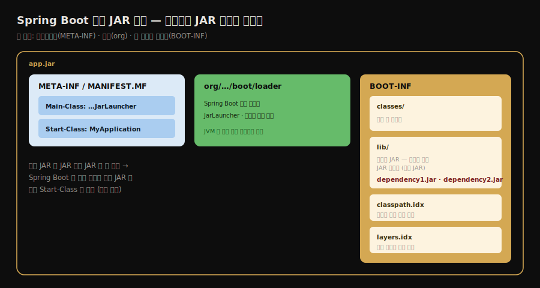
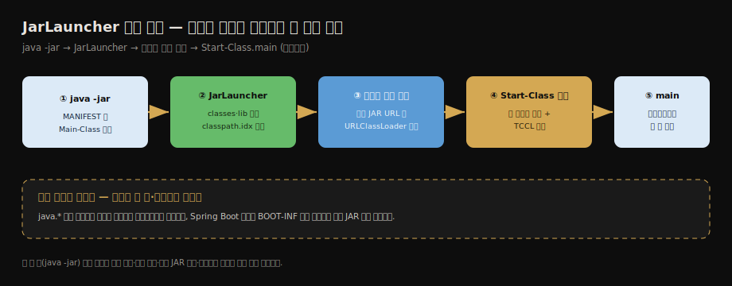

# Spring Boot 실행 JAR와 클래스 로딩
---
> 이 글을 한 줄로 압축하면 — **`java -jar app.jar` 한 줄로 Spring Boot 앱이 뜨는 것은, 표준 JAR가 지원하지 않는 *JAR 안의 JAR*를 읽으려고 Spring Boot가 자기만의 사용자 정의 클래스 로더를 끼워 넣기 때문입니다.**
>
> 핵심은 두 가지입니다. 
>
> 1. 실행 JAR의 `Main-Class`는 내 앱이 아니라 `JarLauncher`이고 내 앱은 `Start-Class`로 따로 적힌다
> 2. `JarLauncher`가 만드는 사용자 정의 로더가 중첩 JAR 안의 클래스를 읽어 내 앱을 띄운다는 것.

이 글을 읽고 나면 실행 JAR의 `BOOT-INF` 구조와 `Main-Class`·`Start-Class`의 차이를 말하고 `JarLauncher`가 사용자 정의 로더로 중첩 JAR를 읽는 흐름을 설명하며 이것이 [02-04에서 본 사용자 정의 로더](./02-04.클래스%20로더와%20부모%20위임%20모델.md)의 실제 사례임을 그림 없이 짚을 수 있습니다.

처음 읽는다면 실행 순서를 먼저 잡으면 됩니다.

1. JVM은 `java -jar`로 JAR의 `Main-Class`를 실행합니다.
2. Spring Boot 실행 JAR의 `Main-Class`는 내 앱이 아니라 `JarLauncher`입니다.
3. `JarLauncher`가 `BOOT-INF/classes`와 `BOOT-INF/lib`를 읽을 로더를 준비합니다.
4. 그 뒤에야 내 앱의 `Start-Class`가 실행됩니다.


## 1. 진입 — java -jar 한 줄의 뒤편

> 매일 쓰는 `java -jar app.jar`는 [02-04의 사용자 정의 로더](./02-04.클래스%20로더와%20부모%20위임%20모델.md)가 실무에서 가장 흔하게 등장하는 자리입니다. 표준 JAR가 못 하는 일을 Spring Boot가 자기 로더로 메웁니다.

[02-04](./02-04.클래스%20로더와%20부모%20위임%20모델.md)에서 사용자 정의 클래스 로더가 네트워크·동적 생성·격리에 쓰인다고 했습니다. 그 가운데 우리가 매일 만나는 사례가 Spring Boot 실행 JAR입니다. `java -jar app.jar` 한 줄로 톰캣까지 내장한 앱이 통째로 뜨는 그 편의의 뒤편에, Spring Boot가 끼워 넣은 사용자 정의 로더가 있습니다.

왜 별도 로더가 필요한지는 표준 JAR의 한계에서 옵니다. 일반 JAR는 *JAR 안에 든 JAR*를 클래스패스로 직접 읽지 못합니다. 그런데 Spring Boot 실행 JAR는 의존 라이브러리들을 풀어 헤치지 않고 *JAR 그대로 안에 품습니다*(이른바 fat JAR). 이 중첩 JAR를 읽으려면 표준 클래스 로더로는 부족합니다. 그래서 Spring Boot는 자기 로더와 진입점을 따로 둡니다.


## 2. 등장 배경과 실제 확인 흐름

> Spring Boot 실행 JAR는 배포 단위를 단순하게 만들려고 등장했습니다. 
>
> 개발자는 JAR 하나만 옮겨 `java -jar`로 실행합니다. Spring Boot는 그 안의 중첩 JAR와 시작 클래스를 런처가 해석하게 했습니다.

등장 배경은 배포 방식의 불편함입니다. 

- 전통적인 Java 애플리케이션은 앱 JAR와 여러 의존성 JAR를 함께 배포합니다. 실행 시 `-cp`에 모든 경로도 맞춰야 했습니다. 
- 운영 환경에서는 이 방식이 쉽게 깨집니다. 의존성 하나가 빠지거나 순서가 달라지면 실행 시점에 `ClassNotFoundException` 또는 버전 충돌이 납니다.

Spring Boot는 이 문제를 "앱 코드 + 의존성 + 실행 런처"를 한 파일에 담는 방식으로 풀었습니다. 

- 단순히 모든 클래스를 한 JAR에 합치는 shaded JAR도 가능합니다. 하지만 그러면 어떤 라이브러리가 들어 있는지 보기 어렵고 같은 파일명이 여러 JAR에 있을 때 충돌하기 쉽습니다. 
- Spring Boot는 의존성 JAR를 그대로 `BOOT-INF/lib`에 넣습니다. 그 중첩 JAR를 읽는 런처도 함께 넣습니다.

실제로 확인할 때는 다음 순서로 보면 됩니다.

1. 빌드 결과물 안에 `BOOT-INF`와 Spring Boot 로더가 있는지 봅니다.
2. `MANIFEST.MF`에서 JVM이 먼저 실행할 `Main-Class`와 실제 앱인 `Start-Class`를 구분합니다.
3. `BOOT-INF/lib`에 의존성 JAR가 풀리지 않고 들어 있는지 확인합니다.
4. `java -jar`로 실행하면 JVM이 내 앱이 아니라 런처를 먼저 실행한다는 점을 연결합니다.

명령으로 확인하면 더 빨리 잡힙니다. Gradle 프로젝트라면 보통 다음 흐름입니다.

```bash
./gradlew bootJar
jar tf build/libs/app.jar | sed -n '1,80p'
unzip -p build/libs/app.jar META-INF/MANIFEST.MF
jar tf build/libs/app.jar | grep '^BOOT-INF/lib/.*\\.jar$' | head
java -jar build/libs/app.jar
```

여기서 `app.jar`는 예시 이름입니다. 실제 프로젝트에서는 `build/libs/*.jar` 또는 빌드 결과물의 정확한 파일명을 넣으면 됩니다. `jar tf`는 실행 JAR의 내부 구조를 보여 줍니다. `unzip -p`는 압축을 풀지 않고 MANIFEST 내용만 출력합니다. 이 두 명령으로 `BOOT-INF/classes`, `BOOT-INF/lib`, `Main-Class`, `Start-Class`를 확인하면, 뒤에서 설명하는 구조가 실제 파일 안에 어떻게 박혀 있는지 바로 보입니다.


## 3. 실행 JAR의 구조 — BOOT-INF·META-INF·org

> 실행 JAR는 세 영역으로 나뉩니다. 
>
> 1. 코드와 의존성은 `BOOT-INF`
> 2. 메타데이터는 `META-INF`
> 3. Spring Boot의 로더 클래스는 `org`

실행 JAR의 압축을 풀면 세 갈래가 보입니다. Spring Boot 공식 문서가 보여 주는 구조는 다음과 같습니다.

```text
app.jar
 ├─ META-INF
 │   └─ MANIFEST.MF
 ├─ org
 │   └─ springframework/boot/loader
 │       └─ <Spring Boot 로더 클래스>
 └─ BOOT-INF
     ├─ classes
     │   └─ com/mycompany/...   # 내가 짠 클래스
     ├─ lib
     │   ├─ dependency1.jar      # 의존성 (중첩 JAR)
     │   └─ dependency2.jar
     ├─ classpath.idx
     └─ layers.idx
```

각 영역의 역할은 다음과 같습니다.

- `BOOT-INF/classes`는 내가 작성한 클래스가 들어가는 곳입니다. `BOOT-INF/lib`는 의존성 JAR들이 *풀리지 않고 JAR 그대로* 담기는 곳입니다.
- `classpath.idx`는 `lib` 안 JAR들을 클래스패스에 올리는 *순서*를 적은 색인입니다. 로더가 이 순서대로 의존성을 클래스패스에 더합니다. 이 파일은 `java -jar`로 실행할 때 쓰입니다. IDE 실행이나 Gradle `bootRun`처럼 이미 클래스패스를 따로 구성한 실행에는 쓰이지 않습니다.
- `layers.idx`는 도커 이미지 레이어 정보를 담아, OCI 컨테이너 빌드 시 레이어 캐시 최적화에 쓰입니다.
- `org/springframework/boot/loader`에는 실행을 담당하는 Spring Boot 로더 클래스가 들어갑니다. 내 앱이 아니라 *Spring Boot가 먼저 실행할* 코드입니다.




## 4. Main-Class vs Start-Class — 진입점은 내 앱이 아니다

> 실행 JAR의 `Main-Class`는 내 애플리케이션이 아니라 `JarLauncher`입니다. 내 앱의 main 클래스는 `Start-Class`에 따로 적힙니다.

`java -jar`는 JAR의 `META-INF/MANIFEST.MF`에서 `Main-Class`를 읽어 그 `main`을 실행합니다. Spring Boot 실행 JAR의 MANIFEST를 열어 보면 `Main-Class`가 내 앱이 아닙니다.

```bash
Main-Class: org.springframework.boot.loader.launch.JarLauncher # Main-Class(스프링 부트)
Start-Class: com.mycompany.project.MyApplication # Start-Class(애플리케이션)
Spring-Boot-Classes: BOOT-INF/classes/
Spring-Boot-Lib: BOOT-INF/lib/
Spring-Boot-Classpath-Index: BOOT-INF/classpath.idx
```

- `Main-Class`는 `JarLauncher`입니다. JVM이 `java -jar`로 가장 먼저 실행하는 것은 Spring Boot의 런처이지 내 앱이 아닙니다.
- `Start-Class`가 내가 `@SpringBootApplication`을 붙인 진짜 main 클래스입니다. `JarLauncher`가 준비를 마친 뒤 *이 클래스를 찾아 실행*합니다.

이 두 단계가 핵심입니다. JVM은 `JarLauncher`를 띄웁니다. `JarLauncher`는 중첩 JAR를 읽을 사용자 정의 로더를 세팅합니다. 그다음 그 로더로 `Start-Class`를 로딩해 내 앱을 실행합니다. 진입점을 한 겹 감싸 *중첩 JAR를 읽을 준비*를 먼저 하는 구조입니다.

> ⚠️ 패키지 이름은 Spring Boot 버전에 따라 다릅니다. Spring Boot 3.2부터 런처가 `org.springframework.boot.loader.launch.JarLauncher`로 옮겨졌습니다. 그 이전에는 `org.springframework.boot.loader.JarLauncher`였습니다. 다음 절의 로더 클래스 이름도 버전에 따라 갈립니다.


## 5. JarLauncher와 사용자 정의 로더 — 중첩 JAR를 읽는다

> `JarLauncher`는 `classpath.idx` 순서로 클래스패스를 구성합니다. 그다음 중첩 JAR를 읽을 수 있는 사용자 정의 클래스 로더를 만들어 `Start-Class.main`을 리플렉션으로 호출합니다.

`JarLauncher`가 하는 일은 [04-03의 `JavaClassExecuter`](./04-03.실전%20—%20원격%20실행%20기능%20설계.md)가 그랬듯 *입구* 역할입니다. 흐름은 다음과 같습니다.

1. JVM이 MANIFEST의 `Main-Class`(`JarLauncher`)를 실행합니다.
2. `JarLauncher`는 `BOOT-INF/classes`와 `BOOT-INF/lib`를 클래스패스 후보로 식별합니다. `classpath.idx`가 있으면 그 파일을 읽어 의존성 적재 순서를 정합니다.
3. 그 클래스패스 URL들로 *사용자 정의 클래스 로더*를 만듭니다. 이 로더는 중첩 JAR 안의 클래스를 읽을 수 있습니다.
4. `Start-Class`를 이 로더로 로딩합니다. 스레드 컨텍스트 클래스 로더도 이 로더로 설정한 뒤, 리플렉션으로 `main(String[])`을 호출합니다.

여기서 사용자 정의 로더가 [02-04의 그 로더](./02-04.클래스%20로더와%20부모%20위임%20모델.md)입니다. 

- 표준 `URLClassLoader`는 `jar:file:.../app.jar!/BOOT-INF/lib/dep.jar` 같은 *JAR 안 JAR 경로*를 직접 다루지 못합니다. 
- Spring Boot의 로더는 이 중첩 JAR를 클래스패스처럼 읽기 위해 들어가는 전용 로더입니다.

중첩 JAR가 어떻게 읽히는지는 *오프셋 매핑*으로 이해할 수 있습니다. 

- `BOOT-INF/lib/mylib.jar` 안의 `B.class`는 별도 파일로 풀려 있는 게 아니라, 바깥 `app.jar`의 특정 바이트 오프셋에 자리합니다. 
- Spring Boot의 로더는 이 오프셋을 계산해 중첩 JAR 안의 클래스를 마치 풀린 파일처럼 읽어 들입니다.

> ⚠️ 로더 클래스 이름과 상속 구조도 버전에 따라 다릅니다. Spring Boot 3.2 이전에는 `org.springframework.boot.loader.LaunchedURLClassLoader`였습니다. 3.2부터는 `org.springframework.boot.loader.launch.LaunchedClassLoader`로 이름이 바뀌었습니다. 후자는 `JarUrlClassLoader`를 상속합니다. 
>
> `JarUrlClassLoader`가 다시 `URLClassLoader`를 상속합니다. 이름과 구조는 달라져도 목적은 같습니다. 중첩 JAR를 일반 클래스패스처럼 읽게 만드는 사용자 정의 로더입니다.




## 6. embedded Tomcat은 어디에 올라오는가

> Spring Boot executable JAR에서는 외부 Tomcat이 웹앱을 로딩하지 않습니다. Boot Loader가 먼저 `BOOT-INF/classes`와 `BOOT-INF/lib`로 애플리케이션 클래스패스를 만듭니다. 그 안의 embedded Tomcat을 라이브러리처럼 실행합니다.

[04-01](./04-01.톰캣의%20클래스%20로더%20아키텍처.md)은 외부 Tomcat이 WAR를 배포하는 구조를 다룹니다. 그 구조에서는 이미 떠 있는 Tomcat이 `WEB-INF/classes`와 `WEB-INF/lib`를 읽어 WebApp 로더를 만듭니다. Spring Boot executable JAR는 책임이 반대입니다. 먼저 애플리케이션이 뜹니다. 그 애플리케이션 클래스패스 안의 `tomcat-embed-core`가 HTTP 서버로 시작됩니다.

구조를 폴더로 보면 외부 Tomcat의 `WEB-INF`와 닮았습니다. 다만 누가 누구를 실행하는지가 다릅니다.

```text
app.jar
├── META-INF/
│   └── MANIFEST.MF
├── org/springframework/boot/loader/...   # Boot Loader
└── BOOT-INF/
    ├── classes/                          # 애플리케이션 클래스
    └── lib/
        ├── spring-webmvc-....jar
        ├── spring-boot-....jar
        ├── jakarta.servlet-api-....jar
        └── tomcat-embed-core-....jar     # Tomcat도 앱 의존성
```

외부 Tomcat과 Spring Boot executable JAR의 대응은 다음처럼 보면 됩니다.

| 외부 Tomcat | Spring Boot executable JAR |
|-------------|----------------------------|
| `$CATALINA_BASE/lib` | 별도 Tomcat 홈 없음. Tomcat 자체가 `BOOT-INF/lib/tomcat-embed-*.jar`에 있음 |
| `WEB-INF/classes` | `BOOT-INF/classes` |
| `WEB-INF/lib` | `BOOT-INF/lib` |
| Tomcat이 WAR를 배포 | Boot가 Tomcat을 의존성으로 실행 |
| 웹앱별 WebApp 로더 격리 | 보통 한 Boot 앱의 애플리케이션 ClassLoader 중심 |

여기서 "Spring Boot면 무조건 `BOOT-INF`"라고 외우면 안 됩니다. 패키징 방식에 따라 실행 주체와 주요 클래스 경로가 달라집니다.

| 배포 방식 | 실행 주체 | 주요 클래스 경로 |
|-----------|-----------|------------------|
| 외부 Tomcat + 일반 WAR | Tomcat | `WEB-INF/classes`, `WEB-INF/lib` |
| Spring Boot executable JAR | Boot Loader(`JarLauncher`) | `BOOT-INF/classes`, `BOOT-INF/lib` |
| Spring Boot WAR + 외부 Tomcat | Tomcat | `WEB-INF/classes`, `WEB-INF/lib`, `WEB-INF/lib-provided` |

- 세 번째가 중간 형태입니다. Spring Boot 앱을 `war`로 패키징해 외부 Tomcat에 올리면 실행 주체는 다시 외부 Tomcat이 됩니다. 따라서 클래스 로딩 관점에서는 Boot executable JAR의 `BOOT-INF` 구조보다 전통적인 WAR 구조인 `WEB-INF/classes`와 `WEB-INF/lib`가 중요합니다.

다만 Spring Boot WAR에는 `WEB-INF/lib-provided`가 함께 등장합니다. 이 디렉터리는 embedded 실행, 즉 `java -jar`로 그 WAR를 직접 띄울 때 필요하지만 외부 Tomcat 배포 때는 컨테이너가 제공하는 의존성을 분리해 두는 자리입니다. 같은 산출물 하나로 "외부 Tomcat 배포"와 "단독 실행" 두 길을 모두 지원하려는 장치입니다. 그래서 Boot WAR에서 `tomcat-embed-*`나 `jakarta.servlet-api`는 보통 `WEB-INF/lib`가 아니라 `WEB-INF/lib-provided`에 들어갑니다.

중요한 점은 embedded Tomcat도 내부적으로는 Tomcat이라는 사실입니다. `StandardContext`, `ServletContext`, `Connector`, `Filter`, `DispatcherServlet` 같은 웹 컨테이너 구조는 그대로 씁니다. 달라지는 것은 "누가 누구를 로딩하느냐"입니다. 외부 Tomcat은 컨테이너가 앱을 올립니다. Boot는 앱이 컨테이너를 품고 올라갑니다.


## 7. META-INF/services — 로더가 읽은 JAR에서 구현체를 *발견*하는 법

> 여기부터는 "로더가 JAR를 읽은 다음"의 이야기입니다. 로더가 `BOOT-INF/lib`의 JAR들을 클래스패스에 올리면, 그 JAR 안의 `META-INF/services` 등록 파일을 이용해 구현체를 *발견*할 수 있습니다. ****
>
> 이것이 자바 SPI(Service Provider Interface)입니다. JDBC 드라이버와 SLF4J provider는 이 표준 메커니즘을 씁니다. Spring Boot 자동 설정은 같은 등록 파일 발상을 Spring 방식으로 확장합니다.

§5~§6 까지는 "로더가 클래스를 *읽는* 법"이었습니다. 그런데 클래스패스에 JAR 가 올라갔다고 해서, 그 안의 구현체를 애플리케이션이 자동으로 아는 것은 아닙니다. 이 절은 클래스 로딩 자체보다 한 단계 위입니다. 읽힌 JAR 안에서 프레임워크가 구현체나 설정 후보를 어떻게 찾는지 봅니다.

인터페이스 하나를 여러 라이브러리가 구현할 때가 있습니다. 이때 "어떤 구현체들이 있나"를 코드에 직접 적지 않고 *발견* 하는 표준 방법이 SPI 입니다.

핵심은 `META-INF/services/<인터페이스 FQCN>` 라는 **등록 파일** 입니다. 파일명이 인터페이스 이름, 내용이 구현체 이름(한 줄에 하나)입니다.

```text
# 예: mysql-connector JAR 안
파일: META-INF/services/java.sql.Driver
내용:
com.mysql.cj.jdbc.Driver
```

`DriverManager` 가 `getConnection(...)` 시 이 파일을 읽어 드라이버를 찾습니다. 그래서 드라이버 JAR 만 의존성에 넣으면 `new com.mysql...Driver()` 없이도 동작합니다. 발견의 주체는 `ServiceLoader` 입니다. 그 동작은 세 단계입니다.

```java
// ServiceLoader.load(X) 가 내부에서 하는 일
ClassLoader cl = Thread.currentThread().getContextClassLoader();

Enumeration<URL> urls = cl.getResources("META-INF/services/" + X.getName()); // ① 등록 파일 요청
// ② 파일을 줄 단위로 읽어 구현체 FQCN 획득  → ③ Class.forName + newInstance
```

여기서 두 가지를 짚어야 합니다. 

1. **`META-INF` 는 클래스 로더가 특별 취급하는 폴더가 아닙니다.** 클래스 로더는 `getResources()` 로 요청하면 리소스를 돌려줄 뿐입니다. "`META-INF/services` 를 봐야지" 하고 판단하는 주체는 `ServiceLoader` 입니다. 
2. **구현체는 자동으로 발견되지 않습니다.** 클래스가 `implements X` 이고 클래스패스에 들어 있어도 등록 파일에 이름이 없으면 `ServiceLoader` 는 찾지 못합니다. 자바가 클래스패스 전체를 스캔해 구현체를 골라내는 것은 비현실적입니다. 수만 클래스를 로딩할 수 있기 때문에 "구현체가 스스로 등록부에 손드는" 방식을 택한 것입니다.

Spring Boot 는 이 발상을 확장해 자기만의 등록 파일을 둡니다. 자동 설정 라이브러리는 `META-INF/spring/org.springframework.boot.autoconfigure.AutoConfiguration.imports`(Boot 3) 또는 구버전 `META-INF/spring.factories` 에 자동 설정 클래스를 등록합니다. 

- `BOOT-INF/lib` 의 JAR 가 클래스패스에 올라온 순간, Spring Boot 가 이 등록 파일을 읽어 자동 설정 후보로 삼습니다. 
- 읽는 주체는 `ServiceLoader` 가 아니라 Spring 입니다. 그래도 "JAR 안 등록 파일로 구현/설정을 발견한다"는 발상은 같습니다. §5~§6 의 로더가 *클래스를 읽는* 단계라면, 이 절의 SPI와 자동 설정 이야기는 그 위에서 *구현체와 설정 후보를 발견하는* 단계입니다.

자동 설정 라이브러리는 보통 다음 파일을 함께 담습니다.

```text
META-INF/
├── spring.factories
└── spring/
    └── org.springframework.boot.autoconfigure.AutoConfiguration.imports
```

`spring.factories`는 ApplicationContext가 만들어지기 전 단계의 확장 포인트에도 쓰입니다. 대표 예시는 `EnvironmentPostProcessor`입니다. 라이브러리가 기본 프로퍼티를 낮은 우선순위로 깔아 두면, 애플리케이션의 `application.yml`이 같은 키를 선언했을 때 애플리케이션 설정이 이깁니다.

`AutoConfiguration.imports`는 Spring Boot 3 방식의 자동 설정 목록입니다. 라이브러리는 여기에 `@AutoConfiguration` 클래스를 적어 둡니다. 다만 목록에 있다고 무조건 빈이 생기는 것은 아닙니다. `@ConditionalOnBean(...)`이나 `@ConditionalOnProperty(...)` 같은 조건이 맞을 때만 실제 ApplicationContext에 들어옵니다.

즉 어떤 라이브러리 JAR는 `BOOT-INF/lib`에 들어온 순간 "검색 가능한 클래스 묶음"이면서 동시에 "Spring Boot 자동 설정을 제공하는 라이브러리"가 됩니다. 외부 Tomcat의 `WEB-INF/lib/*.jar`가 클래스 로더에 보이는 것과 비슷합니다. Boot에서는 그 JAR 안의 `META-INF/spring...` 선언까지 읽어 애플리케이션 설정에 참여시킨다는 점이 다릅니다.

> 실습: `META-INF/services` 를 손으로 작성하고 `ServiceLoader` 로 발견하는 과정, 그리고 등록을 지웠을 때 구현체가 안 보이는 것까지 직접 확인하려면 `~/jvm-practice/spi-demo` 를 본다. `--args="manual"` 로 실행하면 `getResources()` 로 등록 파일을 직접 읽어 `ServiceLoader` 의 내부를 재현한다. 클래스 로더 관점의 같은 주제는 [04-01 §6 TCCL](./04-01.톰캣의%20클래스%20로더%20아키텍처.md)에서 다룬다.


## 8. Spring 관점 — 두 노트의 사실이 여기서 만난다

> 이 한 편에 [02-04의 사용자 정의 로더](./02-04.클래스%20로더와%20부모%20위임%20모델.md)와 [02-05의 "App 로더는 URLClassLoader가 아니다"](./02-05.자바%20모듈%20시스템과%20클래스%20로더%20변화.md)가 함께 적용됩니다.

이 글의 구조를 앞 노트들과 이으면 클래스 로딩 지식이 실무 한 장면으로 모입니다.

먼저 [02-04](./02-04.클래스%20로더와%20부모%20위임%20모델.md)의 *사용자 정의 로더*입니다. "바이트를 어디서 어떻게 가져올지를 애플리케이션이 직접 정한다"는 그 설계가, 중첩 JAR라는 비표준 위치에서 바이트를 읽는 Spring Boot 로더로 그대로 나타납니다. 부모 위임도 지켜집니다. `java.*` 핵심 클래스는 여전히 위임으로 부트스트랩이 로딩합니다. Spring Boot 로더는 *내 앱과 의존성*만 중첩 JAR에서 읽습니다.

다음 [02-05](./02-05.자바%20모듈%20시스템과%20클래스%20로더%20변화.md)의 변화와도 닿습니다. JDK 9부터 애플리케이션 로더가 더 이상 `URLClassLoader`가 아니게 되었습니다. 실행 JAR를 읽는 책임을 Spring Boot가 자기 로더로 직접 떠안는 그림이 더 분명해졌습니다. 표준 로더에 기대지 않고 중첩 JAR 전용 로더를 두는 선택이 그래서 자연스럽습니다.

정리하면 `java -jar app.jar`라는 익숙한 명령 한 줄 안에, 사용자 정의 로더·부모 위임·리플렉션 실행·중첩 JAR 읽기가 모두 들어 있습니다. JVM이 알아서 해 주는 것처럼 보이던 부팅이 사실 이 원리들의 조립임이 드러납니다.


## 9. 면접 대비 요약

> 핵심은 "표준 JAR는 중첩 JAR 미지원 → Spring Boot 자체 로더", "Main-Class는 JarLauncher, Start-Class가 내 앱", "JarLauncher가 사용자 정의 로더로 중첩 JAR를 읽어 리플렉션 실행"입니다.

### 한 줄 정의

Spring Boot 실행 JAR란 의존성을 중첩 JAR로 품은 fat JAR입니다. 표준 JAR가 못 읽는 그 중첩 JAR를 `JarLauncher`가 만든 사용자 정의 클래스 로더가 읽습니다. 그런 다음 `Start-Class`를 리플렉션으로 실행합니다.

### 핵심 포인트 6가지

1. 실행 JAR는 `BOOT-INF/classes`(내 코드)·`BOOT-INF/lib`(중첩 JAR 의존성)·`classpath.idx`(적재 순서)·`org/.../loader`(Spring Boot 로더)로 구성됩니다.
2. `Main-Class`는 내 앱이 아니라 `JarLauncher`입니다. 내 앱의 main은 `Start-Class`에 따로 적힙니다. JVM은 런처를 먼저 띄웁니다.
3. `JarLauncher`는 중첩 JAR를 읽는 사용자 정의 로더를 만들어 `Start-Class`를 로딩하고 리플렉션으로 실행합니다. 이것이 02-04의 사용자 정의 로더가 실무에 나타난 사례입니다.
4. embedded Tomcat은 외부 Tomcat처럼 먼저 떠서 WAR를 배포하지 않습니다. Boot 애플리케이션 클래스패스 안의 `tomcat-embed-*` 의존성으로 실행됩니다.
5. Spring Boot executable JAR는 `BOOT-INF`를 씁니다. 외부 Tomcat에 올리는 WAR는 다시 `WEB-INF` 구조가 중요합니다. Boot WAR의 `WEB-INF/lib-provided`는 단독 실행과 외부 컨테이너 배포를 함께 지원하려는 장치입니다.
6. 로더가 JAR를 클래스패스에 올린 뒤, 그 JAR 안 `META-INF/services` 등록 파일로 구현체를 *발견*하는 것이 SPI입니다. `implements`만으론 부족하고 등록 파일에 이름이 있어야 `ServiceLoader`가 찾습니다. Spring Boot 자동 설정도 같은 등록 파일 발상(`AutoConfiguration.imports`)을 Spring 방식으로 씁니다.

### 면접에서 받을 만한 질문

1. Spring Boot 실행 JAR는 표준 JAR와 무엇이 다릅니까? 왜 별도 로더가 필요합니까?
2. 실행 JAR의 `Main-Class`와 `Start-Class`는 각각 무엇입니까?
3. `JarLauncher`가 내 앱을 실행하기까지의 흐름을 설명할 수 있습니까?
4. Spring Boot embedded Tomcat은 외부 Tomcat의 WebApp 로더 구조와 무엇이 다릅니까?
5. Spring Boot executable JAR, 외부 Tomcat WAR, Boot WAR는 클래스 경로가 어떻게 다릅니까?
6. 클래스패스에 구현체가 있는데도 `ServiceLoader`가 못 찾을 수 있습니까? 그 이유는 무엇입니까?

> 여섯 질문에 *먼저 자답한 뒤* 아래 §정답으로 내려갑니다.


## 10. 정답 (자답 후 펼치기)

> 위 §면접에서 받을 만한 질문의 6개에 *먼저 자답한 뒤* 아래를 읽으세요.

### 정답 1 — 별도 로더가 필요한 이유

표준 JAR는 *JAR 안에 든 JAR*를 클래스패스로 직접 읽지 못하기 때문입니다. Spring Boot 실행 JAR는 의존성을 풀어 헤치지 않고 `BOOT-INF/lib`에 JAR 그대로 품는데(fat JAR), 이 중첩 JAR를 읽으려면 표준 로더로는 부족해 Spring Boot가 중첩 JAR를 읽을 수 있는 사용자 정의 로더를 끼워 넣습니다.

### 정답 2 — Main-Class와 Start-Class

`Main-Class`는 JVM이 `java -jar`로 가장 먼저 실행하는 클래스로, Spring Boot 실행 JAR에서는 `JarLauncher`입니다. `Start-Class`는 내가 `@SpringBootApplication`을 붙인 실제 애플리케이션 main 클래스입니다. 런처가 준비를 마친 뒤 이 `Start-Class`를 찾아 실행합니다.

### 정답 3 — JarLauncher의 실행 흐름

JVM이 `JarLauncher.main`을 실행하면, 런처는 `BOOT-INF/classes`·`BOOT-INF/lib`를 식별하고 `classpath.idx` 순서로 클래스패스를 구성합니다. 그 URL들로 중첩 JAR를 읽는 사용자 정의 클래스 로더를 만듭니다. 스레드 컨텍스트 로더도 이 로더로 설정한 뒤, `Start-Class`를 로딩해 리플렉션으로 `main`을 호출합니다.

### 정답 4 — embedded Tomcat의 로딩 구조

외부 Tomcat은 이미 떠 있는 컨테이너가 WAR를 배포하고 WebApp 로더를 만듭니다. Spring Boot executable JAR는 반대입니다. `JarLauncher`가 먼저 `BOOT-INF/classes`와 `BOOT-INF/lib`로 애플리케이션 클래스패스를 만듭니다. 그 안의 `tomcat-embed-core`가 HTTP 서버로 시작됩니다. Tomcat 기능은 그대로 씁니다. 실행 주체만 외부 컨테이너가 아니라 Boot 애플리케이션입니다.

### 정답 5 — 패키징별 클래스 경로

Spring Boot executable JAR는 `BOOT-INF/classes`와 `BOOT-INF/lib`를 봅니다. 외부 Tomcat에 올리는 일반 WAR는 `WEB-INF/classes`와 `WEB-INF/lib`를 봅니다. Spring Boot WAR를 외부 Tomcat에 올리는 경우도 실행 주체는 Tomcat이므로 `WEB-INF` 구조가 중요합니다. 다만 Boot WAR에는 단독 실행 때 필요한 의존성을 분리하려고 `WEB-INF/lib-provided`가 함께 들어갈 수 있습니다.

### 정답 6 — 구현체가 클래스패스에 들어 있어도 못 찾는 경우

찾지 못할 수 있습니다. `ServiceLoader`는 클래스패스의 모든 클래스를 스캔하지 않습니다. `META-INF/services/<인터페이스 FQCN>` 등록 파일에 적힌 이름만 읽습니다. 그래서 클래스가 `implements`를 했고 클래스패스에 `.class`가 있어도, 등록 파일에 그 이름이 없으면 발견되지 않습니다. 전수 스캔은 수만 클래스를 로딩할 수 있어 비현실적입니다. 그래서 구현체가 등록부에 스스로 손드는 방식을 택했습니다. 발견의 주체는 클래스 로더가 아니라 `ServiceLoader`입니다. 클래스 로더는 `getResources()`로 등록 파일을 돌려주는 심부름만 합니다.


## 11. 학습 워크플로우 진행 기록

> 이 절은 이 문서를 4-Phase Learning으로 끝까지 밀었는지 확인하는 기록입니다. 본문은 Phase 2 산출물이고, `spi-demo` 실행은 Phase 3 실습이며, 아래 질문과 실행 결과가 Phase 4 검증입니다.

### Phase 2 — 문서 산출물

Phase 2 산출물은 이 파일입니다.

```text
write/01_language/java/05_JVM/ch03_class-loading-mechanism/04-05.Spring Boot 실행 JAR와 클래스 로딩.md
```

본문에는 실행 JAR 구조, MANIFEST 진입점, `JarLauncher` 실행 흐름, embedded Tomcat 위치, SPI와 Spring Boot 자동 설정의 발견 방식을 연결해 두었습니다. 핵심 시각화는 `_assets/04-05-fatjar-layout.svg`와 `_assets/04-05-jarlauncher-flow.svg`입니다. 두 그림은 `BOOT-INF` 구조와 런처 실행 흐름을 분리해서 보여 주므로, 읽는 사람이 "파일 구조"와 "실행 순서"를 섞지 않게 합니다.

### Phase 3 — 실습

실습은 `~/jvm-practice/spi-demo`에서 진행했습니다. 이 실습은 Spring Boot 로더 자체를 다시 만드는 것이 아니라, §7에서 설명한 "로더가 JAR를 클래스패스에 올린 뒤 등록 파일로 구현체를 발견한다"는 부분을 손으로 확인합니다.

```bash
cd ~/jvm-practice
./gradlew :spi-demo:run --args="manual"
```

관찰한 결과는 다음과 같습니다.

1. `ClassLoader.getResources("META-INF/services/com.mylib.spi.PaymentProvider")`가 등록 파일 위치를 찾아냈습니다.
2. 등록 파일에는 `com.myapp.payment.TossPayment`와 `com.myapp.payment.KakaoPayment` 두 구현체 이름이 들어 있었습니다.
3. 실습 코드는 두 이름을 줄 단위로 읽고 `Class.forName(..., true, cl)`과 기본 생성자로 구현체를 만들었습니다.
4. 최종 출력은 구현체 2개를 직접 만들었고, `ServiceLoader.load()`가 내부에서 같은 일을 한다는 결론을 보여 주었습니다.

이 실습이 중요한 이유는 `META-INF/services`를 클래스 로더의 특별 예약 폴더로 오해하지 않게 해 주기 때문입니다. 클래스 로더는 요청받은 리소스를 돌려줄 뿐이고, 그 파일을 어떤 규칙으로 읽을지는 `ServiceLoader`나 Spring 같은 상위 프레임워크가 정합니다.

### Phase 4 — 검증 질문

아래 질문에 막힘 없이 답할 수 있으면 이 문서의 학습 목표를 통과한 것입니다.

1. Spring Boot 실행 JAR는 왜 의존성을 풀어 하나의 shaded JAR로 합치지 않고, `BOOT-INF/lib`에 중첩 JAR로 둡니까?
2. `Main-Class`가 내 앱이 아니라 `JarLauncher`인 구조가 없으면 어떤 문제가 생깁니까?
3. `JarLauncher`가 `Start-Class.main`을 호출하기 전까지 준비하는 것은 무엇입니까?
4. embedded Tomcat을 외부 Tomcat의 WebApp 로더 구조와 같은 것으로 보면 왜 틀립니까?
5. `ServiceLoader`는 클래스패스 전체에서 `implements` 관계를 스캔하지 않고 왜 `META-INF/services` 등록 파일을 읽습니까?
6. Spring Boot 자동 설정의 `AutoConfiguration.imports`는 SPI와 무엇이 같고 무엇이 다릅니까?

자가 채점 기준은 간단합니다. 1~3번은 실행 JAR와 런처 구조, 4번은 embedded Tomcat의 실행 주체, 5~6번은 등록 파일 기반 발견 메커니즘을 말로 풀어낼 수 있어야 합니다. 답할 때 `BOOT-INF`, `Main-Class`, `Start-Class`, `JarLauncher`, `META-INF/services`, `AutoConfiguration.imports`가 각각 어느 단계에 놓이는지 함께 말하면 통과입니다.


## 12. 핵심 개념 체크리스트

> 이 체크리스트는 Phase 4 이후 남기는 자가 점검표입니다. 각 항목을 설명할 수 있어야 `java -jar` 실행 흐름과 등록 파일 기반 발견 흐름을 섞지 않고 말할 수 있습니다.

- [ ] 실행 JAR의 세 영역(BOOT-INF·META-INF·org)과 각 역할을 말할 수 있는가?
- [ ] 표준 JAR가 중첩 JAR를 못 읽어 별도 로더가 필요한 이유를 아는가?
- [ ] `Main-Class`(JarLauncher)와 `Start-Class`(내 앱)의 차이를 설명할 수 있는가?
- [ ] `classpath.idx`가 의존성 적재 순서를 정한다는 것을 아는가?
- [ ] `JarLauncher`가 사용자 정의 로더로 중첩 JAR를 읽어 리플렉션 실행하는 흐름을 아는가?
- [ ] embedded Tomcat이 외부 Tomcat처럼 앱을 올리는 것이 아니라, Boot 앱 안의 의존성으로 실행된다는 점을 설명할 수 있는가?
- [ ] Spring Boot executable JAR, 외부 Tomcat WAR, Boot WAR의 주요 클래스 경로를 구분할 수 있는가?
- [ ] `META-INF/services` 등록 파일과 `ServiceLoader`로 구현체를 *발견*하는 SPI 메커니즘을 설명할 수 있는가?
- [ ] `implements`만으론 부족하고 등록까지 해야 `ServiceLoader`가 찾는다는 점, 그 이유(전수 스캔 회피)를 아는가?
- [ ] Spring Boot 자동 설정(`AutoConfiguration.imports`)이 같은 등록 파일 발상임을 아는가?
- [ ] 이것이 02-04의 사용자 정의 로더·02-05의 로더 변화와 어떻게 이어지는지 아는가?


## 13. 관련 문서

> 이 글로 톰캣·OSGi·원격 실행·핫스왑 도구에 이은 클래스 로더 실전 사례가 우리가 매일 실행하는 Spring Boot 앱까지 닿습니다.

- [02-04. 클래스 로더와 부모 위임 모델](./02-04.클래스%20로더와%20부모%20위임%20모델.md) § "클래스의 동일성" — 사용자 정의 로더의 원리
- [02-05. 자바 모듈 시스템과 클래스 로더 변화](./02-05.자바%20모듈%20시스템과%20클래스%20로더%20변화.md) § "모듈화 후 클래스 로더의 변화" — App 로더가 URLClassLoader가 아니게 된 변화
- [04-04. 동적 로딩과 핫스왑 도구](./04-04.동적%20로딩과%20핫스왑%20도구.md) — 같은 클래스 로딩 원리의 또 다른 실무 응용
- [웹 애플리케이션 빌드 — WAR와 실행 JAR](../../06_Build/01-02.웹%20애플리케이션%20빌드%20—%20WAR와%20실행%20JAR.md) — 이 글이 다루는 `BOOT-INF` 구조를 빌드 도구가 어떻게 만드는지(빌드 관점의 짝 문서)
