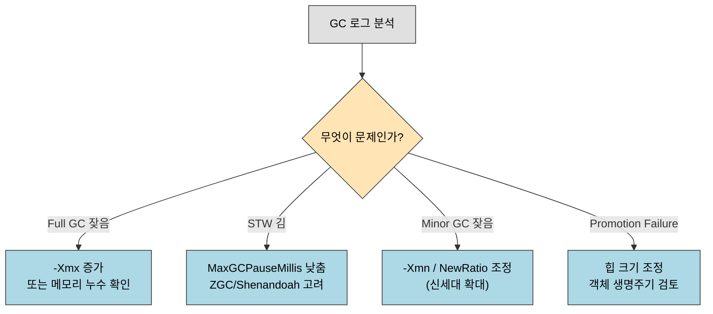

# GC 운영 — 로그 분석과 튜닝 파라미터
---
> 본 노트는 GC *알고리즘*이 아니라 GC *운영*을 다룬다. 정독 노트 01-02~01-07이 "어떤 알고리즘이 어떤 트레이드오프를 갖는가"를 정리했다면, 본 노트는 **운영 시점에 GC가 무엇을 말하는지를 읽는 법**(GC 로그)과 **그 결과로 무엇을 돌릴 수 있는지**(튜닝 파라미터)를 다룬다. 본 절을 한 줄로 압축하면 — **GC 튜닝의 첫 단계는 알고리즘을 아는 일이고, 두 번째 단계는 GC 로그가 그것을 어떻게 보여 주는지를 읽는 일**이다.

## 1. GC 로그 분석

GC 문제를 진단하려면 GC 로그를 분석해야 한다. Java 9+에서는 `-Xlog:gc*` 옵션으로 통합된 로깅을 사용한다.

```bash
# GC 로그 활성화
java -Xlog:gc*:file=gc.log:time,uptime:filecount=10,filesize=10m -jar myapp.jar

# 주요 로그 항목 예시
[2.135s][info][gc] GC(0) Pause Young (Normal) (G1 Evacuation Pause) 128M->64M(512M) 12.345ms
# 의미: 2.135초 시점, Young GC, 128MB → 64MB (전체 힙 512MB), 12.345ms STW
```

GC 로그에서 주목해야 할 지표는 다음과 같다.

- **일시 정지 시간**: STW 지속 시간 (목표치 초과 여부)
- **GC 빈도**: Minor GC와 Full GC의 발생 간격
- **힙 사용량 변화**: GC 전후 힙 사용량으로 회수 효율 파악
- **Promotion Failure**: Old Generation 공간 부족으로 Survivor 객체 이동 실패

```bash
# jstat으로 실시간 GC 통계 확인
jstat -gcutil <pid> 1000 10  # 1초 간격으로 10회 출력

# 출력 예시
S0     S1     E      O      M      CCS    YGC    YGCT    FGC    FGCT    CGC    CGCT    GCT
 0.00  45.23  72.13  68.92  95.12  92.34     15    0.312     1    0.521     3    0.043    0.876
```

## 2. GC 튜닝 파라미터

GC 튜닝의 기본 원칙은 측정 → 분석 → 조정의 순서를 지키는 것이다. 먼저 GC 로그와 프로파일링으로 문제를 정확히 파악한 뒤 파라미터를 조정한다.

### 2.1 힙 크기 설정

```bash
# 기본 힙 크기 설정
java -Xms2g -Xmx2g -jar myapp.jar
# -Xms: 초기 힙 크기 (Xmx와 동일하게 설정하면 동적 조정 오버헤드 제거)
# -Xmx: 최대 힙 크기 (물리 메모리의 50~75% 권장)
```

`-Xms`와 `-Xmx`를 동일하게 설정하면 힙 크기 조정에 따른 GC 오버헤드를 줄일 수 있다. 컨테이너 환경에서는 `-XX:MaxRAMPercentage`로 JVM이 컨테이너 메모리 제한을 인식하게 하는 것이 중요하다.

### 2.2 GC 선택과 주요 옵션

```bash
# G1GC 사용 (Java 9+ 기본)
java -XX:+UseG1GC \
     -Xms2g -Xmx2g \
     -XX:MaxGCPauseMillis=200 \      # 목표 최대 STW 시간 (ms)
     -XX:G1HeapRegionSize=8m \       # Region 크기 (1~32MB, 2의 거듭제곱)
     -XX:InitiatingHeapOccupancyPercent=45 \ # Concurrent Marking 시작 임계값
     -jar myapp.jar

# ZGC 사용 (저지연 요구 시)
java -XX:+UseZGC \
     -Xms4g -Xmx4g \
     -XX:MaxGCPauseMillis=10 \       # ZGC는 서브밀리초 목표 가능
     -jar myapp.jar

# GC 로그 포함
java -XX:+UseG1GC \
     -Xlog:gc*:file=gc.log:time,uptime \
     -jar myapp.jar
```

### 2.3 튜닝 체크리스트

- **Full GC 빈도가 높다**: Old Generation 크기 부족 → `-Xmx` 증가 또는 메모리 누수 확인
- **STW가 길다**: `-XX:MaxGCPauseMillis` 목표 낮추기, ZGC/Shenandoah 고려
- **Minor GC가 너무 잦다**: Young Generation이 너무 작음 → `-Xmn` 또는 `-XX:NewRatio` 조정
- **Promotion Failure**: Old Generation 공간 부족, 객체 생존율이 너무 높음 → 힙 크기 조정 또는 코드 레벨 객체 생명주기 검토

GC 로그에서 본 증상이 어떤 처방으로 이어지는지 흐름으로 보면 다음과 같다. 증상을 먼저 분류한 뒤 그에 맞는 옵션·조치를 고른다.



## 관련 문서

- [02-04.클래식 가비지 컬렉터.md](./02-04.클래식%20가비지%20컬렉터.md) — Serial/Parallel/CMS/G1 등 컬렉터별 동작
- [02-05.저지연 가비지 컬렉터.md](./02-05.저지연%20가비지%20컬렉터.md) — Shenandoah/ZGC의 저지연 설계
- [02-06.GC 선택하기.md](./02-06.GC%20선택하기.md) — 워크로드별 GC 선택
- [02-08.마치며.md](./02-08.마치며.md) — 3장 전체 요약과 GC 구현체 비교표
