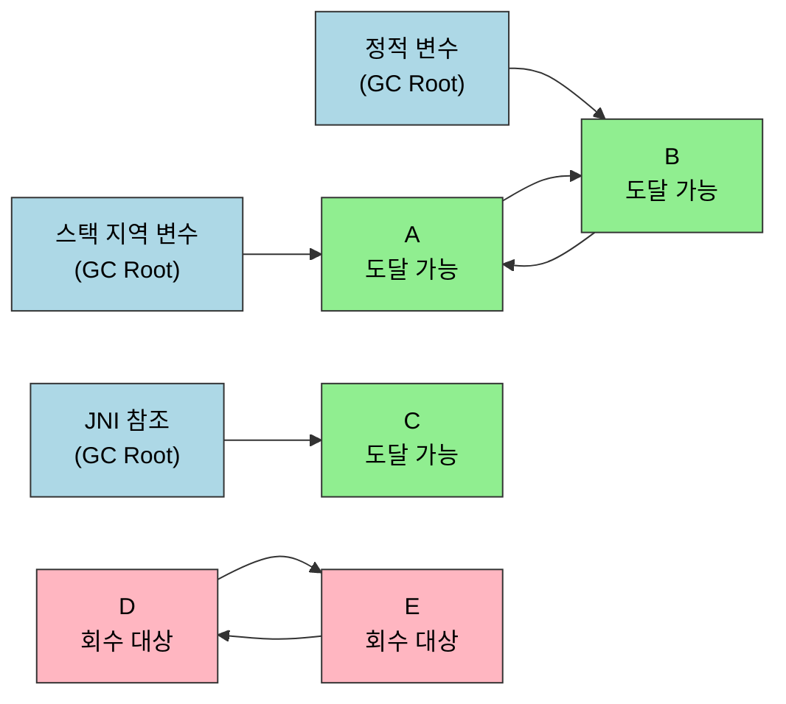
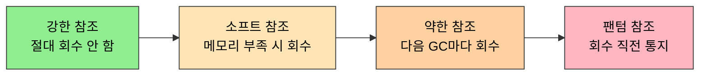

# 들어가며 + 대상이 죽었는가
---
> 가비지 컬렉터의 책임은 두 가지다. *어떤 객체가 죽었는가*를 판단하는 일과 *어떻게 회수할지*를 결정하는 일이다. §3.2가 첫 책임을, §3.3 이후가 두 번째 책임을 다룬다. 본 노트는 §3.1 들어가며와 §3.2 대상이 죽었는가를 한 묶음으로 다루며, 자바가 객체의 *죽음*을 어떻게 정의하는지를 인용 카운팅·도달성 분석·참조 4종·`finalize()` 의 4축으로 정리한다. 본 절을 한 줄로 압축하면 — **자바의 죽음 판정은 도달성 분석 한 갈래로 통일됐고, 인용 카운팅과 `finalize()`는 그 결정을 다시 한 번 검증해 주는 안전망**이다. 참조 4종(Strong/Soft/Weak/Phantom)은 *살아 있는 정도*에 단계를 부여한 도구다.

## 1. §3.1 들어가며 — 메모리 관리의 어려움이 옮겨 간 자리

> C·C++ 개발자가 *언제 해제할지*를 정했다면, 자바 개발자는 *해제 자체*를 가상 머신에 위임했다.

자바의 메모리 관리는 §2장에서 본 7개 영역 중 *자바 힙*과 *메서드 영역*에 집중된다. 두 영역은 *전체 공유*이고 *수명이 가상 머신과 같다*. 그래서 누가 누구의 객체를 들고 있는지가 시간이 갈수록 복잡해진다. 반면 PC 카운터·자바 가상 머신 스택·네이티브 메서드 스택은 *스레드 수명*에 묶이므로 스레드가 끝나면 자동으로 풀린다 — 이 세 영역은 GC의 관심이 아니다.

GC가 답해야 하는 세 질문은 다음과 같다.

1. **어떤 객체가 회수 대상인가?** (§3.2의 주제)
2. **언제 회수하는가?** (§3.3 알고리즘과 §3.5 컬렉터 선택)
3. **어떻게 회수하는가?** (§3.3 마크-스윕/카피/컴팩트, §3.4 핫스팟 구현 디테일)

세 질문은 분리해서 생각해야 한다. 같은 *어떤 객체가 죽었나*에 대한 답을 두 알고리즘이 공유하더라도 *어떻게 회수하나*는 달라질 수 있다.

## 2. §3.2 대상이 죽었는가 — 두 가지 판정 전략

> 객체가 *죽었다*는 정의는 단순하다. 더 이상 *살아 있는 곳에서 도달할 수 없다*는 뜻이다. 문제는 그 도달성을 어떻게 효율적으로 추적하느냐다.

### 2.1 인용 카운팅 — 왜 자바가 선택하지 않았는가

각 객체에 *얼마나 많은 곳에서 자신을 참조하는지* 정수 카운터를 단다. 참조가 늘면 +1, 참조가 사라지면 −1, 카운터가 0이 되면 *그 순간* 회수 대상이다.

장점이 분명하다. *즉시 회수*가 가능하고, *판정 비용이 일정*하다. 한 객체의 죽음을 알기 위해 다른 객체를 탐색할 필요가 없다.

자바가 이 방식을 택하지 않은 이유는 **순환 참조** 때문이다. 두 객체가 *서로를 참조*하면 둘 다 카운터가 1 이상이라 사라지지 않는다. 외부에서 두 객체로 가는 모든 참조가 끊어진 뒤에도 둘의 카운터는 *영원히* 1이다. 인용 카운팅을 쓰는 언어(Objective-C, Swift, Python의 일부)는 *순환 참조 감지기*를 별도로 돌리거나 *약한 참조*를 개발자에게 강제하는 식으로 이 문제를 피해 가지만, 자바 설계자는 이 부담을 들이는 대신 *도달성 분석*을 택했다.

책의 예제는 이 한계를 극단으로 보여 준다.

```java
// 책 §3.2.1 인용 카운팅의 한계 — 의사 코드
A a = new A();
B b = new B();
a.next = b;
b.next = a;
a = null;
b = null;
// 인용 카운팅: a, b 의 카운터가 여전히 1 → 회수되지 않음
// 도달성 분석: GC Root 에서 a, b 어디로도 도달 불가 → 회수
```

### 2.2 도달성 분석 — 자바의 선택

GC가 알고 있는 *루트 집합*(GC Roots) 에서 시작해 객체를 따라가며, 도달 가능한 객체를 *살아 있다*고 표시한다. 표시되지 않은 객체는 죽었다고 본다. 순환 참조도 자연스럽게 해결된다 — 두 객체가 서로를 가리켜도 *루트에서 도달 못 하면* 함께 회수된다.

### 2.3 GC Root 가 되는 것들

도달성의 *출발점*에는 다음이 포함된다. 책 §3.2.2의 목록을 표로 옮긴다.

| GC Root 종류 | 어디에서 오는가 |
|------------|---------------|
| 자바 가상 머신 스택의 *지역 변수와 인자* | 실행 중인 메서드의 스택 프레임 |
| 메서드 영역의 *클래스 정적 변수* | `static Foo foo = ...` |
| 메서드 영역의 *런타임 상수 풀 참조* | `String literal` 같은 상수 |
| 네이티브 메서드 스택의 *JNI 참조* | C/C++ 코드가 잡은 자바 객체 |
| 자바 가상 머신 내부 참조 | `Class` 객체, 일부 시스템 클래스 로더 |
| 동기화 락이 잡은 객체 | `synchronized(obj)` 로 잡힌 `obj` |
| JMXBean, JVMTI 콜백, 로컬 코드 캐시 | 외부 도구 인터페이스가 잡은 객체 |

이 집합이 *시작점*이다. 도달성 분석은 이 집합에서 출발해 *그래프 탐색*으로 살아 있는 객체를 표시한다. 같은 정보를 그래프로 그리면 *살아 있다고 표시되는 영역*과 *회수 대상*이 한 그림에서 분리된다.



파스텔 블루 셋이 GC Root, 그린 셋은 루트에서 도달 가능한 *살아 있는* 객체, 핑크 둘은 *서로를 참조*하지만 루트에서 도달 불가능한 *회수 대상*이다. 인용 카운팅이라면 D와 E의 카운터가 영원히 1이라 회수 못 하지만, 도달성 분석은 루트와의 연결만 보므로 자연스럽게 함께 회수한다.

### 2.4 약한 참조 4단계 — 강·약·연·환

자바는 *살아 있다 vs 죽었다* 의 이분법 위에 *얼마나 살아 있는가*를 4단계로 세분화했다. JDK 1.2부터 도입된 이 구분은 `java.lang.ref` 패키지로 표현된다.

| 단계 | 표현 | 회수 시점 |
|------|------|----------|
| **강한 참조** (Strong) | 일반 변수 (`Foo f = new Foo()`) | GC가 *절대 회수하지 않음* — 도달 가능하면 살아 있음 |
| **소프트 참조** (Soft) | `SoftReference<Foo>` | 메모리가 *부족할 때만* 회수. 캐시에 적합 |
| **약한 참조** (Weak) | `WeakReference<Foo>` | 다음 GC *때마다* 회수. 임시 매핑에 적합 |
| **팬텀 참조** (Phantom) | `PhantomReference<Foo>` | 객체가 회수되기 *직전*에 큐로 통지. `finalize` 대체 |

네 단계를 *회수되는 강도순*으로 늘어놓으면 다음과 같다. 왼쪽일수록 끝까지 살아남고, 오른쪽으로 갈수록 빨리 회수된다.



네 단계의 의미는 *캐시 정책*에 가장 잘 드러난다. 강한 참조로 잡은 캐시는 *영원히 메모리에 머문다*. 소프트 참조로 잡으면 *메모리 압박 시 GC가 알아서 비운다*. 약한 참조는 *다음 GC 즉시* 사라지므로 *짧은 임시 매핑*에 쓴다.

`WeakHashMap` 이 약한 참조의 대표 사례다. 키가 더 이상 외부에서 강한 참조로 잡히지 않으면 다음 GC 때 키-값 쌍이 사라진다. *키의 수명에 매핑의 수명을 묶는* 패턴이다.

### 2.5 `finalize()` — 왜 쓰지 말아야 하나

객체가 회수 대상으로 *판정된 후*, 한 번의 기회를 더 준다. 객체에 `finalize()` 메서드가 정의돼 있고 *아직 호출된 적이 없으면*, JVM은 그 객체를 *F-Queue*에 넣고 *Finalizer 스레드*가 그 메서드를 한 번 실행한다. 그 메서드 안에서 자기 자신을 *다시 강한 참조로 묶어 두면*, GC는 이 객체를 *되살린다*.

```java
// 책 §3.2.3 객체 부활 시도 (실제로는 쓰지 말 것)
public class FinalizeEscapeGC {
    public static FinalizeEscapeGC SAVE_HOOK = null;

    @Override
    protected void finalize() throws Throwable {
        super.finalize();
        System.out.println("finalize executed");
        SAVE_HOOK = this;  // 자기 자신을 정적 변수에 묶어 부활 시도
    }
}
```

이 부활은 *객체당 단 한 번만* 가능하다. `finalize()` 가 두 번째 호출되지 않기 때문이다. 책은 이 코드를 *동작 원리 이해용*으로 보여 주고, *실무에서는 절대 쓰지 말라*고 명시한다. 이유 다섯 가지:

1. **실행 보장 없음** — JVM이 종료될 때 `finalize()`가 호출되지 않을 수 있다
2. **실행 시점 불확정** — Finalizer 스레드 우선순위가 낮아 *언제 도는지 모른다*
3. **예외 무시** — `finalize()` 안의 예외는 *조용히 묻힌다*
4. **성능 저하** — `finalize()` 가 있는 객체는 *추가 비용*이 든다 (GC가 두 번 손대야 함)
5. **대체재 존재** — `try-with-resources`, `Cleaner`, `PhantomReference` 가 더 안전하고 명시적이다

자바 9부터 `Object.finalize()`는 *deprecated*다. JDK 18에서는 *제거 예정* 단계로 들어갔다 (`Finalization` 자체는 아직 살아 있지만, 곧 사라진다).

### 2.6 메서드 영역의 죽음 — 클래스도 회수되는가

자바 힙뿐 아니라 메서드 영역도 GC의 대상이 된다. 그러나 자바 힙보다 *훨씬 덜 자주, 더 엄격한 조건에서* 일어난다. 책이 정리하는 *클래스 회수 3대 조건*은 다음과 같다.

1. 그 클래스의 *모든 인스턴스가 회수*됨 (자바 힙에 해당 클래스 객체가 없음)
2. 그 클래스를 *로드한 클래스 로더가 회수*됨
3. 그 클래스의 `java.lang.Class` 객체가 *어디에서도 참조되지 않음* (리플렉션으로도 접근 불가)

세 조건이 모두 만족돼도 *반드시* 회수되지는 않는다. JVM이 회수 여부를 결정한다. `-Xnoclassgc` 옵션으로 클래스 회수를 끌 수 있지만, 클래스 로더를 동적으로 만드는 환경(JSP, OSGi, 핫 디플로이)에서는 *클래스 회수가 활성화되어야* 메모리가 안정된다.

## 3. 한 줄로 정리

§3.1+3.2는 두 메시지를 합친다. *GC의 첫 책임은 죽은 객체를 가리는 일이며, 자바는 그 책임을 인용 카운팅이 아닌 도달성 분석으로 푼다*. 그 위에 *얼마나 살아 있는가*를 4단계 참조로 세분화하고, `finalize()` 라는 *마지막 부활 기회*를 두지만 실무에서는 쓰지 않는 것이 표준이다.

다음 노트(01-02)는 *어떻게 회수하는가*의 알고리즘 세 종류(마크-스윕·마크-카피·마크-컴팩트)와 *세대별 가설*을 다룬다.

## 4. 실습 연결

| 실습 | 위치 | 다루는 것 |
|------|------|---------|
| 인용 카운팅 한계 데모 | `_practice/ch03-gc/allocation/` (예정) | 순환 참조 만들고 GC 후 회수 여부 확인 |
| `finalize()` 부활 데모 | `_practice/ch03-gc/allocation/` (예정) | 책 `FinalizeEscapeGC` 예제 박제 (deprecated 경고 함께) |
| 참조 4종 시나리오 | `_practice/ch03-gc/allocation/` (예정) | Soft/Weak/Phantom Reference 각각의 회수 시점 비교 |


## 관련 문서

- [02-02.가비지 컬렉션 알고리즘](./02-02.가비지%20컬렉션%20알고리즘.md) — 본 노트가 정리한 "죽음의 판정" 위에서 *어떻게 치울지*를 결정하는 세 알고리즘
- [02-03.핫스팟 알고리즘 상세 구현](./02-03.핫스팟%20알고리즘%20상세%20구현.md) — 도달성 분석의 GC Root 식별이 OopMap·Safepoint·카드 테이블로 어떻게 구현되는지
- [02-08.마치며](./02-08.마치며.md) — 3장 전체를 묶어 4장 모니터링 도구로 거는 토대
- [`../ch02_memory-area/01-01.런타임 데이터 영역.md`](../ch02_memory-area/01-01.런타임%20데이터%20영역.md) — 본 노트가 다루는 자바 힙·메서드 영역의 위치 좌표
- [`../_practice/ch03-gc/`](../_practice/ch03-gc/) — GC 컬렉터별 실습 모듈 (allocation·common·serial·parallel·g1·cms·zgc·shenandoah)
