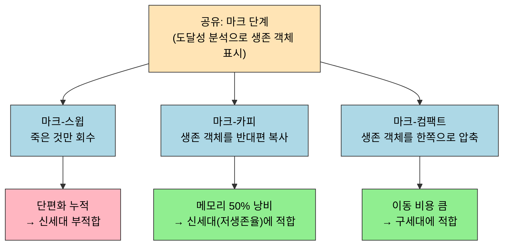
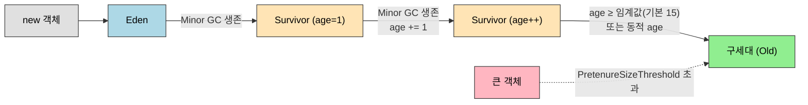

# 가비지 컬렉션 알고리즘
---
> §3.2가 *어떤 객체가 죽었는지* 가리는 일이었다면, §3.3은 *어떻게 회수하는지*다. GC 알고리즘은 단순한 세 종류(마크-스윕, 마크-카피, 마크-컴팩트)에서 시작하고, *세대별 가설*을 통해 자바 힙을 영역별로 나눠 다른 알고리즘을 *섞어 쓰는* 방향으로 확장된다. 본 노트는 세 기본 알고리즘과 세대별 GC의 전제, 그리고 그 둘을 잇는 *카드 테이블*과 *세대 간 참조* 문제까지 다룬다. 본 절을 한 줄로 압축하면 — **세 알고리즘 중 어느 하나도 단독으로 우수하지 않으며, 자바 힙은 *세대를 나눠 다른 알고리즘을 섞어 쓰는* 방향으로 진화했다**. 그 결합을 가능하게 한 다리가 카드 테이블이다.

## 1. 세 가지 기본 알고리즘

세 알고리즘 모두 *마크-X* 라는 이름에서 보듯 **마크 단계**를 공유한다. 도달성 분석으로 살아 있는 객체를 *표시*하고, 그 뒤 어떻게 빈 공간을 만들지에서 갈라진다.

### 1.1 마크-스윕 (Mark-Sweep)

> 가장 단순한 방식. 살아 있는 객체를 표시한 뒤 *죽은 객체만 회수*한다.

```
초기:  [A][B][C][D][E][F]
마크:  [A][B][ ][D][ ][F]   (C, E 회수 대상)
스윕:  [A][B][_][D][_][F]   (빈 칸 남김)
```

장점은 단순함이다. 살아 있는 객체를 *옮기지 않으므로* 참조 갱신이 필요 없다.

단점 두 가지가 분명하다. **단편화**가 누적된다 — 회수 후 메모리가 *듬성듬성 빈* 모양이 되어, 큰 객체를 할당할 때 *연속된 공간*을 찾지 못해 다시 GC가 도는 악순환이 생긴다. **두 번 순회**한다 — 마크 단계와 스윕 단계 모두 *전체 객체*를 훑어야 하므로 회수 시간이 객체 수에 비례한다.

### 1.2 마크-카피 (Mark-Copying)

> 메모리를 둘로 나눠 한쪽만 쓰고, GC 때 살아 있는 객체만 *반대편으로 옮긴다*.

```
초기:  [A][B][_][D][_][F] | [_][_][_][_][_][_]   (왼쪽만 사용)
마크:  [A][B][ ][D][ ][F] |
복사:  [_][_][_][_][_][_] | [A][B][D][F][_][_]   (살아 있는 것만 오른쪽으로)
스왑:  [A][B][D][F][_][_] | [_][_][_][_][_][_]   (역할 교환)
```

장점은 두 가지. **단편화가 없다** — 살아 있는 객체를 *순서대로* 새 영역에 채우므로 빈 공간이 끝에 깔끔히 모인다. **할당이 빠르다** — Bump-the-pointer로 새 객체를 끝에 추가하면 끝.

단점은 *메모리의 절반이 항상 비어 있다*는 점이다. 가용 메모리의 50%만 실제 사용된다.

이 단점은 **세대별 GC의 신세대 영역**에서 *생존율이 낮다*는 관찰로 우회된다. 신세대 객체 대부분은 곧 죽으므로 *살아 있는 비율이 10% 안팎으로 낮다*. 핫스팟은 신세대를 Eden (80%) + Survivor 두 개 (각 10%) 로 나누고, 매 minor GC 때 Eden + 사용 중인 Survivor 에서 살아 있는 객체를 *비어 있는 Survivor*로 옮긴다. 메모리 사용률을 90%로 끌어올리는 트릭이다.

### 1.3 마크-컴팩트 (Mark-Compact)

> 살아 있는 객체를 *한쪽 끝으로 모은 뒤*, 그 너머를 회수한다.

```
초기:  [A][B][_][D][_][F]
마크:  [A][B][ ][D][ ][F]
컴팩트:[A][B][D][F][_][_]   (한 방향으로 압축)
```

단편화도 없고 메모리 낭비도 없다. 그러나 *살아 있는 객체를 모두 옮겨야* 한다 — 마크-스윕보다 *마크 시간 + 이동 시간*이 든다.

마크-컴팩트는 **구세대**에 적합하다. 구세대는 객체 대부분이 *살아 있으므로* 마크-카피의 50% 낭비를 감당할 수 없다. 단편화는 누적되면 큰 객체 할당이 실패하므로 *주기적으로 정리*해야 한다. 따라서 핫스팟의 클래식 구세대 GC(Serial Old, Parallel Old)는 마크-컴팩트를 쓴다. CMS는 예외 — 마크-스윕만 쓰고 *단편화가 한계에 이르면 Full GC로 컴팩트*하는 *지연 컴팩트* 전략을 택했다.

세 알고리즘이 공유 마크 단계 뒤에서 어떻게 갈라지는지, 그리고 각자의 한계가 무엇인지 한 그림으로 보면 다음과 같다.



## 2. 세대별 컬렉션 알고리즘 — *약한 세대 가설* 의 활용

> 살아 있는 객체의 *생존 시간 분포*가 *극단적으로 불균등*하다는 관찰이 세대별 GC의 출발점이다.

**약한 세대 가설**(Weak Generational Hypothesis)은 두 명제로 압축된다.

1. *대부분의 객체는 짧게 살고 죽는다*.
2. *오래 산 객체는 더 오래 살 가능성이 크다*.

이 가설이 맞다면, 객체의 *나이*에 따라 GC 정책을 달리하는 것이 효율적이다.

| 세대 | 가설 위에서의 성격 | 적합한 알고리즘 |
|------|------------------|---------------|
| 신세대 (Young) | 대부분 곧 죽음, *살아 있는 비율 낮음* | 마크-카피 (50% 낭비 감수 가능) |
| 구세대 (Old) | 살아남은 객체가 더 오래 삶 | 마크-컴팩트 (또는 CMS처럼 마크-스윕 + 지연 컴팩트) |

신세대 GC는 *자주, 빠르게* 돈다 — Minor GC. 구세대 GC는 *드물게, 길게* 돈다 — Major GC / Full GC. 두 영역이 같은 자바 힙 안에 있더라도 *알고리즘과 빈도가 다르다*.

### 2.1 객체의 승격 — Eden → Survivor → Old

핫스팟의 신세대는 Eden + Survivor 두 개로 나뉜다. 객체의 일생을 따라가 본다.

1. **할당** — 새 객체는 *Eden*에 만들어진다 (TLAB이 있다면 그 안에서).
2. **첫 Minor GC** — Eden 에서 살아 있는 객체가 *비어 있는 Survivor (S1)* 로 복사된다. *복사된 객체의 age는 1*.
3. **다음 Minor GC** — Eden + S1 에서 살아 있는 객체가 다른 Survivor (S0) 로 복사된다. age += 1.
4. **승격** — age가 임계값(`-XX:MaxTenuringThreshold`, 기본 15) 을 넘으면 *구세대*로 승격된다. 또는 Survivor 가 *한 번에* 큰 객체로 가득 차면 *동적 age*로 승격이 결정된다 — Survivor 공간의 절반 이상이 같은 age로 차면 그 age 이상의 모든 객체를 즉시 승격.

객체 하나가 할당부터 승격까지 거치는 경로를 보면 다음과 같다. Minor GC 를 넘길 때마다 Survivor 사이를 오가며 age 가 오르고, 임계값을 넘으면 구세대로 옮겨 간다.



### 2.2 큰 객체는 곧장 구세대로 — Pretenure Size Threshold

큰 배열·문자열은 *Eden을 거치지 않고* 곧장 구세대에 만들어진다. `-XX:PretenureSizeThreshold` 옵션으로 임계값을 정한다 (기본은 GC 종류마다 다름). 큰 객체가 Eden 에서 Survivor 로 복사되는 비용이 *복사 자체보다 크기 때문*이다.

### 2.3 세대 간 참조 — 카드 테이블의 등장

신세대 GC가 *신세대만* 본다고 하면 한 가지 문제가 생긴다. **구세대 객체가 신세대 객체를 참조**할 때, 신세대 객체는 GC Root가 아닌 *구세대* 에서 도달 가능하다. 신세대 GC가 이 객체를 *죽었다*고 잘못 판정하면 안 된다.

해결 방법 둘:

1. **전수 조사** — 구세대 전체를 매 Minor GC 때마다 스캔. 정확하지만 *너무 느리다*. 구세대가 크면 Minor GC가 Minor가 아니게 된다.
2. **카드 테이블** — 구세대를 *512바이트 단위 카드*로 나누고, *카드 안의 객체가 신세대를 참조하면 그 카드를 dirty 마크*. Minor GC는 *dirty 카드만* 스캔한다.

핫스팟은 두 번째 방식을 채택했고, *쓰기 장벽*(Write Barrier)으로 카드의 dirty 마크를 유지한다 — 객체 필드에 *참조 대입*이 일어날 때마다 그 객체가 속한 카드를 dirty 로 표시. 디테일은 §3.4 노트(01-03)에서 다룬다.

## 3. 한 줄로 정리

§3.3은 두 층의 결정으로 요약된다.

1. *어떻게 회수할지* — 마크-스윕(빠르지만 단편화), 마크-카피(낭비지만 깔끔), 마크-컴팩트(완벽하지만 느림). 셋 다 한계가 명확하다.
2. *어느 영역에 어떤 알고리즘을 쓸지* — 약한 세대 가설을 받아들이고 신세대(마크-카피) + 구세대(마크-컴팩트 or 마크-스윕)로 나눈다. 그 위에 세대 간 참조 문제를 *카드 테이블*로 푼다.

다음 노트(01-03)는 이 알고리즘을 *핫스팟이 실제로 어떻게 구현했는지* — OopMap, 안전 지점, 안전 영역, 카드 테이블, 기억 집합, 쓰기 장벽까지 — 다룬다.

## 4. 실습 연결

| 실습 | 위치 | 다루는 것 |
|------|------|---------|
| 신세대 → 구세대 승격 관찰 | `_practice/ch03-gc/allocation/` (예정) | `-XX:+PrintGCDetails` 로 age 임계와 승격 시점을 GC 로그에서 추적 |
| Pretenure Size Threshold | `_practice/ch03-gc/allocation/` (예정) | 임계값 변경하며 큰 객체의 할당 위치 변화 관찰 |


## 관련 문서

- [02-01.대상이 죽었는가](./02-01.대상이%20죽었는가.md) — 본 알고리즘이 *지우기 전*에 살아 있다고 판정한 객체들의 기준
- [02-03.핫스팟 알고리즘 상세 구현](./02-03.핫스팟%20알고리즘%20상세%20구현.md) — 본 노트의 카드 테이블·세대 간 참조 문제를 핫스팟이 어떻게 푸는지
- [02-04.클래식 가비지 컬렉터](./02-04.클래식%20가비지%20컬렉터.md) — 본 알고리즘을 조합한 6+1종 컬렉터의 실체
- [02-05.저지연 가비지 컬렉터](./02-05.저지연%20가비지%20컬렉터.md) — 같은 알고리즘 골격을 *동시 정리·동시 이동*까지 확장한 ZGC·Shenandoah
