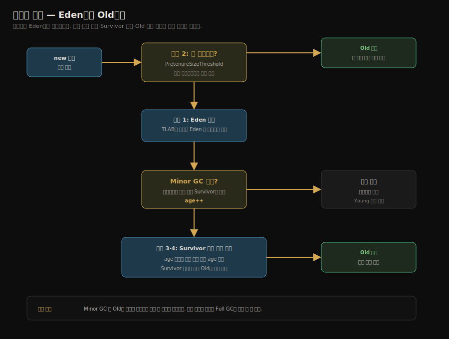
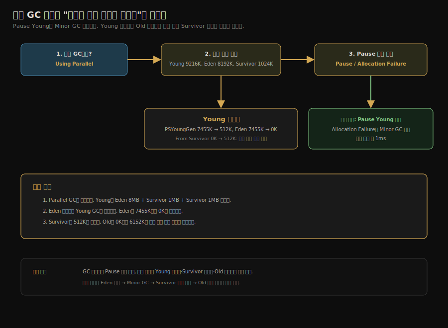
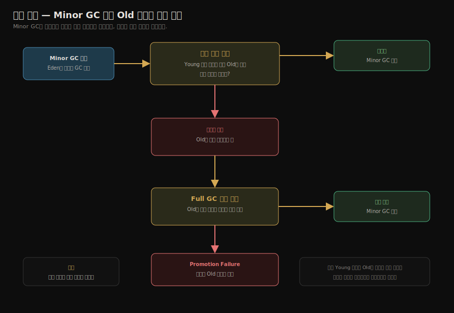
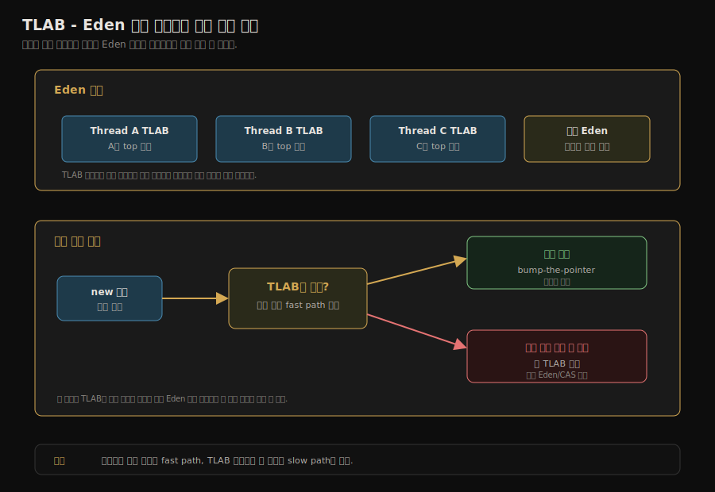

# 실전 — 메모리 할당과 회수 전략
---
> §3.8은 객체의 일생을 코드로 따라간다. *어디에 할당되는가*, *언제 옮겨지는가*, *언제 승격되는가*를 GC 로그로 관찰한다. 본 노트는 책의 다섯 가지 규칙을 정리하고 각각을 실습 코드로 박제한다. 본 절을 한 줄로 압축하면 — **객체의 일생은 Eden 할당 → Survivor 이동 → Old 승격의 세 단계이며, 책의 다섯 규칙이 각 단계의 *예외와 분기*를 모두 덮는다**. GC 로그 한 줄만 읽을 줄 알면 그 분기가 어디서 일어났는지 보인다.

## 1. 다섯 가지 규칙

§3.8이 다루는 메모리 할당 규칙 다섯 가지를 한자리에 모았다.

| # | 규칙 | 옵션 |
|---|------|------|
| 1 | 객체는 Eden 에 우선 할당된다 | (기본 동작) |
| 2 | 큰 객체는 곧장 구세대로 간다 | `-XX:PretenureSizeThreshold` |
| 3 | 오래 산 객체는 구세대로 승격된다 | `-XX:MaxTenuringThreshold` (기본 15) |
| 4 | 동적 age 판정 — Survivor 가 절반 이상 같은 age 객체로 차면 그 age 이상은 즉시 승격 | (기본 켜짐) |
| 5 | 공간 보장 — Minor GC 전에 *구세대에 신세대 전체가 들어갈 공간이 있는지* 확인 | `-XX:+HandlePromotionFailure` (JDK 6 이후 항상 켜짐) |

새 객체 하나가 다섯 규칙을 거쳐 어디에 자리 잡는지 결정 흐름으로 보면 다음과 같다. 크기와 나이라는 두 기준이 할당 위치를 가른다.



다섯 규칙 모두 *생존율이 낮은 신세대*와 *생존율이 높은 구세대*를 가르는 §3.3의 *약한 세대 가설*에 기반한다.

## 2. 규칙 1 — 객체는 Eden 에 우선 할당된다

> 새 객체는 (TLAB이 있다면 그 안에서) Eden 에 만들어진다.

```java
// 책 §3.8.1 발췌
// VM 옵션: -Xms20m -Xmx20m -Xmn10m -Xlog:gc* -XX:SurvivorRatio=8
public class TestAllocation {
    private static final int _1MB = 1024 * 1024;

    public static void main(String[] args) {
        byte[] a1 = new byte[2 * _1MB];
        byte[] a2 = new byte[2 * _1MB];
        byte[] a3 = new byte[2 * _1MB];
        byte[] a4 = new byte[2 * _1MB];
        byte[] a5 = new byte[_1MB];      // 이 시점에 Minor GC
    }
}
```

옵션 해석:
- `-Xmn10m` 신세대 10MB
- `-XX:SurvivorRatio=8` Eden : S0 : S1 = 8:1:1 → Eden 8MB, Survivor 각 1MB

### 흐름

1. a1, a2, a3, a4 까지 약 8MB → Eden 이 거의 찬다
2. a5 (1MB) 할당 시 Eden 에 공간 없음 → Minor GC 발동
3. 살아 있는 객체 중 일부는 Survivor 로 이동한다
4. Survivor 에 못 들어가는 생존 객체는 구세대로 승격된다
5. 그 다음 a5 가 Eden 에 들어간다

GC 로그(`-Xlog:gc*`)에서 다음과 같은 흐름이 보인다:

```
[GC pause (Allocation Failure)... 6144K->6132K(20480K), 0.0030s]
   PSYoungGen: 6144K->504K(9216K)
   ParOldGen: 0K->5628K(10240K)  ← 구세대로 승격됨
```

### JDK 21 실습 로그는 변화량을 읽는다

현재 실습 프로젝트의 실행 위치는 `/Users/simbohyeon/jvm-practice/ch03-gc/allocation/` 입니다. 실행 클래스는 `src/main/java/org/runners/jvm/ch03/allocation/TestAllocation.java` 입니다.

```bash
cd /Users/simbohyeon/jvm-practice/ch03-gc
../gradlew :ch03-gc:allocation:run

rg -n "Using|PSYoungGen|eden space|from space|to   space|ParOldGen|object space|Pause|Full GC" \
  allocation/build/gc.log
```

실제 `allocation/build/gc.log` 에서는 다음 이벤트와 최종 상태가 관찰됩니다.

```text
Using Parallel
GC(0) Pause Young (Allocation Failure)
GC(0) PSYoungGen: 7455K(9216K)->512K(9216K) Eden: 7455K(8192K)->0K(8192K) From: 0K(1024K)->512K(1024K)
GC(0) ParOldGen: 0K(14336K)->6152K(14336K)
GC(0) Pause Young (Allocation Failure) 7M->6M(23M) 약 1ms
```

`Pause Young (Allocation Failure)` 는 Eden 에 새 객체를 담을 공간이 없어 Young GC 가 발생했다는 뜻입니다. `PSYoungGen: 7455K->512K` 는 신세대 사용량이 줄었고, `Eden: 7455K->0K` 는 Eden 이 비워졌다는 뜻입니다. `From: 0K->512K` 는 일부 생존 객체가 Survivor 로 이동했음을 보여 줍니다.



`ParOldGen: 0K(14336K)->6152K(14336K)` 는 구세대 사용량이 0KB에서 6152KB로 늘었고, 구세대 전체 크기는 14336KB라는 뜻입니다. 괄호 앞의 값은 *사용 중인 양*, 괄호 안의 값은 *그 영역의 전체 크기*입니다. Minor GC가 Eden을 비우는 동안 살아 있는 객체를 Survivor에 옮기려 했지만, Survivor는 1MB뿐이라 전부 담을 수 없습니다. 그래서 일부 생존 객체가 구세대로 승격됐고, 그 결과 Old 사용량이 약 6MB 늘었습니다.

## 3. 규칙 2 — 큰 객체는 곧장 구세대로

> Eden → Survivor → Old 의 *복사 비용*이 큰 객체 자체를 만드는 비용보다 크다는 관찰.

`-XX:PretenureSizeThreshold=3145728` (3MB) 로 설정하면, *3MB를 넘는 객체*는 Eden 을 거치지 않고 *구세대에 직접* 만들어진다.

```java
// 책 §3.8.2
// VM 옵션: -Xms20m -Xmx20m -Xmn10m -XX:PretenureSizeThreshold=3145728
public class PretenureSize {
    private static final int _1MB = 1024 * 1024;

    public static void main(String[] args) {
        byte[] big = new byte[4 * _1MB];  // 3MB 초과 → 곧장 구세대
    }
}
```

GC 로그에서 *Eden 에 점유 흔적 없이* 구세대만 늘어난다.

**주의**: `-XX:PretenureSizeThreshold` 실습은 컬렉터 영향을 크게 받습니다. JDK 21 기준으로는 `-XX:+UseSerialGC` 를 함께 지정해 책의 “큰 객체 곧장 구세대” 흐름을 관찰하는 편이 안전합니다. G1·ZGC는 *Humongous 영역*처럼 컬렉터별 큰 객체 처리 경로가 따로 있으므로, 이 옵션으로 같은 결과를 기대하면 안 됩니다.

현재 실습에서는 다음 명령으로 규칙 2를 따로 확인합니다.

```bash
cd /Users/simbohyeon/jvm-practice/ch03-gc
../gradlew :ch03-gc:allocation:runPretenureSize

rg -n "Using|def new generation|eden space|from space|to   space|tenured generation|the space" \
  allocation/build/pretenure-gc.log
```

실제 `allocation/build/pretenure-gc.log` 에서는 다음 상태가 관찰됩니다.

```text
Using Serial
def new generation total 9216K, used 1639K
eden space 8192K, 20% used
from space 1024K, 0% used
to   space 1024K, 0% used
tenured generation total 14336K, used 4096K
```

이 로그는 `4MB` 배열이 신세대가 아니라 구세대에 직접 놓였다는 것을 보여 줍니다. Eden 의 `1639K` 는 애플리케이션 실행 과정에서 생긴 일반 객체 흔적이고, `tenured generation used 4096K` 가 실습 코드의 `byte[4MB]` 와 대응합니다. 규칙 1의 로그가 “Eden 이 차서 Minor GC가 돈다”를 보여 준다면, 규칙 2의 로그는 “큰 객체는 복사를 피하려고 Old에 바로 둔다”를 보여 줍니다.

## 4. 규칙 3 — 오래 산 객체는 승격

> 객체의 age(=Survivor 간 복사 횟수)가 `MaxTenuringThreshold` 를 넘으면 구세대로 승격.

```java
// 책 §3.8.3
// VM 옵션: -Xms20m -Xmx20m -Xmn10m -XX:MaxTenuringThreshold=1 -Xlog:gc*,gc+age=trace
public class TenuringThreshold {
    private static final int _1MB = 1024 * 1024;

    public static void main(String[] args) {
        byte[] a1 = new byte[_1MB / 4];   // 작은 객체, Survivor 에 머물 후보
        byte[] a2 = new byte[4 * _1MB];   // Minor GC 유도
        byte[] a3 = new byte[4 * _1MB];   // 두 번째 Minor GC
        a3 = null;
        a3 = new byte[4 * _1MB];          // 세 번째 Minor GC
    }
}
```

`MaxTenuringThreshold=1` 이면 *age 1*에 도달한 객체가 *바로* 승격된다. GC 로그의 `Desired survivor size` / `New threshold` 가 age 분포를 보여 준다.

```
Desired survivor size 524288 bytes, new threshold 1 (max 1)
- age   1:     412208 bytes,     412208 total
```

`MaxTenuringThreshold` 의 기본값은 *Parallel·G1 등에서 15*다. 즉 *Survivor 간 15번 살아남으면* 구세대 승격이 보장된다.

## 5. 규칙 4 — 동적 age 판정

> *15까지 기다리지 않고* 즉시 승격될 수 있다. Survivor 공간의 절반 이상이 *같은 age* 로 차면 그 age 이상의 모든 객체가 즉시 승격된다.

이 규칙이 없으면 Survivor 가 한 age 의 객체로 *가득 차서* 다음 Minor GC 가 *Survivor 부족*으로 폴백한다. 동적 age 가 *Survivor 점유율을 안정*시킨다.

옵션 변수가 없다 — 항상 켜져 있는 *암묵적 규칙*. 관찰만 가능하다.

## 6. 규칙 5 — 공간 보장

> Minor GC 가 도는 *직전*에, *최악의 경우* (신세대 전부가 구세대로 승격되는 경우) 구세대에 *그만큼의 공간이 있는지* 확인한다.

공간 보장은 실제로 항상 Young 전체가 Old로 간다는 뜻이 아니다.

Minor GC를 시작하기 전에는 생존 객체가 얼마나 될지 정확히 모르므로, *최악의 승격량*을 보수적으로 가정한다는 뜻이다. 구세대 공간이 부족할 것 같으면 *Full GC 를 먼저 돌려* 공간을 확보한 뒤 Minor GC 를 진행한다.



- JDK 6 이전에는 `-XX:+HandlePromotionFailure` 로 켜고 끄는 옵션이었지만, JDK 6 이후로는 *항상 켜져 있다*.
- 여기서 `Promotion Failure`는 Survivor에 못 들어간 생존 객체를 Old로 승격해야 하는데, Old에도 받을 공간이 없어 실패하는 상황을 뜻한다. 단순히 Survivor가 부족해서 Old로 조기 승격되는 것은 실패가 아니다. Old 공간까지 부족해 승격 자체가 막힐 때가 실패다.

공간 보장의 실패가 `Concurrent Mode Failure` (CMS) 또는 `to-space exhausted` (G1) 같은 *심각한 STW 폴백*의 원인이다. 운영 환경에서 그 메시지를 보면 *구세대 회수가 따라가지 못한다*는 신호.

## 7. TLAB — 동시 할당의 동기화를 없애다

> 다섯 규칙은 *어디에* 할당하느냐의 규칙. *어떻게* 동시성을 풀지가 TLAB이다.

**TLAB (Thread Local Allocation Buffer)** 는 스레드 내부의 별도 메모리가 아니라, Eden 의 *작은 조각*을 스레드 *전용*으로 미리 떼어 둔 버퍼다. 그 안에서 객체를 만드는 동안은 *어떤 동기화도 필요 없다* — bump-the-pointer 만 하면 끝.

```java
// Eden 영역
[Thread A's TLAB][Thread B's TLAB][Thread C's TLAB][공유 영역]
   각 스레드는 자기 TLAB 안에서 동기화 없이 할당
```

- TLAB이 가득 차면 새 TLAB을 요청 — 그 *요청*에서만 한 번 동기화. TLAB 안의 *수천 번의 할당*은 모두 *동기화 없이* 처리된다.
- `-XX:+UseTLAB` (기본 켜짐), `-XX:TLABSize=<n>` 으로 크기 조정. 기본은 *적응형* — 스레드의 할당 패턴에 따라 TLAB 크기가 *자동 조정*된다.

한 번의 할당 요청이 TLAB 안에서 끝나는지, 동기화가 필요한 경로로 빠지는지 보면 다음과 같다. 대부분은 동기화 없는 fast path 로 끝난다.



TLAB fast path는 현재 스레드의 TLAB 안에 공간이 있을 때 발생한다. 이때는 다른 스레드와 같은 포인터를 건드리지 않으므로 동기화 없이 top 포인터만 증가시킨다. slow path는 TLAB이 부족해 새 TLAB을 요청하거나, 큰 객체라 TLAB에 넣기 어렵고 공유 Eden 또는 컬렉터별 큰 객체 경로로 빠질 때 발생한다.

## 8. 한 줄로 정리

§3.8은 *객체의 메모리 일생*을 다섯 규칙으로 정리한다. 다섯 규칙은 모두 *생존율이 영역마다 다르다*는 약한 세대 가설을 받아들이고, *Eden → Survivor → Old* 의 흐름을 최적화한다. TLAB는 그 흐름의 *동시성 부담*을 거의 0으로 만든다.

다음 노트(02-08)는 §3.9 마치며 — 3장이 4장 *GC 모니터링 도구*에 거는 토대를 정리한다.

## 9. 실습 연결

실습 프로젝트는 `/Users/simbohyeon/jvm-practice/ch03-gc/` 입니다.

| 위치 | 다루는 규칙 |
|------|------------|
| `allocation/src/main/java/org/runners/jvm/ch03/allocation/TestAllocation.java` | 규칙 1 (Eden 우선) |
| `allocation/src/main/java/org/runners/jvm/ch03/allocation/PretenureSize.java` | 규칙 2 (큰 객체 곧장 구세대) |

현재 실행 명령은 다음 두 가지입니다.

```bash
cd /Users/simbohyeon/jvm-practice/ch03-gc
../gradlew :ch03-gc:allocation:run
../gradlew :ch03-gc:allocation:runPretenureSize
```


## 관련 문서

- [02-02.가비지 컬렉션 알고리즘](./02-02.가비지%20컬렉션%20알고리즘.md) — 세대별 GC의 전제, 본 노트의 다섯 규칙이 의존하는 *세대별 가설*
- [02-03.핫스팟 알고리즘 상세 구현](./02-03.핫스팟%20알고리즘%20상세%20구현.md) — TLAB 동시 할당이 OopMap·카드 테이블과 어떻게 맞물리는지
- [02-04.클래식 가비지 컬렉터](./02-04.클래식%20가비지%20컬렉터.md) — 다섯 규칙이 어느 컬렉터에서 어떻게 다르게 적용되는지
- [02-08.마치며](./02-08.마치며.md) — 3장 전체를 묶어 4장 모니터링 도구로 거는 토대
- [`../_practice/ch03-gc/allocation/`](../_practice/ch03-gc/allocation/) — 다섯 규칙 + TLAB 데모 박제
