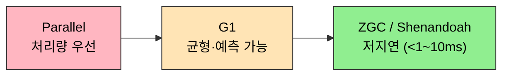

# 마치며 — 3장이 4장 GC 모니터링 도구에 거는 토대
---
> 3장의 마지막 §3.9는 한 페이지로 짧다. 그러나 책 전체에서 3장이 어디에 자리하는지를 한 번 더 정리하고, 4장 *GC 모니터링과 문제 해결 도구*로 넘어가기 위한 시야를 잡는다. 3장 전체를 한 줄로 압축하면 — **GC는 "어느 객체가 죽었는가"라는 도달성 판정 위에 세 알고리즘과 7+2종 컬렉터를 쌓아 올린 곡**이며, 4장은 그 곡이 *지금 내 JVM에서 어떤 박자로 도는지*를 측정한다.

## 1. 3장이 정의한 좌표

§3.2가 *어떤 객체가 죽었는가*에 답했고, §3.3은 *어떻게 회수할 것인가*의 세 알고리즘을 정의했다. §3.4는 핫스팟이 그 알고리즘을 *어떻게 실제로* 돌리는지(OopMap·Safepoint·카드 테이블·쓰기 장벽) 보여 줬고, §3.5와 §3.6은 그 부품을 조합한 *완성된 컬렉터 7종*을 다뤘다. §3.7은 *어느 컬렉터를 언제 쓰는지*의 의사결정 트리를, §3.8은 *객체 일생의 다섯 규칙*을 코드로 따라갔다.

이 모든 답이 4장의 *전제*다. 4장은 *지금 내 JVM이 어떤 GC 패턴을 보이고 있는지* 측정하는 법을 다룬다. 측정의 의미를 알려면 3장에서 정의한 *영역, 알고리즘, 컬렉터, 일생*의 어휘를 먼저 알아야 한다.

| 3장에서 정착시킨 어휘 | 4장에서 활용하는 방식 |
|---------------------|--------------------|
| 도달성·약한 세대 가설 | GC 로그 해석의 기본 |
| 마크-스윕/카피/컴팩트 | 컬렉터별 STW 시간 차이 이해 |
| Safepoint·OopMap | `-XX:+PrintSafepointStatistics` 로 측정 |
| 카드 테이블·쓰기 장벽 | GC 오버헤드 분석 |
| Eden→Survivor→Old | `jstat -gc` 로 영역별 사용량 추적 |
| Pretenure·Tenuring | GC 로그의 `age 분포` 해석 |
| Concurrent Mode Failure | 운영 사고의 신호 |

## 2. 4장으로 가져갈 세 가지 질문

3장을 마무리하면서 들고 갈 질문 세 가지.

1. **GC가 *언제* 그리고 *얼마나* 도는가?** GC 로그의 첫 번째 답이다. 4장의 `jstat`, `-Xlog:gc*`, JFR이 답한다.
2. **GC가 *어느 영역*에서 무엇을 회수하는가?** 4장의 `jmap`, 힙 덤프, MAT 분석이 답한다.
3. **GC가 *왜 길어졌는가*?** 4장의 안전 지점 로그, 쓰기 장벽 비용 측정, `-XX:+PrintReferenceGC` 가 답한다.

세 질문은 *3장에서 정착시킨 어휘 위에서만 의미가 있다*. 본 저장소 05_JVM 에는 4장 노트가 들어올 `ch04_monitoring/` 자리가 예약되어 있다. 책의 4장 스크린샷이 `book/04/` 에 들어올 때 시작한다.

## 3. 3장 노트 요약 인덱스

| 노트 | 핵심 |
|------|------|
| [02-01.대상이 죽었는가](./02-01.대상이%20죽었는가.md) | 도달성 분석·GC Root·약한 참조 4단계·`finalize()` |
| [02-02.가비지 컬렉션 알고리즘](./02-02.가비지%20컬렉션%20알고리즘.md) | 마크-스윕/카피/컴팩트, 약한 세대 가설, 카드 테이블 입문 |
| [02-03.핫스팟 알고리즘 상세 구현](./02-03.핫스팟%20알고리즘%20상세%20구현.md) | OopMap·Safepoint·Safe Region·카드 테이블·쓰기 장벽·3색 마킹 |
| [02-04.클래식 가비지 컬렉터](./02-04.클래식%20가비지%20컬렉터.md) | Serial·ParNew·Parallel·CMS·G1, *세대를 흐리다* |
| [02-05.저지연 가비지 컬렉터](./02-05.저지연%20가비지%20컬렉터.md) | Shenandoah·ZGC, forwarding pointer vs colored pointer |
| [02-06.GC 선택하기](./02-06.GC%20선택하기.md) | 세 가지 우선순위·JDK 디폴트 변천·워크로드별 의사결정 트리 |
| [02-07.실전 — 메모리 할당과 회수 전략](./02-07.실전%20—%20메모리%20할당과%20회수%20전략.md) | 다섯 할당 규칙 + TLAB |
| [01-01.GC 운영 — 로그와 튜닝](./01-01.GC%20운영%20—%20로그와%20튜닝.md) | `-Xlog:gc*` 로그 해석·`jstat`·힙/GC 옵션·튜닝 체크리스트 |

## 3a. GC 구현체 한눈 비교

3장 7개 절을 한 표로 압축하면 다음과 같다. 같은 표를 7개 컬렉터에 통일된 축으로 본다는 것 자체가 마치며의 시야다.

| GC | 목표 | 기본 알고리즘 | STW 특성 | 기본 채택 버전 |
|---|---|---|---|---|
| **Serial GC** | 단순, 단일 스레드 | Mark-Compact | 전체 STW | - |
| **Parallel GC** | 처리량 최대화 | 병렬 Mark-Compact | Young/Old 모두 STW | Java 8 기본 |
| **CMS** | 낮은 지연 | 동시 Mark-Sweep | Old 단계별 일부 동시 | Deprecated |
| **G1 GC** | 예측 가능한 지연 | Region 기반 | 짧고 예측 가능한 STW | Java 9+ 기본 |
| **ZGC** | 서브밀리초 지연 | 컬러드 포인터 + 로드 배리어 | 거의 동시 (< 1ms) | Java 21+ 기본 |
| **Shenandoah** | 낮은 지연 | Brooks 간접 포인터 | 거의 동시 | OpenJDK 12+ |

같은 컬렉터들을 *처리량 ↔ 저지연* 한 축에 늘어놓으면 선택의 트레이드오프가 한눈에 보인다. 왼쪽은 정점 처리량, 오른쪽은 짧은 일시 정지에 무게를 둔다.

## 4. 실습 정리

`_practice/ch03-gc/` 아래 8개 서브모듈(공통 워크로드 + Serial·Parallel·CMS·G1·ZGC·Shenandoah + 할당 데모)이 3장의 핵심 결정 — *컬렉터 선택과 메모리 할당 전략* — 을 직접 손으로 확인하게 한다. 같은 워크로드를 다른 컬렉터로 돌렸을 때 *총 시간*과 *최대 일시 정지*가 어떻게 달라지는지가 핵심 측정점이다.

## 관련 문서

- [01-01](./02-01.대상이%20죽었는가.md) · [01-02](./02-02.가비지%20컬렉션%20알고리즘.md) · [01-03](./02-03.핫스팟%20알고리즘%20상세%20구현.md) · [01-04](./02-04.클래식%20가비지%20컬렉터.md) · [01-05](./02-05.저지연%20가비지%20컬렉터.md) · [01-06](./02-06.GC%20선택하기.md) · [01-07](./02-07.실전%20—%20메모리%20할당과%20회수%20전략.md) — 본 마치며가 묶는 3장의 일곱 정독 노트
- [`./01-01.GC 운영 — 로그와 튜닝.md`](./01-01.GC%20운영%20—%20로그와%20튜닝.md) — `-Xlog:gc*` 해석·`jstat`·튜닝 옵션 (운영 갈래)
- [`../ch02_memory-area/02-04.마치며.md`](../ch02_memory-area/02-04.마치며.md) — 직전 챕터의 마치며 (2장이 3장에 거는 토대 → 본 노트로 자연 연결)
- [`../_practice/ch03-gc/`](../_practice/ch03-gc/) — 8개 서브모듈 (allocation·common·serial·parallel·cms·g1·zgc·shenandoah)
