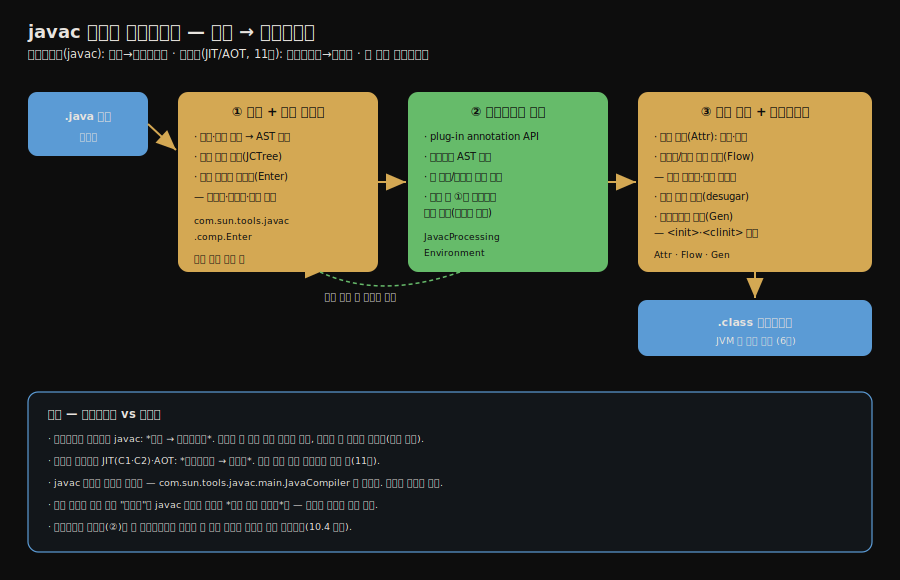

# javac 컴파일러의 컴파일 과정
---
> §10.1~§10.2를 한 줄로 압축하면 — **프론트엔드 컴파일러 `javac`는 자바 소스를 바이트코드로 바꾸며, 그 과정은 파싱과 심볼 테이블 채우기 → 애너테이션 처리 → 의미 분석과 바이트코드 생성의 세 단계입니다.** 핵심은 "javac는 코드를 *빨리 돌게* 만드는 게 아니라 *편하게 쓰게* 만든다(구문 설탕)"는 점과, "실제 속도 최적화는 바이트코드를 기계어로 바꾸는 백엔드(JIT/AOT)의 몫"이라는 구분입니다.

이 글을 읽고 나면 프론트엔드와 백엔드 컴파일러의 역할 차이를 말하고, javac의 세 컴파일 과정을 순서대로 설명하며, 애너테이션 처리가 왜 컴파일 파이프라인 중간에 끼는지 그림 없이 짚을 수 있습니다.

## 진입 — 컴파일러는 하나가 아니다

> 자바에는 두 종류의 컴파일러가 있습니다. 소스를 바이트코드로 바꾸는 프론트엔드와, 바이트코드를 기계어로 바꾸는 백엔드입니다. 이 장은 프론트엔드를 다룹니다.

[3부(7·8·9장)](../ch03_class-loading-mechanism/02-01.클래스%20로딩%20시점과%20생명주기.md)가 *바이트코드를 적재하고 실행하는* 이야기였다면, 4부는 *그 바이트코드가 어떻게 만들어지고 최적화되는가*입니다. 그런데 "컴파일"이라는 말이 두 가지를 가리킵니다.

1. 프론트엔드 컴파일러는 *소스 코드를 바이트코드로* 바꿉니다. `javac`가 대표입니다.
2. 백엔드 컴파일러는 *바이트코드를 기계어로* 바꿉니다. JIT(C1·C2)와 AOT가 여기 속하며, [11장](./02-01.JIT%20컴파일러%20—%20인터프리터와%20계층형%20컴파일.md)의 주제입니다.

이 장(10장)은 프론트엔드, 즉 `javac`를 봅니다. 한 가지 미리 짚을 점은, javac의 "최적화"는 *실행 속도*와 거의 무관하다는 것입니다. javac가 하는 일은 코드를 더 편하게 쓰게 해 주는 *구문 설탕 펼치기*이지, 더 빨리 돌게 만드는 게 아닙니다. 속도 최적화는 백엔드의 몫입니다.

## 1. 프론트엔드와 백엔드의 역할 구분

> 프론트엔드는 소스→바이트코드, 백엔드는 바이트코드→기계어입니다. javac의 최적화는 성능이 아니라 코딩 편의(구문 설탕)를 향합니다.

전체 컴파일 흐름을 한 장으로 압축하면 다음과 같습니다.

javac 자신이 자바로 작성되어 있습니다. 진입점은 `com.sun.tools.javac.main.JavaCompiler`이며, 소스가 공개되어 있어 디버깅하며 들여다볼 수 있습니다. javac의 동작을 *코드 자체로* 확인할 수 있다는 뜻입니다.

자바 언어의 거의 모든 "컴파일 기간 최적화"는 javac가 펼치는 *구문 설탕*입니다. 제네릭·자동 박싱·향상된 for 같은 편의 문법을 컴파일 시점에 더 단순한 바이트코드로 바꿔, 개발자는 편하게 쓰되 JVM은 단순한 형태만 보게 합니다. 이 펼치기는 실행을 빠르게 하는 게 아니라 *표현을 편하게* 합니다. 구문 설탕의 구체적 사례는 [다음 글들](./01-02.자바%20구문%20설탕%20—%20제네릭과%20타입%20소거.md)에서 봅니다.

## 2. 컴파일 과정 — 세 단계

> javac의 컴파일은 파싱과 심볼 테이블 채우기, 애너테이션 처리, 의미 분석과 바이트코드 생성의 세 단계로 진행됩니다.

javac의 컴파일은 크게 세 과정으로 나뉩니다.

### 파싱과 심볼 테이블 채우기

먼저 소스 텍스트를 *추상 구문 트리(AST)*로 만듭니다. 어휘 분석으로 토큰을 끊고, 구문 분석으로 토큰을 트리 구조(`JCTree`)로 조립합니다. 이어 *심볼 테이블 채우기*로 클래스·메서드·변수 같은 심볼을 등록합니다. 이 단계는 코드의 *형태*만 잡으며, 아직 타입이 맞는지 같은 의미 검증은 하지 않습니다.

### 애너테이션 처리

자바는 컴파일 과정에 *플러그인 애너테이션 처리(plug-in annotation processing)*를 끼워 넣을 수 있습니다. 처리기가 AST를 읽어 애너테이션을 분석하고, 필요하면 *새 소스나 클래스를 생성*합니다. 새 코드가 생기면 다시 파싱이 필요하므로, 컴파일이 첫 단계로 되돌아가 *라운드를 반복*합니다. 이 처리기가 개발자가 컴파일 파이프라인에 끼어들 수 있는 유일한 확장 지점이며, [10.4 실전](./01-04.실전%20—%20플러그인%20애너테이션%20처리기.md)에서 직접 만들어 봅니다.

### 의미 분석과 바이트코드 생성

마지막으로 AST에 *의미*를 채우고 바이트코드를 만듭니다.

1. 표준 검사(`Attr`)는 타입이 맞는지, 상수가 올바른지 등 의미를 검증합니다.
2. 데이터·제어 흐름 분석(`Flow`)은 변수가 사용 전 초기화되는지, 모든 경로가 값을 반환하는지, 도달 불가능한 코드가 없는지 같은 흐름을 봅니다.
3. 구문 설탕 제거(desugar)로 제네릭·박싱 같은 편의 문법을 단순한 형태로 펼칩니다.
4. 바이트코드 생성(`Gen`)으로 AST를 바이트코드로 옮깁니다. 이때 `<init>`(인스턴스 초기화)·`<clinit>`(클래스 초기화) 메서드도 컴파일러가 자동으로 삽입합니다.

`<clinit>`는 [3부의 초기화 글](../ch03_class-loading-mechanism/02-03.해석과%20초기화.md)에서 본 그 메서드입니다 — 컴파일러가 `static` 코드를 모아 이 단계에서 생성합니다. 프론트엔드 컴파일과 클래스 로딩이 `<clinit>`라는 한 지점에서 만납니다.

## 3. 면접 대비 요약

> 핵심은 "프론트엔드=소스→바이트코드", "javac 최적화=구문 설탕(성능 아님)", "컴파일 3과정"입니다.

### 한 줄 정의

javac는 자바 소스를 바이트코드로 바꾸는 프론트엔드 컴파일러로, 파싱과 심볼 테이블 채우기·애너테이션 처리·의미 분석과 바이트코드 생성의 세 과정을 거칩니다.

### 핵심 포인트 3가지

1. 프론트엔드(javac)는 소스를 바이트코드로, 백엔드(JIT/AOT)는 바이트코드를 기계어로 바꿉니다. 속도 최적화는 백엔드의 몫입니다.
2. javac의 "최적화"는 실행 속도가 아니라 코딩 편의를 향한 구문 설탕 펼치기입니다.
3. 컴파일은 파싱·심볼 등록 → 애너테이션 처리(라운드 반복 가능) → 의미 분석·바이트코드 생성(`<init>`·`<clinit>` 삽입) 순으로 진행됩니다.

### 면접에서 받을 만한 질문

1. 프론트엔드 컴파일러와 백엔드 컴파일러는 어떻게 다릅니까?
2. javac의 "컴파일 기간 최적화"는 실행 속도를 높입니까?
3. `<clinit>` 메서드는 언제 만들어집니까?

> 세 질문에 *먼저 자답한 뒤* 아래 §정답으로 내려갑니다.

## 정답 (자답 후 펼치기)

> 위 §면접에서 받을 만한 질문의 3개에 *먼저 자답한 뒤* 아래를 읽으세요.

### 정답 1 — 프론트엔드 vs 백엔드

프론트엔드 컴파일러(javac)는 *소스 코드를 바이트코드로* 바꾸고, 백엔드 컴파일러(JIT C1·C2, AOT)는 *바이트코드를 기계어로* 바꿉니다. 실행 속도 최적화는 기계어를 만드는 백엔드의 몫이고, 프론트엔드는 소스를 JVM이 읽는 중립 형식으로 옮기는 역할입니다.

### 정답 2 — javac 최적화와 속도

높이지 않습니다. javac의 "컴파일 기간 최적화"는 제네릭·박싱·향상된 for 같은 *구문 설탕을 펼치는* 일이라, 코드를 더 빨리 돌게 만드는 게 아니라 더 편하게 쓰게 만듭니다. 실행 속도 최적화는 바이트코드를 기계어로 바꾸는 백엔드(JIT/AOT)가 담당합니다.

### 정답 3 — <clinit> 생성 시점

의미 분석과 바이트코드 생성 단계(`Gen`)에서 컴파일러가 자동 삽입합니다. `static` 변수 대입과 `static` 블록을 모아 `<clinit>` 메서드를 만들며, 이는 3부에서 본 클래스 초기화 단계에 실행됩니다. 프론트엔드 컴파일과 클래스 로딩이 이 지점에서 연결됩니다.

## 핵심 개념 체크리스트

- [ ] 프론트엔드와 백엔드 컴파일러의 역할 차이를 말할 수 있는가?
- [ ] javac의 최적화가 성능이 아니라 구문 설탕임을 아는가?
- [ ] javac의 세 컴파일 과정을 순서대로 설명할 수 있는가?
- [ ] 애너테이션 처리가 라운드를 반복할 수 있는 이유를 아는가?
- [ ] `<init>`·`<clinit>`가 어느 단계에서 삽입되는지 아는가?

## 관련 문서

> 이 글은 javac 전체 흐름을 봤고, 다음 글들은 그 흐름이 펼치는 *구문 설탕*의 구체적 사례로 들어갑니다.

- [01-02. 자바 구문 설탕 — 제네릭과 타입 소거](./01-02.자바%20구문%20설탕%20—%20제네릭과%20타입%20소거.md) — 의미 분석 단계가 펼치는 첫 설탕
- [01-04. 실전 — 플러그인 애너테이션 처리기](./01-04.실전%20—%20플러그인%20애너테이션%20처리기.md) — 컴파일 파이프라인에 끼어드는 확장 지점
- [클래스 파일 구조](../ch06_class-file/01-01.클래스%20파일%20구조.md) — javac가 만들어 내는 바이트코드 형식
