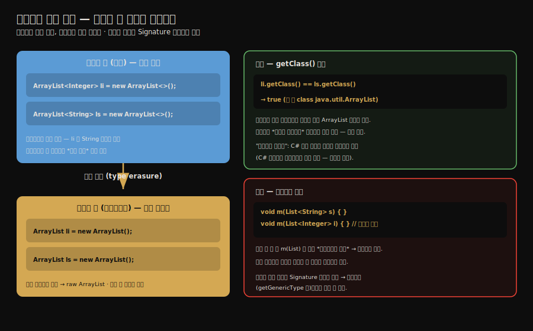

# 자바 구문 설탕 — 제네릭·박싱·조건 컴파일
---
> **제네릭·자동 박싱·향상된 for·조건 컴파일은 모두 컴파일 시점에 펼쳐지는 구문 설탕이며, 제네릭은 타입 소거로 타입 파라미터가 지워지고 자동 박싱은 `Integer.valueOf`가 -128~127을 캐시해 `==` 비교 결과를 미묘하게 바꿉니다.** 
>
> 핵심은 "제네릭은 컴파일 때만 존재하는 검사 장치(타입 소거)라 `List<String>`과 `List<Integer>`는 오버로드할 수 없다"는 함정과, "`Integer 100 == 100`은 `true`지만 `200 == 200`은 `false`"라는 캐시 함정, 그리고 "향상된 for는 Iterator로·조건 컴파일은 상수 분기 제거로 펼쳐진다"는 점입니다.

이 글을 읽고 나면 타입 소거가 무엇인지 설명하고, 같은 제네릭 타입의 두 변수가 왜 런타임에 같은 클래스인지 말하며, 제네릭이 일으키는 시그니처 충돌과 제네릭 정보가 보존되는 자리(Signature 속성)를 짚을 수 있습니다. 나아가 자동 박싱이 일으키는 Integer 캐시 함정을 예제로 설명하고, 향상된 for와 조건 컴파일이 무엇으로 펼쳐지는지 말하며, 왜 래퍼 타입을 `==`로 비교하면 안 되는지 그림 없이 짚을 수 있습니다.


## 진입 — 구문 설탕이란

> [앞 글](./01-01.javac%20컴파일러의%20컴파일%20과정.md)에서 본 javac의 "최적화"는 구문 설탕 펼치기였습니다. 제네릭이 그 첫 사례이고, 자동 박싱·향상된 for·조건 컴파일이 그 뒤를 잇습니다 — 개발자에겐 편의를, JVM에겐 단순한 형태를 줍니다.

구문 설탕(syntactic sugar)은 *개발자가 편하게 쓰도록 만든 문법*으로, 컴파일 시점에 더 단순한 형태로 펼쳐집니다. 

- JVM은 펼쳐진 단순한 형태만 보므로, 편의 문법을 위해 가상 머신을 바꿀 필요가 없습니다. 제네릭은 자바의 대표적 구문 설탕이며, 그 펼치는 방식이 *타입 소거*입니다. 
- 자동 박싱·향상된 for·조건 컴파일도 같은 결의 구문 설탕인데, *어떻게 펼쳐지는지*를 모르면 예상 밖 동작을 만납니다.


## 1. 타입 소거 — 컴파일 후 타입 파라미터가 사라진다

> 제네릭의 타입 파라미터는 컴파일 시점에 지워집니다. `ArrayList<Integer>`와 `ArrayList<String>`은 컴파일 후 둘 다 raw 타입 `ArrayList`가 되어 런타임에 같은 클래스입니다.

자바 제네릭은 *타입 소거(type erasure)* 방식으로 구현됩니다. 컴파일 시점에는 타입 파라미터로 타입 검사를 하지만, 컴파일이 끝나면 그 타입 파라미터를 *지우고* raw 타입으로 바꿉니다.

```java
public class GenericTypes {
    public static void main(String[] args) {
        ArrayList<Integer> li = new ArrayList<>();
        ArrayList<String>  ls = new ArrayList<>();
      
        // 소스에선 다른 타입이지만 런타임엔?
        System.out.println(li.getClass() == ls.getClass());
    }
}
```

- 출력은 **`true`**입니다. `ArrayList<Integer>`와 `ArrayList<String>`이 컴파일 후 둘 다 raw 타입 `ArrayList`가 되어, 런타임에 *같은 클래스 객체*를 공유하기 때문입니다.



- 소스에서는 `li`에 `String`을 넣으면 컴파일러가 에러를 냅니다. 타입 파라미터로 검사하기 때문입니다. 그러나 컴파일이 끝나면 타입 파라미터가 사라지고, 원소를 꺼낼 때는 컴파일러가 *형변환을 자동 삽입*합니다. **제네릭은 *컴파일 시점에만 존재하는* 타입 안전 장치인 셈입니다.**
- 이를 *불완전한 제네릭*이라 부르기도 합니다. C#의 제네릭은 런타임에도 타입 정보를 유지하지만, 자바는 소거 방식이라 런타임에 타입 파라미터가 남지 않습니다. 자바가 이 방식을 택한 것은 기존 라이브러리와의 하위 호환을 위해서입니다 — 제네릭 도입 전 코드와 섞여 돌아야 했습니다.


## 2. 시그니처 충돌 — 오버로드할 수 없는 두 메서드

> 타입 소거 때문에 `List<String>`과 `List<Integer>`를 받는 두 메서드는 컴파일 후 시그니처가 같아져, 오버로드할 수 없습니다.

타입 소거가 일으키는 대표적 함정은 *시그니처 충돌*입니다.

```java
public class GenericMethod {
    // 컴파일 에러 — 두 메서드의 시그니처가 같음
    public static void method(List<String> data) {
        System.out.println("invoke method(List<String>)");
    }
    public static void method(List<Integer> data) {
        System.out.println("invoke method(List<Integer>)");
    }
}
```

- 이 코드는 컴파일되지 않습니다. 소스에서는 `List<String>`과 `List<Integer>`가 다른 타입처럼 보이지만, 타입 소거 후 둘 다 `method(List)`가 되어 *시그니처가 완전히 같아지기* 때문입니다. 자바는 시그니처가 같은 두 메서드를 한 클래스에 둘 수 없으므로 오버로드가 불가능합니다.

겉보기에 구분되는 두 메서드가 컴파일 후 구분이 사라진다는 점이 타입 소거의 본질을 드러냅니다. 타입 파라미터는 *컴파일러의 머릿속에만* 있고, 바이트코드에는 남지 않습니다.


## 3. 제네릭 정보는 어디에 남는가 — Signature 속성

> 타입 파라미터가 바이트코드에서 지워지지만, 제네릭 정보 자체는 `Signature` 속성에 따로 보존되어 리플렉션으로 읽을 수 있습니다.

타입 소거가 타입 파라미터를 지우지만, 제네릭 정보가 *완전히* 사라지는 것은 아닙니다. 컴파일러는 메서드·필드의 제네릭 정보를 클래스 파일의 [`Signature` 속성](../ch06_class-file/01-01.클래스%20파일%20구조.md)에 따로 기록합니다.

이 속성 덕분에 리플렉션으로는 제네릭 타입을 읽을 수 있습니다. 

- `Method.getGenericReturnType()`이나 `Field.getGenericType()` 같은 API가 `Signature` 속성을 읽어 `List<String>` 같은 제네릭 타입을 복원합니다. 
- 즉 제네릭 정보는 *실행 로직*에서는 지워지지만 *메타데이터*로는 남아, 프레임워크가 리플렉션으로 활용할 수 있습니다. Jackson이 JSON을 제네릭 컬렉션으로 역직렬화할 수 있는 것도 이 속성 덕입니다.


## 4. 자동 박싱과 Integer 캐시 함정

> 자동 박싱은 `Integer.valueOf`로 펼쳐지는데, `valueOf`는 -128~127을 캐시해 같은 객체를 돌려줍니다. 그래서 `==` 비교가 캐시 범위 안에서는 `true`, 밖에서는 `false`가 됩니다.

`int`와 `Integer`를 자유롭게 섞어 쓰게 해 주는 자동 박싱은 편리하지만, 그 편리함 뒤에 `Integer` 캐시라는 함정이 숨어 있습니다.


자동 박싱(autoboxing)은 `int`를 `Integer`로 자동 변환하는 구문 설탕입니다. 컴파일러는 이를 `Integer.valueOf(int)` 호출로 펼칩니다. 그런데 `valueOf`에는 캐시가 있습니다.

```java
public class AutoBoxing {
    public static void main(String[] args) {
        Integer a = 100, b = 100;
        Integer c = 200, d = 200;
        System.out.println(a == b);   // 무엇이 나올까?
        System.out.println(c == d);
    }
}
```

출력은 `true`와 **`false`**입니다. 같은 값을 비교하는데 결과가 갈립니다. 이유는 `Integer.valueOf`의 캐시 때문입니다.

`valueOf`는 -128부터 127까지의 값에 대해 *미리 만들어 둔 캐시 객체*를 돌려줍니다. 그 밖의 값은 매번 `new Integer`로 새 객체를 만듭니다. 그리고 `==`는 *값*이 아니라 *참조*를 비교합니다.

1. `100`은 캐시 범위(-128~127) 안이라, `a`와 `b`가 *같은 캐시 객체*를 가리킵니다. 참조가 같으니 `a == b`는 `true`입니다.
2. `200`은 캐시 범위 밖이라, `c`와 `d`가 *각각 새 객체*가 됩니다. 참조가 다르니 `c == d`는 `false`입니다.

교훈은 분명합니다. **래퍼 타입은 `==`로 비교하지 않습니다.** 캐시 범위에 따라 결과가 달라지는 미묘한 버그가 되기 때문입니다. 값을 비교하려면 `.equals()`를 쓰거나, 언박싱해 기본형으로 비교해야 합니다. 작은 값으로 테스트하면 우연히 `true`가 나와 버그를 못 잡고 넘어가기 쉬워, 더 위험합니다.


## 5. 향상된 for — Iterator로 펼쳐진다

> 향상된 for 문은 컴파일 시점에 `Iterator` 호출로 펼쳐집니다. 컬렉션을 순회하는 편의 문법일 뿐, 새 동작이 아닙니다.

향상된 for(enhanced for, for-each)는 컬렉션·배열을 간결하게 순회하는 구문 설탕입니다. 컴파일러는 이를 `Iterator` 기반 반복으로 펼칩니다.

```java
// 설탕 — 소스
for (Integer i : list) {
    sum += i;
}

// 펼친 결과 — 바이트코드 수준
Iterator<Integer> it = list.iterator();
while (it.hasNext()) {
    sum += it.next();   // next() 의 반환은 자동 언박싱
}
```

향상된 for는 `Iterable` 인터페이스의 `iterator()`를 호출해 반복자를 얻고, `hasNext()`·`next()`로 순회합니다. 그래서 향상된 for를 쓰려면 대상이 `Iterable`을 구현해야 합니다. 편의 문법일 뿐 JVM에는 향상된 for라는 개념이 없고, 펼쳐진 `Iterator` 반복만 존재합니다.


## 6. 조건 컴파일 — 상수 분기를 제거한다

> `if(true)`처럼 조건이 컴파일 시점 상수면, 컴파일러가 거짓 가지를 통째로 제거합니다. C·C++의 `#ifdef`를 대체하는 자바의 조건 컴파일입니다.

C·C++에는 `#ifdef` 같은 전처리기 조건 컴파일이 있습니다. 자바에는 전처리기가 없지만, *상수 조건의 분기 제거*로 비슷한 효과를 냅니다.

```java
// 설탕 — 소스
public static void main(String[] args) {
    if (true) {
        System.out.println("block 1");
    } else {
        System.out.println("block 2");   // 도달 불가
    }
}

// 펼친 결과 — else 가지가 통째로 제거됨
public static void main(String[] args) {
    System.out.println("block 1");
}
```

조건이 `true`라는 *컴파일 시점 상수*이므로, 컴파일러는 `else` 가지가 절대 실행되지 않음을 알고 *통째로 제거*합니다. 바이트코드에는 `block 1`만 남습니다. 이 조건 컴파일은 `if` 문의 상수 조건에만 적용되며, 다른 분기 구조(`switch` 등)에는 적용되지 않습니다. 디버그 코드를 상수 플래그로 켜고 끄는 패턴에 쓸 수 있습니다.


## 7. 면접 대비 요약

> 핵심은 "제네릭=타입 소거=컴파일 시점만 존재", "같은 제네릭 = 같은 런타임 클래스", "시그니처 충돌로 오버로드 불가", "Integer 캐시 -128~127로 == 결과가 갈림", "향상된 for=Iterator", "조건 컴파일=상수 분기 제거"입니다.

### 한 줄 정의

제네릭의 타입 소거는 타입 파라미터를 컴파일 시점에 지우고 raw 타입으로 바꾸는 구현 방식이며, 자동 박싱·향상된 for·조건 컴파일도 모두 컴파일 시점에 펼쳐지는 구문 설탕입니다. 그중 자동 박싱의 `Integer.valueOf` 캐시(-128~127)가 `==` 비교 결과를 좌우합니다.

### 핵심 포인트 6가지

1. 제네릭은 구문 설탕이라 컴파일 시점에 타입 파라미터가 지워지고, `ArrayList<Integer>`와 `ArrayList<String>`은 런타임에 같은 `ArrayList` 클래스입니다.
2. 타입 소거 때문에 `List<String>`과 `List<Integer>`를 받는 두 메서드는 시그니처가 같아져 오버로드할 수 없습니다.
3. 제네릭 정보는 `Signature` 속성에 보존되어, 리플렉션(`getGenericType` 등)으로는 제네릭 타입을 읽을 수 있습니다.
4. 자동 박싱은 `Integer.valueOf`로 펼쳐지고, `valueOf`가 -128~127을 캐시하므로 `Integer 100 == 100`은 `true`, `200 == 200`은 `false`입니다.
5. 향상된 for는 `Iterator`(`iterator()`·`hasNext()`·`next()`) 기반 반복으로 펼쳐지므로, 대상이 `Iterable`을 구현해야 합니다.
6. 조건 컴파일은 `if(true)` 같은 상수 조건의 거짓 가지를 컴파일 시점에 제거합니다.

### 면접에서 받을 만한 질문

1. `ArrayList<Integer>`와 `ArrayList<String>`은 런타임에 같은 클래스입니까?
2. `List<String>`과 `List<Integer>`를 받는 두 메서드를 왜 오버로드할 수 없습니까?
3. 타입 소거에도 불구하고 리플렉션으로 제네릭 타입을 읽을 수 있는 이유는 무엇입니까?
4. `Integer 100 == 100`과 `200 == 200`의 결과가 다른 이유는 무엇입니까?
5. 래퍼 타입을 비교할 때 `==` 대신 무엇을 써야 합니까?
6. 향상된 for 문은 컴파일 후 무엇으로 펼쳐집니까?

> 여섯 질문에 *먼저 자답한 뒤* 아래 §정답으로 내려갑니다.


## 정답 (자답 후 펼치기)

> 위 §면접에서 받을 만한 질문의 6개에 *먼저 자답한 뒤* 아래를 읽으세요.

### 정답 1 — 같은 클래스 여부

같은 클래스입니다. 제네릭은 타입 소거 방식이라, 컴파일 후 두 변수 모두 raw 타입 `ArrayList`가 됩니다. 런타임에는 타입 파라미터가 남지 않으므로 `li.getClass() == ls.getClass()`가 `true`입니다.

### 정답 2 — 오버로드 불가 이유

타입 소거 후 `method(List<String>)`과 `method(List<Integer>)`가 둘 다 `method(List)`가 되어 *시그니처가 완전히 같아지기* 때문입니다. 자바는 시그니처가 같은 두 메서드를 한 클래스에 둘 수 없으므로, 소스에서 다른 타입처럼 보여도 오버로드가 불가능합니다.

### 정답 3 — 리플렉션으로 제네릭을 읽는 이유

제네릭 정보가 클래스 파일의 `Signature` 속성에 따로 보존되기 때문입니다. 타입 소거는 *실행 로직*의 타입 파라미터를 지우지만, *메타데이터*로는 제네릭 정보를 남깁니다. `getGenericType`·`getGenericReturnType` 같은 리플렉션 API가 이 속성을 읽어 제네릭 타입을 복원합니다.

### 정답 4 — Integer 비교 결과 차이

`Integer.valueOf`의 캐시 때문입니다. `valueOf`는 -128~127 값에 대해 미리 만든 캐시 객체를 돌려주므로, `100`은 `a`와 `b`가 같은 캐시 객체를 가리켜 `==`가 `true`입니다. `200`은 캐시 범위 밖이라 각각 새 객체가 되어 참조가 다르므로 `==`가 `false`입니다. `==`가 값이 아니라 참조를 비교하기 때문입니다.

### 정답 5 — 래퍼 타입 비교

`.equals()`를 쓰거나 언박싱해 기본형으로 비교합니다. `==`는 참조 비교라 캐시 범위에 따라 결과가 달라지는 버그를 만듭니다. 값의 동등성을 보려면 항상 `.equals()` 또는 기본형 비교를 써야 합니다.

### 정답 6 — 향상된 for의 펼침

`Iterator` 기반 반복으로 펼쳐집니다. `iterable.iterator()`로 반복자를 얻고 `hasNext()`·`next()`로 순회하는 `while` 문이 됩니다. 그래서 향상된 for의 대상은 `Iterable`을 구현해야 하며, JVM에는 향상된 for라는 개념 없이 펼쳐진 `Iterator` 반복만 존재합니다.


## 핵심 개념 체크리스트

- [ ] 타입 소거가 무엇인지 설명할 수 있는가?
- [ ] 같은 제네릭 타입의 두 변수가 런타임에 같은 클래스인 이유를 아는가?
- [ ] 시그니처 충돌로 오버로드가 막히는 사례를 설명할 수 있는가?
- [ ] 자바가 소거 방식을 택한 이유(하위 호환)를 아는가?
- [ ] 제네릭 정보가 `Signature` 속성에 남아 리플렉션으로 읽힘을 아는가?
- [ ] 자동 박싱이 `Integer.valueOf`로 펼쳐짐을 아는가?
- [ ] Integer 캐시 범위(-128~127)와 `==` 결과의 관계를 설명할 수 있는가?
- [ ] 래퍼 타입을 `==`로 비교하면 안 되는 이유를 아는가?
- [ ] 향상된 for가 `Iterator`로 펼쳐짐을 아는가?
- [ ] 조건 컴파일이 상수 분기를 제거하는 방식을 아는가?


## 관련 문서

> 이 글은 자바의 주요 구문 설탕(제네릭·박싱·향상된 for·조건 컴파일)을 모았습니다. 다음 글은 컴파일 파이프라인에 직접 끼어드는 실전(애너테이션 처리기)으로 넘어갑니다.

- [01-03. 실전 — 플러그인 애너테이션 처리기](./01-03.실전%20—%20플러그인%20애너테이션%20처리기.md) — 컴파일 과정에 끼어드는 확장 실습
- [01-01. javac 컴파일러의 컴파일 과정](./01-01.javac%20컴파일러의%20컴파일%20과정.md) § "의미 분석과 바이트코드 생성" — 구문 설탕이 펼쳐지는 단계
- [클래스 파일 구조](../ch06_class-file/01-01.클래스%20파일%20구조.md) § "속성 테이블" — 제네릭 정보가 보존되는 `Signature` 속성
