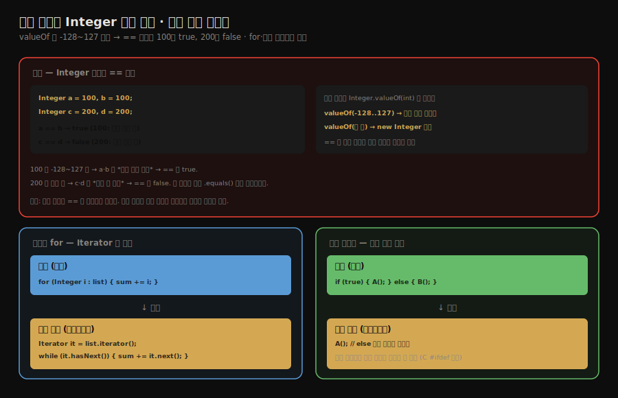

# 자바 구문 설탕 — 박싱·향상된 for·조건 컴파일
---
> §10.3.2~§10.3.3을 한 줄로 압축하면 — **자동 박싱·향상된 for·조건 컴파일도 구문 설탕이며, 그중 자동 박싱은 `Integer.valueOf`로 펼쳐지는데 `valueOf`가 -128~127을 캐시해 `==` 비교 결과를 미묘하게 바꿉니다.** 핵심은 "`Integer 100 == 100`은 `true`지만 `200 == 200`은 `false`"라는 캐시 함정과, "향상된 for는 Iterator로·조건 컴파일은 상수 분기 제거로 펼쳐진다"는 점입니다.

이 글을 읽고 나면 자동 박싱이 일으키는 Integer 캐시 함정을 예제로 설명하고, 향상된 for와 조건 컴파일이 무엇으로 펼쳐지는지 말하며, 왜 래퍼 타입을 `==`로 비교하면 안 되는지 그림 없이 짚을 수 있습니다.


## 진입 — 편리함의 그림자

> [앞 글의 제네릭](./01-02.자바%20구문%20설탕%20—%20제네릭과%20타입%20소거.md)처럼, 자동 박싱·향상된 for·조건 컴파일도 컴파일 시점에 펼쳐지는 구문 설탕입니다. 편리하지만, 펼쳐지는 방식을 모르면 함정에 빠집니다.

구문 설탕은 코드를 편하게 쓰게 해 주지만, *어떻게 펼쳐지는지*를 모르면 예상 밖 동작을 만납니다. 자동 박싱이 그 대표입니다. `int`와 `Integer`를 자유롭게 섞어 쓰게 해 주지만, 그 편리함 뒤에 `Integer` 캐시라는 함정이 숨어 있습니다.




## 1. 자동 박싱과 Integer 캐시 함정

> 자동 박싱은 `Integer.valueOf`로 펼쳐지는데, `valueOf`는 -128~127을 캐시해 같은 객체를 돌려줍니다. 그래서 `==` 비교가 캐시 범위 안에서는 `true`, 밖에서는 `false`가 됩니다.

자동 박싱(autoboxing)은 `int`를 `Integer`로 자동 변환하는 구문 설탕입니다. 컴파일러는 이를 `Integer.valueOf(int)` 호출로 펼칩니다. 그런데 `valueOf`에는 캐시가 있습니다.

```java
public class AutoBoxing {
    public static void main(String[] args) {
        Integer a = 100, b = 100;
        Integer c = 200, d = 200;
        System.out.println(a == b);   // 무엇이 나올까?
        System.out.println(c == d);
    }
}
```

출력은 `true`와 **`false`**입니다. 같은 값을 비교하는데 결과가 갈립니다. 이유는 `Integer.valueOf`의 캐시 때문입니다.

`valueOf`는 -128부터 127까지의 값에 대해 *미리 만들어 둔 캐시 객체*를 돌려줍니다. 그 밖의 값은 매번 `new Integer`로 새 객체를 만듭니다. 그리고 `==`는 *값*이 아니라 *참조*를 비교합니다.

1. `100`은 캐시 범위(-128~127) 안이라, `a`와 `b`가 *같은 캐시 객체*를 가리킵니다. 참조가 같으니 `a == b`는 `true`입니다.
2. `200`은 캐시 범위 밖이라, `c`와 `d`가 *각각 새 객체*가 됩니다. 참조가 다르니 `c == d`는 `false`입니다.

교훈은 분명합니다. **래퍼 타입은 `==`로 비교하지 않습니다.** 캐시 범위에 따라 결과가 달라지는 미묘한 버그가 되기 때문입니다. 값을 비교하려면 `.equals()`를 쓰거나, 언박싱해 기본형으로 비교해야 합니다. 작은 값으로 테스트하면 우연히 `true`가 나와 버그를 못 잡고 넘어가기 쉬워, 더 위험합니다.


## 2. 향상된 for — Iterator로 펼쳐진다

> 향상된 for 문은 컴파일 시점에 `Iterator` 호출로 펼쳐집니다. 컬렉션을 순회하는 편의 문법일 뿐, 새 동작이 아닙니다.

향상된 for(enhanced for, for-each)는 컬렉션·배열을 간결하게 순회하는 구문 설탕입니다. 컴파일러는 이를 `Iterator` 기반 반복으로 펼칩니다.

```java
// 설탕 — 소스
for (Integer i : list) {
    sum += i;
}

// 펼친 결과 — 바이트코드 수준
Iterator<Integer> it = list.iterator();
while (it.hasNext()) {
    sum += it.next();   // next() 의 반환은 자동 언박싱
}
```

향상된 for는 `Iterable` 인터페이스의 `iterator()`를 호출해 반복자를 얻고, `hasNext()`·`next()`로 순회합니다. 그래서 향상된 for를 쓰려면 대상이 `Iterable`을 구현해야 합니다. 편의 문법일 뿐 JVM에는 향상된 for라는 개념이 없고, 펼쳐진 `Iterator` 반복만 존재합니다.


## 3. 조건 컴파일 — 상수 분기를 제거한다

> `if(true)`처럼 조건이 컴파일 시점 상수면, 컴파일러가 거짓 가지를 통째로 제거합니다. C·C++의 `#ifdef`를 대체하는 자바의 조건 컴파일입니다.

C·C++에는 `#ifdef` 같은 전처리기 조건 컴파일이 있습니다. 자바에는 전처리기가 없지만, *상수 조건의 분기 제거*로 비슷한 효과를 냅니다.

```java
// 설탕 — 소스
public static void main(String[] args) {
    if (true) {
        System.out.println("block 1");
    } else {
        System.out.println("block 2");   // 도달 불가
    }
}

// 펼친 결과 — else 가지가 통째로 제거됨
public static void main(String[] args) {
    System.out.println("block 1");
}
```

조건이 `true`라는 *컴파일 시점 상수*이므로, 컴파일러는 `else` 가지가 절대 실행되지 않음을 알고 *통째로 제거*합니다. 바이트코드에는 `block 1`만 남습니다. 이 조건 컴파일은 `if` 문의 상수 조건에만 적용되며, 다른 분기 구조(`switch` 등)에는 적용되지 않습니다. 디버그 코드를 상수 플래그로 켜고 끄는 패턴에 쓸 수 있습니다.


## 4. 면접 대비 요약

> 핵심은 "Integer 캐시 -128~127로 == 결과가 갈림", "향상된 for=Iterator", "조건 컴파일=상수 분기 제거"입니다.

### 한 줄 정의

자동 박싱·향상된 for·조건 컴파일은 모두 컴파일 시점에 펼쳐지는 구문 설탕이며, 자동 박싱의 `Integer.valueOf` 캐시(-128~127)가 `==` 비교 결과를 좌우합니다.

### 핵심 포인트 3가지

1. 자동 박싱은 `Integer.valueOf`로 펼쳐지고, `valueOf`가 -128~127을 캐시하므로 `Integer 100 == 100`은 `true`, `200 == 200`은 `false`입니다.
2. 향상된 for는 `Iterator`(`iterator()`·`hasNext()`·`next()`) 기반 반복으로 펼쳐지므로, 대상이 `Iterable`을 구현해야 합니다.
3. 조건 컴파일은 `if(true)` 같은 상수 조건의 거짓 가지를 컴파일 시점에 제거합니다.

### 면접에서 받을 만한 질문

1. `Integer 100 == 100`과 `200 == 200`의 결과가 다른 이유는 무엇입니까?
2. 래퍼 타입을 비교할 때 `==` 대신 무엇을 써야 합니까?
3. 향상된 for 문은 컴파일 후 무엇으로 펼쳐집니까?

> 세 질문에 *먼저 자답한 뒤* 아래 §정답으로 내려갑니다.


## 정답 (자답 후 펼치기)

> 위 §면접에서 받을 만한 질문의 3개에 *먼저 자답한 뒤* 아래를 읽으세요.

### 정답 1 — Integer 비교 결과 차이

`Integer.valueOf`의 캐시 때문입니다. `valueOf`는 -128~127 값에 대해 미리 만든 캐시 객체를 돌려주므로, `100`은 `a`와 `b`가 같은 캐시 객체를 가리켜 `==`가 `true`입니다. `200`은 캐시 범위 밖이라 각각 새 객체가 되어 참조가 다르므로 `==`가 `false`입니다. `==`가 값이 아니라 참조를 비교하기 때문입니다.

### 정답 2 — 래퍼 타입 비교

`.equals()`를 쓰거나 언박싱해 기본형으로 비교합니다. `==`는 참조 비교라 캐시 범위에 따라 결과가 달라지는 버그를 만듭니다. 값의 동등성을 보려면 항상 `.equals()` 또는 기본형 비교를 써야 합니다.

### 정답 3 — 향상된 for의 펼침

`Iterator` 기반 반복으로 펼쳐집니다. `iterable.iterator()`로 반복자를 얻고 `hasNext()`·`next()`로 순회하는 `while` 문이 됩니다. 그래서 향상된 for의 대상은 `Iterable`을 구현해야 하며, JVM에는 향상된 for라는 개념 없이 펼쳐진 `Iterator` 반복만 존재합니다.


## 핵심 개념 체크리스트

- [ ] 자동 박싱이 `Integer.valueOf`로 펼쳐짐을 아는가?
- [ ] Integer 캐시 범위(-128~127)와 `==` 결과의 관계를 설명할 수 있는가?
- [ ] 래퍼 타입을 `==`로 비교하면 안 되는 이유를 아는가?
- [ ] 향상된 for가 `Iterator`로 펼쳐짐을 아는가?
- [ ] 조건 컴파일이 상수 분기를 제거하는 방식을 아는가?


## 관련 문서

> 이 글로 구문 설탕 사례가 끝납니다. 다음 글은 컴파일 파이프라인에 직접 끼어드는 실전(애너테이션 처리기)으로 넘어갑니다.

- [01-04. 실전 — 플러그인 애너테이션 처리기](./01-04.실전%20—%20플러그인%20애너테이션%20처리기.md) — 컴파일 과정에 끼어드는 확장 실습
- [01-02. 자바 구문 설탕 — 제네릭과 타입 소거](./01-02.자바%20구문%20설탕%20—%20제네릭과%20타입%20소거.md) — 또 다른 구문 설탕인 제네릭
- [01-01. javac 컴파일러의 컴파일 과정](./01-01.javac%20컴파일러의%20컴파일%20과정.md) § "의미 분석과 바이트코드 생성" — 구문 설탕이 펼쳐지는 단계
