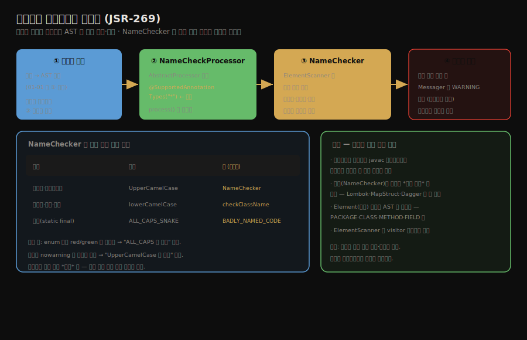

# 실전 — 플러그인 애너테이션 처리기
---
> §10.4~§10.5를 한 줄로 압축하면 — **플러그인 애너테이션 처리(JSR-269)는 컴파일 과정에 끼어들어 구문 트리를 읽고 검사하거나 새 코드를 생성하는 확장 지점이며, 실습 `NameChecker`는 자바 명명 규약 위반을 컴파일 시점 경고로 냅니다.** 핵심은 "애너테이션 처리기가 javac 파이프라인에 개발자가 끼어들 수 있는 유일한 지점"이라는 점과, "`ElementScanner`로 AST를 순회해 코드를 검사한다"는 구조입니다.

이 글을 읽고 나면 플러그인 애너테이션 처리가 컴파일 어디에 끼는지 설명하고, `NameCheckProcessor`가 명명 규약을 검사하는 구조를 말하며, 이 기술이 Lombok 같은 도구의 토대가 되는 이유를 그림 없이 짚을 수 있습니다.


## 진입 — 컴파일에 끼어들기

> [01-01에서 본 javac 3과정](./01-01.javac%20컴파일러의%20컴파일%20과정.md) 중 *애너테이션 처리* 단계가 개발자가 컴파일에 끼어들 수 있는 유일한 확장 지점이었습니다. 이 글은 그 지점에 실제로 코드를 꽂아 봅니다.

[javac 컴파일 과정](./01-01.javac%20컴파일러의%20컴파일%20과정.md)의 두 번째 단계가 애너테이션 처리였습니다. 처리기가 구문 트리를 읽고, 필요하면 새 코드를 생성하며, 생성 시 컴파일이 라운드를 반복한다고 했습니다. 이 단계가 *개발자가 컴파일 파이프라인에 끼어들 수 있는 유일한 확장 지점*입니다. JSR-269가 표준화한 이 플러그인 애너테이션 처리 API를 실습으로 다뤄 봅니다.


## 1. 목표 — 명명 규약 검사기

> 실습 목표는 컴파일 시점에 자바 명명 규약 위반을 잡아 경고하는 `NameChecker`입니다. 클래스는 UpperCamelCase, 메서드·변수는 lowerCamelCase, 상수는 ALL_CAPS여야 합니다.

실습은 *코드 명명 규약 검사기*를 만듭니다. 자바 관례상 클래스는 UpperCamelCase, 메서드·필드·변수는 lowerCamelCase, 상수(`static final`)는 ALL_CAPS_SNAKE로 씁니다. `NameChecker`는 컴파일 시점에 이 규약을 어긴 이름을 찾아 *경고*를 냅니다. 컴파일을 막지는 않고, 잘못된 이름을 알려 주는 도구입니다.




## 2. 코드 구현 — Processor와 Scanner

> `NameCheckProcessor`는 `AbstractProcessor`를 상속해 모든 애너테이션을 처리 대상으로 잡고, `NameChecker`가 `ElementScanner`로 구문 트리를 순회하며 이름을 검사합니다.

구현은 두 부분입니다. 컴파일러와 연결되는 *처리기*와, 실제 검사를 수행하는 *스캐너*입니다.

### NameCheckProcessor — 컴파일러의 진입점

```java
import javax.annotation.processing.*;
import javax.lang.model.element.*;
import javax.lang.model.SourceVersion;
import java.util.Set;

// 모든 애너테이션을 처리 대상으로 — 명명 규약은 애너테이션과 무관하게 전부 검사
@SupportedAnnotationTypes("*")
@SupportedSourceVersion(SourceVersion.RELEASE_8)
public class NameCheckProcessor extends AbstractProcessor {

    private NameChecker nameChecker;

    @Override
    public void init(ProcessingEnvironment processingEnv) {
        super.init(processingEnv);
        // 검사 로직을 담은 NameChecker 준비
        nameChecker = new NameChecker(processingEnv);
    }

    @Override
    public boolean process(Set<? extends TypeElement> annotations,
                           RoundEnvironment roundEnv) {
        // 컴파일러가 라운드마다 이 process 를 호출
        if (!roundEnv.processingOver()) {
            // 이번 라운드의 최상위 요소들을 순회하며 이름 검사
            for (Element element : roundEnv.getRootElements()) {
                nameChecker.checkNames(element);
            }
        }
        return false;   // false: 다른 처리기도 이 애너테이션을 처리하도록 양보
    }
}
```

`@SupportedAnnotationTypes("*")`로 *모든* 애너테이션을 처리 대상으로 잡습니다. 명명 규약은 특정 애너테이션과 무관하게 모든 코드에 적용되기 때문입니다. `process`는 컴파일러가 라운드마다 호출하는 진입점이며, `roundEnv.getRootElements()`로 이번 라운드의 최상위 요소를 받아 `NameChecker`에 넘깁니다.

### NameChecker — ElementScanner로 순회

`NameChecker`는 `ElementScanner`(visitor 패턴)로 구문 트리를 순회하며 각 요소의 이름을 검사합니다.

```java
import javax.lang.model.element.*;
import javax.lang.model.util.ElementScanner8;

private class NameCheckScanner extends ElementScanner8<Void, Void> {

    // 클래스·인터페이스 방문 — UpperCamelCase 검사
    @Override
    public Void visitType(TypeElement e, Void p) {
        checkCamelCase(e, true);          // true: 첫 글자 대문자여야
        super.visitType(e, p);
        return null;
    }

    // 메서드·변수 방문
    @Override
    public Void visitExecutable(ExecutableElement e, Void p) {
        if (e.getKind() == ElementKind.METHOD) {
            checkCamelCase(e, false);     // false: 첫 글자 소문자여야
        }
        super.visitExecutable(e, p);
        return null;
    }

    // 필드·상수 방문 — static final 이면 ALL_CAPS 검사
    @Override
    public Void visitVariable(VariableElement e, Void p) {
        // 상수(enum 상수 포함)는 대문자 규약, 일반 변수는 camelCase
        if (e.getKind() == ElementKind.ENUM_CONSTANT
                || e.getConstantValue() != null
                || isConstant(e)) {
            checkAllCaps(e);              // ALL_CAPS_SNAKE 검사
        } else {
            checkCamelCase(e, false);
        }
        super.visitVariable(e, p);
        return null;
    }
}
```

`ElementScanner`는 코드 요소(`Element`)를 종류별로 방문하는 visitor입니다. 클래스를 만나면 `visitType`, 메서드를 만나면 `visitExecutable`, 변수를 만나면 `visitVariable`이 호출됩니다. 각 메서드가 그 요소의 이름이 규약에 맞는지 검사하고, 어긋나면 `Messager`로 경고를 냅니다. 예를 들어 `enum` 상수가 `red`·`green`처럼 소문자면 "ALL_CAPS가 아님" 경고를, 클래스 이름이 소문자로 시작하면 "UpperCamelCase가 아님" 경고를 냅니다.

여기서 `Element`는 AST를 추상화한 모델입니다. `PACKAGE`·`CLASS`·`METHOD`·`FIELD` 같은 종류로 코드 구조를 표현해, 처리기가 javac 내부 구현에 의존하지 않고 표준 API로 코드를 읽게 합니다.


## 3. 의의 — 컴파일 시점 코드 생성의 토대

> 애너테이션 처리기는 검사뿐 아니라 *코드 생성*도 할 수 있어, Lombok·MapStruct·Dagger 같은 도구의 토대입니다. 런타임 리플렉션보다 빠르고 안전합니다.

`NameChecker`는 *검사*만 하지만, 애너테이션 처리기는 *코드 생성*도 할 수 있습니다. Lombok이 `@Getter`로 getter를 만들고, MapStruct가 매퍼 구현을 만들고, Dagger가 의존성 주입 코드를 만드는 일이 모두 이 위에서 일어납니다. 처리기가 새 소스를 생성하면 컴파일이 라운드를 반복해 그 코드까지 컴파일합니다.

이 방식의 장점은 *컴파일 시점*에 일어난다는 것입니다. 런타임 리플렉션은 실행 중 비용이 들고 타입 안전성이 약하지만, 컴파일 시점 코드 생성은 *컴파일이 끝나면 일반 코드와 똑같아* 런타임 비용이 없고 컴파일러가 타입을 검증합니다. 10.5 마치며는 이렇게 프론트엔드 컴파일을 닫고, 백엔드(JIT/AOT) 컴파일을 다루는 [11장](./02-01.JIT%20컴파일러%20—%20인터프리터와%20계층형%20컴파일.md)으로 넘어갑니다.


## 4. 면접 대비 요약

> 핵심은 "애너테이션 처리=컴파일 확장 지점", "ElementScanner로 AST 순회", "Lombok 등의 토대(런타임 아닌 컴파일 시점)"입니다.

### 한 줄 정의

플러그인 애너테이션 처리(JSR-269)란 컴파일 과정에 끼어들어 구문 트리를 읽고 검사하거나 새 코드를 생성하는 확장 메커니즘으로, `AbstractProcessor`를 상속해 구현합니다.

### 핵심 포인트 3가지

1. 애너테이션 처리는 javac 컴파일 파이프라인에 개발자가 끼어들 수 있는 유일한 확장 지점이며, `AbstractProcessor.process`가 진입점입니다.
2. `NameChecker`는 `ElementScanner`(visitor 패턴)로 구문 트리를 순회하며 클래스·메서드·상수의 명명 규약을 검사해 경고를 냅니다.
3. 처리기는 검사뿐 아니라 코드 생성도 할 수 있어 Lombok·MapStruct의 토대이며, 컴파일 시점에 일어나 런타임 비용이 없습니다.

### 면접에서 받을 만한 질문

1. 애너테이션 처리기는 컴파일 과정의 어느 단계에 끼어듭니까?
2. `NameChecker`는 어떻게 코드를 순회하며 이름을 검사합니까?
3. 컴파일 시점 애너테이션 처리가 런타임 리플렉션보다 나은 점은 무엇입니까?

> 세 질문에 *먼저 자답한 뒤* 아래 §정답으로 내려갑니다.


## 정답 (자답 후 펼치기)

> 위 §면접에서 받을 만한 질문의 3개에 *먼저 자답한 뒤* 아래를 읽으세요.

### 정답 1 — 애너테이션 처리의 위치

javac 컴파일의 두 번째 단계인 *애너테이션 처리* 단계에 끼어듭니다. 파싱과 심볼 테이블 채우기 다음, 의미 분석과 바이트코드 생성 이전입니다. 이 단계가 개발자가 컴파일 파이프라인에 끼어들 수 있는 유일한 확장 지점이며, 처리기가 새 코드를 생성하면 컴파일이 라운드를 반복합니다.

### 정답 2 — NameChecker의 순회

`ElementScanner`라는 visitor로 구문 트리를 순회합니다. 클래스를 만나면 `visitType`, 메서드를 만나면 `visitExecutable`, 변수를 만나면 `visitVariable`이 호출되어 각 요소의 이름이 규약(UpperCamelCase·lowerCamelCase·ALL_CAPS)에 맞는지 검사하고, 어긋나면 `Messager`로 경고를 냅니다. `Element` 모델이 AST를 추상화해 표준 API로 코드를 읽게 합니다.

### 정답 3 — 컴파일 시점 처리의 장점

런타임 비용이 없고 타입이 검증된다는 점입니다. 런타임 리플렉션은 실행 중 비용이 들고 타입 안전성이 약하지만, 컴파일 시점 코드 생성은 컴파일이 끝나면 일반 코드와 똑같아져 런타임 오버헤드가 없고 컴파일러가 타입을 검증합니다. Lombok·MapStruct가 이 방식을 쓰는 이유입니다.


## 핵심 개념 체크리스트

- [ ] 애너테이션 처리가 컴파일의 어느 단계에 끼는지 아는가?
- [ ] `AbstractProcessor`와 `process` 메서드의 역할을 아는가?
- [ ] `@SupportedAnnotationTypes("*")`가 모든 애너테이션을 잡는 이유를 아는가?
- [ ] `ElementScanner`의 visitor 순회 방식을 설명할 수 있는가?
- [ ] 컴파일 시점 처리가 Lombok 등의 토대이며 런타임보다 나은 이유를 아는가?


## 관련 문서

> 이 글로 10장과 4부 프론트엔드 컴파일이 마무리됩니다. 컴파일 과정과 클래스 초기화가 앞을 받칩니다.

- [01-01. javac 컴파일러의 컴파일 과정](./01-01.javac%20컴파일러의%20컴파일%20과정.md) § "애너테이션 처리" — 이 처리기가 끼어드는 단계
- [01-03. 자바 구문 설탕 — 박싱·향상된 for·조건 컴파일](./01-03.자바%20구문%20설탕%20—%20박싱·향상된%20for·조건%20컴파일.md) — 같은 의미 분석 단계가 펼치는 설탕
- [클래스 로딩 시점과 생명주기](../ch03_class-loading-mechanism/02-01.클래스%20로딩%20시점과%20생명주기.md) — 컴파일된 클래스가 적재·초기화되는 다음 단계
