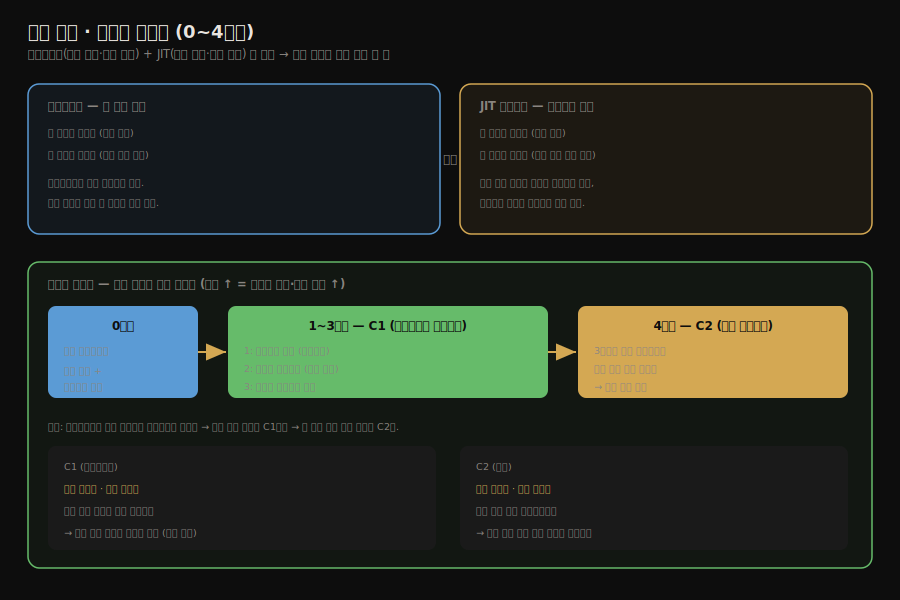

# JIT 컴파일러 — 인터프리터와 계층형 컴파일
---
> §11.1~§11.2.1을 한 줄로 압축하면 — **백엔드 컴파일은 실행 중에 자주 도는 코드를 기계어로 바꾸는 JIT 컴파일이며, HotSpot은 인터프리터와 두 컴파일러(C1·C2)를 함께 쓰는 혼합 모드로 시작 속도와 최고 성능을 모두 챙깁니다.** 핵심은 "인터프리터는 즉시 실행하지만 느리고, JIT는 컴파일 비용이 들지만 빠르다"는 트레이드오프와, "계층형 컴파일이 0~4단계로 둘의 장점을 잇는다"는 점입니다.

이 글을 읽고 나면 프론트엔드 컴파일과 백엔드 컴파일이 어떻게 다른지 말하고, HotSpot이 인터프리터와 JIT를 함께 쓰는 이유를 설명하며, C1과 C2가 무엇을 맡고 계층형 컴파일이 어떤 단계로 둘을 잇는지 짚을 수 있습니다.

## 진입 — 컴파일은 한 번이 아니다

> [앞 장의 javac](./01-01.javac%20컴파일러의%20컴파일%20과정.md)가 소스를 바이트코드로 바꾸는 *프론트엔드* 컴파일이라면, 이 장은 바이트코드를 실행 중에 기계어로 바꾸는 *백엔드* 컴파일을 다룹니다. 같은 "컴파일"이라는 말이 가리키는 대상이 다릅니다.

자바에서 "컴파일"은 두 단계로 나뉩니다. javac가 `.java`를 `.class`(바이트코드)로 바꾸는 단계가 *프론트엔드 컴파일*이고, JVM이 실행 중에 바이트코드를 기계어로 바꾸는 단계가 *백엔드 컴파일*입니다. 프론트엔드는 프로그램을 실행하기 *전에* 한 번 끝나지만, 백엔드는 프로그램이 *도는 동안* 일어납니다. 그래서 백엔드 컴파일을 적시 컴파일, 곧 JIT(Just-In-Time) 컴파일이라 부릅니다.

## 1. 인터프리터와 컴파일러 — 두 실행 방식의 트레이드오프

> 인터프리터는 바이트코드를 한 줄씩 해석해 즉시 실행합니다. JIT 컴파일러는 자주 도는 코드를 기계어로 번역해 두고 그것을 실행합니다. 전자는 시작이 빠르고, 후자는 최고 속도가 빠릅니다.

JVM이 바이트코드를 실행하는 방법은 두 가지입니다.

*인터프리터*는 바이트코드를 한 줄씩 읽어 그때그때 해석해 실행합니다. 프로그램이 시작하면 곧바로 실행에 들어갈 수 있어 *시작이 빠릅니다*. 대신 같은 코드를 백만 번 돌아도 매번 해석을 되풀이하므로 *실행 자체는 느립니다*.

*JIT 컴파일러*는 자주 실행되는 코드를 통째로 기계어(네이티브 코드)로 번역해 메모리에 저장해 두고, 다음부터는 그 기계어를 직접 실행합니다. 번역하는 동안 시간이 걸려 *시작은 느리지만*, 한 번 번역해 두면 해석 과정 없이 바로 도니 *실행이 빠릅니다*.

둘은 정반대의 장단점을 가집니다. 그래서 HotSpot 가상 머신은 둘 중 하나만 고르지 않고 *함께* 씁니다. 이를 **혼합 모드(mixed mode)**라 합니다. 프로그램이 시작하면 인터프리터가 즉시 실행을 맡아 시작 지연을 없애고, 그동안 어느 코드가 자주 도는지 관찰하다가 *자주 도는 부분만* JIT로 컴파일해 그 부분의 속도를 끌어올립니다. `java -version`을 실행하면 `mixed mode`라는 표시로 이 모드가 켜져 있음을 확인할 수 있습니다.

## 2. 두 컴파일러 — C1과 C2

> HotSpot에는 컴파일러가 둘 있습니다. C1(클라이언트 컴파일러)은 빠르게 컴파일하되 최적화가 가볍고, C2(서버 컴파일러)는 느리게 컴파일하되 최적화가 깊습니다.

HotSpot은 JIT 컴파일러를 하나가 아니라 둘 둡니다. 목적이 다르기 때문입니다.

**C1(클라이언트 컴파일러)**은 컴파일을 *빠르게* 끝내는 데 무게를 둡니다. 최적화를 가볍게만 적용해 컴파일에 드는 시간을 줄입니다. 그래서 시작 속도가 중요한 데스크톱·짧은 프로그램에 어울립니다.

**C2(서버 컴파일러)**는 컴파일에 시간이 더 걸리더라도 *깊은 최적화*를 적용해 *최고 실행 성능*을 뽑아냅니다. 오래 도는 서버 애플리케이션처럼, 컴파일 비용을 한 번 치르고 나면 그 뒤로 오래 이득을 보는 코드에 어울립니다.

둘은 최적화의 깊이와 컴파일 속도를 맞바꾼 관계입니다. C1은 *빠른 컴파일·얕은 최적화*, C2는 *느린 컴파일·깊은 최적화*입니다. 어느 하나가 항상 낫지 않고, 코드가 얼마나 오래 도느냐에 따라 유리한 쪽이 달라집니다.

## 3. 계층형 컴파일 — 0~4단계로 둘을 잇는다

> 계층형 컴파일은 인터프리터·C1·C2를 0~4단계로 묶어, 시작은 빠르게 하면서 자주 도는 코드는 점점 깊이 최적화합니다. 단계가 올라갈수록 컴파일 비용과 실행 성능이 함께 커집니다.

C1과 C2를 양자택일하면 한쪽 장점을 버려야 합니다. **계층형 컴파일(tiered compilation)**은 둘을 *단계로 잇습니다*. 인터프리터에서 시작해, 코드가 자주 돌수록 더 깊은 최적화 단계로 끌어올립니다. 단계는 0부터 4까지입니다.

| 단계 | 실행 방식 | 프로파일 수집 |
|------|-----------|---------------|
| 0 | 순수 인터프리터 | 수집 |
| 1 | C1 컴파일 | 없음 (최적화만) |
| 2 | C1 컴파일 | 가벼운 프로파일 (메서드·루프 호출 횟수) |
| 3 | C1 컴파일 | 완전한 프로파일 |
| 4 | C2 컴파일 | (3단계가 모은 프로파일을 활용) |

흐름은 이렇습니다. 처음에는 0단계, 곧 인터프리터로 실행하면서 *프로파일 정보*(어느 분기를 자주 타는지, 어떤 타입이 자주 오는지)를 모읍니다. 코드가 자주 돌기 시작하면 C1으로 컴파일해(1~3단계) 속도를 올립니다. 그중 3단계는 완전한 프로파일을 함께 모으는데, 코드가 *더* 자주 돌면 그 프로파일을 밑천 삼아 C2가 4단계로 깊이 최적화합니다.

이 구조의 이점은 분명합니다. 시작은 인터프리터(0단계)로 즉시 하고, 잠깐 도는 코드는 C1(1~3단계)에서 멈춰 컴파일 비용을 아끼며, *진짜로 오래 도는 핵심 코드*만 C2(4단계)까지 끌어올려 최고 성능을 줍니다. 단계가 올라갈수록 컴파일에 드는 비용도, 그 코드의 실행 성능도 함께 커집니다. 인터프리터가 모은 프로파일이 C2의 깊은 최적화를 가능하게 하므로, 둘은 경쟁이 아니라 협력 관계입니다.

## 4. 면접 대비 요약

> 핵심은 "프론트엔드=javac, 백엔드=JIT", "혼합 모드로 인터프리터+JIT 병용", "C1=빠른 컴파일, C2=깊은 최적화, 계층형 0~4단계로 연결"입니다.

### 한 줄 정의

백엔드 컴파일은 실행 중에 자주 도는 바이트코드를 기계어로 바꾸는 JIT 컴파일이며, HotSpot은 인터프리터와 C1·C2 두 컴파일러를 계층형 컴파일(0~4단계)로 엮어 시작 속도와 최고 성능을 모두 얻습니다.

### 핵심 포인트 3가지

1. 프론트엔드 컴파일(javac, 소스→바이트코드)과 백엔드 컴파일(JIT, 바이트코드→기계어)은 일어나는 시점이 다릅니다. 전자는 실행 전, 후자는 실행 중입니다.
2. 인터프리터는 시작이 빠르고 실행이 느린 반면 JIT는 시작이 느리고 실행이 빠릅니다. HotSpot은 혼합 모드로 둘을 함께 써 양쪽 장점을 취합니다.
3. C1(클라이언트, 빠른 컴파일·얕은 최적화)과 C2(서버, 느린 컴파일·깊은 최적화)를 계층형 컴파일 0~4단계로 이어, 자주 도는 코드일수록 더 깊이 최적화합니다.

### 면접에서 받을 만한 질문

1. 프론트엔드 컴파일과 백엔드 컴파일은 무엇이 다릅니까?
2. HotSpot이 인터프리터와 JIT를 함께 쓰는 이유는 무엇입니까?
3. C1과 C2는 각각 무엇을 우선하며, 계층형 컴파일은 둘을 어떻게 잇습니까?

> 세 질문에 *먼저 자답한 뒤* 아래 §정답으로 내려갑니다.

## 정답 (자답 후 펼치기)

> 위 §면접에서 받을 만한 질문의 3개에 *먼저 자답한 뒤* 아래를 읽으세요.

### 정답 1 — 프론트엔드 vs 백엔드 컴파일

프론트엔드 컴파일은 javac가 `.java` 소스를 `.class` 바이트코드로 바꾸는 단계로, 프로그램 실행 *전에* 한 번 끝납니다. 백엔드 컴파일은 JVM이 실행 *중에* 바이트코드를 기계어로 바꾸는 JIT 컴파일로, 프로그램이 도는 동안 자주 실행되는 코드를 대상으로 일어납니다. 둘 다 "컴파일"이라 부르지만 시점과 대상이 다릅니다.

### 정답 2 — 인터프리터와 JIT 병용 이유

인터프리터는 시작이 빠르지만 실행이 느리고, JIT는 컴파일 비용 때문에 시작이 느리지만 한 번 컴파일하면 실행이 빠릅니다. 둘은 정반대의 트레이드오프를 가지므로, HotSpot은 혼합 모드로 시작은 인터프리터가 맡아 지연을 없애고 자주 도는 코드만 JIT로 컴파일해 속도를 올립니다. 그렇게 시작 속도와 최고 성능을 둘 다 얻습니다.

### 정답 3 — C1·C2와 계층형 컴파일

C1(클라이언트 컴파일러)은 빠른 컴파일을 우선해 최적화를 가볍게 적용하고, C2(서버 컴파일러)는 깊은 최적화를 우선해 컴파일 시간을 더 씁니다. 계층형 컴파일은 0단계(인터프리터)→1~3단계(C1)→4단계(C2)로 둘을 잇습니다. 인터프리터가 프로파일을 모으고, 자주 도는 코드는 C1으로, 더 자주 도는 핵심 코드는 그 프로파일을 활용해 C2로 깊이 최적화합니다.

## 핵심 개념 체크리스트

- [ ] 프론트엔드 컴파일과 백엔드 컴파일의 시점·대상 차이를 아는가?
- [ ] 인터프리터와 JIT의 트레이드오프를 설명할 수 있는가?
- [ ] 혼합 모드(mixed mode)가 무엇인지 아는가?
- [ ] C1과 C2가 각각 무엇을 우선하는지 아는가?
- [ ] 계층형 컴파일 0~4단계의 흐름을 설명할 수 있는가?

## 관련 문서

> 이 글은 JIT의 두 실행 방식과 컴파일러 구성을 다뤘습니다. 다음 글은 "그래서 *무엇을* 언제 컴파일하는가" — 컴파일 대상과 핫스폿 탐지로 넘어갑니다.

- [02-02. 컴파일 대상과 핫스폿 탐지](./02-02.컴파일%20대상과%20핫스폿%20탐지.md) — 무엇을 언제 JIT로 컴파일하는가
- [01-01. javac 컴파일러의 컴파일 과정](./01-01.javac%20컴파일러의%20컴파일%20과정.md) — 짝이 되는 프론트엔드 컴파일
- [02-03. 컴파일러 최적화 — 메서드 인라인과 탈출 분석](./02-03.컴파일러%20최적화%20—%20메서드%20인라인과%20탈출%20분석.md) — C2가 적용하는 깊은 최적화
