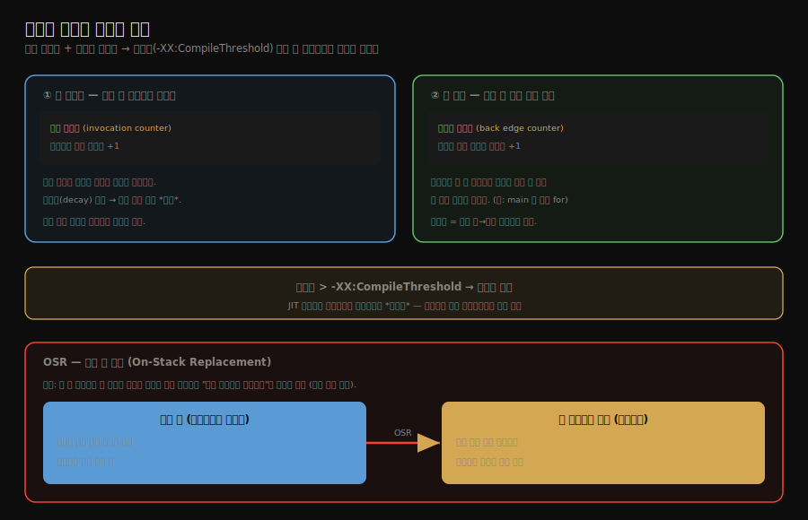
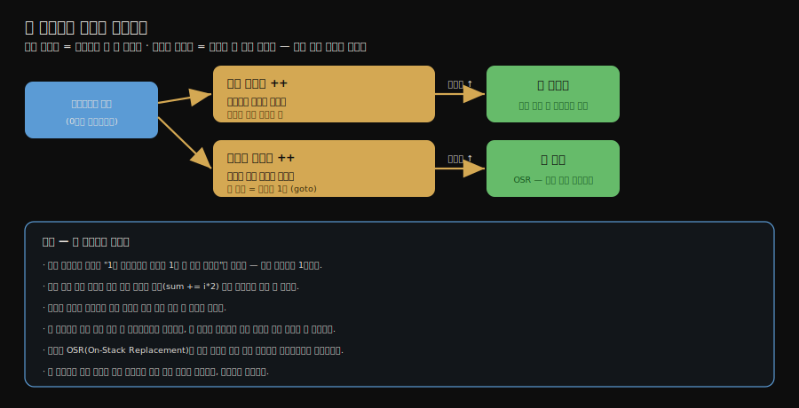

# 컴파일 대상과 핫스폿 탐지
---
> **JIT는 모든 코드가 아니라 "자주 도는 코드(핫스폿)"만 컴파일하며, 자주 돎을 호출 카운터와 백에지 카운터로 세어 탐지하고, 임곗값을 넘으면 백그라운드에서 비동기로 컴파일합니다.** 
>
> 핵심은 "컴파일 대상은 핫 메서드와 핫 루프 두 종류"이고, "루프는 메서드가 끝나길 기다리지 않고 도는 중간에 갈아끼운다(OSR)"는 점입니다.

이 글을 읽고 나면 JIT가 무엇을 컴파일 대상으로 삼는지 두 종류로 나눠 말하고, 핫스폿을 어떻게 세어 탐지하는지(두 카운터와 임곗값) 설명하며, 루프를 도는 도중에 갈아끼우는 OSR이 왜 필요한지 짚을 수 있습니다.


## 진입 — 다 컴파일하지 않는다

> [앞 글](./02-01.JIT%20컴파일러%20—%20인터프리터와%20계층형%20컴파일.md)에서 JIT가 자주 도는 코드만 컴파일한다고 했습니다. 그렇다면 "자주 돈다"를 어떻게 알아낼까요. 그 판단의 단위와 세는 방법이 이 글의 주제입니다.

JIT 컴파일에는 비용이 듭니다. 번역에 시간과 메모리가 들고, 한 번만 도는 코드를 컴파일하면 그 비용을 회수하지 못합니다. 그래서 JVM은 *자주 실행되는 코드*, 곧 **핫스폿(hot spot)**만 골라 컴파일합니다. 문제는 "자주"를 어떻게 정량으로 판단하느냐입니다.




## 1. 컴파일 대상 — 핫 메서드와 핫 루프

> **JIT가 컴파일하는 대상은 두 종류입니다. 여러 번 호출되는 *핫 메서드*와, 한 메서드 안에서 여러 번 도는 *핫 루프(루프 본문)*입니다.**

JIT가 컴파일 단위로 삼는 핫스폿은 두 종류입니다.

1. **여러 번 호출되는 메서드**입니다. 어떤 메서드가 반복해서 호출되면 그 메서드 전체를 컴파일 대상으로 잡습니다. 이쪽은 직관적입니다. 자주 불리는 메서드를 기계어로 바꿔 두면 호출할 때마다 이득입니다.
2. **여러 번 도는 루프**입니다. 메서드는 한 번만 호출됐더라도 그 안의 루프가 수만 번 돌면, 그 *루프 본문*이 핫스폿이 됩니다. 예를 들어 `main`이 한 번 호출되고 그 안에서 거대한 `for` 문이 도는 경우, 메서드 호출 횟수만 보면 핫스폿을 놓칩니다. 그래서 루프의 반복 횟수도 따로 셉니다.

이 두 번째 경우가 까다로운 지점을 만듭니다. 메서드는 *지금 실행 중*인데 그 안의 루프가 핫스폿으로 판정됩니다. 메서드가 끝나길 기다렸다가 다음 호출부터 컴파일본을 쓰면, 이미 한 번 호출되고 끝나는 `main` 같은 경우엔 영영 컴파일본을 못 씁니다. 이 문제를 푸는 것이 OSR입니다(§3).


## 2. 핫스폿 탐지 — 두 카운터와 임곗값

> 자주 돎은 두 카운터로 셉니다. 메서드가 불릴 때마다 호출 카운터를, 루프가 뒤로 돌 때마다 백에지 카운터를 올립니다. 임곗값(`-XX:CompileThreshold`)을 넘으면 컴파일을 요청합니다.

핫스폿을 탐지하는 방식은 *카운터 기반*입니다. HotSpot은 메서드마다 두 개의 카운터를 둡니다.

**호출 카운터(invocation counter)**는 메서드가 호출될 때마다 1씩 올라갑니다. 이 값이 임곗값을 넘으면 그 메서드가 핫 메서드로 판정돼 컴파일이 요청됩니다.

**백에지 카운터(back edge counter)**는 루프가 *뒤로 점프*할 때마다 올라갑니다. 백에지(back edge)란 루프 끝에서 처음으로 돌아가는 제어 흐름의 간선입니다. 루프가 한 바퀴 돌 때마다 백에지를 한 번 지나므로, 이 카운터로 루프의 반복 횟수를 셉니다. 이 값이 임곗값을 넘으면 그 루프가 핫 루프로 판정됩니다.

임곗값은 `-XX:CompileThreshold` 옵션으로 정합니다. 카운터가 이 값을 넘으면 컴파일러에 컴파일을 요청합니다. 

- 한 가지 주의할 점은, 호출 카운터에는 *반감기(counter decay)*가 있다는 것입니다. 일정 주기마다 카운터를 절반으로 줄여, "오래 전에 띄엄띄엄 호출된" 메서드가 아니라 "최근에 집중적으로 호출되는" 메서드를 핫스폿으로 잡습니다. 절대 횟수가 아니라 *호출 빈도*를 보는 셈입니다.

### 왜 카운터가 둘인가

> 호출 카운터 하나로는 "한 번 호출됐지만 안에서 수억 번 도는 루프"를 놓칩니다. 두 카운터는 *호출 빈도*와 *반복 빈도*라는 서로 다른 핫함을 잡습니다.

카운터가 둘인 이유는 핫함이 *두 종류*이기 때문입니다. 다음 두 메서드를 비교하면 분명해집니다.

```java
// (가) 루프 안에서 메서드를 호출 — 호출 카운터로 잡힌다
void caseA() {
    for (int i = 0; i < 100_000_000; i++) {
        doSomething(i);          // doSomething 의 호출 카운터가 1억까지 오름
    }
}

// (나) 루프 안에서 연산만 — 호출 카운터로는 못 잡는다
void caseB() {
    long sum = 0;
    for (int i = 0; i < 100_000_000; i++) {
        sum += i * 2;            // 메서드 호출이 아니라 산술 명령(imul·ladd)
    }
    System.out.println(sum);
}
```

`caseB`를 호출 카운터로만 보면 함정에 빠집니다. `caseB` 자신은 *1번* 호출됐으니 호출 카운터는 1이고, 루프 안 `sum += i * 2`는 메서드 호출이 아니라 산술 명령이라 어떤 호출 카운터도 올리지 않습니다. 그러면 명백히 뜨거운 이 1억 번 루프가 영영 인터프리터로 느리게 돌게 됩니다. 백에지 카운터가 *반복 횟수*를 따로 세어 바로 이 경우를 잡습니다.

| 카운터 | 무엇을 세나 | 무엇을 잡나 | 못 잡는 경우 |
|--------|------------|------------|-------------|
| 호출 카운터 | 메서드가 호출된 횟수 | 핫 메서드 | 1번 호출되고 안에서 오래 도는 루프 |
| 백에지 카운터 | 루프가 뒤로 점프한 횟수 | 핫 루프 | (루프 없는 단순 메서드는 호출 카운터 몫) |



호출 빈도와 반복 빈도는 *서로 다른 사건*이라 한 카운터로 묶어 셀 수 없습니다. 그래서 둘을 따로 두고, 각자 임곗값을 넘으면 핫 메서드와 핫 루프로 나눠 판정합니다.


## 3. OSR(On-Stack Replacement) — 도는 도중에 갈아끼운다

> 핫 루프는 메서드가 끝나길 기다릴 수 없습니다. **스택 위 교체(OSR, On-Stack Replacement)는 메서드가 실행 중인 그 자리에서 인터프리터 프레임을 컴파일된 코드로 갈아끼웁니다.**

한 번 호출되고 그 안에서 거대한 루프를 도는 `main` 같은 메서드는, "다음 호출부터 컴파일본을 쓴다"는 전략이 통하지 않습니다. 다음 호출이 없기 때문입니다. 루프가 지금 도는 *그 자리에서* 컴파일된 코드로 바꿔치기해야 합니다.

이것이 **스택 위 교체(OSR, On-Stack Replacement)**입니다. 

- 메서드가 인터프리터로 실행 중이고 그 안의 루프가 핫스폿으로 판정되면, JVM은 루프 본문을 컴파일한 뒤 *현재 스택 프레임을* 인터프리터 상태에서 컴파일된 코드의 상태로 교체합니다. 
- 메서드를 처음부터 다시 시작하지 않고, 루프가 돌던 지점을 이어받아 컴파일본으로 계속 돕니다. "스택 위(on-stack)"라는 이름은 *실행 중인 스택 프레임을 그 자리에서* 갈아끼운다는 뜻입니다.

OSR 덕분에 핫 루프는 메서드의 호출 경계와 무관하게 즉시 최적화 이득을 봅니다. 단 한 번 호출된 메서드 안의 루프라도, 충분히 오래 돌면 컴파일된 코드로 바뀌어 빨라집니다.

컴파일이 끝나기까지 시간이 걸리는 동안에는 인터프리터가 계속 실행을 맡습니다. JIT 컴파일은 *백그라운드 스레드*에서 비동기로 진행되므로, 컴파일을 기다리느라 프로그램이 멈추지 않습니다. 컴파일이 완성되면 그 시점부터 컴파일본으로 갈아탑니다.


## 4. 면접 대비 요약

> 핵심은 "대상은 핫 메서드·핫 루프 두 종류", "호출 카운터+백에지 카운터로 탐지·CompileThreshold 임곗값", "핫 루프는 OSR로 도는 중에 교체·컴파일은 백그라운드 비동기"입니다.

### 한 줄 정의

JIT는 호출 카운터와 백에지 카운터로 핫스폿(핫 메서드·핫 루프)을 탐지해 임곗값을 넘으면 백그라운드에서 비동기 컴파일하며, 핫 루프는 OSR로 실행 중인 스택 프레임을 그 자리에서 컴파일본으로 교체합니다.

### 핵심 포인트 3가지

1. 컴파일 대상은 여러 번 호출되는 핫 메서드와, 한 메서드 안에서 여러 번 도는 핫 루프 두 종류입니다.
2. 호출 카운터는 메서드 호출 횟수를, 백에지 카운터는 루프 반복 횟수를 세고, `-XX:CompileThreshold` 임곗값을 넘으면 컴파일을 요청합니다. 호출 카운터는 반감기가 있어 빈도를 봅니다.
3. 핫 루프는 메서드 호출 경계를 기다릴 수 없으므로 OSR로 실행 중인 스택 프레임을 그 자리에서 컴파일본으로 갈아끼웁니다. 컴파일은 백그라운드에서 비동기로 진행됩니다.

### 면접에서 받을 만한 질문

1. JIT가 컴파일하는 대상은 무엇입니까? 모든 코드를 컴파일하지 않는 이유는 무엇입니까?
2. 핫스폿을 어떻게 탐지합니까? 두 카운터는 각각 무엇을 셉니까?
3. OSR(스택 위 교체)은 무엇이며 왜 필요합니까?

> 세 질문에 *먼저 자답한 뒤* 아래 §정답으로 내려갑니다.


## 정답 (자답 후 펼치기)

> 위 §면접에서 받을 만한 질문의 3개에 *먼저 자답한 뒤* 아래를 읽으세요.

### 정답 1 — 컴파일 대상과 선별 이유

JIT는 여러 번 호출되는 핫 메서드와 여러 번 도는 핫 루프를 컴파일합니다. 모든 코드를 컴파일하지 않는 이유는 컴파일에 시간·메모리 비용이 들기 때문입니다. 한 번만 도는 코드를 컴파일하면 그 비용을 회수하지 못하므로, 자주 도는 코드만 골라 컴파일해야 이득입니다.

### 정답 2 — 핫스폿 탐지와 두 카운터

카운터 기반으로 탐지합니다. 호출 카운터는 메서드가 호출될 때마다, 백에지 카운터는 루프가 뒤로 점프할 때마다 올라갑니다. 둘 중 하나가 `-XX:CompileThreshold` 임곗값을 넘으면 컴파일을 요청합니다. 호출 카운터에는 반감기가 있어, 절대 횟수가 아니라 최근의 호출 빈도가 높은 코드를 핫스폿으로 잡습니다.

### 정답 3 — OSR과 필요성

OSR(스택 위 교체)은 메서드가 실행 중인 그 자리에서 인터프리터 프레임을 컴파일된 코드로 교체하는 기법입니다. 한 번만 호출되고 그 안에서 거대한 루프를 도는 메서드는 "다음 호출부터 컴파일본을 쓴다"는 전략이 통하지 않습니다. 다음 호출이 없기 때문입니다. OSR은 루프가 돌던 지점을 이어받아 컴파일본으로 바꿔치기하므로, 핫 루프가 메서드 호출 경계와 무관하게 즉시 최적화 이득을 봅니다.


## 핵심 개념 체크리스트

- [ ] JIT가 모든 코드를 컴파일하지 않는 이유를 아는가?
- [ ] 컴파일 대상 두 종류(핫 메서드·핫 루프)를 구분할 수 있는가?
- [ ] 호출 카운터와 백에지 카운터가 각각 무엇을 세는지 아는가?
- [ ] `-XX:CompileThreshold`와 호출 카운터 반감기를 아는가?
- [ ] OSR이 무엇이고 왜 필요한지 설명할 수 있는가?


## 관련 문서

> 이 글은 "무엇을 언제 컴파일하는가"를 다뤘습니다. 다음 글은 "컴파일할 때 *어떻게 빠르게 만드는가*" — 컴파일러 최적화 기법으로 넘어갑니다.

- [02-03. 컴파일러 최적화 — 메서드 인라인과 탈출 분석](./02-03.컴파일러%20최적화%20—%20메서드%20인라인과%20탈출%20분석.md) — 컴파일러가 코드를 빠르게 만드는 방법
- [02-01. JIT 컴파일러 — 인터프리터와 계층형 컴파일](./02-01.JIT%20컴파일러%20—%20인터프리터와%20계층형%20컴파일.md) — 짝이 되는 앞 글, 컴파일러 구성
- [01-01. javac 컴파일러의 컴파일 과정](./01-01.javac%20컴파일러의%20컴파일%20과정.md) — 프론트엔드 컴파일과의 대비
