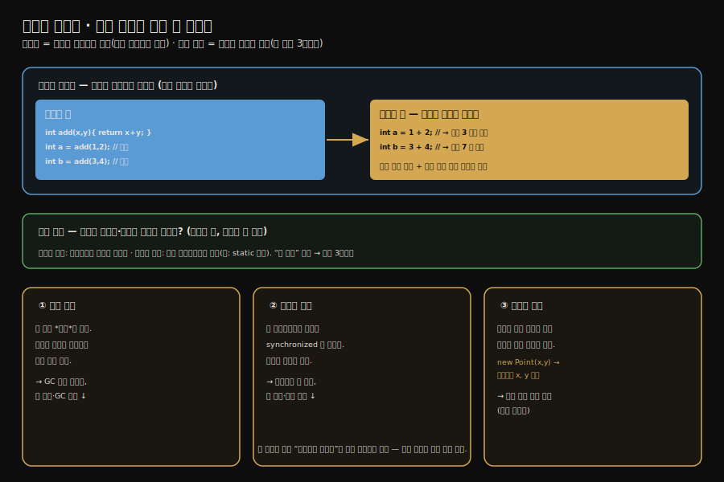

# 컴파일러 최적화 — 메서드 인라인과 탈출 분석
---
> §11.4의 핵심 두 최적화를 한 줄로 압축하면 — **메서드 인라인은 호출을 본문으로 펼쳐 호출 비용을 없애고 다른 최적화의 발판이 되며, 탈출 분석은 객체가 메서드 밖으로 새지 않음을 증명해 스택 할당·동기화 제거·스칼라 치환을 가능하게 합니다.** 핵심은 "인라인은 가장 중요한 최적화"이고, "탈출 분석은 그 자체가 최적화가 아니라 다른 세 최적화를 여는 분석"이라는 점입니다.

이 글을 읽고 나면 메서드 인라인이 왜 가장 중요한 최적화인지 설명하고, 탈출 분석이 무엇을 증명하는지 말하며, 그 증명으로 열리는 세 가지 최적화(스택 할당·동기화 제거·스칼라 치환)를 짚을 수 있습니다.


## 진입 — 컴파일은 번역에 그치지 않는다

> [앞 글](./02-02.컴파일%20대상과%20핫스폿%20탐지.md)에서 무엇을 언제 컴파일하는지 봤습니다. 컴파일러는 바이트코드를 기계어로 *옮기기만* 하지 않고, 그 과정에서 코드를 더 빠르게 *바꿉니다*. 그 바꿈이 최적화입니다.

JIT 컴파일러가 단순히 바이트코드를 기계어로 1:1 번역만 한다면 인터프리터보다 약간 빠른 데 그칠 것입니다. 진짜 성능은 *최적화*에서 나옵니다. 컴파일러는 코드의 의미를 보존하면서 더 빠른 형태로 바꿉니다. 그중 가장 중요한 둘이 메서드 인라인과 탈출 분석입니다.




## 1. 메서드 인라인 — 가장 중요한 최적화

> 메서드 인라인은 메서드 호출을 그 메서드의 본문으로 펼쳐 호출 자체를 없앱니다. 호출 비용을 제거할 뿐 아니라, 펼친 코드 위에서 다른 최적화가 일어날 발판을 만듭니다.

**메서드 인라인(method inlining)**은 메서드 호출을, 호출되는 메서드의 *본문 자체로 바꿔치기*하는 최적화입니다.

```java
// 인라인 전
public int add(int x, int y) { return x + y; }
public int calc() {
    int a = add(1, 2);   // 메서드 호출
    int b = add(3, 4);
    return a + b;
}

// 인라인 후 — add 호출이 본문으로 펼쳐짐
public int calc() {
    int a = 1 + 2;       // add 가 사라지고 본문이 자리에 들어옴
    int b = 3 + 4;
    return a + b;
}
```

인라인이 주는 첫째 이득은 *호출 비용 제거*입니다. 메서드 호출에는 스택 프레임을 만들고 인자를 넘기고 돌아올 주소를 저장하는 비용이 듭니다. 본문을 그 자리에 펼치면 이 비용이 통째로 사라집니다.

둘째 이득이 더 큽니다. 인라인은 *다른 최적화의 발판*이 됩니다. 호출이 펼쳐지면 호출자와 피호출자의 코드가 한 덩어리가 되어, 그 위에서 상수 전파·공통식 제거 같은 최적화가 *경계를 넘어* 일어날 수 있습니다. 위 예에서 `1 + 2`와 `3 + 4`는 인라인 덕분에 `calc` 안에서 보이게 되고, 컴파일러는 이를 상수 `3`과 `7`로 미리 계산해 버릴 수 있습니다. 그래서 인라인을 *가장 중요한 최적화*이자 "다른 최적화의 어머니"라 부릅니다.

다만 인라인이 늘 쉽지는 않습니다. 자바의 인스턴스 메서드는 대부분 가상 메서드(virtual)라, 실제로 어느 구현이 호출될지 실행 전에 확정하기 어렵습니다. HotSpot은 타입 프로파일과 클래스 계층 분석으로 *호출 대상이 사실상 하나*임을 추론해 인라인하고, 추론이 빗나가면 되돌리는(역최적화) 장치를 함께 둡니다.


## 2. 탈출 분석 — 최적화가 아니라 분석이다

> 탈출 분석은 어떤 객체가 메서드(또는 스레드) 밖으로 새어 나가는지(escape) 추적하는 분석입니다. 그 자체로 코드를 바꾸지 않고, "새지 않는다"는 결론으로 다른 최적화를 엽니다.

**탈출 분석(escape analysis)**은 메서드 안에서 만든 객체가 그 메서드 *밖으로 새어 나가는지*를 추적합니다. 객체가 "탈출한다(escape)"는 것은 그 객체의 참조가 메서드 바깥에서도 보인다는 뜻입니다.

탈출에는 두 수준이 있습니다. *메서드 탈출*은 객체가 반환되거나 다른 메서드의 인자로 넘겨져, 만든 메서드 밖에서 쓰이는 경우입니다. *스레드 탈출*은 한 걸음 더 나아가 그 객체가 다른 스레드에서도 보이는 경우입니다(예: 정적 필드에 저장).

탈출 분석은 그 자체로는 아무 코드도 바꾸지 않습니다. 객체가 *새는지 안 새는지* 판정할 뿐입니다. 중요한 건 "새지 않는다"는 결론입니다. 어떤 객체가 메서드 안에서만 쓰이고 밖으로 새지 않는다면, 그 객체를 두고 다음 세 가지 최적화가 가능해집니다.


## 3. 탈출 분석이 여는 세 최적화

> 객체가 새지 않으면 — 힙 대신 스택에 할당하고(스택 할당), 동기화를 지우고(동기화 제거), 객체를 아예 풀어 헤쳐 필드를 지역 변수로 바꿉니다(스칼라 치환).

탈출하지 않는 객체에 대해 컴파일러는 다음을 적용합니다.

**스택 할당(stack allocation)**: 객체가 메서드 밖으로 새지 않으면, 힙이 아니라 *스택*에 할당할 수 있습니다. 스택에 할당된 객체는 메서드가 끝나면 프레임과 함께 자동으로 사라지므로, 가비지 컬렉터가 따로 회수할 필요가 없습니다. 힙 압박과 GC 부담이 줄어듭니다.

**동기화 제거(lock elision)**: 객체가 한 스레드 안에서만 쓰이고 다른 스레드로 새지 않으면, 그 객체에 걸린 동기화(`synchronized`)는 의미가 없습니다. 경쟁할 다른 스레드가 없기 때문입니다. 컴파일러는 이런 *불필요한 락을 지웁니다*. 락을 얻고 푸는 비용이 사라집니다.

**스칼라 치환(scalar replacement)**: 객체가 새지 않으면, 객체를 아예 만들지 않고 그 *필드들을 흩어진 지역 변수*로 바꿀 수 있습니다. 예를 들어 `Point p = new Point(x, y)`에서 `p`가 새지 않으면, `p` 객체 없이 `p.x`·`p.y`에 해당하는 두 지역 변수만 둡니다. 객체 생성 자체가 사라지므로 스택 할당보다 더 적극적인 최적화입니다.

세 최적화 모두 *탈출하지 않는다*는 전제 위에서만 안전합니다. 그래서 탈출 분석이 셋의 공통 전제가 됩니다. 분석이 "새지 않는다"를 증명해야 비로소 컴파일러가 이 최적화들을 적용합니다.


## 4. 면접 대비 요약

> 핵심은 "인라인=호출을 본문으로 펼쳐 비용 제거 + 다른 최적화의 발판", "탈출 분석=객체가 새는지 추적하는 분석", "안 새면 스택 할당·동기화 제거·스칼라 치환"입니다.

### 한 줄 정의

메서드 인라인은 호출을 본문으로 펼쳐 호출 비용을 없애고 다른 최적화의 발판이 되며, 탈출 분석은 객체가 메서드·스레드 밖으로 새지 않음을 증명해 스택 할당·동기화 제거·스칼라 치환을 가능하게 합니다.

### 핵심 포인트 3가지

1. 메서드 인라인은 호출을 본문으로 펼쳐 호출 비용을 없애고, 호출 경계를 넘는 다른 최적화의 발판이 되어 "가장 중요한 최적화"로 불립니다.
2. 탈출 분석은 그 자체로 코드를 바꾸지 않고, 객체가 메서드·스레드 밖으로 새는지만 추적합니다. "안 샌다"는 결론이 다른 최적화를 엽니다.
3. 탈출하지 않는 객체에는 스택 할당(GC 부담↓), 동기화 제거(불필요한 락 제거), 스칼라 치환(객체를 지역 변수로 분해)이 적용됩니다.

### 면접에서 받을 만한 질문

1. 메서드 인라인은 무엇이며 왜 "가장 중요한 최적화"라 불립니까?
2. 탈출 분석은 무엇을 분석합니까? 그 자체가 최적화입니까?
3. 객체가 탈출하지 않으면 어떤 최적화가 가능합니까? 세 가지를 들어 보십시오.

> 세 질문에 *먼저 자답한 뒤* 아래 §정답으로 내려갑니다.


## 정답 (자답 후 펼치기)

> 위 §면접에서 받을 만한 질문의 3개에 *먼저 자답한 뒤* 아래를 읽으세요.

### 정답 1 — 메서드 인라인과 중요성

메서드 인라인은 메서드 호출을 그 메서드의 본문으로 바꿔치기하는 최적화입니다. 호출에 드는 스택 프레임 생성·인자 전달·복귀 주소 저장 비용을 없앱니다. 더 중요하게는, 호출이 펼쳐지면 호출자와 피호출자 코드가 한 덩어리가 되어 상수 전파·공통식 제거 같은 다른 최적화가 호출 경계를 넘어 일어납니다. 다른 최적화의 발판이 되기에 "가장 중요한 최적화"라 불립니다.

### 정답 2 — 탈출 분석의 성격

탈출 분석은 메서드 안에서 만든 객체가 그 메서드(또는 스레드) 밖으로 새어 나가는지를 추적하는 *분석*입니다. 그 자체로는 코드를 바꾸지 않습니다. 객체가 새는지 안 새는지 판정할 뿐이고, "안 샌다"는 결론이 다른 최적화의 전제가 됩니다. 그래서 탈출 분석은 최적화라기보다 최적화를 여는 분석입니다.

### 정답 3 — 탈출하지 않을 때의 세 최적화

스택 할당(객체를 힙 대신 스택에 둬 GC 부담을 줄임), 동기화 제거(한 스레드에서만 쓰이는 객체의 불필요한 락을 지움), 스칼라 치환(객체를 만들지 않고 필드를 흩어진 지역 변수로 바꿈)입니다. 셋 다 객체가 밖으로 새지 않는다는 전제 위에서만 안전하므로, 탈출 분석이 셋의 공통 전제입니다.


## 핵심 개념 체크리스트

- [ ] 메서드 인라인이 호출 비용을 없애는 방식을 아는가?
- [ ] 인라인이 "다른 최적화의 발판"인 이유를 설명할 수 있는가?
- [ ] 탈출 분석이 최적화가 아니라 분석임을 아는가?
- [ ] 메서드 탈출과 스레드 탈출을 구분할 수 있는가?
- [ ] 스택 할당·동기화 제거·스칼라 치환을 각각 설명할 수 있는가?


## 관련 문서

> 이 글은 인라인과 탈출 분석을 다뤘습니다. 다음 글은 나머지 최적화(공통식 제거·경계 검사 제거)와 실전 Graal 컴파일러로 4부를 마무리합니다.

- [02-04. 컴파일러 최적화 — 공통식 제거·경계 검사 제거와 Graal](./02-04.컴파일러%20최적화%20—%20공통식%20제거·경계%20검사%20제거와%20Graal.md) — 나머지 최적화와 실전
- [02-02. 컴파일 대상과 핫스폿 탐지](./02-02.컴파일%20대상과%20핫스폿%20탐지.md) — 무엇을 컴파일하는가
- [02-01. JIT 컴파일러 — 인터프리터와 계층형 컴파일](./02-01.JIT%20컴파일러%20—%20인터프리터와%20계층형%20컴파일.md) — 컴파일러 구성
