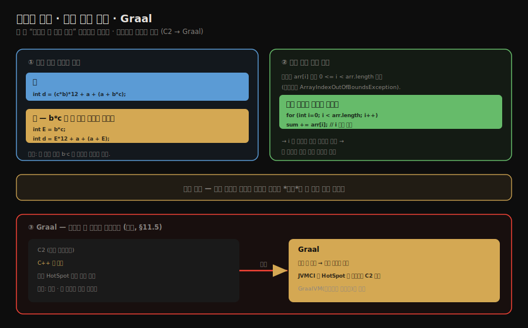

# 컴파일러 최적화 — 공통식 제거·경계 검사 제거와 Graal
---
> **공통 하위 표현식 제거는 같은 계산을 두 번 하지 않고 결과를 재사용하며, 배열 경계 검사 제거는 인덱스가 안전함을 증명해 매 접근의 검사를 생략하고, Graal은 C2를 대체하려는 자바로 짠 차세대 JIT 컴파일러입니다.** 
>
> 핵심은 "둘 다 *증명할 수 있을 때만* 안전하게 지운다"는 점과, "컴파일러 자신도 진화한다(C2→Graal)"는 점입니다.

이 글을 읽고 나면 공통 하위 표현식 제거가 무엇을 재사용하는지 예로 설명하고, 배열 경계 검사 제거가 어떤 조건에서 검사를 생략하는지 말하며, Graal이 어떤 의미의 차세대 컴파일러인지 짚어 4부를 마무리할 수 있습니다.


## 진입 — 안전하게 지우는 최적화

> [앞 글](./02-03.컴파일러%20최적화%20—%20메서드%20인라인과%20탈출%20분석.md)의 인라인·탈출 분석에 이어, 이 글은 *중복 계산*과 *불필요한 검사*를 지우는 두 최적화를 봅니다. 
>
> 둘 다 "지워도 결과가 같음"을 컴파일러가 증명해야 적용됩니다.

최적화의 한 갈래는 *없애도 되는 일*을 찾아 지우는 것입니다. 같은 값을 두 번 계산하거나, 절대 실패하지 않을 검사를 매번 수행하는 것은 낭비입니다. 컴파일러는 이런 낭비를 지웁니다. 단, 지운 뒤에도 프로그램의 의미가 *정확히 같음*을 보장할 수 있을 때만 그렇게 합니다.




## 1. 공통 하위 표현식 제거 — 같은 계산을 재사용한다

> **한 식 안에서 같은 부분식이 두 번 나오고 그 사이 값이 바뀌지 않으면, 한 번만 계산해 결과를 재사용합니다.**

**공통 하위 표현식 제거(common subexpression elimination)**는 같은 계산을 반복하지 않는 최적화입니다. 어떤 부분식이 이미 계산됐고 그 식에 쓰인 변수들이 그 사이 바뀌지 않았다면, 다시 계산할 필요 없이 *앞서 구한 결과를 재사용*합니다.

```java
// 최적화 전
int d = (c * b) * 12 + a + (a + b * c);

// b*c 가 공통 부분식 — 두 번 계산할 필요 없음
// 최적화 후 (E = b * c 로 한 번만 계산)
int E = b * c;
int d = E * 12 + a + (a + E);
```

- 위 식에서 `b * c`는 두 번 나옵니다(`c * b`도 곱셈의 교환법칙으로 같은 값입니다). 그 사이 `b`와 `c`가 바뀌지 않으므로, 컴파일러는 `b * c`를 *한 번만* 계산해 그 결과를 두 자리에 함께 씁니다. 
- 곱셈 한 번이 사라집니다. 더 나아가면 `E * 12` 같은 더 큰 공통식도 같은 방식으로 묶어 줄일 수 있습니다.

이 최적화가 안전하려면 *공통식에 쓰인 변수가 그 사이 바뀌지 않아야* 합니다. 만약 두 번째 `b * c` 앞에서 `b`가 갱신됐다면 두 값은 다를 수 있으니 재사용하면 안 됩니다. 그래서 컴파일러는 변수의 변경 여부를 추적해 안전이 보장될 때만 식을 묶습니다.


## 2. 배열 경계 검사 제거 — 안전을 증명하면 검사를 생략한다

> 자바는 배열에 접근할 때마다 인덱스가 범위 안인지 검사합니다. 인덱스가 항상 안전함을 컴파일러가 증명하면, 그 검사를 생략합니다.

자바는 안전한 언어라, 배열 `arr[i]`에 접근할 때마다 `i`가 `0 <= i < arr.length` 범위인지 *암묵적으로 검사*합니다. 범위를 벗어나면 `ArrayIndexOutOfBoundsException`을 던집니다. 이 검사는 안전을 보장하지만, 거대한 루프에서 매 반복마다 수행되면 부담이 됩니다.

**배열 경계 검사 제거(bounds check elimination)**는 이 검사가 *절대 실패하지 않음*을 컴파일러가 증명할 때 검사를 생략합니다.

```java
// 루프 범위가 배열 길이와 묶여 있으면
for (int i = 0; i < arr.length; i++) {
    sum += arr[i];   // i 는 항상 0 <= i < arr.length — 검사 불필요
}
```

- 위 루프에서 `i`는 `0`부터 `arr.length` 직전까지만 돕니다. 컴파일러는 루프 조건을 분석해 `arr[i]`의 `i`가 *언제나 범위 안*임을 증명할 수 있습니다. 
- 그러면 매 반복마다 하던 경계 검사를 통째로 빼 버립니다. 검사 한 줄이 사라지면 루프가 수만 번 돌 때 그만큼 빨라집니다.

같은 맥락에서 HotSpot은 `NullPointerException`이나 경계 검사 같은 *흔히 발생하지 않는 예외 검사*를 본문에서 빼내, 실제로 문제가 생긴 드문 경우에만 별도 경로로 처리하는 기법도 씁니다.

- 정상 경로에서 검사 비용을 없애는 셈입니다. 이런 최적화의 공통 원리는 §1과 같습니다. 
- *증명할 수 있을 때만* 지운다는 것입니다. 이 "드문 사건은 본문에서 빼낸다"는 발상을 NPE 검사에 끝까지 밀어붙인 것이 다음 §3의 implicit null check입니다.


## 3. 예외 경로 최적화 — Implicit Null Check

> `null` 검사를 *아예 적지 않고* 그냥 메모리에 접근합니다. NPE가 드물다는 가정 위에서, 실제로 `null`을 만지면 OS 시그널로 잡아 예외로 바꿉니다.

`null` 참조를 역참조할 때마다 `if (ref == null) throw NPE`를 명시적으로 끼우면 핫 패스의 분기 수가 폭증합니다. 

HotSpot은 이를 **implicit null check**로 처리합니다 — *체크를 적지 않고* 그냥 메모리에 접근하고, NPE가 거의 발생하지 않는다는 가정 위에서 동작합니다. 실제로 `null` 포인터를 역참조하면 OS가 **SIGSEGV** 시그널을 발생시키고, HotSpot이 등록해 둔 시그널 핸들러가 이를 가로채 자바 레벨의 `NullPointerException`으로 변환합니다.

```java
// 자바 코드
String s = obj.getName();
int len = s.length();   // s가 null이면 NPE

// JIT가 생성하는 의사 코드 (implicit null check 적용)
ldr  r0, [obj + offset_of_name]   ; s 로드 — obj가 null이면 여기서 SIGSEGV
ldr  r1, [r0 + offset_of_length]  ; s.length() — s가 null이면 여기서 SIGSEGV
; if-체크 자체가 없다
```

- 이 기법이 성립하려면 두 조건이 필요합니다. 첫째 NPE가 *드물어야* 합니다 — 자주 발생하면 시그널 처리 비용이 if-체크보다 비싸집니다. 둘째 시그널 핸들러가 *어느 메모리 접근이 NPE 후보였는지* 역추적할 수 있어야 합니다
- HotSpot은 `OopMap`과 인스트럭션 메타데이터로 SIGSEGV가 발생한 PC를 NPE 바이트코드 위치로 매핑합니다.

핫스폿 탐지가 *너무 자주 같은 위치에서 NPE를 보면* 컴파일러는 implicit null check를 포기하고 명시적 if-체크를 도로 끼워 시그널 비용을 피합니다

- 이게 자바 애플리케이션을 오래 돌릴수록 NPE 핫 패스가 *느려지지 않는* 이유입니다(deoptimization + recompilation). 같은 종류의 *드문 사건 가정* 위의 최적화로 `ArrayIndexOutOfBoundsException`도 implicit bound check + SIGSEGV가 아닌 컴파일러가 삽입한 *trap* 명령으로 처리됩니다. 
- OopMap·Safepoint와의 연결은 [`../ch02_automatic-memory-management/02-05.핫스팟 알고리즘 상세 구현.md`](../ch02_automatic-memory-management/02-05.핫스팟%20알고리즘%20상세%20구현.md)에서 다룹니다.


## 4. 명령어 스케줄링 — LCM과 GCM

> **의존성을 어기지 않는 선에서 명령어 순서를 재배치해 CPU 파이프라인 스톨과 캐시 미스를 줄입니다.** 
>
> C2는 *어느 블록에 둘지*(GCM)와 *그 블록 안에서 어떤 순서로 낼지*(LCM)를 두 단계로 정합니다.

**명령어 스케줄링(instruction scheduling)**은 의존성을 위반하지 않는 선에서 명령어 순서를 재배치하여 CPU 파이프라인 스톨과 캐시 미스를 줄이는 최적화입니다. HotSpot C2는 두 단계 스케줄러를 운영합니다.

| 단계 | 약칭 | 동작 |
|---|---|---|
| **Global Code Motion** | GCM | 어느 *블록*에 명령어를 배치할지 결정. 루프 밖으로 옮길 수 있는 불변식은 끌어올리고, 자주 안 쓰이는 쪽은 콜드 블록으로 내림 |
| **Local Code Motion** | LCM | 같은 블록 *안에서* 어떤 *순서*로 명령어를 발행할지 결정. 의존성 그래프 위에서 list scheduling |

- 두 단계 모두 sea-of-nodes IR 위에서 동작하며, 진단용 플래그 `-XX:+UnlockDiagnosticVMOptions -XX:+StressGCM -XX:+StressLCM`을 켜면 스케줄링을 무작위로 흔들어 의존성 누락을 검증할 수 있습니다(OpenJDK `c2_globals.hpp` 정의, JDK-8156803으로 product diagnostic 플래그가 됨). 
- 이 무작위화로도 깨지지 않으면 스케줄러가 만든 어떤 순서든 의미가 보존된다고 봅니다.

자바 메모리 모델(JMM)이 정의한 *happens-before*가 깨지는 재정렬은 LCM/GCM이 만들지 않습니다

- `volatile` 읽기/쓰기, `synchronized` 진입/탈출, `final` 필드 초기화 같은 동기화 경계가 IR 의존성 엣지로 강제되기 때문입니다. 
- 멀티스레드 가시성을 끊으려면 JMM 경계를 직접 명시해야 한다는 점은 [`../ch05_efficient-concurrency/01-02.volatile·happens-before·원자성.md`](../ch05_efficient-concurrency/01-02.volatile·happens-before·원자성.md)와 [`../ch05_efficient-concurrency/05-01.Java Memory Model 심화.md`](../ch05_efficient-concurrency/05-01.Java%20Memory%20Model%20심화.md)에서 다룹니다.

> 위 공통식 제거(GVN)와 이 스케줄링(LCM/GCM)은 모두 C2의 sea-of-nodes IR 위에서 동작합니다. 핵심 검증 지점은 OpenJDK 소스의 `src/hotspot/share/opto/` 디렉토리입니다.


## 5. Graal — 자바로 짠 차세대 컴파일러

> Graal은 C2를 대체하려는 차세대 JIT 컴파일러입니다. C++로 짠 C2와 달리 자바로 작성돼 유지보수와 확장이 쉽고, GraalVM의 토대가 됩니다.

§11.5는 실전으로 **Graal 컴파일러**를 다룹니다. C2(서버 컴파일러)는 오랫동안 HotSpot의 최고 성능을 책임졌지만, C++로 짜여 코드가 복잡하고 새 최적화를 더하기 어렵다는 한계가 있었습니다.

Graal은 그 C2를 *대체*하려는 차세대 JIT 컴파일러입니다. 가장 큰 차이는 *자바로 작성*됐다는 점입니다. Graal은 JVMCI(JVM Compiler Interface)라는 통로로 HotSpot에 끼어들어 C2 자리에서 동작할 수 있고, 이를 더 확장한 것이 네이티브 이미지로 유명한 GraalVM입니다. 책은 Graal을 직접 빌드해 C2 대신 끼워 보는 실습으로 이 장을 마칩니다.

### 자바로 짠 진짜 이유 — 유지보수가 아니다

> "자바라서 유지보수가 쉽다"는 곁가지입니다. Graal의 진짜 가치는 *두 모드로 쓰인다*는 점, 특히 AOT(Native Image)의 엔진이 된다는 데 있습니다.

자바로 짰다고 Graal이 *만들어내는 코드*가 더 빠른 것은 아닙니다. C2든 Graal이든 산출물은 똑같이 네이티브 기계어이고, 그 품질은 컴파일러를 짠 언어가 아니라 최적화 알고리즘이 정합니다. JIT 모드만 놓고 보면 Graal과 C2는 막상막하입니다. 그러니 "C++ 대신 자바라 유지보수가 좋다"는 부차적 장점일 뿐입니다.

진짜 의미는 Graal이 *두 모드*로 동작한다는 데 있습니다.

- **JIT 모드** — C2 자리에서 런타임 컴파일러로. C2와 경쟁하는 위치이고, 함수형·스트림 많은 코드에선 더 공격적으로 최적화하기도 합니다.
- **AOT 모드(Native Image)** — *빌드 시점에* 자바 앱 전체를 네이티브 실행 파일로 미리 컴파일합니다. JVM도 웜업도 JIT도 없이 즉시 최고 속도로 시작합니다.

[02-01](./02-01.JIT%20컴파일러%20—%20인터프리터와%20계층형%20컴파일.md)부터 짚어 온 *웜업 문제*(짧게 사는 서버리스·CLI는 JIT 비용을 회수하지 못함)를 푸는 답이 이 AOT 모드입니다. 컴파일러를 자바로 짠 덕에 빌드 도구처럼 생태계에 통합할 수 있었고, 그래서 Native Image가 가능했습니다. 즉 "자바로 짰다"의 본질은 유지보수가 아니라 *AOT를 가능하게 한 구조적 선택*입니다.

AOT·Native Image의 개념과 실습은 이 장의 범위를 넘습니다. *시동 가속* 맥락에서 CDS·AOT·CRaC와 함께 다루는 정본은 [`03-01.시동 가속`](./03-01.시동%20가속%20—%20CDS·AOT·Leyden·GraalVM·CRaC.md), GraalVM precompilation 전용 편은 [`book/jpf_java-performance/04-04.GraalVM과 precompilation`](../book/jpf_java-performance/04-04.GraalVM과%20precompilation%20—%20AOT·native%20image.md)입니다.


## 6. 마치며 — 제4부를 닫으며

> 제4부(컴파일과 최적화)는 javac의 프론트엔드 컴파일에서 시작해 JIT의 백엔드 컴파일과 최적화 기법으로 이어졌습니다. 자바가 빠른 이유는 이 두 컴파일이 함께 일하기 때문입니다.

[10장(프론트엔드 컴파일)](./01-01.javac%20컴파일러의%20컴파일%20과정.md)과 이 장(백엔드 컴파일)을 합치면, 자바 코드가 실행되기까지의 컴파일 여정이 완성됩니다. javac가 소스를 바이트코드로 옮기고(프론트엔드), JVM이 실행 중에 자주 도는 부분을 기계어로 바꾸며 인라인·탈출 분석·공통식 제거·경계 검사 제거·implicit null check·명령어 스케줄링 같은 최적화를 입힙니다(백엔드).

"자바는 느리다"는 통념이 오래 전 이야기가 된 이유가 여기 있습니다. 프론트엔드가 이식성 있는 바이트코드를 만들고, 백엔드가 그 바이트코드를 실행 중에 관찰해 *실제로 도는 코드만* 깊이 최적화하기 때문입니다. 인터프리터의 빠른 시작과 컴파일러의 깊은 최적화가 계층형 컴파일로 한데 묶여, 자바는 시작 속도와 최고 성능을 모두 가집니다.


## 7. 면접 대비 요약

> 핵심은 "공통식 제거=같은 계산 재사용", "경계 검사 제거=안전 증명 시 검사 생략", "implicit null check=NPE를 시그널로 잡기", "LCM/GCM=의존성 보존 재배치", "Graal=자바로 짠 C2 대체 컴파일러"입니다.

### 한 줄 정의

공통 하위 표현식 제거는 변하지 않는 부분식을 한 번만 계산해 재사용하고, 배열 경계 검사 제거는 인덱스가 항상 범위 안임을 증명해 검사를 생략하며, Graal은 자바로 작성돼 C2를 대체하려는 차세대 JIT 컴파일러입니다.

### 핵심 포인트 3가지

1. 공통 하위 표현식 제거는 같은 부분식이 두 번 나오고 그 사이 변수가 바뀌지 않으면 한 번만 계산해 재사용합니다. 변수 변경 추적이 안전의 전제입니다.
2. 배열 경계 검사 제거는 인덱스가 `0 <= i < length`임을 컴파일러가 증명할 때 매 접근의 검사를 생략합니다. 루프 범위가 배열 길이와 묶여 있을 때가 대표적입니다.
3. implicit null check는 `null` 검사를 적지 않고 그냥 접근한 뒤, 실제로 `null`을 만지면 발생하는 SIGSEGV를 시그널 핸들러가 가로채 NPE로 바꿉니다. NPE가 드물다는 가정 위에서만 이득이며, 자주 터지면 명시적 검사로 되돌립니다(deopt).
4. 명령어 스케줄링은 의존성을 보존하며 순서를 재배치합니다. GCM이 *어느 블록*에, LCM이 *그 안 어떤 순서*로 명령어를 둘지 정하며, JMM happens-before 경계는 재배치되지 않습니다.
5. Graal은 자바로 짠 차세대 컴파일러로, JVMCI로 HotSpot에 끼어들어 C2를 대체할 수 있고 GraalVM의 토대가 됩니다.

### 면접에서 받을 만한 질문

1. 공통 하위 표현식 제거는 무엇이며, 안전하려면 어떤 조건이 필요합니까?
2. 배열 경계 검사 제거는 어떤 경우에 검사를 생략할 수 있습니까?
3. Graal 컴파일러는 기존 C2와 무엇이 다릅니까?

> 세 질문에 *먼저 자답한 뒤* 아래 §정답으로 내려갑니다.


## 정답 (자답 후 펼치기)

> 위 §면접에서 받을 만한 질문의 3개에 *먼저 자답한 뒤* 아래를 읽으세요.

### 정답 1 — 공통 하위 표현식 제거

같은 부분식(예: `b * c`)이 한 식 안에서 두 번 나오고 그 사이 `b`·`c`가 바뀌지 않았다면, 한 번만 계산해 결과를 두 자리에 재사용하는 최적화입니다. 안전하려면 공통식에 쓰인 변수가 두 사용 지점 사이에서 변경되지 않아야 합니다. 변경됐다면 두 값이 다를 수 있으므로 재사용하면 안 됩니다. 그래서 컴파일러가 변수 변경 여부를 추적합니다.

### 정답 2 — 배열 경계 검사 제거

인덱스가 항상 `0 <= i < arr.length` 범위 안임을 컴파일러가 증명할 수 있을 때 검사를 생략합니다. 대표적으로 `for (int i = 0; i < arr.length; i++)`처럼 루프 범위가 배열 길이와 묶여 있으면, 루프 조건 분석으로 `i`가 언제나 안전함이 증명되어 매 반복의 경계 검사를 통째로 뺄 수 있습니다.

### 정답 3 — Graal과 C2의 차이

Graal은 C2를 대체하려는 차세대 JIT 컴파일러로, 가장 큰 차이는 *자바로 작성*됐다는 점입니다. C++로 짠 C2는 복잡하고 새 최적화를 더하기 어려웠던 반면, 자바로 짠 Graal은 읽고 고치기 쉬워 최적화 실험이 편합니다. JVMCI로 HotSpot에 끼어들어 C2 자리에서 동작하며, GraalVM의 토대가 됩니다.


## 핵심 개념 체크리스트

- [ ] 공통 하위 표현식 제거가 무엇을 재사용하는지 아는가?
- [ ] 공통식 제거가 안전하기 위한 조건(변수 불변)을 아는가?
- [ ] 배열 경계 검사 제거가 어떤 조건에서 검사를 생략하는지 아는가?
- [ ] "증명할 수 있을 때만 지운다"는 공통 원리를 이해했는가?
- [ ] implicit null check가 NPE를 어떻게 SIGSEGV→예외로 바꾸는지, 언제 명시적 검사로 되돌리는지 아는가?
- [ ] 명령어 스케줄링의 GCM(어느 블록)과 LCM(어떤 순서) 역할 구분과, JMM happens-before가 재배치되지 않는 이유를 아는가?
- [ ] Graal이 C2와 무엇이 다른지(자바 작성·JVMCI·GraalVM) 아는가?


## 관련 문서

> 이 글로 제4부(컴파일과 최적화)가 끝납니다. 백엔드 컴파일의 다른 축이었던 인라인·탈출 분석은 앞 글에, 프론트엔드 컴파일은 10장에 있습니다.

- [02-05. GraalVM과 OpenJDK — Graal·Truffle·통합사](./02-05.GraalVM과%20OpenJDK%20—%20Graal·Truffle·통합사.md) — §5 Graal에서 이어지는 GraalVM 생태계(Truffle·Polyglot·Native Image)와 OpenJDK 통합/분리사(JVMCI·JEP 410)
- [02-03. 컴파일러 최적화 — 메서드 인라인과 탈출 분석](./02-03.컴파일러%20최적화%20—%20메서드%20인라인과%20탈출%20분석.md) — 짝이 되는 앞 글
- [02-01. JIT 컴파일러 — 인터프리터와 계층형 컴파일](./02-01.JIT%20컴파일러%20—%20인터프리터와%20계층형%20컴파일.md) — C2가 적용하는 최적화의 무대
- [01-01. javac 컴파일러의 컴파일 과정](./01-01.javac%20컴파일러의%20컴파일%20과정.md) — 짝이 되는 프론트엔드 컴파일(10장)
