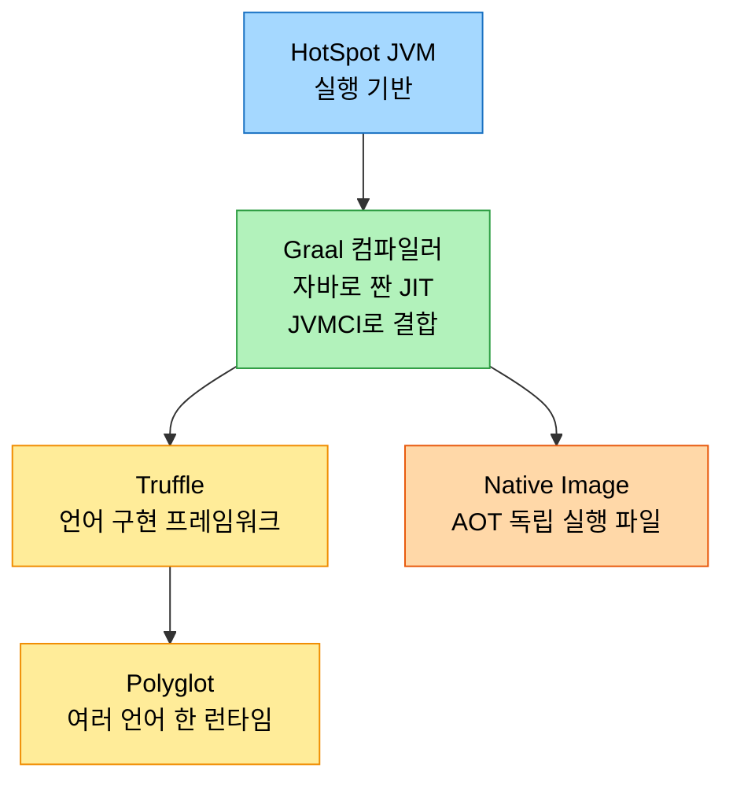
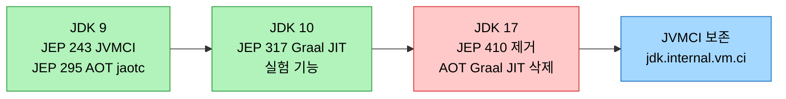

# GraalVM과 OpenJDK — Graal·Truffle·통합사

---

> **GraalVM은 자바로 짠 Graal 컴파일러를 토대로 Truffle·Polyglot·Native Image를 묶은 런타임 제품이며, OpenJDK는 JVMCI(JEP 243)로 그 컴파일러를 끼울 통로를 열고 Graal JIT·AOT를 잠시 품었다가 JEP 410으로 JDK 17에서 도로 떼어냈습니다.**

## 1. 들어가며 — C2의 한계에서 GraalVM으로

C2(서버 컴파일러)가 C++로 짜여 복잡하고 새 최적화를 더하기 어렵다는 한계, 그리고 그 대안으로 자바로 짠 차세대 JIT 컴파일러 Graal이 등장한 배경은 [02-04 §5](./02-04.컴파일러%20최적화%20—%20공통식%20제거·경계%20검사%20제거와%20Graal.md)에서 다뤘습니다. 인터프리터·C1·C2·계층형 컴파일의 기초는 [02-01](./02-01.JIT%20컴파일러%20—%20인터프리터와%20계층형%20컴파일.md)에 있습니다.

이 편은 그 위에서 두 가지를 정리합니다. 하나는 **GraalVM을 컴파일러 하나가 아니라 하나의 제품으로 보는 시야**입니다. Graal 컴파일러는 GraalVM의 일부일 뿐이고, 그 위에 Truffle·Polyglot·Native Image가 함께 얹혀 있습니다. 다른 하나는 **OpenJDK가 Graal을 품었다가 다시 떼어낸 역사**입니다. 이 통합과 분리의 흐름을 알면, 지금 우리가 왜 GraalVM을 별도로 설치해 쓰는지가 납득됩니다.

## 2. GraalVM 아키텍처 — 하나의 제품으로 보기

GraalVM은 "더 빠른 JIT 컴파일러"라는 한 마디로 줄이기 어렵습니다. HotSpot JVM 위에 Graal 컴파일러를 올리고, 그 둘레에 다언어 실행과 네이티브 빌드를 위한 구성요소를 둘러 만든 런타임 환경입니다.

각 구성요소가 맡는 역할은 다음과 같습니다.

| 구성요소 | 역할 |
|----------|------|
| Graal 컴파일러 | 자바로 작성한 JIT 컴파일러. JVMCI를 통해 HotSpot의 C2 자리에 끼어 동작합니다. GraalVM의 토대입니다 |
| Truffle | 언어 인터프리터를 구현하는 프레임워크. Truffle로 짠 인터프리터는 Graal이 자동으로 최적화합니다 |
| Polyglot | Truffle 위에서 자바·JavaScript·Python·Ruby 같은 여러 언어를 한 런타임에서 함께 실행하고 값을 주고받게 합니다 |
| Native Image | 빌드 시점에 애플리케이션 전체를 네이티브 실행 파일로 미리 컴파일하는 AOT 도구입니다 |
| Java on Truffle | Truffle 프레임워크 위에 자바 자체를 다시 구현한 JVM 구현체로, JIT·AOT를 보완합니다 |

여기서 핵심은 **Graal 컴파일러가 두 갈래로 쓰인다**는 점입니다. 런타임에 C2를 대신하는 JIT 엔진이면서, 동시에 빌드 시점에 전체 앱을 미리 컴파일하는 Native Image의 AOT 엔진이기도 합니다. 같은 컴파일러를 JIT로도 AOT로도 쓸 수 있어 GraalVM이 시작 속도와 최고 성능을 모두 노릴 수 있습니다. 이 두 모드의 의미는 [02-04 §5](./02-04.컴파일러%20최적화%20—%20공통식%20제거·경계%20검사%20제거와%20Graal.md)에서, Native Image의 closed-world AOT와 시동 가속 효과는 [03-01 §6](./03-01.시동%20가속%20—%20CDS·AOT·Leyden·GraalVM·CRaC.md)에서 더 깊이 다룹니다.

## 3. OpenJDK와 GraalVM의 통합과 분리

GraalVM은 별도 배포판이지만, 그 핵심 조각은 한때 OpenJDK 본체에 직접 들어와 있었습니다. 들어오고 나가는 과정이 네 개의 JEP로 또렷이 남아 있습니다.

| JEP | JDK | 내용 |
|-----|-----|------|
| JEP 243 (JVMCI) | 9 | 외부 컴파일러를 자바로 짜서 HotSpot에 끼울 수 있는 통로(JVM Compiler Interface)를 열었습니다. Graal이 이 위에 섭니다 |
| JEP 295 (AOT) | 9 | `jaotc` 도구로 메서드를 미리 네이티브로 컴파일하는 실험적 AOT를 들였습니다 |
| JEP 317 (Graal JIT) | 10 | Graal을 실험적 JIT 컴파일러로 OpenJDK에 포함해, C2 대신 켜서 써 볼 수 있게 했습니다 |
| JEP 410 (제거) | 17 | 실험적 AOT(`jdk.aot`)와 Graal JIT(`jdk.internal.vm.compiler`)를 제거했습니다. 다만 JVMCI(`jdk.internal.vm.ci`)는 남겨, 외부 Graal이 여전히 끼어들 수 있게 했습니다 |

흐름을 한 줄로 요약하면 이렇습니다. **JDK 9에서 JVMCI라는 통로와 실험적 AOT가 들어오고, JDK 10에서 Graal JIT가 합류했다가, JDK 17에서 둘 다 빠지되 통로(JVMCI)만 남았습니다.** 통로를 남긴 것이 중요합니다. OpenJDK 본체에서 Graal 구현은 빠졌지만, JVMCI가 그대로 있어 GraalVM 쪽 Graal을 외부에서 끼워 쓰는 길은 열려 있습니다.

## 4. 왜 다시 분리됐나 — GraalVM 직접 설치로 수렴

들어왔던 기능이 도로 빠진 데에는 분명한 이유가 있습니다. JEP 410의 배경은, 대부분의 사용자가 OpenJDK에 딸려 온 실험 기능 대신 **GraalVM을 직접 설치해 쓴다**는 현실이었습니다. OpenJDK 본체에 든 Graal JIT·AOT는 실험 단계에 머물렀고, 유지 비용에 견줘 실사용이 적었습니다.

이렇게 정리하면 그림이 단순해집니다. OpenJDK는 **표준 런타임과 끼움 통로(JVMCI)** 를 맡고, 최신 Graal 컴파일러·Truffle·Native Image 같은 적극적인 기능은 **GraalVM 배포판** 쪽이 맡습니다. 책임이 두 곳으로 갈리되 JVMCI라는 접점으로 이어진 구조입니다. 그래서 오늘날 Native Image나 Polyglot이 필요하면 OpenJDK가 아니라 GraalVM을 받아 쓰는 것이 정석입니다.

## 5. 면접 대비 요약

> 핵심은 "GraalVM=Graal 컴파일러+Truffle+Polyglot+Native Image 묶음", "Graal은 JVMCI로 HotSpot에 끼는 자바제 JIT", "JEP 410으로 JDK 17에서 Graal JIT·AOT는 빠지고 JVMCI만 남았다"입니다.

### 한 줄 정의

GraalVM은 자바로 짠 Graal 컴파일러를 토대로 Truffle·Polyglot·Native Image를 묶은 런타임 제품이고, OpenJDK는 JVMCI(JEP 243)로 Graal을 끼울 통로를 연 뒤 Graal JIT·AOT를 실험적으로 품었다가 JEP 410(JDK 17)으로 도로 제거하면서 JVMCI만 보존했습니다.

### 핵심 포인트 3가지

1. GraalVM은 컴파일러 하나가 아니라 제품입니다. Graal 컴파일러가 토대이고, 그 위에 언어 구현 프레임워크 Truffle, 다언어 실행 Polyglot, AOT 빌드 도구 Native Image가 함께 얹혀 있습니다.
2. Graal 컴파일러는 두 모드로 쓰입니다. 런타임에 C2를 대신하는 JIT 엔진이면서, 빌드 시점에 전체 앱을 미리 컴파일하는 Native Image의 AOT 엔진이기도 합니다.
3. OpenJDK는 Graal을 품었다 떼어냈습니다. JVMCI(JDK 9)·AOT(JDK 9)·Graal JIT(JDK 10)가 들어왔다가 JEP 410(JDK 17)으로 AOT·Graal JIT가 빠지고, 끼움 통로인 JVMCI만 남았습니다.

### 면접에서 받을 만한 질문

1. GraalVM은 Graal 컴파일러와 어떻게 다릅니까? 무엇으로 이뤄져 있습니까?
2. Graal 컴파일러가 HotSpot에 끼어 동작할 수 있는 까닭은 무엇입니까?
3. OpenJDK 17에서 Graal JIT와 AOT가 제거됐는데도 외부 GraalVM이 여전히 끼어들 수 있는 이유는 무엇입니까?

> 세 질문에 *먼저 자답한 뒤* 아래 §정답으로 내려갑니다.

## 정답 (자답 후 펼치기)

> 위 §면접에서 받을 만한 질문의 3개에 *먼저 자답한 뒤* 아래를 읽으세요.

### 정답 1 — GraalVM vs Graal 컴파일러

Graal 컴파일러는 자바로 짠 JIT 컴파일러 하나이고, GraalVM은 그 컴파일러를 토대로 만든 런타임 제품 전체입니다. GraalVM 안에는 Graal 컴파일러 외에 언어 인터프리터를 구현하는 Truffle 프레임워크, 그 위에서 여러 언어를 함께 실행하는 Polyglot, 빌드 시점에 앱을 네이티브 실행 파일로 만드는 Native Image가 함께 들어 있습니다. 그래서 "GraalVM=Graal 컴파일러"라고 줄이면 나머지 조각을 빠뜨립니다.

### 정답 2 — Graal이 HotSpot에 끼는 까닭

JVMCI(JVM Compiler Interface, JEP 243) 덕분입니다. JVMCI는 외부에서 자바로 짠 컴파일러를 HotSpot의 JIT 자리에 끼울 수 있게 하는 통로입니다. Graal은 이 인터페이스를 구현해 C2가 서던 자리에 들어가 런타임 컴파일러로 동작합니다. 컴파일러를 자바로 짤 수 있었던 것도 JVMCI가 자바 레벨에서 HotSpot과 주고받을 길을 열어 줬기 때문입니다.

### 정답 3 — JEP 410 이후에도 외부 Graal이 끼는 이유

JEP 410은 OpenJDK 17에서 실험적 AOT(`jdk.aot`)와 Graal JIT 구현(`jdk.internal.vm.compiler`)을 제거했지만, JVMCI 모듈(`jdk.internal.vm.ci`)은 남겨 뒀습니다. 제거된 것은 "OpenJDK 본체에 묶여 있던 Graal 구현"이고, "Graal을 끼울 수 있는 통로" 자체는 보존된 것입니다. 그래서 GraalVM 배포판이 들고 있는 최신 Graal 컴파일러는 여전히 JVMCI를 통해 HotSpot에 끼어 동작할 수 있습니다.

## 관련 문서

- [`./02-04.컴파일러 최적화 — 공통식 제거·경계 검사 제거와 Graal`](./02-04.컴파일러%20최적화%20—%20공통식%20제거·경계%20검사%20제거와%20Graal.md) — C2의 한계와 Graal이 자바로 짠 차세대 JIT인 이유, JIT·AOT 두 모드
- [`./02-01.JIT 컴파일러 — 인터프리터와 계층형 컴파일`](./02-01.JIT%20컴파일러%20—%20인터프리터와%20계층형%20컴파일.md) — 인터프리터·C1·C2·계층형 컴파일의 기초
- [`./03-01.시동 가속 — CDS·AOT·Leyden·GraalVM·CRaC`](./03-01.시동%20가속%20—%20CDS·AOT·Leyden·GraalVM·CRaC.md) — Native Image의 closed-world AOT와 시동 가속 효과
- [`../jpf_java-performance/04-04.GraalVM과 precompilation — AOT·native image`](../jpf_java-performance/04-04.GraalVM과%20precompilation%20—%20AOT·native%20image.md) — GraalVM precompilation·native image 전용 편
