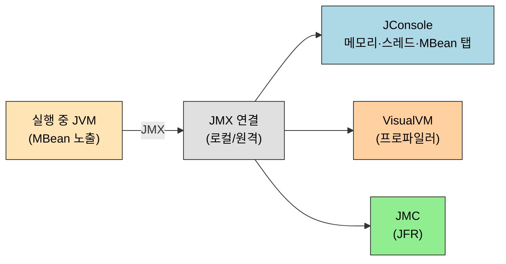
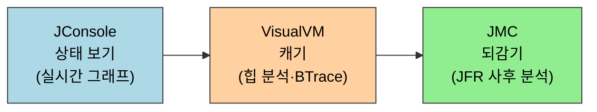

# 시각화 문제 해결 도구
---
> §4.3~§4.4는 [01-01](01-01.기본%20문제%20해결%20도구%20—%20명령줄%20도구.md)의 명령줄 도구가 콘솔에 텍스트로 쏟아내던 같은 데이터를 *그래프와 GUI*로 보는 도구를 다룹니다. 본 절을 한 줄로 압축하면 — **JHSDB로 메모리 안 객체를 들여다보고, JConsole·VisualVM·JMC로 힙·스레드·GC를 실시간 그래프로 관찰하며, HSDIS로 JIT가 만든 기계어까지 본다**. 텍스트 진단의 한계(추세를 눈으로 그려야 함, 데드락 교차를 손으로 따라가야 함)를 시각화가 메웁니다.

이 글을 읽고 나면 JConsole로 메모리 증가와 데드락을 그래프·버튼 한 번으로 확인하고, VisualVM의 BTrace로 *재시작 없이* 실행 중 메서드를 추적하며, JMC Flight Recorder로 저오버헤드 프로파일을 뜨고, HSDIS로 JIT 컴파일 결과를 디스어셈블해 읽을 수 있습니다.


## 1. JHSDB — 서비스 에이전트 기반 디버깅 도구

> §4.3.1. 실행 중인 프로세스(또는 코어 덤프)의 *메모리를 직접 들여다보는* 도구. 객체가 힙의 어느 영역에 있는지 주소 단위로 확인합니다.

`JHSDB`(Java HotSpot Debugger)는 HotSpot의 *서비스 에이전트*(Serviceability Agent) 위에서 동작합니다. 서비스 에이전트는 자바 API로 HotSpot의 *프로세스 메모리를 스냅숏처럼 읽는* 디버깅 기반입니다. 그래서 JHSDB는 일반 디버거가 멈춰 세운 프로세스가 아니라, *그 시점 메모리에 무엇이 어떤 주소에 놓였는가*를 봅니다.

쓰임새는 명령줄 도구로는 안 보이는 *물리적 배치*를 확인하는 데 있습니다. 예를 들어 정적 변수(`staticObj`)와 인스턴스 변수(`instanceObj`)가 가리키는 객체가 각각 힙의 어느 세대(Eden·Old)에 있는지, 64KB짜리 `int` 배열이 어느 주소에 자리 잡았는지를 JHSDB의 Object Histogram·Inspector로 주소까지 짚어볼 수 있습니다.

```bash
# 대상 프로세스를 JHSDB로 붙이기 (jps로 pid 확인 후)
jhsdb hsdb --pid 41212
# GUI 창에서 Tools → Object Histogram / Inspector 로
# 특정 객체의 주소·소속 메모리 영역 확인
```

JHSDB가 보여주는 "이 객체가 Eden에 있다 / Old로 승격됐다"는 정보는 [01-01 §3](01-01.기본%20문제%20해결%20도구%20—%20명령줄%20도구.md)의 `jstat`가 영역 *사용률(%)* 만 보던 것과 다릅니다. `jstat`는 "Old가 60% 찼다"까지지만, JHSDB는 "내가 만든 *바로 그 객체*가 Old의 이 주소에 있다"까지 내려갑니다. 승격 동작을 코드로 검증할 때 결정적입니다.


## 2. JConsole — 자바 모니터링·관리 콘솔

> §4.3.2. JMX 기반 GUI 모니터. 메모리·스레드·클래스·MBean을 실시간 그래프로 보고, *데드락을 버튼 한 번으로* 탐지합니다.

`JConsole`은 JMX(Java Management Extensions)를 토대로 한 GUI 모니터링 도구입니다. JMX는 실행 중인 JVM이 자신의 상태(MBean)를 외부에 노출하는 표준 인터페이스라, JConsole은 그 MBean을 읽어 *메모리·스레드·클래스·VM 요약*을 탭으로 보여줍니다. 명령줄 도구가 한 시점·한 종류 데이터를 뜨던 것을 *여러 지표를 동시에, 그래프로* 흐르게 봅니다.



### 메모리 모니터링

메모리 탭은 [01-01 §3](01-01.기본%20문제%20해결%20도구%20—%20명령줄%20도구.md)의 `jstat -gcutil`을 그래프로 옮긴 것입니다. Eden이 차면 Minor GC로 톱니처럼 떨어지고, Survivor를 거쳐 Old로 승격되는 모습이 시간축 그래프로 보입니다.

```java
// 책 §4.3.2 발췌 — JConsole 메모리 탭 관찰용
// VM 옵션: -Xms100m -Xmx100m -XX:+UseSerialGC
public class TestMemory {
    static class OOMObject {
        // 64KB 짜리 점유용 — Eden 을 빠르게 채워 톱니 그래프를 만든다
        public byte[] placeholder = new byte[64 * 1024];
    }

    // 살아 있는 객체를 리스트에 쥐고 있다 풀어, GC 톱니를 눈으로 만들기 위함
    public static void fillHeap(int num) throws InterruptedException {
        List<OOMObject> list = new ArrayList<>();
        for (int i = 0; i < num; i++) {
            Thread.sleep(50);          // 그래프가 천천히 그려지도록 텀을 둔다
            list.add(new OOMObject());
        }
        System.gc();                   // 마지막에 명시적 회수 — 그래프 급락 관찰
    }
}
```

`-XX:+UseSerialGC`로 고정하는 이유는, GC가 단순할수록 Eden→Survivor→Old 톱니가 그래프에서 또렷하게 보이기 때문입니다. 복잡한 G1·ZGC는 영역 경계가 흐려 학습용 관찰에는 오히려 어수선합니다.

### 스레드 모니터링과 데드락 탐지

스레드 탭은 각 스레드의 상태(RUNNABLE·BLOCKED·WAITING)와 호출 스택을 보여주고, *데드락 탐지(Detect Deadlock)* 버튼이 따로 있습니다. [01-01 §6](01-01.기본%20문제%20해결%20도구%20—%20명령줄%20도구.md)에서 `jstack` 출력의 `Found one Java-level deadlock`을 눈으로 찾던 일을, JConsole은 버튼 한 번으로 *순환 대기에 묶인 스레드만* 골라 보여줍니다.

```java
// 책 §4.3.2 발췌 — 데드락 + CPU 점유 데모 (JConsole 스레드 탭 관찰용)
public class ThreadMonitoringTest {
    // 무한 루프로 CPU 를 점유 — JConsole 스레드 탭에서 RUNNABLE 로 보인다
    public static void createBusyThread() {
        Thread t = new Thread(() -> {
            while (true) ;   // CPU 100% 점유, 스레드 상태 관찰용
        }, "testBusyThread");
        t.start();
    }

    // 서로의 락을 마주 기다려 데드락 — Detect Deadlock 버튼으로 잡힌다
    public static void createLockThread(final Object lock) {
        Thread t = new Thread(() -> {
            synchronized (lock) {
                try {
                    lock.wait();   // 락을 쥔 채 wait — 깨워줄 스레드가 없으면 영영 대기
                } catch (InterruptedException e) {
                    e.printStackTrace();
                }
            }
        }, "testLockThread");
        t.start();
    }
}
```

데드락 탐지 버튼을 따로 둔 이유는, 스레드가 수백 개인 운영 프로세스에서 사람이 스택을 일일이 대조해 순환을 찾는 건 비현실적이기 때문입니다. JVM이 가진 순환 대기 탐지를 GUI 버튼으로 노출해, 묶인 스레드 쌍만 즉시 추려줍니다.


## 3. VisualVM — 다용도 통합 도구

> §4.3.3. JConsole보다 한 발 더 나아간 통합 프로파일러. 힙 스냅숏 분석, CPU/메모리 프로파일링, 플러그인(BTrace)으로 *실행 중 동적 추적*까지 합니다.

`VisualVM`은 모니터링을 넘어 *프로파일링·힙 분석·플러그인 확장*을 하나로 묶은 도구입니다. 좌측 JVM Browser에 로컬·원격 프로세스가 트리로 뜨고, 각 프로세스의 Overview·Monitor·Threads·Sampler·Profiler 탭으로 들어갑니다. JConsole이 "지금 상태를 본다"면 VisualVM은 "어디가 느리고 무엇이 메모리를 잡는가까지 캡니다".

### 힙 스냅숏 분석

VisualVM은 힙 덤프를 떠서 *클래스별 인스턴스 수·점유 바이트·참조 관계*를 GUI로 분석합니다. [01-01 §5](01-01.기본%20문제%20해결%20도구%20—%20명령줄%20도구.md)의 `jmap -dump`로 뜬 `.hprof`를 열거나, VisualVM 안에서 바로 Heap Dump 버튼으로 뜹니다. `jhat`의 빈약한 웹 UI 대신 인스턴스를 클래스별로 정렬하고 보존 크기(retained size)까지 보여줘, 누수 범인 객체를 빠르게 좁힙니다.

### BTrace 플러그인 — 실행 중 동적 추적

VisualVM의 BTrace 플러그인은 *재시작 없이* 실행 중 프로그램에 추적 코드를 주입합니다. 운영 중인데 로그를 안 박아둔 메서드의 인자·반환·호출 횟수를 보고 싶을 때, 코드를 고쳐 재배포하지 않고 BTrace 스크립트로 즉석에서 관찰합니다.

```java
// 책 §4.3.3 발췌 — BTrace 스크립트 (대상 프로세스에 동적 주입)
@BTrace
public class TracingScript {
    // @OnMethod 로 대상 클래스의 메서드 진입을 가로채 인자를 찍는다
    @OnMethod(clazz = "Main", method = "add",
              location = @Location(Kind.RETURN))
    public static void func(@Self Object self, int a, int b,
                            @Return int result) {
        // 재시작 없이 실행 중 메서드의 인자·반환값을 콘솔로 출력
        println("a=" + a + ", b=" + b + ", result=" + result);
    }
}
```

BTrace가 가능한 까닭은, JVM이 *클래스 재정의(instrumentation)* API로 로딩된 바이트코드를 런타임에 교체하도록 허용하기 때문입니다. BTrace는 이 위에서 안전한(상태 변경 금지) 추적만 주입합니다. 운영 장애를 *코드 수정·재배포 없이* 들여다보는 강력한 우회로입니다.


## 4. JMC — Java Mission Control

> §4.3.4. JFR(Flight Recorder)로 *저오버헤드* 프로파일을 떠서 분석하는 상용급 진단 도구. 운영 환경에 켜둘 수 있을 만큼 가볍습니다.

`JMC`(Java Mission Control)는 JMX 콘솔과 JFR(Java Flight Recorder) 분석기를 묶은 도구입니다. 핵심은 JFR입니다 — JVM 내부에 *링 버퍼로 이벤트를 기록*하는 기능이라, 일반 프로파일러보다 오버헤드가 훨씬 낮아 운영 환경에 상시 켜둘 만합니다.

```bash
# JMX 연결로 원격/로컬 JVM 붙기 — JMC GUI 의 JVM Connection
# 대상 JVM 옵션 예:
#   -Dcom.sun.management.jmxremote.port=9999
#   -Dcom.sun.management.jmxremote.authenticate=false
#   -Dcom.sun.management.jmxremote.ssl=false
```

JMC에서 Flight Recording을 시작하면 지정 시간 동안 GC·할당·락 경합·메서드 핫스팟·I/O 같은 이벤트를 기록하고, 끝나면 타임라인으로 분석합니다. JConsole·VisualVM이 *실시간으로 보다 놓치면 끝*이라면, JFR은 *기록을 남겨 사후에 되감아* 본다는 점이 다릅니다. 그래서 "어제 새벽 한 번 튄 지연"처럼 재현이 어려운 문제에 강합니다.


## 5. 핫스팟 가상 머신 플러그인과 도구

> §4.4. JIT가 만든 *기계어*까지 내려가 보는 도구들. HSDIS로 바이트코드가 어떤 네이티브 코드로 컴파일됐는지 디스어셈블합니다.

§4.4는 HotSpot이 제공하는 더 깊은 도구를 다룹니다. 그중 `HSDIS`(HotSpot Disassembler)는 JIT 컴파일러가 *핫 메서드*를 어떤 기계어로 번역했는지 보여주는 디스어셈블러 플러그인입니다. [01-03 컴파일과 최적화](../ch01_java-tech/01-03.컴파일과%20최적화.md)에서 본 JIT 최적화가 *실제로 어떤 어셈블리로 떨어지는가*를 눈으로 확인하는 도구입니다.

```bash
# HSDIS 라이브러리를 JDK 에 둔 뒤, PrintAssembly 로 JIT 결과 출력
java -XX:+UnlockDiagnosticVMOptions -XX:+PrintAssembly \
     -Xcomp -XX:CompileCommand=dontinline,*Bar.sum \
     -XX:CompileCommand=compileonly,*Bar.sum Bar
```

```java
// 책 §4.4 발췌 — 디스어셈블 대상 (단순 산술 메서드)
public class Bar {
    int a = 1;
    static int b = 2;

    public int sum(int c) {
        return a + b + c;   // 이 메서드의 JIT 기계어를 PrintAssembly 로 관찰
    }

    public static void main(String[] args) {
        new Bar().sum(3);
    }
}
```

`-XX:+PrintAssembly`가 기본 비공개(diagnostic) 옵션이라 `-XX:+UnlockDiagnosticVMOptions`를 먼저 켜야 하는 이유는, 기계어 출력은 *디버깅·연구용*이지 일반 운영 옵션이 아니기 때문입니다. HSDIS 라이브러리(`hsdis-amd64`)가 JDK 경로에 있어야 사람이 읽을 어셈블리로 풀리고, 없으면 16진 바이트만 나옵니다. JITWatch 같은 도구는 이 출력을 다시 GUI로 시각화해 어떤 자바 줄이 어떤 기계어가 됐는지 매핑해 줍니다.


## 6. 면접 대비 요약

> 시각화 도구 4종을 *무엇을 보는가*로 갈라 말할 수 있으면 합격선입니다 — 상태 보기(JConsole) / 캐기(VisualVM) / 되감기(JMC) / 기계어(HSDIS).

### 한 줄 정의

시각화 문제 해결 도구란 *명령줄 도구가 텍스트로 뜨던 GC·힙·스레드·기계어 데이터를 GUI 그래프와 분석 화면으로 보여주는, JMX·서비스 에이전트·JFR 기반 진단 도구 모음*입니다.

세 JMX 도구는 *같은 데이터를 다른 깊이로* 봅니다. 깊이 순으로 한 줄에 꿰어 봅니다.



### 핵심 포인트 3가지

1. JConsole·VisualVM·JMC는 모두 JMX로 JVM 상태(MBean)를 읽지만 깊이가 다릅니다. JConsole은 실시간 보기, VisualVM은 프로파일링·힙 분석·동적 추적, JMC는 저오버헤드 기록(JFR) 후 사후 분석입니다.
2. BTrace는 클래스 재정의 API 위에서 *재시작 없이* 실행 중 메서드를 추적합니다. 운영 장애를 코드 수정 없이 들여다보는 우회로입니다.
3. HSDIS는 JIT가 만든 기계어를 디스어셈블합니다. `-XX:+UnlockDiagnosticVMOptions -XX:+PrintAssembly`로 켜고, HSDIS 라이브러리가 있어야 어셈블리로 풀립니다.

### 면접에서 받을 만한 질문

1. JConsole과 VisualVM과 JMC는 무엇이 다른가? 언제 무엇을 쓰는가?
2. 운영 환경에 상시 켜둘 만큼 가벼운 프로파일링은 무엇으로 하는가? 왜 가벼운가?
3. 로그를 안 박아둔 운영 메서드의 인자를 재배포 없이 보려면?
4. JHSDB가 `jstat`로는 못 보는 무엇을 보여주는가?

> 위 4개 질문에 *먼저 스스로 답해 보고* 아래 §정답으로 내려갑니다. 자답 없이 먼저 읽으면 학습 효과가 0입니다.


## 정답 (자답 후 펼치기)

> 위 §면접에서 받을 만한 질문 의 4개에 *먼저 자답한 뒤* 아래를 읽습니다.

### 정답 1 — JConsole vs VisualVM vs JMC

셋 다 JMX로 JVM 상태를 읽지만, JConsole은 *실시간 보기*(메모리·스레드 그래프, 데드락 버튼)에 머물고, VisualVM은 *캐기*(힙 덤프 분석, CPU/메모리 프로파일, BTrace 동적 추적)까지 가며, JMC는 *되감기*(JFR로 기록 후 타임라인 사후 분석)가 강점입니다. 빠른 현황 점검은 JConsole, 누수·병목 추적은 VisualVM, 재현 어려운 간헐 문제는 JMC로 갑니다.

### 정답 2 — 저오버헤드 상시 프로파일링

JMC의 JFR(Java Flight Recorder)로 합니다. JFR은 JVM 내부에 *링 버퍼로 이벤트를 기록*하는 방식이라 일반 프로파일러의 인스트루멘테이션 오버헤드가 거의 없어, 운영 환경에 켜둔 채 사후에 되감아 분석할 수 있습니다.

### 정답 3 — 재배포 없는 메서드 추적

VisualVM의 BTrace 플러그인으로 합니다. JVM의 클래스 재정의(instrumentation) API 위에서 *상태를 바꾸지 않는 추적 코드만* 실행 중 프로세스에 주입하므로, 코드를 고쳐 재배포하지 않고도 인자·반환·호출 횟수를 찍어볼 수 있습니다.

### 정답 4 — JHSDB가 보는 것

`jstat`는 힙 영역의 *사용률(%)* 까지만 보지만, JHSDB는 서비스 에이전트로 *프로세스 메모리를 직접 읽어* 특정 객체가 어느 세대의 어느 주소에 있는지를 보여줍니다. 객체 승격 같은 동작을 코드로 검증할 때 결정적입니다.


## 관련 문서

> 시각화 도구는 명령줄 도구가 뜬 같은 데이터를 GUI로 보는 짝입니다. HSDIS는 JIT 컴파일 학습과, 메모리 그래프는 GC 운영과 이어집니다.

- [01-01. 기본 문제 해결 도구 — 명령줄 도구](01-01.기본%20문제%20해결%20도구%20—%20명령줄%20도구.md) — JConsole·VisualVM이 GUI로 보는 데이터를 콘솔 텍스트로 뜨는 짝
- [01-03. 컴파일과 최적화](../ch01_java-tech/01-03.컴파일과%20최적화.md) § "JIT" — HSDIS로 디스어셈블해 보는 기계어가 만들어지는 JIT 최적화 단계
- [01-01. GC 운영 — 로그와 튜닝](../ch03_gc/01-01.GC%20운영%20—%20로그와%20튜닝.md) — JConsole 메모리 그래프의 톱니를 GC 로그·튜닝으로 깊이 보는 운영 갈래
