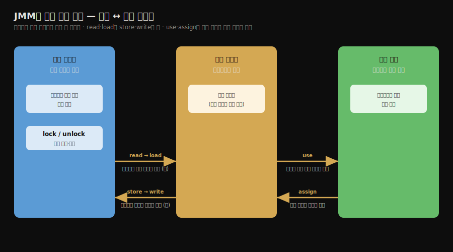

# 하드웨어 효율과 자바 메모리 모델
---
> §12.1~§12.3.1을 한 줄로 압축하면 — **자바 메모리 모델(JMM)은 멀티코어 하드웨어가 캐시와 비순차 실행으로 만들어 낸 가시성·순서 문제를 추상화한 명세이며, 변수를 메인 메모리와 작업 메모리로 나누고 둘 사이의 상호작용을 여덟 가지 원자 연산으로 규정합니다.** 핵심은 "하드웨어가 속도를 위해 만든 캐시 일관성 문제를 JMM이 언어 차원에서 한 번 더 추상화한다"는 점과, "스레드는 메인 메모리를 직접 못 만지고 반드시 작업 메모리를 거친다"는 구분입니다.

이 글을 읽고 나면 캐시 일관성과 비순차 실행이 왜 동시성 버그의 뿌리인지 말하고, JMM이 변수를 메인 메모리와 작업 메모리로 나누는 이유를 설명하며, 여덟 가지 연산이 어떤 순서 규칙으로 묶이는지 짚을 수 있습니다.

## 진입 — 왜 메모리 모델이 필요한가

> 동시성은 빠른 프로세서와 느린 메모리 사이의 속도 격차를 메우려는 노력에서 출발합니다. 그 노력이 캐시와 비순차 실행을 낳았고, 그것이 다시 멀티스레드 가시성 문제를 만들었습니다.

프로세서는 데이터를 읽고 작업 결과를 저장하기 위해 메모리 입출력이 반드시 필요합니다. 그런데 프로세서의 연산 속도와 메모리의 접근 속도 차이가 너무 큽니다. 이 격차를 그대로 두면 빠른 프로세서가 느린 메모리를 기다리느라 대부분의 시간을 놀게 됩니다.

그래서 현대의 컴퓨터 시스템은 프로세서마다 한 겹 이상의 **캐시**를 둡니다. 자주 쓰는 데이터를 프로세서 가까이에 복사해 두고, 연산은 캐시와 주고받은 뒤 끝나면 메모리에 다시 맞춰 쓰는 방식입니다. 캐시는 속도 격차를 메워 주지만, 새로운 문제를 가져옵니다. 프로세서가 여럿이면 각자의 캐시가 같은 메인 메모리 영역을 복사해 가질 수 있고, 그 값을 동시에 고치면 어느 캐시를 기준으로 맞춰야 할지 알 수 없게 됩니다. 이것이 **캐시 일관성(Cache Coherence)** 문제입니다.

자바 프로그램을 짜는 우리는 이 하드웨어 사정을 일일이 신경 쓰고 싶지 않습니다. 그래서 자바는 메모리 접근 규칙을 언어 차원에서 한 번 더 추상화합니다. 그 추상화가 바로 자바 메모리 모델입니다.

## 1. 하드웨어의 효율과 일관성

> 캐시 일관성 프로토콜과 비순차 실행은 프로세서가 속도를 끌어올리는 두 축입니다. 둘 다 단일 코어에서는 안전하지만 멀티코어에서는 가시성과 순서를 흔듭니다.

캐시 일관성 문제를 풀기 위해 프로세서는 캐시에 접근할 때 정해진 규약을 따릅니다. MESI, MSI 같은 **캐시 일관성 프로토콜**이 그것입니다. 이 프로토콜은 어느 캐시가 어떤 데이터를 수정 중인지 서로 알리고, 한 캐시가 값을 고치면 다른 캐시의 같은 값을 무효로 표시해 최신 값을 다시 읽게 만듭니다.

캐시 말고도 프로세서는 **비순차 실행(Out-of-Order Execution)** 으로 성능을 끌어냅니다. 코드에 적힌 명령어 순서를 그대로 따르지 않고, 의존 관계가 없는 명령어는 순서를 바꿔 먼저 실행하기도 합니다. 단 최종 결과만큼은 코드 순서대로 실행한 것과 같아 보이도록 재구성합니다. 그래서 단일 스레드 안에서는 비순차 실행을 알아챌 수 없습니다.

자바 가상 머신에도 비슷한 일이 있습니다. JIT 컴파일러가 **명령어 재정렬(Instruction Reordering)** 최적화를 수행하기 때문입니다. 하드웨어의 비순차 실행과 마찬가지로, JIT의 재정렬도 단일 스레드 결과는 보존하지만 다른 스레드가 그 변수를 관찰할 때는 순서가 뒤바뀐 것처럼 보일 수 있습니다. 컴파일과 최적화의 자세한 동작은 [JIT 컴파일러 정독 노트](../ch04_compilation-optimization/02-01.JIT%20컴파일러%20—%20인터프리터와%20계층형%20컴파일.md)에서 다룹니다.

## 2. 자바 메모리 모델이 추상화하는 것

> JMM은 하드웨어·운영체제마다 다른 메모리 모델 차이로부터 자바 프로그램을 보호하는 명세입니다. C/C++이 하드웨어 모델을 직접 쓰는 것과 달리, 자바는 한 겹의 추상을 끼워 어디서나 같은 동작을 보장합니다.

**자바 메모리 모델(Java Memory Model, JMM)** 은 자바 프로그램이 다양한 하드웨어와 운영체제의 메모리 모델 차이로부터 보호받도록 정의한 명세입니다. C/C++은 하드웨어와 운영체제의 메모리 모델을 직접 사용해서, 같은 코드라도 플랫폼마다 동시성 동작이 달라질 수 있고 그 차이를 개발자가 직접 감당해야 합니다.

JMM은 이 차이를 추상화해, 어떤 플랫폼에서 돌든 자바 코드의 동시성 동작이 일관되도록 보장합니다. 다시 말해 JMM은 "메모리에 언제 쓰고 언제 읽어야 하는가"의 규칙을 하드웨어가 아니라 자바 명세가 정하게 만든 장치입니다. JMM이 어떤 변수에 어떤 보장을 주는지는 [JMM 심화 노트](./05-01.Java%20Memory%20Model%20심화.md)에서 happens-before 중심으로 더 깊게 다룹니다.

## 3. 메인 메모리와 작업 메모리

> JMM은 변수를 모든 스레드가 공유하는 메인 메모리와 스레드마다 독립인 작업 메모리로 나눕니다. 스레드는 메인 메모리를 직접 만질 수 없고, 반드시 자신의 작업 메모리에 복사본을 두고 거기서만 연산합니다.

JMM은 모든 변수를 **메인 메모리(Main Memory)** 에 저장한다고 봅니다. 그리고 스레드마다 **작업 메모리(Working Memory)** 를 따로 둡니다. 작업 메모리는 그 스레드가 쓰는 변수의 **복사본**을 담는 공간입니다.

- **메인 메모리**: 인스턴스 변수, 정적 변수, 배열 요소처럼 모든 스레드가 공유하는 변수를 저장합니다.
- **작업 메모리**: 각 스레드에 독립적으로 존재하며, 메인 메모리에서 가져온 변수의 복사본을 담습니다. 지역 변수와 메서드 파라미터는 스레드 사이에 공유되지 않으므로 이 모델의 대상이 아닙니다.

핵심 규칙은 이것입니다. 스레드는 메인 메모리의 변수를 **직접 읽거나 쓸 수 없습니다.** 반드시 자신의 작업 메모리에 복사본을 만들고, 연산은 그 복사본에 대해서만 합니다. 한 스레드의 작업 메모리는 다른 스레드가 접근할 수 없습니다. 그래서 스레드 사이에 값을 주고받으려면 메인 메모리를 거쳐야 합니다.

이 구분이 가시성 문제의 뿌리입니다. 스레드 A가 작업 메모리의 복사본만 고치고 메인 메모리에 다시 쓰지 않으면, 스레드 B는 그 변경을 영영 보지 못할 수 있습니다.

## 4. 메인 메모리와 작업 메모리 사이의 여덟 가지 연산

> JMM은 두 메모리 사이의 모든 상호작용을 여덟 개의 원자 연산으로 정의합니다. 읽기는 read·load 한 쌍으로, 쓰기는 store·write 한 쌍으로 움직이며, 잠금은 lock·unlock이 맡습니다.

메인 메모리와 작업 메모리 사이에 변수가 어떻게 오가는지를 JMM은 여덟 가지 연산으로 못 박습니다. 각 연산은 **원자적**으로 수행됩니다.

| 연산 | 대상 | 하는 일 |
|------|------|---------|
| `lock`(잠금) | 메인 메모리 | 변수를 한 스레드가 독점하도록 표시 |
| `unlock`(잠금 해제) | 메인 메모리 | 잠긴 변수를 풀어 다른 스레드가 잠글 수 있게 함 |
| `read`(읽기) | 메인 메모리 | 변수 값을 메인 메모리에서 작업 메모리로 전송 |
| `load`(적재) | 작업 메모리 | `read`로 가져온 값을 작업 메모리의 복사본에 넣음 |
| `use`(사용) | 작업 메모리 | 작업 메모리의 값을 실행 엔진에 전달 |
| `assign`(할당) | 작업 메모리 | 실행 엔진이 받은 값을 작업 메모리의 변수에 대입 |
| `store`(저장) | 작업 메모리 | 작업 메모리의 값을 메인 메모리로 전송 |
| `write`(쓰기) | 메인 메모리 | `store`로 보낸 값을 메인 메모리의 변수에 기록 |

변수 하나를 메인 메모리에서 작업 메모리로 읽어 오려면 `read` 다음에 `load`를 순서대로 실행합니다. 작업 메모리의 값을 메인 메모리에 되돌려 쓰려면 `store` 다음에 `write`를 실행합니다. read·load와 store·write가 각각 짝을 이룬다는 점이 중요합니다.

## 5. 여덟 연산이 지켜야 하는 규칙

> 여덟 연산은 마음대로 섞일 수 없습니다. JMM은 read·load와 store·write를 짝으로 묶고, assign 후에는 반드시 메인 메모리에 동기화하도록 규정해, 작업 메모리와 메인 메모리가 어긋나지 않게 합니다.

JMM은 위 여덟 연산을 쓸 때 지켜야 할 규칙을 정해 둡니다. 핵심만 추리면 다음과 같습니다.

- `read`와 `load`, `store`와 `write`는 각각 **짝으로** 나타나야 합니다. 하나만 따로 쓸 수 없습니다.
- 스레드가 작업 메모리에서 변수를 `assign`으로 바꿨다면, 그 변경을 메인 메모리에 **반드시 동기화**해야 합니다. 바꾼 적이 없다면 까닭 없이 메인 메모리에 되쓰지 못합니다.
- 스레드는 새로 만든(메인 메모리에서 `load`하거나 `assign`한 적 없는) 변수를 작업 메모리에서 `use`하거나 `store`할 수 없습니다. 즉 변수는 쓰기 전에 반드시 초기화 경로를 거쳐야 합니다.
- 한 변수는 같은 시각에 하나의 스레드만 `lock`할 수 있습니다. 단 같은 스레드는 같은 변수를 여러 번 `lock`할 수 있고, 그만큼 `unlock`해야 풀립니다.
- 변수에 `lock`을 걸면 그 스레드의 작업 메모리에 있던 그 변수의 값이 비워져, `use`하기 전에 메인 메모리에서 다시 `load`하거나 `assign`해야 합니다.
- `unlock`하기 전에는 그 변수를 메인 메모리에 `store`·`write`로 동기화해야 합니다.

이 규칙들이 곧 다음 편에서 다룰 `volatile`·`synchronized`의 동작 근거가 됩니다. 가령 "`unlock` 전에 메인 메모리로 동기화한다"는 규칙이 `synchronized` 블록을 빠져나갈 때 변경이 다른 스레드에 보이는 까닭입니다.

## 6. 면접 대비 요약

> 세 질문에 *먼저 스스로 답해 본 뒤* 아래 정답으로 내려갑니다. 자답 없이 읽으면 학습 효과가 줄어듭니다.

1. 자바 메모리 모델은 무엇을 추상화하며, 왜 필요한가요?
2. 메인 메모리와 작업 메모리는 어떻게 다르며, 스레드는 둘을 어떻게 오갑니까?
3. 여덟 연산 중 read·load와 store·write가 짝을 이뤄야 하는 까닭은 무엇인가요?

### 정답

1. JMM은 하드웨어·운영체제마다 다른 메모리 모델 차이를 추상화합니다. 멀티코어의 캐시 일관성 문제와 비순차 실행·명령어 재정렬이 멀티스레드 가시성과 순서를 흔드는데, JMM은 그 위에 한 겹의 규칙을 얹어 어떤 플랫폼에서든 자바 코드의 동시성 동작이 일관되게 보장합니다.

2. 메인 메모리는 모든 스레드가 공유하는 변수(인스턴스·정적·배열 요소)를 담고, 작업 메모리는 스레드마다 독립적으로 그 변수의 복사본을 담습니다. 스레드는 메인 메모리를 직접 읽거나 쓸 수 없고, 반드시 작업 메모리의 복사본을 거쳐 연산하며, 스레드 사이의 값 전달은 메인 메모리를 통해서만 일어납니다.

3. 읽기는 메인 메모리에서 값을 꺼내는 `read`와 그 값을 작업 메모리 복사본에 넣는 `load`가 한 동작을 이루기 때문입니다. 마찬가지로 쓰기는 작업 메모리 값을 내보내는 `store`와 메인 메모리에 기록하는 `write`가 한 동작입니다. 짝을 강제해야 값이 전송만 되고 반영되지 않거나, 반영만 되고 전송되지 않는 어긋남을 막을 수 있습니다.

## 관련 문서

- [01-02.volatile·happens-before·원자성](./01-02.volatile·happens-before·원자성.md) — 이 편의 여덟 연산 규칙을 바탕으로 `volatile`의 가시성·재정렬 금지와 happens-before를 다룹니다.
- [05-01.Java Memory Model 심화](./05-01.Java%20Memory%20Model%20심화.md) — happens-before 6규칙, 메모리 펜스, DCL 패턴을 더 깊게 봅니다.
- [05-02.Virtual Threads 기초](./05-02.Virtual%20Threads%20기초.md) — 스레드 모델의 실무 활용 갈래입니다.
- [JIT 컴파일러 — 인터프리터와 계층형 컴파일](../ch04_compilation-optimization/02-01.JIT%20컴파일러%20—%20인터프리터와%20계층형%20컴파일.md) — 명령어 재정렬을 수행하는 백엔드 컴파일을 다룹니다.
