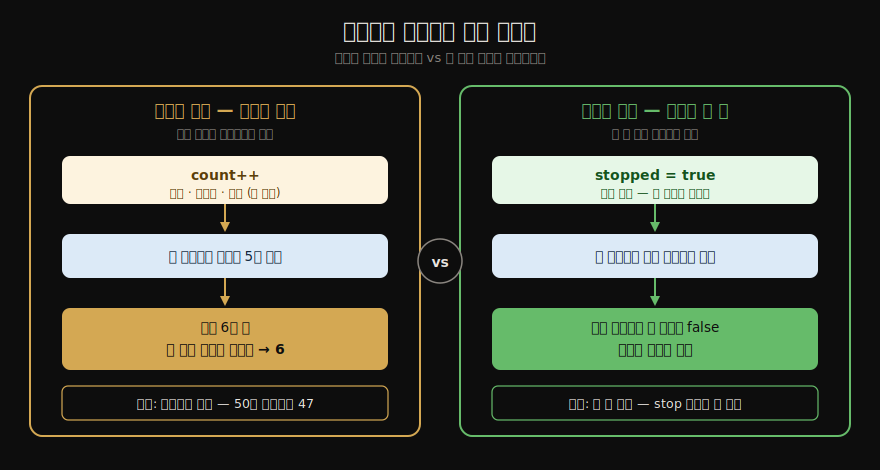
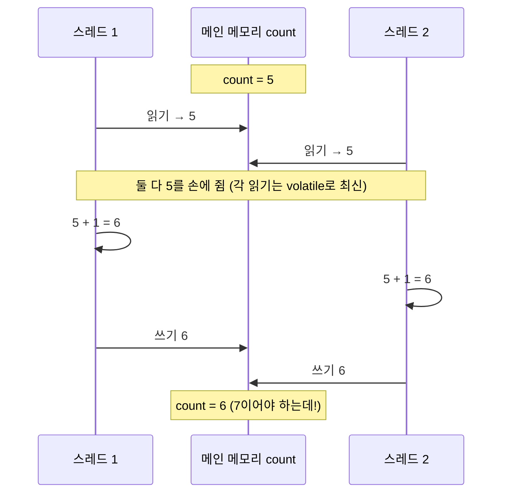
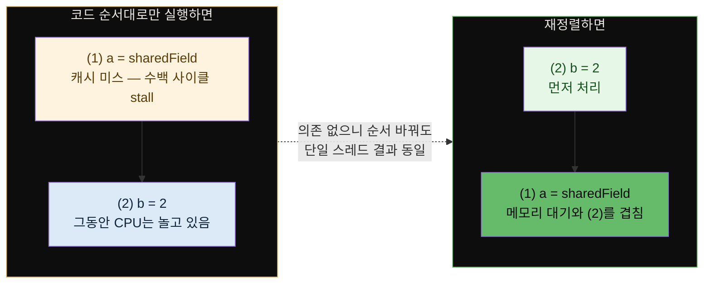
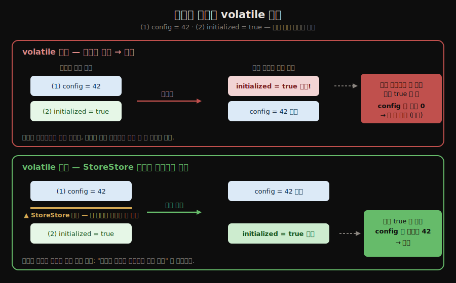
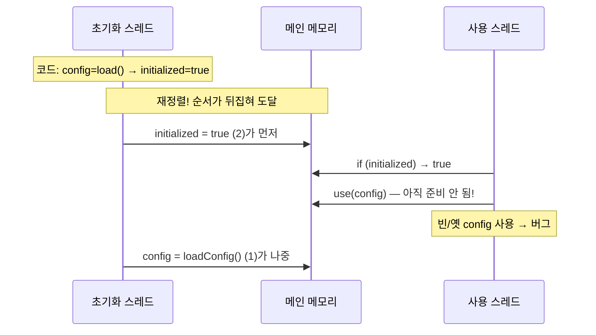
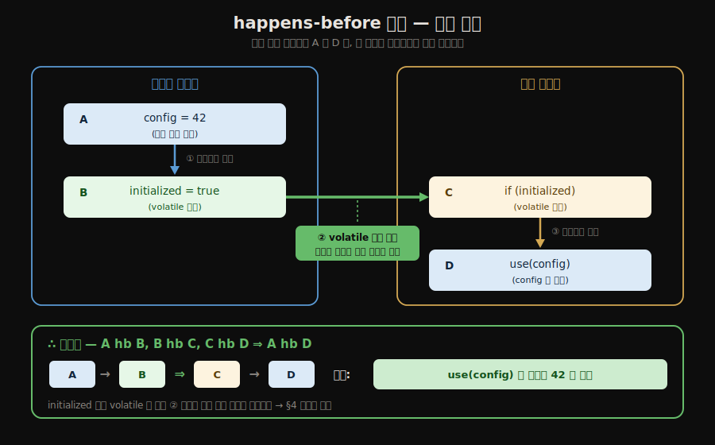

# volatile·happens-before·원자성
---
> **JMM의 보장은 원자성·가시성·순서성 세 특성으로 요약되며, `volatile`은 가시성과 재정렬 금지를 싼값에 주지만 원자성은 주지 않고, happens-before는 "동기화 코드를 일일이 따지지 않고도 두 연산의 선후를 판단하게 해 주는" 상위 규칙입니다.** 
>
> 핵심은 "`volatile` 카운터 증가가 왜 깨지는가"와 "happens-before만 성립하면 가시성을 신뢰해도 된다"는 두 가지입니다.

이 글을 읽고 나면 `volatile`이 보장하는 것과 보장하지 않는 것을 구분하고, `long`/`double`의 비원자성이 무엇인지 설명하며, happens-before의 여덟 규칙으로 두 연산의 선후를 따질 수 있습니다.


## 진입 — 세 특성으로 동시성을 본다

> [앞 편](./01-01.하드웨어%20효율과%20자바%20메모리%20모델.md)이 메모리를 메인·작업으로 나누고 여덟 연산을 정의했다면, 이 편은 그 모델 위에서 자바가 보장하는 세 가지 성질과 그것을 표현하는 도구를 봅니다.

JMM이 동시성에 대해 무엇을 보장하는지는 세 가지 특성으로 정리됩니다. **원자성(Atomicity)**, **가시성(Visibility)**, **순서성(Ordering)** 입니다. 동시성 버그는 거의 언제나 이 셋 중 하나가 깨져서 생깁니다. `volatile`·`synchronized`·`final` 같은 도구는 이 셋 중 무엇을 보장하고 무엇을 보장하지 않는지로 성격이 갈립니다.


## 1. 원자성 — 무엇이 쪼개지지 않는가

> JMM은 기본 읽기·쓰기를 원자적으로 보장하지만, 그것은 단일 연산일 때뿐입니다. 여러 연산의 묶음은 원자적이지 않고, `long`·`double`은 단일 읽기·쓰기조차 둘로 쪼개질 수 있습니다.

원자성은 한 연산이 도중에 끼어들 수 없이 통째로 수행되는 성질입니다. JMM이 직접 원자성을 보장하는 것은 앞 편의 여섯 연산, 곧 `read`·`load`·`use`·`assign`·`store`·`write`입니다. 그래서 기본 자료형 변수 하나를 읽거나 쓰는 단일 동작은 원자적입니다.

문제는 **여러 연산의 묶음**입니다. 더 큰 범위의 원자성이 필요하면 `synchronized`가 제공하는 `lock`·`unlock`(바이트코드로는 `monitorenter`·`monitorexit`)으로 묶어야 합니다.

- `long`과 `double`은 예외 항목입니다. 이 둘은 64비트인데, JMM은 64비트 값의 읽기·쓰기를 두 번의 32비트 연산으로 나눠 수행하는 것을 **허용**합니다. 따라서 동기화 없이 여러 스레드가 같은 `long` 변수를 읽고 쓰면, 절반만 갱신된 값(앞 32비트는 새 값, 뒤 32비트는 옛 값)을 읽을 수 있습니다. 
- 다만 실무에서는 거의 문제가 되지 않습니다. 상용 JVM 대부분이 64비트 읽기·쓰기를 원자적으로 구현하기 때문입니다. 그래도 명세가 보장하지 않으므로, 공유되는 `long`/`double`에는 `volatile`을 붙이는 편이 안전합니다.


## 2. 가시성 — volatile이 주는 것

> 가시성은 한 스레드의 변경이 다른 스레드에 즉시 보이는 성질입니다. `volatile`은 쓰는 즉시 메인 메모리에 동기화하고 읽을 때마다 메인 메모리에서 새로 읽어, 가시성을 가장 싼값에 보장합니다.

가시성은 한 스레드가 공유 변수를 바꾸면 다른 스레드가 그 변경을 즉시 볼 수 있는 성질입니다. 앞 편에서 봤듯, 스레드는 작업 메모리의 복사본을 고치므로 메인 메모리에 되쓰기 전에는 변경이 남에게 보이지 않습니다.

`volatile`은 이 문제를 두 규칙으로 풉니다. 

1. 첫째, `volatile` 변수를 쓰면 그 값을 **즉시 메인 메모리에 동기화**합니다. 
2. 둘째, `volatile` 변수를 읽을 때마다 작업 메모리의 복사본을 무시하고 **메인 메모리에서 새로 읽습니다**. 그래서 항상 최신 값을 보게 됩니다.

가장 흔한 쓰임은 종료 플래그입니다.

```java
public class StopFlag {
    private volatile boolean stopped = false;  // volatile 없으면 루프가 끝나지 않을 수 있다

    public void stop() { stopped = true; }

    public void run() {
        while (!stopped) {   // 항상 메인 메모리에서 최신 값을 읽는다
            doWork();
        }
    }
}
```

- `volatile`이 없으면 `run`을 도는 스레드가 작업 메모리에 캐싱한 `stopped`의 옛 값(`false`)만 계속 읽어, 다른 스레드가 `stop()`을 불러도 루프가 멈추지 않을 수 있습니다.

### 원자성과 가시성은 다른 축이다

둘은 헷갈리기 쉽지만 *서로 독립된 문제*입니다. 한 문장으로 가르면 이렇습니다. **원자성은 "연산이 쪼개져 섞이지 않는가"이고, 가시성은 "내가 쓴 값이 남에게 전파되는가"입니다.** 결정적 단서는, **단 한 번의 완벽히 원자적인 쓰기**(`stopped = true`)라도 가시성은 깨질 수 있다는 점입니다. 쓰기 자체는 쪼개지지 않았는데도(원자성 OK), 그 결과가 다른 스레드의 작업 메모리에 전파되지 않으면 남은 옛 값을 봅니다(가시성 FAIL).

| | 원자성 | 가시성 |
|---|--------|--------|
| 무엇을 보장 | 연산이 도중에 끼어듦 없이 통째로 | 쓴 값이 다른 스레드에 즉시 보임 |
| 깨질 때 증상 | **잃어버린 갱신** — 50번 더했는데 47 | **옛 값 관찰** — stop 켰는데 루프가 안 멈춤 |
| 몇 개의 연산에서 | 여러 연산의 묶음에서만 (`count++`) | **단 한 번의 쓰기**로도 (`flag = true`) |
| `volatile`이 주나 | ❌ 안 줌 | ✅ 줌 |



> 그래서 종료 플래그(`stopped`)에는 `volatile`만으로 충분하지만 — 쓰기가 한 번뿐이라 원자성은 애초에 문제가 안 되고 가시성만 필요하니까 — `count++` 같은 복합 연산에는 `volatile`로는 부족합니다. 다음 절이 그 까닭입니다.


## 3. volatile이 주지 않는 것 — 원자성

> `volatile`은 가시성과 순서는 주지만 원자성은 주지 않습니다. `count++`처럼 읽고·더하고·쓰는 복합 연산은 `volatile`만으로 안전해지지 않습니다.

`volatile`의 가장 큰 함정은 원자성을 보장한다고 착각하는 것입니다. 다음 코드는 `volatile`을 붙여도 멀티스레드에서 깨집니다.

```java
private volatile int count = 0;

// count++ 는 "읽기 → 더하기 → 쓰기" 세 단계로 쪼개진다
public void increment() { count++; }
```

- `count++`는 한 줄처럼 보이지만, 바이트코드로는 현재 값을 읽고(`getfield`/`getstatic`), 1을 더하고(`iadd`), 결과를 되쓰는(`putfield`/`putstatic`) 세 동작입니다.
-  `volatile`은 각 읽기·쓰기를 최신 값으로 만들어 줄 뿐, **세 동작이 끼어듦 없이 한 묶음으로 실행되도록** 막아 주지는 않습니다.

두 스레드가 동시에 `count`(값 5)를 읽으면 둘 다 5를 보고, 각자 6을 써서 결과가 7이 아니라 6이 됩니다. 아래는 그 인터리빙입니다. 두 스레드가 *각자의 읽기·쓰기*는 `volatile` 덕분에 최신값을 보지만, T1의 "읽기→쓰기" 사이에 T2가 끼어드는 것을 막지 못해 한 번의 증가가 증발합니다.



> `volatile`이 보장한 것은 "읽을 때 최신을 본다"뿐입니다. T1이 5를 읽고 6을 쓰기까지의 *틈*에 T2가 끼어드는 것 — 즉 세 동작을 한 묶음으로 잠그는 것 — 은 보장하지 않습니다. 그래서 복합 연산엔 `synchronized`나 CAS(`AtomicInteger`)가 필요합니다.


- 이런 복합 연산의 원자성은 `synchronized`, `java.util.concurrent.atomic`의 CAS 기반 클래스(`AtomicInteger` 등), 또는 락으로 풀어야 합니다. 

### 그래서 셋 중 무엇을 고르나 — 선택 기준 한눈에

`volatile`·`synchronized`·`AtomicInteger`는 *무엇을 보장하느냐* 로 쓰임이 갈립니다. 핵심만 추리면 이렇습니다.

| 도구 | 보장 | 언제 쓰나 | 예 |
|------|------|----------|-----|
| `volatile` | 가시성 + 순서 (**원자성 X**) | 한 스레드가 쓰고 나머지는 읽기만 하는 **단순 플래그·상태** | 종료 플래그, 발행 패턴의 깃발 |
| `AtomicInteger` 등 | 가시성 + 순서 + **원자성** (CAS, 비블로킹) | **단일 변수**의 복합 연산 (증가·누산) | 공유 카운터 `incrementAndGet()` |
| `synchronized` | 가시성 + 순서 + **원자성** (락, 블로킹) | **여러 변수·여러 줄**을 한 묶음으로 묶는 임계 구역 | 잔액 확인 후 출금 같은 묶음 연산 |

판단의 갈림길은 둘입니다. 

- **(1) 복합 연산인가?** 아니면 `volatile` 로 충분합니다. 
- **(2) 묶을 범위가 변수 하나인가, 여러 줄인가?** 변수 하나면 `AtomicInteger`(가볍고 비블로킹), 여러 줄이면 `synchronized`(범위를 락으로 감쌈).

> 성능(블로킹 vs 비블로킹·CAS 스핀)·`final` 까지 포함한 **상세 비교 표는 아래 §6**에 있습니다.


## 4. 순서성과 long/double — volatile의 재정렬 금지

> `volatile`의 두 번째 효능은 명령어 재정렬을 막는 것입니다. 그래서 "한 변수를 플래그로 써서 다른 변수의 준비 완료를 알리는" 패턴이 안전해집니다.

순서성은 한 스레드의 연산이 다른 스레드에서 보일 때 코드 순서대로 보이는 성질입니다. 앞 편에서 본 비순차 실행과 JIT 재정렬 때문에, 동기화가 없으면 다른 스레드는 연산 순서가 뒤바뀐 것처럼 관찰할 수 있습니다.

### 왜 순서를 바꾸나 — 재정렬은 대기 시간을 숨기는 최적화

재정렬은 게으름이 아니라 *성능을 위한 의도된 최적화*입니다. 

- CPU와 컴파일러는 **서로 의존이 없는** 두 명령의 순서를 바꿔도 단일 스레드 결과가 같으면 자유롭게 바꿉니다. 
- 이득은 **대기 시간 숨기기**입니다. 앞 명령이 캐시 미스로 메모리(수백 사이클)를 기다리는 동안 CPU가 멈춰(stall) 있지 않고, 뒤에 있던 의존 없는 명령을 먼저 실행해 파이프라인을 놀리지 않습니다.

```java
a = sharedField;   // (1) 캐시 미스 → 메모리에서 오기까지 수백 사이클 대기
b = 2;             // (2) (1)과 무관 — 로컬 계산, 즉시 가능
```



> 단일 스레드에서는 "의존 없는 것만" 바꾸므로 결과가 항상 같아 안전합니다. 문제는 **다른 스레드가 볼 때**입니다. 그 스레드 입장에선 `(2)`가 `(1)`보다 먼저 일어난 것처럼 관찰돼, 아래 초기화 패턴 같은 버그가 생깁니다.

`volatile`은 해당 변수에 대한 읽기·쓰기 주위로 **메모리 펜스**를 세워 재정렬을 금지합니다. 덕분에 다음 패턴 — 흔히 **발행(publish) 패턴**이라 부르는, "한 변수를 깃발로 써서 그 앞에서 준비한 데이터가 다 됐다고 알리는" 구조 — 이 안전해집니다.

```java
int config;                       // 일반 변수 (실제 데이터)
volatile boolean initialized;     // volatile 깃발 (준비 완료 신호)

// ── 초기화(생산) 스레드 ──
config = loadConfig();            // (1) 무거운 준비 작업: 예) 42 를 채움
initialized = true;               // (2) "다 됐다"고 깃발을 올림

// ── 사용(소비) 스레드 ──
if (initialized) {                // (3) 깃발이 올라갔나?
    use(config);                  // (4) 올라갔으면 config 는 준비됐다고 믿고 씀
}
```

#### 왜 (1)과 (2)의 순서가 바뀔 수 있는가

핵심은 **(1)과 (2)는 서로 의존이 없다**는 점입니다. 

- `config = loadConfig()`의 결과를 `initialized = true`가 쓰지 않고, 그 반대도 아닙니다. 한 스레드만 놓고 보면 둘을 어느 순서로 실행하든 그 스레드가 보는 최종 상태(`config=42, initialized=true`)는 똑같습니다. 
- 그래서 **CPU나 JIT 컴파일러는 둘의 순서를 자유롭게 바꿀 자격이 있습니다.**

바꾸면 왜 이득이냐?

- `loadConfig()`가 무겁거나 그 결과 쓰기가 캐시 미스로 늦어질 때, CPU는 그걸 기다리며 멈춰 있지 않고 **가벼운 `initialized = true`를 먼저 메모리에 반영**해 버립니다(앞 절의 "대기 시간 숨기기"). 단일 스레드 결과가 같으니 정당한 최적화입니다.

문제는 **다른 스레드가 그 중간 상태를 엿볼 때**입니다. 

- 재정렬로 `initialized = true`가 `config` 쓰기보다 먼저 메모리에 도달하면, 그 찰나에 사용 스레드가 끼어들어 `(3)`에서 깃발이 올라간 걸 보고 `(4)`에서 **아직 준비 안 된 `config`(0 또는 옛 값)** 를 씁니다. 깃발만 믿었다가 빈 상자를 받는 셈입니다.

`initialized`를 `volatile`로 선언하면 그 쓰기 **앞**에 **StoreStore 펜스**가 박혀, `(1)`의 일반 쓰기를 `(2)` 뒤로 넘기지 못하게 막습니다. 그래서 "깃발이 보이면 그 앞 데이터는 반드시 다 준비됐다"가 보장됩니다. 메모리 펜스의 종류와 동작은 아래 §6에서 봅니다.



위 그림 아래쪽처럼 `volatile` 펜스는 *재정렬을 물리적으로 가로막아*, 깃발(`initialized`)이 항상 데이터(`config`) 뒤에 오도록 강제합니다. 아래 시퀀스는 펜스가 **없을 때** 사용 스레드가 빈 `config`를 보는 시간 흐름을 따로 보여 줍니다.



> `initialized`를 `volatile`로 두면 그 쓰기 앞의 일반 쓰기(`config`)를 뒤로 넘기지 못하게 펜스가 막습니다. 그 결과 "`initialized`가 참으로 보이면 `config`는 이미 준비됐다"가 보장됩니다 — 이것이 다음 절 happens-before의 **volatile 변수 규칙**이 코드 수준에서 작동하는 모습입니다.


## 5. happens-before — 선후를 판단하는 상위 규칙

> **happens-before는. "A의 결과가 B에 반드시 보이는가"를 동기화 코드를 일일이 따지지 않고 판단하게 해 주는 규칙입니다.** 
>
> JMM은 동기화 없이도 성립하는 선천적 happens-before 관계 여덟 가지를 정해 둡니다.

가시성과 순서를 매번 메모리 연산 수준으로 따지는 것은 번거롭습니다. JMM은 이를 **happens-before**라는 한 단계 높은 규칙으로 정리합니다.

happens-before는 "연산 A가 연산 B보다 먼저 일어난다"는 인과 관계입니다. 

- A happens-before B가 성립하면, **A의 결과(A가 바꾼 변수 값)는 B에서 반드시 보입니다.** 중요한 점은 이것이 시간 순서가 아니라 **가시성 보장**이라는 것입니다. 
- 시간상 A가 먼저 실행돼도 happens-before가 없으면 B는 A의 결과를 못 볼 수 있습니다.

#### "시간 순서가 아니다"가 무슨 뜻인가

이 말이 헷갈리는 까닭은, 우리가 "먼저 일어난다"를 *시계로* 생각하기 때문입니다. happens-before는 시계가 아니라 **"보장의 화살표"** 입니다. 두 표현을 갈라 봅시다.

- **시간 순서(wall-clock)**: 단순히 A가 B보다 *먼저 실행됐다*는 사실. 이것만으로는 **아무것도 보장하지 않습니다.** 재정렬·캐시 미전파 때문에, A가 시간상 먼저 끝났어도 B는 A가 바꾼 값을 못 볼 수 있습니다.
- **happens-before**: A의 결과가 B에 **반드시 보인다**는 *약속*. 이 약속은 시계가 아니라 위의 여덟 규칙으로 *성립 여부가 정해집니다*.

그래서 두 경우가 갈립니다.

| 상황 | 결과 |
|------|------|
| 시간상 A 먼저, 그러나 hb 사슬 **없음** | B는 A의 결과를 **못 볼 수 있음** (재정렬·캐시) |
| 시간상 순서와 무관, 그러나 hb 사슬 **있음** | B는 A의 결과를 **반드시 봄** |

> 즉 *"먼저 실행됐다"* 와 *"보인다"* 는 별개입니다. happens-before는 후자만 약속합니다. 동기화 도구(`volatile`·`synchronized`)를 쓰는 이유가 바로 이 **사슬을 만들기 위해서** 입니다.

JMM은 동기화 코드를 따로 쓰지 않아도 성립하는 happens-before 관계 여덟 가지를 명세에 박아 둡니다.

- **프로그램 순서 규칙**: 한 스레드 안에서 앞 코드는 뒤 코드보다 happens-before입니다.
- **모니터 락 규칙**: 한 락의 `unlock`은 이후 같은 락의 `lock`보다 happens-before입니다.
- **volatile 변수 규칙**: `volatile` 변수 쓰기는 이후 같은 변수 읽기보다 happens-before입니다.
- **스레드 시작 규칙**: `Thread.start()`는 그 스레드의 모든 동작보다 happens-before입니다.
- **스레드 종료 규칙**: 스레드의 모든 동작은 그 스레드의 종료 감지(`Thread.join()` 반환, `isAlive()` 거짓)보다 happens-before입니다.
- **스레드 인터럽트 규칙**: `Thread.interrupt()` 호출은 인터럽트 감지(`interrupted()`)보다 happens-before입니다.
- **객체 종료 규칙**: 객체의 생성자 완료는 그 객체의 `finalize()` 시작보다 happens-before입니다.
- **전이성 규칙**: A happens-before B이고 B happens-before C이면, A happens-before C입니다.

이 여덟 규칙으로 두 연산 사이에 happens-before 사슬을 이을 수 있으면, 두 연산은 동기화돼 있다고 믿어도 됩니다. 반대로 사슬을 잇지 못하면, 시간상 선후와 무관하게 재정렬·가시성 문제가 생길 수 있습니다.

### 사슬 잇기 실전 — 발행 패턴이 왜 안전한가

여덟 규칙은 따로 외우는 목록이 아니라 **사슬의 고리**입니다. 여러 규칙을 **전이성**으로 이어 붙여, "직접 동기화하지 않은 두 연산"의 가시성까지 보장하는 게 핵심입니다. §4의 발행 패턴(`config`/`initialized`)을 다시 봅시다 — 초기화 스레드의 `config = 42`와 사용 스레드의 `use(config)`는 *서로 다른 스레드*라 직접 연결이 없는데도, 세 규칙을 이으면 사슬이 완성됩니다.

```java
// 초기화 스레드            // 사용 스레드
config = 42;        // A     if (initialized)    // C  (volatile 읽기)
initialized = true; // B         use(config);    // D
```

1. **A hb B** — 같은 스레드 안, 앞 코드가 뒤 코드보다 먼저 (프로그램 순서 규칙)
2. **B hb C** — `initialized` volatile 쓰기는 이후 같은 변수 읽기보다 먼저 (volatile 변수 규칙) ← *스레드를 건너뛰는 유일한 고리*
3. **C hb D** — 같은 스레드 안, 앞 코드가 뒤 코드보다 먼저 (프로그램 순서 규칙)
4. **∴ A hb D** — 전이성으로 사슬 완성 → 사용 스레드의 `use(config)`는 **반드시 42를 본다**



> 결정적인 고리는 2번(volatile 변수 규칙)입니다. 이것만이 *스레드 경계를 넘는* 보장을 주고, 나머지 둘(프로그램 순서)이 각 스레드 안에서 그 보장을 양 끝까지 끌어옵니다. `initialized`에서 `volatile`을 빼면 2번 고리가 끊기고, 사슬 전체가 무너져 사용 스레드는 빈 `config`를 볼 수 있습니다 — §4에서 본 재정렬 버그가 바로 이 "끊긴 사슬"입니다.

## 6. 심화 — 메모리 펜스·final 안전 공개·DCL

지금까지의 가시성·순서성·happens-before를 *구현 수준*에서 떠받치는 세 주제입니다. 면접·실무에서 자주 깊게 묻는 곳입니다.

### 메모리 펜스의 네 종류

§4에서 `volatile`이 **메모리 펜스**로 재정렬을 막는다고 했습니다. JVM이 삽입하는 펜스는 네 종류입니다.

- **LoadLoad**: 이전 Load 완료 후 이후 Load 실행
- **StoreStore**: 이전 Store 완료 후 이후 Store 실행
- **LoadStore**: 이전 Load 완료 후 이후 Store 실행
- **StoreLoad**: 이전 Store 완료 후 이후 Load 실행. 네 가지 중 가장 비쌈

`volatile` 쓰기 *앞*엔 StoreStore, *뒤*엔 StoreLoad가, `volatile` 읽기 *뒤*엔 LoadLoad·LoadStore가 삽입됩니다. §4의 발행 패턴이 안전한 게 이 펜스들 덕분입니다.

```java
volatile boolean flag = false;
// 스레드 A
data = 42;       // StoreStore 펜스가 이 쓰기를 flag 앞에 묶음
flag = true;     // volatile 쓰기 → 뒤에 StoreLoad
// 스레드 B
if (flag) {      // volatile 읽기 → 뒤에 LoadLoad+LoadStore
    use(data);   // 반드시 42를 본다
}
```

### final 필드의 안전한 공개

**안전한 공개(safe publication)** 는 한 스레드가 만든 객체를 다른 스레드가 *완전한 상태로* 보게 하는 것입니다. `final` 필드는 JMM에서 특별히 취급됩니다 — **생성자가 끝나면 모든 `final` 필드는 어느 스레드에서도 올바른 값으로 보입니다.** 단, 생성자 안에서 `this`가 밖으로 새지 않아야 합니다.

```java
class ImmutablePoint {
    final int x, y;
    ImmutablePoint(int x, int y) { this.x = x; this.y = y; }
    // 생성 완료 후 모든 스레드에서 x·y가 안전하게 보임 (동기화 불필요)
}

class UnsafePoint {
    final int x;
    static UnsafePoint instance;
    UnsafePoint(int x) {
        instance = this;  // ❌ 생성 완료 전 this 누출 → final 보장 깨짐
        this.x = x;
    }
}
```

이것이 [02-01](./02-01.스레드%20안전성%20—%20다섯%20등급.md)의 *불변 객체가 동기화 없이 안전한* 근거입니다.

### Double-Checked Locking(DCL) — volatile이 필수인 이유

**DCL**은 싱글톤에서 락을 최소화하려는 기법입니다. Java 5 이전엔 `volatile` 없이 쓰면 *부분 초기화된 객체*가 반환되는 버그가 있었습니다.

```java
class Singleton {
    private static volatile Singleton instance;   // ★ volatile 필수
    public static Singleton getInstance() {
        if (instance == null) {                   // 1차 체크 (락 없음)
            synchronized (Singleton.class) {
                if (instance == null) {           // 2차 체크 (락 안)
                    instance = new Singleton();
                }
            }
        }
        return instance;
    }
}
```

`instance = new Singleton()`은 *할당 → 초기화 → 참조 대입* 세 단계인데, 재정렬로 **초기화 전에 참조가 대입되면** 다른 스레드가 빈 객체를 받습니다. `volatile`이 그 재정렬을 펜스로 막아 DCL을 안전하게 만듭니다 — §4 발행 패턴의 싱글톤 버전인 셈입니다.

### volatile vs synchronized vs Atomic — 상세 비교

§3의 선택 기준 요약을 속성별로 펼치면 이렇습니다.

| 특성 | volatile | synchronized | Atomic |
|------|----------|--------------|--------|
| 가시성 | O | O | O |
| 원자성 | X (long/double 부분) | O | O |
| 순서 | O (펜스) | O (happens-before) | O (CAS) |
| 복합 연산 | X | O | O |
| 블로킹 | 비블로킹 | 블로킹 | 비블로킹(스핀) |
| 적합 | 단순 플래그 | 임계 구역 | 카운터·누산기 |


## 7. 면접 대비 요약

> 세 질문에 *먼저 스스로 답해 본 뒤* 아래 정답으로 내려갑니다. 자답 없이 읽으면 학습 효과가 줄어듭니다.

1. `volatile`은 무엇을 보장하고 무엇을 보장하지 않습니까? `count++`가 깨지는 까닭과 함께 설명해 보세요.
2. `long`과 `double`이 원자성에서 예외인 까닭은 무엇이며, 실무에서는 왜 거의 문제가 되지 않습니까?
3. happens-before가 "시간 순서"가 아니라고 하는 까닭은 무엇인가요?

### 정답

1. `volatile`은 가시성(쓰면 즉시 메인 메모리에 동기화, 읽을 때마다 새로 읽음)과 순서성(메모리 펜스로 재정렬 금지)을 보장하지만, **원자성은 보장하지 않습니다.** `count++`는 읽기·더하기·쓰기 세 동작으로 쪼개지는데, `volatile`은 각 읽기·쓰기를 최신으로 만들 뿐 셋을 한 묶음으로 막지 못합니다. 그래서 두 스레드가 같은 값을 읽고 각자 더해 한 번의 증가가 사라질 수 있습니다. 복합 연산은 `synchronized`나 `AtomicInteger`로 풀어야 합니다.

2. `long`과 `double`은 64비트라, JMM이 그 읽기·쓰기를 두 번의 32비트 연산으로 나누는 것을 허용하기 때문입니다. 동기화 없이 공유하면 절반만 갱신된 값을 읽을 수 있습니다. 다만 상용 JVM 대부분이 64비트 접근을 원자적으로 구현해, 실무에서는 거의 드러나지 않습니다. 명세가 보장하지 않으므로 안전을 위해 `volatile`을 붙입니다.

3. happens-before는 "A의 결과가 B에서 반드시 보인다"는 **가시성 보장**이지, 실행 시각의 선후가 아니기 때문입니다. 시간상 A가 먼저 실행돼도 둘 사이에 happens-before 사슬이 없으면 B는 A의 변경을 못 볼 수 있고, 반대로 happens-before가 성립하면 가시성을 신뢰해도 됩니다.


## 관련 문서

- [01-01.하드웨어 효율과 자바 메모리 모델](./01-01.하드웨어%20효율과%20자바%20메모리%20모델.md) — 메인·작업 메모리와 여덟 연산이 이 편의 원자성·가시성 논의의 바탕입니다.
- [01-03.자바와 스레드 — 구현·스케줄링·상태](./01-03.자바와%20스레드%20—%20구현·스케줄링·상태.md) — 동기화의 주체인 스레드 자체의 구현과 상태를 다룹니다.
