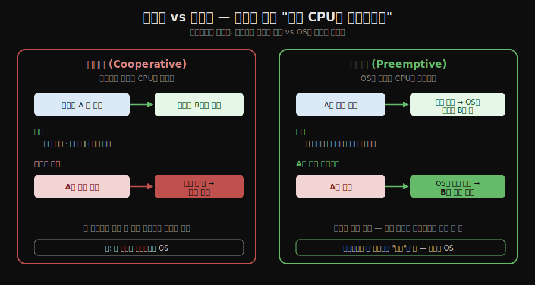
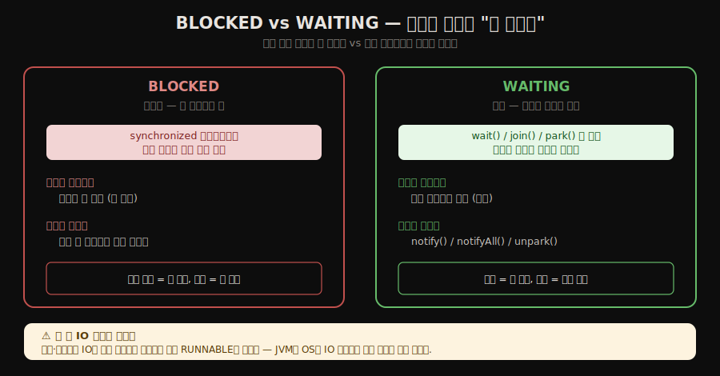
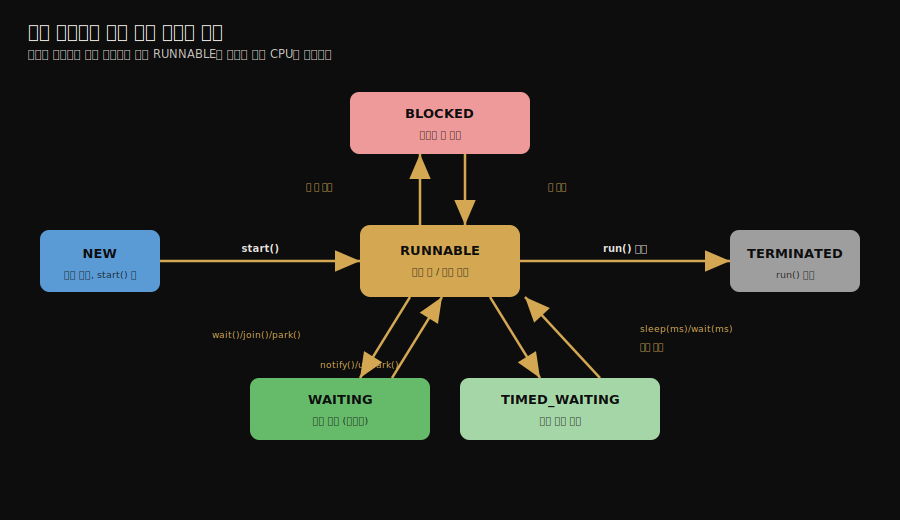

# 자바와 스레드 — 구현·스케줄링·상태
---
> **자바 스레드는 대개 운영체제의 커널 스레드와 1:1로 매핑되며, 스케줄링은 OS가 강제로 빼앗는 선점 방식을 쓰고, 자바 코드에서 본 스레드는 NEW·RUNNABLE·BLOCKED·WAITING·TIMED_WAITING·TERMINATED 여섯 상태를 오갑니다.** 
>
> 핵심은 "스레드를 어떻게 구현하느냐(커널/사용자/혼합)가 비용과 동시성 한계를 정한다"는 점과, "자바의 여섯 상태는 OS 상태가 아니라 JVM이 본 추상"이라는 구분입니다.

이 글을 읽고 나면 스레드 구현 세 방식의 차이와 트레이드오프를 말하고, 협력적·선점적 스케줄링이 어떻게 다른지 설명하며, 자바 스레드의 여섯 상태와 전이를 그릴 수 있습니다.

## 진입 — 스레드는 누가 만드는가

> 앞 두 편이 "공유 변수를 어떻게 안전하게 보느냐"를 다뤘다면, 이 편은 그 **동시성의 실행 단위인 스레드 자체가 어떻게 구현되고 스케줄링되는지를 봅니다.**

동시성을 짜는 우리는 `new Thread(...)` 한 줄로 스레드를 만들지만, 그 스레드가 실제로 무엇 위에서 도는지는 한 겹 아래의 이야기입니다. 자바 스레드는 운영체제가 제공하는 스레드와 어떻게 연결되느냐에 따라 비용과 동시성의 한계가 달라집니다. 그 연결 방식을 먼저 봅니다.

## 1. 스레드 구현 세 가지 방식

> 스레드는 커널 스레드에 1:1로 묶거나, 사용자 공간에서 1:N으로 직접 굴리거나, 둘을 섞어 M:N으로 묶을 수 있습니다. 세 방식은 구현 난이도와 동시성 규모를 맞바꿉니다.

### 커널 스레드 사용(1:1)

운영체제 커널이 직접 지원하는 스레드 위에, 프로그램이 쓰는 스레드(경량 프로세스, LWP)를 하나씩 1:1로 얹는 방식입니다. 

- 스케줄링을 커널이 맡아 구현이 간단하고 한 스레드가 블로킹돼도 다른 스레드가 영향을 받지 않습니다. 
- 대신 스레드를 만들고 전환할 때마다 사용자 모드와 커널 모드를 오가는 **시스템 콜**이 필요해 비용이 큽니다. 커널 자원에도 한계가 있어 만들 수 있는 스레드 수가 제한됩니다.

### 사용자 스레드 사용(1:N)

커널이 모르는 채로, 프로그램이 사용자 공간에서 스레드를 직접 만들고 스케줄링하는 방식입니다. 

- 커널을 거치지 않아 만들기와 전환이 빠르고 가벼우며 아주 많이 만들 수 있습니다. 
- 대신 스레드 생성·스위칭·스케줄링을 전부 프로그램이 구현해야 해서 어렵고, 한 사용자 스레드가 블로킹 시스템 콜을 부르면 그 위의 모든 스레드가 함께 멈추는 문제가 있습니다.

### 혼합 구현(M:N)

사용자 스레드 M개를 커널 스레드 N개에 묶는 방식입니다. 사용자 스레드의 가벼움과 커널 스레드의 안전함을 함께 노립니다. 사용자 스레드를 커널 스레드에 어떻게 분배하느냐가 구현의 핵심입니다.

- 자바의 **플랫폼 스레드**는 대부분의 상용 JVM에서 커널 스레드와 1:1로 매핑됩니다. 그래서 `Thread`를 많이 만들면 그만큼 커널 자원을 쓰고, 수만 개 규모에서는 한계에 부딪힙니다. 
- 이 한계를 우회하려는 것이 [다음 편의 가상 스레드](./01-04.자바와%20가상%20스레드%20—%20Virtual%20Threads.md)이며, 그것은 사용자 스레드의 가벼움을 되살린 시도입니다.

## 2. 스레드 스케줄링 — 협력적과 선점적

> 스케줄링은 어느 스레드에 CPU를 줄지 정하는 일입니다. 스레드가 자발적으로 양보하면 협력적, OS가 강제로 빼앗으면 선점적입니다. 자바는 선점 방식을 씁니다.

여러 스레드가 한정된 CPU를 나눠 쓰려면 누구에게 언제 CPU를 줄지 정해야 합니다. 방식은 둘인데, **가르는 축은 "누가 CPU를 내려놓느냐"** 입니다 — 우선순위가 아닙니다. 스레드가 *스스로* 양보하면 협력적, OS가 *강제로* 빼앗으면 선점적입니다.

### 협력적 스케줄링

협력적 스케줄링에서는 스레드가 자기 일을 마치면 *스스로* 다음 스레드에 CPU를 넘깁니다. 구현이 간단하고 전환 시점이 예측 가능하지만, 한 스레드가 양보하지 않으면(무한 루프 등) 시스템 전체가 멈추는 치명적 약점이 있습니다.

### 선점적 스케줄링

선점적 스케줄링에서는 운영체제가 각 스레드에 실행 시간을 배정하고, 시간이 다 되면 *강제로* CPU를 빼앗아 다른 스레드에 줍니다. 한 스레드가 폭주해도 시스템 전체가 멈추지 않습니다. 자바는 이 선점 방식을 씁니다. 그래서 스레드가 언제 전환될지는 프로그램이 정확히 통제할 수 없습니다.

자바는 스레드에 **우선순위**를 줄 수 있습니다. 

- `Thread.MIN_PRIORITY`(1)부터 `Thread.NORM_PRIORITY`(5)를 거쳐 `Thread.MAX_PRIORITY`(10)까지입니다. 우선순위가 높은 스레드를 더 자주 실행하도록 *권고*할 수 있지만, 실제 스케줄링은 운영체제가 맡습니다. 
- OS마다 우선순위 단계 수가 달라 자바의 1~10이 그대로 매핑되지 않고, OS가 우선순위를 무시하거나 스스로 조정하기도 합니다. 그래서 우선순위는 보장이 아니라 힌트로만 다뤄야 합니다.

## 3. 자바 스레드의 여섯 가지 상태

> 자바는 스레드를 NEW·RUNNABLE·BLOCKED·WAITING·TIMED_WAITING·TERMINATED 여섯 상태로 봅니다. 이것은 OS의 스레드 상태가 아니라 JVM이 자바 코드 관점에서 정의한 추상입니다.

자바 언어가 정의한 스레드 상태는 여섯입니다. 한 시점에 스레드는 정확히 하나의 상태에 있습니다.

- **NEW(새로 만듦)**: `Thread` 객체를 만들었지만 아직 `start()`를 부르지 않은 상태입니다.
- **RUNNABLE(실행 가능)**: 실행 중이거나 CPU를 기다리는 상태입니다. 자바는 OS의 "실행 중"과 "실행 대기"를 하나로 묶어 RUNNABLE로 봅니다.
- **BLOCKED(블로킹)**: `synchronized`에 진입하려고 모니터 락을 기다리는 상태입니다.
- **WAITING(대기)**: 다른 스레드의 명시적 깨움을 기다리는 상태입니다. `Object.wait()`(시간 없이), `Thread.join()`(시간 없이), `LockSupport.park()`로 들어갑니다.
- **TIMED_WAITING(시간 제한 대기)**: 정해진 시간이 지나면 스스로 깨어나는 대기입니다. `Thread.sleep(ms)`, `Object.wait(ms)`, `Thread.join(ms)` 등으로 들어갑니다.
- **TERMINATED(종료)**: `run()`이 끝나 스레드 실행이 완료된 상태입니다.

여기서 BLOCKED와 WAITING의 차이가 자주 헷갈립니다. 

- BLOCKED는 *모니터 락 하나*를 기다리는 좁은 상태이고, WAITING은 *다른 스레드의 깨움*을 기다리는 상태입니다. 
- `synchronized` 진입 대기는 BLOCKED, `wait()` 호출은 WAITING입니다.

흔한 오해 하나를 못 박아 둡니다 — **둘 다 IO 대기와는 무관합니다.** 파일·네트워크 IO로 막힌 스레드는 자바 상태 모델에서 보통 RUNNABLE로 보입니다. BLOCKED/WAITING은 *자바 동기화 장치*(락·깨움) 때문에 멈춘 상태만 가리킵니다.

### IO 대기가 왜 RUNNABLE인가 — JVM이 보는 상태 ≠ OS가 보는 상태

`Thread.State`는 **JVM이 보는 상태**이지 OS가 보는 상태가 아닙니다. 여기서 갈립니다.

- **OS 관점**: 디스크·소켓 IO를 기다리는 스레드는 커널에서 실제로 블로킹돼 CPU를 안 쓰고 잠들어 있습니다.
- **JVM 관점**: JVM의 여섯 상태에는 *IO 블로킹에 해당하는 항목이 아예 없습니다.* 그래서 `read()`/`accept()` 같은 블로킹 네이티브 호출에서 멈춰도 JVM 눈에는 "네이티브 메서드 안에서 실행 중"으로 보여 RUNNABLE로 분류됩니다.

| 멈춘 원인 | 자바 상태 |
|-----------|----------|
| `synchronized` 락 대기 (JVM이 관여) | BLOCKED |
| `wait()`·`join()`·`park()` (JVM 동기화) | WAITING |
| **파일·소켓 IO 대기 (OS 블로킹, JVM 바깥)** | **RUNNABLE** |

한 줄로: **JVM이 직접 관여하는 멈춤(락·깨움)만 BLOCKED/WAITING이고, JVM 바깥(OS IO)의 멈춤은 JVM 눈에 안 보여 RUNNABLE입니다.**

> 실무 함정: `jstack` 스레드 덤프에서 **IO 대기 스레드가 RUNNABLE로 찍힙니다.** "CPU를 안 쓰는데 RUNNABLE이 잔뜩"인 상황을 "CPU 바쁨"으로 오판하기 쉽습니다 — 실제론 소켓 `read()`에서 멈춰 있는 것입니다. 이 묶임(플랫폼 스레드가 IO에서 커널 스레드를 통째로 점유)을 푸는 것이 [가상 스레드](./01-04.자바와%20가상%20스레드%20—%20Virtual%20Threads.md)입니다.

가르는 질문은 **"왜 멈췄나"** 입니다. **남이 락을 쥐고 있어서** 못 들어가면 BLOCKED(내 의지와 무관, 락 경쟁에서 짐), **내가 자발적으로 "누가 깨워줄 때까지" 잠들면** WAITING입니다. 실무에서 WAITING은 추상적으로 보이지만, 사실 흔히 쓰는 도구 밑에 깔려 있습니다.

| WAITING에 들어가는 실무 장치 | 어떻게 | 깨어남 |
|------------------------------|--------|--------|
| `BlockingQueue.take()` | 큐가 비면 소비자 스레드가 `park()`로 잠듦 (생산자-소비자) | 생산자가 항목을 넣으면 `unpark()` |
| `ExecutorService` 워커 | 스레드풀 워커가 처리할 작업이 없으면 내부 큐에서 대기 | 작업이 제출되면 깨어남 |
| `Thread.join()` | 한 스레드가 다른 스레드의 종료를 기다림 | 대상 스레드가 끝나면 깨어남 |
| `CountDownLatch.await()` | 여러 작업이 끝나길 기다리는 조율 | 카운트가 0이 되면 깨어남 |

> `BlockingQueue`·`ExecutorService`·`@Async`를 쓴 거의 모든 곳에서 스레드는 일감을 기다리며 WAITING에 들어갑니다. "큐가 비면 소비자가 잠들고 생산자가 넣으면 깨운다"가 가장 실무적인 그림이며, 이것이 [생산자-소비자 패턴 노트](./03-02.생산자-소비자%20패턴.md)의 핵심입니다.

## 4. 상태 전이 — 어떤 호출이 상태를 바꾸는가

> 상태는 특정 메서드 호출과 이벤트로 전이합니다. `start()`로 시작하고, 락·대기로 떨어졌다가 다시 RUNNABLE로 올라오며, `run()` 종료로 TERMINATED에 이릅니다.

여섯 상태는 정해진 길로만 오갑니다.

- NEW → RUNNABLE: `start()` 호출.
- RUNNABLE → BLOCKED: `synchronized` 블록 진입에서 락을 못 얻음. 락을 얻으면 다시 RUNNABLE.
- RUNNABLE → WAITING: `wait()`·`join()`(시간 없이)·`park()`. 다른 스레드의 `notify()`·`notifyAll()`·`unpark()` 또는 대상 스레드 종료로 RUNNABLE 복귀.
- RUNNABLE → TIMED_WAITING: `sleep(ms)`·`wait(ms)`·`join(ms)`. 시간이 차거나 깨워지면 RUNNABLE 복귀.
- RUNNABLE → TERMINATED: `run()`이 정상 종료하거나 예외로 끝남.

WAITING·TIMED_WAITING에서 깨어난 스레드가 곧장 실행되는 것이 아니라 RUNNABLE로 돌아가 다시 CPU를 기다린다는 점이 중요합니다. 

- 깨어남은 "실행 자격을 되찾음"이지 "즉시 실행"이 아닙니다. 생성과 생명주기를 코드 예제로 더 보려면 [스레드 생성과 생명주기 노트](./03-01.스레드%20생성과%20생명주기.md)를 참고합니다.

## 5. 면접 대비 요약

> 세 질문에 *먼저 스스로 답해 본 뒤* 아래 정답으로 내려갑니다. 자답 없이 읽으면 학습 효과가 줄어듭니다.

1. 스레드 구현 세 방식(커널·사용자·혼합)은 무엇을 맞바꿉니까? 자바 플랫폼 스레드는 어디에 해당하나요?
2. 자바의 스레드 우선순위를 "보장이 아니라 힌트"라고 하는 까닭은 무엇인가요?
3. BLOCKED와 WAITING은 무엇을 기다리는 상태이며, 어떻게 다릅니까?

### 정답

1. 세 방식은 구현 난이도와 동시성 규모를 맞바꿉니다. 커널 스레드(1:1)는 구현이 간단하고 안전하지만 시스템 콜 비용이 크고 수가 제한됩니다. 사용자 스레드(1:N)는 가볍고 많이 만들 수 있지만 구현이 어렵고 한 스레드의 블로킹이 전체를 멈춥니다. 혼합(M:N)은 둘의 장점을 노립니다. 자바 플랫폼 스레드는 대부분의 상용 JVM에서 커널 스레드와 1:1로 매핑되며, 그래서 대량 생성에 한계가 있습니다.

2. 자바는 우선순위 1~10을 줄 수 있지만 실제 스케줄링은 운영체제가 맡기 때문입니다. OS마다 우선순위 단계 수가 달라 1~10이 그대로 매핑되지 않고, OS가 우선순위를 무시하거나 스스로 조정할 수 있습니다. 따라서 우선순위는 "더 자주 실행해 달라"는 권고일 뿐 실행 순서를 보장하지 않습니다.

3. BLOCKED는 `synchronized` 진입에서 *모니터 락 하나*를 기다리는 상태이고, WAITING은 `wait()`·`join()`·`park()`로 *다른 스레드의 깨움*을 기다리는 상태입니다. 락을 얻으면 BLOCKED가 풀리고, 깨움(`notify`·`unpark` 등)을 받으면 WAITING이 풀립니다. 둘 다 풀리면 곧장 실행되는 것이 아니라 RUNNABLE로 돌아가 다시 CPU를 기다립니다.

## 관련 문서

- [01-02.volatile·happens-before·원자성](./01-02.volatile·happens-before·원자성.md) — 이 편의 스레드가 공유 변수를 다룰 때 지키는 가시성·순서 규칙입니다.
- [01-04.자바와 가상 스레드 — Virtual Threads](./01-04.자바와%20가상%20스레드%20—%20Virtual%20Threads.md) — 1:1 커널 스레드의 한계를 사용자 스레드로 우회하는 다음 단계입니다.
- [03-01.스레드 생성과 생명주기](./03-01.스레드%20생성과%20생명주기.md) — 스레드 생성 방법과 제어 메서드를 코드 예제로 다룹니다.
