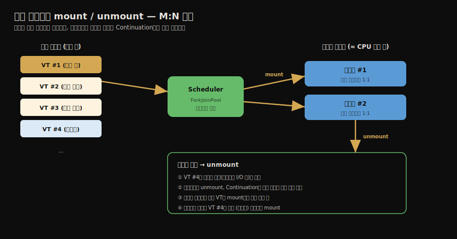
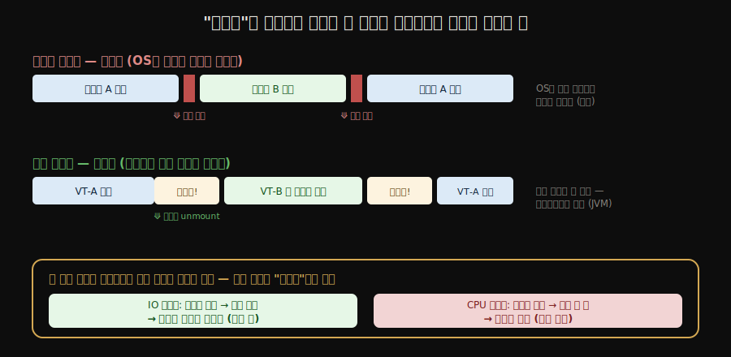
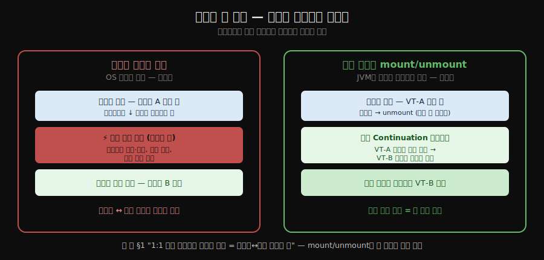

# 자바와 가상 스레드 — Virtual Threads
---
> **가상 스레드는 1:1 커널 스레드의 비용 한계를 우회하려고 사용자 스레드 모델을 되살린 것이며, 실행 상태를 저장·복원하는 Continuation과 그것을 소수의 캐리어 스레드에 분배하는 Scheduler로 구현해, 블로킹 때 캐리어에서 떨어져 나와(unmount) 다른 가상 스레드에 자리를 내줍니다.** 
>
> 핵심은 "왜 1:1 모델로는 수만 동시 연결을 감당 못 하는가"와 "가상 스레드가 어떻게 적은 커널 스레드로 많은 작업을 굴리는가"입니다.

이 글을 읽고 나면 가상 스레드가 등장한 까닭을 1:1 커널 스레드의 한계로 설명하고, Continuation과 Scheduler가 각각 무엇을 맡는지 말하며, mount/unmount가 블로킹을 어떻게 처리하는지 짚을 수 있습니다.

## 진입 — 왜 가상 스레드인가

> [앞 편](./01-03.자바와%20스레드%20—%20구현·스케줄링·상태.md)에서 본 1:1 커널 스레드는 안전하지만 비쌉니다. 동시 연결이 수만에 이르는 서버에서는 그 비용이 곧 한계가 됩니다. 가상 스레드는 사용자 스레드의 가벼움을 되살려 그 한계를 넘으려는 시도입니다.

앞 편에서 자바 플랫폼 스레드가 커널 스레드와 1:1로 매핑된다고 했습니다. 이 구조는 한 스레드가 블로킹돼도 다른 스레드가 멀쩡한 안전함을 주지만, 스레드 하나마다 커널 자원과 큰 스택을 차지합니다. 그래서 수만 개를 동시에 띄우기 어렵습니다.

문제는 서버 코드의 흔한 모양과 충돌합니다. 요청 하나에 스레드 하나를 붙이는 방식(thread-per-request)은 코드가 단순하고 디버깅이 쉽지만, 동시 연결이 수만에 이르면 그만큼 스레드가 필요해 1:1 모델로는 감당이 안 됩니다. 

- 이 한계를 흔히 **C10K 문제**(동시 1만 연결)라 부릅니다. 그동안은 비동기·논블로킹 코드로 우회했지만, 그 방식은 코드를 콜백과 리액티브 연산으로 흩어 놓아 읽고 디버깅하기 어렵게 만듭니다.

가상 스레드는 다른 길을 택합니다. 

- thread-per-request의 단순한 코드 모양은 그대로 두되, 그 아래 구현을 사용자 스레드처럼 가볍게 바꿔 수만 개를 띄울 수 있게 한 것입니다.

## 1. 사용자 스레드의 부활 — Project Loom

> 가상 스레드는 새로운 발명이 아니라, 앞 편에서 본 사용자 스레드(1:N) 모델을 자바 런타임 차원에서 되살린 것입니다. 이 작업이 Project Loom입니다.

앞 편의 스레드 구현 세 방식을 떠올리면, 가상 스레드의 정체가 분명해집니다. 가상 스레드는 **사용자 스레드** 갈래입니다. 커널이 모르는 채로 자바 런타임이 직접 만들고 스케줄링하는 스레드입니다.

- 자바가 한때 사용자 스레드(그린 스레드)를 썼다가 1:1 커널 스레드로 옮겨 간 역사가 있는데, 가상 스레드는 그 사용자 스레드 모델을 현대적으로 되살린 것입니다. 이 작업은 2017년 시작된 **Project Loom**에서 출발했고, JDK 21에서 정식 기능(JEP 444)으로 들어왔습니다.
- 핵심 차이는 매핑 비율입니다. 플랫폼 스레드가 커널 스레드와 1:1이라면, 가상 스레드는 많은 가상 스레드를 소수의 플랫폼 스레드에 **M:N**으로 묶습니다. 이 소수의 플랫폼 스레드를 **캐리어 스레드(carrier thread)** 라 부릅니다.

## 2. 구현 — Continuation과 Scheduler

> 가상 스레드는 두 부품으로 굴러갑니다. **Continuation은 실행을 멈춘 지점의 상태를 통째로 저장·복원**하고, **Scheduler는 실행 준비된 가상 스레드를 캐리어 스레드에 분배**합니다.

가상 스레드를 떠받치는 부품은 둘입니다.

**Continuation(컨티뉴에이션)** 은 실행 흐름을 어느 지점에서 멈췄다가 나중에 그 지점부터 다시 잇는 장치입니다. 

- 가상 스레드가 블로킹 지점에 닿으면, Continuation이 그 시점의 스택과 실행 위치를 통째로 **자바 힙에 저장**합니다. 
- 나중에 다시 깨어날 때 그 상태를 복원해 멈춘 자리부터 이어 갑니다. 플랫폼 스레드의 큰 스택을 통째로 점유하는 대신, 필요한 상태만 힙에 보관하므로 훨씬 가볍습니다.

**Scheduler(스케줄러)** 는 실행 준비가 된 가상 스레드를 캐리어 스레드에 올려 실제로 돌리는 역할입니다. 

- 기본 스케줄러는 `ForkJoinPool`을 씁니다. 캐리어 스레드 수는 보통 CPU 코어 수에 맞춰지고, Scheduler가 가상 스레드들을 이 적은 캐리어에 번갈아 분배합니다.

두 부품이 맞물려, 적은 수의 캐리어 스레드 위에서 수만 개의 가상 스레드가 번갈아 도는 그림이 완성됩니다.

이 "적은 일꾼이 많은 작업을 빠르게 번갈아 처리해 동시에 도는 것처럼 보이는" 모습은 운영체제의 **시분할(time-sharing)** 과 같은 발상입니다. 한 CPU가 여러 프로세스를 잘게 번갈아 실행해 동시 실행처럼 보이게 하듯, 소수의 캐리어가 수만 가상 스레드를 번갈아 태웁니다. 다만 *번갈아 타는 기준*이 결정적으로 다릅니다 — 일반 시분할은 **시간을 잘라**(타임 슬라이스) 번갈지만, 가상 스레드는 **블로킹할 때만** 번갈읍니다. 그래서 "시간 분할"이 아니라 "블로킹 분할"인 셈이며, 이 차이가 다음 절의 mount/unmount 동작을 가릅니다.

## 3. mount와 unmount — 블로킹을 다루는 법

> 가상 스레드는 **실행할 때만 캐리어에 올라타고(mount)**, **블로킹하면 내려옵니다(unmount)**. 내려온 자리에는 다른 가상 스레드가 올라타, 캐리어가 노는 시간을 없앱니다.

가상 스레드가 실제로 코드를 실행하려면 캐리어 스레드에 올라타야 합니다. 이 올라탐을 **mount**, 내려옴을 **unmount**라 합니다.

- 가상 스레드가 캐리어에 mount돼 실행되다가, 블로킹 연산(예: 네트워크 입출력 대기)을 만나면 그 즉시 캐리어에서 **unmount**됩니다. 이때 Continuation이 실행 상태를 힙에 저장합니다. 
- 비워진 캐리어에는 실행 준비된 다른 가상 스레드가 mount돼 일을 이어 갑니다. 블로킹이 끝나면 원래 가상 스레드는 다시 (같은 캐리어가 아니어도 되는) 캐리어에 mount돼 멈췄던 자리부터 이어집니다.

### unmount는 "블로킹할 때만" — 계산 도중엔 안 뺏는다

여기서 결정적인 오해 하나를 못 박아 둡니다. 스케줄러는 가상 스레드가 **계산하는 도중에 강제로 빼앗지 않습니다.** unmount는 오직 가상 스레드가 *스스로 블로킹 지점에 닿았을 때만* 일어납니다. 시간이 다 되면 OS가 도중에도 빼앗는 플랫폼 스레드와 정반대입니다.

| | 플랫폼 스레드 (OS) | 가상 스레드 (JVM 스케줄러) |
|---|---|---|
| 전환 방식 | **선점적** — 시간 다 되면 도중에도 강제로 빼앗음 | **협력적** — *블로킹할 때만* 스스로 내려옴 |
| 전환 시점 결정 | OS (타임 슬라이스) | 가상 스레드 자신 (블로킹 도달) |

"번갈아 올린다"는 *시간으로 쪼개는* 것이 아니라 **블로킹마다 자리를 내주는** 것입니다. [앞 편 §2](./01-03.자바와%20스레드%20—%20구현·스케줄링·상태.md)의 협력적 스케줄링이 가상 스레드 층에서 재현된 셈인데, "양보 시점"이 *블로킹*으로 고정돼 있습니다. 그래서 협력적 스케줄링의 약점 — 양보하지 않는 작업이 자리를 독점하는 것 — 이 **CPU 바운드 작업에서 그대로 드러납니다**(§4).

이것이 1:N 사용자 스레드 모델의 고질병을 푸는 방식입니다. 

- 앞 편에서 **사용자 스레드는 한 스레드의 블로킹 시스템 콜이 전체를 멈춘다**고 했는데, **가상 스레드는 블로킹 지점에서 unmount해 캐리어를 비우므로 그 문제가 사라집니다.** 
- 자바 표준 라이브러리의 블로킹 입출력이 가상 스레드를 인식해 자동으로 unmount를 일으키도록 다시 쓰였기 때문입니다.

다만 모든 블로킹이 unmount되는 것은 아닙니다. `synchronized` 블록 안에서 블로킹하거나 네이티브 메서드를 호출하면 가상 스레드가 캐리어에 묶여 못 내려오는 **피닝(pinning)** 이 생깁니다. 피닝의 조건과 회피는 [Virtual Threads 기초 노트 §11 Pinning](./01-05.Virtual%20Threads%20기초.md)에서 다룹니다.

### mount/unmount가 왜 싼가 — 커널을 거치지 않는다

블로킹마다 mount/unmount가 자주 일어날 텐데, 그 비용이 부담되지 않을까요? 핵심은 **이 전환이 OS 커널을 거치지 않는다**는 데 있습니다. 그래서 플랫폼 스레드의 컨텍스트 스위치보다 훨씬 쌉니다.

| | 플랫폼 스레드 컨텍스트 스위치 | 가상 스레드 mount/unmount |
|---|---|---|
| 누가 수행 | **OS 커널** | **JVM (사용자 공간)** |
| 무슨 일이 | 사용자↔커널 모드 전환(시스템 콜) + 레지스터·캐시 처리 | 힙에 저장된 Continuation을 갈아끼움 |
| 비용 | 무거움 (커널 진입) | 가벼움 (힙 상태 복사 수준) |

[앞 편 §1](./01-03.자바와%20스레드%20—%20구현·스케줄링·상태.md)에서 "1:1 커널 스레드가 무거운 까닭 = 만들고 전환할 때마다 사용자↔커널 시스템 콜"이라고 했습니다. mount/unmount는 바로 **그 시스템 콜이 일어나지 않습니다.** JVM이 사용자 공간에서 Continuation(힙에 보관된 실행 상태)만 교체하기 때문입니다. 전환이 싸기 때문에 자주 일어나도 감당되고, 이것이 수만 개 가상 스레드를 굴릴 수 있는 비용적 근거입니다.

## 4. 적용과 한계 — 어디에 쓰는가

> 가상 스레드는 블로킹 입출력을 많이 기다리는 작업에서 처리량을 크게 끌어올립니다. 반대로 CPU를 쉬지 않고 쓰는 계산 작업에는 이득이 없습니다.

가상 스레드가 빛나는 자리는 **입출력 바운드** 작업입니다. 요청마다 데이터베이스나 외부 API 응답을 오래 기다리는 서버가 대표적입니다. 

- 기다리는 동안 가상 스레드가 unmount돼 캐리어를 비우므로, 적은 캐리어로도 수만 요청을 동시에 처리할 수 있습니다. 
- thread-per-request의 단순한 코드를 유지하면서 비동기 코드에 버금가는 처리량을 얻는 것이 가상 스레드의 핵심 이득입니다.

반대로 **CPU 바운드** 작업에는 이득이 거의 없습니다. 블로킹 없이 계속 계산만 하는 작업은 unmount할 일이 없어 캐리어를 놓아주지 않습니다. 이때는 가상 스레드를 써도 결국 캐리어(= CPU 코어 수)만큼만 병렬로 돌므로, 평범한 플랫폼 스레드 풀과 다를 바 없습니다.

생성 방법, 실행기 설정, 스프링 부트 적용 같은 실무 활용은 [Virtual Threads 기초 노트](./01-05.Virtual%20Threads%20기초.md)에서 코드와 함께 다룹니다.

## 5. 면접 대비 요약

> 세 질문에 *먼저 스스로 답해 본 뒤* 아래 정답으로 내려갑니다. 자답 없이 읽으면 학습 효과가 줄어듭니다.

1. 가상 스레드는 어떤 한계를 풀려고 등장했으며, 앞 편의 어떤 스레드 모델에 해당합니까?
2. Continuation과 Scheduler는 각각 무엇을 맡습니까?
3. 가상 스레드가 입출력 바운드에서는 이득이 크고 CPU 바운드에서는 이득이 없는 까닭은 무엇인가요?

### 정답

1. 가상 스레드는 1:1 커널 스레드의 비용 한계를 풀려고 등장했습니다. 플랫폼 스레드는 하나마다 커널 자원과 큰 스택을 써서 수만 개를 띄우기 어려운데(C10K 문제), thread-per-request의 단순한 코드를 유지하면서 그 한계를 넘기 위해 사용자 스레드(1:N) 모델을 되살린 것이 가상 스레드입니다. 앞 편의 분류로는 사용자 스레드 갈래이며, 많은 가상 스레드를 소수의 캐리어 스레드에 M:N으로 묶습니다.

2. Continuation은 가상 스레드가 멈춘 지점의 스택과 실행 위치를 자바 힙에 저장하고 나중에 복원해, 멈췄던 자리부터 실행을 잇는 역할입니다. Scheduler는 실행 준비된 가상 스레드를 캐리어 스레드에 올려 실제로 돌리는 역할이며 기본 구현은 `ForkJoinPool`을 씁니다.

3. 입출력 바운드 작업은 응답을 기다리는 동안 가상 스레드가 unmount돼 캐리어를 비우므로, 적은 캐리어로도 수만 작업을 번갈아 처리할 수 있습니다. 반면 CPU 바운드 작업은 블로킹 없이 계속 계산만 해서 unmount할 일이 없고, 결국 캐리어(CPU 코어) 수만큼만 병렬로 돌아 평범한 플랫폼 스레드 풀과 차이가 없습니다.

## 관련 문서

- [01-03.자바와 스레드 — 구현·스케줄링·상태](./01-03.자바와%20스레드%20—%20구현·스케줄링·상태.md) — 가상 스레드가 되살린 사용자 스레드(1:N) 모델과 1:1 커널 스레드의 한계를 다룹니다.
- [01-05.Virtual Threads 기초](./01-05.Virtual%20Threads%20기초.md) — 생성 방법, 실행기, 스프링 부트 적용 등 실무 활용을 코드와 함께 봅니다.
- [01-05.Virtual Threads 기초 §11](./01-05.Virtual%20Threads%20기초.md) — `synchronized`·네이티브 호출이 일으키는 피닝의 조건과 회피를 다룹니다.
