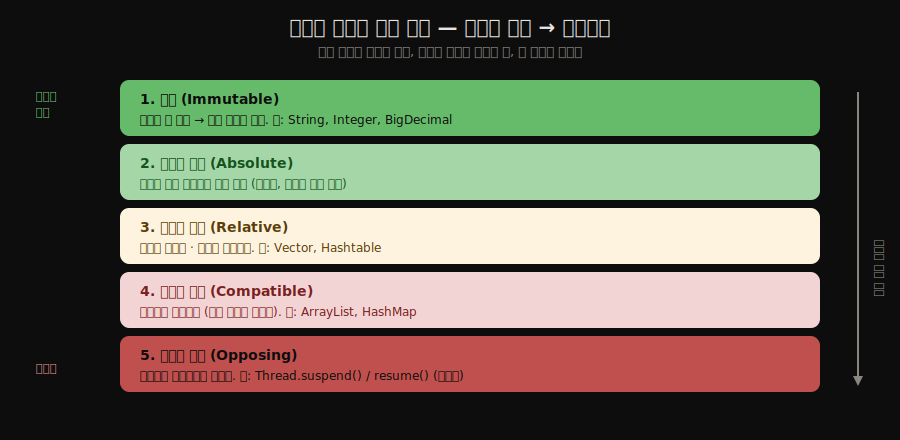
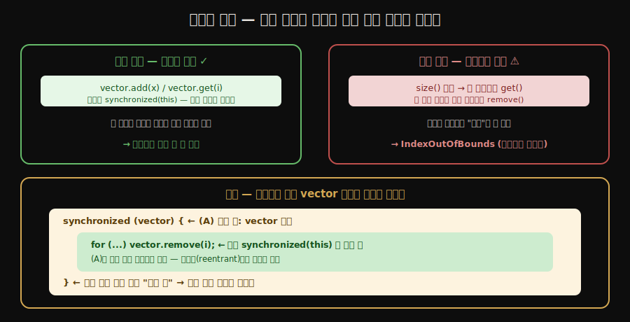

# 스레드 안전성 — 다섯 등급
---
> **스레드 안전성은 있고 없고의 이분법이 아니라 불변·절대적 안전·상대적 안전·스레드 호환·스레드 대립의 다섯 등급으로 나뉘며, 자바의 흔한 컬렉션 대부분은 "혼자 쓰면 멀쩡하지만 함께 쓰려면 호출자가 동기화해야 하는" 상대적 안전이나 스레드 호환에 속합니다.** 
>
> 핵심은 "`Vector`도 완전히 안전하지는 않다"는 점과, "안전성의 책임이 객체에 있는지 호출자에 있는지가 등급을 가른다"는 구분입니다.

이 글을 읽고 나면 스레드 안전성의 다섯 등급을 구분하고, 같은 컬렉션이라도 단건 연산과 복합 연산에서 안전성이 어떻게 갈리는지 설명하며, `Vector`의 안전성이 왜 절대적이지 않은지 코드로 짚을 수 있습니다.


## 진입 — 안전이냐 아니냐의 이분법을 넘어

> [앞 장](./01-04.자바와%20가상%20스레드%20—%20Virtual%20Threads.md)이 스레드를 어떻게 만들고 굴리는지를 다뤘다면, 이 장은 여러 스레드가 한 객체를 함께 쓸 때 그 객체가 얼마나 안전한지를 등급으로 나눠 봅니다.

"이 클래스는 스레드 안전한가?"라는 질문에는 예·아니오로 답하기 어렵습니다. 같은 `Vector`라도 한 메서드 호출은 안전하지만, 여러 호출을 묶으면 안전하지 않기 때문입니다. 

그래서 저우즈밍은 스레드 안전성을 **강한 순서대로 다섯 등급**으로 나눕니다. 불변, 절대적 스레드 안전, 상대적 스레드 안전, 스레드 호환, 스레드 대립입니다. 등급을 알면 "이 객체를 그냥 써도 되는지, 내가 동기화를 더 해야 하는지"를 판단할 수 있습니다.

다섯 등급을 가르는 축은 하나입니다 — **안전의 책임이 "객체"에서 "호출자"로 넘어가다, 끝내 "아무도 못 짊"에 이른다.** 위로 갈수록 객체가 알아서 안전하고, 아래로 갈수록 호출자가 짊어지며, 맨 아래는 누가 해도 안 됩니다.




## 1. 불변 — 가장 안전한 등급

> 불변 객체는 만들어진 뒤 상태가 바뀌지 않아, 동기화 없이도 언제나 안전합니다. `final`로 상태를 못 바꾸게 막는 것이 불변의 토대입니다.

**불변(Immutable)** 은 다섯 등급 중 가장 강하고 단순한 안전성입니다. 객체가 한 번 만들어지면 그 상태가 영영 바뀌지 않으므로, 여러 스레드가 동시에 읽어도 서로의 변경을 걱정할 일이 없습니다. 동기화가 아예 필요 없습니다.

불변을 보장하는 토대는 `final`입니다. 

- 객체의 상태를 담는 필드를 `final`로 선언해 생성 이후 바뀌지 못하게 막습니다. 
- 자바 표준 라이브러리의 `String`이 대표적입니다. `String`의 어떤 메서드도 자신을 바꾸지 않고, 바뀐 듯 보이는 연산(`substring`, `replace` 등)은 모두 새 `String`을 만들어 돌려줍니다.

기본 자료형의 박싱 클래스(`Integer`, `Long` 등)와 `BigInteger`, `BigDecimal`도 불변입니다. 

- 반면 같은 수치를 다루는 `AtomicInteger`는 내부 값을 바꿀 수 있으므로 불변이 아닙니다. 불변은 "값을 바꾸는 대신 새 객체를 만든다"는 설계와 한 몸입니다.

직접 불변 클래스를 만드는 패턴은 이렇습니다 — 모든 필드를 `final`로, "바꾸는" 연산은 새 객체를 돌려줍니다.

```java
public final class Money {                 // final 클래스 (상속으로 깨는 것 방지)
    private final long amount;             // 모든 필드 final → 생성 후 못 바꿈
    private final String currency;

    public Money(long amount, String currency) {
        this.amount = amount;
        this.currency = currency;
    }

    // 더하기는 자신을 바꾸지 않고 새 Money 를 만들어 돌려준다
    public Money plus(long extra) {
        return new Money(this.amount + extra, this.currency);
    }
}
// 여러 스레드가 같은 Money 를 동시에 써도 안전 — 바뀌는 게 없으니 동기화 불필요
```


## 2. 절대적 스레드 안전 — 이상에 가까운 등급

> **절대적 스레드 안전은 호출자가 어떤 추가 동기화도 하지 않아도 늘 안전한 등급**입니다. 자바에서 이 등급을 진짜로 만족하는 클래스는 드뭅니다.

**절대적 스레드 안전(Absolute thread-safe)** 은 호출하는 쪽이 *어떤 추가 조치도 없이* 그 객체를 안전하게 쓸 수 있는 등급입니다. 자바 API 문서가 "스레드 안전(thread-safe)"이라 적은 클래스라도, 이 절대적 의미를 만족하는 경우는 생각보다 드뭅니다.

`Vector`가 좋은 반례입니다. `Vector`의 `add`·`get`·`remove`는 모두 `synchronized`라 개별 호출은 안전합니다. 그런데도 여러 스레드가 함께 쓰면 깨집니다.

```java
private static Vector<Integer> vector = new Vector<>();

// 스레드 A: 모든 원소를 차례로 지운다
for (int i = 0; i < vector.size(); i++) {
    vector.remove(i);
}

// 스레드 B: 모든 원소를 차례로 읽는다
for (int i = 0; i < vector.size(); i++) {
    System.out.println(vector.get(i));
}
```

- `size()`·`get()`·`remove()` 각각은 `synchronized`로 안전하지만, "`size()`로 크기를 확인하고 그 인덱스로 `get()`한다"는 *두 호출 사이*에 다른 스레드가 원소를 지우면, `get()`이 `ArrayIndexOutOfBoundsException`을 던집니다. 개별 연산의 안전이 연속 연산의 안전을 보장하지 못하는 것입니다. 
- 그래서 `Vector`는 절대적 안전이 아닙니다. 진짜 절대적 안전을 주려면 객체가 이런 복합 사용까지 모두 감싸야 하는데, 그 비용이 너무 커서 현실적이지 않습니다.


## 3. 상대적 스레드 안전 — 보통의 "스레드 안전"

> **상대적 스레드 안전은 개별 연산은 안전하지만 연속 연산은 호출자가 동기화해야 하는 등급**입니다. 우리가 흔히 "스레드 안전하다"고 부르는 클래스 대부분이 여기에 속합니다.

**상대적 스레드 안전(Relative thread-safe)** 은 *개별 연산은* 객체가 알아서 안전하게 처리하지만, 연속된 여러 연산을 한 단위로 묶으려면 *호출자가 직접 동기화*해야 하는 등급입니다. 우리가 보통 "스레드 안전한 컬렉션"이라 부르는 것이 이 등급입니다.

`Vector`, `Hashtable`, 그리고 `Collections.synchronizedCollection()`으로 감싼 컬렉션이 여기에 속합니다. 

- 단건 `add`·`get`은 동기화 없이 호출해도 되지만, 앞 절의 "확인 후 사용" 같은 복합 연산은 호출하는 쪽이 `synchronized` 블록 등으로 묶어야 안전합니다. 
- 다시 말해, 안전의 책임이 단건은 객체에, 복합은 호출자에 나뉘어 있습니다.

### 복합 연산은 어떻게 묶나 — 같은 객체를 락으로

§2의 깨지던 `Vector` 코드를, 호출자가 **`Vector` 객체 자신을 락으로** 감싸면 안전해집니다.

```java
// 복합 연산(size 확인 → remove)을 한 덩어리로 직렬화
synchronized (vector) {                       // (A) Vector 자신을 락으로
    for (int i = 0; i < vector.size(); i++) {
        vector.remove(i);                     // size()~remove() 사이에 끼어듦 차단
    }
}
```

- *왜 하필 `vector` 자신*을 락으로 잡느냐가 핵심입니다. `Vector`의 내부 `synchronized` 메서드는 **`synchronized(this)`** — 곧 *자기 객체*를 락으로 씁니다. 
- 그래서 외부에서도 같은 `vector`를 락으로 잡으면 내부 메서드와 **같은 락**을 공유해, 복합 연산 전체가 한 스레드만 통과하도록 직렬화됩니다.

(A)의 외부 락과 `remove()` 내부의 `synchronized(this)`가 *같은 락을 중첩으로* 잡는데도 막히지 않는 이유는 자바 모니터 락이 **재진입(reentrant)** 이기 때문입니다. 같은 스레드는 이미 쥔 락을 다시 잡을 수 있어, 외부 락이 내부 락을 자연스럽게 품습니다.



### 감쌀 수 있는데 왜 Vector를 권장하지 않나

자기 락으로 감싸면 복합 연산도 안전해지는데, 그럼에도 새 코드에서 `Vector`는 권장되지 않습니다. 

- 먼저 사실을 정확히 — **`Vector`는 deprecated(폐기)된 것이 아닙니다.** 자바 21에도 멀쩡히 살아 있고 `@Deprecated`도 안 붙어 있습니다. 
- 다만 *사실상 쓰지 말라고 권장되는(discouraged)* 상태입니다. 이유는 넷입니다.
  1. **단건 락이 대부분 헛돈입니다.** `Vector`는 모든 단건 메서드에 `synchronized`가 박혀 있어, 단일 스레드에서만 써도 `add` 한 번마다 락을 잡았다 풉니다. 아무도 경쟁하지 않는데 매번 락 비용을 내는 셈입니다. `ArrayList`는 이 락이 없어 더 빠르고, 동기화는 *정말 필요할 때만* 호출자가 붙입니다.
  2. **단건 락이 있어도 복합 연산은 결국 또 감싸야 합니다.** §3 위에서 봤듯 `size()`~`get()` 사이는 호출자가 `synchronized(vector)`로 다시 감싸야 안전합니다. 그러면 *쓸모없는 내장 락 + 진짜 필요한 외부 락*을 **둘 다** 내게 됩니다. `ArrayList`를 외부 락 하나로 감싸면 단건·복합이 그 락 하나로 해결돼 더 깔끔합니다.
  3. **"안전하다는 착각"을 줍니다.** 이름과 단건 동기화 때문에 "스레드 안전하니 그냥 쓰면 돼"라는 잘못된 안심을 유발해, §2의 복합 연산 버그를 모르고 짜는 사고가 잦습니다. `ArrayList`는 "안전 안 함"이 명확해 호출자가 동기화를 의식적으로 설계합니다 — 숨은 위험보다 명시적 위험이 낫습니다.
  4. **진짜 대안이 더 빠릅니다.** 복합까지 진짜 동시성이 필요하면 "전체를 한 락으로 직렬화"하는 `Vector` 방식 자체가 병목입니다(한 번에 한 스레드). `ConcurrentHashMap`(버킷 단위 락)·`CopyOnWriteArrayList`(읽기 무락)가 부분 락·무락으로 훨씬 높은 동시성을 줍니다([04-01](./03-02.원자%20연산과%20동시성%20컬렉션.md)).

> 정리하면, **감쌀 수 있다 ≠ 좋은 선택**입니다. 단일 스레드면 `ArrayList`, 진짜 동시성이면 `ConcurrentHashMap` 계열 — `Vector`는 어느 쪽에서도 최적이 아니라 권장에서 밀려난 것이지, 폐기된 것은 아닙니다.


## 4. 스레드 호환 — 동기화는 호출자 몫

> **스레드 호환은 객체 자체는 안전하지 않지만, 호출자가 동기화를 제대로 하면 안전하게 쓸 수 있는 등급**입니다. 비동기 컬렉션 대부분이 여기에 속합니다.

**스레드 호환(Thread-compatible)** 은 객체 스스로는 스레드 안전을 보장하지 않지만, 호출하는 쪽이 동기화 수단(락 등)을 올바로 쓰면 멀티스레드에서 안전하게 쓸 수 있는 등급입니다. 안전의 책임이 전적으로 호출자에게 있습니다.

- `ArrayList`와 `HashMap`이 대표적입니다. 이들은 아무 동기화도 하지 않아 여러 스레드가 그냥 함께 쓰면 깨지지만, 호출 측이 모든 접근을 같은 락으로 감싸면 안전해집니다. 
- 자바에서 "스레드 안전하지 않다"고 말하는 보통의 클래스가 이 스레드 호환 등급입니다. 안전하지 않다는 말이 "절대 못 쓴다"가 아니라 "동기화를 네가 해야 한다"는 뜻입니다.

상대적 안전(`Vector`)과의 차이가 코드에서 드러납니다. `Vector`는 단건을 그냥 불러도 됐지만, `ArrayList`는 **단건 `add` 하나까지** 호출자가 락으로 감싸야 합니다.

```java
private final List<Integer> list = new ArrayList<>();
private final Object lock = new Object();   // 호출자가 마련한 락

// 단건조차 락이 필요 — ArrayList.add 에는 synchronized 가 없으니까
public void add(int x) {
    synchronized (lock) { list.add(x); }
}

// 복합 연산도 같은 lock 으로 — "모든 접근"을 한 락으로 직렬화
public Integer firstOrNull() {
    synchronized (lock) {
        return list.isEmpty() ? null : list.get(0);
    }
}
// 핵심: list 에 닿는 모든 경로가 같은 lock 을 거쳐야 안전. 하나라도 빠지면 깨진다.
```

> `Collections.synchronizedList(new ArrayList<>())`로 감싸면 단건은 자동 동기화돼 *상대적 안전*으로 올라갑니다. 
>
> 다만 복합 연산은 여전히 호출자가 묶어야 합니다 — 등급은 "어떻게 감싸느냐"로 바뀝니다.


## 5. 스레드 대립 — 동기화로도 안 되는 등급

> 스레드 대립은 호출자가 아무리 동기화해도 멀티스레드에서 안전하게 쓸 수 없는 등급입니다. 설계 자체가 동시 사용과 충돌해 자바에서 권장되지 않습니다.

**스레드 대립(Thread-opposing/-hostile)** 은 호출자가 어떤 동기화를 해도 멀티스레드에서 동시에 쓰는 것이 불가능한, 가장 낮은 등급입니다. 코드 자체가 동시 사용과 근본적으로 충돌합니다.

대표 예가 `Thread`의 `suspend()`와 `resume()`입니다. 한 스레드가 다른 스레드를 멈추려(`suspend`) 하고 동시에 그 스레드를 깨우려(`resume`) 하면, 멈춤과 깨움의 순서에 따라 영영 깨어나지 못하는 교착이 생길 수 있습니다.

```java
Thread worker = new Thread(() -> { /* ... */ });
worker.start();

worker.suspend();   // (1) worker 를 멈춤 — 멈추는 동안 락을 쥔 채로 멈출 수도
worker.resume();    // (2) 다시 깨움

// 위험: (2) resume 이 (1) suspend 보다 "먼저" 도착하면(스케줄링에 따라)
//       worker 는 깨움 신호를 놓치고 영영 suspend 된 채로 남는다.
//       게다가 suspend 는 쥔 락을 놓지 않아, 그 락을 기다리는 다른 스레드까지 묶인다.
```

- 락으로 감싸도 이 문제는 사라지지 않습니다. `suspend`가 락을 쥔 채 멈추므로, 그 락을 호출자가 다시 잡으려 하면 오히려 교착이 깊어집니다. 그래서 이 메서드들은 자바에서 폐기(deprecated)됐습니다. 
- 스레드 대립 등급의 코드는 멀티스레드 환경에서 쓰지 않는 것이 답이며, 멈춤·재개가 필요하면 `wait()`/`notify()`나 플래그 + `volatile`로 협력적으로 구현합니다.

### 정리 — "호출자가 동기화하면 되나"로 등급을 가른다

세 하위 등급(상대적·호환·대립)의 결정적 차이는 **"호출자가 외부에서 동기화하면 안전해지나"** 입니다. 상대적·호환은 *외부 동기화로 가능*하고(범위만 다름), 대립만 *외부 동기화로도 불가능*합니다.

| 등급 | 객체 내부 동기화 | 호출자가 동기화하면 | 호출자가 짊어질 범위 |
|------|----------------|--------------------|---------------------|
| 불변 | 불필요 (상태 불변) | — (애초에 필요 없음) | 없음 |
| 절대적 | 복합까지 전부 | — (필요 없음) | 없음 |
| 상대적 (`Vector`) | 단건만 (`synchronized(this)`) | **안전해짐** | 복합 연산만 |
| 스레드 호환 (`ArrayList`) | 없음 | **안전해짐** | 모든 접근 (단건까지) |
| 스레드 대립 (`suspend`/`resume`) | — | **여전히 불가능** | 어떻게 해도 안 됨 |

> 핵심은 두 가지. ① 상대적과 호환은 "외부 제어 가능 여부"가 아니라 **호출자가 *어디까지* 책임지나**로 갈립니다(상대적=복합만, 호환=전부). ② 스레드 대립만이 *외부 동기화로도 안전을 얻지 못하는* 진짜 막힌 등급입니다 — 이것이 대립을 다른 등급과 가르는 정의입니다.


## 6. 면접 대비 요약

> 세 질문에 *먼저 스스로 답해 본 뒤* 아래 정답으로 내려갑니다. 자답 없이 읽으면 학습 효과가 줄어듭니다.

1. 스레드 안전성의 다섯 등급을 강한 순서대로 말하고, 각각의 안전 책임이 객체에 있는지 호출자에 있는지 구분해 보세요.
2. `Vector`의 모든 메서드가 `synchronized`인데도 절대적 스레드 안전이 아닌 까닭은 무엇인가요?
3. 상대적 스레드 안전과 스레드 호환은 무엇이 다릅니까?

### 정답

1. 강한 순서로 불변, 절대적 스레드 안전, 상대적 스레드 안전, 스레드 호환, 스레드 대립입니다. 불변은 상태가 안 바뀌어 책임이 없고, 절대적·상대적 안전은 (적어도 단건은) 객체가 책임지며, 스레드 호환은 호출자가 동기화를 책임지고, 스레드 대립은 동기화로도 안전을 얻을 수 없습니다.

2. `add`·`get`·`remove` 같은 *개별 메서드*는 `synchronized`라 안전하지만, "`size()`로 크기를 확인한 뒤 그 인덱스로 `get()`한다"처럼 *여러 호출을 묶은 복합 연산*은 두 호출 사이에 다른 스레드가 끼어들 수 있어 `ArrayIndexOutOfBoundsException`이 날 수 있기 때문입니다. 절대적 안전은 이런 복합 사용까지 객체가 보장해야 하는데 `Vector`는 그렇지 못해, 호출자 동기화가 필요한 상대적 안전에 그칩니다.

3. 상대적 스레드 안전은 *개별 연산*을 객체가 안전하게 처리하고, 복합 연산만 호출자가 동기화하면 됩니다(`Vector`, `Hashtable`). 스레드 호환은 *개별 연산조차* 객체가 보장하지 않아, 모든 접근을 호출자가 동기화해야 안전합니다(`ArrayList`, `HashMap`).


## 관련 문서

- [02-02.스레드 안전성 구현 — 동기화와 락](./02-02.스레드%20안전성%20구현%20—%20동기화와%20락.md) — 이 등급들을 실제로 구현하는 상호 배제·논블로킹·무동기화 수단을 다룹니다.
- [01-02.volatile·happens-before·원자성](./01-02.volatile·happens-before·원자성.md) — 안전성의 바탕이 되는 가시성·원자성·순서 규칙입니다.
- [02-02.스레드 안전성 구현 — 동기화와 락](./02-02.스레드%20안전성%20구현%20—%20동기화와%20락.md) — `synchronized`·모니터 락·경합 조건·데드락을 코드 예제로 봅니다.
