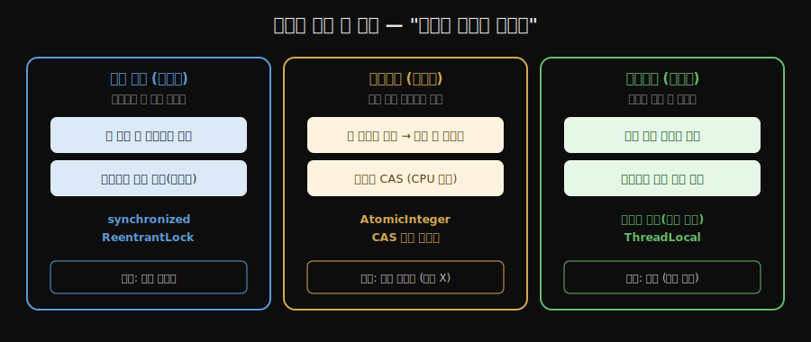
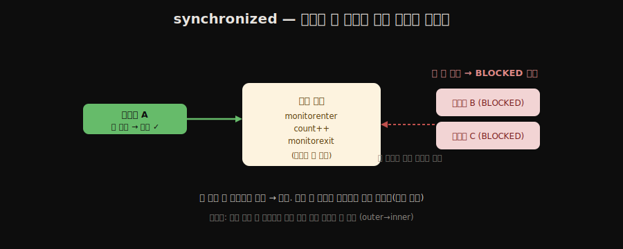
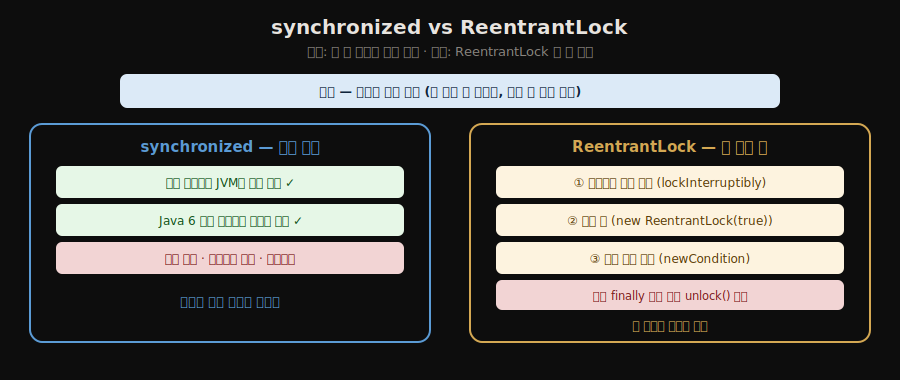
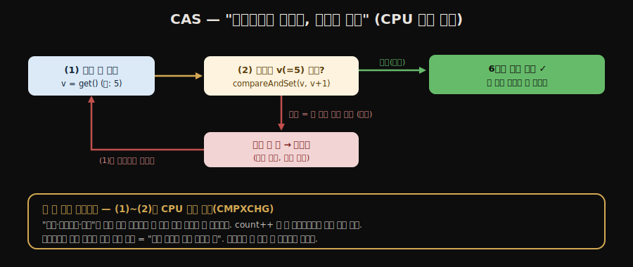
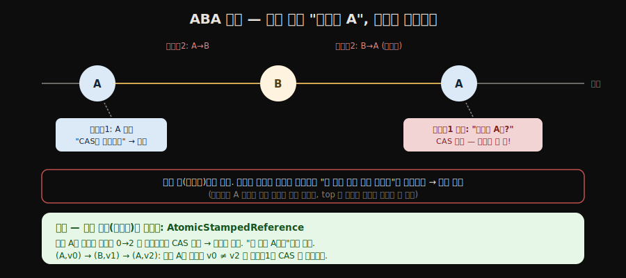
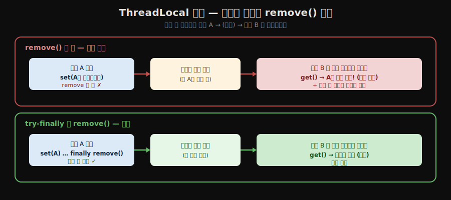

# 스레드 안전성 구현 — 동기화와 락
---
> **스레드 안전성을 구현하는 길은 락으로 막아 세우는 상호 배제 동기화, 충돌하면 재시도하는 논블로킹 동기화, 애초에 공유를 없애는 무동기화 방안 셋으로 나뉘며, `synchronized`와 `ReentrantLock`은 상호 배제를, CAS 기반 원자 클래스는 논블로킹을, 재진입 코드와 `ThreadLocal`은 무동기화를 대표합니다.** 
>
> 핵심은 "막을 것이냐, 부딪히면 다시 할 것이냐, 아예 공유를 없앨 것이냐"의 세 갈래와, CAS의 약점인 ABA 문제입니다.

이 글을 읽고 나면 상호 배제·논블로킹·무동기화 세 방식을 구분하고, `synchronized`와 `ReentrantLock`의 차이를 설명하며, CAS의 동작과 ABA 문제를 짚을 수 있습니다.


## 진입 — 안전성을 구현하는 세 갈래

> [앞 편](./02-01.스레드%20안전성%20—%20다섯%20등급.md)이 "이 객체가 얼마나 안전한가"를 등급으로 나눴다면, 이 편은 "그 안전성을 어떻게 만들 것인가"의 수단을 봅니다.

여러 스레드가 한 자원을 안전하게 쓰도록 만드는 길은 크게 셋입니다. 

1. 첫째는 한 번에 한 스레드만 들어가도록 **막아 세우는** 상호 배제 동기화입니다. 
2. 둘째는 일단 시도하고 충돌하면 **다시 하는** 논블로킹 동기화입니다. 
3. 셋째는 공유 자체를 없애 동기화가 **필요 없게** 만드는 방안입니다.

세 갈래는 "충돌을 어떻게 대하는가"로 갈립니다 — **미리 막거나(비관적), 부딪히면 다시 하거나(낙관적), 아예 부딪힐 일을 안 만들거나(무공유)**.




## 1. 상호 배제 동기화 — synchronized

> 상호 배제 동기화는 한 번에 한 스레드만 임계 영역에 들어가게 막는 방식입니다. 가장 기본은 `synchronized`이며, 모니터 락을 잡고 재진입을 허용하되 블로킹으로 동작합니다.

**상호 배제 동기화(Mutual exclusion)** 는 공유 데이터를 한 시점에 한 스레드만 쓰도록 보장하는 가장 흔한 방식입니다. 자바에서 가장 기본은 `synchronized` 키워드입니다.

- `synchronized`는 바이트코드에서 `monitorenter`와 `monitorexit` 두 명령으로 컴파일되고, 이 둘은 객체의 **모니터 락**을 잡고 푸는 일을 합니다. 
- 두 가지 성질을 기억할 만합니다. 
  1. 첫째, **재진입(reentrant)** 이 됩니다. 이미 락을 가진 스레드는 같은 락을 다시 잡을 수 있어, **락을 가진 메서드가 같은 락의 다른 메서드를 불러도 자기 자신을 막지 않습니다.** 
  2. 둘째, **블로킹**으로 동작합니다. 락을 얻지 못한 스레드는 락이 풀릴 때까지 멈춰 기다립니다. **이 멈춤은 운영체제 차원의 스레드 블로킹이라 커널 모드 전환 비용이 듭니다.**
-  그래서 경합이 잦으면 비싼 동기화가 됩니다. 이 비용을 JVM이 어떻게 깎는지는 [다음 편의 락 최적화](./02-03.락%20최적화%20—%20스핀·제거·굵게·경량·편향.md)에서 다룹니다.

코드로 보면, `synchronized`는 메서드 전체나 블록에 걸 수 있습니다. 블록 방식은 *임계 영역만* 좁게 잠가 더 낫습니다([02-01](./02-01.스레드%20안전성%20—%20다섯%20등급.md)에서 본 복합 연산 묶기와 같은 도구).

```java
public class Counter {
    private int count = 0;
    private final Object lock = new Object();

    // 메서드 단위 — 메서드 전체가 임계 영역 (this 를 락으로)
    public synchronized void incA() { count++; }

    // 블록 단위 — 임계 영역만 좁게 (전용 lock 객체를 락으로, 더 권장)
    public void incB() {
        synchronized (lock) { count++; }
    }
}
```

**재진입**은 이런 모습입니다 — 같은 락을 쥔 메서드가 같은 락의 다른 메서드를 불러도 자기 자신에 막히지 않습니다.

```java
public synchronized void outer() {
    inner();              // 이미 this 락을 쥔 채로
}
public synchronized void inner() {
    // 같은 this 락을 "다시" 잡음 — 재진입이라 통과 (안 막힘)
}
```




## 2. 상호 배제 동기화 — ReentrantLock

> `ReentrantLock`은 `synchronized`와 같은 상호 배제를 코드로 제어하는 락입니다. 인터럽트 가능 대기, 공정 락, 여러 조건 변수라는 세 가지를 더 줍니다.

`java.util.concurrent.locks.ReentrantLock`은 `synchronized`와 같은 재진입 상호 배제를 제공하되, 키워드가 아니라 객체 메서드(`lock()`/`unlock()`)로 락을 다룹니다. `synchronized`가 블록을 벗어나면 JVM이 락을 자동으로 풀어 주는 것과 달리, `ReentrantLock`은 `finally` 블록에서 직접 `unlock()`을 불러 줘야 합니다. 

대신 `synchronized`에 없는 세 기능을 줍니다.

1. **대기 가능 인터럽트**: 락을 기다리는 스레드를 다른 스레드가 인터럽트해 대기를 풀 수 있습니다(`lockInterruptibly()`). `synchronized`의 대기는 인터럽트할 수 없습니다.
2. **공정 락**: `new ReentrantLock(true)`로 만들면 기다린 순서대로 락을 줍니다. `synchronized`와 기본 `ReentrantLock`은 순서를 보장하지 않는 비공정 락입니다. 공정 락은 순서를 지키는 비용이 들어 처리량이 떨어집니다.
3. **여러 조건 변수**: `newCondition()`으로 한 락에 여러 개의 대기 조건(`Condition`)을 묶을 수 있습니다. `synchronized`는 객체 하나에 `wait`/`notify` 조건이 하나뿐입니다.

코드 모양도 다릅니다. `synchronized`는 블록을 벗어나면 자동 해제지만, `ReentrantLock`은 **반드시 `finally`에서 `unlock()`** 해야 합니다 — 안 그러면 예외가 나도 락이 안 풀려 영영 묶입니다.

```java
private final ReentrantLock lock = new ReentrantLock();   // 비공정
// private final ReentrantLock lock = new ReentrantLock(true);  // 공정 락

public void doWork() {
    lock.lock();
    try {
        // 임계 영역
    } finally {
        lock.unlock();   // 예외가 나도 반드시 풀리도록 finally 에서
    }
}
```



### 코드 예제

**① 대기 가능 인터럽트** — 락을 기다리다 다른 스레드가 깨우면 포기할 수 있습니다. `synchronized`로 막혀 있으면 영영 못 빠져나오지만, `lockInterruptibly()`는 인터럽트로 대기를 끊습니다.

```java
private final ReentrantLock lock = new ReentrantLock();

public void doWork() throws InterruptedException {
    lock.lockInterruptibly();      // 대기 중 interrupt() 받으면 InterruptedException 던지고 포기
    try {
        // 임계 영역
    } finally {
        lock.unlock();
    }
}
// 다른 스레드: worker.interrupt();  → 락을 기다리던 worker 가 대기를 풀고 빠져나옴
```

**② 공정 락** — 생성자 인자 하나로 "기다린 순서대로" 락을 줍니다. 기아(starvation)를 막지만 순서 유지 비용으로 처리량이 떨어집니다.

```java
ReentrantLock fair   = new ReentrantLock(true);   // 공정: FIFO 순서 보장
ReentrantLock unfair = new ReentrantLock();       // 기본: 비공정 (더 빠름)
// 비공정은 막 도착한 스레드가 대기열을 새치기할 수 있어 처리량이 높다.
// 공정은 오래 기다린 스레드가 굶지 않지만 컨텍스트 스위칭이 늘어 느리다.
```

**③ 여러 조건 변수(Condition)** — 한 락에 *서로 다른 대기 줄*을 여러 개 둘 수 있습니다. `synchronized`는 `wait`/`notify` 줄이 하나뿐이라 "비었을 때 기다리는 쪽"과 "꽉 찼을 때 기다리는 쪽"을 구별 못 하는데, `Condition`은 각각 따로 깨울 수 있습니다. 바운디드 버퍼(생산자-소비자)가 대표 예입니다.

```java
private final ReentrantLock lock = new ReentrantLock();
private final Condition notFull  = lock.newCondition();   // "가득 참" 대기 줄
private final Condition notEmpty = lock.newCondition();   // "비어 있음" 대기 줄
private final Object[] buf = new Object[10];
private int count = 0, putIdx = 0, takeIdx = 0;


public void put(Object x) throws InterruptedException {
    lock.lock();
    try {
        while (count == buf.length) notFull.await();   // 꽉 찼으면 생산자만 잠듦
        buf[putIdx] = x;
        putIdx = (putIdx + 1) % buf.length;
        count++;
        notEmpty.signal();                             // 비어있음 대기 줄(소비자)만 깨움
    } finally {
        lock.unlock();
    }
}


public Object take() throws InterruptedException {
    lock.lock();
    try {
        while (count == 0) notEmpty.await();           // 비었으면 소비자만 잠듦
        Object x = buf[takeIdx];
        takeIdx = (takeIdx + 1) % buf.length;
        count--;
        notFull.signal();                              // 가득참 대기 줄(생산자)만 깨움
        return x;                                      // unlock 은 finally 가 보장
    } finally {
        lock.unlock();
    }
}
```

- 이렇게 줄을 둘로 나누면 소비자가 소비자를 깨우는 헛깨움이 줄어, `synchronized` + `notifyAll`(모두 깨워 다시 경쟁)보다 효율적입니다. 생산자-소비자의 전체 그림은 [생산자-소비자 패턴 노트](./03-02.생산자-소비자%20패턴.md)에서 다룹니다.

성능 면에서는, Java 6 이후 `synchronized`에 여러 락 최적화가 들어가면서 단순한 상황에서는 둘의 차이가 거의 없습니다. 그래서 평범한 상호 배제에는 JVM이 알아서 관리·최적화해 주는 `synchronized`를 쓰고, 위 세 기능이 꼭 필요할 때만 `ReentrantLock`을 쓰는 것이 일반적인 지침입니다.


## 3. 논블로킹 동기화 — CAS

> 논블로킹 동기화는 일단 값을 바꿔 보고, 그 사이 남이 끼어들었으면 실패를 알고 다시 시도하는 방식입니다. 바탕은 하드웨어의 원자적 비교·교환 명령인 CAS입니다.

상호 배제는 "충돌이 날까 봐 미리 막는" 비관적 방식입니다. 반대로 **논블로킹 동기화(Non-blocking)** 는 "일단 해 보고 충돌하면 다시 한다"는 낙관적 방식입니다. 스레드를 멈춰 세우지 않으므로 블로킹의 커널 전환 비용이 없습니다.

바탕은 **CAS(Compare-And-Swap)** 입니다. CAS는 "메모리의 현재 값이 내가 예상한 값과 같으면 새 값으로 바꾼다"를 하드웨어 명령 하나로 원자적으로 수행합니다. 예상과 다르면(그 사이 누가 바꿨으면) 바꾸지 않고 실패를 알립니다. 실패하면 새 값을 다시 읽어 재시도합니다.

`java.util.concurrent.atomic`의 클래스들이 이 위에 세워집니다. 앞 편에서 `volatile`만으로는 깨졌던 카운터 증가가 `AtomicInteger`로는 안전해집니다.

```java
private final AtomicInteger count = new AtomicInteger(0);

public void increment() {
    count.incrementAndGet();   // 내부적으로 CAS로 재시도하며 1 증가
}
```

- `incrementAndGet()`은 내부적으로 현재 값을 읽고, 그 값에 1을 더한 결과를 CAS로 쓰려 시도하고, 그 사이 값이 바뀌어 실패하면 다시 읽어 재시도하는 루프를 돕니다. 락 없이도 한 번의 증가가 사라지지 않습니다. 
- CAS와 원자 클래스의 더 자세한 동작은 [원자 연산과 동시성 컬렉션 노트](./04-01.원자%20연산과%20동시성%20컬렉션.md)에서 다룹니다.

CAS는 "여러 연산을 묶는" 게 아니라 **"예상값과 같으면 바꾸고, 아니면 안 바꾸고 다시 시도"** 하는 조건부 교체입니다. `incrementAndGet()` 안을 펼치면 이런 재시도 루프입니다.

```java
// AtomicInteger.incrementAndGet() 의 본질 (의사 코드)
int v;
do {
    v = get();                       // (1) 현재 값 읽기
} while (!compareAndSet(v, v + 1));  // (2) "아직 v면 v+1로" — 실패하면 (1)로 되돌아가 재시도
// 성공할 때까지 돈다. 락을 쥐지 않고 "충돌하면 다시"
```

#### CAS는 왜 락 없이 안전한가 — 하드웨어가 한 명령으로 보장

"읽고 → 비교하고 → 쓰는" 세 단계인데 그 사이 남이 끼어들면 결국 `count++`(01-02)처럼 깨지지 않을까요? 답은 **CAS 전체가 CPU 명령어 하나**라는 데 있습니다.

- x86의 `CMPXCHG`, ARM의 `LDREX/STREX` 처럼, "비교 후 교체"를 **CPU가 단일 원자 명령**으로 제공합니다. 명령 중간에 다른 코어가 그 메모리를 건드릴 수 없습니다.
- 이를 보장하는 것이 **캐시 일관성 프로토콜 + 캐시 라인(버스) 락**입니다. CAS가 도는 그 짧은 순간, 해당 메모리 주소를 하드웨어가 잠가 다른 코어의 접근을 막습니다.

즉 `count++`가 깨졌던 건 그것이 *세 개의 분리된 바이트코드*였기 때문이고, CAS는 그 전체가 *하나의 CPU 명령*이라 쪼개지지 않습니다.

| | synchronized (락) | CAS |
|---|---|---|
| 충돌 시 | 스레드를 **멈춤**(블로킹) → 커널 개입 | 안 멈추고 **재시도**(스핀) |
| 비용 | 커널 모드 전환 (무거움) | CPU 명령 한 번 (가벼움) |
| 잠그는 범위 | 임의의 코드 블록 | **변수 하나**의 읽기-수정-쓰기 |

> 그래서 CAS는 "락을 안 쓰는" 게 아니라 **하드웨어가 변수 하나에 아주 짧게 거는 락**을 쓰는 셈입니다. 소프트웨어 락처럼 스레드를 재우지 않고 CPU 차원에서 순식간에 끝나, "락 없이"처럼 보입니다.




## 4. CAS의 약점 — ABA 문제

> CAS는 "값이 예상과 같은가"만 보므로, 값이 A에서 B로 갔다가 다시 A로 돌아온 변화를 놓칩니다. 이것이 ABA 문제이며, 버전 표시로 해결합니다.

CAS는 "현재 값이 예상 값과 같은가"만 확인합니다. 그래서 값이 A → B → A로 돌아왔을 때, CAS는 "여전히 A네"라고 보고 그 사이의 변화를 알아채지 못합니다. 이것이 **ABA 문제**입니다.



단순 카운터라면 대개 결과에 문제가 없습니다. 문제는 **변화 이력이 중요한 자료구조 — 락프리 스택** 같은 경우입니다. 왜 실제 버그가 되는지 봅시다.

```text
락프리 스택 top: A → X → Y  (A의 다음은 X)

스레드1: top이 A인 걸 읽고 "A를 빼고 top을 X로" CAS 하려는 찰나 멈춤(선점)
스레드2: A를 pop, X를 pop, 그리고 A를 재사용해 다시 push → top: A → Y
스레드1: 재개. "top이 여전히 A네?" → CAS 성공 → top을 X로 바꿈
         그런데 X는 이미 제거된 노드! → top이 사라진 X를 가리킴 (스택 깨짐)
```

값(`A`)만 보면 같지만 **그 사이 스택 내부 구조가 완전히 바뀌었습니다.** CAS는 그걸 못 봅니다. 단순 값 비교의 한계입니다.

해결은 값에 **버전(스탬프)** 을 붙이는 것입니다. 값이 A로 같아도 *버전이 다르면* 변화를 감지합니다 — "몇 번째 A인가"까지 보는 셈입니다.

```java
// 값 + 버전(스탬프)을 함께 CAS — 값이 같아도 버전이 다르면 실패
AtomicStampedReference<String> ref =
        new AtomicStampedReference<>("A", 0);     // 값 "A", 버전 0

int[] stampHolder = new int[1];
String cur = ref.get(stampHolder);                // 현재 값 + 버전 읽기
int stamp = stampHolder[0];

// "값이 A이고 버전이 stamp일 때만" 바꾼다. A→B→A 였으면 버전이 올라가 실패
ref.compareAndSet(cur, "C", stamp, stamp + 1);
```

> ABA가 늘 문제는 아닙니다 — 값 자체만 의미 있는 카운터·플래그엔 무해합니다. *노드·포인터처럼 "그 사이 무슨 일이 있었는지"가 중요할 때만* 버전이 필요합니다.


## 5. 동기화가 필요 없는 방안 — 재진입 코드와 ThreadLocal

> 가장 좋은 동기화는 동기화하지 않는 것입니다. 공유 상태가 없으면 안전성을 따질 일이 없습니다. 재진입 코드와 `ThreadLocal`이 그 두 길입니다.

스레드 안전성은 결국 공유 데이터를 둘러싼 문제이므로, 공유가 없으면 안전성을 걱정할 필요가 없습니다. 동기화 없이 안전한 두 방안입니다.

**재진입 코드(Reentrant code)** 는 여러 스레드가 동시에 들어와도 서로를 방해하지 않는 코드입니다. 

- 공유 상태(전역 변수, 공유 객체)를 건드리지 않고, 입력을 파라미터로만 받아 결과를 돌려주는 순수 함수 형태가 그 예입니다. 
- 같은 입력에 늘 같은 결과를 내고 외부 상태에 의존하지 않으면, 몇 개의 스레드가 동시에 호출해도 안전합니다.

```java
// 안전: 공유 상태 없음 — 입력만으로 결과를 냄 (재진입 코드)
int add(int a, int b) { return a + b; }


// 위험: 공유 필드를 건드림 — 여러 스레드가 total 을 동시에 망침
private int total = 0;
int accumulate(int x) { total += x; return total; }  // 동기화 필요
```

**ThreadLocal**은 변수를 스레드마다 따로 두어 공유 자체를 없애는 방식입니다. 

- 한 `ThreadLocal` 변수는 각 스레드가 자기만의 복사본을 가지므로, 스레드 사이에 값이 섞이지 않습니다. 
- 요청마다 다른 스레드가 처리하는 서버에서 요청 범위의 컨텍스트를 안전하게 들고 다닐 때 자주 쓰입니다.

```java
// 스레드마다 독립된 SimpleDateFormat (원래 SDF 는 스레드 안전하지 않음)
private static final ThreadLocal<SimpleDateFormat> FORMAT =
        ThreadLocal.withInitial(() -> new SimpleDateFormat("yyyy-MM-dd"));


String format(Date d) {
    return FORMAT.get().format(d);   // 각 스레드가 자기 복사본을 씀 → 동기화 불필요
}
// 주의: 스레드 풀에서는 다 쓴 뒤 remove() 로 비워야 값이 다음 작업에 새지 않음
```

> 스프링 `@Transactional`·MDC 로깅·보안 컨텍스트가 모두 `ThreadLocal`로 요청 범위 상태를 나릅니다. "공유를 없애 동기화를 없앤다"가 가장 깔끔한 안전성입니다.

#### ThreadLocal의 함정 — 스레드 풀에서 반드시 remove()

ThreadLocal 값은 *메서드가 끝나도(스택 프레임이 사라져도) 스레드에 남습니다.* 단발 스레드면 스레드가 죽을 때 같이 사라져 문제없지만, **스레드 풀**에서는 스레드가 죽지 않고 재사용되므로 두 가지 사고가 납니다.

- **요청 간 값 누출**: 요청 A가 ThreadLocal에 사용자 정보를 넣고 `remove()` 안 하면, 그 스레드가 풀로 돌아갔다가 **요청 B에 재배정**될 때 B가 *A의 값*을 읽습니다. 보안 컨텍스트라면 사용자 정보 유출입니다.
- **메모리 누수**: 풀 스레드가 영원히 살아 있어, 비우지 않은 ThreadLocal 값을 GC가 못 치웁니다. 값이 계속 쌓입니다.

그래서 철칙은 **`try-finally`로 작업 끝에 반드시 `remove()`** 입니다 — 스레드를 풀에 돌려주기 전에 비웁니다.

```java
private static final ThreadLocal<UserInfo> CONTEXT = new ThreadLocal<>();

public void handleRequest(UserInfo user) {
    CONTEXT.set(user);
    try {
        process();                 // 이 요청 동안만 CONTEXT 유효
    } finally {
        CONTEXT.remove();          // ★ 스레드 반납 전 비움 — 다음 요청에 안 새도록
    }
}
```

> 스프링의 `@Transactional`·`SecurityContextHolder`도 내부에서 요청 끝에 ThreadLocal을 정리합니다. 직접 ThreadLocal을 쓸 때 이 정리를 빠뜨리는 게 실무에서 흔한 버그입니다 — "값이 왜 옆 요청에서 보이지?"의 범인이 대개 이것입니다.




## 6. 동기화가 풀지 못하는 두 함정 — 경합 조건과 데드락

동기화 도구를 *안 쓰거나 잘못 쓰면* 두 가지 대표적 버그가 난다.

### 경합 조건 (race condition)

두 스레드 이상이 공유 자원에 동시에 접근해 실행 순서에 따라 결과가 달라지는 버그다. 잔고 출금이 대표 예다.

```java
// 경합 조건 발생 예 — synchronized 없음
public boolean withdraw(int amount) {
    if (balance < amount) {     // t1·t2 모두 잔고 충분하다고 판단
        return false;
    }
    balance -= amount;          // 둘 다 차감 → 잔고 음수
    return true;
}
```

t1·t2가 동시에 검사를 통과하면 두 번 출금돼 잔고가 음수가 된다. "검사 후 사용(check-then-act)"이 [02-01](./02-01.스레드%20안전성%20—%20다섯%20등급.md)의 복합 연산이며, `synchronized`로 검사-수정 구간을 한 덩어리로 묶어야 안전하다.

### 데드락 (deadlock)

두 스레드가 서로 상대가 쥔 락을 기다리며 영원히 멈춘 상태다. 네 조건이 *동시에* 성립해야 발생한다.

| 조건 | 설명 |
|------|------|
| 상호 배제 | 자원을 한 번에 한 스레드만 사용 |
| 점유와 대기 | 락을 쥔 채 다른 락을 기다림 |
| 비선점 | 남의 락을 강제로 못 빼앗음 |
| 순환 대기 | 락 획득 순서가 원형을 이룸 |

```java
// 스레드 1: lockA → lockB 순서
synchronized (lockA) { synchronized (lockB) { /* ... */ } }
// 스레드 2: lockB → lockA 순서 → 데드락!
synchronized (lockB) { synchronized (lockA) { /* ... */ } }
```

가장 실용적 방지책은 **락 획득 순서를 전역으로 통일**하는 것이다. 모두가 lockA → lockB 순서로만 잡으면 *순환 대기* 조건이 깨져 데드락이 안 생긴다. `ReentrantLock.tryLock(timeout)`으로 일정 시간 못 얻으면 쥔 락을 놓고 재시도하는 방법도 있다.

> 데드락을 `jstack`으로 진단하는 법은 [JVM-TOOLS](../JVM-TOOLS.md)를, 진단 시 스레드 상태(BLOCKED)는 [01-03](./01-03.자바와%20스레드%20—%20구현·스케줄링·상태.md)을 참고한다.


## 7. 면접 대비 요약

> 세 질문에 *먼저 스스로 답해 본 뒤* 아래 정답으로 내려갑니다. 자답 없이 읽으면 학습 효과가 줄어듭니다.

1. `synchronized`와 `ReentrantLock`은 무엇이 같고 무엇이 다릅니까? 어느 쪽을 기본으로 권합니까?
2. CAS는 어떻게 락 없이 안전성을 얻으며, ABA 문제는 무엇이고 어떻게 푸나요?
3. 동기화가 필요 없는 두 방안은 무엇이며, 왜 안전합니까?

### 정답

1. 둘 다 재진입 상호 배제를 제공합니다. 차이는 `ReentrantLock`이 인터럽트 가능 대기, 공정 락, 여러 조건 변수를 더 주고 `finally`에서 직접 풀어야 한다는 점입니다. `synchronized`는 JVM이 락을 자동으로 풀고 최적화하며, Java 6 이후 단순 상황에서 성능 차이가 거의 없습니다. 그래서 평범한 상호 배제에는 `synchronized`를, 위 세 기능이 필요할 때만 `ReentrantLock`을 권합니다.

2. CAS는 "현재 값이 예상 값과 같으면 새 값으로 바꾼다"를 원자적 하드웨어 명령으로 수행하고, 그 사이 값이 바뀌어 실패하면 다시 읽어 재시도합니다. 스레드를 멈추지 않아 블로킹 비용이 없습니다. ABA 문제는 값이 A→B→A로 돌아오면 CAS가 변화를 못 알아채는 것으로, 값에 버전을 붙이는 `AtomicStampedReference`로 해결합니다.

3. 재진입 코드와 `ThreadLocal`입니다. 재진입 코드는 공유 상태를 건드리지 않고 입력만으로 결과를 내므로 여러 스레드가 동시에 호출해도 서로를 방해하지 않습니다. `ThreadLocal`은 변수를 스레드마다 따로 둬 공유 자체를 없애므로 값이 섞이지 않습니다. 둘 다 공유가 없어 동기화가 필요 없습니다.


## 관련 문서

- [02-01.스레드 안전성 — 다섯 등급](./02-01.스레드%20안전성%20—%20다섯%20등급.md) — 이 편의 구현 수단이 목표로 하는 안전성 등급입니다.
- [02-03.락 최적화 — 스핀·제거·굵게·경량·편향](./02-03.락%20최적화%20—%20스핀·제거·굵게·경량·편향.md) — `synchronized`의 블로킹 비용을 JVM이 깎는 기법들입니다.
- [04-01.원자 연산과 동시성 컬렉션](./04-01.원자%20연산과%20동시성%20컬렉션.md) — CAS, `AtomicInteger`, ABA, 동시성 컬렉션을 코드로 더 깊게 봅니다.
