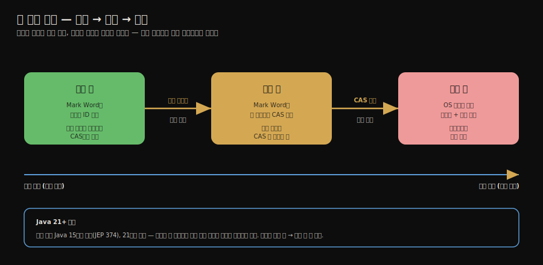

# 락 최적화 — 스핀·제거·굵게·경량·편향
---
> **`synchronized`의 블로킹 비용을 줄이려고 JVM은 다섯 가지 락 최적화를 적용합니다. 스핀 락은 잠깐 기다려 블로킹을 피하고, 락 제거·락 굵게 하기는 JIT가 불필요·과한 락을 손보며, 경량 락과 편향 락은 경합이 없을 때 CAS만으로 또는 그조차 없이 락을 처리합니다.** 핵심은 "락은 경합 정도에 따라 편향→경량→중량으로 팽창한다"는 흐름과, "편향 락이 왜 Java 15에서 폐기됐는가"입니다.

이 글을 읽고 나면 다섯 가지 락 최적화가 각각 무엇을 줄이는지 설명하고, 객체 헤더 Mark Word로 경량·편향 락이 어떻게 동작하는지 말하며, 락이 경합에 따라 팽창하는 순서를 그릴 수 있습니다.


## 진입 — 락은 원래 비싸다

> [앞 편](./02-02.스레드%20안전성%20구현%20—%20동기화와%20락.md)에서 `synchronized`의 블로킹이 커널 모드 전환 비용을 부른다고 했습니다. 그런데 실제 프로그램의 락 대부분은 경합이 없거나 약합니다. JVM은 그 흔한 경우를 싸게 처리하려 다섯 가지 최적화를 둡니다.

상호 배제 동기화의 블로킹은 운영체제 차원에서 스레드를 멈췄다 깨우는 일이라 비쌉니다. 그런데 현실의 락은 대부분 경합이 거의 없습니다. 혼자 잠깐 잡았다 푸는 락에 매번 커널 전환 비용을 치르는 것은 낭비입니다. JVM은 이 낭비를 줄이려고 다섯 가지 최적화를 적용합니다. 스핀 락, 락 제거, 락 굵게 하기, 경량 락, 편향 락입니다.


## 1. 스핀 락과 적응형 스핀

> 락을 잠깐 기다리면 곧 풀릴 텐데 스레드를 통째로 재우는 건 손해입니다. 스핀 락은 블로킹 대신 짧게 바쁜 대기를 돌아 그 손해를 피합니다.

블로킹의 진짜 비용은 스레드를 멈추고 깨우는 *상태 전환*에 있습니다. 그런데 임계 영역이 짧으면 락은 아주 잠깐만 잡혀 있다가 풀립니다. 이때 스레드를 재웠다 깨우는 비용이 오히려 기다리는 시간보다 큽니다.

**스핀 락(Spin lock)** 은 이 경우 스레드를 멈추는 대신, 락이 풀렸는지 짧은 루프를 돌며 **바쁜 대기**로 확인합니다. 락이 곧 풀리면 상태 전환 없이 바로 락을 얻어 이득입니다. 다만 락이 오래 안 풀리면 도는 동안 CPU만 태우므로, 일정 횟수를 넘으면 스핀을 포기하고 블로킹으로 넘어갑니다.

**적응형 스핀(Adaptive spinning)** 은 이 스핀 횟수를 고정하지 않고 *과거 이력으로 조정*합니다. 같은 락에서 최근 스핀이 자주 성공했다면 이번에도 더 오래 스핀하고, 자주 실패했다면 아예 스핀을 줄이거나 건너뜁니다. 락마다 다른 경합 양상에 맞춰 스핀의 득실을 동적으로 맞추는 것입니다.


## 2. 락 제거 — JIT가 없애는 락

> 락 제거는 JIT가 탈출 분석으로 "이 락은 한 스레드만 쓴다"고 판단하면 동기화를 통째로 없애는 최적화입니다. 라이브러리가 안에 숨겨 둔 불필요한 동기화를 걷어냅니다.

**락 제거(Lock elimination)** 는 JIT 컴파일러가 [탈출 분석](../ch04_compilation-optimization/02-03.컴파일러%20최적화%20—%20메서드%20인라인과%20탈출%20분석.md)으로 어떤 락 객체가 한 스레드 밖으로 새어 나가지 않음을 확인하면, 그 동기화를 아예 제거하는 최적화입니다. 공유되지 않는 객체에 건 락은 아무도 경합하지 않으므로 없애도 안전합니다.

대표 사례가 `StringBuffer`입니다. `StringBuffer.append()`는 `synchronized` 메서드인데, 메서드 안에서만 만들어 쓰고 밖으로 내보내지 않는 지역 `StringBuffer`는 다른 스레드가 닿을 수 없습니다.

```java
public String concat(String s1, String s2) {
    StringBuffer sb = new StringBuffer();  // 지역 변수, 메서드 밖으로 안 샘
    sb.append(s1);   // synchronized이지만 JIT가 락을 제거
    sb.append(s2);
    return sb.toString();
}
```

`sb`는 `concat` 밖으로 새지 않으므로, JIT가 `append`의 동기화를 걷어내 락 비용 없이 실행합니다. 개발자가 코드를 바꾸지 않아도 런타임이 알아서 손보는 것입니다.


## 3. 락 굵게 하기 — 흩어진 락을 합친다

> 같은 락을 짧은 간격으로 잡았다 푸는 일이 반복되면, 그 사이를 묶어 한 번만 잡는 편이 쌉니다. 락 굵게 하기가 그 묶음을 만듭니다.

**락 굵게 하기(Lock coarsening)** 는 같은 락 객체에 대한 잠금·해제가 짧은 간격으로 잇따르면, 그 구간을 하나의 더 큰 락으로 합치는 최적화입니다. 잡았다 푸는 일을 반복하는 오버헤드를 한 번으로 줄입니다.

```java
// 최적화 전: 같은 락을 세 번 잡았다 푼다
synchronized (lock) { append(s1); }
synchronized (lock) { append(s2); }
synchronized (lock) { append(s3); }

// 최적화 후: 하나로 합쳐 한 번만 잡는다
synchronized (lock) {
    append(s1);
    append(s2);
    append(s3);
}
```

앞 편의 `StringBuffer`에 `append`를 잇따라 부르는 코드가 좋은 예입니다. 매 `append`마다 락을 잡고 푸는 대신, JVM이 그 연속 구간을 하나의 락으로 굵게 만들어 잠금 횟수를 줄입니다.


## 4. 경량 락 — 경합이 없을 때의 CAS

> 경량 락은 경합이 없는 동기화를 커널 블로킹 없이 CAS만으로 처리합니다. 객체 헤더의 Mark Word를 스택의 락 레코드로 가리키게 바꿔 락을 표시합니다.

**경량 락(Lightweight locking)** 은 *경합이 없는* 동기화를 운영체제 뮤텍스(중량 락) 없이 처리하는 최적화입니다. 바탕은 객체 헤더의 **Mark Word**입니다. 모든 객체는 헤더에 해시코드·GC 정보·락 상태 등을 담는 Mark Word를 갖습니다. Mark Word 끝 2비트가 그 락 상태를 나타내는데, `01`은 잠기지 않음(해시코드·GC age가 그대로 보임), `00`은 경량 락(Mark Word가 스택의 락 레코드를 가리킴), `10`은 중량 락(모니터 객체를 가리킴)입니다. 곧 같은 워드가 비트 상태에 따라 다르게 해석됩니다.

흐름은 이렇습니다. 스레드가 `synchronized`에 진입하면, JVM은 그 스레드의 스택 프레임에 **락 레코드(Lock Record)** 를 만들고, 객체의 Mark Word를 그 락 레코드를 가리키는 포인터로 **CAS로 교체**합니다. CAS가 성공하면 경합 없이 락을 얻은 것이라 커널 전환 없이 진행합니다. CAS가 실패하면 다른 스레드가 이미 그 락을 쓰고 있다는 뜻, 곧 경합이 생긴 것이므로 경량 락은 운영체제 뮤텍스를 쓰는 **중량 락(Heavyweight lock)** 으로 팽창합니다. 중량 락은 정확하지만 블로킹과 커널 전환 비용을 치릅니다.

정리하면 경량 락은 "경합이 없다"는 흔한 경우를 CAS 한 번으로 싸게 처리하고, 경합이 드러나면 중량 락으로 넘기는 장치입니다.


## 5. 편향 락 — 한 스레드를 위한 더 강한 최적화

> 편향 락은 경량 락보다 한 걸음 더 나아가, 락을 처음 잡은 스레드가 다시 잡을 때는 CAS조차 생략합니다. 다만 스레드 풀 환경과 맞지 않아 Java 15에서 폐기됐습니다.

**편향 락(Biased locking)** 은 "이 락은 사실상 한 스레드만 쓴다"는 가정 위에 선 최적화입니다. 락을 처음 획득한 스레드의 ID를 객체 Mark Word에 기록해 두고, 이후 **같은 스레드**가 그 락을 다시 잡을 때는 경량 락의 CAS마저 생략하고 곧장 진입합니다. 한 스레드가 같은 락을 반복해 잡는 흔한 경우를, 최초 1회를 빼면 거의 공짜로 만드는 것입니다.

문제는 다른 스레드가 그 락을 잡으려 할 때입니다. Mark Word에 박힌 편향을 **해제(revoke)** 해야 하는데, 이 해제 비용이 작지 않습니다. 그런데 현대 애플리케이션은 스레드 풀로 여러 스레드가 락을 돌려 쓰는 일이 흔해, 편향이 자꾸 깨지며 해제 비용이 이득을 잡아먹습니다. 그래서 편향 락은 **Java 15에서 폐기(deprecated, JEP 374)** 되고 **Java 21에서 제거**됐습니다.


## 6. 락 팽창 — 경합에 따라 자란다

> 다섯 최적화는 따로 노는 게 아니라 하나의 흐름으로 엮입니다. 락은 경합이 없을 때 가장 싼 상태로 시작해, 경합이 드러날수록 더 비싸고 정확한 상태로 팽창합니다.

지금까지의 최적화는 락이 경합 정도에 따라 **단계적으로 팽창**하는 한 흐름으로 이어집니다.



편향 락이 살아 있던 시절의 전체 흐름은 이렇습니다. 락은 경합이 전혀 없으면 **편향 락**으로 한 스레드에 거의 공짜로 머물고, 다른 스레드가 끼어들면 **경량 락**으로 풀려 CAS로 다투며, 경량 락의 CAS마저 실패할 만큼 경합이 심해지면 운영체제 뮤텍스를 쓰는 **중량 락**으로 부풀어 오릅니다. 한번 팽창한 락은 보통 다시 줄어들지 않습니다. 편향 락이 제거된 현재(Java 21+)는 경량 락에서 시작해 중량 락으로 팽창하는 두 단계로 단순해졌습니다.

이 팽창 모델의 뜻은 분명합니다. JVM은 가장 흔한 "경합 없음"을 가장 싸게 처리하고, 경합이 실제로 드러난 만큼만 비용을 치르게 설계됐습니다.


## 7. 면접 대비 요약

> 세 질문에 *먼저 스스로 답해 본 뒤* 아래 정답으로 내려갑니다. 자답 없이 읽으면 학습 효과가 줄어듭니다.

1. 스핀 락은 무엇을 줄이려는 최적화이며, 적응형 스핀은 거기에 무엇을 더합니까?
2. 락 제거와 락 굵게 하기는 각각 무엇을 손봅니까? 둘 다 어디서 일어나나요?
3. 경량 락과 편향 락은 어떻게 다르며, 편향 락은 왜 제거됐습니까?

### 정답

1. 스핀 락은 블로킹의 *스레드 상태 전환 비용*을 줄이려는 최적화입니다. 임계 영역이 짧아 락이 곧 풀릴 때, 스레드를 재우는 대신 짧은 바쁜 대기로 기다려 전환 비용을 피합니다. 적응형 스핀은 그 스핀 횟수를 과거 성공·실패 이력으로 조정해, 락마다 다른 경합 양상에 맞춰 스핀의 득실을 동적으로 맞춥니다.

2. 락 제거는 JIT가 탈출 분석으로 한 스레드만 쓰는 락을 찾아 동기화를 통째로 없애는 것이고(예: 지역 `StringBuffer`), 락 굵게 하기는 같은 락을 짧은 간격으로 반복해 잡는 구간을 하나로 합쳐 잠금 횟수를 줄이는 것입니다. 둘 다 JIT 컴파일러가 런타임에 수행하므로 개발자가 코드를 바꿀 필요가 없습니다.

3. 경량 락은 경합 없는 동기화를 객체 Mark Word를 락 레코드로 CAS 교체해 처리하고, 그 CAS가 실패하면 중량 락으로 팽창합니다. 편향 락은 한 걸음 더 나아가 처음 락을 잡은 스레드 ID를 Mark Word에 기록해, 같은 스레드의 재획득에서는 CAS조차 생략합니다. 다만 스레드 풀로 여러 스레드가 락을 돌려 쓰면 편향 해제 비용이 이득을 넘어서, Java 15에서 폐기되고 21에서 제거됐습니다.


## 관련 문서

- [02-02.스레드 안전성 구현 — 동기화와 락](./02-02.스레드%20안전성%20구현%20—%20동기화와%20락.md) — 이 편이 최적화하는 `synchronized`의 블로킹 동기화와 CAS를 다룹니다.
- [01-01.하드웨어 효율과 자바 메모리 모델](./01-01.하드웨어%20효율과%20자바%20메모리%20모델.md) — 객체 헤더와 메모리 연산의 바탕이 되는 JMM입니다.
- [05-01.Java Memory Model 심화](./05-01.Java%20Memory%20Model%20심화.md) — DCL과 volatile/synchronized/Atomic 비교를 더 깊게 봅니다.
