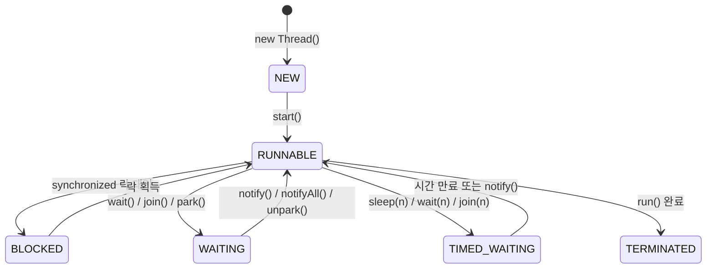

# 스레드 생성과 생명주기
---
> 자바의 멀티스레딩은 하나의 프로세스 안에서 여러 실행 흐름을 동시에 진행하는 기술이다. 스레드를 어떻게 만들고, 어떤 상태를 거치며, 어떻게 제어하는지 이해하는 것이 동시성 프로그래밍의 출발점이다. 본 노트를 한 줄로 압축하면 — **스레드의 생명은 *생성 → 실행 → 대기/블록 → 종료*의 5상태 사이를 오가는 그래프이며, `interrupt()`·`join()`·`sleep()`은 그 그래프에서 상태를 *옮기는* 세 명령**이다. 데몬 스레드는 그 그래프와 별도로 *프로세스 수명에 묶이지 않는다*는 점이 핵심 차이.

## 1. Thread vs Runnable

자바에서 스레드를 생성하는 방법은 크게 두 가지다. `Thread` 클래스를 직접 상속하거나, `Runnable` 인터페이스를 구현하는 방식이다. 대부분의 실무에서는 `Runnable` 구현 방식을 선택한다.

`Thread` 상속 방식은 단순하지만 자바의 단일 상속 제약 때문에 다른 클래스를 상속할 수 없게 된다. `Runnable`은 작업(task)과 실행 메커니즘(thread)을 분리하므로, 동일한 작업 인스턴스를 여러 스레드에 재사용하거나 스레드 풀과 조합하기도 쉽다. `Callable<T>`은 `Runnable`과 달리 결과값을 반환하고 예외를 던질 수 있어, 비동기 계산 결과가 필요할 때 사용한다.

## 2. 스레드 생성 3가지 방법

### 2-1. Thread 클래스 상속

```java
public class HelloThread extends Thread {
    @Override
    public void run() {
        System.out.println(Thread.currentThread().getName() + ": run()");
    }
}

// 사용
HelloThread t = new HelloThread();
t.start(); // run()이 아닌 start()를 호출해야 새 스레드에서 실행된다
```

`start()`를 호출해야 JVM이 새 스레드를 생성하고 그 안에서 `run()`을 실행한다. `run()`을 직접 호출하면 현재 스레드(main)가 그 메서드를 실행하게 되어 멀티스레딩이 아니다.

### 2-2. Runnable 인터페이스 구현

```java
public class HelloRunnable implements Runnable {
    @Override
    public void run() {
        System.out.println(Thread.currentThread().getName() + ": run()");
    }
}

// 사용
Thread t = new Thread(new HelloRunnable(), "worker-1");
t.start();

// 람다로 간소화
Thread t2 = new Thread(
        () -> System.out.println(Thread.currentThread().getName())
        , "worker-2"
);
t2.start();
```

### 2-3. Callable + Future

`Callable<T>`은 결과값을 돌려주는 작업을 정의할 때 사용한다. `ExecutorService`에 제출하면 `Future<T>`를 반환하며, `future.get()`을 호출하는 시점에 결과가 준비될 때까지 블로킹된다.

```java
import java.util.concurrent.*;

Callable<Integer> task = () -> {
    Thread.sleep(1000);
    return 42;
};

ExecutorService executor = Executors.newSingleThreadExecutor();
Future<Integer> future = executor.submit(task);

// 다른 작업 수행 가능...
int result = future.get(); // 결과가 준비될 때까지 대기
executor.shutdown();
```

## 3. 스레드 생명주기

모든 스레드 상태는 `Thread.State` enum으로 정의되어 있다. 스레드는 생성 직후 NEW 상태이며, `start()`를 호출해야 RUNNABLE로 전환된다.



- **NEW**: 스레드 객체가 생성되었으나 `start()`가 호출되지 않은 상태다.
- **RUNNABLE**: CPU에서 실행 중이거나 스케줄러 큐에서 실행 대기 중인 상태다. 자바 모델상 둘 다 RUNNABLE로 표현한다.
- **BLOCKED**: `synchronized` 블록 진입을 위해 다른 스레드가 보유한 모니터 락을 기다리는 상태다. 인터럽트에 응답하지 않는다.
- **WAITING**: `Object.wait()`, `Thread.join()`, `LockSupport.park()` 호출로 무기한 대기하는 상태다. 다른 스레드가 `notify()`나 `unpark()`를 호출해야 깨어난다.
- **TIMED_WAITING**: `Thread.sleep(n)`, `Object.wait(n)`, `Thread.join(n)` 등 시간 제한이 있는 대기 상태다. 시간이 만료되거나 명시적으로 깨우면 RUNNABLE로 돌아온다.
- **TERMINATED**: `run()` 메서드가 정상 완료되거나 예외로 종료된 최종 상태다. 종료된 스레드는 재시작할 수 없다.

여섯 상태가 OS 상태가 아닌 JVM의 추상이라는 점, BLOCKED(*모니터 락 하나*를 기다림)와 WAITING(*다른 스레드의 깨움*을 기다림)의 차이, 깨어남이 "즉시 실행"이 아니라 RUNNABLE 복귀라는 점은 정독본 [`01-03.자바와 스레드 — 구현·스케줄링·상태`](./01-03.자바와%20스레드%20—%20구현·스케줄링·상태.md)§3~4가 SSOT다.

## 4. 스레드 제어 메서드

### 4-1. sleep — 지정 시간 대기

```java
try {
    Thread.sleep(1000); // 1초간 TIMED_WAITING
} catch (InterruptedException e) {
    Thread.currentThread().interrupt(); // 인터럽트 상태 복원
}
```

`sleep()`은 CPU를 점유하지 않고 지정 시간을 쉬게 한다. `InterruptedException`이 발생하면 인터럽트 플래그가 초기화되므로, catch 블록에서 `interrupt()`를 다시 호출해 상위 코드가 인터럽트를 인식할 수 있도록 해야 한다.

### 4-2. join — 다른 스레드 완료 대기

```java
Thread t1 = new Thread(task1, "thread-1");
Thread t2 = new Thread(task2, "thread-2");
t1.start();
t2.start();

t1.join();      // t1이 끝날 때까지 현재 스레드 WAITING
t2.join();      // t2가 끝날 때까지 현재 스레드 WAITING
// t1.join(2000); // 최대 2초만 기다리는 타임아웃 버전

int total = task1.result + task2.result; // 이제 안전하게 결과 사용 가능
```

`join()` 없이 결과를 읽으면 두 스레드가 계산을 완료하기 전에 main 스레드가 결과를 읽어 0이 나온다. `sleep()`으로 타이밍을 맞추는 방식은 실행 환경마다 달라 불안정하다.

### 4-3. interrupt — 작업 중단 요청

```java
thread.interrupt(); // 인터럽트 플래그를 true로 설정

// 대상 스레드에서:
// 방법 1 — isInterrupted() (플래그 유지)
while (!Thread.currentThread().isInterrupted()) {
    doWork();
}

// 방법 2 — Thread.interrupted() (플래그를 true → false로 초기화)
while (!Thread.interrupted()) {
    doWork();
}
// 이후 sleep() 등 호출 시 예외 발생 없이 안전하게 정리 작업 수행 가능
```

`isInterrupted()`는 플래그를 읽기만 하고 값을 유지한다. 반면 `Thread.interrupted()`는 플래그를 읽은 뒤 `false`로 초기화한다. 인터럽트 목적을 달성한 후에는 플래그를 초기화해 두어야 이후 `sleep()` 같은 메서드에서 의도치 않은 `InterruptedException`이 발생하지 않는다.

### 4-4. yield — 실행 양보

```java
for (int i = 0; i < 10; i++) {
    System.out.println(Thread.currentThread().getName() + " - " + i);
    Thread.yield(); // 스케줄러에게 다른 스레드 실행을 힌트로 제안
}
```

`yield()`는 현재 스레드가 자발적으로 남은 CPU 타임슬라이스를 포기하고, 같은 우선순위의 다른 스레드에게 실행 기회를 준다. 어떤 스레드가 선택될지는 JVM 스케줄러가 결정하며, 양보받을 스레드가 없으면 현재 스레드가 계속 실행된다.

### 4-5. setPriority — 우선순위 설정

```java
Thread t = new Thread(task);
t.setPriority(Thread.MAX_PRIORITY); // 10
t.setPriority(Thread.NORM_PRIORITY); // 5 (기본값)
t.setPriority(Thread.MIN_PRIORITY);  // 1
```

우선순위는 1~10 범위이며 기본값은 5다. 값이 클수록 스케줄러에 힌트를 주지만, 실제 실행 순서는 OS 스케줄러가 결정하므로 우선순위에 의존한 로직을 작성하면 안 된다.

## 5. 데몬 스레드

데몬 스레드(daemon thread)는 일반 스레드의 보조 역할을 하는 백그라운드 스레드다. JVM은 모든 일반 스레드가 종료되면 데몬 스레드의 완료를 기다리지 않고 즉시 종료한다.

```java
Thread daemon = new Thread(() -> {
    while (true) {
        System.out.println("백그라운드 작업 중...");
        try {
            Thread.sleep(1000);
        } catch (InterruptedException e) {
            break;
        }
    }
}, "monitor-thread");

daemon.setDaemon(true); // start() 호출 전에 설정해야 한다
daemon.start();
```

`setDaemon(true)`는 반드시 `start()` 전에 호출해야 한다. 이미 시작된 스레드에 설정하면 `IllegalThreadStateException`이 발생한다. 시스템 모니터링, 주기적 로그 수집, GC 보조 작업처럼 메인 흐름이 끝나면 자동으로 정리되어도 무방한 작업에 적합하다.


## 관련 문서

- [`./03-02.메모리 가시성과 동기화.md`](./03-02.메모리%20가시성과%20동기화.md) — 두 스레드 사이 *데이터*를 어떻게 안전하게 주고받는가
- [`./03-03.생산자-소비자 패턴.md`](./03-03.생산자-소비자%20패턴.md) — 스레드 협력의 가장 흔한 모델
- [`./04-02.Executor 프레임워크.md`](./04-02.Executor%20프레임워크.md) — `new Thread()`를 직접 만드는 대신 *풀로 관리*하는 권장 방식
- [`./05-02.Virtual Threads 기초.md`](./05-02.Virtual%20Threads%20기초.md) — JDK 21에서 도입된 *경량 스레드*가 본 노트의 OS 스레드 모델을 어떻게 바꾸는지
- [`../README`](../README.md) — 05_JVM 학습 인덱스
