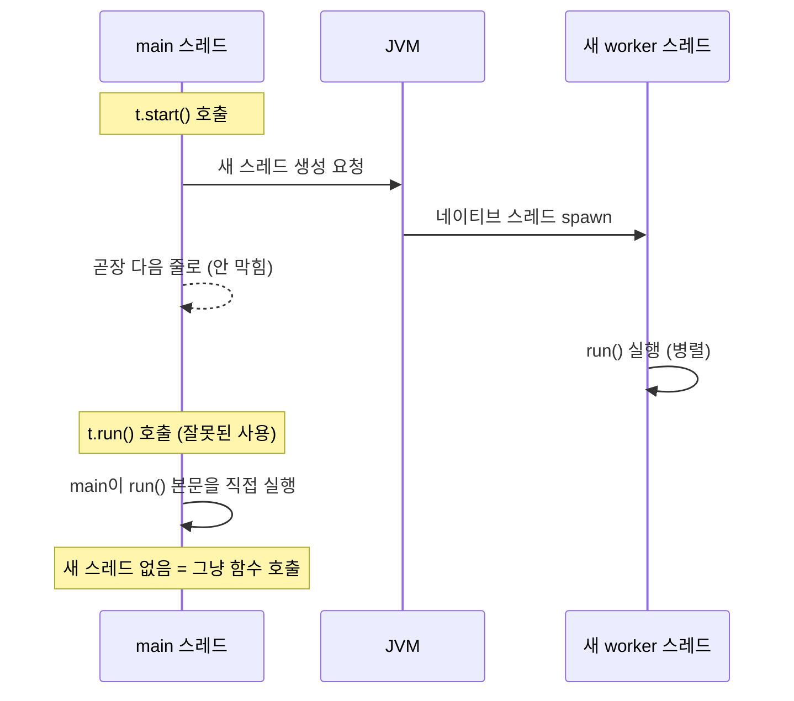
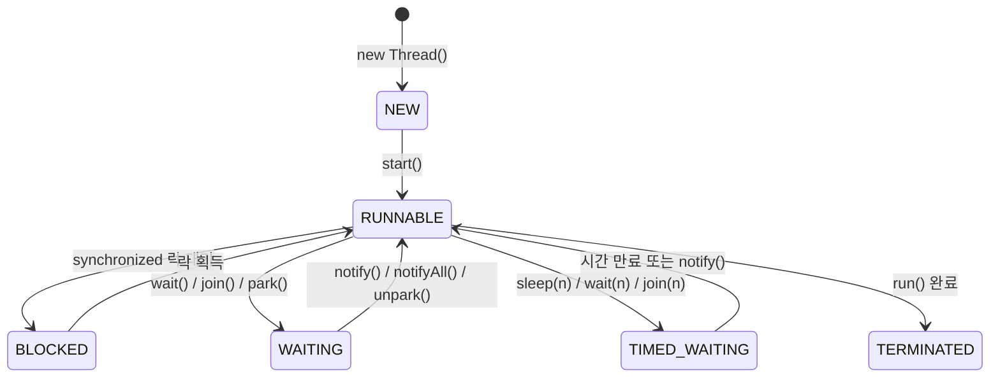
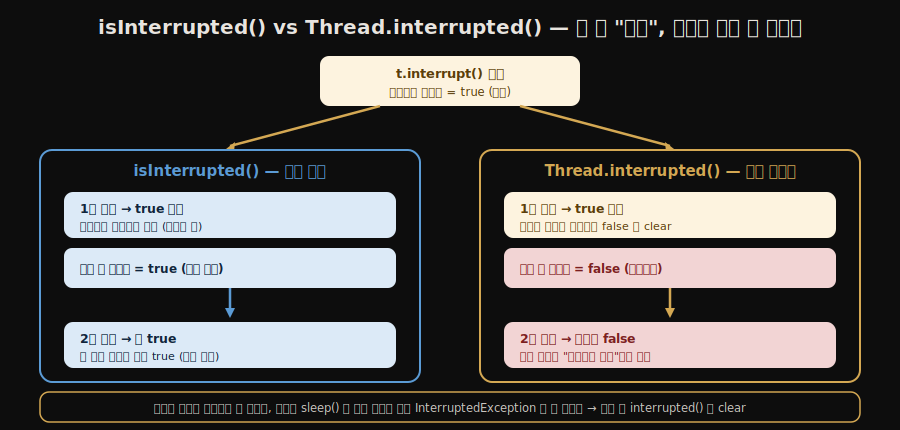
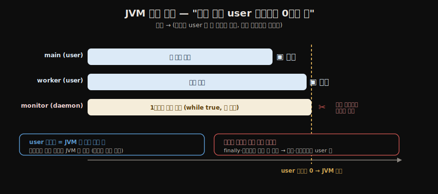

# 스레드 생성과 생명주기
---
> 자바의 멀티스레딩은 하나의 프로세스 안에서 여러 실행 흐름을 동시에 진행하는 기술이다. 스레드를 어떻게 만들고, 어떤 상태를 거치며, 어떻게 제어하는지 이해하는 것이 동시성 프로그래밍의 출발점이다. 
>
> **스레드의 생명은 *생성 → 실행 → 대기/블록 → 종료*의 5상태 사이를 오가는 그래프이며, `interrupt()`·`join()`·`sleep()`은 그 그래프에서 상태를 *옮기는* 세 명령**이다. 데몬 스레드는 그 그래프와 별도로 *프로세스 수명에 묶이지 않는다*는 점이 핵심 차이.


## 1. Thread vs Runnable

> 자바에서 스레드를 생성하는 방법은 크게 두 가지다. `Thread` 클래스를 직접 상속하거나, `Runnable` 인터페이스를 구현하는 방식이다. 대부분의 실무에서는 `Runnable` 구현 방식을 선택한다.

`Thread` 상속 방식은 단순하지만 자바의 단일 상속 제약 때문에 다른 클래스를 상속할 수 없게 된다. 

- `Runnable`은 작업(task)과 실행 메커니즘(thread)을 분리하므로, 동일한 작업 인스턴스를 여러 스레드에 재사용하거나 스레드 풀과 조합하기도 쉽다. 
- `Callable<T>`은 `Runnable`과 달리 결과값을 반환하고 예외를 던질 수 있어, 비동기 계산 결과가 필요할 때 사용한다.


## 2. 스레드 생성 3가지 방법

### 2-1. Thread 클래스 상속

```java
public class HelloThread extends Thread {
    @Override
    public void run() {
        System.out.println(Thread.currentThread().getName() + ": run()");
    }
}

// 사용
HelloThread t = new HelloThread();
t.start(); // run()이 아닌 start()를 호출해야 새 스레드에서 실행된다
```

- `start()`를 호출해야 JVM이 새 스레드를 생성하고 그 안에서 `run()`을 실행한다. `run()`을 직접 호출하면 현재 스레드(main)가 그 메서드를 실행하게 되어 멀티스레딩이 아니다.

`run()`은 그 자체로는 특별할 게 없는 **평범한 메서드**다. 새 스레드를 만드는 마법은 오직 `start()` 안에 있다. `start()`는 OS에 새 실행 흐름(네이티브 스레드)을 만들어 달라고 요청하고, 그렇게 태어난 *새 스레드*가 `run()`을 실행한다. 그래서 `t.start()`는 호출한 쪽(main)을 막지 않고 곧장 다음 줄로 넘어가며, `run()`은 다른 스레드 위에서 병렬로 돈다. 반면 `t.run()`은 그저 "지금 이 자리에서 `run()`이라는 메서드를 호출"하는 것뿐이라, 새 스레드 없이 **현재 스레드가 그 본문을 끝까지 실행**하고 나서야 다음 줄로 간다 — 평범한 함수 호출과 똑같다.



확인법은 `run()` 안에서 `Thread.currentThread().getName()`을 찍어보는 것이다. `start()`로 부르면 `Thread-0`·`worker-1` 같은 *새 이름*이, `run()`을 직접 부르면 `main`이 찍힌다 — 어느 스레드가 실행했는지가 이름으로 드러난다.

`start()`가 "새 스레드를 만든다"는 말의 실체는 JDK 21 `Thread.start()` 소스에서 확인된다.

```java
// java.lang.Thread (JDK 21)
public void start() {
    synchronized (this) {
        // threadStatus 가 0 이면 NEW 상태
        if (holder.threadStatus != 0)
            throw new IllegalThreadStateException(); // 이미 시작/종료된 스레드
        start0();                                    // ← 여기서 OS 스레드 생성
    }
}
private native void start0();                        // 네이티브 메서드
```

`start()`는 자바 코드로 스레드를 직접 만들지 않는다. 먼저 `threadStatus`가 `0`(NEW)인지 검사해 **아직 시작 안 한 스레드만** 통과시키고, 통과하면 **네이티브 메서드 `start0()`** 에게 넘긴다. 실제 OS 스레드 생성은 JVM의 native 코드가 하고, 그 새 스레드가 비로소 `run()`을 실행한다. `setPriority0`·`interrupt0`도 같은 식의 native 메서드다 — 스레드 *제어*는 결국 OS 기능이라 native로 내려간다.

이 검사 한 줄 덕분에 **스레드는 일회용**이 된다. 한 번 `start()`하면 `threadStatus`가 0이 아니게 되어, 같은 스레드에 `start()`를 두 번 부르거나 *종료된* 스레드를 다시 부르면 `IllegalThreadStateException`이 난다. 공식 문서도 *"A thread can be started at most once ... can not be restarted after it has terminated"* 라고 못 박는다. 다시 돌리고 싶으면 새 `Thread` 객체를 만들거나, 애초에 스레드를 재사용하는 **스레드 풀**(→ [`04-01.Executor 프레임워크`](./04-01.Executor%20프레임워크.md))을 쓴다.

### 2-2. Runnable 인터페이스 구현

```java
public class HelloRunnable implements Runnable {
    @Override
    public void run() {
        System.out.println(Thread.currentThread().getName() + ": run()");
    }
}

// 사용
Thread t = new Thread(new HelloRunnable(), "worker-1");
t.start();

// 람다로 간소화
Thread t2 = new Thread(
        () -> System.out.println(Thread.currentThread().getName())
        , "worker-2"
);
t2.start();
```

### 2-3. Callable + Future

`Callable<T>`은 결과값을 돌려주는 작업을 정의할 때 사용한다. 

```java
import java.util.concurrent.*;

// 결과값 대기
Callable<Integer> task = () -> {
    Thread.sleep(1000);
    return 42;
};

ExecutorService executor = Executors.newSingleThreadExecutor();
Future<Integer> future = executor.submit(task);

// 다른 작업 수행 가능...
int result = future.get(); // 결과가 준비될 때까지 대기
executor.shutdown();
```

- `ExecutorService`에 제출하면 `Future<T>`를 반환하며, `future.get()`을 호출하는 시점에 결과가 준비될 때까지 블로킹된다.

`Runnable`·`Callable`·`Future`는 역할이 명확히 나뉘므로 한 줄씩 못 박아 둔다.

| | 정체 | 반환 | 예외 | 비유 |
|---|------|------|------|------|
| `Runnable` | **할 일** (작업) | 없음(`void`) | 체크 예외 못 던짐 | "이거 해줘" 쪽지 |
| `Callable<T>` | **결과를 돌려주는 할 일** | `T` 반환 | 던질 수 있음 | "이거 해서 결과 줘" 쪽지 |
| `Future<T>` | 그 결과를 **나중에 받는 핸들** | `get()`이 `T` | — | 세탁물 교환권 |

자답에서 "Callable은 반환까지 기다리게 해주는 객체"라고 했는데, *기다리는* 일은 `Callable`이 아니라 `Future`가 한다. `Callable`은 "결과를 반환하는 *작업 자체*"이고, 그 작업을 `executor.submit()`에 넘기면 즉시 `Future`라는 **교환권**을 돌려받는다. 작업은 백그라운드 스레드에서 도는 동안 main은 다른 일을 하다가, 결과가 필요한 순간 `future.get()`으로 교환권을 내밀고 결과를 받는다(아직 안 끝났으면 그때 블로킹). 즉 **"작업을 맡기는 시점"과 "결과를 받는 시점"이 분리**되는 것이 `Callable`+`Future`의 핵심이다 — `Thread`를 직접 만들어 `run()`을 돌리면 반환값을 받을 길이 없어 이 분리가 불가능하다.


## 3. 스레드 생명주기

모든 스레드 상태는 `Thread.State` enum으로 정의되어 있다. 스레드는 생성 직후 NEW 상태이며, `start()`를 호출해야 RUNNABLE로 전환된다.



- **NEW**: 스레드 객체가 생성되었으나 `start()`가 호출되지 않은 상태다.
- **RUNNABLE**: CPU에서 실행 중이거나 스케줄러 큐에서 실행 대기 중인 상태다. 자바 모델상 둘 다 RUNNABLE로 표현한다.
- **BLOCKED**: `synchronized` 블록 진입을 위해 다른 스레드가 보유한 모니터 락을 기다리는 상태다. 인터럽트에 응답하지 않는다.
- **WAITING**: `Object.wait()`, `Thread.join()`, `LockSupport.park()` 호출로 무기한 대기하는 상태다. 다른 스레드가 `notify()`나 `unpark()`를 호출해야 깨어난다.
- **TIMED_WAITING**: `Thread.sleep(n)`, `Object.wait(n)`, `Thread.join(n)` 등 시간 제한이 있는 대기 상태다. 시간이 만료되거나 명시적으로 깨우면 RUNNABLE로 돌아온다.
- **TERMINATED**: `run()` 메서드가 정상 완료되거나 예외로 종료된 최종 상태다. 종료된 스레드는 재시작할 수 없다.

여섯 상태가 OS 상태가 아닌 JVM의 추상이라는 점, BLOCKED(*모니터 락 하나*를 기다림)와 WAITING(*다른 스레드의 깨움*을 기다림)의 차이, 깨어남이 "즉시 실행"이 아니라 RUNNABLE 복귀라는 점은 정독본 [`01-03.자바와 스레드 — 구현·스케줄링·상태`](./01-03.자바와%20스레드%20—%20구현·스케줄링·상태.md)§3~4가 SSOT다.


## 4. 스레드 제어 메서드

### 4-1. sleep — 지정 시간 대기

```java
try {
    Thread.sleep(1000); // 1초간 TIMED_WAITING
} catch (InterruptedException e) {
    Thread.currentThread().interrupt(); // 인터럽트 상태 복원
}
```

- `sleep()`은 CPU를 점유하지 않고 지정 시간을 쉬게 한다. `InterruptedException`이 발생하면 인터럽트 플래그가 초기화되므로, catch 블록에서 `interrupt()`를 다시 호출해 상위 코드가 인터럽트를 인식할 수 있도록 해야 한다.

### 4-2. join — 다른 스레드 완료 대기

```java
Thread t1 = new Thread(task1, "thread-1");
Thread t2 = new Thread(task2, "thread-2");
t1.start();
t2.start();

t1.join();      // t1이 끝날 때까지 현재 스레드 WAITING
t2.join();      // t2가 끝날 때까지 현재 스레드 WAITING
// t1.join(2000); // 최대 2초만 기다리는 타임아웃 버전

int total = task1.result + task2.result; // 이제 안전하게 결과 사용 가능
```

- `join()` 없이 결과를 읽으면 두 스레드가 계산을 완료하기 전에 main 스레드가 결과를 읽어 0이 나온다. 
- `sleep()`으로 타이밍을 맞추는 방식은 실행 환경마다 달라 불안정하다.

### 4-3. interrupt — 작업 중단 요청

```java
thread.interrupt(); // 인터럽트 플래그를 true로 설정

// 대상 스레드에서:
// 방법 1 — isInterrupted() (플래그 유지)
while (!Thread.currentThread().isInterrupted()) {
    doWork();
}

// 방법 2 — Thread.interrupted() (플래그를 true → false로 초기화)
while (!Thread.interrupted()) {
    doWork();
}
// 이후 sleep() 등 호출 시 예외 발생 없이 안전하게 정리 작업 수행 가능
```

- `isInterrupted()`는 플래그를 읽기만 하고 값을 유지한다. 반면 `Thread.interrupted()`는 플래그를 읽은 뒤 `false`로 초기화한다. 
- 인터럽트 목적을 달성한 후에는 플래그를 초기화해 두어야 이후 `sleep()` 같은 메서드에서 의도치 않은 `InterruptedException`이 발생하지 않는다.

두 메서드의 헷갈리는 지점은 "무엇을 하느냐"가 아니라 "읽은 *뒤* 플래그를 어떻게 두느냐"다. 둘 다 플래그를 **읽는** 메서드이고, 플래그를 *켜는* 것은 인스턴스 메서드 `interrupt()`다. 같은 `true` 상태에서 출발해 한 번 통과시킨 뒤의 플래그 상태를 좌우로 대비하면 차이가 분명해진다.



`isInterrupted()`(인스턴스, 멱등 조회)는 몇 번을 읽어도 `true`다. `Thread.interrupted()`(static, 과거형 = "읽고 치운다")는 읽는 순간 `false`로 비우므로 두 번째 읽기는 `false`가 된다. 그래서 인터럽트를 *확인만* 할 때는 `isInterrupted()`, 처리를 끝내고 플래그를 *소비*해 비울 때는 `Thread.interrupted()`를 쓴다.

### 4-4. yield — 실행 양보

```java
for (int i = 0; i < 10; i++) {
    System.out.println(Thread.currentThread().getName() + " - " + i);
    Thread.yield(); // 스케줄러에게 다른 스레드 실행을 힌트로 제안
}
```

- `yield()`는 현재 스레드가 자발적으로 남은 CPU 타임슬라이스를 포기하고, 같은 우선순위의 다른 스레드에게 실행 기회를 준다. 
- 어떤 스레드가 선택될지는 JVM 스케줄러가 결정하며, 양보받을 스레드가 없으면 현재 스레드가 계속 실행된다.

### 4-5. setPriority — 우선순위 설정

```java
Thread t = new Thread(task);
t.setPriority(Thread.MAX_PRIORITY); // 10
t.setPriority(Thread.NORM_PRIORITY); // 5 (기본값)
t.setPriority(Thread.MIN_PRIORITY);  // 1
```

우선순위는 1~10 범위이며 기본값은 5다. 값이 클수록 스케줄러에 힌트를 주지만, 실제 실행 순서는 OS 스케줄러가 결정하므로 우선순위에 의존한 로직을 작성하면 안 된다.


## 5. 데몬 스레드

데몬 스레드(daemon thread)는 일반 스레드의 보조 역할을 하는 백그라운드 스레드다. JVM은 모든 일반 스레드가 종료되면 데몬 스레드의 완료를 기다리지 않고 즉시 종료한다.

```java
Thread daemon = new Thread(() -> {
    while (true) {
        System.out.println("백그라운드 작업 중...");
        try {
            Thread.sleep(1000);
        } catch (InterruptedException e) {
            break;
        }
    }
}, "monitor-thread");

daemon.setDaemon(true); // start() 호출 전에 설정해야 한다
daemon.start();
```

- `setDaemon(true)`는 반드시 `start()` 전에 호출해야 한다. 
- 이미 시작된 스레드에 설정하면 `IllegalThreadStateException`이 발생한다. 시스템 모니터링, 주기적 로그 수집, GC 보조 작업처럼 메인 흐름이 끝나면 자동으로 정리되어도 무방한 작업에 적합하다.

### 데몬 vs 일반(user) 스레드 — JVM 종료 조건

JVM은 "살아 있는 일반 스레드가 하나도 안 남으면" 종료한다. 이때 데몬 스레드가 아무리 바쁘게 돌고 있어도 **기다려 주지 않고** 그 자리에서 끊어 버린다. 즉 스레드를 두 종류로 나눠, *프로그램의 본 일*은 일반 스레드가 붙들고, *그 일을 돕는 보조 작업*은 데몬에 맡기는 구조다.

시간 축 위에 올려 보면 인과가 분명하다. user 스레드(main·worker)가 모두 끝나는 순간이 곧 JVM 종료 시점이고, 그때까지 일하던 데몬은 *작업 중이어도* 그 자리에서 잘린다.



| | 일반(user) 스레드 | 데몬 스레드 |
|---|------|------|
| JVM이 끝을 기다리나 | **기다린다** — 끝나야 JVM 종료 | 안 기다린다 — 일반 스레드 다 끝나면 즉시 끊김 |
| 맡기는 일 | 프로그램의 본질적 작업 | 본 작업을 돕는 보조 작업 |
| 예시 | main, 요청 처리, 결제 트랜잭션 | 모니터링, 주기적 로그 flush, 캐시 만료 청소, GC |

**"어떤 일에, 왜 데몬이어야 하나"** — 핵심은 *그 일이 끝나길 기다릴 가치가 없거나, 무한 루프라 영영 안 끝나는* 보조 작업이라는 점이다.

- **무한 루프 백그라운드 작업** (예: 1초마다 헬스 체크를 찍는 모니터 스레드). `while(true)`라 스스로 끝나지 않으므로, 일반 스레드로 두면 main이 끝나도 JVM이 이 스레드를 기다리며 **영영 종료되지 않는다**. 데몬으로 두면 본 작업이 끝나는 순간 JVM이 같이 정리한다.
- **끝을 기다릴 가치가 없는 보조 작업** (예: 통계 수집, 캐시 정리). 본 작업이 답을 다 냈는데 통계 한 줄 더 쓰겠다고 프로세스를 붙들 이유가 없다.

뒤집어 말하면, **끊겨도 안 되는 일은 절대 데몬에 두면 안 된다.** 데몬 스레드는 JVM 종료 시 `finally` 블록 실행이나 자원 정리를 보장받지 못한 채 끊길 수 있다. 그래서 결제 트랜잭션·파일 쓰기 완료처럼 *중간에 끊기면 데이터가 깨지는* 작업은 반드시 일반 스레드여야 한다.


## 6. 한눈에 보는 스레드 종류

지금까지 나온 스레드들을 "누가 만드나 / JVM 종료에 영향을 주나 / 무엇 위에서 도나"라는 축으로 한 번에 정리하면 다음과 같다. 데몬 vs user는 *JVM이 끝을 기다리느냐*의 축이고, 풀·가상 스레드는 *어떻게 만들고 무엇 위에서 도느냐*의 축이라 서로 직교한다(예: 풀 스레드도 데몬일 수 있다).

| 종류 | 누가 만드나 | JVM 종료를 막나 | 설명 |
|------|------------|----------------|------|
| **메인 스레드** | JVM이 자동 | — (이게 끝나도 다른 user 스레드 있으면 안 끝남) | `main()`을 실행하는 최초의 user 스레드 |
| **user(일반) 스레드** | 개발자 (`new Thread`) | **막는다** — 살아 있으면 JVM 안 끝남 | 프로그램의 본 작업 |
| **데몬 스레드** | 개발자 (`setDaemon(true)`) | 안 막는다 — user 다 끝나면 끊김 | 보조 작업(모니터링·GC 등) |
| **스레드 풀 스레드** | `ExecutorService` | 풀 설정에 따라 다름 | 미리 만들어 *재사용* — 생성 비용·일회용 제약을 없앰 |
| **가상 스레드** | `Thread.ofVirtual()` (JDK 21) | user 취급 | OS 스레드가 아닌 JVM이 스케줄링하는 경량 스레드 |
| **그린 스레드** | (옛 JVM) | — | OS 대신 JVM이 직접 스케줄링하던 초기 모델, JDK 1.3 이후 폐기. 가상 스레드가 *발상은 비슷하되 다른 방식*으로 부활한 셈 |

지금까지 §1~§5에서 본 것은 대부분 **하나의 자바 스레드가 하나의 OS 스레드에 1:1로 묶이는** 모델이다(이른바 *플랫폼 스레드*). 이 1:1 묶임 때문에 스레드 하나가 OS 자원을 적잖이 먹고, `new Thread()`마다 생성 비용이 든다 — 그래서 풀로 재사용하고, 더 나아가 OS 스레드에 묶이지 않는 **가상 스레드**가 JDK 21에 들어왔다(→ [`01-05.Virtual Threads 기초`](./01-05.Virtual%20Threads%20기초.md)). 그린 스레드는 그 가상 스레드의 *먼 조상*에 해당하는, JVM이 직접 굴리던 옛 모델이다.

**왜 스레드 풀인가** — 본 노트에서 본 두 가지 성질이 곧 풀의 존재 이유다. 첫째, §2-1에서 본 대로 스레드는 **일회용**이라 한 번 `run()`이 끝나면 그 `Thread` 객체는 두 번 못 쓴다(`IllegalThreadStateException`). 작업이 1만 건이면 `Thread`를 1만 번 만들어 버리는 셈이다. 둘째, 그 생성·소멸 하나하나가 OS 스레드를 만드는 비용을 부른다. 스레드 풀은 **미리 만들어 둔 스레드를 재사용**해 두 비용을 한꺼번에 없앤다 — 작업이 끝나도 스레드를 죽이지 않고 다음 작업을 받게 둔다. 그래서 실무에서는 `new Thread()`를 직접 쓰는 일이 드물고, 거의 항상 풀을 거친다. 풀의 종류(`newFixedThreadPool` 등)·`corePoolSize` 설정·우아한 종료 같은 *구체적인 사용법*은 [`04-01.Executor 프레임워크`](./04-01.Executor%20프레임워크.md)가 SSOT다. 여기서는 "스레드의 일회용 성질과 생성 비용이 풀을 부른다"는 *연결 고리*만 기억하면 된다.


## 관련 문서

- [`./02-02.스레드 안전성 구현 — 동기화와 락.md`](./02-02.스레드%20안전성%20구현%20—%20동기화와%20락.md) — 두 스레드 사이 *데이터*를 어떻게 안전하게 주고받는가
- [`./03-03.생산자-소비자 패턴.md`](./03-03.생산자-소비자%20패턴.md) — 스레드 협력의 가장 흔한 모델
- [`./04-01.Executor 프레임워크.md`](./04-01.Executor%20프레임워크.md) — `new Thread()`를 직접 만드는 대신 *풀로 관리*하는 권장 방식
- [`./01-05.Virtual Threads 기초.md`](./01-05.Virtual%20Threads%20기초.md) — JDK 21에서 도입된 *경량 스레드*가 본 노트의 OS 스레드 모델을 어떻게 바꾸는지
- [`../README`](../README.md) — 05_JVM 학습 인덱스
