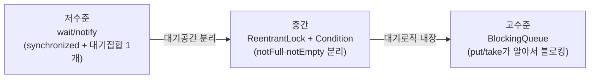
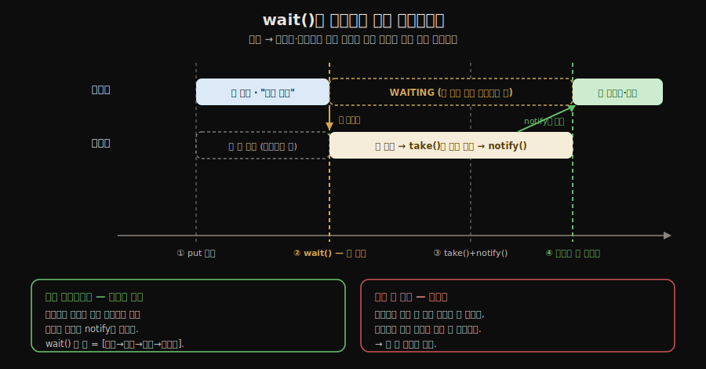
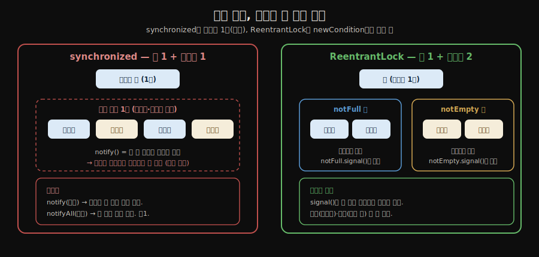

# 생산자-소비자 패턴
---
> 생산자-소비자 패턴은 데이터를 만드는 쪽과 소비하는 쪽을 버퍼로 분리해 독립적으로 동작하게 합니다. `wait()`/`notify()`의 한계를 이해하고, `ReentrantLock`과 `Condition`으로 어떻게 개선하는지, 그리고 `BlockingQueue`로 어떻게 단순화하는지를 함께 살펴봅니다.
>
> **생산자-소비자는 *공유 큐 위의 두 스레드 협력*이라는 한 패턴이며, JDK는 그 패턴을 *세 단계 추상화*(저수준 `wait/notify` → 중간 `Lock+Condition` → 고수준 `BlockingQueue`)로 발전시켜 왔습니다**. 실무에서 직접 손으로 쓸 일은 가장 위 단계뿐입니다.


## 1. 생산자-소비자 문제 정의

> 생산자는 버퍼에 넣고 소비자는 꺼내는데, 버퍼가 가득 차거나 비면 한쪽이 대기해야 하며, 버리거나 `null`을 반환하면 처리 속도 차이로 데이터가 유실됩니다.

생산자(producer)는 데이터를 생성해 공유 버퍼에 넣고, 소비자(consumer)는 버퍼에서 데이터를 꺼내 처리합니다. 버퍼는 한정된 크기를 가지므로 두 가지 상황이 발생합니다.

- 버퍼가 가득 찼을 때 생산자는 공간이 생길 때까지 대기해야 합니다.
- 버퍼가 비었을 때 소비자는 데이터가 들어올 때까지 대기해야 합니다.

단순히 버퍼가 꽉 찼을 때 데이터를 버리거나, 비었을 때 null을 반환하면 생산자와 소비자의 처리 속도 차이에 따라 데이터 유실이 발생합니다. 올바른 해법은 조건이 충족될 때까지 스레드를 대기시키는 것입니다.

JDK는 이 한 패턴을 추상화 수준이 다른 세 단계로 제공합니다. 손으로 짜는 저수준에서 도구가 다 해주는 고수준으로 올라갈수록 코드는 줄고 안전해집니다.



- 각 단계가 바로 앞 단계의 *어떤 불편*을 없앴는지가 이 노트의 뼈대입니다. §2가 저수준, §3이 중간, §6이 고수준입니다.


## 2. wait() / notify() 메커니즘

> `wait()`는 `synchronized` 안에서 모니터 락을 반납하고 대기집합으로 들어가 WAITING이 되며, `notify()`가 그 집합에서 하나를 깨워 락 재획득 시 RUNNABLE로 돌립니다.

`Object.wait()`와 `Object.notify()`는 `synchronized` 블록 안에서만 호출할 수 있습니다. 

- `wait()`를 호출한 스레드는 모니터 락을 반납하고 해당 객체의 *스레드 대기 집합(wait set)*으로 이동해 WAITING 상태가 됩니다. 
- `notify()`는 대기 집합에서 스레드 하나를 꺼내 BLOCKED 상태로 전환하고, 락을 재획득하면 RUNNABLE이 됩니다.

`wait()`의 급소는 **잠들면서 락을 반납한다**는 점입니다. 

- 생산자와 소비자는 같은 객체의 같은 모니터 락을 두고 경쟁하므로(`put()`도 `synchronized`, `take()`도 `synchronized`), 생산자가 락을 쥔 채 잠들면 소비자가 버퍼를 비우러 들어올 수 없어 둘 다 멈추는 데드락이 됩니다. 
- `wait()`는 락을 비켜주어 *내 조건을 풀어줄 상대*가 들어오게 하고, `notify()`로 깨어나면 다시 락을 잡고서야 다음 줄을 실행합니다 — 즉 `wait()` 한 줄에 **[락 반납 → 대기 → 깨어남 → 락 재획득]** 이 다 들어 있습니다.



`wait()`/`notify()`가 `synchronized`를 강제하는 이유도 여기서 나옵니다. 

1. 첫째, 반납할 락을 손에 쥐고 있어야 반납이 성립하므로 락 없이 부르면 즉시 `IllegalMonitorStateException`이 납니다. 
2. 둘째, "조건 검사(가득 찼나?) → 대기(`wait()`)" 사이에 락이 풀려 있으면 그 틈에 소비자가 끼어들어 `notify()`를 먼저 해버릴 수 있고, 그러면 이미 지나간 신호를 놓치고 영원히 잠드는 *lost wakeup*이 생깁니다. `synchronized`로 검사와 대기를 한 덩어리로 묶어 이 틈을 없앱니다.

```java
public class BoundedQueue {
    private final Queue<String> queue = new ArrayDeque<>();
    private final int max;

    public BoundedQueue(int max) {
        this.max = max;
    }

  	// 데이터 삽입
    public synchronized void put(String data) throws InterruptedException {
        while (queue.size() == max) {  // if가 아닌 while — spurious wakeup 방어
            wait();                    // 락 반납 후 대기
        }
        queue.offer(data);
        notifyAll();                   // 소비자 깨우기
    }

  	// 데이터 소비
    public synchronized String take() throws InterruptedException {
        while (queue.isEmpty()) {
            wait();
        }
        String data = queue.poll();
        notifyAll();                   // 생산자 깨우기
        return data;
    }
}
```

- 조건 검사는 반드시 `if`가 아닌 `while`로 작성해야 합니다. 핵심은 **깨어남이 곧 실행이 아니라는** 점입니다
- `notify()`로 깨어난 스레드는 곧장 다음 줄을 실행하는 게 아니라 **BLOCKED 상태로 락을 다시 잡으려고 줄을 서고**, 그 재획득 사이 시간차에 다른 스레드가 끼어들어 *깨어난 근거였던 조건을 무효화*할 수 있습니다(예: 깨어난 두 소비자 중 하나가 먼저 꺼내 큐를 다시 비움).
-  그러니 `notify`는 "조건이 충족됐다"가 아니라 "한번 확인해봐"라는 신호일 뿐이며, 락을 잡은 그 순간 조건을 다시 봐야 합니다. 
-  주의 — `while`은 **상태 전이(BLOCKED → RUNNABLE)를 반복시키는 장치가 아닙니다.** 락이 풀리면 BLOCKED 스레드가 락을 잡고 RUNNABLE이 되는 전이는 JVM이 알아서 합니다. `while`은 그것과 무관하게, *정상적으로 RUNNABLE이 된 그 순간* "깨어난 근거였던 조건이 아직도 참인가"를 재검사하는 역할입니다 — 상태 전이는 자동, 조건 재검사만 `while`의 몫입니다. 
  - 같은 이유로 ① `notifyAll()`이 생산자·소비자를 한꺼번에 깨워 엉뚱한 쪽이 섞여 깨어나는 경우, ② JVM/OS 사정으로 `notify` 없이도 깨어나는 *spurious wakeup*(명세가 허용)까지 — 세 경우 모두 `while` 재검사만이 막아냅니다. `if`였다면 재검사 없이 직행해 빈 큐에서 꺼내는 사고가 납니다.


### wait() / notify() 한계

`notify()`는 대기 집합에서 **임의의 스레드 하나**를 깨웁니다. 

- 생산자와 소비자가 같은 대기 집합을 공유하기 때문에, 소비자가 소비자를 깨우는 상황이 발생할 수 있습니다. 깨어난 소비자는 버퍼가 비어 있어 다시 대기 상태로 돌아가는데, 이 과정이 반복되면 특정 스레드가 장기간 실행되지 못하는 ***스레드 기아(thread starvation)* 문제로 이어집니다.** 
- `notifyAll()`을 쓰면 모든 스레드를 깨우므로 기아를 방지할 수 있지만, 불필요한 경합이 증가합니다.


## 3. ReentrantLock과 Condition

> 한 객체에 대기집합이 하나뿐인 `synchronized`와 달리, `ReentrantLock`은 `newCondition()`으로 `notFull`·`notEmpty`처럼 대기 공간을 나눠 `signal()`이 정확히 올바른 쪽만 깨우게 합니다.

자바 5부터 제공하는 `ReentrantLock`은 `synchronized`보다 세밀한 제어를 가능하게 합니다. 특히 `Condition`을 사용하면 생산자와 소비자의 대기 공간을 분리할 수 있어 `notify()`가 엉뚱한 쪽을 깨우는 문제를 해결합니다.

```java
import java.util.concurrent.locks.*;

public class BoundedQueue {
    private final Lock lock = new ReentrantLock();
  
    private final Condition notFull  = lock.newCondition(); // 생산자 대기
    private final Condition notEmpty = lock.newCondition(); // 소비자 대기

    private final Queue<String> queue = new ArrayDeque<>();
    private final int max;

    public BoundedQueue(int max) {
        this.max = max;
    }

    // 데이터 삽입
    public void put(String data) throws InterruptedException {
        lock.lock();
        try {
            while (queue.size() == max) {
                notFull.await();          // 생산자만 대기
            }
            queue.offer(data);
            notEmpty.signal();            // 소비자 하나만 깨움
        } finally {
            lock.unlock();
        }
    }

  	// 데이터 소비
    public String take() throws InterruptedException {
        lock.lock();
        try {
            while (queue.isEmpty()) {
                notEmpty.await();         // 소비자만 대기
            }
            String data = queue.poll();
            notFull.signal();             // 생산자 하나만 깨움
            return data;
        } finally {
            lock.unlock();
        }
    }
}
```

- `Condition.await()`는 `Object.wait()`처럼 락을 반납하고 해당 Condition의 대기 집합으로 이동합니다. 
- `signal()`은 그 Condition에서 기다리는 스레드만 정확히 깨웁니다. 생산자 Condition과 소비자 Condition을 분리했으므로 `signal()` 한 번으로 올바른 쪽을 깨울 수 있습니다.

여기서 오해하기 쉬운 점 — **나뉘는 것은 *락*이 아니라 *대기 집합*입니다.** 락(`lock`)은 여전히 하나라 임계 영역엔 한 번에 한 스레드만 들어갑니다. `synchronized`는 객체 하나에 락도 대기 집합도 하나로 묶여 생산자·소비자가 한 방에 섞이지만, `ReentrantLock`은 락 하나에 `newCondition()`으로 **대기 집합을 여러 개**(`notFull`·`notEmpty`) 매달 수 있습니다. 그래서 `notify()`의 "임의의 하나"가 `signal()`의 "정확히 그 방 하나"로 바뀌어, §2의 딜레마(효율적인 `notify`는 엉뚱한 쪽 깨워 기아 위험 / 안전한 `notifyAll`은 다 깨워 경합 낭비)가 사라집니다.



### 공정/비공정 모드

```java
Lock fairLock    = new ReentrantLock(true);  // 공정 모드: FIFO 순서 보장
Lock defaultLock = new ReentrantLock();      // 비공정 모드(기본): 성능 우선
```

- 공정 모드는 대기 순서대로 락을 획득하므로 스레드 기아를 방지하지만, 순서 관리 오버헤드로 인해 처리량이 떨어집니다. 
- 비공정 모드는 최근에 요청한 스레드가 먼저 락을 잡는 경우가 많아 캐시 친화적이고 처리량이 높습니다.

### tryLock 타임아웃

```java
if (lock.tryLock(500, TimeUnit.MILLISECONDS)) {
    try {
        // 임계 영역
    } finally {
        lock.unlock();
    }
} else {
    System.out.println("락 획득 실패 — 다른 작업 수행");
}
```

- `tryLock(timeout)`은 지정 시간 안에 락을 얻지 못하면 `false`를 반환합니다. 데드락 상황에서 보유한 락을 놓고 재시도하는 패턴에 활용할 수 있습니다.


## 4. ReadWriteLock

> 읽기 락은 여러 스레드가 동시에 보유할 수 있고 쓰기 락만 단독으로 점유하므로, **읽기가 잦고 쓰기가 드문 캐시·설정 객체의 처리량을 높입니다.**

읽기는 병렬로 허용하고 쓰기만 단독으로 실행하도록 분리해 읽기 비중이 높은 자료구조의 처리량을 높입니다.

```java
ReadWriteLock rwLock = new ReentrantReadWriteLock();
Lock readLock  = rwLock.readLock();
Lock writeLock = rwLock.writeLock();

// 다수 스레드가 동시에 읽기 가능
readLock.lock();
try {
    return data;
} finally {
    readLock.unlock();
}

// 쓰기는 단독 점유
writeLock.lock();
try {
    data = newValue;
} finally {
    writeLock.unlock();
}
```

- 읽기 락은 여러 스레드가 동시에 보유할 수 있습니다. 쓰기 락은 읽기 락과 다른 쓰기 락이 모두 해제된 후에만 획득 가능합니다. 
- 읽기가 잦고 쓰기가 드문 캐시, 설정 객체, 공유 컬렉션에 적합합니다.

> 읽기끼리 병렬이라고 해서 **읽기에 락이 없는 것이 아닙니다.** 읽기에도 락을 걸되, 그 락이 **공유(shared) 락**이라 여러 스레드가 *함께* 보유할 수 있는 것뿐입니다(쓰기 락은 한 스레드만 갖는 **배타(exclusive) 락**). 굳이 읽기에도 락을 거는 이유는 **쓰기와의 충돌을 막기 위해서** — 읽기 락을 쥔 동안엔 쓰기 락이 못 들어와, 쓰는 도중의 깨진 중간 상태를 읽는 일이 없습니다. 정리하면 읽기↔읽기는 동시 허용(공유), 읽기↔쓰기와 쓰기↔쓰기는 차단(배타)입니다.


## 5. synchronized vs ReentrantLock — 생산자-소비자 관점

> 전체 비교는 02-02가 SSOT이며, 여기서는 생산자-소비자에 직결되는 조건 변수 하나만 봅니다 — `synchronized`는 대기 공간이 하나뿐이라 엉뚱한 쪽을 깨우고, `ReentrantLock`은 Condition으로 나눕니다.

`synchronized`와 `ReentrantLock`의 전체 비교(재진입·공정성·인터럽트·타임아웃·자동 해제)는 정독본 [`02-02.스레드 안전성 구현 — 동기화와 락`](./02-02.스레드%20안전성%20구현%20—%20동기화와%20락.md)§2가 SSOT입니다. 여기서는 생산자-소비자에 직결되는 한 가지, **조건 변수**만 봅니다.

`synchronized`는 객체 하나에 `wait()`/`notify()` 대기 공간이 하나뿐이라, 생산자와 소비자가 같은 대기 집합을 공유해 `notify()`가 엉뚱한 쪽을 깨웁니다. 

- `ReentrantLock`은 `newCondition()`으로 한 락에 `notFull`·`notEmpty` 같은 여러 Condition을 묶어 생산자와 소비자의 대기 공간을 분리하므로, §3에서 본 `signal()`이 정확히 올바른 쪽만 깨웁니다. 
- 대신 `synchronized`의 자동 해제와 달리 `finally`에서 직접 `unlock()`을 불러야 합니다.


## 6. BlockingQueue 기반 구현

> `BlockingQueue`는 대기 로직을 내부에 감춰 `put()`은 가득 차면, `take()`는 비면 알아서 블로킹하므로, 실무에서는 `wait/notify`·`Lock`을 직접 다루지 않고 이 한 줄로 끝냅니다.

`java.util.concurrent.BlockingQueue`는 생산자-소비자 패턴에 필요한 대기 로직을 내부적으로 구현해 제공합니다. `put()`은 버퍼가 가득 차면 공간이 생길 때까지 블로킹하고, `take()`는 버퍼가 비면 데이터가 들어올 때까지 블로킹합니다.

```java
import java.util.concurrent.*;

BlockingQueue<String> queue = new ArrayBlockingQueue<>(10);

// 생산자 스레드
Thread producer = new Thread(() -> {
    try {
        for (int i = 1; i <= 5; i++) {
            queue.put("data" + i);  // 가득 차면 자동 대기
            System.out.println("생산: data" + i);
        }
    } catch (InterruptedException e) {
        Thread.currentThread().interrupt();
    }
}, "producer");

// 소비자 스레드
Thread consumer = new Thread(() -> {
    try {
        for (int i = 1; i <= 5; i++) {
            String data = queue.take(); // 비면 자동 대기
            System.out.println("소비: " + data);
        }
    } catch (InterruptedException e) {
        Thread.currentThread().interrupt();
    }
}, "consumer");

producer.start();
consumer.start();
```

주요 메서드는 대기 방식에 따라 네 가지로 분류됩니다.

- **예외 발생**: `add()` (가득 차면 `IllegalStateException`), `remove()` (비면 `NoSuchElementException`)
- **값 반환**: `offer()` (가득 차면 `false`), `poll()` (비면 `null`)
- **블로킹**: `put()` (공간 생길 때까지 대기), `take()` (데이터 들어올 때까지 대기)
- **타임아웃**: `offer(e, timeout, unit)`, `poll(timeout, unit)` (지정 시간 대기 후 실패 반환)

`ArrayBlockingQueue`는 고정 크기 배열 기반이며, `LinkedBlockingQueue`는 선택적으로 용량을 지정할 수 있는 연결 리스트 기반입니다. 실무에서는 `wait()`/`notify()`나 `ReentrantLock`을 직접 다루기보다 `BlockingQueue`를 활용하는 것이 가장 간결하고 안전합니다.


## 관련 문서

> 본 노트는 [`03-02`](./03-02.원자%20연산과%20동시성%20컬렉션.md)의 동시성 컬렉션 위에 *대기·협력*을 얹은 패턴이며, [`04-01`](./04-01.Executor%20프레임워크.md)이 이 패턴을 풀+큐로 표준화합니다.

- [`./03-01.스레드 생성과 생명주기.md`](./03-01.스레드%20생성과%20생명주기.md) — 본 노트가 협력시키는 두 스레드의 생명주기
- [`./01-02.volatile·happens-before·원자성.md`](./01-02.volatile·happens-before·원자성.md) — `wait/notify`가 의존하는 가시성·happens-before 모델
- [`./03-02.원자 연산과 동시성 컬렉션.md`](./03-02.원자%20연산과%20동시성%20컬렉션.md) — 본 노트의 `BlockingQueue`와 한 가족인, 앞서 본 thread-safe 컬렉션
- [`./04-01.Executor 프레임워크.md`](./04-01.Executor%20프레임워크.md) — 생산자-소비자를 *풀+큐*로 굳혀 놓은 표준 추상
- [`../README`](../README.md) — 05_JVM 학습 인덱스
