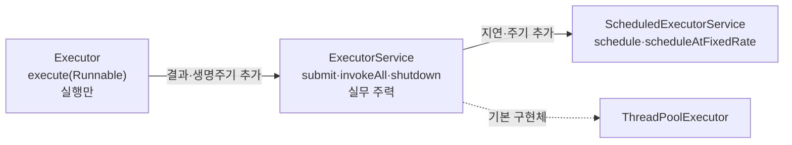
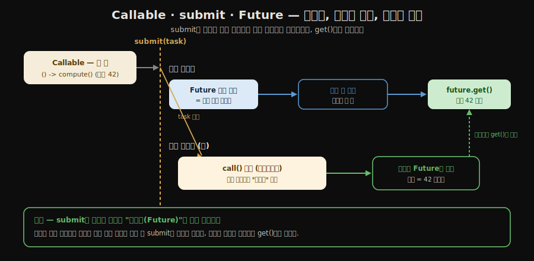
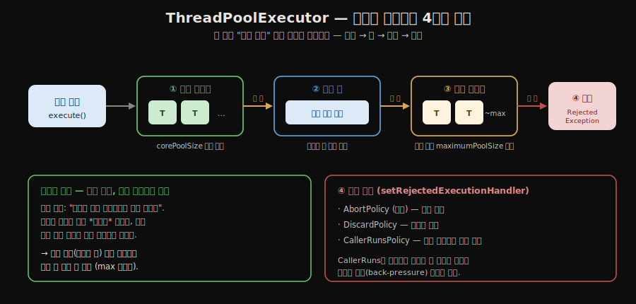

# Executor 프레임워크
---
> 스레드를 직접 생성하는 코드는 실무에서 거의 쓰지 않습니다. Executor 프레임워크가 스레드 생성, 재사용, 종료를 모두 관리해 주기 때문입니다. 
>
> 본 노트를 한 줄로 압축하면 — **Executor의 본질은 *작업(Runnable/Callable)과 실행 자원(스레드 풀)의 분리*이며, `Future`·`CompletableFuture`가 그 사이에 *비동기 결과 흐름*을 표현합니다**. JDK 21의 가상 스레드는 *풀이라는 추상 자체*를 다시 봅니다.


## 스레드 직접 사용의 세 가지 문제

> `new Thread().start()`를 매 작업마다 부르면 세 문제가 따라옵니다.
>
> 1. 생성 비용(성능)
> 2. 무제한 생성으로 인한 서버 다운(관리)
> 3. 반환값·예외를 받을 수 없는 불편함

`new Thread(task).start()`처럼 스레드를 직접 생성하면 세 가지 문제가 따릅니다.

- **성능**: 스레드 생성은 커널 수준 작업이라 CPU와 메모리를 소비합니다. 스레드마다 독립된 호출 스택이 필요하고, 운영체제가 스케줄링 대상에 추가해야 합니다.
- **관리**: CPU와 메모리는 한정되어 있으므로 스레드를 무한히 생성할 수 없습니다. 트래픽이 폭증했을 때 스레드 수를 제한하지 않으면 서버가 다운됩니다.
- **불편함**: `Runnable.run()`은 반환값이 없고 체크 예외를 던질 수 없어, 결과를 받으려면 별도의 공유 변수를 써야 합니다.

**Executor 프레임워크**는 이 세 문제를 모두 해결합니다. `java.util.concurrent` 패키지에 포함되어 있으며, 스레드 풀을 통해 스레드를 재사용하고 작업 큐로 과부하를 제어하며 `Future`로 결과를 반환합니다.


## Executor / ExecutorService 인터페이스 계층

> `Executor`(실행만) → `ExecutorService`(결과·생명주기) → `ScheduledExecutorService`(지연·주기)로 갈수록 기능이 쌓이며, 기본 구현체는 `ThreadPoolExecutor`입니다.

인터페이스 계층은 세 단계로 이루어집니다.

- **`Executor`**: 가장 단순한 인터페이스로 `execute(Runnable)` 메서드 하나만 정의합니다. 작업을 어떤 스레드에서 실행할지 분리하는 것이 목적입니다.
- **`ExecutorService`**: `Executor`를 확장해 `submit()`, `invokeAll()`, `invokeAny()`, 생명주기 메서드를 추가합니다. 실무에서 주로 사용하는 인터페이스입니다.
- **`ScheduledExecutorService`**: `ExecutorService`를 확장해 지연 실행(`schedule()`)과 주기적 실행(`scheduleAtFixedRate()`)을 지원합니다.



세 인터페이스가 어떻게 기능을 쌓아 가는지 코드로 보면 다음과 같습니다.

```java
// ① Executor — 실행만. "이 작업을 어떤 스레드에선가 돌려라"
Executor executor = Executors.newFixedThreadPool(2);
executor.execute(() -> System.out.println("실행만 하면 끝"));

// ② ExecutorService — 결과(Future)·생명주기(shutdown) 추가
ExecutorService es = Executors.newFixedThreadPool(2);
Future<Integer> future = es.submit(() -> 42); // 결과를 받을 수 있음
es.shutdown();                                // 생명주기 제어

// ③ ScheduledExecutorService — 지연·주기 실행 추가
ScheduledExecutorService ses = Executors.newScheduledThreadPool(2);
ses.schedule(() -> System.out.println("3초 뒤 1회"), 3, TimeUnit.SECONDS);
ses.scheduleAtFixedRate(() -> System.out.println("1초마다 반복"), 0, 1, TimeUnit.SECONDS);
```

- 기본 구현체는 `ThreadPoolExecutor`이며, `Executors` 팩토리 클래스가 다양한 설정의 인스턴스를 편리하게 생성해 줍니다.


## 스레드 풀 종류 비교

> `Executors` 팩토리는 코어/최대 스레드 수와 큐 종류 조합으로 용도별 풀을 제공합니다 — CPU 작업엔 `Fixed`, 짧고 많은 작업엔 `Cached`, I/O엔 `VirtualThreadPerTask`.

| 종류 | 코어 스레드 | 최대 스레드 | 큐 | 주요 용도 |
|------|------------|------------|-----|----------|
| `newFixedThreadPool(n)` | n | n | 무제한 LinkedBlockingQueue | CPU 집약 작업, 예측 가능한 부하 |
| `newCachedThreadPool()` | 0 | Integer.MAX_VALUE | SynchronousQueue | 짧고 많은 비동기 작업 |
| `newScheduledThreadPool(n)` | n | Integer.MAX_VALUE | DelayedWorkQueue | 주기적·지연 실행 |
| `newSingleThreadExecutor()` | 1 | 1 | 무제한 LinkedBlockingQueue | 순서 보장이 필요한 직렬 처리 |
| `newWorkStealingPool()` | - | 가용 CPU 수 | - | 재귀적·포크-조인 작업 |
| `newVirtualThreadPerTaskExecutor()` | - | 무제한 가상 스레드 | - | I/O 집약 작업 (Java 21+) |

- `newCachedThreadPool()`은 내부적으로 `SynchronousQueue`를 사용합니다. 
- 이 큐는 저장 공간이 없고 생산자와 소비자가 직접 핸드오프(handoff)하므로, 유휴 스레드가 없으면 즉시 새 스레드를 생성합니다. 60초간 작업이 없으면 초과 스레드를 회수합니다.


## submit() vs execute()

> `execute`는 반환값이 없고 예외가 조용히 사라지지만, `submit`은 `Future`를 돌려주어 결과를 받고 예외를 `get()`에서 잡을 수 있습니다 — 결과·예외가 필요하면 `submit`입니다.

`execute(Runnable)`은 `Executor` 인터페이스에 정의된 메서드로 반환값이 없습니다. 작업 중 예외가 발생하면 해당 스레드가 종료되며 예외가 외부로 전파되지 않습니다.

`submit(Callable<T>)`은 `ExecutorService`가 제공하며 `Future<T>`를 즉시 반환합니다. 예외는 `Future.get()` 호출 시 `ExecutionException`으로 감싸져 전달됩니다. 결과가 필요하거나 예외를 호출자에서 처리해야 할 때는 반드시 `submit()`을 사용해야 합니다.

차이의 핵심은 **예외가 *어디로 가느냐*입니다.** `execute`로 낸 작업에서 예외가 터지면 갈 곳이 없어 **조용히 삼켜집니다(silently swallowed)** — 워커 스레드만 죽고 호출자는 실패 사실조차 모릅니다(기본 핸들러가 stderr에 찍을 뿐). 반면 `submit`은 그 예외를 `Future` 안에 **보관해 두었다가**, 호출자가 `get()`을 부르는 순간 `ExecutionException`으로 감싸 던집니다(원래 예외는 `getCause()`로 꺼냅니다). 결과를 안 보더라도 **예외를 놓치지 않으려고** `submit`을 쓰는 이유가 이것이며, `execute`는 실패해도 무방한 fire-and-forget 작업에만 적합합니다.

```java
// execute — 예외가 삼켜짐 (호출자는 모름)
es.execute(() -> { throw new RuntimeException("터짐!"); });

// submit — 예외가 Future에 보관됐다가 get()에서 드러남
Future<?> f = es.submit(() -> { throw new RuntimeException("터짐!"); });
try {
    f.get();                       // ← 여기서 ExecutionException
} catch (ExecutionException e) {
    Throwable real = e.getCause(); // 원래 RuntimeException
}
```

```java
// 스레드풀 생성
ExecutorService es = Executors.newFixedThreadPool(2);

// execute: 반환값 없음, 예외 전파 안 됨
es.execute(() -> System.out.println("작업 실행"));

// submit: Future 반환, 예외는 get()에서 처리
Future<Integer> future = es.submit(() -> {
    Thread.sleep(1000);
    return 42;
});

Integer result = future.get(); // 완료까지 블로킹
```

- `Future`를 `submit()` 직후에 즉시 `get()`으로 블로킹하면 단일 스레드와 다를 바 없습니다. 
- 여러 작업을 먼저 모두 `submit()`하고 나서 `get()`을 호출해야 병렬 실행의 효과를 얻습니다.


## Future와 Callable

> `Callable`은 `Runnable`과 달리 결과를 반환하고 체크 예외를 던질 수 있으며, `Future`는 그 결과를 나중에 받는 핸들 — `submit()` 즉시 반환되고 `get()`에서 완료를 기다립니다.

###  Callable

**`Callable<V>`**은 `Runnable`의 한계를 보완한 인터페이스입니다. `call()` 메서드는 결과를 반환하고 체크 예외를 던질 수 있습니다.

두 인터페이스의 정의를 나란히 보면 차이가 분명합니다.

```java
// Runnable — run()은 반환값 void, throws 절 없음
@FunctionalInterface
public interface Runnable {
    void run();
}

// Callable — call()은 결과(V)를 반환하고 Exception(체크 예외)을 던질 수 있음
@FunctionalInterface
public interface Callable<V> {
    V call() throws Exception;
}
```

그래서 실제 사용은 다음처럼 갈립니다.

```java
// Runnable — 반환값 없음, 체크 예외 못 던짐
Runnable r = () -> System.out.println("결과 없음");

// Callable — 결과 반환 + 체크 예외 가능
Callable<Integer> c = () -> {
    Thread.sleep(100);   // InterruptedException(체크 예외)을 그대로 던질 수 있음
    return 42;           // Runnable과 달리 값을 반환
};
```

### Future

**`Future<V>`**는 아직 완료되지 않은 비동기 작업의 결과를 나타내는 핸들입니다. `submit()` 호출 즉시 반환되므로 호출 스레드가 블로킹되지 않습니다. 결과가 필요한 시점에 `get()`을 호출하면 작업이 완료될 때까지 대기합니다.

인터페이스 정의는 다음과 같습니다 — 결과 수령(`get`), 취소(`cancel`), 상태 조회(`isDone`)가 핵심입니다.

```java
public interface Future<V> {
    V get() throws InterruptedException, ExecutionException;          // 완료까지 대기 후 결과
    V get(long timeout, TimeUnit unit) throws ..., TimeoutException;  // 타임아웃 지정
    boolean cancel(boolean mayInterruptIfRunning);                   // 작업 취소
    boolean isCancelled();                                          // 취소 여부
    boolean isDone();                                              // 완료(정상/예외/취소) 여부
}
```

```java
// 스레드풀 생성
ExecutorService es = Executors.newFixedThreadPool(2);

// submit()은 작업을 맡기고 Future를 '즉시' 돌려준다 (블로킹 X)
Future<Integer> future = es.submit(c);   // 위 Callable c를 제출

// 이 사이에 호출 스레드는 다른 일을 할 수 있다
System.out.println("작업은 백그라운드에서 진행 중");

// 결과가 필요한 순간에만 get() — 그때 완료까지 대기
Integer result = future.get();           // 42 (완료될 때까지 블로킹)
boolean done = future.isDone();          // true
```

`Callable`과 `Future`를 함께 쓰면, 여러 작업을 *먼저 모두 제출*해 동시에 돌리고 *나중에 결과만 모으는* 패턴이 가능합니다.

```java
ExecutorService es = Executors.newFixedThreadPool(2);

Future<Integer> f1 = es.submit(() -> computeSum(1, 50));   // 즉시 반환
Future<Integer> f2 = es.submit(() -> computeSum(51, 100)); // 즉시 반환

// f1, f2 동시에 실행 중
Integer sum1 = f1.get(); // 완료까지 대기
Integer sum2 = f2.get(); // 이미 완료되어 있으면 즉시 반환
System.out.println(sum1 + sum2); // 5050
```

여기서 병렬 효과의 조건은 **"모든 `submit`을 먼저, `get`은 나중에"**입니다. `submit`마다 곧바로 `get`을 붙이면, 코어가 아무리 많아도 한 번에 하나씩만 도는 *직렬화*가 됩니다 — `get`이 블로킹이라 다음 `submit`을 막기 때문이며, 코어 수와 무관합니다(8코어여도 직렬).

```java
// ❌ 직렬 — submit마다 바로 get (각 작업 3초면 총 6초)
Integer a = es.submit(task1).get();   // task1 끝날 때까지 멈춤 → 그 뒤에야
Integer b = es.submit(task2).get();   // task2 출발 (동시에 못 돎)

// ✅ 병렬 — 먼저 다 submit, 그 다음 get (총 3초 = max)
Future<Integer> f1 = es.submit(task1); // 즉시 반환 → task1 출발
Future<Integer> f2 = es.submit(task2); // 즉시 반환 → task2도 출발 (둘이 동시에)
Integer a = f1.get();                  // 이제 결과를 모은다
Integer b = f2.get();
```

`submit`은 출발 신호(즉시 반환), `get`은 도착 확인(블로킹)입니다. 출발을 다 시켜놓고 도착을 기다려야 동시에 달립니다.

세 조각이 어떻게 맞물리는지 한 흐름으로 보면 — `submit`을 경계로 **제출 스레드**와 **워커 스레드**가 갈라집니다. 

- `submit`은 결과가 아니라 *영수증(`Future`)*을 즉시 돌려주므로 제출 스레드는 블로킹 없이 다른 일을 계속하고, 워커 스레드는 백그라운드에서 `call()`을 실행해 결과를 `Future`에 채웁니다. 
- 제출 스레드가 `get()`을 부르면 그제야 두 흐름이 합류합니다(워커가 끝났으면 즉시, 아니면 완료까지 대기).



`Future`의 주요 메서드는 다음과 같습니다.

- `get()`: 완료 대기 후 결과 반환. `ExecutionException`, `InterruptedException` 선언 필요
- `get(long timeout, TimeUnit unit)`: 타임아웃 지정. `TimeoutException` 추가
- `cancel(boolean mayInterruptIfRunning)`: 작업 취소. `true`면 실행 중인 작업을 인터럽트
- `isDone()`: 완료(정상/예외/취소) 여부 확인
- `state()`: Java 19+, `RUNNING`/`SUCCESS`/`FAILED`/`CANCELLED` 반환


## 우아한 종료 (Graceful Shutdown)

> `shutdown()`은 새 작업만 막고 기존 작업은 마저 끝내며, 논블로킹이라 `awaitTermination()`으로 실제 완료를 기다리고 타임아웃 시 `shutdownNow()`로 강제 종료합니다.

서버를 재시작할 때 처리 중인 요청을 갑자기 끊으면 데이터 불일치가 발생할 수 있습니다. 이미 시작된 작업은 마저 완료하고 새 작업만 받지 않는 방식이 **graceful shutdown**입니다.

```java
ExecutorService es = Executors.newFixedThreadPool(4);

// 새 작업 수신 중단, 기존 작업은 완료
es.shutdown();

// 최대 10초 대기
if (!es.awaitTermination(10, TimeUnit.SECONDS)) {
    // 타임아웃: 강제 종료
    es.shutdownNow(); // 실행 중인 스레드에 인터럽트 발생
}
```

- `shutdown()`은 논블로킹이므로 `awaitTermination()`을 함께 사용해야 실제 완료를 기다릴 수 있습니다. 
- `close()`(Java 19+)는 `shutdown()` 후 무기한 대기하다가 인터럽트를 받으면 `shutdownNow()`를 호출하는 편의 메서드입니다. try-with-resources와 함께 사용할 수 있습니다.


## ThreadPoolExecutor 커스텀 설정

> 작업이 들어오면 **코어 스레드 → 큐 → 초과 스레드 → 거절**의 네 단계를 순서대로 거칩니다. 이 순서를 알아야 큐 크기와 최대 스레드를 어떻게 잡을지 판단할 수 있습니다.

`Executors` 팩토리 메서드가 제공하지 않는 세밀한 설정이 필요하면 `ThreadPoolExecutor`를 직접 생성합니다.

```java
ThreadPoolExecutor es = new ThreadPoolExecutor(
        100                          // corePoolSize: 기본 스레드 수
        , 200                        // maximumPoolSize: 최대 스레드 수
        , 60, TimeUnit.SECONDS       // keepAliveTime: 초과 스레드 유지 시간
        , new ArrayBlockingQueue<>(1000) // 작업 대기 큐
);
```

스레드 풀 작업 처리 흐름은 네 단계입니다.

- 작업 요청 시 코어 스레드 수까지 스레드를 생성합니다.
- 코어 스레드가 모두 사용 중이면 큐에 작업을 쌓습니다.
- 큐도 가득 차면 최대 스레드 수까지 임시(초과) 스레드를 생성합니다.
- 최대 스레드도 모두 사용 중이면 `RejectedExecutionException`을 던집니다.



거절 정책은 `setRejectedExecutionHandler()`로 교체할 수 있습니다. `AbortPolicy`(기본, 예외 발생), `DiscardPolicy`(무시), `CallerRunsPolicy`(호출 스레드가 직접 실행) 중 상황에 맞게 선택합니다.


## Java 21: 가상 스레드

> 가상 스레드는 I/O 대기 중 캐리어(OS) 스레드를 반납하는 경량 스레드라 수십만 개를 띄워도 OS 자원을 적게 쓰며, 풀 없이 작업마다 하나씩 만드는 I/O 집약 작업에 적합합니다.

Java 21에서 정식 출시된 **가상 스레드(Virtual Thread)**는 플랫폼 스레드와 달리 JVM이 관리하는 경량 스레드입니다. I/O 대기 중에는 캐리어 스레드(OS 스레드)를 반납하고, I/O가 완료되면 다시 할당받습니다. 수십만 개를 동시에 실행해도 OS 자원을 과도하게 소비하지 않습니다.

```java
// 작업마다 가상 스레드 생성 (Java 21+)
ExecutorService es = Executors.newVirtualThreadPerTaskExecutor();

Future<String> future = es.submit(() -> {
    // I/O 블로킹 → 캐리어 스레드 반납 → 다른 가상 스레드 실행
    return fetchFromDatabase();
});
```

- 가상 스레드는 CPU 집약 작업보다 I/O 집약 작업에 적합합니다. 기존 `ThreadPoolExecutor` 기반 코드를 크게 바꾸지 않고 `newVirtualThreadPerTaskExecutor()`로 교체하는 것만으로 I/O 처리량을 크게 향상시킬 수 있습니다.


## 관련 문서

- [`./03-01.스레드 생성과 생명주기.md`](./03-01.스레드%20생성과%20생명주기.md) — Executor가 *대체*하는 직접 스레드 생성 모델
- [`./03-03.생산자-소비자 패턴.md`](./03-03.생산자-소비자%20패턴.md) — `ThreadPoolExecutor` 내부의 작업 큐와 같은 추상
- [`./01-05.Virtual Threads 기초.md`](./01-05.Virtual%20Threads%20기초.md) — `newVirtualThreadPerTaskExecutor()`의 동작 원리
- [`./01-06.Structured Concurrency.md`](./01-06.Structured%20Concurrency.md) — Executor를 *구조화된 범위*로 확장한 JDK 21 신기능
- [`../README`](../README.md) — 05_JVM 학습 인덱스
