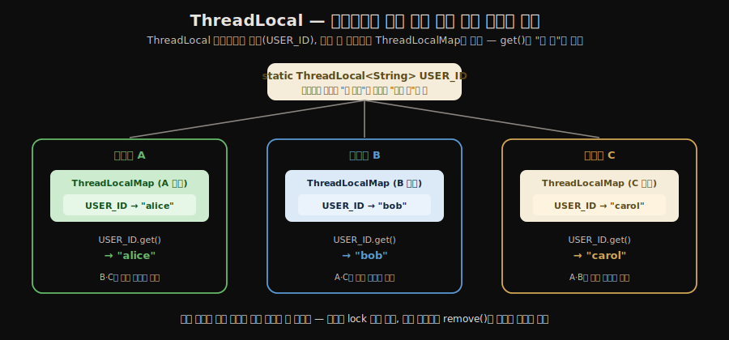
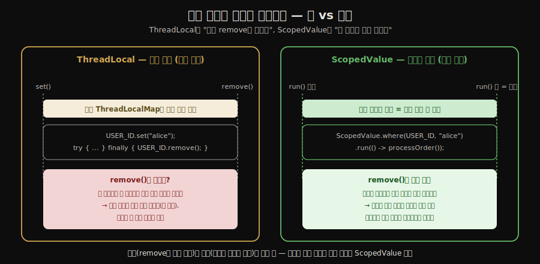
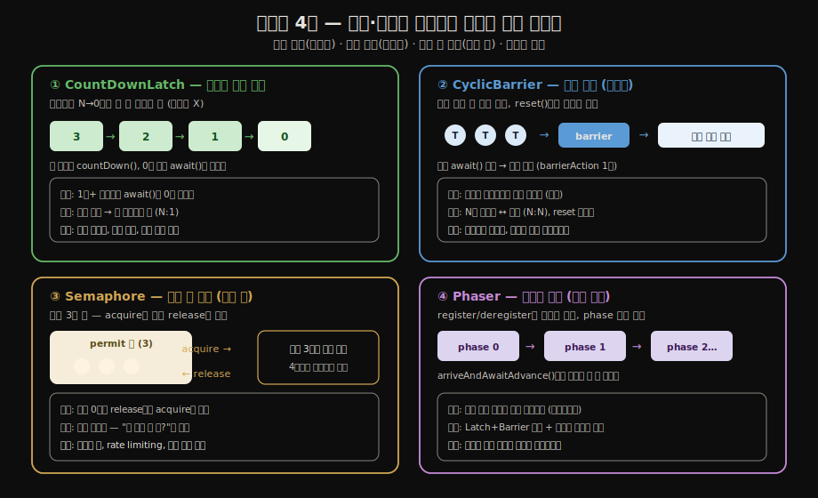

# 동시성 유틸리티
---
> 동시성 문제는 스레드 간 공유 상태에서 비롯됩니다. ThreadLocal은 상태를 스레드별로 격리하고, 동기화 도구들은 스레드 간 협력 시점을 정밀하게 제어합니다.
>
> 본 노트를 한 줄로 압축하면 — **동시성 버그를 줄이는 두 갈래 길은 *공유를 없애기*(`ThreadLocal`·불변 객체)와 *공유의 시점을 좁히기*(`CountDownLatch`·`Semaphore`·`Phaser`)이며, JDK 21 `ScopedValue`가 그 첫 갈래의 더 안전한 대안**으로 등장했습니다.


## 1. ThreadLocal — 공유를 없애는 길 (요약)

> `ThreadLocal`은 변수를 스레드마다 따로 두어 공유 자체를 없애므로 동기화 없이 안전합니다. 동작 원리와 누수 함정은 정독본 `02-02`§5가 SSOT이고, 본 노트는 그 변형(`InheritableThreadLocal`·`ScopedValue`)과 협력 시점을 제어하는 동기화 유틸리티를 다룹니다.

`ThreadLocal<T>`은 변수를 스레드마다 따로 두어 공유 자체를 없앱니다. `Thread` 내부의 `ThreadLocalMap`에 `(ThreadLocal 인스턴스 → 값)`을 저장하고, `get()`은 현재 스레드 맵에서만 조회해 다른 스레드와 섞이지 않습니다. 그래서 동기화 없이 안전합니다.

스레드마다 자기만의 `ThreadLocalMap`을 들고 있어 *애초에 공유가 일어나지 않는* 구조를, 그림으로 보면 다음과 같습니다.



`ThreadLocal`의 세 가지 기둥 — 동작 원리·누수 함정·정리 철칙 — 은 본 노트가 다시 풀지 않고 정독본에 맡깁니다.

1. **무공유로 안전한 까닭**: 위 그림처럼 값이 스레드 안에 갇혀 애초에 경합이 없습니다. 이는 *공유를 유지한 채* 안전을 확보하는 반대 접근(원자 연산·동시성 컬렉션)과 짝을 이루며, 그 반대편은 [`03-02.원자 연산과 동시성 컬렉션`](./03-02.원자%20연산과%20동시성%20컬렉션.md) §의 CAS·`ConcurrentHashMap`이 SSOT입니다.
2. **값 누출 + 메모리 누수**: 스레드 풀에서 `remove()`를 빠뜨리면 풀 스레드가 안 죽으므로 값이 다음 작업으로 새거나 참조가 안 풀려 누수가 됩니다.
3. **`try-finally` 정리 철칙**: 1·2의 해법으로, 동작 원리와 함께 정독본 [`02-02.스레드 안전성 구현 — 동기화와 락`](./02-02.스레드%20안전성%20구현%20—%20동기화와%20락.md) §5가 SSOT입니다.

실무 쓰임은 Spring `SecurityContextHolder`(인증)·트랜잭션 동기화 매니저(`@Transactional` 커넥션)·MDC 로깅이 대표적입니다.

이 노트는 그 위에서 **§2 `ThreadLocal`의 변형(`InheritableThreadLocal`)**, **§3 그 더 안전한 대안(`ScopedValue`)**, 그리고 **§4~§7 스레드 협력을 시점으로 제어하는 동시성 유틸리티(래치·배리어·세마포어·Phaser)** 를 차례로 다룹니다. 

- 동시성 버그를 줄이는 두 갈래 — *공유를 없애기*(§1~§3) 와 *공유 시점을 좁히기*(§4~§7) — 의 도구 모음입니다.


## 2. InheritableThreadLocal

> `InheritableThreadLocal`은 부모 스레드의 값을 `new Thread()` 생성 시점에 자식 스레드로 복사해 컨텍스트를 물려줍니다.
>
> 단 스레드 풀에서는 풀 초기화 이후의 변경이 반영되지 않는 함정이 있습니다.

`InheritableThreadLocal<T>`은 부모 스레드의 값을 자식 스레드가 상속받습니다. 부모 스레드에서 설정한 값이 `new Thread()` 생성 시점에 자식 스레드로 복사됩니다. 요청 ID나 사용자 컨텍스트를 하위 작업 스레드에 전달할 때 유용합니다.

여기서 함정의 뿌리는 *복사 시점이 스레드 생성 시점에 고정된다*는 데 있습니다.

1. **직접 생성(`new Thread()`)** 이면 그 순간의 부모 값이 자식으로 복사되므로 기대대로 동작합니다 — 스레드가 어떻게 만들어지고 도는지는 [`03-01.스레드 생성과 생명주기`](./03-01.스레드%20생성과%20생명주기.md) §1이 SSOT입니다.
2. **스레드 풀** 에서는 스레드가 풀 *초기화 시점*에 미리 만들어지므로, 이후 부모가 바꾼 값은 반영되지 못합니다. 풀이 스레드를 *재사용*하는 성질(같은 §의 "왜 스레드 풀인가") 때문에 생기는 부작용입니다.

그래서 `InheritableThreadLocal`도 `remove()`로 정리해야 한다는 §1.2~1.3의 원칙은 동일하게 적용됩니다.


## 3. Java 21 ScopedValue

> `ScopedValue`는 가상 스레드 환경의 `ThreadLocal` 대안입니다. 불변이며 `where(...).run(action)` 블록 범위에서만 유효하고 블록을 벗어나면 자동 소멸하므로, `remove()` 누락으로 인한 누수가 구조적으로 사라집니다.

**`ScopedValue`**는 Java 21에서 정식 출시된 `ThreadLocal` 대안입니다. 등장 배경은 가상 스레드입니다.

수십만 개의 가상 스레드 각각이 §1의 `ThreadLocalMap`을 보유하면 메모리 압박이 커지기 때문입니다. 가상 스레드가 왜 그렇게 많이 떠도 가벼운지는 [`01-05.Virtual Threads 기초`](./01-05.Virtual%20Threads%20기초.md)가 SSOT이고, `ScopedValue`는 그 환경에서 §1의 누수 문제를 구조적으로 해결합니다.

`ScopedValue`는 불변(immutable)이며, `ScopedValue.where(key, value).run(action)` 블록 안에서만 값이 유효합니다. 블록을 벗어나면 자동으로 소멸하므로 `remove()` 호출이 필요 없습니다.

```java
// Java 21+
private static final ScopedValue<String> USER_ID = ScopedValue.newInstance();

public void handleRequest(String userId) {
    ScopedValue.where(USER_ID, userId).run(() -> {
        processOrder();  // 이 블록 안에서만 USER_ID 접근 가능
    });
    // 블록 종료 후 자동 소멸
}

private void processOrder() {
    String id = USER_ID.get(); // 현재 스코프의 값 조회
}
```

§1의 `ThreadLocal`이 *맵에 묶여 명시적 `remove()`로만 풀리는* 데 비해, `ScopedValue`는 *블록 범위에 묶여 스택이 풀리듯 자동으로 사라지는* 차이를, 두 수명을 나란히 두면 다음과 같습니다.



이 *블록 범위* 개념은 우연이 아닙니다 — 작업의 생명주기를 코드 블록 구조에 묶는 [`01-06.Structured Concurrency`](./01-06.Structured%20Concurrency.md)와 같은 설계 철학에서 나왔고, 그래서 둘은 JDK 21에 함께 들어왔습니다. 가상 스레드 기반의 신규 코드에서는 `ThreadLocal`보다 `ScopedValue`를 우선 고려하는 것이 좋습니다.

여기서부터(§4~§7)는 두 번째 갈래 — 공유를 없애는 대신 **공유의 시점을 좁히는** 동기화 유틸리티입니다. 네 도구는 모두 *언제 모이고 언제 풀리는가*를 다르게 정의합니다.


## 4. CountDownLatch

> `CountDownLatch`는 카운트가 0이 될 때까지 `await()`가 대기하는 *일회성* 신호입니다. 각 작업이 `countDown()`으로 카운트를 줄이고, 0이 되면 대기 스레드가 깨어나며 — 한 번 0이 되면 재사용할 수 없습니다.

**`CountDownLatch`**는 하나 이상의 스레드가 다른 스레드들의 작업 완료를 기다릴 때 사용합니다. 초기 카운트를 지정하고, 각 스레드가 작업을 마치면 `countDown()`으로 카운트를 줄입니다. 카운트가 0이 되면 `await()`에서 대기 중인 스레드가 깨어납니다.

```java
CountDownLatch latch = new CountDownLatch(3); // 3개 작업 대기

ExecutorService es = Executors.newFixedThreadPool(3);
for (int i = 0; i < 3; i++) {
    es.submit(() -> {
        try {
            loadCache();         // 캐시 로드
        } finally {
            latch.countDown();   // 완료 신호
        }
    });
}

latch.await(); // 3개 모두 완료될 때까지 대기
startServer(); // 이후 서버 시작
```

카운트가 0이 되면 재사용할 수 없다는 점이 §5 `CyclicBarrier`와의 차이입니다. 위 예시처럼 `ExecutorService`로 작업을 풀에 맡기고 래치로 완료를 기다리는 조합이 흔한데, 그 풀의 종류·종료 방식은 [`04-01.Executor 프레임워크`](./04-01.Executor%20프레임워크.md)가 SSOT입니다. 서버 초기화, 병렬 테스트의 준비 완료 신호, 외부 서비스 응답 취합 등에 적합합니다.


## 5. CyclicBarrier

> `CyclicBarrier`는 정해진 수의 스레드가 *모두* 도달해야 함께 다음 단계로 출발하는 만남의 지점입니다. `reset()`으로 재사용할 수 있어 *Cyclic*이며, 라운드마다 전원을 모아 동시에 출발시키는 데 적합합니다.

**`CyclicBarrier`**는 정해진 수의 스레드가 모두 특정 지점에 도달해야 함께 다음 단계로 진행하는 도구입니다. `await()`를 호출한 스레드는 지정된 수만큼 모두 `await()`에 도달할 때까지 대기합니다. 모든 스레드가 도달하면 동시에 해제됩니다.

```java
CyclicBarrier barrier = new CyclicBarrier(3, () ->
    System.out.println("모든 스레드 준비 완료, 다음 단계 시작")
);

Runnable worker = () -> {
    prepareData();
    barrier.await(); // 다른 스레드 대기
    processData();   // 모두 준비 후 동시 시작
};
```

§4 `CountDownLatch`와 달리 `reset()`으로 재사용할 수 있어 *Cyclic*이라는 이름이 붙었습니다. 둘의 차이를 한 축으로 정리하면 — 래치는 *여러 작업 → 한 기다리는 쪽*(N:1, 일회성)이고, 배리어는 *N개 스레드가 서로*(N:N, 재사용)입니다. 시뮬레이션의 라운드별 동기화, 분산 정렬 알고리즘의 단계 동기화 등에 쓰입니다.


## 6. Semaphore

> `Semaphore`는 허가(permit) 개수만큼만 동시 접근을 허용하는 도구입니다. `acquire()`로 허가를 얻고 `release()`로 반납하며, 허가가 0이면 반납될 때까지 대기 — 커넥션 풀·rate limiting처럼 *동시 실행 수의 상한*이 필요할 때 씁니다.

**`Semaphore`**는 동시에 접근 가능한 스레드 수를 제한하는 도구입니다. 내부 카운터(허가, permit)를 관리하며 `acquire()`로 허가를 획득하고 `release()`로 반납합니다. 카운터가 0이면 `acquire()`를 호출한 스레드는 허가가 반납될 때까지 대기합니다.

```java
Semaphore semaphore = new Semaphore(3); // 동시 접근 최대 3개

public void accessDatabase() throws InterruptedException {
    semaphore.acquire();
    try {
        query(); // 최대 3개 스레드만 동시 실행
    } finally {
        semaphore.release(); // 반드시 finally에서 반납
    }
}
```

DB 커넥션 풀 크기 제한, API 호출 속도 제한(rate limiting), 파일 시스템 동시 접근 제어 등에 유용합니다. `acquire(int permits)`로 여러 허가를 한 번에 획득할 수도 있습니다.


## 7. Phaser

> `Phaser`는 `CountDownLatch`와 `CyclicBarrier`를 합친 유연한 도구입니다. `register()`·`arriveAndDeregister()`로 참여자를 런타임에 늘리고 줄일 수 있고, 단계(phase)가 자동 증가해 *다단계 작업을 반복 동기화*합니다.

**`Phaser`**는 §4 `CountDownLatch`와 §5 `CyclicBarrier`를 결합한 유연한 동기화 도구입니다. 두 도구에서 한 가지씩 빌려 옵니다 — §4에서 *카운트 기반 완료 신호*를, §5에서 *전원 도달 후 재사용*을 가져오되, 여기에 *참여자 동적 증감*과 *단계 자동 증가*를 더합니다. 동적으로 참여자를 등록하거나 해제할 수 있고, 단계(phase)가 자동으로 증가해 여러 단계의 작업을 반복적으로 동기화할 수 있습니다.

```java
Phaser phaser = new Phaser(1); // 메인 스레드 등록

for (int i = 0; i < 3; i++) {
    phaser.register();           // 동적으로 참여자 추가
    final int taskId = i;
    new Thread(() -> {
        phaseOne(taskId);
        phaser.arriveAndAwaitAdvance(); // 1단계 완료 대기
        phaseTwo(taskId);
        phaser.arriveAndDeregister();   // 참여 해제
    }).start();
}

phaser.arriveAndAwaitAdvance(); // 메인 스레드도 1단계 대기
System.out.println("모든 스레드 1단계 완료");
```

참여자 수가 런타임에 결정되거나 단계별로 달라지는 파이프라인 처리에 적합합니다. 복잡하지만 `CountDownLatch`나 `CyclicBarrier`로 표현하기 어려운 시나리오를 깔끔하게 모델링할 수 있습니다.

네 동기화 도구가 *언제·어떻게* 스레드를 모으고 풀어 주는지 — 일회성 카운트다운, 재사용 가능한 만남, 허가 풀, 다단계 반복 — 을 한눈에 대비하면 다음과 같습니다.




## 8. 도구 선택 기준 요약

> 상태 격리는 `ThreadLocal`/`ScopedValue`(§1~§3), 협력 시점 제어는 완료 신호(`CountDownLatch`)·동시 출발(`CyclicBarrier`)·동시 수 제한(`Semaphore`)·다단계(`Phaser`)(§4~§7)로 갈립니다.

§1~§7을 한 표로 되짚으면, 상황에서 도구로 바로 내려갈 수 있습니다.

| 상황 | 적합한 도구 | 본문 |
|------|------------|------|
| 스레드별 독립 상태 저장 | `ThreadLocal` | §1 |
| 가상 스레드 환경의 컨텍스트 전파 | `ScopedValue` (Java 21+) | §3 |
| N개 작업 완료 후 진행 (일회성) | `CountDownLatch` | §4 |
| N개 스레드 동시 출발 (재사용) | `CyclicBarrier` | §5 |
| 동시 접근 수 제한 | `Semaphore` | §6 |
| 동적 참여자, 다단계 동기화 | `Phaser` | §7 |


## 관련 문서

- [`./02-02.스레드 안전성 구현 — 동기화와 락.md`](./02-02.스레드%20안전성%20구현%20—%20동기화와%20락.md) — `ThreadLocal`의 동작 원리·누수 함정·`try-finally` 정리 철칙의 SSOT (§1)
- [`./03-02.원자 연산과 동시성 컬렉션.md`](./03-02.원자%20연산과%20동시성%20컬렉션.md) — 공유를 *없애는* §1과 짝을 이루는, 공유를 *유지*하며 안전을 확보하는 반대 접근 (§1.1)
- [`./03-01.스레드 생성과 생명주기.md`](./03-01.스레드%20생성과%20생명주기.md) — `InheritableThreadLocal`의 복사 시점인 `new Thread()`와 풀 재사용 성질 (§2)
- [`./01-05.Virtual Threads 기초.md`](./01-05.Virtual%20Threads%20기초.md) — 수십만 가상 스레드에서 `ThreadLocal` 비용이 커지는 이유, `ScopedValue` 등장 배경 (§3)
- [`./01-06.Structured Concurrency.md`](./01-06.Structured%20Concurrency.md) — `ScopedValue`의 *블록 범위* 개념이 함께 나온 같은 설계 철학 (§3)
- [`./04-01.Executor 프레임워크.md`](./04-01.Executor%20프레임워크.md) — `CountDownLatch`와 흔히 짝지어 쓰는 스레드 풀의 SSOT (§4)
- [`./01-02.volatile·happens-before·원자성.md`](./01-02.volatile·happens-before·원자성.md) — `ThreadLocal`이 *우회*하는 가시성 문제의 뿌리
- [`../README`](../README.md) — 05_JVM 학습 인덱스
