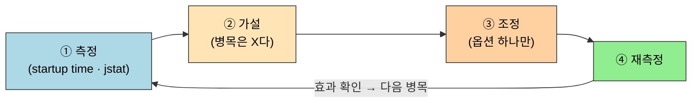

# 실전 — Eclipse IDE 튜닝
---
> §5.3~§5.4는 [02-01 사례 분석](02-01.최적화%20사례%20분석.md)의 접근을 *내가 매일 쓰는 IDE*에 직접 적용한다. 본 절을 한 줄로 압축하면 — **튜닝은 감으로 옵션을 바꾸는 게 아니라, 먼저 측정해 병목을 찾고(Eclipse 시작이 느린 건 클래스 로딩 17초 탓), 가설을 세워 옵션 하나를 바꾸고, 다시 측정해 효과를 확인하는 닫힌 사이클**이다. §5.4는 2부 전체(메모리 관리)를 마무리한다.

이 글을 읽고 나면 막연히 느린 프로그램을 *측정→가설→조정→재측정* 사이클로 튜닝하고, Eclipse 같은 자바 앱의 시작 병목을 [VisualVM](../ch04_troubleshooting/02-02.시각화%20문제%20해결%20도구.md)·`jstat -class`로 짚어 `eclipse.ini` 옵션으로 줄일 수 있다.


## 1. 실전의 목표 — 측정 없는 튜닝은 미신이다

> 튜닝의 첫 단추는 옵션이 아니라 *측정*이다. 어디가 느린지 모르고 바꾸는 옵션은 운에 맡기는 것이다.

이 개념은 [JMH 측정 방법론](../ch03_gc/01-02.Java%20성능%20—%20JMH와%20측정%20방법론.md)의 "추측하지 말고 측정하라"를 *애플리케이션 시작 시간*이라는 거시 지표로 확장한 것이다. 책은 저자가 매일 쓰는 Eclipse IDE를 대상으로 골랐다 — *내 손에 익은 느림*이라 개선 효과를 체감으로 검증할 수 있기 때문이다.

튜닝은 한 번의 결정이 아니라 *닫힌 사이클*이다. 한 바퀴 돌 때마다 측정값이 가설을 검증하거나 기각한다.




## 2. 현 상태 측정 — 병목은 어디인가

> §5.3.1~§5.3.2. 옵션을 건드리기 전에 *지금 무엇이 느린가*를 숫자로 잡는다. Eclipse 시작의 큰 비중은 클래스 로딩이었다.

먼저 [VisualVM](../ch04_troubleshooting/02-02.시각화%20문제%20해결%20도구.md)으로 Eclipse 시작 구간을 프로파일링한다. 책의 측정에서 시작 시간의 큰 비중이 *클래스 로딩 약 17초*였고, 컴파일·GC 시간이 뒤를 이었다. 어느 한 곳이 압도적이면 거기부터 손대는 게 비용 대비 효과가 가장 크다.

시작 시간을 *체감*이 아니라 *숫자*로 고정하려면 측정 도구가 필요하다. 책은 Eclipse 시작 완료 시점에 경과 시간을 찍는 작은 플러그인을 만들어 박는다.

```java
// 책 §5.3.2 발췌 — Eclipse 시작 완료 시각을 찍는 측정 플러그인
public class ShowStartupTime implements IStartup {
    @Override
    public void earlyStartup() {
        // 시작 완료 직후 경과 시간을 한 줄로 출력 — 튜닝 전후 비교 기준
        long startup = System.currentTimeMillis()
                       - getApplicationStartTime();
        System.out.println("Eclipse startup time: " + startup + "ms");
    }
}
```

이 플러그인을 박는 이유는, 튜닝 전후를 *같은 잣대*로 비교하려면 측정점이 고정돼야 하기 때문이다. "빨라진 것 같다"는 느낌은 가설을 검증하지 못한다. `eclipse.ini`의 현 시작 옵션(`-vmargs` 아래 `-Xmx`·`-XX:` 등)도 함께 기록해 *어떤 설정에서 나온 숫자인지*를 남긴다.


## 3. 클래스 로딩 시간 최적화

> §5.3.3. 병목이 클래스 로딩이면, 클래스 통계를 `jstat -class`로 확인하고 검증 단계를 줄이는 옵션으로 시작을 단축한다.

병목을 클래스 로딩으로 좁혔으니, [02-01 §3](../ch04_troubleshooting/02-01.기본%20문제%20해결%20도구%20—%20명령줄%20도구.md)의 `jstat -class`로 *로딩된 클래스 수·바이트·소요 시간*을 직접 본다.

```bash
# 클래스 로딩 통계 — Loaded(개수) / Bytes / Unloaded / Time(초)
jstat -class <pid>
# 출력 컬럼 형식 (책 사례에서 Time 이 약 10.46초로, 시작 시간의 큰 비중):
# Loaded   Bytes   Unloaded  Bytes   Time
#  ...      ...        0      0.0   10.46
```

클래스 로딩이 느린 한 원인은 *로딩 때마다 바이트코드 검증(verify)*을 거치기 때문이다. 신뢰할 수 있는 코드(내가 쓰는 IDE)라면 이 검증을 건너뛰어 시작을 줄일 수 있다.

```ini
# eclipse.ini 의 -vmargs 아래에 추가
-vmargs
-Xverify:none
-Xmx512m
```

`-Xverify:none`을 넣는 이유는 클래스 로딩 시 바이트코드 검증을 생략해 *로딩 시간을 직접 줄이기* 위함이다. 책의 사례에서 이 조정으로 시작 시간이 약 8770ms 수준까지 떨어졌다. 다만 검증 생략은 *손상되거나 악의적인 바이트코드*를 걸러내지 못하므로, 신뢰할 수 있는 로컬 IDE에만 쓴다 — 운영 서버처럼 외부 코드가 섞이는 환경에는 절대 켜지 않는다(현대 JDK에서 `-Xverify:none`은 폐기 예정 경고가 뜬다).


## 4. 5장 마무리와 2부 전체 회고

> §5.4. 5장은 2부 자동 메모리 관리의 마지막 장이다. 메모리 관리가 성능·안정성을 좌우한다는 것을 사례·실전으로 확인하고 3부로 넘어간다.

책의 §5.4는 2부 전체를 한 문단으로 닫는다. 메모리 관리와 가비지 컬렉션은 자바 가상 머신 아키텍처에서 성능·안정성을 가장 크게 좌우하는 요소이며, 2~5장은 그 *이론(런타임 데이터 영역·GC 알고리즘)·도구(jstat·VisualVM)·사례·실전*을 차례로 다뤘다.

2부를 학습 흐름으로 되짚으면 한 줄로 꿴다 — 2장이 *어디에 무엇이 사는가*를, 3장이 *언제 회수되는가*를, 4장이 *어떻게 들여다보는가*를, 5장이 *실제로 무엇이 터지고 어떻게 푸는가*를 맡는다.


[2장 메모리 영역](../ch02_memory-area/01-01.런타임%20데이터%20영역.md)·[3장 GC](../ch03_gc/02-02.가비지%20컬렉션%20알고리즘.md)·[4장 도구](../ch04_troubleshooting/)를 거쳐 5장에 닿았고, 이어지는 3부는 클래스 파일 구조와 가상 머신 실행 서브시스템으로 넘어간다.


## 5. 면접 대비 요약

> 튜닝을 *측정→가설→조정→재측정* 사이클로 말하고, 그 한 바퀴를 Eclipse 사례로 들 수 있으면 합격선이다.

### 한 줄 정의

성능 튜닝 실전이란 *추측이 아니라 측정으로 병목을 찾고, 옵션 하나를 바꿔 재측정해 효과를 검증하는 닫힌 사이클을 도는 것*이다.

### 핵심 포인트 3가지

1. 튜닝은 측정에서 시작한다. 측정점을 고정(시작 시간 플러그인)해야 전후를 같은 잣대로 비교할 수 있다.
2. 병목을 좁혔으면 그 영역 전용 도구로 깊이 본다. 클래스 로딩 병목은 `jstat -class`로 로딩 수·시간을 확인한다.
3. `-Xverify:none`은 클래스 로딩 검증을 생략해 시작을 줄이지만, *신뢰할 수 있는 로컬 환경에만* 쓴다. 운영 서버엔 보안상 금지다.

### 면접에서 받을 만한 질문

1. 자바 애플리케이션이 느리다는 보고를 받았다. 가장 먼저 무엇을 하는가?
2. Eclipse 시작이 느릴 때 병목이 클래스 로딩인지 어떻게 확인하는가?
3. `-Xverify:none`은 무엇을 빠르게 하고, 왜 운영에 쓰면 안 되는가?

> 위 3개 질문에 *먼저 스스로 답해 보고* 아래 §정답으로 내려간다. 자답 없이 먼저 읽으면 학습 효과가 0이다.


## 정답 (자답 후 펼치기)

> 위 §면접에서 받을 만한 질문 의 3개에 *먼저 자답한 뒤* 아래를 읽는다.

### 정답 1 — 느린 앱, 가장 먼저 할 일

옵션을 바꾸기 전에 *측정*한다. VisualVM·프로파일러로 어느 구간(클래스 로딩·GC·특정 메서드)이 시간을 먹는지 숫자로 잡는다. 병목을 모르고 옵션을 바꾸면 효과를 검증할 수 없고, 운에 맡기는 것이다.

### 정답 2 — 클래스 로딩 병목 확인

`jstat -class <pid>`로 로딩된 클래스 수(Loaded)·바이트·누적 시간(Time)을 본다. Time이 전체 시작 시간의 큰 비중이면 클래스 로딩이 병목이다. VisualVM의 프로파일 그래프로도 로딩 구간 비중을 시각적으로 확인할 수 있다.

### 정답 3 — `-Xverify:none`의 효과와 위험

클래스 로딩 시 *바이트코드 검증*을 생략해 로딩 시간을 줄인다. 하지만 검증은 손상되거나 악의적인 바이트코드를 걸러내는 안전장치라, 외부 코드가 섞이는 운영 환경에서 끄면 보안 위험이 생긴다. 신뢰할 수 있는 로컬 IDE에만 쓴다.


## 관련 문서

> 실전 튜닝은 사례 분석의 접근을 직접 돌려 보는 것이고, 측정 도구는 4장에서, 측정 철학은 3장 JMH에서 온다.

- [02-01. 최적화 사례 분석](02-01.최적화%20사례%20분석.md) — 본 실전이 적용하는 사례 접근(어느 메모리가 마르는가)의 짝
- [02-02. 시각화 문제 해결 도구](../ch04_troubleshooting/02-02.시각화%20문제%20해결%20도구.md) § "VisualVM" — 시작 병목을 프로파일링하는 도구
- [01-02. Java 성능 — JMH와 측정 방법론](../ch03_gc/01-02.Java%20성능%20—%20JMH와%20측정%20방법론.md) — "추측하지 말고 측정하라" 튜닝 사이클의 측정 철학
