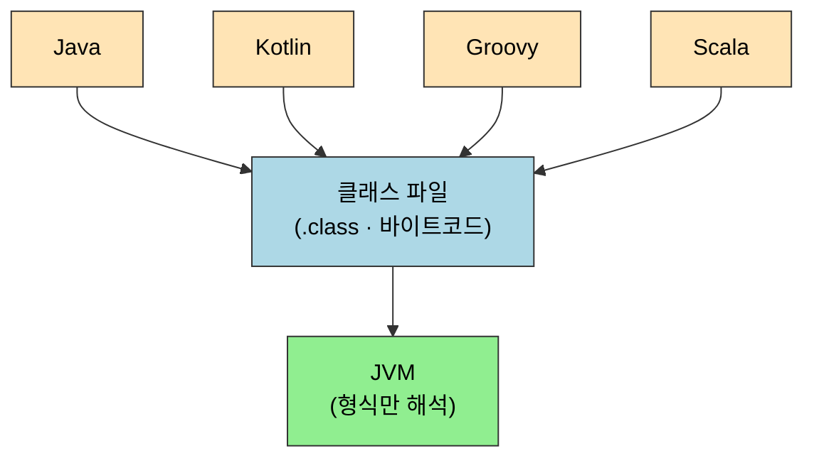
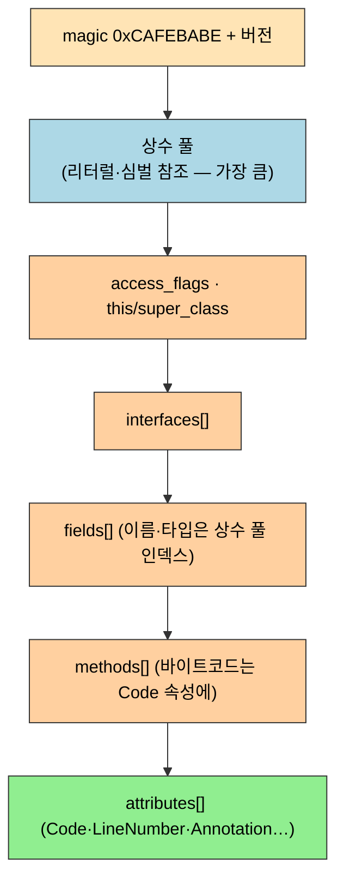

# 클래스 파일 구조
---
> §6.1~§6.3은 자바 소스가 컴파일된 `.class` 파일이 *바이트 단위로 어떻게 짜여 있는가*를 봅니다. 본 절을 한 줄로 압축하면 — **클래스 파일은 `0xCAFEBABE`로 시작하는 엄격한 순서의 바이트 스트림이며, 상수 풀을 중심으로 접근 플래그·필드·메서드·속성이 정해진 자리에 차곡차곡 박힌 구조**입니다. 이 구조가 *언어·플랫폼 독립*의 초석입니다 — JVM은 자바가 아니라 *이 형식*을 읽습니다.

이 글을 읽고 나면 `.class` 파일의 ClassFile 구조를 순서대로 말하고, 상수 풀이 왜 모든 참조의 중심인지 설명하며, `javap`로 떠낸 바이트를 magic·버전·접근 플래그 단위로 해석할 수 있습니다.


## 1. 들어가며 — JVM은 자바를 모른다

> 클래스 파일은 *특정 언어의 산출물*이 아니라 *JVM이 읽는 표준 형식*입니다. 이 분리가 플랫폼·언어 독립을 만듭니다.

이 개념은 [01-01 JDK 구조와 바이트코드](../ch01_java-tech/01-01.JDK%20구조와%20바이트코드.md)에서 본 "바이트코드가 중간 표현"이라는 발상의 *형식 명세*에 해당합니다. JVM은 자바 문법을 모르고 `.class` 형식만 압니다 — 그래서 같은 형식으로 컴파일되기만 하면 어떤 언어든 JVM 위에서 돕니다.


## 2. 플랫폼·언어 독립을 향한 초석

> §6.2. 클래스 파일은 *두 가지 독립*의 토대입니다. OS·CPU에 무관한 플랫폼 독립과, 자바가 아닌 언어도 도는 언어 독립.

자바가 "Write Once, Run Anywhere"를 이룬 핵심은 소스를 기계어가 아니라 *중립적인 클래스 파일*로 컴파일한 데 있습니다. JVM이 각 플랫폼마다 이 형식을 해석하므로, 같은 `.class`가 Windows·Linux·macOS에서 똑같이 돕니다(플랫폼 독립).

여기서 한 걸음 더 나아간 것이 언어 독립입니다. 클래스 파일 형식만 맞추면 컴파일러의 입력 언어는 자바가 아니어도 됩니다.



Kotlin·Groovy·Scala가 모두 JVM 위에서 도는 이유가 이것입니다 — 각 언어의 컴파일러가 *자바 클래스 파일 형식*으로 떨어뜨리기만 하면, JVM은 그게 무슨 언어였는지 묻지 않습니다.


## 3. 클래스 파일의 구조

> §6.3. 클래스 파일은 *순서와 크기가 고정된* 바이트 스트림입니다. 구분자도 공백도 없어, 무엇이 몇 바이트인지가 형식으로 못박혀 있습니다.

### 무부호 정수와 테이블

클래스 파일은 두 가지 자료형으로만 쓰입니다. *무부호 정수* `u1`·`u2`·`u4`·`u8`(각 1·2·4·8바이트)과, 이들을 묶은 *테이블*입니다. 텍스트가 아니라 바이트 나열이라, "여기부터 2바이트가 버전" 식으로 위치가 곧 의미입니다.

### ClassFile 전체 구조

책 §6.3이 제시하는 클래스 파일의 최상위 구조는 다음과 같습니다. 위에서 아래로 *정확히 이 순서*로 박힙니다.

```
ClassFile {
    u4             magic;                 // 0xCAFEBABE — 클래스 파일임을 알리는 매직 넘버
    u2             minor_version;         // 부 버전
    u2             major_version;         // 주 버전 (JDK 버전 대응)
    u2             constant_pool_count;   // 상수 풀 크기 (+1 됨, 아래 설명)
    cp_info        constant_pool[constant_pool_count-1];  // 상수 풀
    u2             access_flags;          // 접근 플래그 (public·final·interface…)
    u2             this_class;            // 이 클래스 (상수 풀 인덱스)
    u2             super_class;           // 부모 클래스 (상수 풀 인덱스)
    u2             interfaces_count;      // 구현 인터페이스 수
    u2             interfaces[interfaces_count];          // 인터페이스 (상수 풀 인덱스 배열)
    u2             fields_count;          // 필드 수
    field_info     fields[fields_count];  // 필드 테이블
    u2             methods_count;         // 메서드 수
    method_info    methods[methods_count];// 메서드 테이블
    u2             attributes_count;      // 속성 수
    attribute_info attributes[attributes_count];          // 속성 테이블
}
```

이 순서를 위에서 아래로 흐르는 바이트 스트림으로 그리면, 상수 풀이 앞쪽을 크게 차지하고 나머지가 그 인덱스를 참조하는 그림이 됩니다.



`magic`이 `0xCAFEBABE`인 이유는 *파일 확장자가 아니라 내용으로* 클래스 파일임을 식별하기 위함입니다. 확장자는 위조되기 쉬우므로, JVM은 첫 4바이트가 이 매직 넘버인지부터 확인합니다.

### 상수 풀 — 모든 참조의 중심

상수 풀(constant pool)은 클래스가 쓰는 *리터럴·심벌 참조*를 모은 테이블이라, 뒤따르는 접근 플래그·필드·메서드가 이름·타입을 *인덱스로* 가리킵니다. 그래서 상수 풀이 클래스 파일에서 가장 크고 핵심적인 영역입니다.

`constant_pool_count`가 *실제 개수 +1*인 까닭이 자주 헷갈리는 지점입니다. 인덱스 0은 "어떤 상수도 가리키지 않음"을 표현하려고 비워 두므로, 유효 인덱스는 1부터 시작합니다. 따라서 항목이 N개면 count는 N+1입니다.

각 상수는 `u1 tag`로 종류를 구분합니다. 예를 들어 UTF-8 문자열 상수는 다음 구조입니다.

```
CONSTANT_Utf8_info {
    u1 tag;            // 1 (CONSTANT_Utf8)
    u2 length;         // 바이트 길이
    u1 bytes[length];  // 수정된 UTF-8 바이트
}
```

태그로 종류를 가르는 상수에는 클래스(`CONSTANT_Class`)·필드 참조(`CONSTANT_Fieldref`)·메서드 참조(`CONSTANT_Methodref`)·문자열·정수·실수 등이 있고, 동적 호출을 위한 `CONSTANT_MethodHandle`·`CONSTANT_MethodType`·`CONSTANT_InvokeDynamic`도 여기 포함됩니다.

### 접근 플래그

`access_flags`는 클래스의 수식어를 비트로 표현한 `u2`입니다. 여러 수식어를 OR로 합쳐 한 값에 담습니다.

| 플래그 | 값 | 의미 |
|--------|-----|------|
| `ACC_PUBLIC` | `0x0001` | public |
| `ACC_FINAL` | `0x0010` | final (클래스) |
| `ACC_SUPER` | `0x0020` | invokespecial 의미 보정 (JDK 1.0.2+ 항상 설정) |
| `ACC_INTERFACE` | `0x0200` | 인터페이스 |
| `ACC_ABSTRACT` | `0x0400` | abstract |
| `ACC_SYNTHETIC` | `0x1000` | 컴파일러가 생성(소스에 없음) |
| `ACC_ANNOTATION` | `0x2000` | 애너테이션 |
| `ACC_ENUM` | `0x4000` | 열거형 |
| `ACC_MODULE` | `0x8000` | 모듈 |

비트 OR로 합치는 이유는 한 클래스가 *여러 수식어를 동시에* 가지기 때문입니다. 예를 들어 `public final class`면 `0x0001 | 0x0010 = 0x0011`이 됩니다.

### 필드·메서드 테이블

`field_info`·`method_info`는 같은 모양입니다 — 각자 접근 플래그·이름 인덱스·디스크립터 인덱스·속성 테이블을 가집니다. 이름과 타입을 *직접 문자열로* 두지 않고 *상수 풀 인덱스*로 가리키는 게 핵심입니다. 같은 이름·타입이 여러 번 나와도 상수 풀에 한 번만 저장하고 인덱스만 재사용해, 파일 크기를 줄입니다.

메서드의 *실제 바이트코드*는 `method_info` 자체가 아니라 그 안의 **Code 속성**에 들어갑니다. 메서드 시그니처와 본문을 분리한 구조입니다.

### 속성 테이블

속성(attribute)은 클래스·필드·메서드에 붙는 *부가 정보*를 담는 확장 지점입니다. 가장 중요한 건 **Code 속성**으로, 메서드의 바이트코드·최대 스택 깊이·지역 변수 수·예외 테이블을 담습니다. 그 밖에 `LineNumberTable`(소스 줄 ↔ 바이트코드 매핑), `LocalVariableTable`, `RuntimeVisibleAnnotations`(런타임 보이는 애너테이션), `Module`·`ModulePackages`·`ModuleMainClass`(모듈 정보) 등 수십 종이 있습니다.

속성이 *테이블로 열린 구조*인 이유는, JVM 버전이 올라가며 새 정보(모듈·애너테이션·람다 등)를 *기존 구조를 깨지 않고* 추가하기 위함입니다. 모르는 속성은 JVM이 건너뛰면 되므로 하위 호환이 유지됩니다.


## 4. 면접 대비 요약

> ClassFile 구조를 *magic → 버전 → 상수 풀 → 접근 플래그 → 필드 → 메서드 → 속성* 순으로 말하고, 상수 풀이 왜 중심인지 답할 수 있으면 합격선입니다.

### 한 줄 정의

클래스 파일이란 *`0xCAFEBABE`로 시작하는, 순서와 크기가 고정된 바이트 스트림이며, 상수 풀을 중심으로 클래스의 메타데이터와 바이트코드를 담는 JVM의 표준 입력 형식*입니다.

### 핵심 포인트 3가지

1. JVM은 자바가 아니라 *클래스 파일 형식*을 읽습니다. 그래서 Kotlin·Groovy·Scala도 같은 형식으로 컴파일되면 JVM에서 돕니다(언어 독립).
2. 상수 풀이 중심입니다. 접근 플래그·필드·메서드가 이름·타입을 *상수 풀 인덱스*로 가리켜 중복을 없앱니다. `constant_pool_count`는 인덱스 0을 비워 두므로 실제 개수 +1입니다.
3. 메서드의 바이트코드는 `method_info`가 아니라 그 안의 *Code 속성*에 들어갑니다. 속성 테이블은 하위 호환을 위한 확장 지점입니다.

### 면접에서 받을 만한 질문

1. JVM이 클래스 파일을 식별하는 첫 4바이트는? 왜 확장자가 아니라 그걸 보는가?
2. `constant_pool_count`가 실제 상수 개수보다 1 큰 이유는?
3. 메서드의 실제 바이트코드는 클래스 파일 어디에 들어가는가?
4. 클래스 파일 형식이 언어 독립을 어떻게 가능하게 하는가?

> 위 4개 질문에 *먼저 스스로 답해 보고* 아래 §정답으로 내려갑니다. 자답 없이 먼저 읽으면 학습 효과가 0입니다.


## 정답 (자답 후 펼치기)

> 위 §면접에서 받을 만한 질문 의 4개에 *먼저 자답한 뒤* 아래를 읽습니다.

### 정답 1 — 매직 넘버

첫 4바이트 `0xCAFEBABE`입니다. 확장자(`.class`)는 위조·변경이 쉬워 신뢰할 수 없으므로, JVM은 *내용의 첫 4바이트*가 이 매직 넘버인지로 클래스 파일임을 확인합니다.

### 정답 2 — count가 +1인 이유

인덱스 0을 "어떤 상수도 가리키지 않음"이라는 특수 의미로 비워 두기 때문입니다. 유효 상수는 인덱스 1부터 시작하므로, 항목이 N개면 `constant_pool_count`는 N+1이 됩니다.

### 정답 3 — 바이트코드 위치

`method_info`가 직접 담지 않고, 그 안의 **Code 속성**에 들어갑니다. Code 속성은 바이트코드와 함께 최대 스택 깊이·지역 변수 수·예외 테이블도 담습니다. 시그니처와 본문이 분리된 구조입니다.

### 정답 4 — 언어 독립

클래스 파일은 *특정 언어의 산출물*이 아니라 JVM이 읽는 *중립 형식*입니다. 컴파일러가 이 형식으로만 떨어뜨리면 입력 언어가 무엇이든 JVM은 묻지 않으므로, Kotlin·Groovy·Scala 같은 다른 언어도 JVM 위에서 돕니다.


## 관련 문서

> 클래스 파일의 *정적 구조*를 봤다면, 그 안 Code 속성에 담긴 바이트코드 *명령어*가 다음 편입니다. 바이트코드가 중간 표현이라는 큰 그림은 1장 개관에 있습니다.

- [01-02. 바이트코드 명령어](01-02.바이트코드%20명령어.md) § "Code 속성" — 본 편의 Code 속성에 담기는 바이트코드 명령어 집합
- [01-01. JDK 구조와 바이트코드](../ch01_java-tech/01-01.JDK%20구조와%20바이트코드.md) — 바이트코드가 중간 표현이라는 개관(부 요약 흡수본)
- [01-02. 가상 머신 실행 서브시스템](../ch01_java-tech/01-02.가상%20머신%20실행%20서브시스템.md) — 이 클래스 파일을 로딩·실행하는 다음 단계(7~8장 흡수본)
