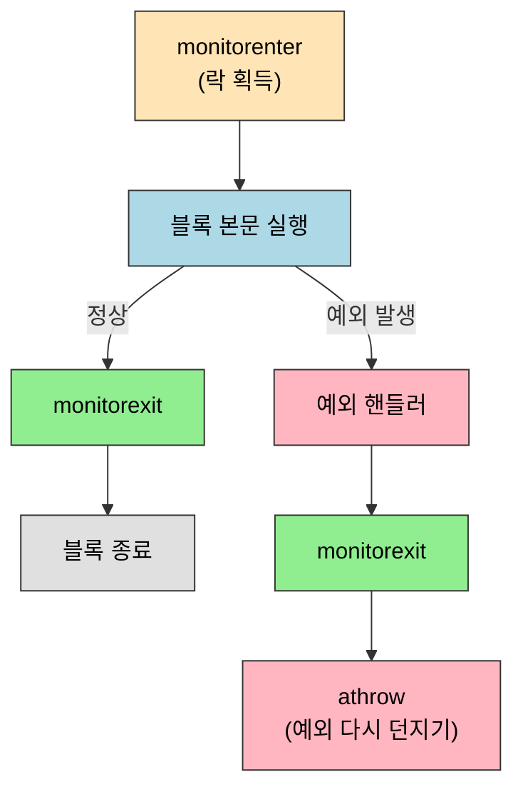

# 바이트코드 명령어
---
> §6.4~§6.5는 [02-01](02-01.클래스%20파일%20구조.md)의 Code 속성에 담기는 *바이트코드 명령어 집합*을 본다. 본 절을 한 줄로 압축하면 — **바이트코드는 피연산자 스택을 밀고 당기는 1바이트 옵코드의 나열이며, 명령어 이름의 첫 글자가 자료형(i·l·f·d·a)을 나타내고, 객체 생성·메서드 호출·예외·동기화까지 모두 정해진 옵코드로 떨어진다**. 레지스터가 아니라 *스택 기반*이라는 점이 x86 어셈블리와 가장 다른 지점이다.

이 글을 읽고 나면 `iadd`·`invokevirtual` 같은 옵코드를 자료형·기능별로 분류해 읽고, `synchronized`가 `monitorenter`/`monitorexit`로, 예외 처리가 예외 테이블로 컴파일되는 과정을 바이트코드 수준에서 설명할 수 있다.


## 1. 들어가며 — 스택 기반 명령어

> 바이트코드는 레지스터가 아니라 *피연산자 스택*으로 계산한다. 명령어가 스택을 밀고 당기며 결과를 쌓는다.

이 개념은 [01-02 가상 머신 실행 서브시스템](../ch01_java-tech/01-02.가상%20머신%20실행%20서브시스템.md)에서 본 *스택 프레임의 피연산자 스택*이 실제로 무엇을 하는가의 명세다. x86 같은 레지스터 기반 ISA는 "레지스터 A와 B를 더해 C에 넣어라"지만, 바이트코드는 "스택 위 두 값을 꺼내 더한 결과를 다시 스택에 얹어라"다. 옵코드가 1바이트라 종류는 256개로 제한되며, 그래서 명령어 설계가 *조밀하고 규칙적*이다.


## 2. 자료형과 명령어 — 첫 글자가 타입이다

> §6.4. 대부분의 산술·로드/저장 명령어는 *자료형별로 따로* 있고, 이름 첫 글자가 그 타입을 나타낸다.

바이트코드 명령어의 큰 특징은 *자료형이 옵코드에 박혀 있다*는 점이다. 같은 "더하기"라도 int면 `iadd`, long이면 `ladd`, float면 `fadd`, double이면 `dadd`로 옵코드가 갈린다. 명령어 이름의 첫 글자가 자료형을 가리키는 규칙이다.

| 첫 글자 | 자료형 | 예 (load / add) |
|---------|--------|------------------|
| `i` | int | `iload` / `iadd` |
| `l` | long | `lload` / `ladd` |
| `f` | float | `fload` / `fadd` |
| `d` | double | `dload` / `dadd` |
| `a` | reference (객체 참조) | `aload` / — |

자료형별로 옵코드를 나눈 이유는 *JVM이 스택 위 값의 타입을 따로 추적하지 않기 위해서*다. `iadd`는 "스택 위 두 값을 int로 더하라"라고 옵코드 자체가 타입을 못박으므로, 런타임에 타입 검사를 할 필요가 없어 실행이 빠르다. 단 모든 자료형에 모든 명령어가 있는 건 아니라, `byte`·`short`·`char`·`boolean`은 대부분 `int` 명령어로 처리하고 필요할 때만 형변환한다.


## 3. 기능별 명령어 묶음

> §6.4. 옵코드는 기능으로 묶으면 여덟 갈래다 — 로드/저장·산술·형변환·객체·스택관리·제어전이·메서드호출·예외/동기화.

명령어를 기능으로 묶으면 바이트코드 한 메서드가 어떻게 굴러가는지 한눈에 잡힌다.

```mermaid
flowchart TB
    ls["로드/저장<br/>iload·istore·aload"] --> calc["산술·형변환<br/>iadd·imul·i2l"]
    calc --> stack["피연산자 스택 관리<br/>pop·dup·swap"]
    stack --> obj["객체·배열<br/>new·getfield·instanceof"]
    obj --> ctrl["제어 전이<br/>ifeq·goto·tableswitch"]
    ctrl --> call["메서드 호출<br/>invokevirtual·invokedynamic"]
    call --> exc["예외·동기화<br/>athrow·monitorenter"]

    style ls fill:#ADD8E6,stroke:#333,color:#000
    style calc fill:#ADD8E6,stroke:#333,color:#000
    style stack fill:#FFE4B5,stroke:#333,color:#000
    style obj fill:#FFD0A0,stroke:#333,color:#000
    style ctrl fill:#FFD0A0,stroke:#333,color:#000
    style call fill:#FFD0A0,stroke:#333,color:#000
    style exc fill:#90EE90,stroke:#333,color:#000
```

### 객체·배열 생성과 접근

객체 생성은 `new`, 배열은 `newarray`(원시 타입)·`anewarray`(참조 타입)다. 필드 접근은 인스턴스 필드 `getfield`/`putfield`, 정적 필드 `getstatic`/`putstatic`으로 나뉜다. 타입 검사는 `instanceof`·`checkcast`다. 객체와 배열을 다른 옵코드로 가르는 이유는 메모리 배치와 길이 정보 유무가 다르기 때문이다.

### 피연산자 스택 관리

스택 자체를 조작하는 명령어로 `pop`(버리기)·`dup`(복제)·`swap`(맞바꾸기)이 있다. 예를 들어 `new`로 만든 객체 참조를 생성자 호출과 변수 저장 *둘 다*에 써야 할 때, `dup`으로 참조를 복제해 한 부는 `invokespecial`(생성자)에 쓰고 한 부는 `astore`에 쓴다.

### 메서드 호출

호출 대상에 따라 다섯 옵코드로 갈린다.

| 옵코드 | 호출 대상 |
|--------|-----------|
| `invokevirtual` | 인스턴스 메서드 (가상 디스패치) |
| `invokespecial` | 생성자·private·super 메서드 (정적 바인딩) |
| `invokestatic` | 정적 메서드 |
| `invokeinterface` | 인터페이스 메서드 |
| `invokedynamic` | 런타임에 호출 대상 결정 (람다·동적 언어) |

`invokedynamic`이 따로 있는 이유는 람다·동적 언어처럼 *컴파일 시점에 호출 대상을 못 박을 수 없는* 경우를 위해서다. [02-01](02-01.클래스%20파일%20구조.md)의 상수 풀에 있던 `CONSTANT_InvokeDynamic`·`CONSTANT_MethodHandle`이 이 옵코드와 짝을 이룬다.


## 4. 예외 처리 — 예외 테이블

> §6.4. `try-catch`는 명령어가 아니라 *예외 테이블*로 구현된다. 점프가 아니라 "이 범위에서 이 예외가 나면 저 핸들러로"라는 표다.

자바의 `try-catch`는 별도 분기 명령어로 컴파일되지 않는다. 대신 Code 속성 안의 *예외 테이블*에 `[from, to, target, type]` 행으로 박힌다 — "바이트코드 `from`~`to` 구간에서 `type` 예외가 나면 `target` 위치 핸들러로 점프하라"는 뜻이다.

```
Exception table:
   from    to  target  type
      4     16      19  any
```

예외를 표로 둔 이유는 *정상 경로에 분기 비용을 얹지 않기 위해서*다. 예외가 안 나면 테이블은 무시되고 정상 바이트코드만 쭉 실행된다. 예외가 났을 때만 JVM이 테이블을 뒤져 매칭되는 핸들러로 보낸다. 명시적 `throw`는 `athrow` 옵코드로 컴파일된다.


## 5. 동기화 — monitorenter / monitorexit

> §6.4. `synchronized` 블록은 `monitorenter`·`monitorexit` 한 쌍으로 컴파일되며, 예외가 나도 락이 풀리도록 예외 테이블이 보강된다.

`synchronized(obj) { ... }`는 진입에서 `monitorenter`, 정상 종료에서 `monitorexit`로 떨어진다. 핵심은 *예외로 빠져나갈 때도 락이 반드시 풀려야* 한다는 점이다. 그래서 컴파일러는 블록 본문을 감싸는 예외 핸들러를 추가로 깔아, 예외가 나면 그 핸들러가 `monitorexit`를 호출하고 다시 `athrow`로 예외를 던진다.

```
// synchronized(this) { ... } 의 바이트코드 골격
aload_0
dup
astore_1
monitorenter            // 락 획득
  ... 본문 ...
aload_1
monitorexit             // 정상 경로 락 해제
goto  (정상 종료)
  ... (예외 핸들러) ...
aload_1
monitorexit             // 예외 경로에서도 락 해제
athrow                  // 예외 다시 던지기
```

두 경로가 모두 `monitorexit`를 거치도록 갈라지는 모습을 그리면 다음과 같다.



`monitorenter` 하나에 `monitorexit`가 *둘* 나오는 게 흔한데, 하나는 정상 경로, 하나는 예외 경로용이다. 이 구조 덕분에 `synchronized`는 어떤 경로로 블록을 빠져나가도 락을 남기지 않는다 — 자바에서 락 해제를 깜빡할 수 없는 이유가 이 컴파일 규칙에 있다.


## 6. 면접 대비 요약

> 바이트코드를 *스택 기반·타입 prefix·기능 8묶음*으로 말하고, `synchronized`/예외가 어떻게 컴파일되는지 답할 수 있으면 합격선이다.

### 한 줄 정의

바이트코드 명령어란 *피연산자 스택을 밀고 당기는 1바이트 옵코드의 집합으로, 이름 첫 글자가 자료형을 나타내며 객체·호출·예외·동기화까지 정해진 옵코드로 표현하는 JVM의 실행 언어*다.

### 핵심 포인트 3가지

1. 스택 기반이다. 레지스터가 아니라 피연산자 스택에서 값을 꺼내 계산하고 결과를 다시 얹는다. 옵코드 첫 글자(i·l·f·d·a)가 자료형을 나타낸다.
2. 메서드 호출은 다섯 옵코드로 갈린다. `invokedynamic`은 람다·동적 언어처럼 *컴파일 시점에 대상을 못 박을 수 없는* 호출용이다.
3. `try-catch`는 분기가 아니라 *예외 테이블*로, `synchronized`는 `monitorenter`/`monitorexit` 쌍 + 예외 경로 락 해제로 컴파일된다.

### 면접에서 받을 만한 질문

1. 바이트코드가 레지스터 기반이 아니라 스택 기반인 게 어떤 차이를 만드는가?
2. `iadd`와 `ladd`가 따로 있는 이유는?
3. `invokedynamic`은 왜 따로 있는가? 다른 invoke와 무엇이 다른가?
4. `synchronized` 블록의 바이트코드에 `monitorexit`가 보통 둘인 이유는?

> 위 4개 질문에 *먼저 스스로 답해 보고* 아래 §정답으로 내려간다. 자답 없이 먼저 읽으면 학습 효과가 0이다.


## 정답 (자답 후 펼치기)

> 위 §면접에서 받을 만한 질문 의 4개에 *먼저 자답한 뒤* 아래를 읽는다.

### 정답 1 — 스택 기반의 차이

레지스터 기반은 "레지스터 A·B를 더해 C에"처럼 피연산자를 명시하지만, 스택 기반은 "스택 위 두 값을 더해 도로 얹어라"로 피연산자가 암묵적이다. 덕분에 옵코드가 짧고(피연산자 지정이 적음) 플랫폼의 실제 레지스터 수에 무관해 *이식성*이 높다. 대신 같은 계산에 명령어 수는 더 많아진다.

### 정답 2 — iadd vs ladd

JVM이 스택 위 값의 타입을 런타임에 따로 추적하지 않기 때문이다. 옵코드 자체가 "이건 int 덧셈"·"이건 long 덧셈"이라고 타입을 못 박으므로, 타입 검사 없이 바로 실행돼 빠르다. 그래서 자료형마다 옵코드가 갈린다.

### 정답 3 — invokedynamic

다른 invoke(`virtual`·`special`·`static`·`interface`)는 호출 대상이 *컴파일 시점에 정해지지만*, `invokedynamic`은 런타임에 부트스트랩 메서드를 통해 대상을 결정한다. 람다 표현식이나 JVM 위 동적 언어처럼 컴파일 시점에 대상을 못 박을 수 없는 호출을 위해 도입됐다.

### 정답 4 — monitorexit가 둘인 이유

하나는 정상 종료 경로, 하나는 예외 경로용이다. `synchronized`는 어떤 경로로 블록을 빠져나가도 락을 풀어야 하므로, 컴파일러가 본문을 감싸는 예외 핸들러를 깔아 예외 시에도 `monitorexit` 후 `athrow`하도록 만든다. 그래서 `monitorenter` 하나에 `monitorexit`가 둘이 된다.


## 관련 문서

> 명령어는 클래스 파일의 Code 속성 안에 산다(02-01). 이 명령어를 JIT가 기계어로 바꾸는 과정은 4부 컴파일에서 다룬다.

- [02-01. 클래스 파일 구조](02-01.클래스%20파일%20구조.md) § "속성 테이블" — 본 명령어가 담기는 Code 속성과 상수 풀(invokedynamic 짝)
- [01-02. 가상 머신 실행 서브시스템](../ch01_java-tech/01-02.가상%20머신%20실행%20서브시스템.md) — 이 명령어를 해석·실행하는 스택 프레임·디스패치(7~8장 흡수본)
- [01-03. 컴파일과 최적화](../ch01_java-tech/01-03.컴파일과%20최적화.md) — 바이트코드를 기계어로 바꾸는 JIT(4부 흡수본)
