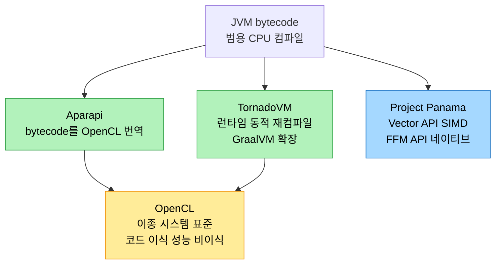
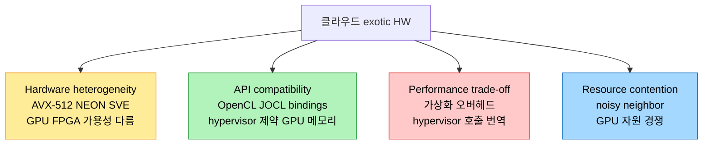

# Exotic Hardware와 JVM — 클라우드·툴체인

## 1. 들어가며 — 범용 CPU를 넘어서는 가속기

> JVM은 본래 bytecode를 CPU 머신코드로 컴파일하는 범용 컴퓨팅 플랫폼이다. 그러나 GPU·FPGA 같은 "exotic hardware"가 부상하면서, JVM이 그 특수 하드웨어용 코드를 만들어 활용할 길을 열어야 했다.

GPU, FPGA, 그리고 TPU·ASIC·AI 칩 같은 가속기를 흔히 exotic hardware라 부른다. 머신러닝과 복잡한 데이터 처리를 위해 만들어졌지만 그 쓸모는 거기에 그치지 않으며, 특히 GPU는 견줄 데 없는 병렬 연산 능력으로 데이터 집약적 Java 작업을 가속한다. JVM은 역사적으로 bytecode를 CPU 머신코드로 컴파일하는 범용 컴퓨팅과 결부됐고, 같은 bytecode가 JVM 구현이 있는 어느 기기에서나 돈다는 이식성을 줬다.

그러나 exotic hardware의 부상은 새 기회와 도전을 함께 가져왔다. CPU에도 Intel의 AVX512나 Arm의 SVE 같은 특수 명령 집합이 있지만, 가속기는 딥러닝에 필수인 대규모 행렬 연산이나 특화 연산을 따로 한다. 이를 온전히 쓰려면 JVM이 그런 하드웨어에서 효율적으로 도는 머신코드로 bytecode를 컴파일할 수 있어야 한다. 그래서 JVM과 특수 하드웨어 사이를 잇는 새 언어 기능·API·툴체인이 나왔는데, Project Panama의 Vector API가 벡터 연산을 표현하는 예다. 다만 메모리 접근 패턴 관리, 하드웨어별 동작 이해, 플랫폼 이질성 탓에 이 일은 결코 단순하지 않다.

## 2. 핵심 개념과 프로젝트

이 적응을 떠받친 개념과 프로젝트는 다음과 같다.

| 이름 | 성격 |
|------|------|
| OpenCL | 이종 시스템(CPU·GPU)의 병렬 프로그래밍 오픈 표준. 코드는 이식되나 성능은 비이식(같은 코드도 GPU에선 빠르고 일부 FPGA에선 느림) |
| Aparapi | 데이터 병렬 워크로드 표현 Java API. Java bytecode를 OpenCL로 번역해 GPU 등에서 실행 |
| TornadoVM | OpenJDK GraalVM 확장. 런타임에 bytecode를 하드웨어 타겟별로 동적 재컴파일·최적화. 코드 변경 없이 GPU·FPGA에 적응 |
| Project Panama | JVM과 네이티브 코드의 상호운용 개선. Vector API와 FFM API 두 축 |

OpenCL은 노드 안 이종 컴퓨팅을 위한 통합 표준이지만, 코드의 이식성과 성능의 이식성은 다르다. 같은 OpenCL 코드라도 실행하는 하드웨어에 따라 효율이 크게 달라진다. Project Panama는 JVM과 네이티브 코드의 상호운용을 개선하는 진행 중 프로젝트로, 런타임에 최적 벡터 하드웨어 명령으로 컴파일되는 Vector API와, 다른 언어 루틴을 호출하고 네이티브 라이브러리와 상호작용하는 Foreign Function and Memory(FFM) API 두 영역에 집중한다.

## 3. 클라우드의 Exotic Hardware

> 과거에는 exotic hardware를 쓰려면 물리 하드웨어에 선투자해야 했다. 클라우드는 그 장벽을 없앴지만, 가상화는 하드웨어 이질성·API 호환·보안·자원 경쟁이라는 새 도전을 함께 들였다.

예전에는 exotic hardware의 힘을 빌리려면 물리 하드웨어에 큰 선투자가 필요해, 자원이 제한된 개발자·조직에는 만만찮은 장벽이었다. 클라우드 혁명이 이를 바꿔, AWS·Google Cloud·Azure·Oracle Cloud가 GPU와 가속기를 갖춘 VM을 내놓으면서 선투자 없이 유연하게 쓸 수 있게 됐다. 가상화 복잡성을 다루려고 많은 클라우드는 GPU가 필요한 호스트를 물리 하드웨어에 하나만 배치해 그 GPU를 전용·독점으로 쓰게 한다.

### 하드웨어 이질성

클라우드의 하드웨어는 저마다 다른 기능을 가진다. Arm 기기에는 암호 연산을 가속하는 가속기가 있고, Intel의 AVX-512는 SIMD 벡터 레지스터 폭을 512비트로 넓혀 더 많은 데이터를 병렬 처리한다. Arm은 v7·v8용 SIMD인 NEON과, CPU 설계자가 128에서 2048비트까지 128비트 단위로 SIMD 벡터 길이를 고르게 하는 SVE를 둔다. GPU·FPGA·가속기도 클라우드마다 가용성이 다르다. 이 이질성 때문에 소프트웨어와 런타임은 사용 중인 하드웨어에 따라 다른 최적화 경로를 타며 적응해야 한다.

### API 호환과 hypervisor 제약

특수 하드웨어는 특수 API를 요구한다. GPU 범용 연산(GPGPU)용 OpenCL이 그 예인데, 하드웨어에 무관하도록 설계된 JVM은 이를 네이티브로 지원하지 않으므로 Java bindings for OpenCL(JOCL) 같은 라이브러리가 간극을 메운다. 클라우드의 hypervisor는 VM 자원을 관리·격리해 보안과 안정을 주지만 API 호환에 제약을 더한다. CUDA나 OpenCL의 메모리 관리는 GPU 메모리에 직접 접근해야 하는데 hypervisor가 이를 온전히 지원하지 않을 수 있다. 보안도 문제다. 전통 hypervisor와 IOMMU가 호스트 간 메모리 누수를 막지만 GPU는 그 scope 밖이라, 가상화 환경임을 모르는 GPU 드라이버가 kernel dispatch 사이에 메모리를 resident로 두어 데이터 격리가 우려된다. GPGPU는 영향이 더 크기에 호스트 하나만 GPU에 접근하게 하는 것이 중요하다.

### 성능 trade-off와 자원 경쟁

가상화 하드웨어는 양날의 검이다. 유연성·확장성·격리를 주지만, hypervisor가 guest OS의 호출을 host 하드웨어로 번역하는 가상화 오버헤드가 특수 하드웨어의 이점을 상쇄할 수 있다. GPU 가속 머신러닝이 GPU 가상화 오버헤드 탓에 기대한 speed-up을 못 낼 수도 있다. 공유 환경은 또 "noisy neighbor" 문제를 낳는다. 같은 물리 서버에서 여러 사용자가 GPU 집약 작업을 돌리면 GPU 자원 경쟁으로 성능이 들쭉날쭉해진다. 게다가 클라우드는 VM당 자원을 제한하고 특정 하드웨어를 특정 region이나 instance type에만 두는데, Google Cloud의 NVIDIA A100을 지원하는 A2 VM이 일부 region에만 있는 식이다. 산업과 연구는 API 표준화와 하드웨어 무관 프로그래밍 모델로 이를 풀어 왔고, OpenCL이 노드 안 통합 표준을, 노드 간 통신은 MPI가 맡는다.

## 4. 언어 설계와 툴체인의 역할

> exotic hardware를 효과적으로 쓰려면 언어와 툴체인이 함께 적응해야 한다. 추상화·컴파일러·런타임·상호운용·라이브러리 다섯 축이다.

exotic hardware를 효과적으로 쓰려면 언어 설계와 툴체인이 새 요구에 맞춰 바뀌어야 한다. 프로그래밍 언어는 다양한 하드웨어에서 효율적으로 도는 코드를 짜게 하는 직관적 고수준 추상화를 제공해 병렬성을 표현해야 하는데, Project Panama의 Vector API가 벡터화 가능한 연산을 표현하는 예다. 툴체인의 컴파일러는 그 고수준 추상화를 효율적인 저수준 코드로 번역하며, TornadoVM 컴파일러는 OpenCL·CUDA·SPIR-V를 생성하고 FPGA·RISC-V 벡터 명령·Apple M1/M2 칩에 최적화된 코드를 만들어 NVIDIA Jetson 같은 IoT 기기부터 PC·클라우드까지 아우른다.

런타임 시스템은 다양한 하드웨어의 연산을 관리·스케줄링해야 한다. 이미지 처리를 생각하면, 같은 필터라도 이미지를 작은 block으로 나눠 처리하는 게 효율적일 수도 큰 연속 chunk로 처리하는 게 나을 수도 있어, 데이터 전송 오버헤드를 줄이고 하드웨어를 온전히 쓰도록 능숙하게 스케줄링해야 한다. 상호운용을 위해서는 Project Panama의 FFI(Foreign Function Interface) 같은 메커니즘으로 Java 코드가 네이티브 라이브러리와 어우러지게 하고, 라이브러리는 하드웨어 아키텍처별로 특화돼 같은 코드라도 하드웨어에 따라 큰 성능 차를 낸다. Aparapi의 설계는 병렬성을 표현하는 언어 추상화의 필요에서, TornadoVM은 다양한 하드웨어의 연산을 관리·스케줄링하는 런타임의 필요에서 영향을 받았다.

## 5. 면접 대비 요약

### 한 줄 정의

exotic hardware(GPU·FPGA·가속기)를 JVM에서 쓰려면 OpenCL·Aparapi·TornadoVM·Project Panama 같은 API·툴체인이 필요하고, 클라우드에서는 하드웨어 이질성·API 호환·가상화 오버헤드·자원 경쟁이라는 도전을 함께 다뤄야 한다.

### 핵심 포인트 3가지

1. **JVM은 본래 범용** — bytecode를 CPU 머신코드로 컴파일해 이식성을 주지만, 가속기를 쓰려면 그 하드웨어용 코드를 만들 API·툴체인이 필요하다. Vector API·OpenCL·CUDA가 그 다리다.
2. **OpenCL은 코드는 이식, 성능은 비이식** — 같은 OpenCL 코드라도 GPU에선 빠르고 일부 FPGA에선 느리다. 그래서 하드웨어별 최적화 경로가 필요하다.
3. **클라우드의 네 도전** — 하드웨어 이질성(AVX-512·SVE), API 호환(JOCL·hypervisor 제약·GPU 메모리 보안), 성능 trade-off(가상화 오버헤드), 자원 경쟁(noisy neighbor)이다.

### 면접에서 받을 만한 질문

1. JVM이 exotic hardware를 직접 쓰기 어려운 근본 이유는?
2. OpenCL의 "코드 이식성"과 "성능 이식성"은 어떻게 다른가?
3. 클라우드에서 GPU 메모리 관리에 어떤 보안 우려가 있는가?
4. SIMD 관점에서 AVX-512와 Arm SVE는 어떻게 다른가?
5. exotic hardware를 쓰려면 언어·툴체인이 적응해야 하는 다섯 축은?

## 정답 (자답 후 펼치기)

### 정답 1 — JVM과 exotic hardware

JVM은 본래 bytecode를 CPU 머신코드로 컴파일하는 범용 컴퓨팅 플랫폼으로 설계됐다. 같은 bytecode가 어느 기기에서나 돌게 하려고 하드웨어에 무관하게 만들어졌기 때문에, GPU·FPGA처럼 대규모 행렬 연산이나 특화 연산을 하는 가속기를 네이티브로 지원하지 않는다. 그 하드웨어를 쓰려면 bytecode를 그 하드웨어용 머신코드로 컴파일할 API와 툴체인이 따로 필요하다.

### 정답 2 — 코드 vs 성능 이식성

코드 이식성은 같은 코드가 여러 하드웨어에서 *실행되는* 것이고, 성능 이식성은 그 코드가 여러 하드웨어에서 *비슷한 효율을 내는* 것이다. OpenCL 코드는 여러 하드웨어에서 실행되므로 코드 이식성은 있지만, 효율은 하드웨어에 따라 크게 달라 성능 이식성은 없다. 예컨대 같은 OpenCL 코드가 commodity GPU에서는 순차 코드보다 훨씬 빠르지만 일부 FPGA에서는 더 느릴 수 있다.

### 정답 3 — GPU 메모리 보안

전통 hypervisor와 IOMMU는 호스트 간에 일반 메모리가 새는 것을 막지만, GPU는 그 scope 밖에 있는 경우가 많다. GPU 드라이버가 가상화 환경임을 모른 채 kernel dispatch 사이에 메모리를 resident로 유지하기 때문에, 한 호스트가 쓴 데이터가 다른 호스트로부터 진짜 격리되는지 우려가 생긴다. GPGPU에서는 GPU가 일반 연산까지 하므로 데이터 누수의 파급이 더 크고, 그래서 호스트 하나만 GPU에 접근하게 하는 것이 중요하다.

### 정답 4 — AVX-512 vs SVE

AVX-512는 SIMD 벡터 레지스터 폭을 512비트로 고정해 한 번에 처리하는 데이터 양을 늘린다. Arm SVE는 폭을 고정하지 않고 CPU 설계자가 128비트에서 2048비트까지 128비트 단위로 벡터 길이를 고르게 한다. 즉 AVX-512는 고정 폭, SVE는 가변 폭이라는 점이 핵심 차이로, SVE는 같은 코드가 다양한 벡터 길이의 하드웨어에 적응하도록 설계됐다.

### 정답 5 — 다섯 축

language abstractions(병렬성을 표현하는 고수준 추상화), compiler optimizations(고수준을 하드웨어별 효율 저수준 코드로 번역), runtime systems(다양한 하드웨어의 연산 관리·스케줄링), interoperability(FFI로 네이티브 라이브러리와 상호운용), library support(하드웨어 아키텍처별 특화 라이브러리)다.

## 관련 문서

- [`./01-02.케이스 스터디와 Project Panama`](./01-02.케이스%20스터디와%20Project%20Panama.md) — 같은 장 후반부: LWJGL·Aparapi·Sumatra·TornadoVM·Vector/FFM API
- [`../ch14_jpe-evolution/01-01.Java와 JVM의 성능 진화사`](../ch14_jpe-evolution/01-01.Java와%20JVM의%20성능%20진화사.md) — JVM이 bytecode를 CPU 머신코드로 컴파일하는 범용 모델
- [`../ch15_jpe-type-system/01-01.타입 시스템의 진화와 성능`](../ch15_jpe-type-system/01-01.타입%20시스템의%20진화와%20성능.md) — Vector API와 Project Valhalla
- [`../ch04_compilation-optimization/03-01.시동 가속 — CDS·AOT·Leyden·GraalVM·CRaC`](../ch04_compilation-optimization/03-01.시동%20가속%20—%20CDS·AOT·Leyden·GraalVM·CRaC.md) — TornadoVM이 확장한 GraalVM
- [`../README`](../README.md) — JVM 학습 인덱스
